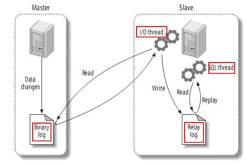
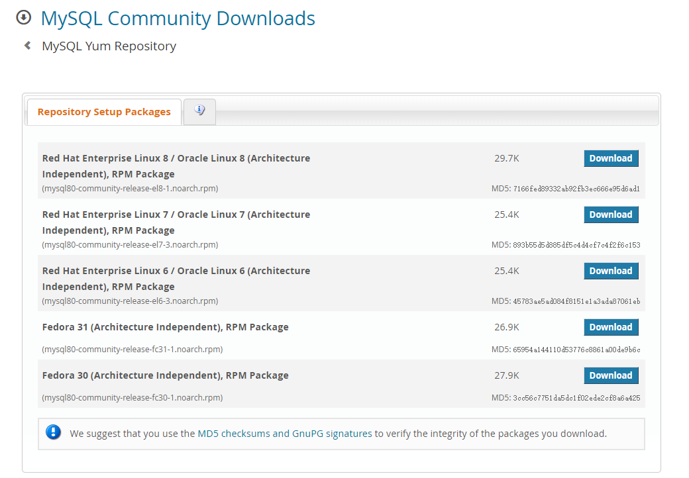
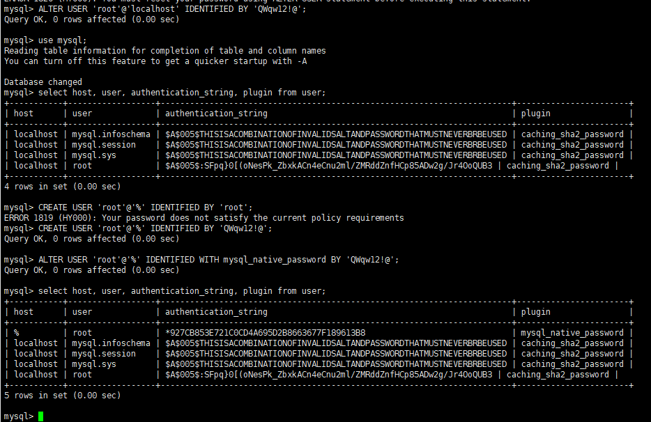
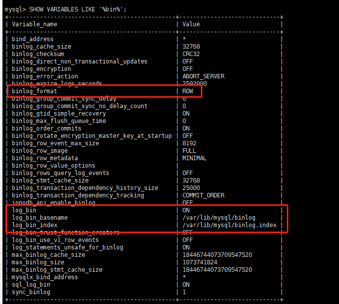
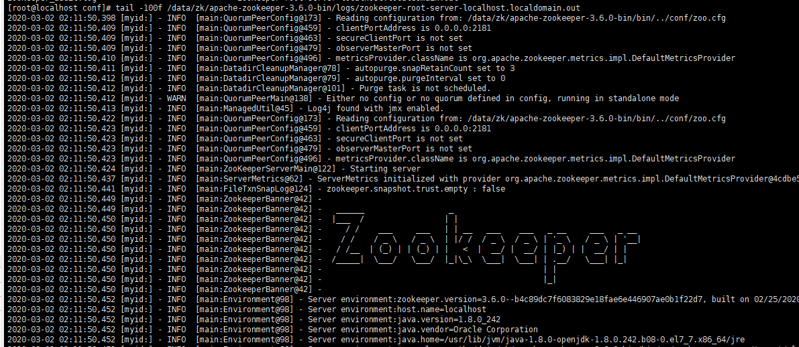
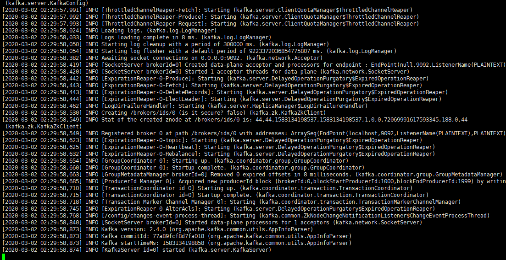
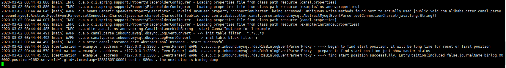
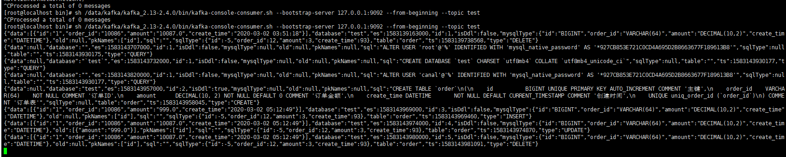
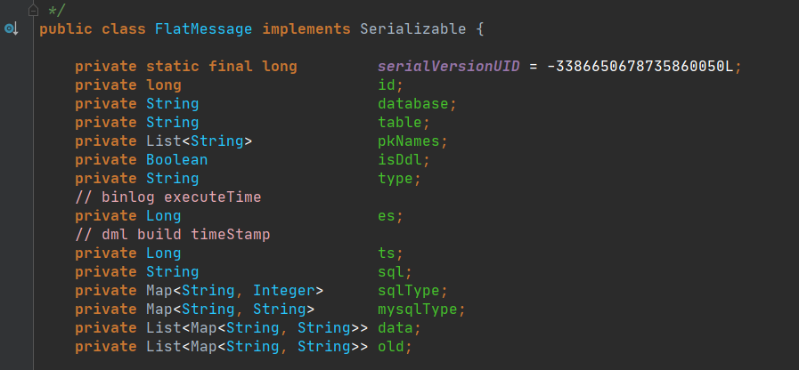

# 基于Canal和Kafka实现MySQL的Binlog近实时同步

> [原文链接](https://throwx.cn/2020/03/07/canal-kafka-mysql-binlog-sync-guide)

## 前提

近段时间，业务系统架构基本完备，数据层面的建设比较薄弱，因为笔者目前工作重心在于搭建一个小型的数据平台。优先级比较高的一个任务就是需要近实时同步业务系统的数据（包括保存、更新或者软删除）到一个另一个数据源，持久化之前需要清洗数据并且构建一个相对合理的便于后续业务数据统计、标签系统构建等扩展功能的数据模型。基于当前团队的资源和能力，优先调研了`Alibaba`开源中间件`Canal`的使用。


这篇文章简单介绍一下如何快速地搭建一套`Canal`相关的组件。

## 关于Canal

简单介绍一下中间件`Canal`的背景和原理。

### 简介

下面的简介和下一节的原理均来自于[Canal](https://github.com/alibaba/canal)项目的`README`：


`Canal[kə'næl]`，译意为水道/管道/沟渠，主要用途是基于`MySQL`数据库增量日志解析，提供增量数据订阅和消费。`Canal`按照音标的正确读音和"磕尿"相近，而不是很多人认为的`Can Nal`，**笔者曾因此事被开发小姐姐嘲笑**。早期阿里巴巴因为杭州和美国双机房部署，存在跨机房同步的业务需求，实现方式主要是基于业务`trigger`获取增量变更。从 2010 年开始，业务逐步尝试数据库日志解析获取增量变更进行同步，由此衍生出了大量的数据库增量订阅和消费业务。

基于日志增量订阅和消费的业务包括：

- 数据库镜像。
- 数据库实时备份。
- 索引构建和实时维护（拆分异构索引、倒排索引等）。
- 业务`Cache`刷新。
- 带业务逻辑的增量数据处理。

### Canal的工作原理

`MySQL`主备复制原理：



- `MySQL`的`Master`实例将数据变更写入二进制日志（`binary log`，其中记录叫做二进制日志事件`binary log events`，可以通过`show binlog events`进行查看）
- `MySQL`的`Slave`实例将`master`的`binary log events`拷贝到它的中继日志（`relay log`）
- `MySQL`的`Slave`实例重放`relay log`中的事件，将数据变更反映它到自身的数据

`Canal`的工作原理如下：

- `Canal`模拟`MySQL Slave`的交互协议，伪装自己为`MySQL Slave`，向`MySQL Master`发送`dump`协议
- `MySQL Master`收到`dump`请求，开始推送`binary log`给`Slave`（即`Canal`）
- `Canal`解析`binary log`对象（原始为`byte`流），并且可以通过连接器发送到对应的消息队列等中间件中

### 关于Canal的版本和部件

截止笔者开始编写本文的时候（`2020-03-05`），`Canal`的最新发布版本是`v1.1.5-alpha-1`（`2019-10-09`发布的），最新的正式版是`v1.1.4`（`2019-09-02`发布的）。其中，`v1.1.4`主要添加了鉴权、监控的功能，并且做了一些列的性能优化，此版本集成的连接器是`Tcp`、`Kafka`和`RockerMQ`。而`v1.1.5-alpha-1`版本已经新增了`RabbitMQ`连接器，但是此版本的`RabbitMQ`连接器暂时不能定义连接`RabbitMQ`的端口号，不过此问题已经在`master`分支中修复（具体可以参看源码中的`CanalRabbitMQProducer`类的提交记录）。换言之，`v1.1.4`版本中目前能使用的内置连接器只有`Tcp`、`Kafka`和`RockerMQ`三种，如果想尝鲜使用`RabbitMQ`连接器，可以选用下面的两种方式之一：

- 选用`v1.1.5-alpha-1`版本，但是无法修改`RabbitMQ`的`port`属性，默认为`5672`。
- 基于`master`分支自行构建`Canal`。

目前，`Canal`项目的活跃度比较高，但是考虑到功能的稳定性问题，笔者建议选用稳定版本在生产环境中实施，当前可以选用`v1.1.4`版本，**本文的例子用选用的就是`v1.1.4`版本，配合`Kafka`连接器使用**。`Canal`主要包括三个核心部件：

- `canal-admin`：后台管理模块，提供面向`WebUI`的`Canal`管理能力。
- `canal-adapter`：适配器，增加客户端数据落地的适配及启动功能，包括`REST`、日志适配器、关系型数据库的数据同步（表对表同步）、`HBase`数据同步、`ES`数据同步等等。
- `canal-deployer`：发布器，核心功能所在，包括`binlog`解析、转换和发送报文到连接器中等等功能都由此模块提供。

一般情况下，`canal-deployer`部件是必须的，其他两个部件按需选用即可。

## 部署所需的中间件

搭建一套可以用的组件需要部署`MySQL`、`Zookeeper`、`Kafka`和`Canal`四个中间件的实例，下面简单分析一下部署过程。选用的虚拟机系统是`CentOS7`。

### 安装MySQL

为了简单起见，选用`yum`源安装（官方链接是`https://dev.mysql.com/downloads/repo/yum`）：



mysql80-community-release-el7-3虽然包名带了mysql80关键字，其实已经集成了MySQL主流版本5.6、5.7和8.x等等的最新安装包仓库

选用的是最新版的`MySQL8.x`社区版，下载`CentOS7`适用的`rpm包`：

```shell
cd /data/mysql
wget https://dev.mysql.com/get/mysql80-community-release-el7-3.noarch.rpm
// 下载完毕之后
sudo rpm -Uvh mysql80-community-release-el7-3.noarch.rpm
```

此时列举一下`yum`仓库里面的`MySQL`相关的包：

```shell
[root@localhost mysql]# yum repolist all | grep mysql
mysql-cluster-7.5-community/x86_64 MySQL Cluster 7.5 Community   disabled
mysql-cluster-7.5-community-source MySQL Cluster 7.5 Community - disabled
mysql-cluster-7.6-community/x86_64 MySQL Cluster 7.6 Community   disabled
mysql-cluster-7.6-community-source MySQL Cluster 7.6 Community - disabled
mysql-cluster-8.0-community/x86_64 MySQL Cluster 8.0 Community   disabled
mysql-cluster-8.0-community-source MySQL Cluster 8.0 Community - disabled
mysql-connectors-community/x86_64  MySQL Connectors Community    enabled:    141
mysql-connectors-community-source  MySQL Connectors Community -  disabled
mysql-tools-community/x86_64       MySQL Tools Community         enabled:    105
mysql-tools-community-source       MySQL Tools Community - Sourc disabled
mysql-tools-preview/x86_64         MySQL Tools Preview           disabled
mysql-tools-preview-source         MySQL Tools Preview - Source  disabled
mysql55-community/x86_64           MySQL 5.5 Community Server    disabled
mysql55-community-source           MySQL 5.5 Community Server -  disabled
mysql56-community/x86_64           MySQL 5.6 Community Server    disabled
mysql56-community-source           MySQL 5.6 Community Server -  disabled
mysql57-community/x86_64           MySQL 5.7 Community Server    disabled
mysql57-community-source           MySQL 5.7 Community Server -  disabled
mysql80-community/x86_64           MySQL 8.0 Community Server    enabled:    161
mysql80-community-source           MySQL 8.0 Community Server -  disabled
```

编辑`/etc/yum.repos.d/mysql-community.repo`文件（`[mysql80-community]`块中`enabled设置为1`，其实默认就是这样子，不用改，如果要选用`5.x`版本则需要修改对应的块）：

```shell
[mysql80-community]
name=MySQL 8.0 Community Server
baseurl=http://repo.mysql.com/yum/mysql-8.0-community/el/7/$basearch/
enabled=1
gpgcheck=1
gpgkey=file:///etc/pki/rpm-gpg/RPM-GPG-KEY-mysql
```

然后安装`MySQL`服务：

```shell
sudo yum install mysql-community-server
```

这个过程比较漫长，因为需要下载和安装5个`rpm`安装包（或者是所有安装包组合的压缩包`mysql-8.0.18-1.el7.x86_64.rpm-bundle.tar`）。如果网络比较差，也可以直接从官网手动下载后安装：


```shell
// 下载下面5个rpm包 common --> libs --> libs-compat --> client --> server
mysql-community-common
mysql-community-libs
mysql-community-libs-compat
mysql-community-client
mysql-community-server

// 强制安装
rpm -ivh mysql-community-common-8.0.18-1.el7.x86_64.rpm --force --nodeps
rpm -ivh mysql-community-libs-8.0.18-1.el7.x86_64.rpm --force --nodeps
rpm -ivh mysql-community-libs-compat-8.0.18-1.el7.x86_64.rpm --force --nodeps
rpm -ivh mysql-community-client-8.0.18-1.el7.x86_64.rpm --force --nodeps
rpm -ivh mysql-community-server-8.0.18-1.el7.x86_64.rpm --force --nodeps
```

安装完毕之后，启动`MySQL`服务，然后搜索`MySQL`服务的`root`账号的临时密码用于首次登陆（`mysql -u root -p`）：

```shell
// 启动服务，关闭服务就是service mysqld stop
service mysqld start
// 查看临时密码 cat /var/log/mysqld.log
[root@localhost log]# cat /var/log/mysqld.log 
2020-03-02T06:03:53.996423Z 0 [System] [MY-013169] [Server] /usr/sbin/mysqld (mysqld 8.0.18) initializing of server in progress as process 22780
2020-03-02T06:03:57.321447Z 5 [Note] [MY-010454] [Server] A temporary password is generated for root@localhost: >kjYaXENK6li
2020-03-02T06:04:00.123845Z 0 [System] [MY-010116] [Server] /usr/sbin/mysqld (mysqld 8.0.18) starting as process 22834
// 登录临时root用户，使用临时密码
[root@localhost log]# mysql -u root -p
```

接下来做下面的操作：

- 修改`root`用户的密码：`ALTER USER 'root'@'localhost' IDENTIFIED BY 'QWqw12!@';`（注意密码规则必须包含大小写字母、数字和特殊字符）
- 更新`root`的`host`，切换数据库`use mysql;`，指定`host`为`%`以便可以让其他服务器远程访问`UPDATE USER SET HOST = '%' WHERE USER = 'root';`
- 赋予`'root'@'%'`用户，所有权限，执行`GRANT ALL PRIVILEGES ON *.* TO 'root'@'%';`
- 改变`root'@'%`用户的密码校验规则以便可以使用`Navicat`等工具访问：`ALTER USER 'root'@'%' IDENTIFIED WITH mysql_native_password BY 'QWqw12!@';`



操作完成之后，就可以使用`root`用户远程访问此虚拟机上的`MySQL`服务。最后确认是否开启了`binlog`（注意一点是`MySQL8.x`默认开启`binlog`）`SHOW VARIABLES LIKE '%bin%';`：



最后在`MySQL`的`Shell`执行下面的命令，新建一个用户名`canal`密码为`QWqw12!@`的新用户，赋予`REPLICATION SLAVE`和 `REPLICATION CLIENT`权限：

```shell
CREATE USER canal IDENTIFIED BY 'QWqw12!@';
GRANT SELECT, REPLICATION SLAVE, REPLICATION CLIENT ON *.* TO 'canal'@'%';
FLUSH PRIVILEGES;
ALTER USER 'canal'@'%' IDENTIFIED WITH mysql_native_password BY 'QWqw12!@';
```

切换回去`root`用户，创建一个数据库`test`：

```sql
CREATE DATABASE `test` CHARSET `utf8mb4` COLLATE `utf8mb4_unicode_ci`;
```

### 安装Zookeeper

`Canal`和`Kafka`集群都依赖于`Zookeeper`做服务协调，为了方便管理，一般会独立部署`Zookeeper`服务或者`Zookeeper`集群。笔者这里选用`2020-03-04`发布的`3.6.0`版本：

```shell
midkr /data/zk
# 创建数据目录
midkr /data/zk/data
cd /data/zk
wget http://mirror.bit.edu.cn/apache/zookeeper/zookeeper-3.6.0/apache-zookeeper-3.6.0-bin.tar.gz
tar -zxvf apache-zookeeper-3.6.0-bin.tar.gz
cd apache-zookeeper-3.6.0-bin/conf
cp zoo_sample.cfg zoo.cfg && vim zoo.cfg
```

把`zoo.cfg`文件中的`dataDir`设置为`/data/zk/data`，然后启动`Zookeeper`：

```shell
[root@localhost conf]# sh /data/zk/apache-zookeeper-3.6.0-bin/bin/zkServer.sh start
/usr/bin/java
ZooKeeper JMX enabled by default
Using config: /data/zk/apache-zookeeper-3.6.0-bin/bin/../conf/zoo.cfg
Starting zookeeper ... STARTED
```

这里注意一点，要启动此版本的`Zookeeper`服务必须本地安装好`JDK8+`，这一点需要自行处理。启动的默认端口是`2181`，启动成功后的日志如下：



### 安装Kafka

`Kafka`是一个高性能分布式消息队列中间件，它的部署依赖于`Zookeeper`。笔者在此选用`2.4.0`并且`Scala`版本为`2.13`的安装包：

```shell
mkdir /data/kafka
mkdir /data/kafka/data
wget http://mirrors.tuna.tsinghua.edu.cn/apache/kafka/2.4.0/kafka_2.13-2.4.0.tgz
tar -zxvf kafka_2.13-2.4.0.tgz
```

由于解压后`/data/kafka/kafka_2.13-2.4.0/config/server.properties`配置中对应的`zookeeper.connect=localhost:2181`已经符合需要，不必修改，需要修改日志文件的目录`log.dirs`为`/data/kafka/data`。然后启动`Kafka`服务：

```shell
sh /data/kafka/kafka_2.13-2.4.0/bin/kafka-server-start.sh /data/kafka/kafka_2.13-2.4.0/config/server.properties
```



这样启动一旦退出控制台就会结束`Kafka`进程，可以添加`-daemon`参数用于控制`Kafka`进程后台不挂断运行。

```shell
sh /data/kafka/kafka_2.13-2.4.0/bin/kafka-server-start.sh -daemon /data/kafka/kafka_2.13-2.4.0/config/server.properties
```

### 安装和使用Canal

终于到了主角登场，这里选用`Canal`的`v1.1.4`稳定发布版，只需要下载`deployer`模块：

```shell
mkdir /data/canal
cd /data/canal
# 这里注意一点，Github在国内被墙，下载速度极慢，可以先用其他下载工具下载完再上传到服务器中
wget https://github.com/alibaba/canal/releases/download/canal-1.1.4/canal.deployer-1.1.4.tar.gz
tar -zxvf canal.deployer-1.1.4.tar.gz
```

解压后的目录如下：

```shell
- bin   # 运维脚本
- conf  # 配置文件
  canal_local.properties  # canal本地配置，一般不需要动
  canal.properties        # canal服务配置
  logback.xml             # logback日志配置
  metrics                 # 度量统计配置
  spring                  # spring-实例配置，主要和binlog位置计算、一些策略配置相关，可以在canal.properties选用其中的任意一个配置文件
  example                 # 实例配置文件夹，一般认为单个数据库对应一个独立的实例配置文件夹
    instance.properties   # 实例配置，一般指单个数据库的配置
- lib   # 服务依赖包
- logs  # 日志文件输出目录
```

在开发和测试环境建议把`logback.xml`的日志级别修改为`DEBUG`方便定位问题。这里需要关注`canal.properties`和`instance.properties`两个配置文件。`canal.properties`文件中，需要修改：

- 去掉`canal.instance.parser.parallelThreadSize = 16`这个配置项的**注释**，也就是启用此配置项，和实例解析器的线程数相关，不配置会表现为阻塞或者不进行解析。
- `canal.serverMode`配置项指定为`kafka`，可选值有`tcp`、`kafka`和`rocketmq`（`master`分支或者最新的的`v1.1.5-alpha-1`版本，可以选用`rabbitmq`），默认是`kafka`。
- `canal.mq.servers`配置需要指定为`Kafka`服务或者集群`Broker`的地址，这里配置为`127.0.0.1:9092`。

> canal.mq.servers在不同的canal.serverMode有不同的意义。
> kafka模式下，指Kafka服务或者集群Broker的地址，也就是bootstrap.servers
> rocketmq模式下，指NameServer列表
> rabbitmq模式下，指RabbitMQ服务的Host和Port

其他配置项可以参考下面两个官方`Wiki`的链接：

- [Canal-Kafka-RocketMQ-QuickStart](https://github.com/alibaba/canal/wiki/Canal-Kafka-RocketMQ-QuickStart)
- [AdminGuide](https://github.com/alibaba/canal/wiki/AdminGuide)

`instance.properties`一般指一个数据库实例的配置，`Canal`架构支持一个`Canal`服务实例，处理多个数据库实例的`binlog`异步解析。`instance.properties`需要修改的配置项主要包括：

- `canal.instance.mysql.slaveId`需要配置一个和`Master`节点的服务`ID`完全不同的值，这里笔者配置为`654321`。

- 配置数据源实例，包括地址、用户、密码和目标数据库：

  - `canal.instance.master.address`，这里指定为`127.0.0.1:3306`。
  - `canal.instance.dbUsername`，这里指定为`canal`。
  - `canal.instance.dbPassword`，这里指定为`QWqw12!@`。
  - 新增`canal.instance.defaultDatabaseName`，这里指定为`test`（需要在`MySQL`中建立一个`test`数据库，见前面的流程）。

- `Kafka`相关配置，这里暂时使用静态`topic`和单个`partition`：
  - `canal.mq.topic`，这里指定为`test`，**也就是解析完的`binlog`结构化数据会发送到`Kafka`的命名为`test`的`topic`中**。
  - `canal.mq.partition`，这里指定为`0`。

配置工作做好之后，可以启动`Canal`服务：

```shell
sh /data/canal/bin/startup.sh 
# 查看服务日志
tail -100f /data/canal/logs/canal/canal
# 查看实例日志  -- 一般情况下，关注实例日志即可
tail -100f /data/canal/logs/example/example.log
```

启动正常后，见实例日志如下：



在`test`数据库创建一个订单表，并且执行几个简单的`DML`：

```sql
use `test`;

CREATE TABLE `order`
(
    id          BIGINT UNIQUE PRIMARY KEY AUTO_INCREMENT COMMENT '主键',
    order_id    VARCHAR(64)    NOT NULL COMMENT '订单ID',
    amount      DECIMAL(10, 2) NOT NULL DEFAULT 0 COMMENT '订单金额',
    create_time DATETIME       NOT NULL DEFAULT CURRENT_TIMESTAMP COMMENT '创建时间',
    UNIQUE uniq_order_id (`order_id`)
) COMMENT '订单表';

INSERT INTO `order`(order_id, amount) VALUES ('10086', 999);
UPDATE `order` SET amount = 10087 WHERE order_id = '10086';
DELETE  FROM `order` WHERE order_id = '10086';
```

这个时候，可以利用`Kafka`的`kafka-console-consumer`或者`Kafka Tools`查看`test`这个`topic`的数据：

```shell
sh /data/kafka/kafka_2.13-2.4.0/bin/kafka-console-consumer.sh --bootstrap-server 127.0.0.1:9092 --from-beginning --topic test
```



具体的数据如下：

```shell
// test数据库建库脚本
{"data":null,"database":"`test`","es":1583143732000,"id":1,"isDdl":false,"mysqlType":null,"old":null,"pkNames":null,"sql":"CREATE DATABASE `test` CHARSET `utf8mb4` COLLATE `utf8mb4_unicode_ci`","sqlType":null,"table":"","ts":1583143930177,"type":"QUERY"}

// order表建表DDL
{"data":null,"database":"test","es":1583143957000,"id":2,"isDdl":true,"mysqlType":null,"old":null,"pkNames":null,"sql":"CREATE TABLE `order`\n(\n    id          BIGINT UNIQUE PRIMARY KEY AUTO_INCREMENT COMMENT '主键',\n    order_id    VARCHAR(64)    NOT NULL COMMENT '订单ID',\n    amount      DECIMAL(10, 2) NOT NULL DEFAULT 0 COMMENT '订单金额',\n    create_time DATETIME       NOT NULL DEFAULT CURRENT_TIMESTAMP COMMENT '创建时间',\n    UNIQUE uniq_order_id (`order_id`)\n) COMMENT '订单表'","sqlType":null,"table":"order","ts":1583143958045,"type":"CREATE"}

// INSERT Binlog事件
{"data":[{"id":"1","order_id":"10086","amount":"999.0","create_time":"2020-03-02 05:12:49"}],"database":"test","es":1583143969000,"id":3,"isDdl":false,"mysqlType":{"id":"BIGINT","order_id":"VARCHAR(64)","amount":"DECIMAL(10,2)","create_time":"DATETIME"},"old":null,"pkNames":["id"],"sql":"","sqlType":{"id":-5,"order_id":12,"amount":3,"create_time":93},"table":"order","ts":1583143969460,"type":"INSERT"}

// UPDATE Binlog事件
{"data":[{"id":"1","order_id":"10086","amount":"10087.0","create_time":"2020-03-02 05:12:49"}],"database":"test","es":1583143974000,"id":4,"isDdl":false,"mysqlType":{"id":"BIGINT","order_id":"VARCHAR(64)","amount":"DECIMAL(10,2)","create_time":"DATETIME"},"old":[{"amount":"999.0"}],"pkNames":["id"],"sql":"","sqlType":{"id":-5,"order_id":12,"amount":3,"create_time":93},"table":"order","ts":1583143974870,"type":"UPDATE"}

// DELETE Binlog事件
{"data":[{"id":"1","order_id":"10086","amount":"10087.0","create_time":"2020-03-02 05:12:49"}],"database":"test","es":1583143980000,"id":5,"isDdl":false,"mysqlType":{"id":"BIGINT","order_id":"VARCHAR(64)","amount":"DECIMAL(10,2)","create_time":"DATETIME"},"old":null,"pkNames":["id"],"sql":"","sqlType":{"id":-5,"order_id":12,"amount":3,"create_time":93},"table":"order","ts":1583143981091,"type":"DELETE"}
```

可见`Kafka`的名为`test`的`topic`已经写入了对应的结构化`binlog`事件数据，可以编写消费者监听`Kafka`对应的`topic`然后对获取到的数据进行后续处理。这里发送过来的数据结构可以参考一下`Canal`源码（当前编辑的时间为`2020-07-03`的`master`分支）中的`com.alibaba.otter.canal.protocol.FlatMessage`：



其中注意一下：

- `FlatMessage.data`是当前的`DML`新写入的数据，而`FlatMessage.old`是当前新写入数据前的历史数据，对于`UPDATE`类型的`DML`来说，`FlatMessage.data`和`FlatMessage.old`都会存在数据。
- `FlatMessage.sqlType`的`Map.Entry#value()`一般情况下和`java.sql.JDBCType`这个枚举的映射一致，解析的时候可以匹配每一个`Column`属性的`JDBCType`，再按照需要转化成合适的`Java`类型即可。
- 为了提高传输效率，`Canal`发送到消息中间件的时候会进行消息合并，一个`FlatMessage`有可能包含同一类事件的多条不同的更变记录，注意到`FlatMessage.data`是`List<Map<String, String>>`类型，例如对于同一个表的`INSERT`事件，有可能合并到同一个`FlatMessage`实例，而`FlatMessage.data`中包含两个元素。
- `Canal`发送到`FlatMessage`的时候，使用`FastJson`进行序列化，最近一段时间看到很多关于`FastJson`的漏洞相关的信息，需要做好心理准备进行版本升级。

## 小结

这篇文章大部分篇幅用于介绍其他中间件是怎么部署的，这个问题侧面说明了`Canal`本身部署并不复杂，它的配置文件属性项比较多，但是实际上需要自定义和改动的配置项是比较少的，也就是说明了它的运维成本和学习成本并不高。

笔者目前担任架构、部分运维职责和数据中心的搭建工作，前一段时间主导把整套线上服务由`UCloud`迁移到阿里云，并且应用了云`RDS MySQL`，同时自建了一套`Canal`的`HA`集群，用于订阅核心服务的数据，经过轻量级`ETL`和清洗，落入一个持续建模的数据仓库中，基于近实时的`Binlog`事件进行一些实时缓存的计算和更新，生成一些视图表对接`Metabase`提供多种维度的图标用于运营指标的实时监控。这个过程中，踩了相对多的坑。解析`Canal`生成的`Binlog`事件在前期花费了大量的时间，考虑到开发效率低下，笔者花了点时间写了一个`Binlog`事件解析的胶水层，实现了无感知的对象映射功能，解放了生产力。下一篇文章会分析一下这个`Binlog`事件解析工具的实现，后面还会分享一下遇到的问题以及解决方案，包括：`Canal`停启的异常（如果用了云`RDS MySQL`，这个坑比较大）以及`Binlog`事件顺序的问题等等。

参考资料：

- [A Quick Guide to Using the MySQL Yum Repository](https://dev.mysql.com/doc/mysql-yum-repo-quick-guide/en/)
- [Canal](https://github.com/alibaba/canal)