# Canal v1.1.4版本搭建HA集群

> [原文链接](https://www.throwx.cn/2020/08/24/canal-ha-cluster-guide)

## 前提

`Canal`上一个正式版是于`2019-9-2`发布的`v1.1.4`，笔者几个月前把这个版本的`Canal`推上了生产环境，部署了`HA`集群。过程中虽然遇到不少的坑，但是在不出问题的前提下，`Canal`的作用还是非常明显的。上周的一次改造上线之后，去掉了原来对业务系统订单数据通过`RabbitMQ`实时推送的依赖，下游的统计服务完全通过上游业务主库的`binlog`事件进行聚合，从而实现了核心业务和实时统计两个不同的模块解耦。

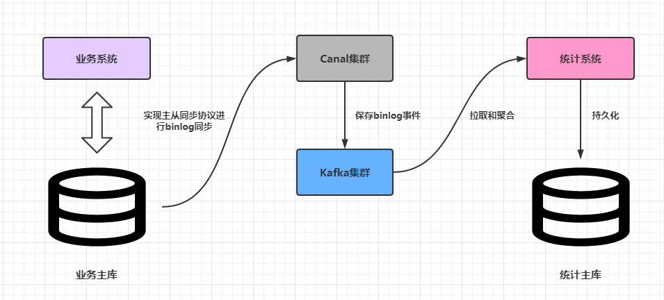

这篇文章简单分析一下如何搭建生产环境下可靠的`Canal`高可用集群。

## Canal高可用集群架构

`Canal`的`HA`其实包含了服务端`HA`和客户端的`HA`，两者的实现原理差不多，都是通过`Zookeeper`实例标识某个特定路径下抢占`EPHEMERAL`（临时）节点的方式进行控制，抢占成功的一者会作为运行节点（状态为`running`），而抢占失败的一方会作为备用节点（状态是`standby`）。下文只分析服务端`HA`集群搭建，因为一般情况下使用内建的数据管道例如`Kafka`，基本屏蔽了客户端的细节。假设客户端使用了`Kafka`，也就是`Canal`从主库同步到的`binlog`事件最终会投放到`Kafka`，那么`Canal`服务端`HA`集群架构大致如下：

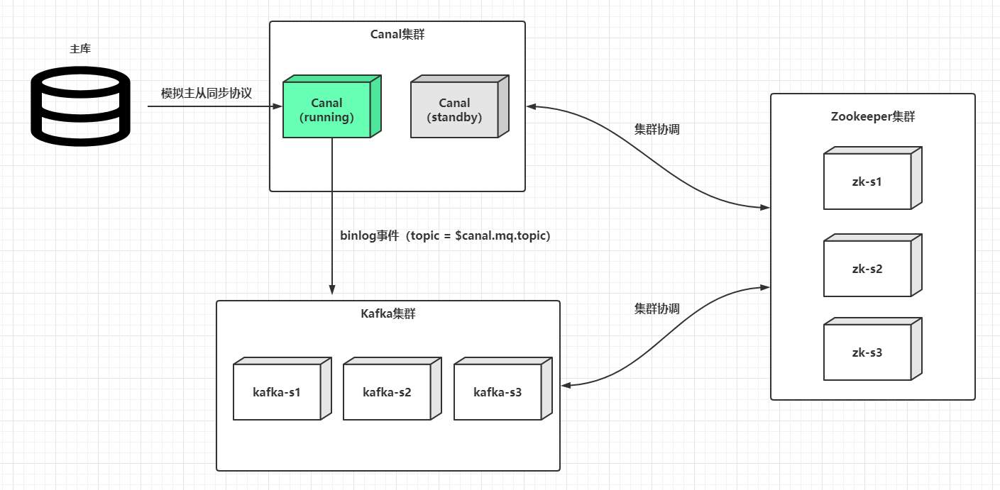

这是全局来看，而一个运行的`Canal`服务端，可以同时支持监听多个上游数据库的`binlog`，某个主库解析配置的抽象在`Canal`中的术语叫做`Instance`（实例）：

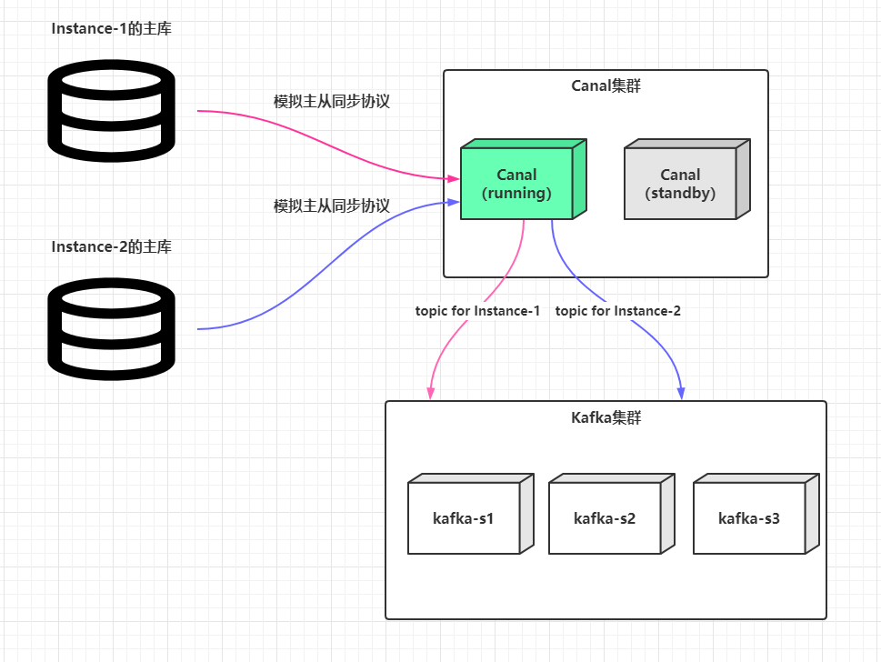

定义多个`Instance`的操作很简单，主配置文件`$CANAL_HOME/conf/canal.properties`中的`canal.destinations`配置项通过英文逗号分隔多个标识如：

```shell
# canal.destinations=[Instance标识1,Instance标识2...,Instance标识n]
canal.destinations=customer-service,payment-service
```

然后在`$CANAL_HOME/conf`目录下添加`customer-service`和`payment-service`文件夹，把原来的`$CANAL_HOME/conf/example`文件夹中的`instance.properties`拷贝过去，按需修改里面的配置即可：

```shell
$CANAL_HOME
  - conf
    - customer-service
      - instance.properties  # 这里主要配置customer-service主库的连接信息、过滤规则和目标topic的配置等等
        配置 【canal.mq.topic = customer-service】
    - payment-service
      - instance.properties  # 这里主要配置payment-service主库的连接信息和过滤规则和目标topic的配置等等
        配置 【canal.mq.topic = payment-service】
```

而`Canal`最终解析好的`binlog`事件会分别以`topic`为`customer-service`或`payment-service`发送到`Kafka`集群中，这样就能确保不同数据源解析出来的`binlog`不会混乱。

> Canal会实时监听每个Instance的配置文件instance.properties的变动，一旦发现配置文件有属性项变更，会进行一次热加载，原则上变更Instance的配置文件是不用重启Canal服务的。

## 搭建Canal高可用集群

> 为了简单起见，Zookeeper和Kafka使用单节点作为示例，实际上生产环境中建议Zookeeper或Kafka都使用奇数个（>=3）节点的集群。

笔者本地一台`CentOS7.x`的虚拟机`192.168.56.200`上安装了`Zookeeper`和`Kafka`，本地开发机`192.168.56.1`是`Windows10`操作系统。虚拟机安装了一个`MySQL8.x`的服务端（`Canal`要求`MySQL`服务开启`binlog`支持特性，并且要求`binlog`类型为`ROW`，这两点`MySQL8.x`是默认开启的），现在详细讲解在这两台机器上搭建一个`Canal`服务端`HA`集群。

> 生产上搭建Canal服务端HA集群的机器最好在同一个内网中，并且建议服务器由Canal独占，不要部署其他中间件或者应用，机器的配置建议4核心8GB内存起步。

下载当前（`2020-08-22`）最新版本的[canal.deployer-1.1.4.tar.gz](https://github.com/alibaba/canal/releases/download/canal-1.1.4/canal.deployer-1.1.4.tar.gz)：

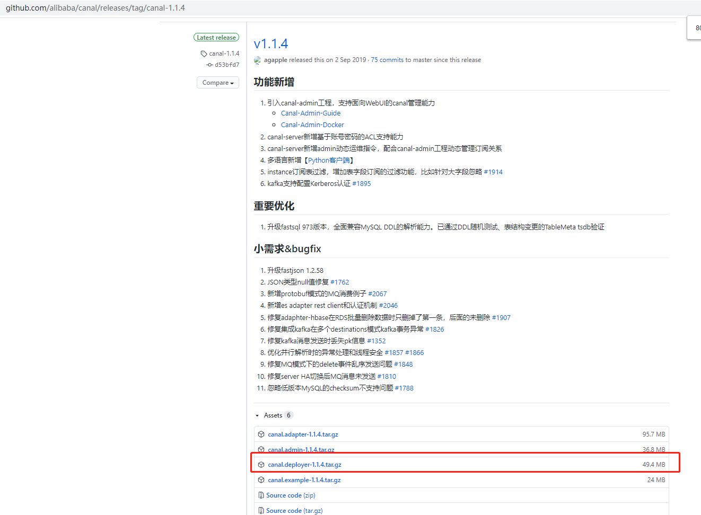

拷贝和解压`canal.deployer-1.1.4.tar.gz`到虚拟机的`/data/canal`目录下，同时解压一份在本地开发机的磁盘中。**演示直接使用`example`标识的`Instance`**。修改虚拟机`/data/canal/conf/example/instance.properties`：

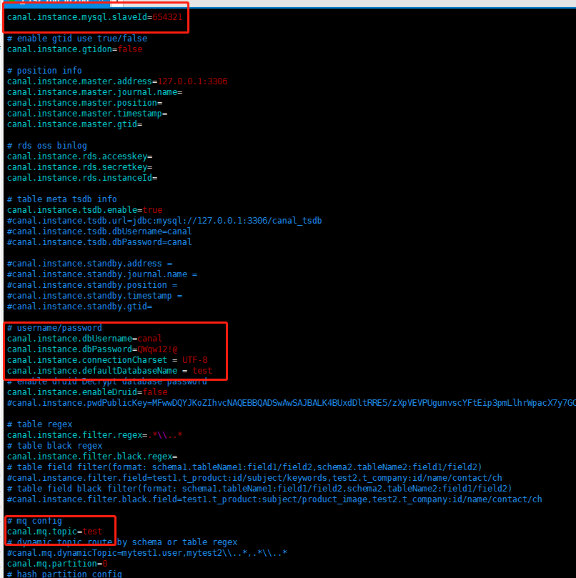

注意这里笔者把`topic`设置为和数据库的`schema`一致。其他细节项就不再进行展开，有兴趣可以看笔者之前写过的一篇文章[《基于Canal和Kafka实现MySQL的Binlog近实时同步》](https://throwx.cn/2020/03/07/canal-kafka-mysql-binlog-sync-guide)，里面很详细地介绍了怎么部署一个可用的`Canal`单机服务，包括了`MySQL`、`Zookeeper`和`Kafka`的安装和使用。

同理，在开发机中的对应的配置文件中添加一模一样的配置项，但是`canal.instance.mysql.slaveId`配置项需要每个实例唯一，并且不能和主库的`serverId`冲突，例如：

```shell
# 虚拟机中的配置
canal.instance.mysql.slaveId=654321

# 开发机中的配置
canal.instance.mysql.slaveId=654322
```

然后修改虚拟机`/data/canal/conf/canal.properties`配置，修改项主要包括：

|                Key                 |                            Value                             |
| :--------------------------------: | :----------------------------------------------------------: |
|         `canal.zkServers`          | 填写`Zookeeper`集群的`host:port`，这里填写`192.168.56.200:2181` |
|         `canal.serverMode`         |                           `kafka`                            |
| `canal.instance.global.spring.xml` | `classpath:spring/default-instance.xml`（一定要修改为此配置，基于Zookeeper的集群管理依赖于此配置） |
|         `canal.mq.servers`         | 填写`Kafka`集群的`host:port`，这里填写`192.168.56.200:9092`  |

其他配置项可以按需修改。**对于`canal.properties`，`Canal`多个集群节点可以完全一致，写好一份然后拷贝使用即可**。接着可以分别启动两个`Canal`服务，一般来说，先启动的节点会成为`running`节点：

- 对于`Linux`系统，可以使用命令`sh $CANAL_HOME/bin/startup.sh`启动`Canal`。
- 对于`Windows`系统，直接挂起命令界面执行`$CANAL_HOME/bin/startup.bat`脚本即可。

> Windows启动如果控制台报错ch.qos.logback.core.LogbackException: Unexpected filename extension of file…，其实是因为脚本中的logback配置文件路径占位符的变量没有预先设置值，见下图：

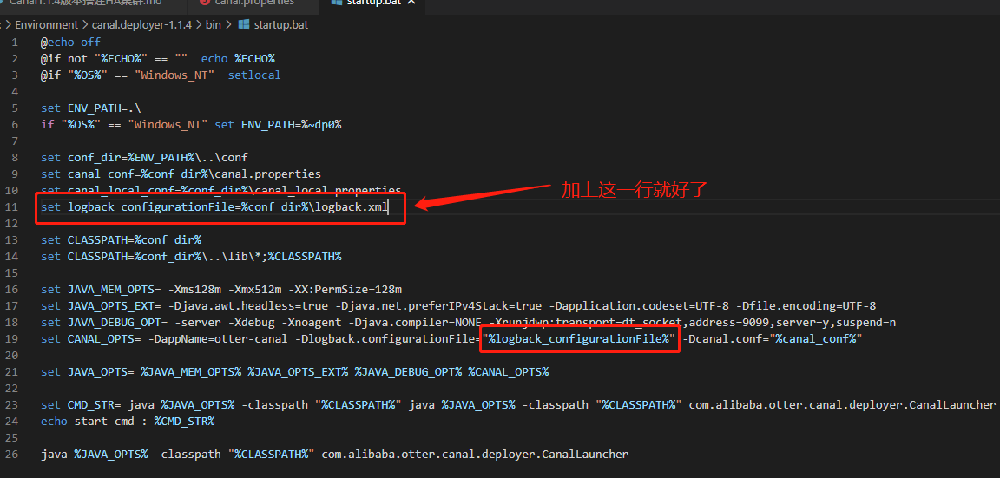

`Linux`下的启动日志（`example.log`）：

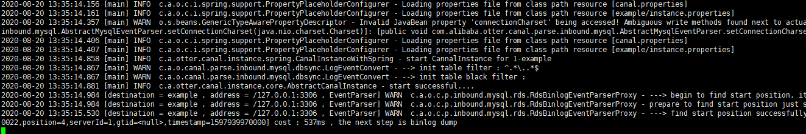

`Windows`下的启动日志（`canal.log`）：

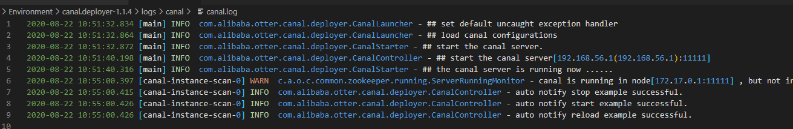

## 测试Canal高可用集群

先启动虚拟机中的`Canal`服务，再启动本地开发机中的`Canal`服务：

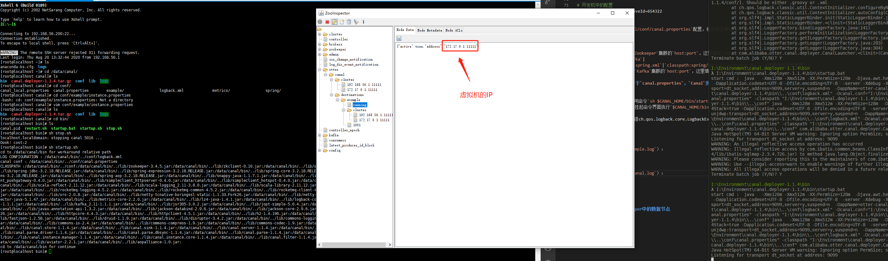

可见当前的`cluster`列表中包含了两个`host:port`，而`running`节点中的信息只包含虚拟机的`host:port`，意味着当前运行节点时虚拟机中的`Canal`服务，本地开发机中的`Canal`服务作为备用节点。此时可以尝试在虚拟机中执行`sh stop.sh`关闭`Canal`服务：

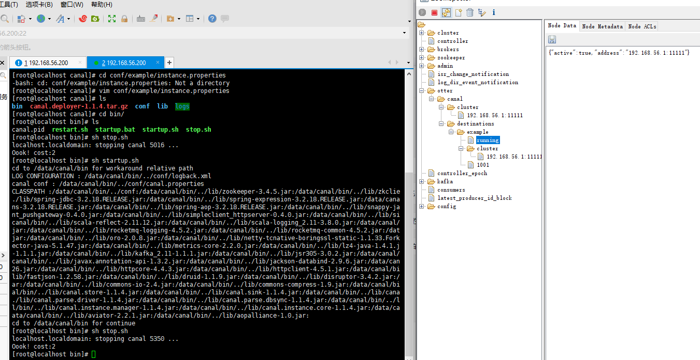

可见`cluster`列表只剩下本地开发机中的`Canal`服务的`host:port`，而`running`节点中的信息也是指向此服务信息。至此**成功验证了`Canal`主备模式**的切换。此时可以再验证一下开发机中的`example.log`：

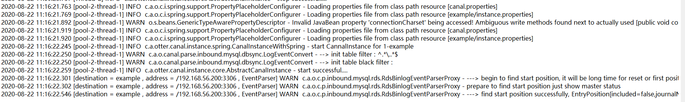

## 说说Canal保存在Zookeeper中的数据节点

前文使用[ZooInspector](https://issues.apache.org/jira/secure/attachment/12436620/ZooInspector.zip)展示了`Canal`保存在`Zookeeper`中的节点信息，这里简单分析一下。节点树的结构如下：

|          节点路径           |            描述             |
| :-------------------------: | :-------------------------: |
|       `/otter/canal`        |           根目录            |
|   `/otter/canal/cluster`    |     `Canal`集群节点信息     |
| `/otter/canal/destinations` | `Canal`所有`Instance`的信息 |

`/otter/canal/cluster`路径的展开如下：

```shell
# 其实就是挂载了所有集群节点的host:port信息
/otter/canal/cluster
  - 192.168.56.1:11111
  - 172.17.0.1:11111
```

`/otter/canal/destinations`路径会相对复杂，展开的信息如下：

```shell
/otter/canal/destinations
   - Instance标识
     - running 记录当前为此Instance提供服务状态为running的Canal节点 [EPHEMERAL类型]
     - cluster 记录当前为此Instance提供服务的Canal集群节点列表
     - Client序号标识
       - running 客户端当前正在读取的running节点 [EPHEMERAL类型]
       - cluster 记录当前读取此Instance的客户端节点列表
       - cursor  记录客户端读取的position信息 

# 例如
/otter/canal/destinations
   - example
     - running  -> {"active":true,"address":"192.168.56.1:11111"}
     - cluster 
       - 192.168.56.1:11111
       - 172.17.0.1:11111
     - 1001
       - running
       - cluster
       - cursor
```

理解各个路径存放的信息，有利于在`Canal`集群出现故障的时候结合日志进行故障排查。

## 小结

`Canal`集群已经在生产跑了一段时间，大部分的问题和坑都已经遇到过，有些问题通过了屏蔽某些开关解决，一些遗留无法解决的问题也想办法通过预警手段人工介入处理。`Canal`的`HA`其实是比较典型的主备模式，也就是同一个时刻，只有单个`Canal`服务对单个`Instance`（`Destination`）进行处理，想了下确实好像这样才能确保主备中继日志同步的基本有序，备用节点其实是完全划水不工作的（除了监听`Zookeeper`中的路径变更），一旦`running`节点出现故障或者宕机，备用节点就会提升为`running`节点，确保集群的可用性。
