# Elasticsearch集群高可用安装配置

## Elasticsearch集群架构介绍

在ElasticSearch的架构中，有三类角色，分别是Client Node、Data Node和Master Node，搜索查询的请求一般是经过Client Node来向Data Node获取数据，而索引查询首先请求Master Node节点，然后Master Node将请求分配到多个Data Node节点完成一次索引查询。

集群中各节点的作用：

Master Node:可以理解为主节点，用于元数据(MetaData)的处理，比如索引的新增、删除、分片分配等，以及管理集群各个节点的状态包括集群节点的协调、调度。elasticsearch集群中可以定义多个主节点，但是，在同一时刻，只有一个主节点起作用，其它定义的主节点，是作为主节点的候选节点存在。当一个主节点故障后，集群会从候选主节点中选举出新的主节点。也就是说，主节点的产生都是由选举产生的。Master节点它仅仅是对索引的管理、集群状态的管理。像其它的对数据的存储、查询都不需要经过这个Master节点。因此在ES集群中。它的压力是比较小的。所以，我们在构建ES的集群当中，Master节点可以不用选择太好的配置，但是我们一定要保证服务器的安全性。因此，必须要保证主节点的稳定性。

Data Node: 存储数据的节点，数据的读取、写入最终的作用都会落到这个上面。数据的分片、搜索、整合等 这些操作都会在数据节点来完成。因此，数据节点的操作都是比较消耗CPU、内存、I/O资源。所以，我们在选择DataNode数据节点的时候，硬件配置一定要高一些。高的硬件配置可以获得高效的存储和分析能力。因为最终的结果都是需要到这个节点上来。

Client  Node:可选节点。作任务分发使用。它也会存储一些元数据信息，但是不会对数据做任何修改，仅仅用来存储。它的好处是可以分担DataNode的一部分压力。因为ES查询是两层汇聚的结果，第一层是在DataNode上做查询结果的汇聚。然后把结果发送到Client Node 上来。Cllient Node收到结果后会再做第二次的结果汇聚。然后Client会把最终的结果返回给用户。

ES集群的工作流程：

1）搜索查询，比如Kibana去查询ES的时候，默认走的是Client Node。然后由Client Node将请求转发到DataNode上。DataNode上的结构返回给client Node.然后再返回给客户端。

2）索引查询，比如我们调用API去查询的时候，走的是Master Node，然后由Master 将请求转发到相应的数据节点上，然后再由Master将结果返回。

3）最终我们都知道，所有的服务请求都到了DataNode上。所以，它的压力是最大的。

## Elasticsearch集群安装注意事项

(1) 自ES 5.X版本后，由于elasticSearch可以接收用户输入的脚本并且执行，为了系统安全考虑，需要创建一个单独的用户用来运行elasticSearch，不能启用root启用ES集群;

(2)需要将elasticsearch的安装目录都授权给刚新建的elasticsearch用户;

## Elasticsearch性能优化

### JVM调优

JVM调优主要是针对elasticsearch的JVM内存资源进行优化，elasticsearch的内存资源配置文件为jvm.options，这个文件在ES安装目录的config目录下，打开此文件，修改如下：

```
vim elasticsearch/config/jvm.options
-Xms1g   修改为 ===>  -Xms2g
-Xmx1g   修改为 ===>  -Xmx2g
```

默认JVM内存为1g，可根据服务器内存大小，修改为合适的值。**一般设置为服务器物理内存的一半最佳**。

**JVM设定标准：**

1，最大不要超过31G

2，预留一半内存给操作系统，用来做文件缓存，提升系统查询速度。

### 操作系统调优

【1】内存优化
在/etc/sysctl.conf添加如下内容

```
fs.file-max=655360
vm.max_map_count=655360
```

sysctl -p生效

解释：
（1）vm.max_map_count=655360
系统最大打开文件描述符数

（2）vm.max_map_count=655360
限制一个进程拥有虚拟内存区域的大小

【2】修改vim /etc/security/limits.conf

```
* soft nofile 65536
* hard nofile 65536
* soft nproc 65536
* hard nproc 65536
* soft memlock unlimited
* hard memlock unlimited
```

解释:
(nofile)最大开打开文件描述符
(nproc)最大用户进程数
(memlock)最大锁定内存地址空间

【3】修改/etc/security/limits.d/90-nproc.conf
将1024修改为65536

```
*          soft    nproc     1024     修改前
*          soft    nproc     65536    修改后
```


ulimit -a查看

## Elasticsearch配置文件详解

elasticsearch的配置文件均在elasticsearch根目录下的config文件夹，这里是/usr/local/elasticsearch/config目录，主要有jvm.options、elasticsearch.yml和log4j2.properties三个主要配置文件。这里重点介绍elasticsearch.yml一些重要的配置项及其含义。

```yml
#elasticsearch.yml
cluster.name: escluster
node.name: es1
node.master: true
node.data: true
path.data: /data/elasticsearch/data
path.logs: /data/elasticsearch/logs
bootstrap.memory_lock: true
bootstrap.system_call_filter: false
http.port: 9200
network.host: 0.0.0.0
discovery.zen.minimum_master_nodes: 2
discovery.zen.ping_timeout: 3s
discovery.zen.ping.unicast.hosts: ["172.16.0.8:9300","172.16.0.6:9300","172.16.0.22:9300"]
```

配置文件重点参数解析:

（1）cluster.name
集群名字，三台集群的集群名字都必须一致

（2）node.name
节点名字，三台ES节点字都必须不一样

（3）discovery.zen.minimum_master_nodes:2
表示集群最少的master数，如果集群的最少master数据少于指定的数，将无法启动，官方推荐node master数设置为集群数/2+1，我这里三台ES服务器，配置最少需要两台master，整个集群才可正常运行，

（4）node.master该节点是否有资格选举为master，如果上面设了两个mater_node 2，也就是最少两个master节点，则集群中必须有两台es服务器的配置为node.master: true的配置，配置了2个节点的话，如果主服务器宕机，整个集群会不可用，所以三台服务器，需要配置3个node.masdter为true,这样三个master，宕了一个主节点的话，他又会选举新的master，还有两个节点可以用，只要配了node master为true的ES服务器数正在运行的数量不少于master_node的配置数，则整个集群继续可用，我这里则配置三台es node.master都为true，也就是三个master，master服务器主要管理集群状态，负责元数据处理，比如索引增加删除分片分配等，数据存储和查询都不会走主节点，压力较小，jvm内存可分配较低一点

（5）node.data
存储索引数据，三台都设为true即可

（6）bootstrap.memory_lock: true
锁住物理内存，不使用swap内存，有swap内存的可以开启此项

（7）discovery.zen.ping_timeout: 3000s
自动发现拼其他节点超时时间

（8）discovery.zen.ping.unicast.hosts: ["172.16.0.8:9300","172.16.0.6:9300","172.16.0.22:9300"]
设置集群的初始节点列表，集群互通端口为9300


## 核心配置文件

### ElasticSearch集群配置

node1

```yml
# 集群名称
cluster.name: es-cluster
# 节点名称，不能重复
node.name: es1
# 是否有资格选举为master
node.master: true
# 是否为数据存储节点
node.data: true
# 数据存储目录
path.data: /usr/share/elasticsearch/data
# 日志存储目录
path.logs: /usr/share/elasticsearch/logs
# 数据备份目录
path.repo: /usr/share/elasticsearch/backup
node.ml: false
xpack.ml.enabled: false
# 是否锁住物理内存
bootstrap.memory_lock: true
bootstrap.system_call_filter: false
# Http通信端口
http.port: 9200
http.cors.enabled: true
http.cors.allow-origin: "*"
# 对外提供服务的IP地址
network.host: 0.0.0.0 
# 可成为master的节点数量。为避免脑裂，建议设置为（master 节点总数 /2）+ 1
discovery.zen.minimum_master_nodes: 2
# 集群选主超时时间
discovery.zen.ping_timeout: 3s
# 集群节点发现列表
discovery.zen.ping.unicast.hosts: ["172.20.128.5:9300","172.20.128.6:9300","172.20.128.7:9300"]
```

node2

```yml
# 集群名称
cluster.name: es-cluster
# 节点名称，不能重复
node.name: es2
# 是否有资格选举为master
node.master: true
# 是否为数据存储节点
node.data: true
# 数据存储目录
path.data: /usr/share/elasticsearch/data
# 日志存储目录
path.logs: /usr/share/elasticsearch/logs
# 数据备份目录
path.repo: /usr/share/elasticsearch/backup
node.ml: false
xpack.ml.enabled: false
# 是否锁住物理内存
bootstrap.memory_lock: true
bootstrap.system_call_filter: false
# Http通信端口
http.port: 9200
http.cors.enabled: true
http.cors.allow-origin: "*"
# 对外提供服务的IP地址
network.host: 0.0.0.0 
# 可成为master的节点数量。为避免脑裂，建议设置为（master 节点总数 /2）+ 1
discovery.zen.minimum_master_nodes: 2
# 集群选主超时时间
discovery.zen.ping_timeout: 3s
# 集群节点发现列表
discovery.zen.ping.unicast.hosts: ["172.20.128.5:9300","172.20.128.6:9300","172.20.128.7:9300"]
```

node3

```yml
# 集群名称
cluster.name: es-cluster
# 节点名称，不能重复
node.name: es3
# 是否有资格选举为master
node.master: true
# 是否为数据存储节点
node.data: true
# 数据存储目录
path.data: /usr/share/elasticsearch/data
# 日志存储目录
path.logs: /usr/share/elasticsearch/logs
# 数据备份目录
path.repo: /usr/share/elasticsearch/backup
node.ml: false
xpack.ml.enabled: false
# 是否锁住物理内存
bootstrap.memory_lock: true
bootstrap.system_call_filter: false
# Http通信端口
http.port: 9200
http.cors.enabled: true
http.cors.allow-origin: "*"
# 对外提供服务的IP地址
network.host: 0.0.0.0 
# 可成为master的节点数量。为避免脑裂，建议设置为（master 节点总数 /2）+ 1
discovery.zen.minimum_master_nodes: 2
# 集群选主超时时间
discovery.zen.ping_timeout: 3s
# 集群节点发现列表
discovery.zen.ping.unicast.hosts: ["172.20.128.5:9300","172.20.128.6:9300","172.20.128.7:9300"]
```

### Nginx配置

```nginx
#user  nobody;
worker_processes     auto;
worker_rlimit_nofile 65535;

events {
    multi_accept       on;
    worker_connections 65535;
}

http {
    
    charset              utf-8;
    sendfile             on;
    tcp_nopush           on;
    tcp_nodelay          on;
    server_tokens        off;
    log_not_found        off;
    types_hash_max_size  2048;
    client_max_body_size 16M;
    include              mime.types;
    default_type         application/octet-stream;
    access_log           /var/log/nginx/access.log;
    error_log            /var/log/nginx/error.log warn;
    keepalive_timeout  65;
    gzip            on;
    gzip_vary       on;
    gzip_proxied    any;
    gzip_comp_level 6;
    gzip_types      text/plain text/css text/xml application/json application/javascript application/rss+xml application/atom+xml image/svg+xml;

    include              /etc/nginx/conf.d/*.conf;
    include              /etc/nginx/sites-enabled/*;

    upstream elasticsearch {
        zone elasticsearch_servers 64K;
        server 172.20.128.5:9200;
        server 172.20.128.6:9200;
        server 172.20.128.7:9200;
        keepalive 64;
    }

    server {
        listen       9200;
        server_name  localhost;
        location / {
            proxy_pass http://elasticsearch;
            proxy_redirect off;
            proxy_connect_timeout 60s;
            proxy_send_timeout 60s;
            proxy_read_timeout 60s;
            proxy_http_version 1.1;
            proxy_cache_bypass $http_upgrade;
            proxy_set_header Upgrade $http_upgrade;
            proxy_set_header Connection "";
            proxy_set_header Host $host;
            proxy_set_header X-Real-IP $remote_addr;
            proxy_set_header X-Forwarded-For $proxy_add_x_forwarded_for;
            proxy_set_header Connection "Keep-Alive";
            proxy_set_header Proxy-Connection "Keep-Alive";
            proxy_pass_header Access-Control-Allow-Origin;
            proxy_pass_header Access-Control-Allow-Methods;
            proxy_hide_header Access-Control-Allow-Headers;
            add_header Access-Control-Allow-Headers 'X-Requested-With, Content-Type';
            add_header Access-Control-Allow-Credentials true;
        }
    }

    server {
        listen       80;
        server_name  localhost;
        location / {
            root   html;
            index  index.html index.htm;
        }
    }

}
```

### Haproxy配置

```
global
  log 127.0.0.1 local0
  maxconn 4096
  daemon
  nbproc 4

defaults
  log global
  mode http
  option httplog
  option httpclose
  option dontlognull
  option redispatch
  option forwardfor
  option abortonclose
  retries 3
  maxconn 3000
  balance roundrobin
  timeout connect 5s
  timeout client 20s
  timeout server 20s

listen nginx-cluster
  bind *:8000
  mode http
  balance roundrobin
  server server1 172.20.128.2:80 check inter 5s rise 2 fall 3
  server server2 172.20.128.3:80 check inter 5s rise 2 fall 3

listen es-cluster
  bind *:9200
  mode http
  balance roundrobin
  server server1 172.20.128.5:9200 check inter 5s rise 2 fall 3
  server server2 172.20.128.6:9200 check inter 5s rise 2 fall 3
  server server2 172.20.128.7:9200 check inter 5s rise 2 fall 3

listen stats
  bind *:1080
  mode http
  stats enable
  stats refresh 30s
  stats hide-version
  stats realm Haproxy\ Statistics
  stats auth admin:admin
  stats uri /

frontend main
  bind *:80
  default_backend apps

backend apps
  option httpchk GET /index.html
  server nginx 172.20.128.4:80 check inter 2000 rise 3 fall 3
```

### Keepalived配置

**在安装nginx的每个服务器上安装keepalived**

这里以两台nginx服务器为例

第一台keepalived服务器配置信息如下：

```
vrrp_script chk_nginx {
    script "pidof nginx"
    interval 2
}

vrrp_instance VI_1 {
    state MASTER
    interface eth0
    virtual_router_id 33
    priority 200
    advert_int 1
    unicast_src_ip 172.20.128.2
    unicast_peer {
        172.20.128.3
    }
    
    authentication {
        auth_type PASS
        auth_pass opsadmin
    }
    
    virtual_ipaddress {
        172.20.128.4/24 dev eth0
    }

    track_script {
        chk_nginx
    }
}
```

第二台keepalived服务器配置信息如下：

```
vrrp_script chk_nginx {
    script "pidof nginx"
    interval 2
}

vrrp_instance VI_1 {
    state BACKUP
    interface eth0
    virtual_router_id 33
    priority 100
    advert_int 1
    unicast_src_ip 172.20.128.3
    unicast_peer {
        172.20.128.2
    }
    
    authentication {
        auth_type PASS
        auth_pass opsadmin
    }
    
    virtual_ipaddress {
        172.20.128.4/24 dev eth0
    }
    
    track_script {
        chk_nginx
    }
}
```

完整的docker-compose文件如下:

```yml
version: '2.2'

services:

  nginx_master:
    build:
      context: ./
      dockerfile: ./nginx/Dockerfile
    restart: on-failure
    image: nginx_master
    container_name: nginx_master
    volumes:
      - ./nginx/nginx.conf:/etc/nginx/nginx.conf
      - ./nginx/index-master.html:/usr/share/nginx/html/index.html
      - ./keepalived/keepalived-master.conf:/etc/keepalived/keepalived.conf
    networks:
      esnet:
        ipv4_address: 172.20.128.2
    # ports:
    #   - 9200:9200
    cap_add: 
      - NET_ADMIN

  nginx_slave:
    build:
      context: ./
      dockerfile: ./nginx/Dockerfile
    restart: on-failure
    image: nginx_slave
    container_name: nginx_slave
    volumes:
      - ./nginx/nginx.conf:/etc/nginx/nginx.conf
      - ./nginx/index-slave.html:/usr/share/nginx/html/index.html
      - ./keepalived/keepalived-slave.conf:/etc/keepalived/keepalived.conf
    networks:
      esnet:
        ipv4_address: 172.20.128.3
    # ports:
    #   - 9200:9200
    cap_add: 
        - NET_ADMIN

  haproxy:
    restart: on-failure    
    image: haproxy:1.7-alpine
    container_name: haproxy
    volumes:
      - ./haproxy/haproxy.cfg:/usr/local/etc/haproxy/haproxy.cfg
    networks:
      esnet:
        ipv4_address: 172.20.128.8
    ports:
      - 80:80
      - 8000:8000
      - 9200:9200
      - 1080:1080
    depends_on:
      - nginx_master
      - nginx_slave
      - es1
      - es2
      - es3

  es1:
    restart: on-failure
    image: docker.elastic.co/elasticsearch/elasticsearch:6.8.13
    container_name: es1
    environment:
      - cluster.name=docker-cluster
      - bootstrap.memory_lock=true
      - "ES_JAVA_OPTS=-Xms512m -Xmx512m"
    ulimits:
      memlock:
        soft: -1
        hard: -1
    volumes:
      - ./elasticsearch/es1.yml:/usr/share/elasticsearch/config/elasticsearch.yml
      - esdata1:/usr/share/elasticsearch/data
    # ports:
    #   - 9200:9200
    networks:
      esnet:
        ipv4_address: 172.20.128.5

  es2:
    restart: on-failure
    image: docker.elastic.co/elasticsearch/elasticsearch:6.8.13
    container_name: es2
    environment:
      - cluster.name=docker-cluster
      - bootstrap.memory_lock=true
      - "ES_JAVA_OPTS=-Xms512m -Xmx512m"
    ulimits:
      memlock:
        soft: -1
        hard: -1
    volumes:
      - ./elasticsearch/es2.yml:/usr/share/elasticsearch/config/elasticsearch.yml
      - esdata2:/usr/share/elasticsearch/data
    # ports:
    #   - 9200:9200
    networks:
      esnet:
        ipv4_address: 172.20.128.6

  es3:
    restart: on-failure
    image: docker.elastic.co/elasticsearch/elasticsearch:6.8.13
    container_name: es3
    environment:
      - cluster.name=docker-cluster
      - bootstrap.memory_lock=true
      - "ES_JAVA_OPTS=-Xms512m -Xmx512m"
    ulimits:
      memlock:
        soft: -1
        hard: -1
    volumes:
      - ./elasticsearch/es3.yml:/usr/share/elasticsearch/config/elasticsearch.yml
      - esdata3:/usr/share/elasticsearch/data
    # ports:
    #   - 9200:9200
    networks:
      esnet:
        ipv4_address: 172.20.128.7

  cerebro:
    restart: on-failure
    image: lmenezes/cerebro
    container_name: cerebro
    ports:
      - 9000:9000
    networks:
      - esnet

  elasticsearch-head:
    restart: on-failure
    image: mobz/elasticsearch-head:5
    container_name: elasticsearch-head
    ports:
      - 9100:9100
    networks:
      - esnet

volumes:
  esdata1:
    driver: local
  esdata2:
    driver: local
  esdata3:
    driver: local

networks:
  esnet:
    name: esnet
    driver: bridge
    ipam:
      config:
        - subnet: 172.20.0.0/16
```

## 高可用测试

### Nginx高可用测试

访问haproxy监控面板，其服务节点展示如下`http://localhost:1080`

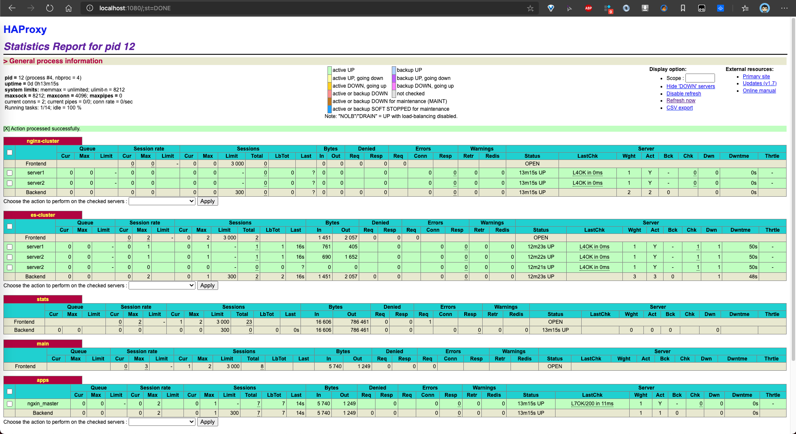

测试nginx高可用，首先访问`http://localhost`观察当前nginx服务器的工作节点，其返回内容如下所示


根据配置文件可知当前nginx请求处于nginx-master节点，停掉nginx-master节点后刷新`http://localhost`，返回如下图所示


发现nginx会自动切换到nginx-slave节点，可见nginx服务器高可用已经生效，解决了nginx的单点故障问题。此时haproxy的监控面板nginx节点状态展示如下

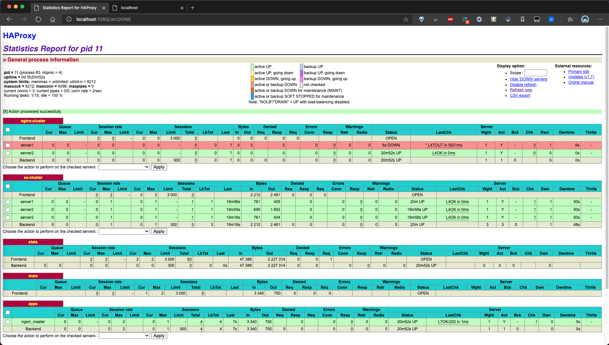

恢复nginx-master节点后又自动恢复为主备模式，haproxy面板状态也恢复为正常状态

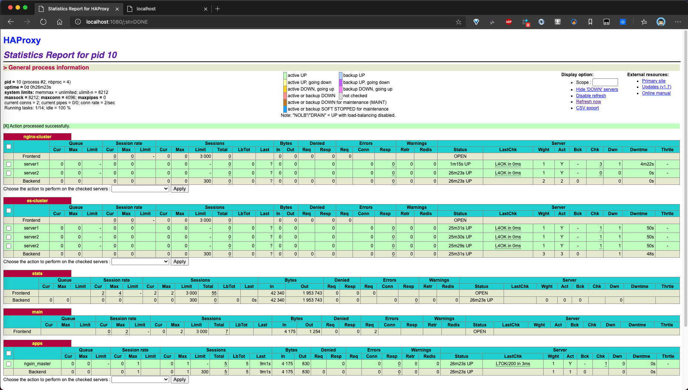

访问`http://localhost:8000`发现会在nginx的master、slave节点自动切换，由此可见haproxy的负载均衡已生效。

### Elasticsearch集群高可用测试

访问`http://localhost:9200/_cat/master`，观察当前ES集群所在的master节点


根据上述信息，发现当前ES的master节点处于es2，我们停掉es2后再次观察ES的master节点和集群的健康状态


发现此时master节点处于es1服务器上，同时其es集群健康扔处于健康状态`http://localhost:9200/_cluster/health`


haproxy监控面板es节点状态健康如下

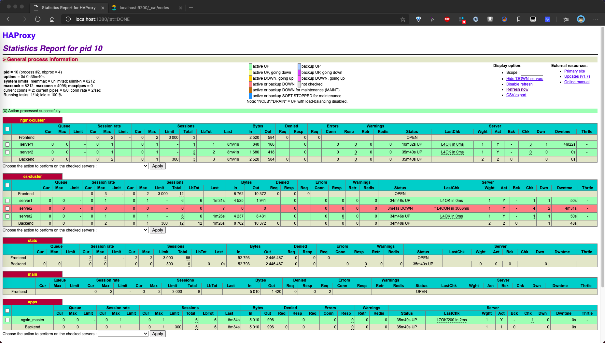

恢复es2，观察其es集群节点信息

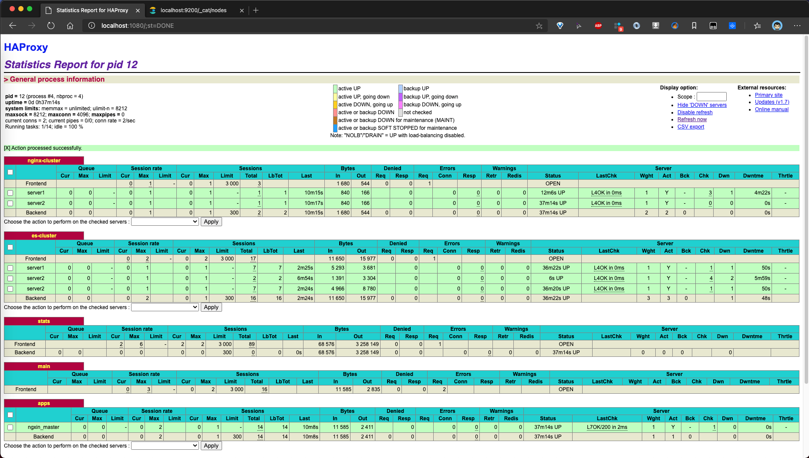


停掉es1节点，让进行第二轮选主模式

此时haproxy的面板健康信息如下

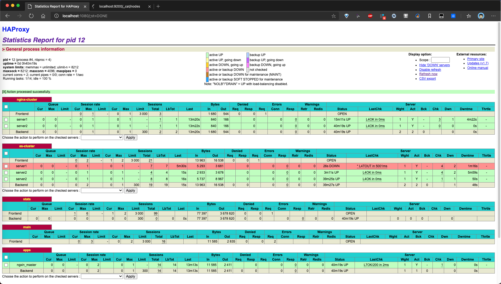


es集群二次选主后的master节点为es2。


此时集群仍处于健康状态。我们恢复es1，es1会自动加入es集群。恢复后的节点如下所示

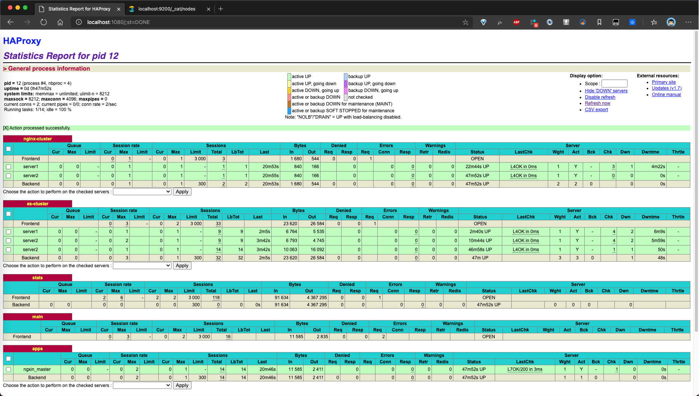


浏览器不断刷新`http://localhost:9200`发现会自动在es1、es2、es3集群间进行切换(此处是由haproxy来实现)，实现了es的负载均衡。生产环境建议结合Nginx的upstream来实现。上文的nginx配置文件里面有交代。其具体效果如下所示


## Elasticsearch集群管理

```bash
docker run -p 9000:9000 lmenezes/cerebro
```

浏览器访问`http://localhost:9000`，在打开的页面中输入`http://es:9200`

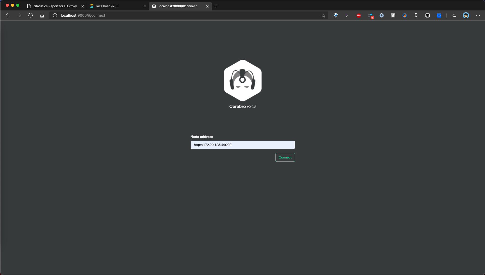

ES集群中各节点的信息

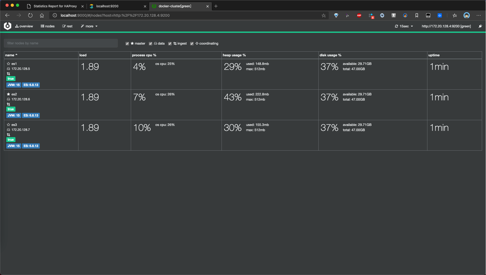

# Elasticsearch备份

### 安装minio

docker-compose.yaml

```yaml
version: '3.7'

services:
  minio1:
    image: minio/minio:RELEASE.2020-12-16T05-05-17Z
    volumes:
      - data1-1:/data1
      - data1-2:/data2
    expose:
      - "9000"
    environment:
      MINIO_ACCESS_KEY: minio
      MINIO_SECRET_KEY: minio123
    command: server http://minio{1...4}/data{1...2}
    healthcheck:
      test: ["CMD", "curl", "-f", "http://localhost:9000/minio/health/live"]
      interval: 30s
      timeout: 20s
      retries: 3

  minio2:
    image: minio/minio:RELEASE.2020-12-16T05-05-17Z
    volumes:
      - data2-1:/data1
      - data2-2:/data2
    expose:
      - "9000"
    environment:
      MINIO_ACCESS_KEY: minio
      MINIO_SECRET_KEY: minio123
    command: server http://minio{1...4}/data{1...2}
    healthcheck:
      test: ["CMD", "curl", "-f", "http://localhost:9000/minio/health/live"]
      interval: 30s
      timeout: 20s
      retries: 3

  minio3:
    image: minio/minio:RELEASE.2020-12-16T05-05-17Z
    volumes:
      - data3-1:/data1
      - data3-2:/data2
    expose:
      - "9000"
    environment:
      MINIO_ACCESS_KEY: minio
      MINIO_SECRET_KEY: minio123
    command: server http://minio{1...4}/data{1...2}
    healthcheck:
      test: ["CMD", "curl", "-f", "http://localhost:9000/minio/health/live"]
      interval: 30s
      timeout: 20s
      retries: 3

  minio4:
    image: minio/minio:RELEASE.2020-12-16T05-05-17Z
    volumes:
      - data4-1:/data1
      - data4-2:/data2
    expose:
      - "9000"
    environment:
      MINIO_ACCESS_KEY: minio
      MINIO_SECRET_KEY: minio123
    command: server http://minio{1...4}/data{1...2}
    healthcheck:
      test: ["CMD", "curl", "-f", "http://localhost:9000/minio/health/live"]
      interval: 30s
      timeout: 20s
      retries: 3

  nginx:
    image: nginx:1.19.2-alpine
    volumes:
      - ./nginx.conf:/etc/nginx/nginx.conf:ro
    ports:
      - "9001:9000"
    depends_on:
      - minio1
      - minio2
      - minio3
      - minio4

volumes:
  data1-1:
  data1-2:
  data2-1:
  data2-2:
  data3-1:
  data3-2:
  data4-1:
  data4-2:
```

### 配置nginx

nginx.conf

```nginx
user  nginx;
worker_processes  auto;

error_log  /var/log/nginx/error.log warn;
pid        /var/run/nginx.pid;


events {
    worker_connections  1024;
}


http {
    include       /etc/nginx/mime.types;
    default_type  application/octet-stream;

    log_format  main  '$remote_addr - $remote_user [$time_local] "$request" '
                      '$status $body_bytes_sent "$http_referer" '
                      '"$http_user_agent" "$http_x_forwarded_for"';

    access_log  /var/log/nginx/access.log  main;

    sendfile        on;
    tcp_nopush     on;

    keepalive_timeout  65;

    gzip  on;

    # include /etc/nginx/conf.d/*.conf;

    upstream minio {
        server minio1:9000;
        server minio2:9000;
        server minio3:9000;
        server minio4:9000;
    }

    server {
        listen       9000;
        listen  [::]:9000;
        server_name  localhost;
         ignore_invalid_headers off;
         client_max_body_size 0;
         proxy_buffering off;

        location / {
            proxy_set_header Host $http_host;
            proxy_set_header X-Real-IP $remote_addr;
            proxy_set_header X-Forwarded-For $proxy_add_x_forwarded_for;
            proxy_set_header X-Forwarded-Proto $scheme;

            proxy_connect_timeout 300;
            proxy_http_version 1.1;
            proxy_set_header Connection "";
            chunked_transfer_encoding off;

            proxy_pass http://minio;
        }
    }
}
```

### 创建bucket

浏览器访问`http://localhost:9001`，输入`minio/minio123`

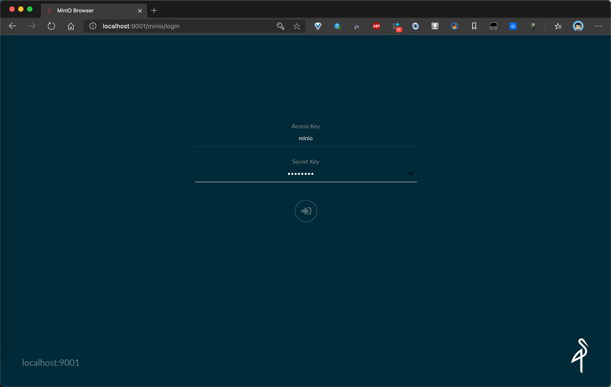

登陆后创建 `esbackup ` bucket


### 安装repository-s3 plugin

在ES集群的每个节点上安装repository-s3，具体命令如下:

 ```bash
bin/elasticsearch-plugin install repository-s3
bin/elasticsearch-keystore add s3.client.default.access_key
bin/elasticsearch-keystore add s3.client.default.secret_key
 ```

access_key和secret_key分别为`minio/minio123`，安装完依次重启ES集群中的每个节点。

```http
GET http://localhost:9200/_cat/plugins # 列出当前集群已安装的插件信息
```

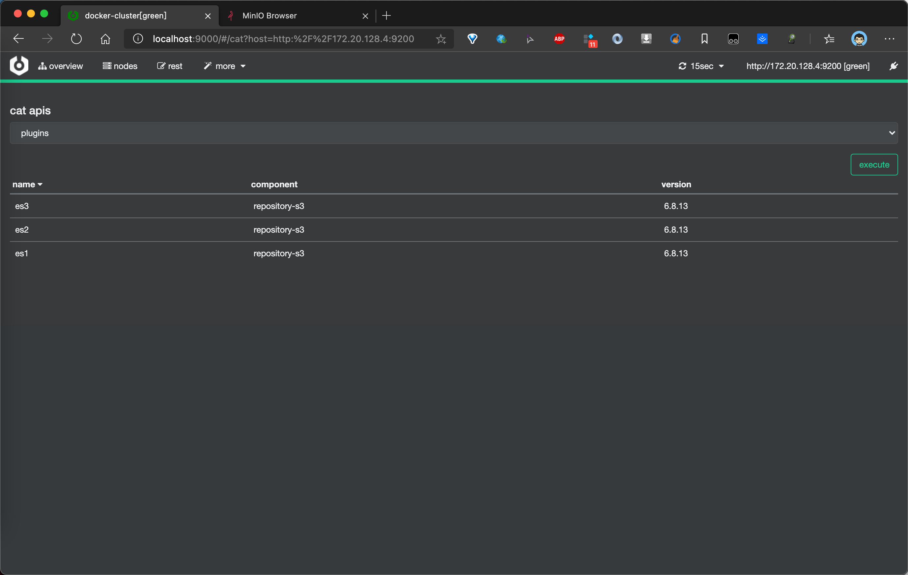

### 创建repository

```http
PUT http://localhost:9200/_snapshot/my_backup
{ 
    "type":"s3", 
    "settings":{ 
        "bucket":"esbackup", 
        "protocol":"http", 
        "disable_chunked_encoding":"true", 
        "endpoint":"192.168.31.9:9001" 
    }
}
```

查看所有的repository

```http
http://localhost:9200/_cat/repositories
```

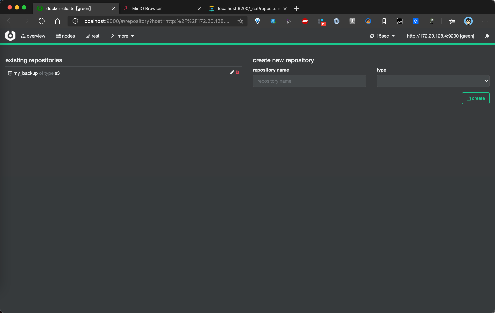

### 创建备份

在创建备份之前，我们使用es的bulk api批量创建一个索引，然后使用快照的形式备份这个索引。

```http
POST http://127.0.0.1:9200/countries/country/_bulk?pretty
{"index":{"_id":"1"}}
{"name": "中国","capital": "北京"}
{"index":{"_id":"2"}}
{"name": "美国","capital": "华盛顿"}
{"index":{"_id":"3"}}
{"name": "日本","capital": "东京"}
{"index":{"_id":"4"}}
{"name": "澳大利亚","capital": "悉尼"}
{"index":{"_id":"5"}}
{"name": "印度","capital": "新德里"}
{"index":{"_id":"6"}}
{"name": "韩国","capital": "首尔"}
```

创建后的索引情况如下

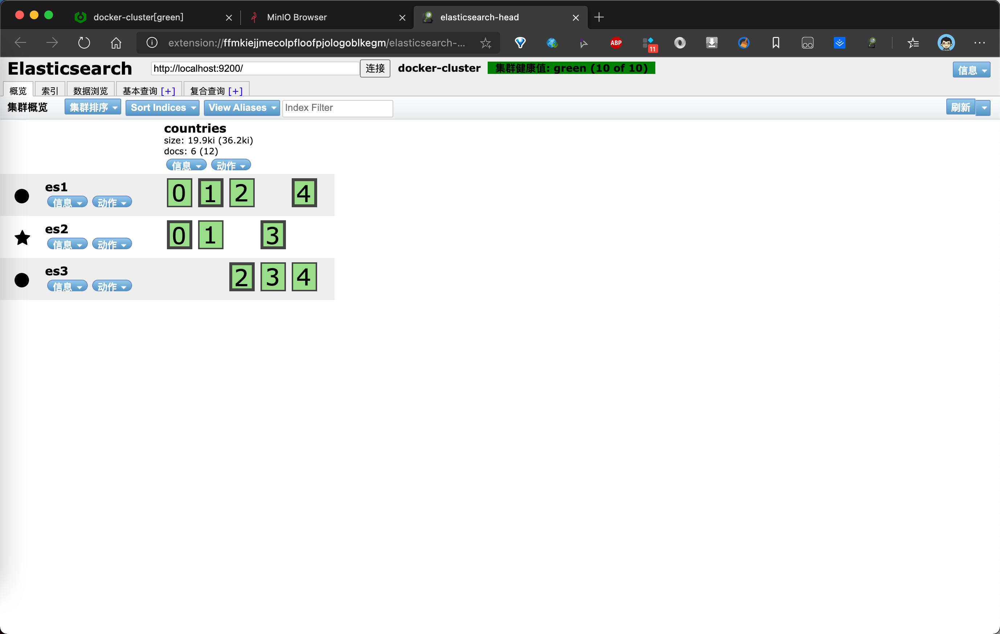

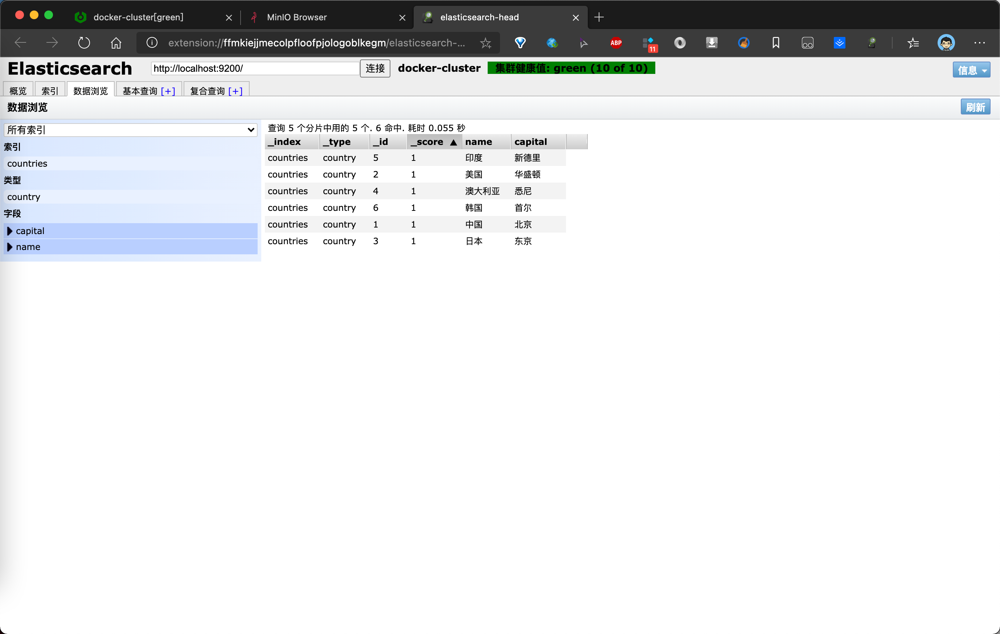

创建了一个`countries`的索引，类型为`country`，5个分片，一个副本。

接下来为ES集群创建快照(备份)

```http
PUT http://localhost:9200/_snapshot/my_backup/snapshot_20201220?wait_for_completion=true
# 返回信息如下
{
    "snapshot": {
        "snapshot": "snapshot_20201220",
        "uuid": "EDgNT6W4RSGqsBUv1UEVwA",
        "version_id": 6081399,
        "version": "6.8.13",
        "indices": [
            "countries"
        ],
        "include_global_state": true,
        "state": "SUCCESS",
        "start_time": "2020-12-20T07:08:14.455Z",
        "start_time_in_millis": 1608448094455,
        "end_time": "2020-12-20T07:08:16.605Z",
        "end_time_in_millis": 1608448096605,
        "duration_in_millis": 2150,
        "failures": [],
        "shards": {
            "total": 5,
            "failed": 0,
            "successful": 5
        }
    }
}
```

### 查看备份

```http
GET http://localhost:9200/_snapshot/my_backup/_all?pretty # 查看所有备份
```


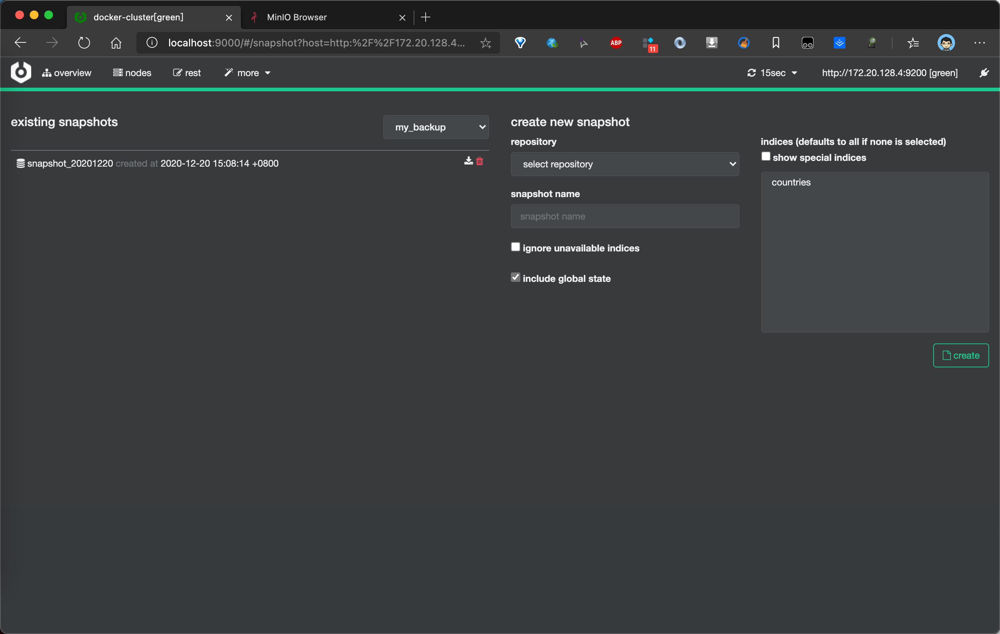

查看备份状态

```http
GET http://localhost:9200/_snapshot/my_backup/snapshot_20201220/_status # 查看备份状态
```


### 查看minio中的备份

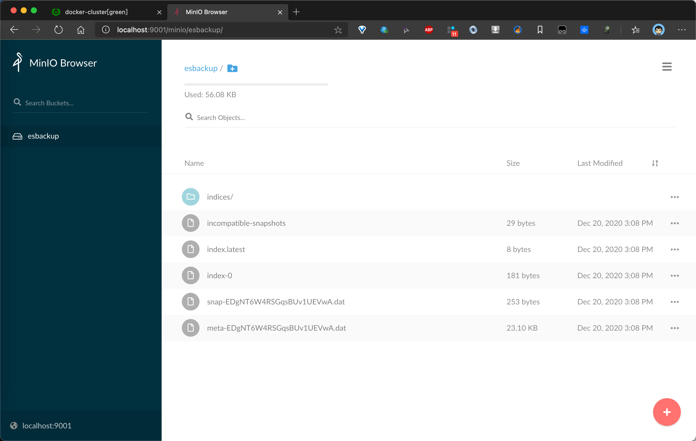

### 删除备份

```http
DELETE http://localhost:9200/_snapshot/my_backup/snapshot_20201220
```

### 快照恢复

在数据恢复前，我们先删除`countries`索引

```http
DELETE http://localhost:9200/countries
```

查看集群中的索引列表

```http
GET http://localhost:9200/_cat/indices
```

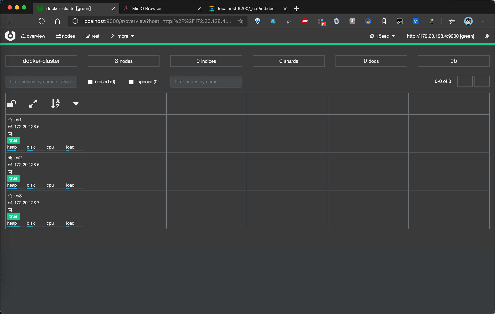

发现索引已被删除，接下来从minio的备份中恢复索引

```http
POST http://localhost:9200/_snapshot/my_backup/snapshot_20201220/_restore?wait_for_completion=true
# 执行后返回如下
{
    "snapshot": {
        "snapshot": "snapshot_20201220",
        "indices": [
            "countries"
        ],
        "shards": {
            "total": 5,
            "failed": 0,
            "successful": 5
        }
    }
}
```

观察ES集群索引情况

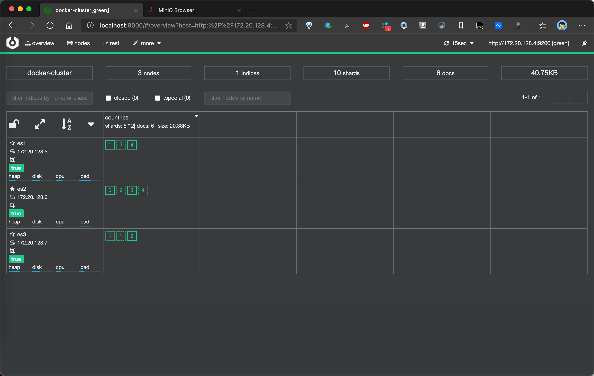

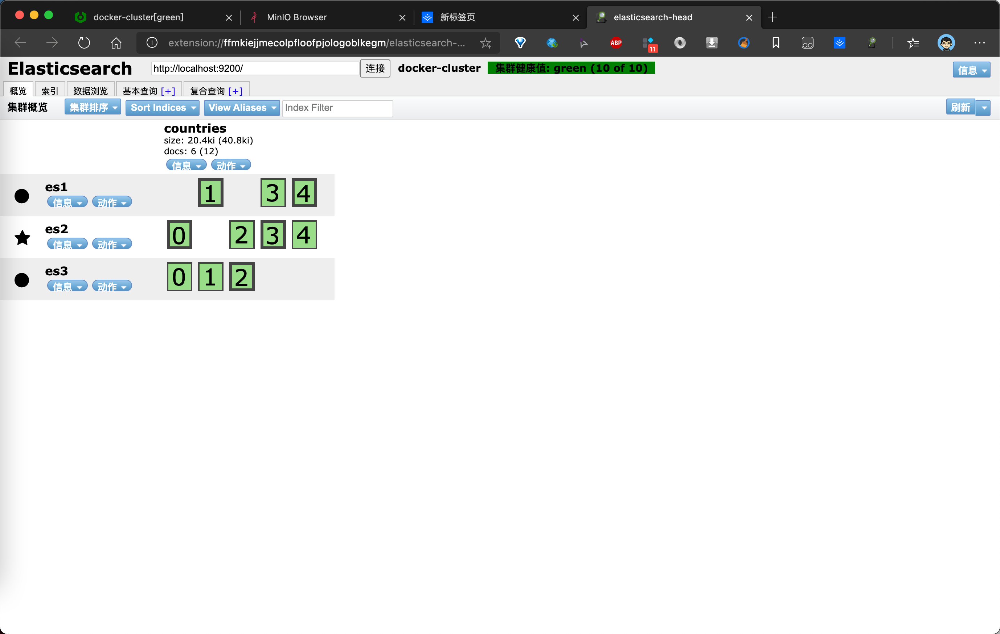

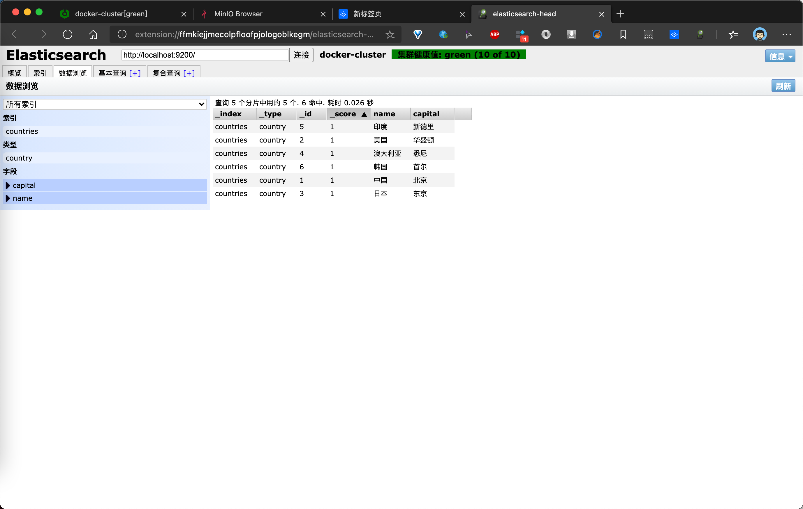

发现之前被删掉的索引有恢复回来了。

这里为了验证数据是从快照中恢复回来，采取了删除索引的操作，真正的生产环境中不建议删除索引，而是采用**关闭索引**，再从快照中进行恢复。

查看恢复进度

```http
GET http://localhost:9200/_recovery
```

# 参考文档

https://medium.com/@jitendrashah1015/elasticsearch-es-cluster-setup-with-high-availability-and-rbac-enabled-kibana-b5f4e54c4631

https://logz.io/blog/elasticsearch-cluster-tutorial/

https://www.elastic.co/guide/en/elasticsearch/reference/6.8/settings.html

https://www.elastic.co/guide/en/elasticsearch/reference/6.8/important-settings.html

https://www.elastic.co/guide/en/elasticsearch/reference/6.8/indices.html

https://www.elastic.co/guide/en/elasticsearch/reference/6.8/cat.html

https://www.elastic.co/guide/en/elasticsearch/reference/6.8/cluster.html

https://www.elastic.co/guide/en/elasticsearch/reference/6.8/modules-snapshots.html

https://www.elastic.co/guide/en/elasticsearch/plugins/6.8/repository-s3.html

https://docs.min.io/cn/

