# Git 原理详解及实用指南

# 什么是版本控制系统（VCS）

很多人认为 Git 难以理解的第一个门槛在于：所谓的「Git 是一个分布式版本控制系统」这句话的具体含义不够清楚。其实分布式版本控制系统（Distributed Version Control System - DVCS）这个定义并不难，不过一步一步来，我先告诉你，什么是版本控制系统（Version Control System - VCS）。

### 版本控制：最基本功能

> 版本控制系统（VCS）最基本的功能是版本控制。所谓版本控制，意思就是在文件的修改历程中保留修改历史，让你可以方便地撤销之前对文件的修改操作。

最简化的版本控制模型，是大多数主流文本编辑器都有的「撤销（Undo）」功能：你本来想删除一个字符，却在按删除键之前不小心选中了全文，结果一下子整篇文档都被删光了，没关系，按一下「撤销」(Ctrl + Z 或 ⌘ + Z 或 U 等等，具体和你的操作系统以及编辑器有关），删掉的文字就都回来了。这其实是文本编辑器帮你自动保存了之前的内容，当你按下「撤销」的时候，它就帮你把内容回退到上一个状态；同理，按一次是会退到上一个版本，按两次就是回退到上上一个版本。

写程序的时候同样也难免会遇到「写错」的情况，所以程序的 VCS，当然也会需要版本控制功能，这样当你发现「昨天有一行代码写错了」，你就不用凭着记忆把那段代码背出来，而只需要在 VCS 中选择撤回到昨天的那个版本。

### 主动提交：程序代码和普通文本的区别

VCS 和文本编辑器的撤销功能比起来，有一个很重要的区别是：程序代码的修改的生命周期非常长。一次代码的修改，在几天后、几个月后、几年后都有可能需要被翻出来。如果依然采用「每次改动自动保存」的形式来保留修改历史，将会导致改动历史非常频繁和无章可循，这样，历史代码的查找、阅读和回退就会很困难了。所以，和文本编辑器的撤销功能不同，VCS 保存修改历史，使用的是**主动提交改动**的机制。

在你写了一段完整的代码（例如修复了一个 bug）之后，使用 commit 命令把改动和对改动的描述信息提交，这次改动就被记录到版本历史中了。之后如果你希望回退到这个版本，就可以从 VCS 的历史日志中方便地找到它。

### 多人合作的同步需求：中央仓库

代码可以一个人写，但更多的时候会是多个人共同开发。那么自然地，就需要有一个中央仓库作为代码的存储中心：所有人的改动都会上传到这里，所有人都能也都能看到和下载到别人上传的改动。

这样，解决了同步的需求，多个人在不同的机器上开发同一个程序就成了可能。

**版本控制**、**主动提交**、**中央仓库**这三个要素，共同构成了版本控制系统（VCS）的核心：开发团队中的每个人向中央仓库主动提交自己的改动和同步别人的改动，并在需要的时候查看和操作历史版本，这就是版本控制系统。

## 中央式版本控制系统

最初的版本控制系统，是中央式版本控制系统（Centralized VCS），也就是前面我讲的这种。Git 是分布式的版本控制系统（Distributed VCS），它和中央式的区别我在下节说，现在先说一下中央式版本控制系统的工作模型。

### 工作模型

假设你在一个三人团队，你们计划开发一个软件或者系统，并决定使用中央式 VCS 来管理代码。于是：

1. 作为项目的主工程师，你独自一人花两天时间搭建了项目的框架；
2. 然后，你在公司的服务器（这个服务器可以是公司内的设备，也可以是你们买的云服务）上**创建了一个中央仓库，并把你的代码提交到了中央仓库上**；
3. 你的两个队友**从中央仓库取到了你的初始代码**，从此刻开始，你们三人开始**并行开发**；
4. 在之后的开发过程中，你们三人为了工作方便，总是每人独立负责开发一个功能，在这个功能开发完成后，这个人就把他的这些**新代码提交到中央仓库**；
5. 每次当有人把代码提交到中央仓库的时候，另外两个人就可以选择**把这些代码同步到自己的机器上**，保持自己的本地代码总是最新的。

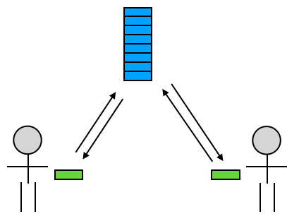

而对于团队中的每个人来说，就会更简单一点：

1. 第一次加入团队时，把中央仓库的代码取下来；
2. 写完的新功能提交到中央仓库；
3. 同事提交到中央仓库的新代码，及时同步下来。

这样，一个三人的团队就成功做到了各自在自己的电脑上开发同一个项目，并且互不影响，就好像你们三个人是在同一台电脑上操作一样。

这就是中央式 VCS 最基本的工作模型。当然，实际的开发工作并没有简单到这种程度，因为你时常会需要处理代码冲突、查看版本历史、回退代码版本等；另外，Git 属于分布式 VCS，它的概念也比中央式 VCS 要复杂一些。但这些概念你需要一步步地理解和吸收，你现在只需要先知道中央式 VCS 的这个基本工作模型，其他的内容我会在后面慢慢地全部讲清楚。
# 什么是分布式版本控制系统（DVCS）

分布式 VCS （Distributed VCS / DVCS）和中央式的区别在于，分布式 VCS 除了中央仓库之外，还有本地仓库：团队中每一个成员的机器上都有一份本地仓库，这个仓库里包含了所有的版本历史，或者换句话说，每个人在自己的机器上就可以提交代码、查看历史，而无需联网和中央仓库交互——当然，取而代之的，你需要和本地仓库交互。

中央式 VCS 的中央仓库有两个主要功能：**保存版本历史**、**同步团队代码**。而在分布式 VCS 中，保存版本历史的工作转交到了每个团队成员的本地仓库中，中央仓库就只剩下了同步团队代码这一个主要任务。它的中央仓库依然也保存了历史版本，但这份历史版本更多的是作为团队间的同步中转站。

## 工作模型

依然以三人团队为例，分布式 VCS 的工作模型大致是这样：

1. 首先，你作为主工程师，独立搭建了项目架构，**并把这些代码提交到了本地仓库**；
2. 然后，你在服务器上创建了一个中央仓库，并把 1 中的提交**从本地仓库推送到了服务器的中央仓库**；
3. 其他同事**把中央仓库的所有内容克隆到本地，拥有了各自的本地仓库**，从此刻开始，你们三人开始并行开发；
4. 在之后的开发过程中，你们三人总是每人独立负责开发一个功能，在这个功能开发过程中，**一个人会把它的每一步改动提交到本地仓库**。注意：由于本地提交无需立即上传到中央仓库，所以每一步提交不必是一个完整功能，而可以是功能中的一个步骤或块。
5. 在一个人把某个功能开发完成之后，他就可以把这个功能相关的所有提交**从本地仓库推送到中央仓库**；
6. 每次当有人把新的提交推送到中央仓库的时候，另外两个人就可以选择**把这些提交同步到自己的机器上，并把它们和自己的本地代码合并**。

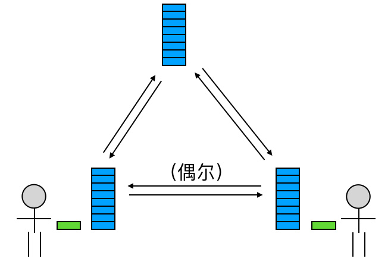

可以看出，这个工作模型和上一节讲的「中央式 VCS 的工作模型」很相似，只是把代码的提交和上传过程拆开了。

另外，和上节讲的中央式 VCS 工作模型一样，这个也只是分布式 VCS 的一个最基本的工作模型，实际的开发工作会比这个麻烦和复杂。但这是个核心模型，你把它理解了，就可以更好地看懂后面的内容。

## 优点与缺点

分布式 VCS 的优点：

1. 大多数的操作可以在本地进行，所以速度更快，而且由于无需联网，所以即使不在公司甚至没有在联网，你也可以提交代码、查看历史，从而极大地减小了开发者的网络条件和物理位置的限制（例如，你可以在飞机上提交代码、切换分支等等）；
2. 由于可以提交到本地，所以你可以分步提交代码，把代码提交做得更细，而不是一个提交包含很多代码，难以 review 也难以回溯。

分布式 VCS 的缺点：

1. 由于每一个机器都有完整的本地仓库，所以初次获取项目（Git 术语：clone）的时候会比较耗时；
2. 由于每个机器都有完整的本地仓库，所以本地占用的存储比中央式 VCS 要高。

> 对于一般的程序项目而言，由于项目的大多数内容都是文本形式的代码，所以工程的体积都并不是很大，再加上文本内容自身的特点，VCS 可以利用算法来把仓库的体积极大地压缩。这就导致，在实际中，Git 等分布式 VCS 的仓库体积并不大，初次获取项目的耗时和本地仓库的存储占用都很小。所以对于大多数的程序项目而言，分布式 VCS 「尺寸大、初次下载慢」的问题其实并不严重。

> 不过也有一些例外，比如游戏开发。游戏的开发中有大量的大尺寸数据和媒体文件，并且这些文件的格式也不容易压缩尺寸，如果用分布式 VCS 会导致仓库的体积非常庞大。所以一些大型游戏的开发会选择中央式的 VCS 来管理代码。
# 上手 1：新公司用 Git 管理代码，怎么快速上手？

```!
已经有 Git 经验的可以跳过这一节
```

刚进入新公司，被告知团队是用 Git 管理项目代码的，而你却从来没用过 Git。纵然同事告诉你「没事，先自学一下」「有问题可以问我」，但你肯定不想一进公司就花太多时间在自我学习上，也不想过多地打扰这些刚认识的同事。怎么办？

对你来说，最重要的是，**先知道 Git 怎么用**。先把最基本的掌握了，至于正规团队使用 Git 有什么额外要求、Git 有什么高级用法、Git 的原理这些，都可以放在这之后。万事开头难，你先把 Git 最基本的使用掌握了，后面的再一步一步来。

## 安装 Git

点击[这里](http://git-scm.com/)去下载个 Git ，安装到你的机器上。或者如果你喜欢用 Homebrew 或 apt 什么的来安装都好，总之，把它安装好。

装好以后，就可以正式开始上手 Git 了。

## 先建个练习项目

学习的时候最好别拿团队的正式项目练手，先在 GitHub 上建一个自己的练习项目。

1. 访问 [GitHub](http://github.com)（用别的平台比如 bitbucket 什么的也行）
2. 注册或登录您的账号
3. 点击右上角的「New Repository」来新建远程仓库
    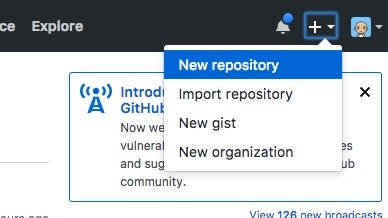
4. 进入仓库设置页面填写信息：其中 ① 是你的仓库名，这个仓库名同样会被 GitHub 设置为你的仓库的根目录的名称；② 是为 `.gitignore` 设置项目类型，`.gitignore` 是 Git 仓库中的一个特殊的文本文件，它里面记录了你不希望提交到仓库的目录和文件的名称或类型，例如你的 `/build` 目录；把 ① 和 ② 填好之后，就可以点 ③ 来完成远程仓库的创建了
    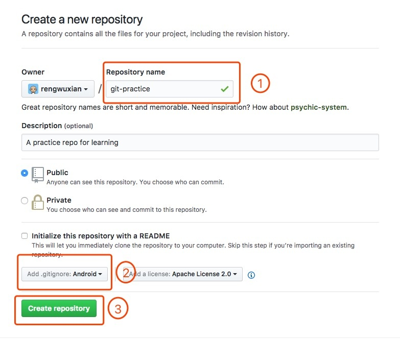

创建完的远程仓库大概长这样：

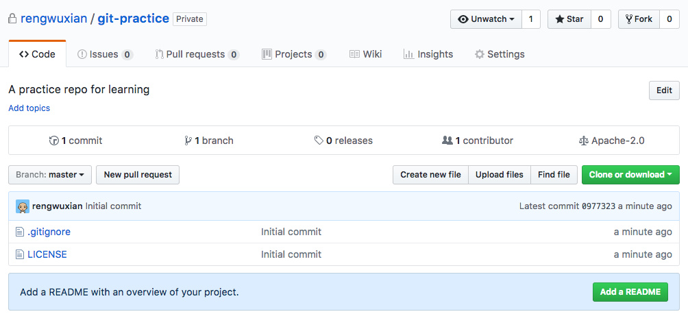

点击右边的「Clone or download」，然后把仓库的 `clone` 地址复制到剪贴板：

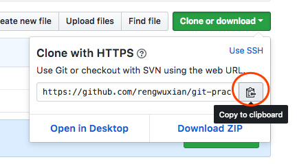

> clone 地址是什么？下面马上就说啦！

## 把远程仓库取到本地

接下来就可以把远程仓库取下来了。取的方式很简单：在 Terminal 或 cmd 中切换到你希望放置项目的目录中，然后输入：

```shell
git clone 你刚复制的地址
```

Git 就会把你的远程仓库 clone 到本地。在这个过程中，你可能会需要输入你的 GitHub 用户名和密码：

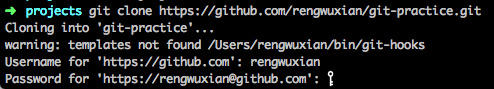

输入正确的用户名和密码以后，你会看到你的当前目录下多了一个新的子目录，它的名字和刚才新建的 GitHub 仓库名一致：

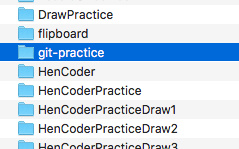

进入这个目录，你会发现这里除了你刚才添加的 `LICENSE` 和 `.gitignore` 文件外，还有一个叫做 `.git` 的隐藏目录。

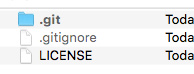

这个 `.git` 目录，就是你的**本地仓库（Local Repository）**，你的所有版本信息都会存在这里。而 `.git` 所在的这个根目录，称为 Git 的**工作目录（Working Directory）**，它保存了你当前从仓库中签出（checkout）的内容。现在你在项目的目录下输入：

```shell
git log
```

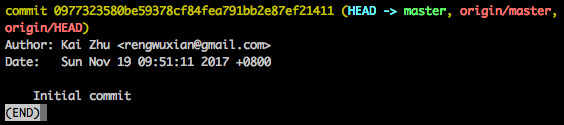

在这里你只能看到一个提交，这个提交是 GitHub 帮你做的，它的内容是创建你的初始 `.gitignore` 和 `LICENSE` 这两个文件。图中第一行中的 `commit` 右边的那一大串字符（09773235…21411），是这个 `commit` 的 SHA-1 校验和（如果不知道什么是 SHA-1，你可以暂时把它简单理解为这个 `commit` 的 ID）；后面括号里的内容（HEAD -> master ...）稍后再讲；第一行的下面，依次是这个 `commit` 的作者、提交日期和提交信息，其中提交信息记录了这个提交做了什么，是提交者填写的（当然，这条提交信息是 GitHub 帮你写的）。

简单看一下这些信息，然后按 `q` 键退出吧，往下继续。

## 自己写个提交试试

把远程仓库取到本地之后，你就可以开始尝试提交代码了。不过为了方便，你不必真的写代码，你可以在工作目录下创建一个文本文件，例如 `shopping list.txt`。

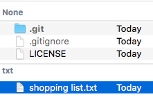

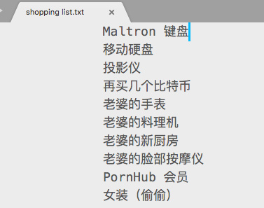

Git 的提交是用的 `commit` 指令。不过……你现在还不能直接提交。你现在在 Terminal 输入：

```shell
git status
```

`status` 是用来查看工作目录当前状态的指令：

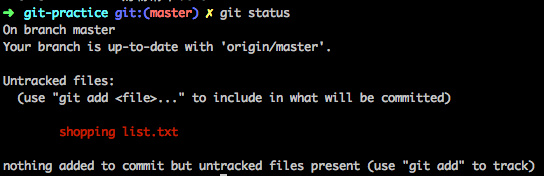

这段文字表述了很多项信息：

1. 你在 `master` branch
2. 当前 branch 没有落后于 `origin/master`
3. 你有 untracked files （未追踪的文件），文件名是 `shopping list.txt`。
4. 你可以使用 `git add` 来开始追踪文件。

其中前两条你可以暂时先不理，branch 的东西我在后面会讲。关于后两条，简单说一下：

从上面的信息可以看出，`shopping list.txt` 这个文件目前属于 "untracked" 状态，它的意思是 Git 仓库对它没有进行任何记录，你在提交的时候不会把它提交上去，查看提交历史也不会看到它。总之，对于 Git 仓库来说，它是不存在的。

而你现在想提交这个文件，所以首先，你需要用 `add` 指令来让 Git 开始跟踪它：

```shell
git add shopping\ list.txt
```

输入这行代码，Terminal 不会给你反馈信息。但这时你再执行一次 `git status`，你会发现显示内容变了：

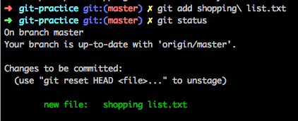

可以看到，`shopping list.txt` 的文字变成了绿色，它的前面多了「new file:」的标记，而它的描述也从 "Untracked files" 变成了 "Changes to be commited"。这些都说明一点：`shopping list.txt` 这个文件的状态从 "untracked"（未跟踪）变成了 "staged"（已暂存），意思是这个文件中被改动的部分（也就是这整个文件啦）被记录进了 staging area（暂存区）。

> 解释一下 "stage" 这个词，这个词对我们中国人可能有一些理解难度。按我们英语课本上的内容来看，stage 是一个名词，它的意思是「舞台」。可是不论从词性还是词义，「舞台」都不太能解释 "stage" 或 "staging area" 的意思。实质上，Git 中的 stage 取自这个词的另一个意思：组织和准备某个事件。而 "staging area" 的意思也并不是「舞台区域」，而是「用来汇集物品或材料以备使用的区域」的意思。
>
> 所以 stage 这个词在 Git 里，是「集中收集改动以待提交」的意思；而 staging area ，就是一个「汇集待提交的文件改动的地方」。简称「暂存」和「暂存区」。至于 staged 表示「已暂存」，就不用再解释了吧？

所谓的 staging area，是 `.git` 目录下一个叫做 `index` 的文件（嗯，它的文件名并不叫 `stage` ）。你通过 `add` 指令暂存的内容，都会被写进这个文件里。

现在文件已经放进了暂存区，就可以提交了。提交的方式是用 `commit` 指令：

```shell
git commit
```

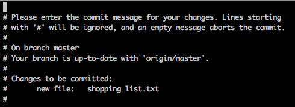

然后你会进入这样一个界面，这个界面是用来填写提交信息（commit message）的。根据操作系统以及设置的不同，这个界面的编辑器可能是 nano 或者 vi 或者别的什么，总之如果你不会用它，那么建议你尽快上网搜搜它的用法，因为 Git 的操作会经常用到它。在这里我只简单说一下它的最基本用法：

- 在初始状态下，你是在命令模式，不能编辑这个文件，你需要按一下 "i"（小写）来切换到插入模式，然后就可以输入你的提交信息了：

  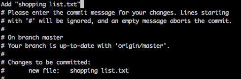

- 在输入完成后别按回车，而是要按 ESC 键返回到命令模式，然后连续输入两个大写的 "Z"（用 Shift 键或 Capslock 键都可以），就保存并退出了。

  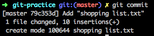

这样，一次提交就完成了。如上图这样，从界面中你可以看到这次提交的简单信息。这时如果你再执行一次刚才执行过的 `git log`（还记得这个指令是什么意思吗？它会列出你的提交历史）：

```shell
git log
```

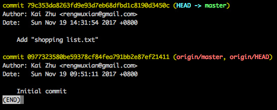

可以看到，你的这条提交被列在了最上面，现在你的提交历史中有两条记录了。这说明，你已经成功做了一次提交到本地仓库，它已经被保存在了 `.git` 这个目录里的某个地方了。

## 再来个提交

想来想去，我还是觉得把「女装」列在购物清单有点太羞耻了，所以还是把它删掉吧：

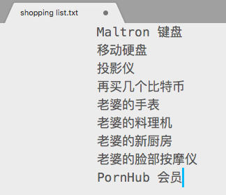

嗯删掉以后脸不烫了，赶紧把它提交上去。提交之前先看看文件状态是个好习惯：

```shell
git status
```

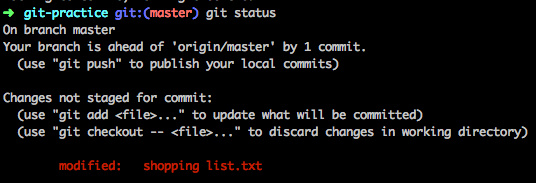

可以看到，`shopping list.txt` 又变红了，不过这次它左边的文字不是 "New file:" 而是 "modified:"，而且上方显示它的状态也不是 "Untracked" 而是 "not staged for commit"，意思很明确：Git 已经认识这个文件了，它不是个新文件，但它有了一些改动。所以虽然状态的显示有点不同，但处理方式还是一样的：

```shell
git add shopping\ list.txt
```

这时再 `status` 一下，就会看到 `shopping list.txt` 已经 staged ("to be commited") 了：

```shell
git status
```

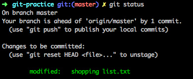

好，最后一步，`commit`：

```shell
git commit
```

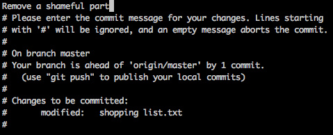

这时再看看 `log`，你已经有三条 `commit`s 了：

```shell
git log
```

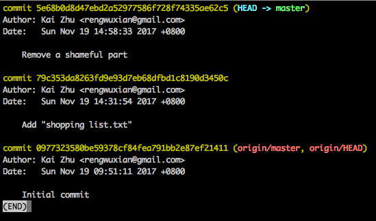

## 把提交推送到中央仓库

到现在为止，已经写了两条提交，但它们都还在本地仓库。为了把代码分享出去，你还需要把这些提交上传到中央仓库。如果你现在再看一下 `status`：

```shell
git status
```


你会看到，Git 提示你的当前 branch 已经领先于（ "ahead of" ）'origin/master' 两个提交了。就像上面我说的，branch 这个概念我到后面再讲，`origin/master` 的中的 `origin` 是远端仓库的名称，是你在用 `clone` 指令初始化本地仓库时 Git 自动帮你起的默认名称；`master` 是 `origin` 上的分支名称。不过对于现在来说，可以暂时把 `origin/master` 简单理解为「中央仓库」。也就是说，这句话是告诉你，你的本地仓库已经领先中央仓库两个提交了。这两个提交很明显就是指的刚才那两个关于 `shopping list.txt` 的提交。

而这句话的下面也说明了，你可以使用 `git push` 来把你的本地提交发布（即上传到中央仓库）。所以很简单，照做吧：

```shell
git push
```

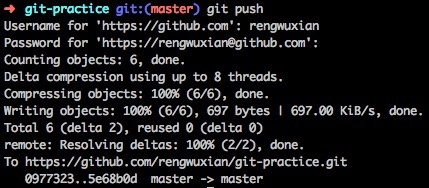

由于这是联网操作，所以在这个过程 GitHub 会再次向你索要账户和密码。填入正确的账户和密码，`push` 操作就完成了。这时你再去你的 GitHub 仓库页面看一下：

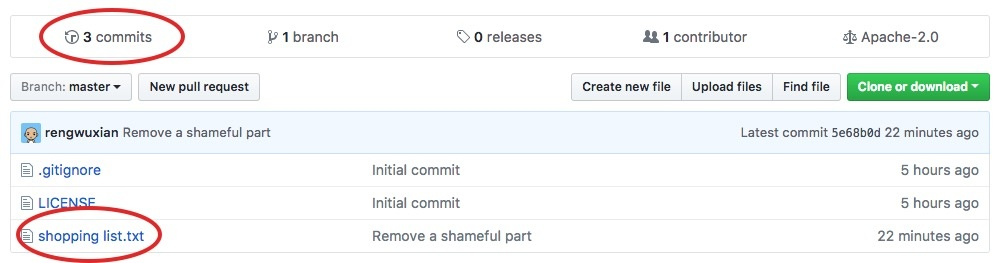

你会发现 `shopping list.txt` 文件已经在上面了，并且 `commits` 的数量从一个变成了 3 个。这说明你已经成功把本地仓库的提交推送到了服务器。

> 如果觉得一遍遍地输入密码很烦，可以按照[这个页面](http://help.github.com/articles/caching-your-github-password-in-git/) 提供的方案来把密码保存起来。
>
> 另外还有一个更简单但安全性低一些的方案。执行这行代码：
>
> ```shell
> git config credential.helper store
> ```
>
> 在这之后你只需要再输入一次密码， Git 就会把你的密码保存下来，这之后就再也不用输入了。说它「安全性低」，是因为这条指令会让 Git 把你的密码以明文形式保存在你的电脑上。具体这两种保存密码的方案选择哪个，看你自己了。

## 小结

在这一节里，描述了 Git 的最基本的工作模型：

1. 从 GitHub 把中央仓库 clone 到本地（使用命令： `git clone`）
2. 把写完的代码提交（先用 `git add 文件名` 把文件添加到暂存区，再用 `git commit` 提交）
   - 在这个过程中，可以使用 `git status` 来随时查看工作目录的状态
   - 每个文件有 "changed / unstaged"（已修改）, "staged"（已修改并暂存）, "commited"（已提交） 三种状态，以及一种特殊状态 "untracked"（未跟踪）
3. 提交一次或多次之后，把本地提交 `push` 到中央仓库（`git push`）

下一节将会讲一下在团队开发中会遇到的问题，从而以这种工作模型为基础，延伸到团队开发的基本工作模型。

但在这之前，强烈建议你先按照这节的内容照做一遍，并尝试理解这一节中所说的工作模型。不然的话，可能会出现「小册看完了，却还是不知道怎么做」的情况。
# 上手 2：团队工作的基本工作模型

对于 Git 来说，团队合作和个人独立工作最大的不同在于，你会提交代码，别人也会提交；你会 push，别人也会 push，因此除了把代码上传，每个人还需要把别人最新的代码下载到自己的电脑。而且，这些工作都是并行进行的。

这就很复杂了！

这节的内容，就是简单阐述一下团队合作中 Git 的基本工作模型。

## 把别人的新提交拿到本地

先说一种简单的情况：你的同事刚把他写的几个提交 push 到了中央仓库，你怎么把它们取下来。

### 假装同事

除非你能要求同事陪你练习 Git，否则，你只能一人分饰两角：时不时地模拟一下同事的操作，来达到独自一人做多人项目练习的效果。而为了模拟同事的操作，你需要在你的 `/git-practice` 目录旁再 clone 一次中央仓库到本地，来当做你的模拟同事的本地仓库：

```shell
git clone http://github.com/rengwuxian/git-practice.git git-practice-another
```

```!
注意！执行这条之前别忘了先 `cd ..` 切换到父目录，不然你会把新的本地仓库创建在原先的本地仓库的工作目录内。
```

为了目录名称不冲突，这次的 `clone` 需要加一个额外参数（上面那行代码最后的 `git-practice-another`）来手动指定本地仓库的根目录名称。在这条指令执行完成后，你就有了两个内容相同的本地仓库：

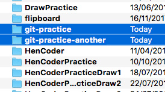

现在，你就可以假装 `/git-practice` 这个目录是你的电脑上的工作目录，而那个新建的 `/git-practice-another` 是你同事的电脑上的工作目录。


如果你对这样的操作有担心，大可不必，这种操作不会有任何问题。因为 Git 的管理是目录级别，而不是设备级别的。也就是说，`/git-practice` 目录内的 `.git` 只管理 `/git-practice` 里的内容，`/git-practice-another` 目录内的 `.git` 也只管理 `/git-practice-another` 里的内容，它们之间互不知晓，也互不影响。

### 帮同事提交代码并 push 到中央仓库

要在你的电脑上把同事的代码取下来，首先 GitHub 上要有你同事的新代码，也就是说，你首先要把同事的代码 push 到中央仓库去。所以第一步，切换到同事的目录：

```shell
cd git-practice-another
```

现在，到了同事的工作目录，你的身份就是你的同事了。帮他写点代码吧！嗯……写点什么好呢？

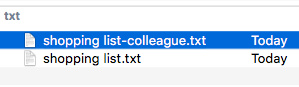


嗯，看起来不错，帮他提交吧：

```shell
git add shopping\ list-colleague.txt
git commit
```

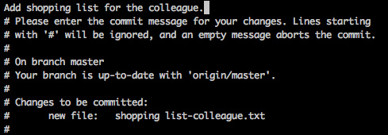

提交完成以后，`push` 到 GitHub：

```shell
git push
```

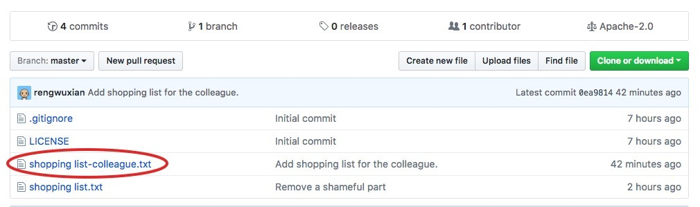

## 把同事 push 的新代码取下来

GitHub 上有了同事的新代码以后，你就可以变回自己，把「他」刚 push 上去的代码取到你的仓库了。首先，切回 `/git-practice` 目录：

```shell
cd ../git-practice
```

然后，把同事的代码取下来吧！从远程仓库更新内容，用的是一个新的指令：`pull`。

```shell
git pull
```

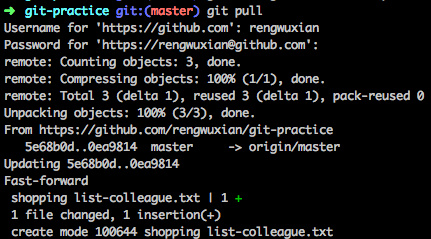

这时候再看看你的本地目录，可以看到，同事提交的 `shopping list-colleagure.txt` 已经同步到本地了。也就是说，现在你的本地仓库和同事的又一致了。

## 多人合作的基本工作模型

这就完成了一次简单的合作流程：

1. 同事 `commit` 代码到他的本地，并 `push` 到 GitHub 中央仓库
2. 你把 GitHub 的新提交通过 `pull` 指令来取到你的本地

通过这个流程，你和同事就可以简单地合作了：你写了代码，`commit`，`push` 到 GitHub，然后他 `pull` 到他的本地；他再写代码，`commit`, `push` 到 GitHub，然后你再 `pull` 到你的本地。你来我往，配合得不亦乐乎。

但是，这种合作有一个严重的问题：同一时间内，只能有一个人在工作。你和同事其中一个人写代码的时候，另一个人不能做事，必须等着他把工作做完，代码 `push` 到 GitHub 以后，自己才能把 `push` 上去的代码 `pull` 到自己的本地。而如果同时做事，就会发生冲突：当一个人先于另一个人 `push` 代码（这种情况必然会发生），那么后 `push` 的这个人就会由于中央仓库上含有本地没有的提交而导致 `push` 失败。 

> 为什么会失败？
>
> 因为 Git 的` push` 其实是用本地仓库的 commits 记录去覆盖远端仓库的 commits 记录（注：这是简化概念后的说法，push 的实质和这个说法略有不同），而如果在远端仓库含有本地没有的 commits 的时候，`push` （如果成功）将会导致远端的 commits 被擦掉。这种结果当然是不可行的，因此 Git 会在 `push` 的时候进行检查，如果出现这样的情况，push 就会失败。

怎么办？下面就说。

## push 发生冲突

在现实的团队开发中，全队是同时并行开发的，所以必然会出现当一人 `push` 代码时，中央仓库已经被其他同事先一步 `push` 了的情况。为了不让文段显得太过混乱，这里我就不带着你一步步模拟这个过程了。如果你希望模拟的话，这里是步骤：

1. 切到 `git-practice-another` 去，假扮成你的同事做一个 `commit`，然后 `push` 到 GitHub
2. 切回 `git-practice` 变回你自己，做一个不一样的 `commit`。

这个时候，远端中央仓库已经有了别人 `push` 的 `commit`，现在你如果 `push` 的话：

```shell
git push
```

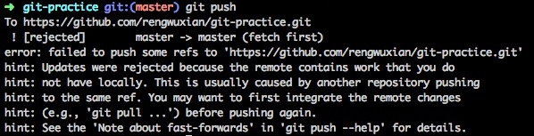

从上图中的提示语可以看出来（好吧这么长的提示语有人表示不想看），由于 GitHub 的远端仓库上含有本地仓库没有的内容，所以这次 `push` 被拒绝了。这种冲突的解决方式其实很简单：**先用 `pull` 把远端仓库上的新内容取回到本地和本地合并，然后再把合并后的本地仓库向远端仓库推送**。

```shell
git pull
```

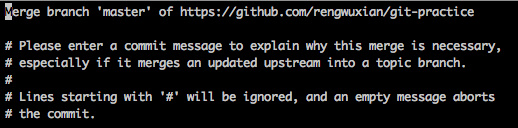

在上面的文段里，我已经举过一次 `git pull` 的例子，但这次的 `git pull` 操作并没有像之前的那样直接结束，而是进入了上图这样的一个输入提交信息的界面。这是因为当 `pull` 操作发现不仅远端仓库包含本地没有的 `commit`s，而且本地仓库也包含远端没有的 `commit`s 时，它就会把远端和本地的独有 `commit`s 进行合并，自动生成一个新的 `commit` ，而上图的这个界面，就是这个自动生成的 `commit` 的提交信息界面。另外，和手动的 `commit` 不同，这种 `commit` 会自动填入一个默认的提交信息，简单说明了这条 `commit` 的来由。你可以直接退出界面来使用这个自动填写的提交信息，也可以修改它来填入自己提交信息。

> 这种「把不同的内容进行合并，生成新的提交」的操作，叫做合并（呵呵呵哈哈），它所对应的 Git 指令是 `merge`。事实上，`git pull` 这个指令的内部实现就是把远程仓库使用 `git fetch` 取下来以后再进行 `merge` 操作的。关于更多 `merge` 的介绍，我会在后面说，这节先不讲了。

在退出提交信息的界面后，这次 `pull` 就完成了：远端仓库被取到了本地，并和本地仓库进行了合并。在这个时候，就可以再 `push` 一次了。由于现在本地仓库已经包含了所有远端仓库的 commits，所以这次 `push` 不会再失败：

```shell
git push
```

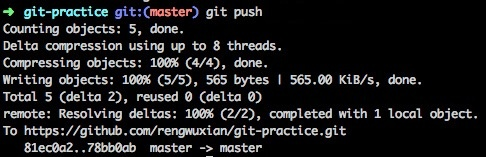

这样，就把 `push` 时本地仓库和远端仓库内容冲突的问题解决了。

## 小结：多人合作的基本工作模型 2.0

这样，就把刚才的那个「多人合作的基本工作模型」进行了改良：

1. 写完所有的 `commit` 后，不用考虑中央仓库是否有新的提交，直接 `push` 就好
2. 如果 `push` 失败，就用 `pull` 把本地仓库的提交和中央仓库的提交进行合并，然后再 `push` 一次

到此为止，这个工作模型已经是一个最简单的可用的工作模型了。一个小团队如果对版本管理没有什么要求的话，这个工作模型已经可以让团队用来合作开发了。

但是，这种模型由于过于简单，所以只能适用于对代码管理没太大需求的开发团队。接下来，我将介绍一种基于 branch 的工作模型，很多中小型团队的代码开发都是采用的这种工作模型。不过……需要花 4 节的时间，因为它涉及到了 Git 的一些核心理论，一些许多 Git 老手都没有真正掌握的理论。
# 进阶 1：HEAD、master 与 branch

这一节主要是几个概念的解释：HEAD、master 以及 Git 中非常重要的一个概念： branch。

## 引用：commit 的快捷方式

首先，再看一次 `log`：

```shell
git log
```

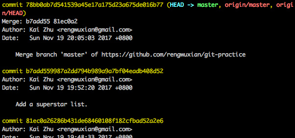

第一行的 `commit` 后面括号里的 `HEAD -> master, origin/master, origin/HEAD` ，是几个指向这个 `commit` 的引用。在 Git 的使用中，经常会需要对指定的 `commit` 进行操作。每一个 `commit` 都有一个它唯一的指定方式——它的 SHA-1 校验和，也就是上图中每个黄色的 `commit` 右边的那一长串字符。两个 SHA-1 值的重复概率极低，所以你可以使用这个 SHA-1 值来指代 `commit`，也可以只使用它的前几位来指代它（例如第一个 `78bb0ab7d541…16b77`，你使用 `78bb0ab` 甚至 `78bb` 来指代它通常也可以），但毕竟这种没有任何含义的字符串是很难记忆的，所以 Git 提供了「引用」的机制：使用固定的字符串作为引用，指向某个 `commit`，作为操作 `commit` 时的快捷方式。

## HEAD：当前 commit 的引用

上一段里说到，图中括号里是指向这个 `commit` 的引用。其中这个括号里的 `HEAD` 是引用中最特殊的一个：它是**指向当前 `commit` 的引用**。所谓**当前 `commit`**这个概念很简单，它指的就是当前工作目录所对应的 `commit`。

例如上图中的当前 `commit` 就是第一行中的那个最新的 `commit`。每次当有新的 `commit` 的时候，工作目录自动与最新的 `commit` 对应；而与此同时，`HEAD` 也会转而指向最新的 `commit`。事实上，当使用 `checkout`、`reset` 等指令手动指定改变当前 `commit` 的时候，`HEAD` 也会一起跟过去。

总之，当前 `commit` 在哪里，`HEAD` 就在哪里，这是一个永远自动指向当前 `commit` 的引用，所以你永远可以用 `HEAD` 来操作当前 `commit`。

## branch

`HEAD` 是 Git 中一个独特的引用，它是唯一的。而除了 `HEAD` 之外，Git 还有一种引用，叫做 `branch`（分支）。`HEAD` 除了可以指向 `commit`，还可以指向一个 `branch`，当它指向某个 `branch` 的时候，会通过这个 `branch` 来间接地指向某个 `commit`；另外，当 `HEAD` 在提交时自动向前移动的时候，它会像一个拖钩一样带着它所指向的 `branch` 一起移动。

例如上面的那张图里，`HEAD -> master` 中的 `master` 就是一个 `branch` 的名字，而它左边的箭头 `->` 表示 `HEAD` 正指向它（当然，也会间接地指向它所指向的 `commit`）。

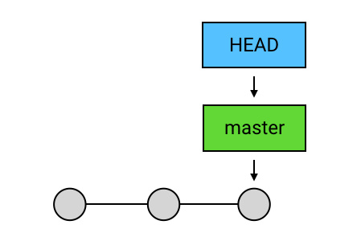

如果我在这时创建一个 `commit`，那么 `HEAD` 会带着 `master` 一起移动到最新的 `commit`：

```shell
git commit
```

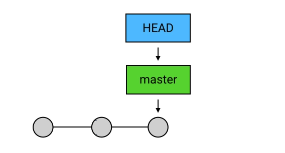

通过查看 `log`，可以对这个逻辑进行验证：

```shell
git log
```

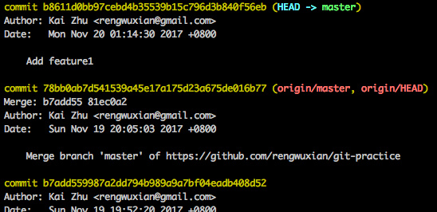

从图中可以看出，最新的 `commit` （提交信息："Add feature1"）被创建后，`HEAD` 和 `master` 这两个引用都指向了它，而在上面第一张图中的后两个引用 `origin/master` 和 `origin/HEAD` 则依然停留在原先的位置。

## master: 默认 branch

上面的这个 `master` ，其实是一个特殊的 `branch`：它是 Git 的默认 `branch`（俗称主 `branch` / 主分支）。

所谓的「默认 branch」，主要有两个特点：

1. 新创建的 repository（仓库）是没有任何 `commit` 的。但在它创建第一个 `commit` 时，会把 `master` 指向它，并把 `HEAD` 指向 `master`。

   

2. 当有人使用 `git clone` 时，除了从远程仓库把 `.git` 这个仓库目录下载到工作目录中，还会 `checkout` （签出） `master`（`checkout` 的意思就是把某个 `commit` 作为当前 `commit`，把 `HEAD` 移动过去，并把工作目录的文件内容替换成这个 `commit` 所对应的内容）。

   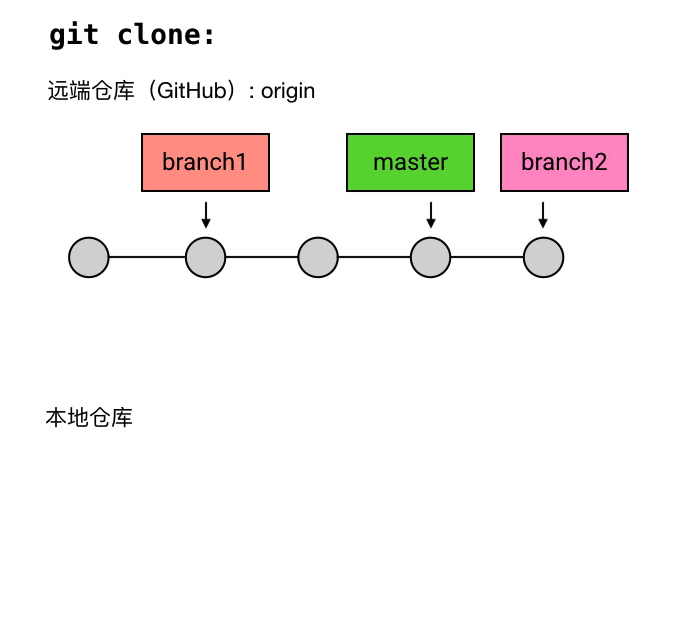

另外，需要说一下的是，大多数的开发团队会规定开发以 `master` 为核心，所有的分支都在一定程度上围绕着 `master` 来开发。这个在事实上构成了 `master` 和其它分支在地位上的一个额外的区别。

## branch 的通俗化理解

尽管在 Git 中，`branch` 只是一个指向 `commit` 的引用，但它有一个更通俗的理解：你还可以把一个 `branch` 理解为从初始 `commit` 到 `branch` 所指向的 `commit` 之间的所有 `commit`s 的一个「串」。例如下面这张图：

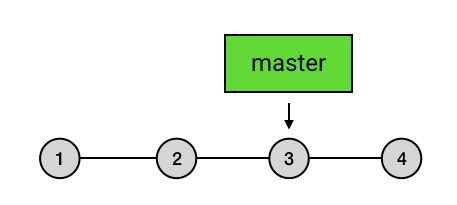

`master` 的本质是一个指向 `3` 的引用，但你也可以把 `master` 理解为是 `1` `2` `3` 三个 `commit` 的「串」，它的起点是 `1`，终点是 `3`。

这种理解方式比较符合 `branch` 这个名字的本意（branch 的本意是树枝，可以延伸为事物的分支），也是大多数人对 `branch` 的理解。不过如果你选择这样理解 `branch`，需要注意下面两点：

1. 所有的 `branch` 之间都是平等的。

   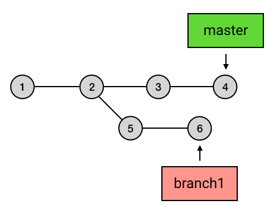

   例如上面这张图，`branch1` 是 `1` `2` `5` `6` 的串，而不要理解为 `2` `5` `6` 或者 `5` `6` 。其实，起点在哪里并不是最重要的，重要的是你要知道，所有 `branch` 之间是平等的，`master` 除了上面我说的那几点之外，并不比其他 `branch` 高级。这个认知的理解对于 `branch` 的正确使用非常重要。

   换个角度来说，上面这张图我可以用别的画法来表达，它们的意思是一样的：

   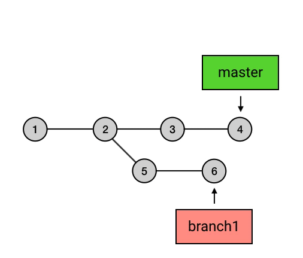

   通过这张动图应该能够对「平等」这个概念更好地理解了吧？

2. `branch` 包含了从初始 `commit` 到它的所有路径，而不是一条路径。并且，这些路径之间也是彼此平等的。

   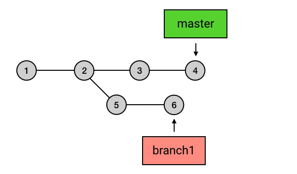

   像上图这样，`master` 在合并了 `branch1` 之后，从初始 `commit` 到 `master` 有了两条路径。这时，`master` 的串就包含了 `1` `2` `3` `4` `7` 和 `1` `2` `5` `6` `7` 这两条路径。而且，这两条路径是平等的，`1` `2` `3` `4` `7`  这条路径并不会因为它是「原生路径」而拥有任何的特别之处。

如果你喜欢用「树枝」的概念来理解 Git 的 `branch`，一定要注意上面说的这两点，否则在今后使用 `branch` 的时候就可能与出现理解偏差或者使用方式不当的问题。事实上我本人并不喜欢用这种方式来理解 `branch`，因为觉得它有点舍近求远的味道：我为了「直观」地思考，给它了一个形象的比喻，但由于它的本质含义其实更加简单，导致我的这种比喻反而增加了思考它时的复杂度，未免有点画蛇添足。不过这是我自己的感受，怎么理解 `branch` 是个个人偏好的问题，这两种理解方式你选一个喜欢的就好。

## branch 的创建、切换和删除

### 创建 branch

如果你想在某处创建 `branch` ，只需要输入一行 `git branch 名称`。例如你现在在 `master` 上：

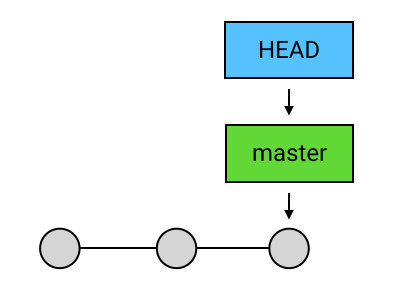

你想在这个 `commit` 处创建一个叫做 "feature1" 的 `branch`，只要输入：

```shell
git branch feature1
```

你的 `branch` 就创建好了：

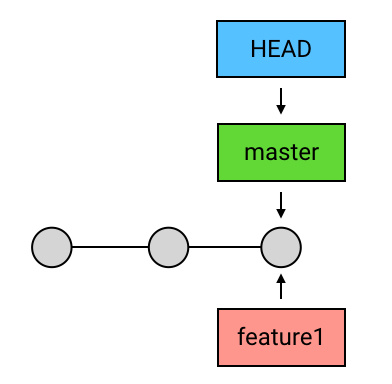

### 切换 branch

不过新建的 `branch` 并不会自动切换，你的 `HEAD` 在这时依然是指向 `master` 的。你需要用 `checkout` 来主动切换到你的新 `branch` 去：

```shell
git checkout feature1
```

然后 `HEAD` 就会指向新建的 `branch` 了：

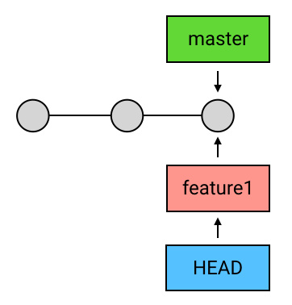

除此之外，你还可以用 `git checkout -b 名称` 来把上面两步操作合并执行。这行代码可以帮你用指定的名称创建 `branch` 后，再直接切换过去。还以 `feature1` 为例的话，就是：

```shell
git checkout -b feature1
```

在切换到新的 `branch` 后，再次 `commit` 时 `HEAD` 就会带着新的 `branch` 移动了：

```shell
...
git commit
```

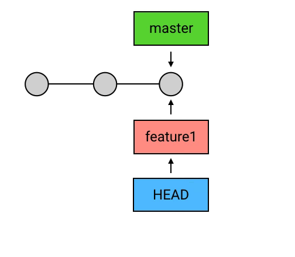

而这个时候，如果你再切换到 `master` 去 `commit`，就会真正地出现分叉了：

```shell
git checkout master
...
git commit
```

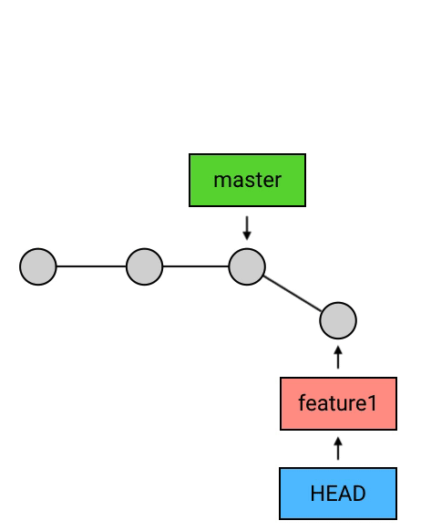

### 删除 branch

删除 `branch` 的方法非常简单：`git branch -d 名称`。例如要删除 `feature1` 这个 branch：

```shell
git branch -d feature1
```

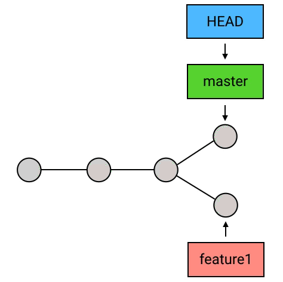

需要说明的有两点：

1.  `HEAD` 指向的 `branch` 不能删除。如果要删除 `HEAD` 指向的 `branch`，需要先用 `checkout` 把 `HEAD` 指向其他地方。
2.  由于 Git 中的 `branch` 只是一个引用，所以删除 `branch` 的操作也只会删掉这个引用，并不会删除任何的 `commit`。（不过如果一个 `commit` 不在任何一个 `branch` 的「路径」上，或者换句话说，如果没有任何一个 `branch` 可以回溯到这条 `commit`（也许可以称为野生 `commit`？），那么在一定时间后，它会被 Git 的回收机制删除掉。）
3.  出于安全考虑，没有被合并到 `master` 过的 `branch` 在删除时会失败（因为怕你误删掉「未完成」的 `branch` 啊）：
    
    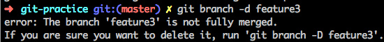
    
    这种情况如果你确认是要删除这个 `branch` （例如某个未完成的功能被团队确认永久毙掉了，不再做了），可以把 `-d` 改成 `-D`，小写换成大写，就能删除了。
    
    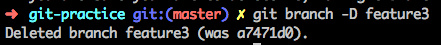

## 「引用」的本质

所谓「引用」（reference），其实就是一个个的字符串。这个字符串可以是一个 `commit` 的 SHA-1 码（例：`c08de9a4d8771144cd23986f9f76c4ed729e69b0`），也可以是一个 `branch`（例：`ref: refs/heads/feature3`）。

Git 中的 `HEAD` 和每一个 `branch` 以及其他的引用，都是以文本文件的形式存储在本地仓库 `.git` 目录中，而 Git 在工作的时候，就是通过这些文本文件的内容来判断这些所谓的「引用」是指向谁的。

## 小结

这一节介绍了 Git 中的一些「引用」：`HEAD`、`master`、`branch`。这里总结一下：

1. `HEAD` 是指向当前 `commit` 的引用，它具有唯一性，每个仓库中只有一个 `HEAD`。在每次提交时它都会自动向前移动到最新的 `commit` 。
2. `branch` 是一类引用。`HEAD` 除了直接指向 `commit`，也可以通过指向某个 `branch` 来间接指向 `commit`。当 `HEAD` 指向一个 `branch` 时，`commit` 发生时，`HEAD` 会带着它所指向的 `branch` 一起移动。
3. `master` 是 Git 中的默认 `branch`，它和其它 `branch` 的区别在于：
   1. 新建的仓库中的第一个 `commit` 会被 `master` 自动指向；
   2. 在 `git clone` 时，会自动 `checkout` 出 `master`。
4. `branch` 的创建、切换和删除：
   1. 创建 `branch` 的方式是 `git branch 名称` 或 `git checkout -b 名称`（创建后自动切换）；
   2. 切换的方式是 `git checkout 名称`；
   3. 删除的方式是 `git branch -d 名称`。
# 进阶 2：push 的本质

在之前的内容里，我粗略地说过，`push` 指令做的事是把你的本地提交上传到中央仓库去，用本地的内容来覆盖掉远端的内容。这个说法其实是不够准确的，但 Git 的知识系统比较庞大，在你对 Git 了解比较少的时候，用「上传本地提交」来解释会比较好理解；而在你知道了 `branch`，并且明白了 `branch` 的具体含义以后，我就可以告诉你 `push` 到底是什么了。

## push：把 branch 上传到远端仓库

实质上，`push` 做的事是：把当前 `branch` 的位置（即它指向哪个 `commit`）上传到远端仓库，并把它的路径上的 `commit`s 一并上传。

例如，我现在的本地仓库有一个 `master` ，它超前了远程仓库两个提交；另外还有一个新建的 `branch` 叫 `feature1`，远程仓库还没有记载过它。具体大概像这样：


这时我执行 `git push`，就会把 `master` 的最新位置更新到远端，并且把它的路径上的 `5` `6` 两个 `commit`s 上传：

```shell
git push
```


而如果这时候我再切到 `feature1` 去后再执行一次 `push`，就会把 `feature1` 以及它的 `commit` `4` 上传到远程仓库：

```shell
git checkout feature1
git push origin feature1
```

> 这里的 `git push` 和之前有点不同：多了 `origin feature1` 这两个参数。其中 `origin` 是远程仓库的别名，是你在 `git clone` 的时候 Git 自动帮你起的；`feature1` 是远程仓库中目标 `branch` 的名字。这两个参数合起来指定了你要 `push` 到的目标仓库和目标分支，意思是「我要 push 到 `origin` 这个仓库的 `feature1` 分支」。
>
> 在 Git 中（2.0 及它之后的版本），默认情况下，你用不加参数的 `git push` 只能上传那些之前从远端 `clone` 下来或者 `pull` 下来的分支，而如果需要 `push` 你本地的自己创建的分支，则需要手动指定目标仓库和目标分支（并且目标分支的名称必须和本地分支完全相同），就像上面这样。
>
> 你可以通过 `git config` 指令来设置 `push.default` 的值来改变 `push` 的行为逻辑，例如可以设置为「所有分支都可以用 `git push` 来直接 push，目标自动指向 `origin` 仓库的同名分支」（对应的 `push.default` 值：`current`），或者别的什么行为逻辑，你甚至可以设置为每次执行 `git push` 时就自动把所有本地分支全部同步到远程仓库（虽然这可能有点耗时和危险）。如果希望详细了解，你可以到[这里](http://git-scm.com/docs/git-config#git-config-pushdefault)看看。


细心的人可能会发现，在 `feature1` 被 `push` 时，远程仓库的 `HEAD` 并没有和本地仓库的 `HEAD` 一样指向 `feature1`。这是因为，`push` 的时候只会上传当前的 `branch` 的指向，并不会把本地的 `HEAD` 的指向也一起上传到远程仓库。事实上，远程仓库的 `HEAD` 是永远指向它的默认分支（即 master，如果不修改它的名称的话），并会随着默认分支的移动而移动的。

## 小结

这一节介绍了 `push` 这个指令的本质。总结一下关键点：

1. `push` 是把当前的分支上传到远程仓库，并把这个 `branch` 的路径上的所有 `commit`s 也一并上传。
2. `push` 的时候，如果当前分支是一个本地创建的分支，需要指定远程仓库名和分支名，用 `git push origin branch_name` 的格式，而不能只用 `git push`；或者可以通过 `git config` 修改 `push.default` 来改变 `push` 时的行为逻辑。
3. `push` 的时候之后上传当前分支，并不会上传 `HEAD`；远程仓库的 `HEAD` 是永远指向默认分支（即 `master`）的。
# 进阶 3：merge：合并 commits

前面说到，`pull` 的内部操作其实是把远程仓库取到本地后（使用的是 `fetch`），再用一次 `merge` 来把远端仓库的新 `commits` 合并到本地。这一节就说一下，`merge` 到底是什么。

## 含义和用法

`merge` 的意思是「合并」，它做的事也是合并：指定一个 `commit`，把它合并到当前的 `commit` 来。具体来讲，`merge` 做的事是：

**从目标 `commit` 和当前 `commit` （即 `HEAD` 所指向的 `commit`）分叉的位置起，把目标 `commit` 的路径上的所有 `commit` 的内容一并应用到当前 `commit`，然后自动生成一个新的 `commit`。**

例如下面这个图中：


`HEAD` 指向了 `master`，所以如果这时执行：

```shell
git merge branch1
```

Git 会把 `5` 和 `6` 这两个 `commit` 的内容一并应用到 `4` 上，然后生成一个新的提交，并跳转到提交信息填写的界面：


`merge` 操作会帮你自动地填写简要的提交信息。在提交信息修改完成后（或者你打算不修改默认的提交信息），就可以退出这个界面，然后这次 `merge` 就算完成了。


## 适用场景

`merge` 有什么用？最常用的场景有两处：

1. 合并分支

   当一个 `branch` 的开发已经完成，需要把内容合并回去时，用 `merge` 来进行合并。

   > 那 `branch` 又应该怎么用呢？
   >
   > 下节就说。

2. `pull` 的内部操作

   之前说过，`pull` 的实际操作其实是把远端仓库的内容用 `fetch` 取下来之后，用 `merge` 来合并。

## 特殊情况 1：冲突

`merge` 在做合并的时候，是有一定的自动合并能力的：如果一个分支改了 A 文件，另一个分支改了 B 文件，那么合并后就是既改 A 也改 B，这个动作会自动完成；如果两个分支都改了同一个文件，但一个改的是第 1 行，另一个改的是第 2 行，那么合并后就是第 1 行和第 2 行都改，也是自动完成。


但，如果两个分支修改了同一部分内容，`merge` 的自动算法就搞不定了。这种情况 Git 称之为：冲突（Conflict）。


直白点说就是，你的两个分支改了相同的内容，Git 不知道应该以哪个为准。如果在 `merge` 的时候发生了这种情况，Git 就会把问题交给你来决定。具体地，它会告诉你 `merge` 失败，以及失败的原因：

```shell
git merge feature1
```


提示信息说，在 `shopping list.txt` 中出现了 "merge conflict"，自动合并失败，要求 "fix conflicts and then commit the result"（把冲突解决掉后提交）。那么你现在需要做两件事：

1. 解决掉冲突
2. 手动 `commit` 一下

### 1. 解决冲突

解决掉冲突的方式有多个，我现在说最直接的一个。你现在再打开 `shopping list.txt` 看一下，会发现它的内容变了：


可以看到，Git 虽然没有帮你完成自动 `merge`，但它对文件还是做了一些工作：它把两个分支冲突的内容放在了一起，并用符号标记出了它们的边界以及它们的出处。上面图中表示，`HEAD` 中的内容是 `移动硬盘（已买）`，而 `feature1` 中的内容则是 `移动硬盘（不买了）`。这两个改动 Git 不知道应该怎样合并，于是把它们放在一起，由你来决定。假设你决定保留 `HEAD` 的修改，那么只要删除掉 `feature1` 的修改，再把 Git 添加的那三行 `<<<` `===` `>>>` 辅助文字也删掉，保存文件退出，所谓的「解决掉冲突」就完成了。


你也可以选择使用更方便的 `merge` 工具来解决冲突，这个你可以自己搜索一下。

### 2. 手动提交

解决完冲突以后，就可以进行第二步—— `commit` 了。

```shell
git add shopping\ list.txt # 嗯是的，这里 commit 前也需要先 add 一下
git commit
```


可以看到，被冲突中断的 `merge`，在手动 `commit` 的时候依然会自动填写提交信息。这是因为在发生冲突后，Git 仓库处于一个「merge 冲突待解决」的中间状态，在这种状态下 `commit`，Git 就会自动地帮你添加「这是一个 merge commit」的提交信息。

### 放弃解决冲突，取消 merge？

同理，由于现在 Git 仓库处于冲突待解决的中间状态，所以如果你最终决定放弃这次 `merge`，也需要执行一次 `merge --abort` 来手动取消它：

```shell
git merge --abort
```

输入这行代码，你的 Git 仓库就会回到 `merge` 前的状态。

## 特殊情况 2：HEAD 领先于目标 commit

如果 `merge` 时的目标 `commit` 和 `HEAD` 处的 `commit` 并不存在分叉，而是 `HEAD` 领先于目标 `commit`：


那么 `merge` 就没必要再创建一个新的 `commit` 来进行合并操作，因为并没有什么需要合并的。在这种情况下， Git 什么也不会做，`merge` 是一个空操作。

## 特殊情况 3：HEAD 落后于 目标 commit——fast-forward

而另一种情况：如果 `HEAD` 和目标 `commit` 依然是不存在分叉，但 `HEAD` 不是领先于目标 `commit`，而是落后于目标 `commit`： 


那么 Git 会直接把 `HEAD`（以及它所指向的 `branch`，如果有的话）移动到目标 `commit`：

```shell
git merge feature1
```


这种操作有一个专有称谓，叫做 "fast-forward"（快速前移）。

一般情况下，创建新的 `branch` 都是会和原 `branch` （例如上图中的 `master` ）并行开发的，不然没必要开 `branch` ，直接在原 `branch` 上开发就好。但事实上，上图中的情形其实很常见，因为这其实是 `pull` 操作的一种经典情形：本地的 `master` 没有新提交，而远端仓库中有同事提交了新内容到 `master`：


那么这时如果在本地执行一次 `pull` 操作，就会由于 `HEAD` 落后于目标 `commit` （也就是远端的 `master`）而造成 "fast-forward"：

```shell
git pull
```


简单解释一下上图中的 `origin/master` 和 `origin/HEAD` 是什么鬼：它们是对远端仓库的 `master` 和 `HEAD` 的本地镜像，在 `git pull` 的「两步走」中的第一步——` git fetch` 下载远端仓库内容时，这两个镜像引用得到了更新，也就是上面这个动图中的第一步：`origin/master` 和 `origin/HEAD` 移动到了最新的 `commit`。

> 为什么前面的图里面从来都没有这两个「镜像引用」？因为我没有画呀！其实它们是一直存在的。

而 `git pull` 的第二步操作 `merge` 的目标 `commit` ，是远端仓库的 `HEAD`，也就是 `origin/HEAD` ，所以 `git pull` 的第二步的完整内容是：

```shell
git merge origin/HEAD
```

因此 `HEAD` 就会带着 `master` 一起，也指向图中绿色的最新 `commit` 了。

## 小结

本节对 `merge` 进行了介绍，内容大概有这么几点：

1. `merge` 的含义：从两个 `commit`「分叉」的位置起，把目标 `commit` 的内容应用到当前 `commit`（`HEAD` 所指向的 `commit`），并生成一个新的 `commit`；
2. `merge` 的适用场景：
   1. 单独开发的 `branch` 用完了以后，合并回原先的 `branch`；
   2. `git pull`  的内部自动操作。
3. `merge` 的三种特殊情况：
   1. 冲突
      1. 原因：当前分支和目标分支修改了同一部分内容，Git 无法确定应该怎样合并；
      2. 应对方法：解决冲突后手动 `commit`。
   2. `HEAD` 领先于目标 `commit`：Git 什么也不做，空操作；
   3. `HEAD` 落后于目标 `commit`：fast-forward。
   
# 进阶 4：Feature Branching：最流行的工作流

在前面的《上手 2》这一节里，我介绍了一种最基本的团队工作模型。在这种模型里，所有人都工作在 `master` 上，写完了的 `commit` 可以通过 `push` 来发送到中央仓库，并且可以使用 `pull` 来获取到别人的最新 `commit`s。

这种工作模型解决了团队合作最基本的问题：多人并行开发和版本管理。事实上，这也是早期的 VCS——中央式 VCS 的工作模型。

但这种工作模型也有它的限制：使用这种工作模型时，每个人的代码在被大家看到的时候，就是它进入正式的生产库的时候。所有人的工作都会被直接 `push` 到 `master`，这导致每个人的代码在正式启用前无法被别人看到（严格来讲是有办法的，别人可以直接从你的电脑上 `pull` ，Git 的「分布式」不是说说的。但——这种做法超级不方便），这样就让代码在正式启用前的讨论和 review（审阅）非常不方便。现在的商业团队，开发项目多是采用「边开发边发布、边开发边更新、边开发边修复」的持续开发策略，所以代码分享的不便会极大地影响团队的开发效率。

这一节，我将介绍的是目前最流行（不论是中国还是世界）的团队开发的工作流：Feature Branching。

## 简介

这种工作流的核心内容可以总结为两点：

1. 任何新的功能（feature）或 bug 修复全都新建一个 `branch` 来写；
2. `branch` 写完后，合并到 `master`，然后删掉这个 `branch`。


这就是这种工作流最基本的模型。

从上面的动图来看，这种工作流似乎没什么特别之处。但实质上，Feature Branching 这种工作流，为团队开发时两个关键的问题——代码分享和一人多任务——提供了解决方案。

## 1. 代码分享

假设你在一个叫做「掘金」的团队工作，现在你要开发一个叫做「掘金小册」的功能（呵呵），于是你创建了一个新的 `branch` 叫做 `books`，然后开始在 `books` 上进行开发工作。

```shell
git checkout -b books
```

在十几个 `commit`s 过后，「掘金小册」的基本功能开发完毕，你就把代码 `push` 到中央仓库（例如 GitHub）去，然后告诉同事：「嘿，小册的基本功能写完了，分支名是 `books`，谁有空的话帮我 review 一下吧。」

```shell
git push origin books
```


然后你的同事明明正好有空，他就从中央仓库拉下来了你的代码开始读：

```shell
# 明明的电脑：
git pull
git chekcout books
```

读完以后，明明对你说说，嗯我看完了，我觉得不错，可以合并到 `master`！

于是你就把 `books` 合并到了 `master` 上去：

```shell
git checkout master
git pull # merge 之前 pull 一下，让 master 更新到和远程仓库同步
git merge books
```


紧接着，你把合并后的结果 `push` 到了中央仓库，并删掉了 `books` 这个 `branch`：

```shell
git push
git branch -d books
git push origin -d books # 用 -d 参数把远程仓库的 branch 也删了
```


### 如果同事有意见

上面讲的是明明对你的代码没有意见，而假如他在你的代码里看到了问题，例如他跑来对你说：「嘿，你的代码缩进为什么用的是 TAB？快改成空格，不然砍死你哦。」

这时，你就可以把你的缩进改成空格，然后做一个新的提交，再 `push` 上去，然后通知他：「我改完啦！」

明明 `pull` 下来你的新提交看了看：「嗯，这下可以合并了。」

于是你依照上面的那一套操作，把代码合并进 `master`，并 `push` 了上去，然后删掉了 `books`。

瞧，代码在同事竖大拇指之前都不会正式发布到 `master`，挺方便的吧？

### Pull Request

事实上，上面讲的这个流程，还可以利用 Pull Request 来进一步简化。

Pull Request 并不是 Git 的内容，而是一些 Git 仓库服务提供方（例如 GitHub）所提供的一种便捷功能，它可以让团队的成员方便地讨论一个 `branch` ，并在讨论结束后一键合并这个 `branch` 到 `master`。

同样是把写好的 `branch` 给同事看，使用 Pull Request 的话你可以这样做：

1. 把 `branch` `push` 到中央仓库；

2. 在中央仓库处创建一个 Pull Request。以 GitHub 为例：

   

   

   

   然后你的同事就可以在 GitHub 上看到你创建的 Pull Request 了。他们可以在 GitHub 的这个页面查看你的 `commit`s，也可以给你评论表示赞同或提意见，你接下来也可以根据他们的意见把新的 `commit`s `push` 上来，这也页面会随着你新的 `push` 而展示出最新的 `commits`。

   在讨论结束以后，你们一致认为这个 `branch` 可以合并了，你只需要点一下页面中那个绿色的 "Merge pull request" 按钮，GitHub 就会自动地在中央仓库帮你把 `branch` 合并到 `master` 了：
   
   
   
   然后你只要在本地 `pull` 一下，把最新的内容拉到你的电脑上，这件事情就算完成了。

   另外，GitHub 还设计了一个贴心的 "Delete branch" 按钮，方便你在合并之后一键删除 `branch`。

   

## 2. 一人多任务

除了代码分享的便捷，基于 Feature Branch 的工作流对于一人多任务的工作需求也提供了很好的支持。

安安心心做事不被打扰，做完一件再做下一件自然是很美好的事，但现实往往不能这样。对于程序员来说，一种很常见的情况是，你正在认真写着代码，忽然同事过来跟你说：「内个……你这个功能先放一放吧，我们最新讨论出要做另一个更重要的功能，你来做一下吧。」

其实，虽然这种情况确实有点烦，但如果你是在独立的 `branch` 上做事，切换任务是很简单的。你只要稍微把目前未提交的代码简单收尾一下，然后做一个带有「未完成」标记的提交（例如，在提交信息里标上「TODO」），然后回到 `master` 去创建一个新的 `branch` 就好了。

```shell
git checkout master
git checkout -b new_feature
```

> 上面这两行代码有更简单的操作方式，不过为了小册内容的简洁性，我就不引入更多的内容了，有兴趣的话可以自己搜索一下。

如果有一天需要回来继续做这个 `branch`，你只要用 `checkout` 切回来，就可以继续了。

## 小结

这一节介绍了 Feature Branching 这种工作流。它的概念很简单：

1. 每个新功能都新建一个 `branch` 来写；
2. 写完以后，把代码分享给同事看；写的过程中，也可以分享给同事讨论。另外，借助 GitHub 等服务提供方的 Pull Request 功能，可以让代码分享变得更加方便；
3. 分支确定可以合并后，把分支合并到 `master` ，并删除分支。

这种工作流由于功能强大，而且概念和使用方式都很简单，所以很受欢迎。再加上 GitHub 等平台提供了 Pull Request 的支持，目前这种工作流是商业项目开发中最为流行的工作流。
# 进阶 5：关于 add

前面说过了可以通过 `add` 来把改动的内容放进暂存区。这一节关于 `add` 再多说两点。都是基础的东西，但对新学 Git 的人可能有些用处。

## 1. add 后面加个点 "."：全部暂存

`add` 指令除了 `git add 文件名` 这种用法外，还可以使用 `add .` 来直接把工作目录下的所有改动全部放进暂存区：

```shell
git status
```


```shell
git add .
git status
```


这个用法没什么特别的好处，但就一个字：方便（咦？）。你在用的时候会更加深刻地体会到。

## 2. add 添加的是文件改动，而不是文件名

假如你修改了文件 `a.txt`，然后把它 `add` 进了暂存区：

```shell
git add a.txt
git status
```


然后你又往 `a.txt` 里写了几行东西。这时候你再 `status` 一下的话：

```shell
git status
```


你会发现你的 `a.txt` 既在 "Changes to be commited" 的暂存区，又在 "Changes not staged for commit"。不用觉得奇怪，这是因为通过 `add` 添加进暂存区的不是文件名，而是具体的文件改动内容。你在 `add` 时的改动都被添加进了暂存区，但在 `add` 之后的新改动并不会自动被添加进暂存区。在这时如果你提交：

```shell
git commit
```

那么你那些新的改动是不会被提交的。

这种逻辑也许会让新学 Git 的人有点困惑和感到麻烦，但当你使用 Git 一段时间后，你会发现这种设计很巧妙，而且不但不麻烦，还很方便。具体的原因我就不长篇大论地说了，你以后慢慢体会吧。
# 进阶 6：看看我都改了什么

之前的章节里，说到过 `git log` 可以查看历史记录：

```shell
git log
```


事实上，如果你希望看到更多细节，比如你想看看每条 `commit` 具体都有那些改动，也是可以的。

## log -p 查看详细历史

`-p` 是 `--patch` 的缩写，通过 `-p` 参数，你可以看到具体每个 `commit` 的改动细节：

```shell
git log -p
```


`log -p` 可以看到每一个 `commit` 的每一行改动，所以很适合用于代码 review。

## log --stat 查看简要统计

如果你只想大致看一下改动内容，但并不想深入每一行的细节（例如你想回顾一下自己是在哪个 `commit` 中修改了 `games.txt` 文件），那么可以把选项换成 `--stat`。

```shell
git log --stat
```


## show 查看具体的 commit

如果你想看某个具体的 `commit` 的改动内容，可以用 `show`：

### 看当前 commit

直接输入：

```shell
git show
```


### 看任意一个 commit

在 `show` 后面加上这个 `commit` 的引用（`branch` 或 `HEAD` 标记）或它的 `SHA-1` 码：

```shell
git show 5e68b0d8
```


### 看指定 commit 中的指定文件

在 `commit` 的引用或 `SHA-1` 后输入文件名：

```shell
git show 5e68b0d8 shopping\ list.txt
```

## 看未提交的内容

如果你想看未提交的内容，可以用 `diff`。

### 比对暂存区和上一条提交

使用 `git diff --staged` 可以显示暂存区和上一条提交之间的不同。换句话说，这条指令可以让你看到「如果你立即输入 `git commit`，你将会提交什么」：

```shell
git diff --staged
```

`--staged` 有一个等价的选项叫做 `--cached`。这里所谓的「等价」，是真真正正的等价，它们的意思完全相同。

### 比对工作目录和暂存区

使用 `git diff` （不加选项参数）可以显示工作目录和暂存区之间的不同。换句话说，这条指令可以让你看到「如果你现在把所有文件都 `add`，你会向暂存区中增加哪些内容」：

```shell
git diff
```

### 比对工作目录和上一条提交

使用 `git diff HEAD` 可以显示工作目录和上一条提交之间的不同，它是上面这二者的内容相加。换句话说，这条指令可以让你看到「如果你现在把所有文件都 `add` 然后 `git commit`，你将会提交什么」（不过需要注意，没有被 Git 记录在案的文件（即从来没有被 add 过 的文件，untracked files 并不会显示出来。为什么？因为对 Git 来说它并不存在啊）。

```shell
git diff HEAD
```

实质上，如果你把 `HEAD` 换成别的 `commit`，也可以显示当前工作目录和这条 `commit` 的区别。不过这种「如果」是可以列举很多很多的，Git 非常灵活，假如我把每个命令的所有可能性都列举出来，这本小册会变得杂乱无比没有重点，反而会让你困惑。所以我只讲最常用和最通用的内容，如果你对这些「如果」感兴趣，最好是自己去探索。

## 小结

这一节介绍了一些查看改动内容的方法，大致有这么几类：

1. 查看历史中的多个 `commit`：`log`
   1. 查看详细改动： `git log -p`
   2. 查看大致改动：`git log --stat`
2. 查看具体某个 `commit`：`show`
   1. 要看最新 `commit` ，直接输入 `git show` ；要看指定 `commit` ，输入 `git show commit的引用或SHA-1`
   2. 如果还要指定文件，在 `git show` 的最后加上文件名
3. 查看未提交的内容：`diff`
   1. 查看暂存区和上一条 `commit` 的区别：`git diff --staged`（或 `--cached`）
   2. 查看工作目录和暂存区的区别：`git diff` 不加选项参数
   3. 查看工作目录和上一条 `commit` 的区别：`git diff HEAD`
# 高级 1：不喜欢 merge 的分叉？用 rebase 吧

有些人不喜欢 `merge`，因为在 `merge` 之后，`commit` 历史就会出现分叉，这种分叉再汇合的结构会让有些人觉得混乱而难以管理。如果你不希望 `commit` 历史出现分叉，可以用 `rebase` 来代替 `merge`。

## rebase——在新位置重新提交

`rebase` ，又是一个中国人看不懂的词。这个词的意思，你如果查一下的话：


> 哈？玩个 Git 就弯了？

其实这个翻译还是比较准确的。`rebase` 的意思是，给你的 `commit` 序列重新设置基础点（也就是父 `commit`）。展开来说就是，把你指定的 `commit` 以及它所在的 `commit` 串，以指定的目标 `commit` 为基础，依次重新提交一次。例如下面这个 `merge`：

```shell
git merge branch1
```


如果把 `merge` 换成 `rebase`，可以这样操作：

```shell
git checkout branch1
git rebase master
```


可以看出，通过 `rebase`，`5` 和 `6` 两条 `commit`s 把基础点从 `2` 换成了 `4` 。通过这样的方式，就让本来分叉了的提交历史重新回到了一条线。这种「重新设置基础点」的操作，就是 `rebase` 的含义。

另外，在 `rebase` 之后，记得切回 `master` 再 `merge` 一下，把 `master` 移到最新的 `commit`：

```shell
git checkout master
git merge branch1
```


> 为什么要从 `branch1` 来 `rebase`，然后再切回 `master` 再 `merge` 一下这么麻烦，而不是直接在 `master` 上执行 `rebase`？
>
> 从图中可以看出，`rebase` 后的 `commit` 虽然内容和 `rebase` 之前相同，但它们已经是不同的 `commits` 了。如果直接从 `master` 执行 `rebase` 的话，就会是下面这样：
>
> 
>
> 这就导致 `master` 上之前的两个最新 `commit` 被剔除了。如果这两个 `commit` 之前已经在中央仓库存在，这就会导致没法 `push` 了：
>
> 
>
> 所以，为了避免和远端仓库发生冲突，一般不要从 `master` 向其他 `branch` 执行 `rebase` 操作。而如果是 `master` 以外的 `branch` 之间的 `rebase`（比如 `branch1` 和 `branch2` 之间），就不必这么多费一步，直接 `rebase` 就好。

## 小结

本节介绍的是 `rebase` 指令，它可以改变 `commit` 序列的基础点。它的使用方式很简单：

```shell
git rebase 目标基础点
```

需要说明的是，`rebase` 是站在需要被 `rebase` 的 `commit` 上进行操作，这点和 `merge` 是不同的。
# 高级 2：刚刚提交的代码，发现写错了怎么办？

刚提交了一个代码，发现有几个字写错了：


怎么修复？

当场再写一个修复这几个错别字的 `commit`？可以是可以，不过还有一个更加优雅和简单的解决方法：`commit -—amend`。

"amend" 是「修正」的意思。在提交时，如果加上 `--amend` 参数，Git 不会在当前 `commit` 上增加 `commit`，而是会把当前 `commit` 里的内容和暂存区（stageing area）里的内容合并起来后创建一个新的 `commit`，**用这个新的 `commit` 把当前 `commit` 替换掉**。所以 `commit --amend` 做的事就是它的字面意思：对最新一条 `commit` 进行修正。

具体地，对于上面这个错误，你就可以把文件中的错别字修改好之后，输入：

```shell
git add 笑声.txt
git commit --amend
```


Git 会把你带到提交信息编辑界面。可以看到，提交信息默认是当前提交的提交信息。你可以修改或者保留它，然后保存退出。然后，你的最新 `commit` 就被更新了。


## 小结

这一节的内容只有一点：用 `commit --amend` 可以修复当前提交的错误。使用方式：

```shell
git commit --amend
```

需要注意的有一点：`commit --amend` 并不是直接修改原 `commit` 的内容，而是生成一条新的 `commit`。
# 高级 3：写错的不是最新的提交，而是倒数第二个？

`commit --amend` 可以修复最新 `commit` 的错误，但如果是倒数第二个 `commit` 写错了，怎么办？

## rebase -i：交互式 rebase

如果不是最新的 `commit` 写错，就不能用 `commit --amend` 来修复了，而是要用 `rebase`。不过需要给 `rebase` 也加一个参数：`-i`。

`rebase -i` 是 `rebase --interactive` 的缩写形式，意为「交互式 rebase」。

所谓「交互式 rebase」，就是在 `rebase` 的操作执行之前，你可以指定要 `rebase` 的 `commit` 链中的每一个 `commit` 是否需要进一步修改。

那么你就可以利用这个特点，进行一次「原地 rebase」。

例如你是在写错了 `commit` 之后，又提交了一次才发现之前写错了：

```shell
git log
```


### 开启交互式 rebase 过程

现在再用 `commit --amend` 已经晚了，但可以用 `rebase -i`：

```shell
git rebase -i HEAD^^
```

> 说明：在 Git 中，有两个「偏移符号」： `^` 和 `~`。
>
> `^` 的用法：在 `commit` 的后面加一个或多个 `^` 号，可以把 `commit` 往回偏移，偏移的数量是 `^` 的数量。例如：`master^` 表示 `master` 指向的 `commit` 之前的那个 `commit`； `HEAD^^`  表示 `HEAD` 所指向的 `commit` 往前数两个 `commit`。
>
> `~` 的用法：在 `commit` 的后面加上 `~` 号和一个数，可以把 `commit` 往回偏移，偏移的数量是 `~` 号后面的数。例如：`HEAD~5` 表示 `HEAD` 指向的 `commit`往前数 5 个 `commit`。

上面这行代码表示，把当前 `commit` （ `HEAD` 所指向的 `commit`） `rebase` 到 `HEAD` 之前 2 个的 `commit` 上：


如果没有 `-i` 参数的话，这种「原地 rebase」相当于空操作，会直接结束。而在加了 `-i` 后，就会跳到一个新的界面：


### 编辑界面：选择 commit 和对应的操作

这个编辑界面的最顶部，列出了将要「被 rebase」的所有 `commit`s，也就是倒数第二个 `commit` 「增加常见笑声集合」和最新的 `commit`「增加常见哭声集合」。需要注意，这个排列是正序的，旧的 `commit` 会排在上面，新的排在下面。

这两行指示了两个信息：

1. 需要处理哪些 `commit`s；
2. 怎么处理它们。

你需要修改这两行的内容来指定你需要的操作。每个 `commit` 默认的操作都是 `pick` （从图中也可以看出），表示「直接应用这个 `commit`」。所以如果你现在直接退出编辑界面，那么结果仍然是空操作。

但你的目标是修改倒数第二个 `commit`，也就是上面的那个「增加常见笑声集合」，所以你需要把它的操作指令从 `pick` 改成 `edit` 。 `edit` 的意思是「应用这个 commit，然后停下来等待继续修正」。其他的操作指令，在这个界面里都已经列举了出来（下面的 "Commands…" 部分文字），你可以自己研究一下。


把 `pick` 修改成 `edit` 后，就可以退出编辑界面了：


上图的提示信息说明，`rebase` 过程已经停在了第二个 `commit` 的位置，那么现在你就可以去修改你想修改的内容了。

### 修改写错的 commit

修改完成之后，和上节里的方法一样，用 `commit --amend` 来把修正应用到当前最新的 `commit`：

```shell
git add 笑声
git commit --amend
```


### 继续 rebase 过程

在修复完成之后，就可以用 `rebase --continue` 来继续 `rebase` 过程，把后面的 `commit` 直接应用上去。

```shell
git rebase --continue
```


然后，这次交互式 `rebase` 的过程就完美结束了，你的那个倒数第二个写错的 `commit` 就也被修正了：


实质上，交互式 `rebase` 并不是必须应用在「原地 rebase」上来修改写错的 `commit` ，这只不过是它最常见的用法。你同样也可以把它用在分叉的 `commit` 上，不过这个你就可以自己去研究一下了。

## 小结

这节介绍了交互式 `rebase`，它可以在 `rebase` 开始之前指定一些额外操作。交互式 `rebase` 最常用的场景是修改写错的 `commit`，但也可以用作其他用途。它的大致用法：

1. 使用方式是 `git rebase -i 目标commit`；
2. 在编辑界面中指定需要操作的 `commit`s 以及操作类型；
3. 操作完成之后用 `git rebase --continue` 来继续 `rebase` 过程。
# 高级 4：比错还错，想直接丢弃刚写的提交？

有的时候，刚写完的 `commit` 写得实在太烂，连自己的都看不下去，与其修改它还不如丢掉重写。这种情况，就可以用 `reset` 来丢弃最新的提交。

## reset --hard 丢弃最新的提交

比如你刚写了一个 `commit`：


写完回头看了看，你觉得「不行这得重新写」。那么你可以用 `reset --hard` 来撤销这条 `commit`。

```shell
git reset --hard HEAD^
```

> HEAD 表示 HEAD^ 往回数一个位置的 `commit` ，上节刚说过，记得吧？

`HEAD^` 表示你要恢复到哪个 `commit`。因为你要撤销最新的一个 `commit`，所以你需要恢复到它的父 `commit` ，也就是 `HEAD^`。那么在这行之后，你的最新一条就被撤销了：


不过，就像图上显示的，你被撤销的那条提交并没有消失，只是你不再用到它了。如果你在撤销它之前记下了它的 `SHA-1` 码，那么你还可以通过 `SHA-1` 来找到他它。

## 小结

这一节的内容是撤销最新的提交，方式是通过 `reset --hard`：

```shell
git reset --hard 目标commit
```

# 高级 5：想丢弃的也不是最新的提交？

假如有一个 `commit` ，你在刚把它写完的时候并没有觉得它不好，可是在之后又写了几个提交以后，你突然灵光一现：「哎呀，那个 `commit` 不该写，我要撤销！」

不是最新的提交，就不能用 `reset --hard` 来撤销了。这种情况的撤销，就要用之前介绍过的一个指令：交互式 `rebase` ——`rebase -i`。

## 用交互式 rebase 撤销提交

之前介绍过，交互式 `rebase` 可以用来修改某些旧的 `commit`s。其实除了修改提交，它还可以用于撤销提交。比如下面这种情况：


你想撤销倒数第二条 `commit`，那么可以使用 `rebase -i`：

```shell
git rebase -i HEAD^^
```


然后就会跳到 `commit` 序列的编辑界面，这个在之前的第 10 节里已经讲过了。和第 10 节一样，你需要修改这个序列来进行操作。不过不同的是，之前讲的修正 `commit` 的方法是把要修改的 `commit` 左边的 `pick` 改成 `edit`，而如果你要撤销某个 `commit` ，做法就更加简单粗暴一点：直接删掉这一行就好。


`pick` 的直接意思是「选取」，在这个界面的意思就是应用这个 `commit`。而如果把这一行删掉，那就相当于在 `rebase` 的过程中跳过了这个 `commit`，从而也就把这个 `commit` 撤销掉了。


现在再看 `log`，就会发现之前的倒数第二条 `commit` 已经不在了。

```shell
git log
```


## 用 rebase --onto 撤销提交

除了用交互式 `rebase` ，你还可以用 `rebase --onto` 来更简便地撤销提交。

`rebase` 加上 `--onto` 选项之后，可以指定 `rebase` 的「起点」。一般的 `rebase`，告诉 Git 的是「我要把当前 `commit` 以及它之前的 `commit`s 重新提交到目标 `commit` 上去，这其中，`rebase` 的「起点」是自动判定的：选取当前 `commit` 和目标 `commit` 在历史上的交叉点作为起点。

例如下面这种情况：


如果在这里执行：

```shell
git rebase 第3个commit
```

那么 Git 会自动选取 `3` 和 `5` 的历史交叉点 `2` 作为 `rebase` 的起点，依次将 `4` 和 `5` 重新提交到 `3` 的路径上去。

而 `--onto` 参数，就可以额外给 rebase 指定它的起点。例如同样以上图为例，如果我只想把 `5` 提交到 `3` 上，不想附带上 `4`，那么我可以执行：

```shell
git rebase --onto 第3个commit 第4个commit branch1
```

`--onto` 参数后面有三个附加参数：目标 `commit`、起点 `commit`（注意：rebase 的时候会把起点排除在外）、终点 `commit`。所以上面这行指令就会从 `4` 往下数，拿到 `branch1` 所指向的 `5`，然后把 `5` 重新提交到 `3` 上去。


同样的，你也可以用 `rebase --onto` 来撤销提交：

```shell
git rebase --onto HEAD^^ HEAD^ branch1
```

上面这行代码的意思是：以倒数第二个 `commit` 为起点（起点不包含在 `rebase` 序列里哟），`branch1` 为终点，`rebase` 到倒数第三个 `commit` 上。

也就是这样：


## 小结

这节的内容是「撤销过往的提交」。方法有两种：

1. 用 `git rebase -i` 在编辑界面中删除想撤销的 `commit`s
2. 用 `git rebase --onto` 在 rebase 命令中直接剔除想撤销的 `commit`s

方法有两种，理念是一样的：在 `rebase` 的过程中去掉想撤销的 `commit`，让他它消失在历史中。
# 高级 6：代码已经 push 上去了才发现写错？

有的时候，代码 `push` 到了中央仓库，才发现有个 `commit` 写错了。这种问题的处理分两种情况：

## 1. 出错的内容在你自己的 branch

假如是某个你自己独立开发的 `branch` 出错了，不会影响到其他人，那没关系用前面几节讲的方法把写错的 `commit` 修改或者删除掉，然后再 `push` 上去就好了。不过……


由于你在本地对已有的 `commit` 做了修改，这时你再 `push` 就会失败，因为中央仓库包含本地没有的 `commit`s。但这个和前面讲过的情况不同，这次的冲突不是因为同事 `push` 了新的提交，而是因为你刻意修改了一些内容，这个冲突是你预料到的，你本来就希望用本地的内容覆盖掉中央仓库的内容。那么这时就不要乖乖听话，按照提示去先 `pull` 一下再 `push` 了，而是要选择「强行」`push`：

```shell
git push origin branch1 -f
```

`-f` 是 `--force` 的缩写，意为「忽略冲突，强制 `push`」。


这样，在本地修改了错误的 `commit`s，然后强制 `push` 上去，问题就解决了。

## 2. 出错的内容已经合并到 master

这就不能用上面那招了。同事的工作都在 `master` 上，你永远不知道你的一次强制 `push` 会不会洗掉同事刚发上去的新提交。所以除非你是人员数量和行为都完全可控的超小团队，可以和同事做到无死角的完美沟通，不然一定别在 `master` 上强制 `push`。

在这种时候，你只能退一步，选用另一种策略：增加一个新的提交，把之前提交的内容抹掉。例如之前你增加了一行代码，你希望撤销它，那么你就做一个删掉这行代码的提交；如果你删掉了一行代码，你希望撤销它，那么你就做一个把这行代码还原回来的提交。这种事做起来也不算麻烦，因为 Git 有一个对应的指令：`revert`。

它的用法很简单，你希望撤销哪个 `commit`，就把它填在后面：

```shell
git revert HEAD^
```

上面这行代码就会增加一条新的 `commit`，它的内容和倒数第二个 `commit` 是相反的，从而和倒数第二个 `commit` 相互抵消，达到撤销的效果。

在 `revert` 完成之后，把新的 `commit` 再 `push` 上去，这个 `commit` 的内容就被撤销了。它和前面所介绍的撤销方式相比，最主要的区别是，这次改动只是被「反转」了，并没有在历史中消失掉，你的历史中会存在两条 `commit` ：一个原始 `commit` ，一个对它的反转 `commit`。

## 小结

这节的内容是讲当错误的 `commit` 已经被 `push` 上去时的解决方案。具体的方案有两类：

1. 如果出错内容在私有 `branch`：在本地把内容修正后，强制 `push` (`push -f`）一次就可以解决；
2. 如果出错内容在 `master`：不要强制 `push`，而要用 `revert` 把写错的 `commit` 撤销。
# 高级 7：reset 的本质——不止可以撤销提交

前面讲到，在最新的 `commit` 写错时，可以用 `reset --hard` 来把 `commit` 撤销：

```shell
git reset --hard HEAD^
```

> 用这行代码可以撤销掉当前 `commit`

在这节里，就对 `reset` 多说点，说说它的本质，说说它在撤销提交之外的用途。

## reset 的本质：移动 HEAD 以及它所指向的 branch

实质上，`reset` 这个指令虽然可以用来撤销 `commit` ，但它的实质行为并不是撤销，而是移动 `HEAD` ，并且「捎带」上 `HEAD` 所指向的 `branch`（如果有的话）。也就是说，`reset` 这个指令的行为其实和它的字面意思 "reset"（重置）十分相符：它是用来重置 `HEAD` 以及它所指向的 `branch` 的位置的。

而 `reset --hard HEAD^` 之所以起到了撤销 `commit` 的效果，是因为它把 `HEAD` 和它所指向的 `branch` 一起移动到了当前 `commit` 的父 `commit` 上，从而起到了「撤销」的效果：


> Git 的历史只能往回看，不能向未来看，所以把 `HEAD` 和 `branch` 往回移动，就能起到撤回 `commit` 的效果。

所以同理，`reset --hard` 不仅可以撤销提交，还可以用来把 `HEAD` 和 `branch` 移动到其他的任何地方。

```shell
git reset --hard branch2
```


不过……`reset` 后面总是跟着的那个 `--hard` 是什么意思呢？

`reset` 指令可以重置 `HEAD` 和 `branch` 的位置，不过在重置它们的同时，对工作目录可以选择不同的操作，而对工作目录的操作的不同，就是通过 `reset` 后面跟的参数来确定的。

## reset --hard：重置工作目录

`reset --hard` 会在重置 `HEAD` 和 `branch` 的同时，重置工作目录里的内容。当你在 `reset` 后面加了 `--hard` 参数时，你的工作目录里的内容会被完全重置为和 `HEAD` 的新位置相同的内容。换句话说，就是你的未提交的修改会被全部擦掉。

例如你在上次 `commit` 之后又对文件做了一些改动：

```shell
git status
```


然后，你执行了 `reset` 并附上了 `--hard` 参数：

```shell
git reset --hard HEAD^
```

你的 `HEAD` 和当前 `branch` 切到上一条 `commit` 的同时，你工作目录里的新改动也一起全都消失了，不管它们是否被放进暂存区：

```shell
git status
```


可以看到，在 `reset --hard` 后，所有的改动都被擦掉了。

## reset --soft：保留工作目录

`reset --soft` 会在重置 `HEAD` 和 `branch` 时，保留工作目录和暂存区中的内容，并把重置 `HEAD` 所带来的新的差异放进暂存区。

什么是「重置 `HEAD` 所带来的新的差异」？就是这里：


由于 `HEAD` 从 `4` 移动到了 `3`，而且在 `reset` 的过程中工作目录的内容没有被清理掉，所以 `4` 中的改动在 `reset` 后就也成了工作目录新增的「工作目录和 `HEAD` 的差异」。这就是上面一段中所说的「重置 `HEAD` 所带来的差异」。

所以在同样的情况下：

```shell
git status
```


假设此时当前 `commit` 的改动内容是新增了 `laughters.txt` 文件：

```shell
git show --stat
```


如果这时你执行：

```shell
git reset --soft HEAD^
```

那么除了 `HEAD` 和它所指向的 `branch1` 被移动到 `HEAD^` 之外，原先 `HEAD` 处 `commit` 的改动（也就是那个 `laughters.txt` 文件）也会被放进暂存区：

```shell
git status
```


这就是 `--soft` 和 `--hard` 的区别：`--hard` 会清空工作目录的改动，而 `--soft` 则会保留工作目录的内容，并把因为保留工作目录内容所带来的新的文件差异放进暂存区。

## reset 不加参数：保留工作目录，并清空暂存区

`reset` 如果不加参数，那么默认使用 `--mixed` 参数。它的行为是：保留工作目录，并且清空暂存区。也就是说，工作目录的修改、暂存区的内容以及由 `reset` 所导致的新的文件差异，都会被放进工作目录。简而言之，就是「把所有差异都混合（mixed）放在工作目录中」。

还以同样的情况为例：

```shell
git status
```


> 修改了 `games.txt` 和 `shopping list.txt`，并把 `games.txt` 放进了暂存区。

```shell
git show --stat
```


> 最新的 `commit` 中新增了 `laughters.txt` 文件。

这时如果你执行无参数的 `reset`：

```shell
git reset HEAD^
```

工作目录的内容和 `--soft` 一样会被保留，但和 `--soft` 的区别在于，它会把暂存区清空：

```shell
git status
```


## 小结

本节内容讲了 `reset` 指令的本质：重置 `HEAD` 以及它所指向的 `branch` 的位置。同时，介绍了 `reset` 的三种参数：

1. `--hard`：重置位置的同时，清空工作目录的所有改动；
2. `--soft`：重置位置的同时，保留工作目录和暂存区的内容，并把重置 `HEAD` 的位置所导致的新的文件差异放进暂存区。
3. `--mixed`（默认）：重置位置的同时，保留工作目录的内容，并清空暂存区。

除了上面这三种参数，还有一些没有列出的较为不常用的参数；另外除了我讲的功能外，`reset` 其实也还有一些别的功能和用法。不过 `reset` 最关键的功能、用法和本质原理就是上面这些了，想了解更多的话，可以去官网了解一下。
# 高级 8：checkout 的本质

在前面的 `branch` 的部分，我说到 `checkout` 可以用来切换 `branch`：

```shell
git checkout branch2
```


不过实质上，`checkout` 并不止可以切换 `branch`。`checkout` 本质上的功能其实是：签出（ checkout ）指定的 `commit`。

`git checkout branch名` 的本质，其实是把 `HEAD` 指向指定的 `branch`，然后签出这个 `branch` 所对应的 `commit` 的工作目录。所以同样的，`checkout` 的目标也可以不是 `branch`，而直接指定某个 `commit`：

```shell
git checkout HEAD^^
```

```shell
git checkout master~5
```

```shell
git checkout 78a4bc
```

```shell
git checkout 78a4bc^
```

这些都是可以的。

另外，如果你留心的话可能会发现，在 `git status` 的提示语中，Git 会告诉你可以用 `checkout -- 文件名` 的格式，通过「签出」的方式来撤销指定文件的修改：


## 小结

这节的内容是对 `checkout` 的本质进行简述：

`checkout` 的本质是签出指定的 `commit`，所以你不止可以切换 `branch`，也可以直接指定 `commit` 作为参数，来把 `HEAD` 移动到指定的 `commit`。

## checkout 和 reset 的不同

`checkout` 和 `reset` 都可以切换 `HEAD` 的位置，它们除了有许多细节的差异外，最大的区别在于：`reset` 在移动 `HEAD` 时会带着它所指向的 `branch` 一起移动，而 `checkout` 不会。当你用 `checkout` 指向其他地方的时候，`HEAD` 和 它所指向的 `branch` 就自动脱离了。

事实上，`checkout` 有一个专门用来只让 `HEAD` 和 `branch` 脱离而不移动 `HEAD` 的用法：

```shell
git checkout --detach
```

执行这行代码，Git 就会把 `HEAD` 和 `branch` 脱离，直接指向当前 `commit`：


# 高级 9：紧急情况：「立即给我打个包，现在马上！」

前面在讲 `branch` 的时候讲到，利用 `branch` 可以实现一人多任务的需求，从而可以轻松应对「嘿，这个先别做了，给你个新活」的情况。但有时，尤其是在互联网公司，你可能会遇到比这更紧急的情况：你正对着电脑发呆，忽然见到一个同事屁股着着火就跑来找你了：「快快快，立即给我打个包，现在马上，拜托拜托！」

这种情况和「这个 `branch` 先放放吧」不同，你没时间、也没必要当场慌慌张张把文件的所有改动做个临时的 `commit` 然后去救同事的火，救完火再重新把 `commit` 撤销回来。这时候你只要先把所有文件一股脑扔在一边就可以去给同事打包了，打完包再把刚才扔到一边的文件重新取过来就好。

这一「扔」一「取」，用的是 Git 的 `stash` 指令。

## stash：临时存放工作目录的改动

"stash" 这个词，和它意思比较接近的中文翻译是「藏匿」，是「把东西放在一个秘密的地方以备未来使用」的意思。在 Git 中，`stash` 指令可以帮你把工作目录的内容全部放在你本地的一个独立的地方，它不会被提交，也不会被删除，你把东西放起来之后就可以去做你的临时工作了，做完以后再来取走，就可以继续之前手头的事了。

具体说来，`stash` 的用法很简单。当你手头有一件临时工作要做，需要把工作目录暂时清理干净，那么你可以：

```shell
git stash
```

就这么简单，你的工作目录的改动就被清空了，所有改动都被存了起来。

然后你就可以从你当前的工作分支切到 `master` 去给你的同事打包了……

打完包，切回你的分支，然后：

```shell
git stash pop
```

你之前存储的东西就都回来了。很方便吧？

```!
注意：没有被 track 的文件（即从来没有被 add 过的文件不会被 stash 起来，因为 Git 会忽略它们。如果想把这些文件也一起 stash，可以加上 `-u` 参数，它是 `--include-untracked` 的简写。就像这样：
```
```shell
git stash -u
```
# 高级 10：branch 删过了才想起来有用？

`branch`  用完就删是好习惯，但有的时候，不小心手残删了一个还有用的 `branch` ，或者把一个 `branch` 删掉了才想起来它还有用，怎么办？

## reflog ：引用的 log

`reflog` 是 "reference log" 的缩写，使用它可以查看 Git 仓库中的引用的移动记录。如果不指定引用，它会显示 `HEAD` 的移动记录。假如你误删了 `branch1` 这个 `branch`，那么你可以查看一下 `HEAD` 的移动历史：

```shell
git reflog
```


从图中可以看出，`HEAD` 的最后一次移动行为是「从 `branch1` 移动到 `master`」。而在这之后，`branch1` 就被删除了。所以它之前的那个 `commit` 就是 `branch1` 被删除之前的位置了，也就是第二行的 `c08de9a`。

所以现在就可以切换回 `c08de9a`，然后重新创建 `branch1` ：

```shell
git checkout c08de9a
git checkout -b branch1
```

这样，你刚删除的 `branch1` 就找回来了。

> 注意：不再被引用直接或间接指向的 `commit`s 会在一定时间后被 Git 回收，所以使用 `reflog` 来找回删除的 `branch` 的操作一定要及时，不然有可能会由于 `commit` 被回收而再也找不回来。

## 查看其他引用的 reflog

`reflog` 默认查看 `HEAD` 的移动历史，除此之外，也可以手动加上名称来查看其他引用的移动历史，例如某个 `branch`：

```shell
git reflog master
```


# 额外说点：.gitignore——排除不想被管理的文件和目录

在 Git 中有一个特殊的文本文件：`.gitignore`。这个文本文件记录了所有你希望被 Git 忽略的目录和文件。

如果你是在 GitHub 上创建仓库，你可以在创建仓库的界面中就通过选项来让 GitHub 帮你创建好一个符合项目类型的 `.gitignore` 文件，你就不用再自己麻烦去写一大堆的配置了。不过如果你不是在 GitHub 上创建的项目，或者你对 GitHub 帮你创建的 `.gitignore` 文件有一些额外的补充，那么你可以自己来编辑这个文件。

`.gitignore`大概长这样：


> 这是 Android 项目的 `.gitignore` 文件，每种项目的 `.gitignore` 文件的内容都不一样。

文件中 `#` 打头的是注释文件，其他的都是对忽略文件的配置。匹配规则从上图中就能看出个大致，具体的匹配规则可以去官网的相关条目查看：

http://git-scm.com/docs/gitignore
# 总结

Git 内容非常多，这本小册我已经尽量克制，可是还是写了二十多节出来。尽管这样，有些很有用的内容我依然没有写出来。因为我写这本小册的目的是解决大部分人「学不会 Git」和「用了很久却总用不好 Git」这两个问题，所以我在这本小册里重点讲的也是 Git 的学习和使用中那些既重要又困难的关键点。

如果你在整个阅读过程中是边读边练的，相信读到这里，你对 Git 已经有一个较为全面和深刻的认识了。接下来你只要在平时使用 Git 的过程中多留心一些，找机会把这本小册中的内容应用在实战，很快就可以成为众人眼中的「Git 高手」了。当然，到时候你也许也会发现，其实大家眼中的「Git 高手」远没有那么神秘，并不一定比别人懂很多，只是更加了解 Git 的工作原理和一些关键概念罢了。

## 几个「不难但却很有用」的 Git 技能点

除了这本小册里讲到的那些「关键点」，还有些 Git 的相关知识虽然也比较有用，但属于稍微研究一下就可以学会的内容，我就不讲了，只在这里做一个简单的列举，你在平时使用 Git 的时候记得抽空学习一下就好。

## tag：不可移动的 branch

`tag` 是一个和 `branch` 非常相似的概念，它和 `branch` 最大的区别是：`tag` 不能移动。所以在很多团队中，`tag` 被用来在关键版本处打标记用。

更多关于 `tag`：http://git-scm.com/docs/git-tag

## cherry-pick：把选中的 commits 一个个合并进来

`cherry-pick` 是一种特殊的合并操作，使用它可以点选一批 `commit`s，按序合并。

更多关于 `cherry-pick`：http://git-scm.com/docs/git-cherry-pick

## git config： Git 的设置

`git config` 可以对 Git 做出基础设置，例如用户名、用户邮箱，以及界面的展示形式。内容虽然多，但都不难，整体看一遍，把 Git 设置成你最舒服的样子，从此就再也不用管它了。属于「一次付出，终身受用」的高性价比内容。

更多关于 `config`：http://git-scm.com/docs/git-config

## Git Flow：复杂又高效的工作流

除了前面讲到的 "Feature Branching"，还有一个也很流行的工作流：Git Flow。Git Flow 的机制非常完善，很适合大型团队的代码管理。不过由于它的概念比较复杂（虽然难度并不高），所以并不适合新手直接学习，而更适合在不断的自我研究中逐渐熟悉，或者在团队合作中慢慢掌握。基于这个原因，我最终也没有在这本小册里讲 Git Flow，但我推荐你自己在有空的时候了解一下它。

更多关于 Git Flow：http://www.atlassian.com/git/tutorials/comparing-workflows/gitflow-workflow

以上这几个内容都不难，而且挺有用，所以虽然我没有讲，但都建议你把它们了解一下，会有好处的。

## 想学习更多的 Git 知识？

如果看完这本小册觉得不够，希望得到更多的 Git 知识补充，可以到它的官网去查看详细的文档：

http://git-scm.com/

## 结语

这本小册《Git 原理详解及实用指南》就到这里，希望能帮到你！