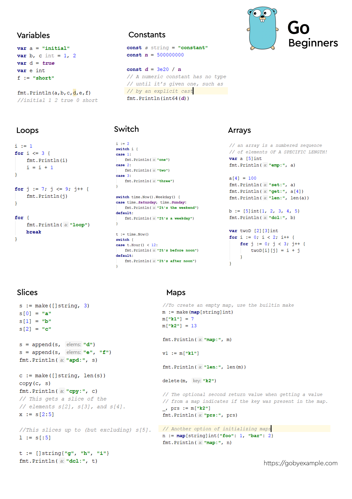
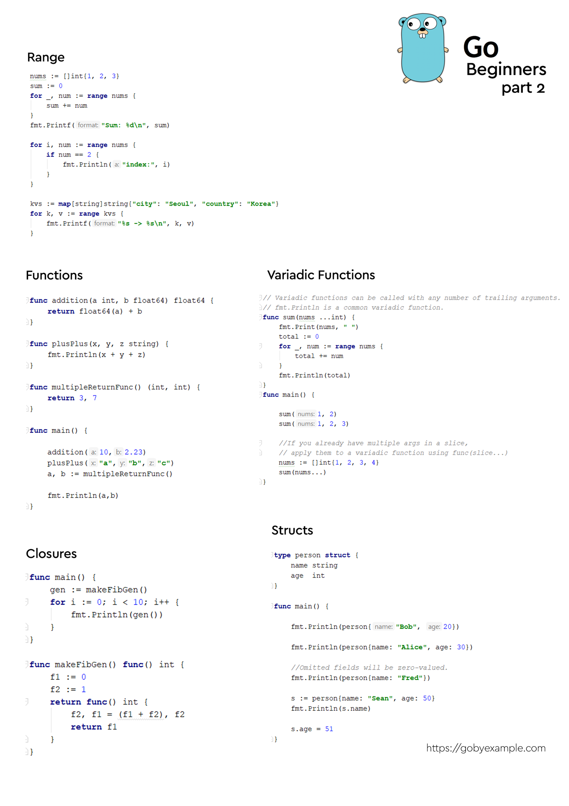
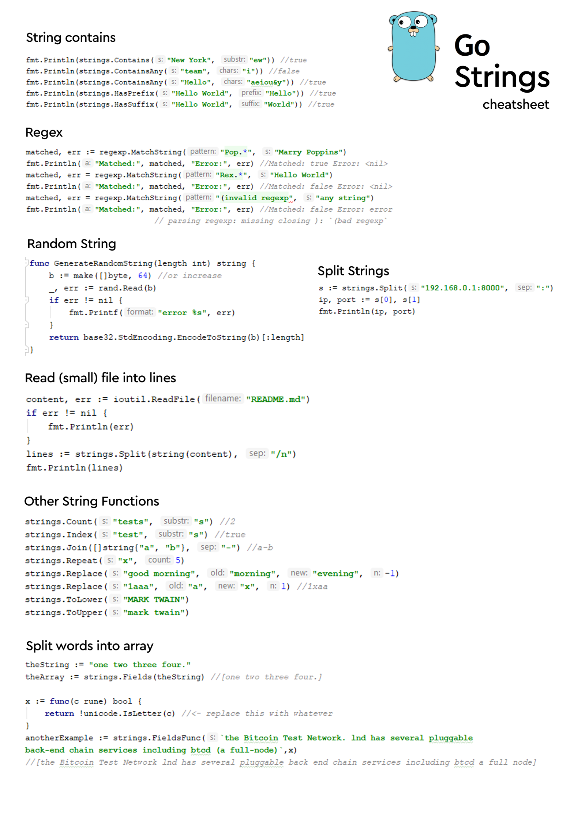
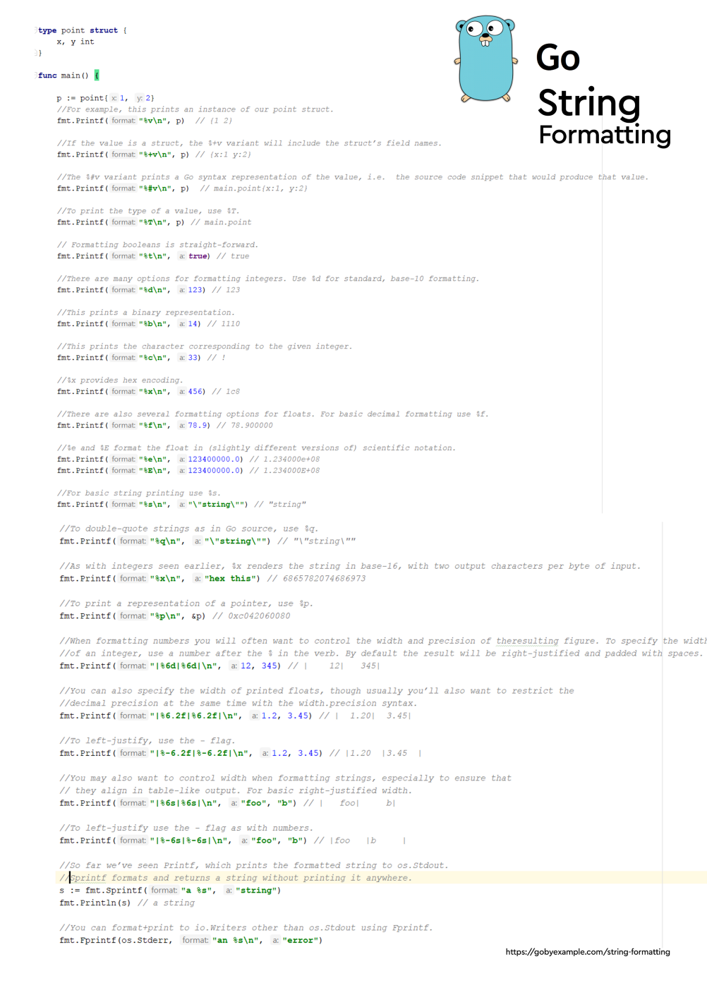

# golang

---

## 教程

* https://gobyexample.com/
* https://gobyexample-cn.github.io/
* https://devhints.io/go
* https://ueokande.github.io/go-slice-tricks/
* https://github.com/a8m/golang-cheat-sheet
* https://cheatsheet.dennyzhang.com/cheatsheet-golang-a4
* https://www.zhihu.com/column/quickgo
* https://pkg.go.dev/
* https://stackoverflow.com/questions/11354518/application-auto-build-versioning
* https://paul.querna.org/articles/2014/03/31/ffjson-faster-json-in-go/
* https://yourbasic.org/golang/
* https://inblockchainwetrust.medium.com/go-golang-cheat-sheets-cheatsheets-for-beginners-tutorial-6a2571f2ba90
* https://qvault.io/golang/connecting-to-rabbitmq-in-golang/
* https://medium.com/rahasak/reactive-microservices-with-golang-rabbitmq-and-protobuf-af025f4ec27
* https://tutorialedge.net/course/golang/
* https://golangdocs.com/
* https://github.com/xxjwxc/uber_go_guide_cn
* https://golangbyexample.com/
* https://www.liwenzhou.com/
* https://tour.go-zh.org/list
* https://essential-go.programming-books.io/
* https://golangbot.com/learn-golang-series/
* https://www.practical-go-lessons.com/

---

## 工具

* https://mholt.github.io/curl-to-go/
* https://mholt.github.io/json-to-go/

--- 

## 镜像

* http://mirrors.aliyun.com/goproxy/
* https://goproxy.io/zh/