# JVM

* JVM内存结构
* 类加载机制和JDK的调优工具命令
* GC日志格式
* GC调优实战

java虚拟机(java virtual machine，JVM)，一种能够运行java字节码的虚拟机。作为一种编程语言的虚拟机，实际上不只是专用于Java语言，只要生成的编译文件匹配JVM对加载编译文件格式要求，任何语言都可以由JVM编译运行。比如kotlin、scala等。

jvm有很多，不只是Hotspot，还有JRockit、J9等等

## JVM的基本结构

JVM由三个主要的子系统构成

* 类加载子系统
* 运行时数据区（内存结构）
* 执行引擎

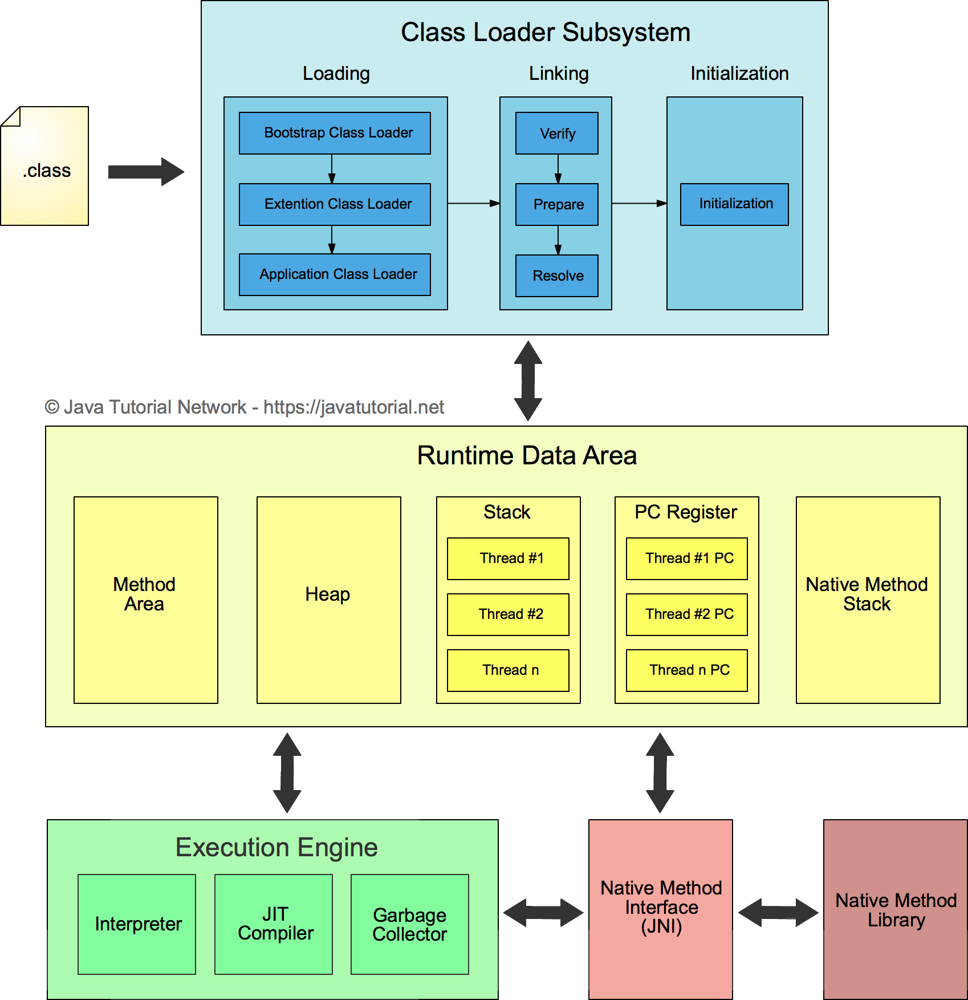

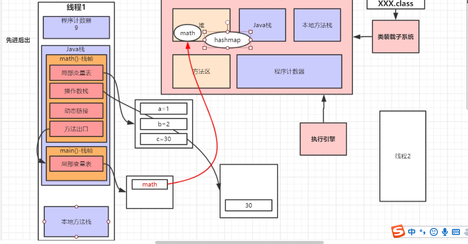

### 运行时数据区（内存结构）

#### 1.方法区（Method Area）

类的所有字段和方法字节码，以及一些特殊方法如构造函数，接口代码也在这里定义。简单来说，所有定义的方法的信息都保存在该区域，静态变量+常量+类信息（构造方法/接口定义）+运行时常量池都存在方法区中，虽然Java虚拟机规范把方法区描述为堆的一个逻辑部分，但是它却有一个别名叫做Non-Heap（非堆），目的应该是为了和Java的堆区分开。

### 2.堆（Heap）

虚拟机启动时自动分配创建，用于存放对象的实例，几乎所有对象（包括常量池）都在堆上分配内存，当对象无法在该空间申请到内存是将抛出OutOfMemoryError异常。同时也是垃圾收集器管理的主要区域。

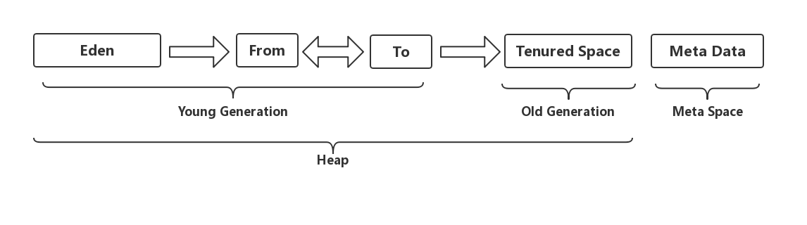

#### 2.1 新生代（Young Generation）

类出生、成长、消亡的区域，一个类在这里产生，应用，最后被垃圾回收器收集，结束生命。
新生代分为两部分：伊甸区（Eden space）和幸存者区（Survivor space），所有的类都是在伊甸区被new出来的。幸存区又分为From和To区。当Eden区的空间用完是，程序又需要创建对象，JVM的垃圾回收器将Eden区进行垃圾回收（Minor GC），将Eden区中的不再被其它对象应用的对象进行销毁。然后将Eden区中剩余的对象移到From Survivor区。若From Survivor区也满了，再对该区进行垃圾回收，然后移动到To Survivor区。

#### 2.2 老年代（Old Generation）

新生代经过多次GC仍然存货的对象移动到老年区。若老年代也满了，这时候将发生Major GC（也可以叫Full GC），进行老年区的内存清理。若老年区执行了Full GC之后发现依然无法进行对象的保存，就会抛出OOM（OutOfMemoryError）异常。

#### 2.3 元空间（Meta Space）

在JDK1.8之后，元空间替代了永久代，它是对JVM规范中方法区的实现，区别在于元数据区不在虚拟机当中，而是用的本地内存，永久代在虚拟机当中，永久代逻辑结构上也属于堆，但是物理上不属于。
为什么移除了永久代？
参考官方解释http://openjdk.java.net/jeps/122
大概意思是移除永久代是为融合HotSpot与 JRockit而做出的努力，因为JRockit没有永久代，不需要配置永久代。

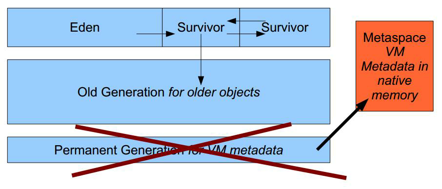

### 3.栈(Stack)

Java线程执行方法的内存模型，一个线程对应一个栈，每个方法在执行的同时都会创建一个栈帧（用于存储局部变量表，操作数栈，动态链接，方法出口等信息）不存在垃圾回收问题，只要线程一结束该栈就释放，生命周期和线程一致。

### 4.本地方法栈(Native Method Stack)

和栈作用很相似，区别不过是Java栈为JVM执行Java方法服务，而本地方法栈为JVM执行native方法服务。登记native方法，在Execution Engine执行时加载本地方法库。

### 5.程序计数器(Program Counter Register)

就是一个指针，指向方法区中的方法字节码（用来存储指向吓一跳指令的地址，也即将要执行的指令代码），由执行引擎读取下一条指令，是一个非常小的内存空间，几乎可以忽略不计。

# 类加载机制与JDK调优监控工具

Java运行时编译源码(.java)成字节码，由jre运行。jre由java虚拟机实现。JVM分析字节码，后解释并执行


## 类的生命周期

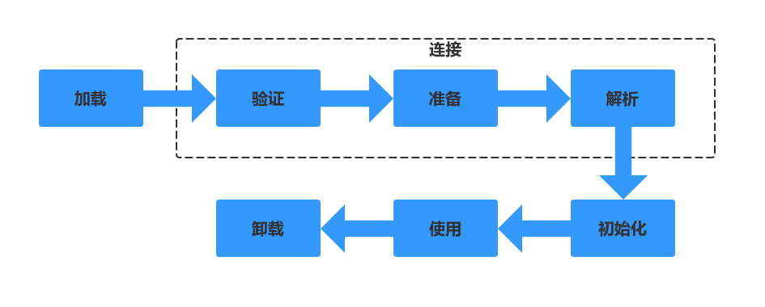

### 1.加载

将.class文件从磁盘读到内存

### 2.连接

#### 2.1 验证

验证字节码文件的正确性

#### 2.2 准备

给类的静态变量分配内存，并赋予默认值

### 2.3 解析

类装载器装入类所引用的其它所有类

### 3.初始化

为类的静态变量赋予正确的初始值，上述的准备阶段为静态变量赋予的是虚拟机默认的初始值，此处赋予的才是程序编写者为变量分配的真正的初始值，执行静态代码块

### 4.使用

### 5.卸载

## 类加载器的种类

### 启动类加载器(Bootstrap ClassLoader)

负责加载JRE的核心类库，如JRE目标下的rt.jar，charsets.jar等

### 扩展类加载器(Extension ClassLoader)

负责加载JRE扩展目录ext中jar类包

### 系统类加载器(Application ClassLoader)

负责加载ClassPath路径下的类包

### 用户自定义加载器(User ClassLoader)

负责加载用户自定义路径下的类包

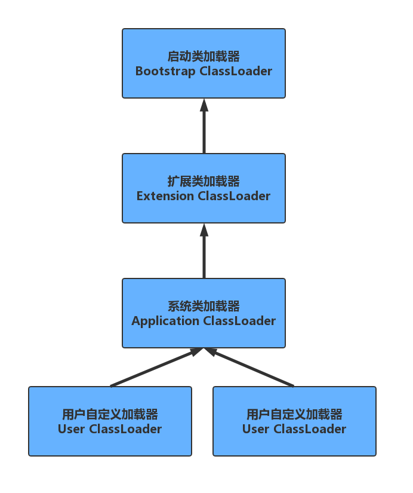

## 类加载机制

### 全盘负责委托机制

当一个ClassLoader加载一个类的时候，除非显示的使用另一个ClassLoader，该类所依赖和引用的类也由这个
ClassLoader载入

### 双亲委派机制

指先委托父类加载器寻找目标类，在找不到的情况下载自己的路径中查找并载入目标类

#### 双亲委派模式的优势

* 沙箱安全机制：比如自己写的String.class类不会被加载，这样可以防止核心库被随意篡改
* 避免类的重复加载：当父ClassLoader已经加载了该类的时候，就不需要子CJlassLoader再加载一次

## JVM性能调优监控工具

### Jinfo

查看正在运行的Java程序的扩展参数

#### 查看JVM的参数

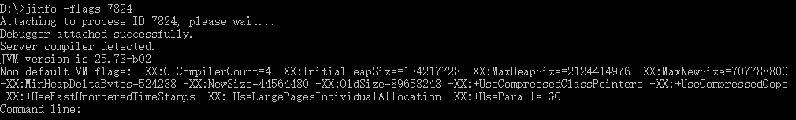

#### 查看java系统属性

等同于System.getProperties()

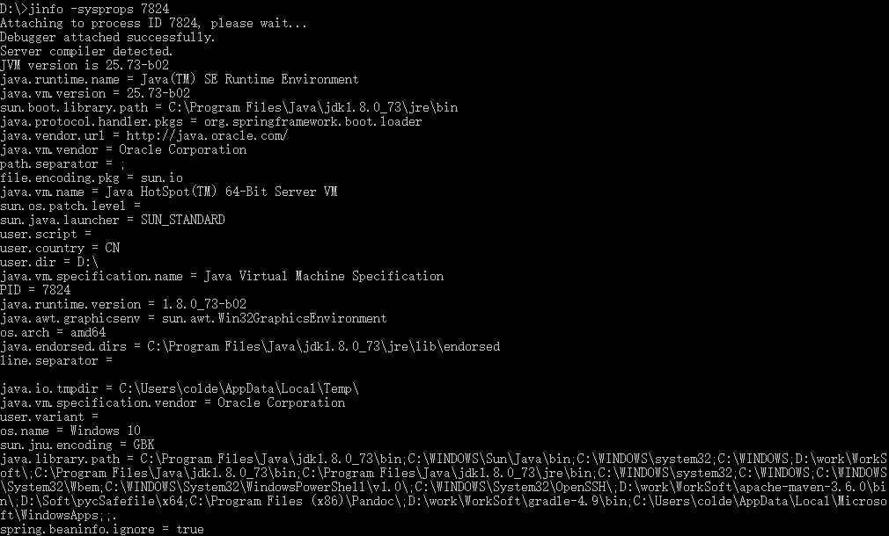

### Jstat

jstat命令可以查看堆内存各部分的使用量，以及加载类的数量。命令格式：
jstat [-命令选项][vmid] [间隔时间/毫秒][查询次数]

#### 类加载统计

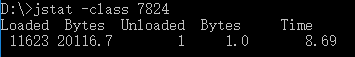

> Loaded：加载class的数量
> Bytes：所占用空间大小
> Unloaded：未加载数量
> Bytes：未加载占用空间
> Time：时间

#### 垃圾回收统计

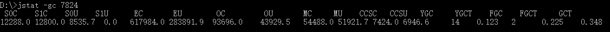

> S0C：第一个Survivor区的空间
> S1C：第二个Survivor区的空间
> S0U：第一个Survivor区的使用空间
> S1U：第二个Survivor区的使用空间
> EC：Eden区的总空间
> EU：Eden区的使用空间
> OC：Old区的总空间
> OU：Old区的已使用空间
> MC：元空间的总空间
> MU：元空间的使用空间
> CCSC：压缩类的总空间
> CCSU：压缩类的使用空间
> YGC：年轻代垃圾回收次数
> YGCT：年轻代垃圾回收消耗时间
> FGC：老年代垃圾回收次数
> FGCT：老年代垃圾回收消耗时间
> GCT：垃圾回收消耗总时间

#### 堆内存统计

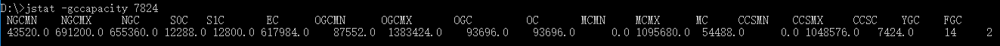

> NGCMN：新生代最小空间
> NGCMX：新生代最大空间
> NGC：当前新生代空间
> S0C：第一个Survivor区空间
> S1C：第二个Survivor区空间
> EC：Eden区的总空间
> OGCMN：老年代最小空间
> OGCMX：老年代最大空间
> OGC：当前老年代空间
> OC：当前老年代空间
> MCMN：最小元空间大小
> MCMX：最大元空间大小
> MC：当前元空间大小
> CCSMN：最小压缩类空间大小
> CCSMX：最大压缩类空间大小
> CCSC：当前压缩类空间大小
> YGC：年轻代GC次数
> FGC：老年代GC次数

#### 新生代垃圾回收统计

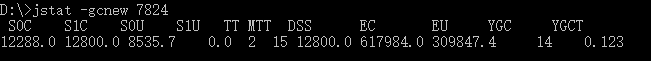

> S0C：第一个Survivor区空间
> S1C：第二个Survivor区空间
> S0U：第一个Survivor区的使用空间
> S1U：第二个Survivor区的使用空间
> TT：对象在新生代存活的次数
> MTT：对象在新生代存活的最大次数
> DSS：期望Survivor区大小
> EC：Eden区的空间
> EU：Eden区的使用空间
> YGC：年轻代垃圾回收次数
> YGCT：年轻代垃圾回收消耗时间

#### 新生代内存统计

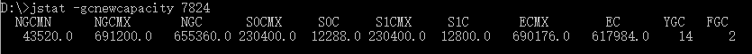

> NGCMN：新生代最小空间
> NGCMX：新生代最大空间
> NGC：当前新生代空间
> S0CMX：最大第一个Survivor区空间
> S0C：当前第一个Survivor区空间
> S1CMX：最大第二个Survivor区空间
> S1C：当前第二个Survivor区空间
> ECMX：最大Eden区空间
> EC：当前Eden区空间
> YGC：年轻代垃圾回收次数
> FGC：老年代垃圾回收次数

#### 老年代垃圾回收统计


> MC：元空间的总空间
> MU：元空间的使用空间
> CCSC：压缩类的总空间
> CCSU：压缩类的使用空间
> OC：Old区的总空间
> OU：Old区的已使用空间
> YGC：年轻代GC次数
> FGC：老年代GC次数
> FGCT：老年代垃圾回收消耗时间
> GCT：垃圾回收消耗总时间

#### 老年代内存统计

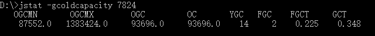

> OGCMN：老年代最小空间
> OGCMX：老年代最大空间
> OGC：当前老年代空间
> OC：当前老年代空间
> YGC：年轻代GC次数
> FGC：老年代GC次数
> FGCT：老年代垃圾回收消耗时间
> GCT：垃圾回收消耗总时间

#### 元空间内存统计

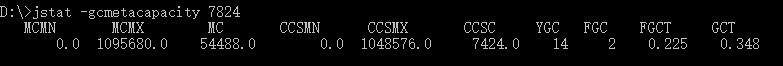

> MCMN：最小元空间大小
> MCMX：最大元空间大小
> MC：当前元空间大小
> CCSMN：最小压缩类空间大小
> CCSMX：最大压缩类空间大小
> CCSC：当前压缩类空间大小
> YGC：年轻代GC次数
> FGC：老年代GC次数
> FGCT：老年代垃圾回收消耗时间
> GCT：垃圾回收消耗总时间

#### 总垃圾回收统计

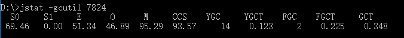

> S0：第一个Survivor区当前使用比例
> S1：第二个Survivor区当前使用比例
> E：Eden区使用比例
> O：Old区使用比例
> M：元空间使用比例
> CCS：压缩使用比例
> YGC：年轻代垃圾回收次数
> FGC：老年代垃圾回收次数
> FGCT：老年代垃圾回收消耗时间
> GCT：垃圾回收消耗总时间

### Jmap

可以用来查看内存信息

#### 堆的对象统计

```
jmap -histo 7824 > xxx.txt
```

如图：
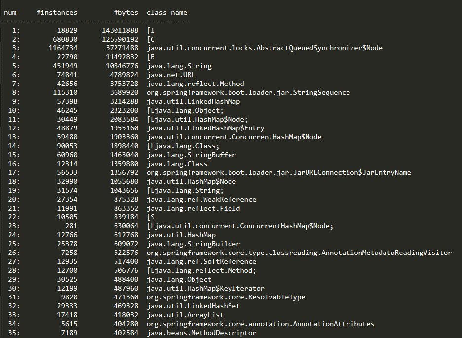

> Num：序号
> Instances：实例数量
> Bytes：占用空间大小
> Class Name：类名

#### 堆信息

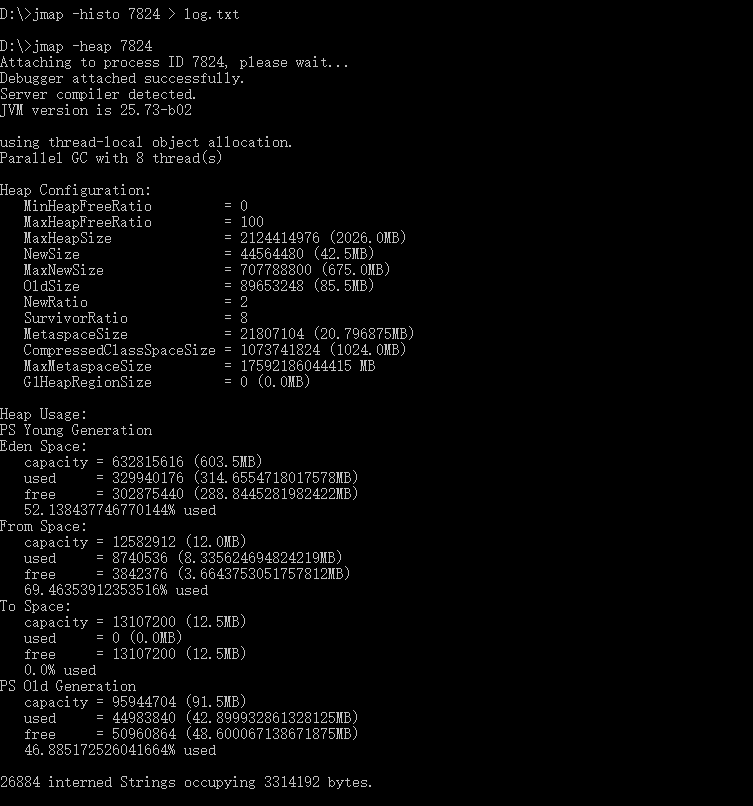

#### 堆内存dump

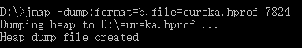

也可以在设置内存溢出的时候自动导出dump文件（内存很大的时候，可能会导不出来）
1.-XX:+HeapDumpOnOutOfMemoryError
2.-XX:HeapDumpPath=输出路径

```
-Xms10m -Xmx10m -XX:+PrintGCDetails -XX:+HeapDumpOnOutOfMemoryError -
XX:HeapDumpPath=d:\oomdump.dump
```

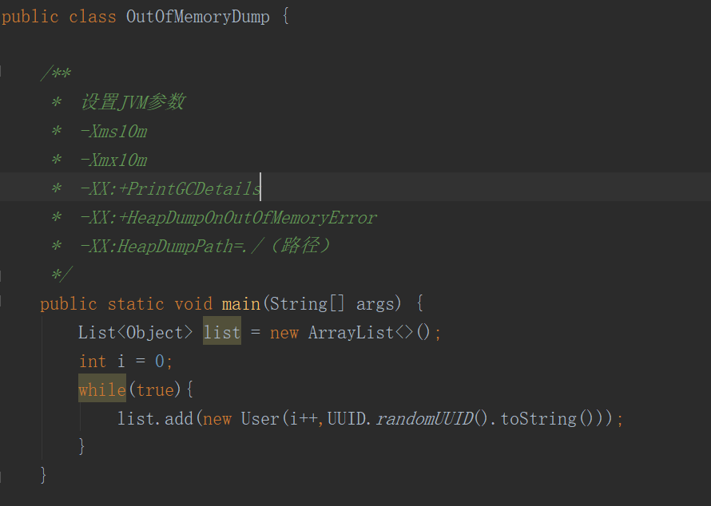

可以使用jvisualvm命令工具导入文件分析

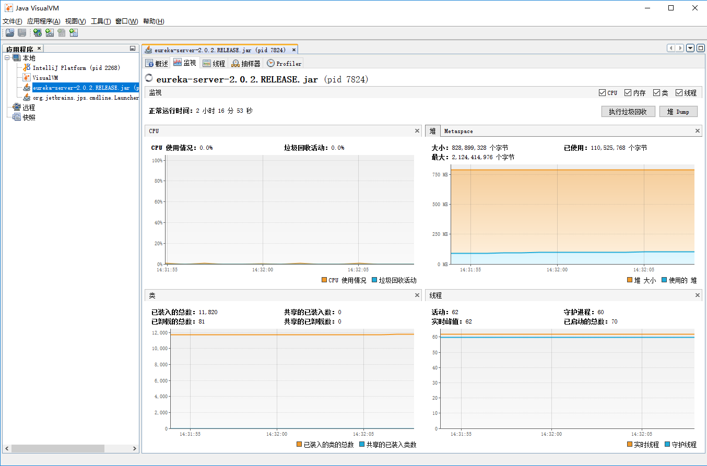

### Jstack

jstack用于生成java虚拟机当前时刻的线程快照。

# GC算法和收集器

参考：周志明《深入理解java虚拟机》第二版

## 如何判断对象可以被回收

堆中几乎放着所有的对象实例，对堆垃圾回收前的第一步就是要判断哪些对象已经死亡（即不能再被任何途径使用的对象）

### 引用计数法

给对象添加一个引用计数器，每当有一个地方引用，计数器就加1。当引用失效，计数器就减1。任何时候计数器为0的对象就是不可能再被使用的。

这个方法实现简单，效率高，但是目前主流的虚拟机中没有选择这个算法来管理内存，最主要的原因是它很难解决对象之前相互循环引用的问题。所谓对象之间的相互引用问题，通过下面代码所示：除了对象a和b相互引用着对方之外，这两个对象之间再无任何引用。但是它们因为互相引用对方，导致它们的引用计数器都不为0，于是引用计数器法无法通知GC回收器回收它们。

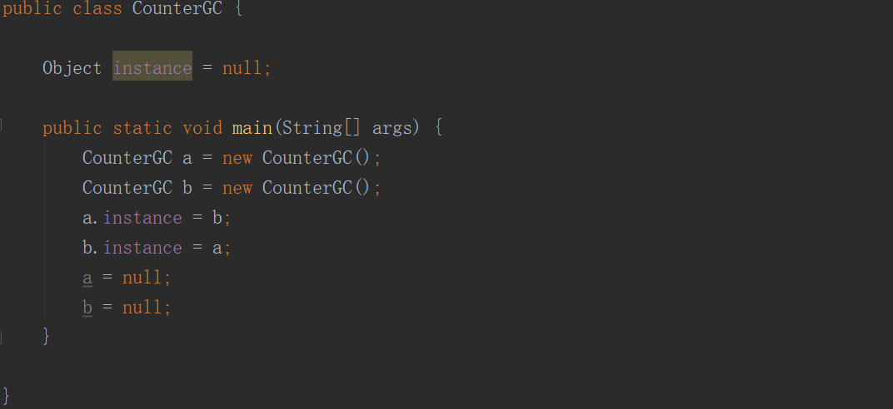

### 可达性分析算法

这个算法的基本思想就是通过一系列的称为”GC Roots“的对象作为起点，从这些节点开始向下搜索，节点所走过的路径称为引用链，当一个对象到GC Roots没有任何引用链相连的话，则证明此对象时不可用的。

GC Roots根节点：类加载器、Thread、虚拟机栈的本地变量表、static成员、常量引用、本地方法栈的变量等等

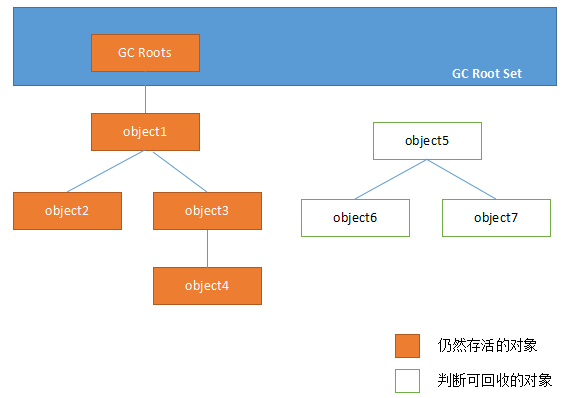

### 如何判断一个常量是废弃常量

运行时常量池主要回收的是废弃的常量。那么，我们怎么判断一个常量时废弃常量呢？

假如在常量池中存在字符串"abc"，如果当前没有任何String对象引用该字符串常量的话，就说明常量”abc“就是废弃常量，如果这时发生内存回收的话而且有必要的话，”abc“会被系统清理出常量池。

### 如何判断一个类是无用的类

需要满足以下三个条件：

- 该类所有的实例都已经被回收，也就是 Java 堆中不存在该类的任何实例。
- 加载该类的 ClassLoader 已经被回收。
- 该类对应的 java.lang.Class 对象没有在任何地方被引用，无法在任何地方通过反射访问该类的方法。

虚拟机可以对满足上述3个条件的无用类进行回收，这里仅仅是”可以“，而并不是和对象一样不适用了就必然会被回收。

## 垃圾回收算法

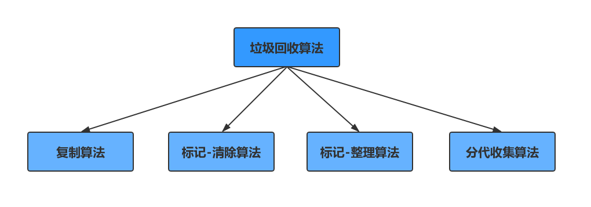

### 标记-清除算法

它是最基础的收集算法，这个算法分为两个阶段，“标记”和”清除“。首先标记出所有需要回收的对象，在标记完成后统一回收所有被标记的对象。它有两个不足的地方：

1. 效率问题，标记和清除两个过程的效率都不高；
2. 空间问题，标记清除后会产生大量不连续的碎片；


### 复制算法

为了解决效率问题，复制算法出现了。它可以把内存分为大小相同的两块，每次只使用其中的一块。当这一块的内存使用完后，就将还存活的对象复制到另一块区，然后再把使用的空间一次清理掉。这样就使每次的内存回收都是对内存区间的一半进行回收


### 标记-整理算法

根据老年代的特点提出的一种标记算法，标记过程和“标记-清除”算法一样，但是后续步骤不是直接对可回收对象进行回收，而是让所有存活的对象向一段移动，然后直接清理掉边界以外的内存

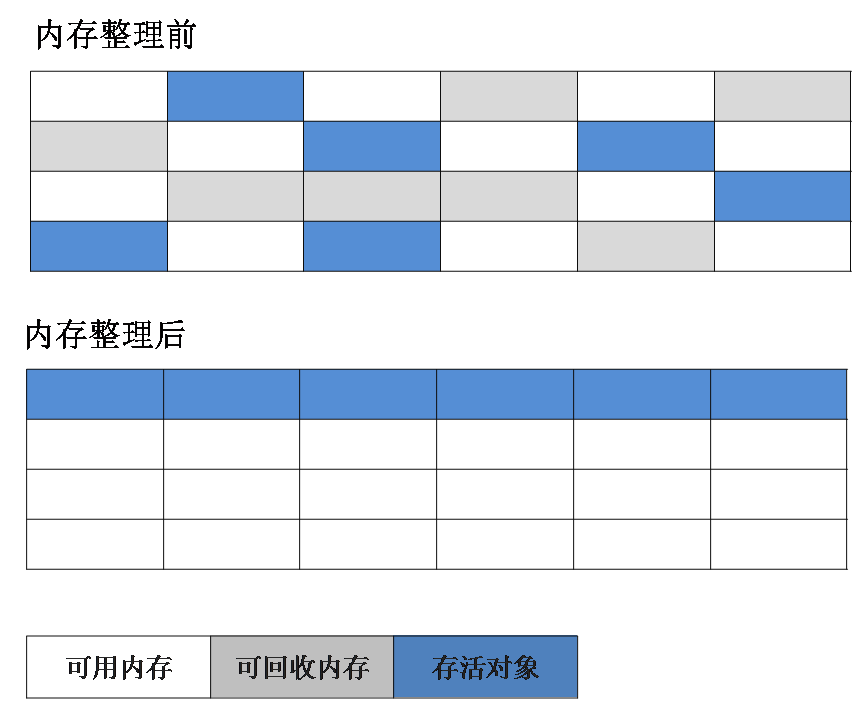

### 分代收集算法

现在的商用虚拟机的垃圾收集器基本都采用"分代收集"算法，这种算法就是根据对象存活周期的不同将内存分为几块。一般将java堆分为新生代和老年代，这样我们就可以根据各个年代的特点选择合适的垃圾收集算法。

在新生代中，每次收集都有大量对象死去，所以可以选择复制算法，只要付出少量对象的复制成本就可以完成每次垃圾收集。而老年代的对象存活几率时比较高的，而且没有额外的空间对它进行分配担保，就必须选择“标记-清除”或者“标记-整理”算法进行垃圾收集

## 垃圾收集器

java虚拟机规范对垃圾收集器应该如何实现没有任何规定，因为没有所谓最好的垃圾收集器出现，更不会有万金油垃圾收集器，只能是根据具体的应用场景选择合适的垃圾收集器。

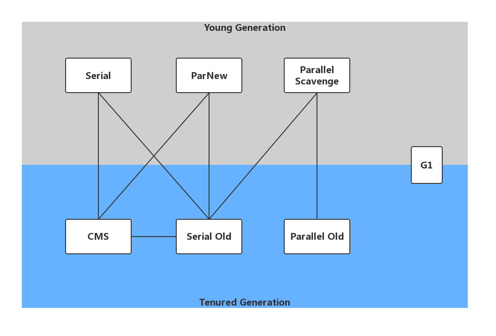

### Serial收集器

Serial（串行）收集器收集器是最基本、历史最悠久的垃圾收集器了。大家看名字就知道这个收集器是一个单线程收集器了。它的 “单线程” 的意义不仅仅意味着它只会使用一条垃圾收集线程去完成垃圾收集工作，更重要的是它在进行垃圾收集工作的时候必须暂停其他所有的工作线程（ “Stop The World” ），直到它收集结束。

新生代采用复制算法，老年代采用标记-整理算法。


虚拟机的设计者们当然知道Stop The World带来的不良用户体验，所以在后续的垃圾收集器设计中停顿时间在不断缩短（仍然还有停顿，寻找最优秀的垃圾收集器的过程仍然在继续）。

但是Serial收集器有没有优于其他垃圾收集器的地方呢？当然有，它**简单而高效（与其他收集器的单线程相比）**。Serial收集器由于没有线程交互的开销，自然可以获得很高的单线程收集效率。Serial收集器

对于运行在Client模式下的虚拟机来说是个不错的选择。

### ParNew收集器

ParNew收集器其实就是Serial收集器的多线程版本，除了使用多线程进行垃圾收集外，其余行为（控制参数、收集算法、回收策略等等）和Serial收集器完全一样。

新生代采用复制算法，老年代采用标记-整理算法。 


它是许多运行在Server模式下的虚拟机的首要选择，除了Serial收集器外，只有它能与CMS收集器（真正意义上的并发收集器，后面会介绍到）配合工作。

### Parallel Scavenge收集器

Parallel Scavenge 收集器类似于ParNew 收集器。

Parallel Scavenge收集器关注点是吞吐量（高效率的利用CPU）。CMS等垃圾收集器的关注点更多的是用户线程的停顿时间（提高用户体验）。所谓吞吐量就是CPU中用于运行用户代码的时间与CPU总消耗时间的比值。 Parallel Scavenge收集器提供了很多参数供用户找到最合适的停顿时间或最大吞吐量，如果对于收集器运作不太了解的话，手工优化存在的话可以选择把内存管理优化交给虚拟机去完成也是一个不错的选择。

新生代采用复制算法，老年代采用标记-整理算法。 


### Serial Old收集器

Serial收集器的老年代版本，它同样是一个单线程收集器。它主要有两大用途：一种用途是在JDK1.5以及以前的版本中与Parallel Scavenge收集器搭配使用，另一种用途是作为CMS收集器的后备方案。

### Parallel Old收集器

Parallel Scavenge收集器的老年代版本。使用多线程和“标记-整理”算法。在注重吞吐量以及CPU资源的场合，都可以优先考虑 Parallel Scavenge收集器和Parallel Old收集器。

### CMS收集器

并行和并发概念补充：

- 并行（Parallel） ：指多条垃圾收集线程并行工作，但此时用户线程仍然处于等待状态。
- 并发（Concurrent）：指用户线程与垃圾收集线程同时执行（但不一定是并行，可能会交替执行），用户程序在继续运行，而垃圾收集器运行在另一个CPU上。

CMS（Concurrent Mark Sweep）收集器是一种以获取最短回收停顿时间为目标的收集器。它而非常符合在注重用户体验的应用上使用。

CMS（Concurrent Mark Sweep）收集器是HotSpot虚拟机第一款真正意义上的并发收集器，它第一次实现了让垃圾收集线程与用户线程（基本上）同时工作。

从名字中的Mark Sweep这两个词可以看出，CMS收集器是一种 “标记-清除”算法实现的，它的运作过程相比于前面几种垃圾收集器来说更加复杂一些。整个过程分为四个步骤：

- 初始标记（CMS initial mark）： 暂停所有的其他线程，并记录下直接与root相连的对象，速度很快
- 并发标记（CMS concurrent mark）： 同时开启GC和用户线程，用一个闭包结构去记录可达对象。但在这个阶段结束，这个闭包结构并不能保证包含当前所有的可达对象。因为用户线程可能会不断的更新引用域，所以GC线程无法保证可达性分析的实时性。所以这个算法里会跟踪记录这些发生引用更新的地方。
- 重新标记（CMS remark）： 重新标记阶段就是为了修正并发标记期间因为用户程序继续运行而导致标记产生变动的那一部分对象的标记记录，这个阶段的停顿时间一般会比初始标记阶段的时间稍长，远远比并发标记阶段时间短
- 并发清除（CMS concurrent sweep）： 开启用户线程，同时GC线程开始对为标记的区域做清扫。


CMS主要优点：并发收集、低停顿。但是它有下面三个明显的缺点：

- 对CPU资源敏感；
- 无法处理浮动垃圾；
- 它使用的回收算法-“标记-清除”算法会导致收集结束时会有大量空间碎片产生。

### G1收集器

G1 (Garbage-First)是一款面向服务器的垃圾收集器,主要针对配备多颗处理器及大容量内存的机器. 以极高概率满足GC停顿时间要求的同时,还具备高吞吐量性能特征.


被视为JDK1.7中HotSpot虚拟机的一个重要进化特征。它具备一下特点：

- 并行与并发：G1能充分利用CPU、多核环境下的硬件优势，使用多个CPU（CPU或者CPU核心）来缩短Stop-The-World停顿时间。部分其他收集器原本需要停顿Java线程执行的GC动作，G1收集器仍然可以通过并发的方式让java程序继续执行
- 分代收集：虽然G1可以不需要其他收集器配合就能独立管理整个GC堆，但是还是保留了分代的概念。
  空间整合：与CMS的“标记–清理”算法不同，G1从整体来看是基于“标记整理”算法实现的收集器；从局部上来看是基于“复制”算法实现的
- 可预测的停顿：这是G1相对于CMS的另一个大优势，降低停顿时间是G1 和 CMS 共同的关注点，但G1 除了追求低停顿外，还能建立可预测的停顿时间模型，能让使用者明确指定在一个长度为M毫秒的时间片段内

G1收集器的运作大致分为以下几个步骤：

- 初始标记
- 并发标记
- 最终标记
- 筛选回收

G1收集器在后台维护了一个优先列表，每次根据允许的收集时间，优先选择回收价值最大的Region(这也就是它的名字Garbage-First的由来)。这种使用Region划分内存空间以及有优先级的区域回收方式，保证了GF收集器在有限时间内可以尽可能高的收集效率（把内存化整为零）。

### 怎么选择垃圾收集器？

1. 优先调整堆的大小让服务器自己来选择
2. 如果内存小于100m，使用串行收集器
3. 如果是单核，并且没有停顿时间的要求，串行或JVM自己选择
4. 如果允许停顿时间超过1秒，选择并行或者JVM自己选
5. 如果响应时间最重要，并且不能超过1秒，使用并发收集器

官方推荐G1，性能高。

# 调优

JVM调优主要就是调整下面两个指标

停顿时间：垃圾收集器做垃圾回收中断应用执行的时间。-XX:MaxGCPauseMillis

吞吐量：垃圾收集的时间和总时间的占比：1/(1+n),吞吐量为1-1/(1+n)。-XX:GCTimeRatio=n

## GC调优步骤

1.打印GC日志

```
-XX:+PrintGCDetails -XX:+PrintGCTimeStamps -XX:+PrintGCDateStamps -Xloggc:./gc.log
```

Tomcat可以直接加载JAVA_OPTS变量里

2.分析日志得到关键性指标

3.分析GC原因，调优JVM参数


1.Parallel Scavenge收集器(默认)

分析parallel-gc.log

第一次调优，设置Metaspace大小：增大元空间大小-XX:MetaspaceSize=64M  -XX:MaxMetaspaceSize=64M

第二次调优，增大年轻代动态扩容增量（默认是20%），可以减少YGC：-XX:YoungGenerationSizeIncrement=30

比较下几次调优效果：

| 吞吐量  | 最大停顿    | 平均停顿    | YGC  | FGC  |
| ------- | ----------- | ----------- | ---- | ---- |
| 97.169% | 420 ms      | **60.0 ms** | 12   | 2    |
| 98.775% | **60.0 ms** | **28.0 ms** | 10   | 0    |
|         |             |             |      |      |


2.配置CMS收集器

-XX:+UseConcMarkSweepGC

分析gc-cms.log


3.配置G1收集器

-XX:+UseG1GC

分析gc-g1.log

young GC:[GC pause (G1 Evacuation Pause)(young)

initial-mark:[GC pause  (Metadata GC Threshold)(young)(initial-mark) (参数：InitiatingHeapOccupancyPercent)

mixed GC:[GC pause (G1 Evacuation Pause)(Mixed) (参数：G1HeapWastePercent)

full GC:[Full GC (Allocation Failure)(无可用region)

（G1内部，前面提到的混合GC是非常重要的释放内存机制，它避免了G1出现Region没有可用的情况，否则就会触发 FullGC事件。CMS、Parallel、Serial GC都需要通过Full GC去压缩老年代并在这个过程中扫描整个老年代。G1的Full GC算法和Serial GC收集器完全一致。当一个Full GC发生时，整个Java堆执行一个完整的压缩，这样确保了最大的空余内存可用。G1的Full GC是一个单线程，它可能引起一个长时间的停顿时间，G1的设计目标是减少Full GC，满足应用性能目标。）

查看发生MixedGC的阈值：jinfo -flag InitiatingHeapOccupancyPercent 进程ID

调优：

第一次调优，设置Metaspace大小：增大元空间大小-XX:MetaspaceSize=64M  -XX:MaxMetaspaceSize=64M

第二次调优，添加吞吐量和停顿时间参数：-XX:GCTimeRatio=99 -XX:MaxGCPauseMillis=10

## GC常用参数

### 堆栈设置

-Xss:每个线程的栈大小

-Xms:初始堆大小，默认物理内存的1/64

-Xmx:最大堆大小，默认物理内存的1/4

-Xmn:新生代大小

-XX:NewSize:设置新生代初始大小

-XX:NewRatio:默认2表示新生代占年老代的1/2，占整个堆内存的1/3。

-XX:SurvivorRatio:默认8表示一个survivor区占用1/8的Eden内存，即1/10的新生代内存。

-XX:MetaspaceSize:设置元空间大小

-XX:MaxMetaspaceSize:设置元空间最大允许大小，默认不受限制，JVM Metaspace会进行动态扩展。

### 垃圾回收统计信息

-XX:+PrintGC

-XX:+PrintGCDetails

-XX:+PrintGCTimeStamps

-Xloggc:filename

### 收集器设置

-XX:+UseSerialGC:设置串行收集器

-XX:+UseParallelGC:设置并行收集器

-XX:+UseParallelOldGC:老年代使用并行回收收集器

-XX:+UseParNewGC:在新生代使用并行收集器

-XX:+UseParalledlOldGC:设置并行老年代收集器

-XX:+UseConcMarkSweepGC:设置CMS并发收集器

-XX:+UseG1GC:设置G1收集器

-XX:ParallelGCThreads:设置用于垃圾回收的线程数

### 并行收集器设置

-XX:ParallelGCThreads:设置并行收集器收集时使用的CPU数。并行收集线程数。

-XX:MaxGCPauseMillis:设置并行收集最大暂停时间

-XX:GCTimeRatio:设置垃圾回收时间占程序运行时间的百分比。公式为1/(1+n)

### CMS收集器设置

-XX:+UseConcMarkSweepGC:设置CMS并发收集器

-XX:+CMSIncrementalMode:设置为增量模式。适用于单CPU情况。

-XX:ParallelGCThreads:设置并发收集器新生代收集方式为并行收集时，使用的CPU数。并行收集线程数。

-XX:CMSFullGCsBeforeCompaction:设定进行多少次CMS垃圾回收后，进行一次内存压缩

-XX:+CMSClassUnloadingEnabled:允许对类元数据进行回收

-XX:UseCMSInitiatingOccupancyOnly:表示只在到达阀值的时候，才进行CMS回收

-XX:+CMSIncrementalMode:设置为增量模式。适用于单CPU情况

-XX:ParallelCMSThreads:设定CMS的线程数量

-XX:CMSInitiatingOccupancyFraction:设置CMS收集器在老年代空间被使用多少后触发

-XX:+UseCMSCompactAtFullCollection:设置CMS收集器在完成垃圾收集后是否要进行一次内存碎片的整理

### G1收集器设置

-XX:+UseG1GC:使用G1收集器

-XX:ParallelGCThreads:指定GC工作的线程数量

-XX:G1HeapRegionSize:指定分区大小(1MB~32MB，且必须是2的幂)，默认将整堆划分为2048个分区

-XX:GCTimeRatio:吞吐量大小，0-100的整数(默认9)，值为n则系统将花费不超过1/(1+n)的时间用于垃圾收集

-XX:MaxGCPauseMillis:目标暂停时间(默认200ms)

-XX:G1NewSizePercent:新生代内存初始空间(默认整堆5%)

-XX:G1MaxNewSizePercent:新生代内存最大空间

-XX:TargetSurvivorRatio:Survivor填充容量(默认50%)

-XX:MaxTenuringThreshold:最大任期阈值(默认15)

-XX:InitiatingHeapOccupancyPercen:老年代占用空间超过整堆比IHOP阈值(默认45%),超过则执行混合收集

-XX:G1HeapWastePercent:堆废物百分比(默认5%)

-XX:G1MixedGCCountTarget:参数混合周期的最大总次数(默认8)