# IDEA常用快捷键

**方法参数提示** 

`ctrl + p`

> 非常实用的快捷键, 有的时候我们自己写的方法, 或者在看一些源码时, 都非常有用

**文本大小写转换**

    ctrl + shift + U 

**折叠代码/展开代码**

    ctrl + - / ctrl + + 

**全局查找文本**

    ctrl + shift + F 

**快速查找和打开最近使用过的文件码**

    ctrl + E 

**自动代码片**

    ctrl + j 

**实现接口方法**

    ctrl + i 

**查看当前类的子类**

    ctrl + h 

**将当前行和下一行进行合并**

    ctrl + shfit + j 

**将光标跳到当前行的上一行**

> 有时候在写完一行代码的时候需要添加注释, 或者为类属性添加注释的时候需要跳到当前行的上一行, 这个快捷键就非常方便

    ctrl + alt + enter 

**idea git 提交**

    ctrl + k 

**删除当前行**

    ctrl + y 

**重写 或者 实现接口或父类方法**

    ctrl + o 

**显示类之间的关系**

    ctrl + alt + u 

**删除类中没有用到的 package**

    ctrl + alt + o 

**进入设置界面**

    ctrl + alt + s 

**在当前光标在的这样一行的下一行添加一行**

    ctrl + shfit + enter 

**弹出， 当前类中的方法集合**

    ctrl + F12 

> 最常用的快捷键之一, 快速的查找方法

**添加书签**

    ctrl + f11 

**搜索文件**

    ctrl + shift + n 

**搜索类合**

    ctrl + n 

> 最常用的快捷键之一, 项目慢慢的变大, 文件越来越多, 每次用鼠标去找 就太低效了

## 快速生成 `try, if` 等语句

    alt + shift + t 

> 当你试用了之后, 你会爱上这个快捷键的

**抽取局部变量**

    ctrl + alt + v 

> 将当前选中的代码抽取为一个局部变量

**进入到实现子类中**

    ctrl + alt + b 

> 在使用`mvc`框架的时候, 往往我们只有一个接口的实例 这个快捷键可以直接到实现类中

**格式化代码**

    ctrl + alt + L 

> 让代码变得优美, 是每个程序员都应该注意的事, 方便自己和他人阅读, 利人利己

**idea 多光标选择**

    按下滚轮上下拖动鼠标即可， 

## idea 批量修改相同内容

> 有的时候数据需要批量处理, 比如, 正常来说我们的实体类, 在使用`mybatis` 等逆向工程进行生成的时候, 一般属性是有注释的, 但是在针对如果我们使用了`swagger` 等插件需要来显示传递实体所代表的含义的时候, 就需要我们自己一个个的去写, 就会显得异常麻烦

    ctrl + alt + shift + j 

**运行当前类**

    ctrl + shift + F10 

> 在写一些测试代码的时候 这个快捷键就显得特别方便

**从多项目中启动一个 debug 模式**

    alt + shfit + F9 

> 在微服务中 多个工程在一个项目中的时候, 这个方法就比较的好用, 这样就不用自己一个一个的去点省去很多没必要的操作

**从多项目中启动一个 正常模式**

    alt + shfit + F10 

## 重新编译当前项目

    ctrl + shift + F9 

> 当你发现有的问题 特别的奇怪, 命名表面上没问题, 但就是项目运行不了的时候, 重新编译一下获取就好了

查看当前类在哪些地方被使用过

## 快速的查看选中类, 选中方法的定义

> 有的时候我们不想进入方法内部, 或者进入类的内部查看细节, 想要在外面就探查清楚, 就可以使用此种方法

    ctrl + shift + i 

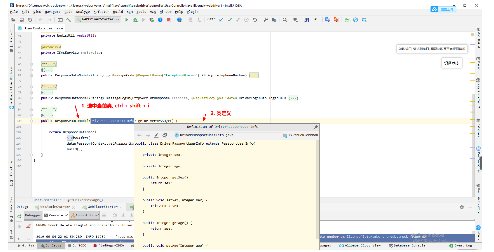

比较强大的几个快捷键之一 `Ctrl + ~`(感叹号旁边的按键)
    ctrl + ~ 

**共有五种可供选择的操作**

**Switch Code Formatter (切换代码格式化程序)**

**1. Color Scheme (配色方案)**

可以设置一些常用的配色, 字体样式, 可以一键切换

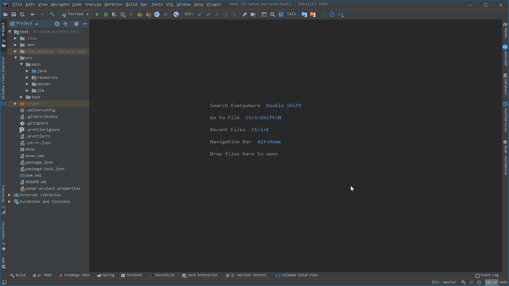

**2. `Code Style Scheme`**

**3. `Keymap` (快捷键列表)**

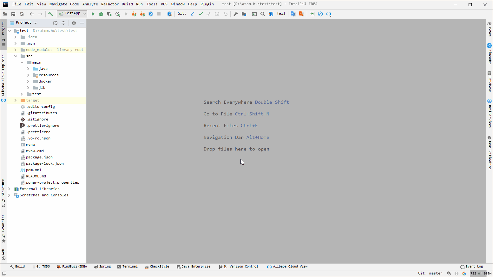

**4. View Mode (显示模式)**


**5. Look and Feel (设置软件主题)**

**idea 调出版本控制操作**

    alt + ~

# 多光标操作集锦

对于Mac

```
连按两次Option（按一次，放开，再按一次，再按一次），然后按Up/ Down键创建/删除插入符号。您也可以按住Shift+ Option并单击以在特定点创建/删除插入符号。
Windows ：Ctrl、Ctrl+ Up/Down
MacOS ：Option、Option+ Up/Down（按住修改键的第二次，然后按箭头键）

Option + Shift + Click & Drag ＃选择一组线

Shift + Option + Click ＃选择一组线

Command + right arrow ＃转到行尾

选择下一次发生：Alt+J on Windows, Control+G on Mac OS X

取消选择出现次数：Alt+Shift+J on Windows, Control+Shift+G on Mac OS X

选择所有出现的事件：Ctrl+Alt+Shift+J on Windows, Control+Command+G on Mac OS X
```

**在相同内容后生成光标，一个一个选择** [点击图片可放大]

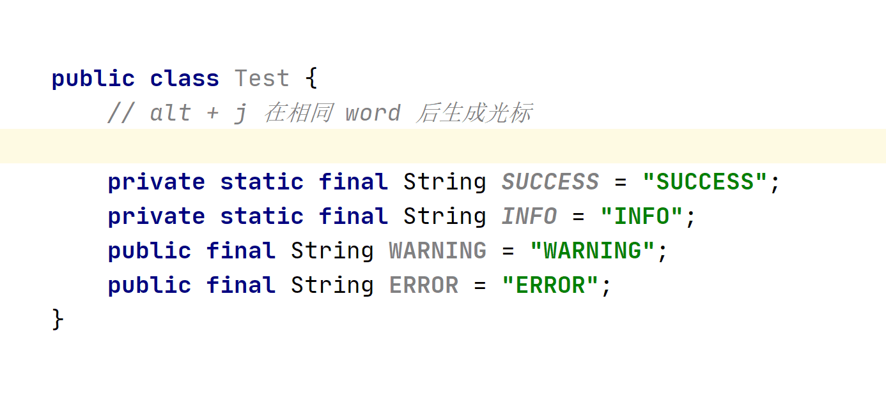

> Windows: Alt + J
>
> Mac: Ctrl + G

## 在所有的相同的内容后添加光标，一步到位 

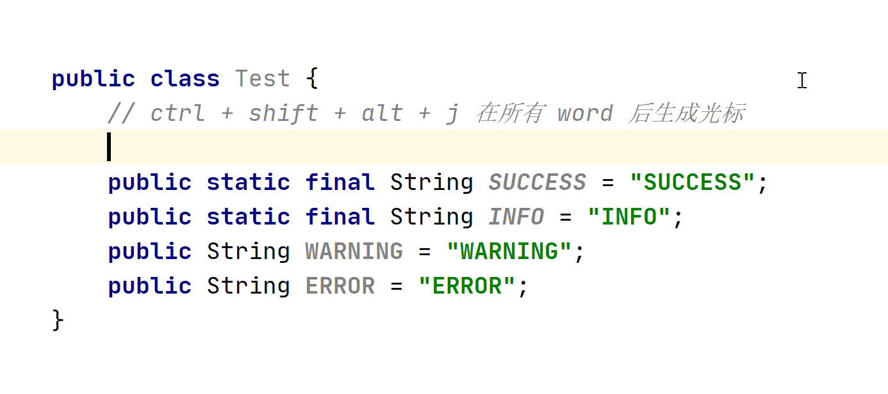

> Windows: `Ctrl + Shift + Alt + J`
>
> Mac: `Ctrl + Command + G`


## 数列光标  


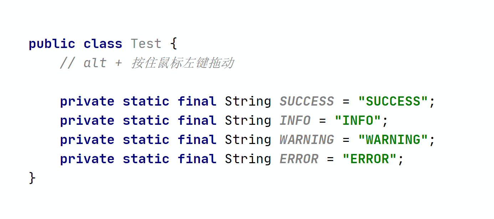


## 行尾添加光标

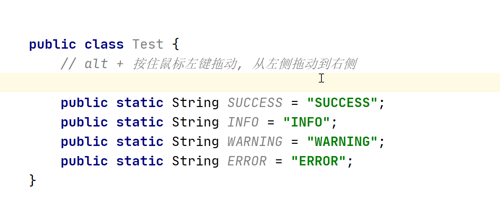

## 在指定位置添加光标操作

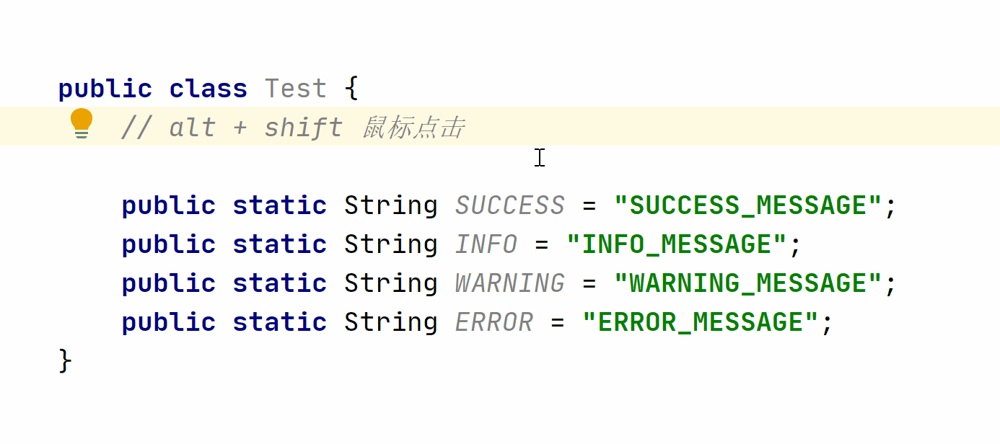

## 格式批量调整

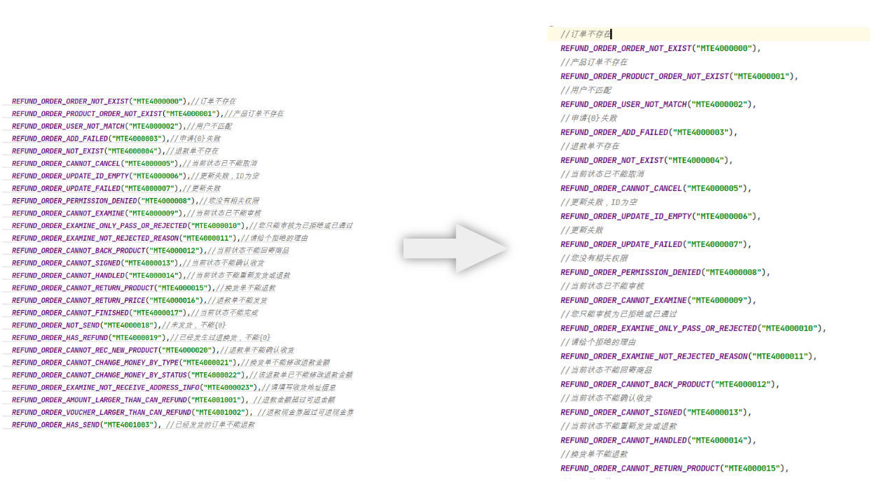

将上访左侧的代码批量变为右侧代码

> ctrl + alt + enter 将光标移动到当前行的上一行

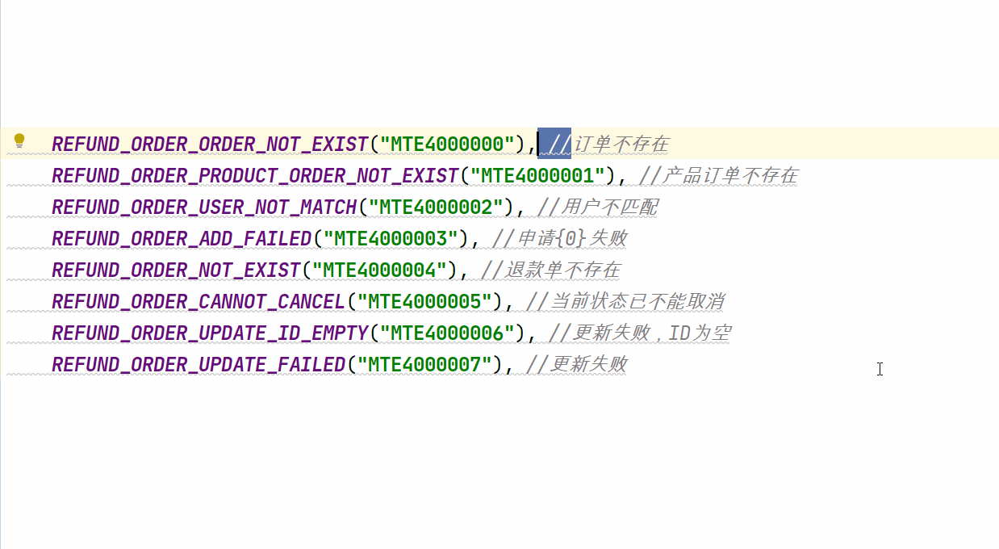

## 批量添加 Swagger 属性注释

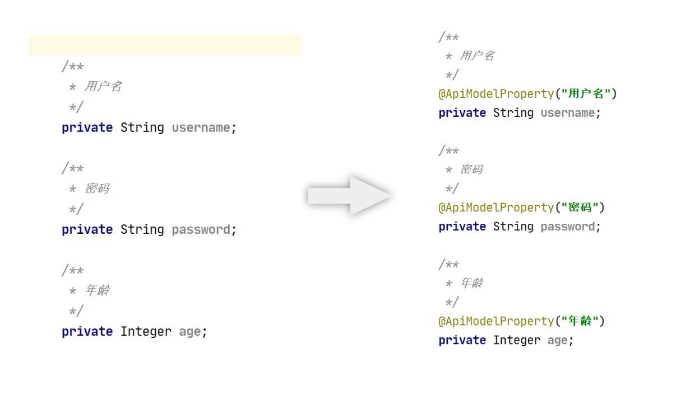

将上图左侧只有注释的类，添加上 swagger 信息

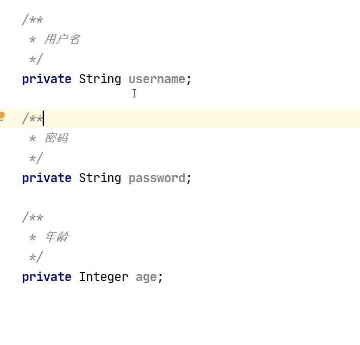

## 在多个相同结构 Json 中提取某字段信息

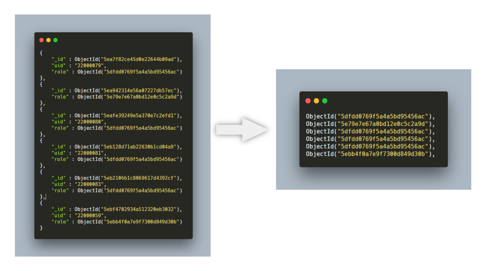

## 提取左侧 Json 中所有的 role 字段


# 参考文档

https://atips.cn/idea/

https://www.yuque.com/xiaoxiunique/ngadpi

https://qastack.cn/programming/1262737/intellij-idea-way-of-editing-multiple-lines