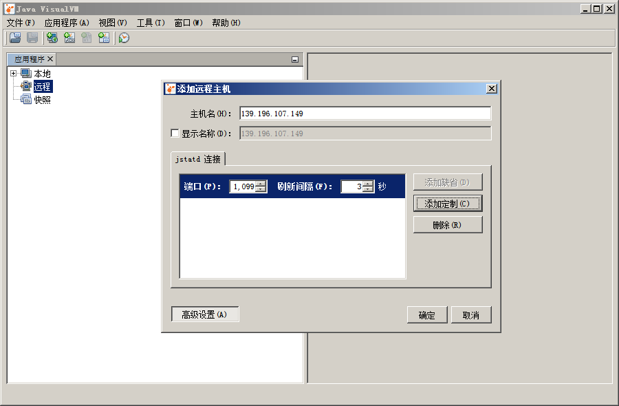
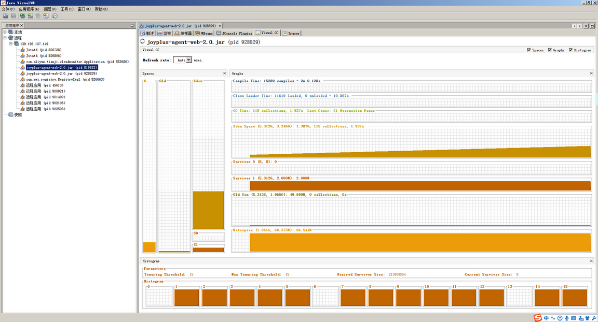

# 开启JMX监控

```bash
-Dcom.sun.management.jmxremote
-Dcom.sun.management.jmxremote.port=12345
-Dcom.sun.management.jmxremote.rmi.port=12345
-Dcom.sun.management.jmxremote.ssl=false
-Dcom.sun.management.jmxremote.authenticate=false
-Djava.rmi.server.hostname=139.196.107.149
```

在`$JAVA_HOME/bin`目录创建`jstatd.all.policy`文件其内容为

```
grant codebase "file:${java.home}/../lib/tools.jar" {
   permission java.security.AllPermission;
};
```

在`JAVA_HOME/bin`目录下执行如下命令开启JMX端口

```bash
jstatd -J-Djava.security.policy=jstatd.all.policy -p 1099 &
```

或

```bash
rmiregistry 39000 & jstatd -J-Djava.security.policy=jstatd.all.policy -J-Djava.rmi.server.hostname=139.196.107.149 -p 1099 &
```

建议：*采用第二种方式启动*

客户端连接JMX连接远程服务器图示





参考文档

https://docs.oracle.com/javase/6/docs/technotes/tools/share/jstatd.html