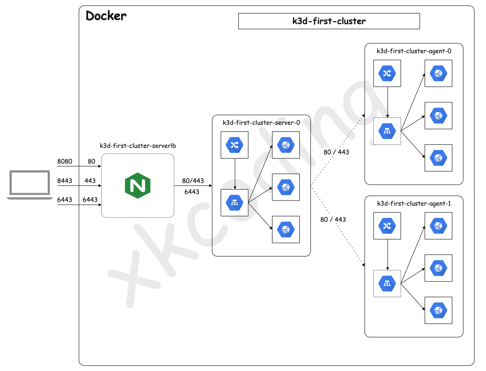

# 如何在本地快速启动一个 K8S 集群

其实有很多种方式可以在本地运行 k8s，比如：

- [minikube](https://minikube.sigs.k8s.io/docs/) 仅支持单节点，但是我们期望可以跑一个集群的方式，方便我们去 Mock 节点宕机之后 K8S 自动调度的 case ✖️
- [microk8s](https://microk8s.io/) 是 Ubuntu 生态里提供的一个可以单机运行的 k8s 版本，配合 Ubuntu 生态的 multipass，可以模拟多节点，但是在本就资源紧张的本地环境，通过虚拟机的方式模拟多节点，显然并不是我想要的 ✖️
- [kind](https://kind.sigs.k8s.io/) 是一个基于 docker 构建 Kubernetes 集群的工具，Kubernetes in Docker ✔️
- [k3d](https://k3d.io/) 是一个可以让 k3s 运行在 Docker 中的工具，相比于 kind ，启动速度更快，占用资源更小，也是我采取的一种方案 ✅

当然了，如果只是学习 k8s 的使用，那么以上方案均可以使用。

> 关于 k3d 以及 kind 的对比，可以参考 [K3d vs Kind 谁更适合本地研发](https://developer.aliyun.com/article/778513)。

## 1. 什么是 k3d + k3s ？

> [k3s](https://k3s.io/) 是一种非常快速且轻量级的完全兼容的 Kubernetes 发行版（CNCF 认证）。
>
> [k3d](https://k3d.io/) 是一个可以让 k3s 运行在 Docker 中的工具，它提供了一个简单的 CLI 来创建、运行和删除具有 1 到 N 个节点的 Kubernetes 集群。

k3s 包括以下一些组件：

- [Containerd](https://containerd.io/)：一个类似 Docker 的运行时容器，但是它不支持构建镜像
- [Flannel](https://github.com/flannel-io/flannel#flannel)：基于 [CNI](https://github.com/containernetworking/cni#3rd-party-plugins) 实现的网络模型，默认使用的是 Flannel，也可以使用 [Calico](http://docs.projectcalico.org/) 等其他实现替换
- [CoreDNS](https://coredns.io/)：集群内部 DNS 组件
- [SQLite3](https://sqlite.org/)：默认使用 SQLite3 进行存储，同样也支持 etcd3, MySQL, Postgres
- [Traefik](https://traefik.io/)：默认安装 Ingress controller 是 traefik 1.x 的版本
- Embedded service loadbalancer：内嵌的一个服务负载均衡组件

k3s 是一种模块化的发行版，可以很方便的替换上面的组件。

## 2. 安装 k3d

在 Mac 下，使用 Homebrew 可以很方便的安装 k3d： `brew install k3d`。

顺手安装一下 `kubectl` 和 `kubecm`：

```shell
brew install kubectl
brew install kubecm
```

## 3. 小试牛刀

我们通过 k3d 的命令可以轻易的在本地启动一个或 N 个 k8s 集群。

首先我们尝试创建一个 `1主2从` 的集群：

```shell
k3d cluster create first-cluster --port 8080:80@loadbalancer --port 8443:443@loadbalancer --api-port 6443 --servers 1 --agents 2
```

初次创建可能会比较慢，因为会从 Docker 仓库拉取最新的 `rancher/k3s` 镜像。

也可以在创建的时候指定镜像:

```bash
k3d cluster create k3s-local --port 8080:80@loadbalancer --port 8443:443@loadbalancer --api-port 6443 --servers 1 --agents 2 --image rancher/k3s:v1.20.4-k3s1
```

当出现下面的日志时，k8s 集群就创建成功了 😉 

```bash
INFO[0000] Prep: Network
INFO[0000] Created network 'k3d-first-cluster'
INFO[0000] Created volume 'k3d-first-cluster-images'
INFO[0001] Creating node 'k3d-first-cluster-server-0'
INFO[0001] Creating node 'k3d-first-cluster-agent-0'
INFO[0001] Creating node 'k3d-first-cluster-agent-1'
INFO[0001] Creating LoadBalancer 'k3d-first-cluster-serverlb'
INFO[0001] Starting cluster 'first-cluster'
INFO[0001] Starting servers...
INFO[0001] Starting Node 'k3d-first-cluster-server-0'
INFO[0008] Starting agents...
INFO[0008] Starting Node 'k3d-first-cluster-agent-0'
INFO[0020] Starting Node 'k3d-first-cluster-agent-1'
INFO[0028] Starting helpers...
INFO[0028] Starting Node 'k3d-first-cluster-serverlb'
INFO[0029] (Optional) Trying to get IP of the docker host and inject it into the cluster as 'host.k3d.internal' for easy access
INFO[0031] Successfully added host record to /etc/hosts in 4/4 nodes and to the CoreDNS ConfigMap
INFO[0031] Cluster 'first-cluster' created successfully!
INFO[0031] --kubeconfig-update-default=false --> sets --kubeconfig-switch-context=false
INFO[0031] You can now use it like this:
kubectl config use-context k3d-first-cluster
kubectl cluster-info
```

此时，我们按照日志提示，运行 `kubectl cluster-info` 查看下当前集群的信息：

```bash
Kubernetes master is running at https://0.0.0.0:6443
CoreDNS is running at https://0.0.0.0:6443/api/v1/namespaces/kube-system/services/kube-dns:dns/proxy
Metrics-server is running at https://0.0.0.0:6443/api/v1/namespaces/kube-system/services/https:metrics-server:/proxy
```

运行 `kubectl get nodes` 查看下当前集群的节点情况：

```bash
NAME                         STATUS   ROLES                  AGE    VERSION
k3d-first-cluster-agent-1    Ready    <none>                 178m   v1.20.2+k3s1
k3d-first-cluster-server-0   Ready    control-plane,master   178m   v1.20.2+k3s1
k3d-first-cluster-agent-0    Ready    <none>                 178m   v1.20.2+k3s1
```

注意，这里的“节点”其实是本机 Docker 运行的容器，通过 `docker ps` 查看下当前本机运行的容器吧

```bash
CONTAINER ID   IMAGE                      COMMAND                  CREATED       STATUS       PORTS                                                                 NAMES
a757151daf14   rancher/k3d-proxy:v4.2.0   "/bin/sh -c nginx-pr…"   4 hours ago   Up 4 hours   0.0.0.0:6443->6443/tcp, 0.0.0.0:8080->80/tcp, 0.0.0.0:8443->443/tcp   k3d-first-cluster-serverlb
6fcb1bbaf96e   rancher/k3s:latest         "/bin/k3s agent"         4 hours ago   Up 4 hours                                                                         k3d-first-cluster-agent-1
cef7277e43b9   rancher/k3s:latest         "/bin/k3s agent"         4 hours ago   Up 4 hours                                                                         k3d-first-cluster-agent-0
5d438c1b5087   rancher/k3s:latest         "/bin/k3s server --t…"   4 hours ago   Up 4 hours                                                                         k3d-first-cluster-server-0
```

解释一下我们创建集群时配置的端口映射：

- `--port 8080:80@loadbalancer` 会将本地的 8080 端口映射到 loadbalancer 的 80 端口，然后 loadbalancer 接收到 80 端口的请求后，会代理到所有的 k8s 节点。
- `--api-port 6443` 默认提供的端口号，k3s 的 api-server 会监听 6443 端口，主要是用来操作 Kubernetes API 的，即使创建多个 Master 节点，也只需要暴露一个 6443 端口，loadbalancer 会将请求代理分发给多个 Master 节点。
- 如果我们期望通过 NodePort 的形式暴露服务，也可以自定义一些端口号映射到 loadbalancer 来暴露 k8s 的服务，比如：`-p 10080-20080:10080-20080@loadbalancer`

现在我们集群和主机的网络通信是这样子的：



## 4. 测试

创建一个 nginx 的 Deployment

```bash
kubectl create deployment nginx --image=nginx
```

创建一个 Service 通过 ClusterIP 的方式暴露服务

```bash
kubectl create service clusterip nginx --tcp=80:80
```

创建一个 Ingress，k3s 默认安装的是 traefik 1.x 作为 Ingress Controller

```bash
cat <<EOF | kubectl apply -f -
apiVersion: networking.k8s.io/v1
kind: Ingress
metadata:
  name: nginx
  annotations:
    ingress.kubernetes.io/ssl-redirect: "false"
spec:
  rules:
  - http:
      paths:
      - path: /
        pathType: Prefix
        backend:
          service:
            name: nginx
            port:
              number: 80
EOF
```

此时，打开浏览器，访问 http://localhost:8080/ 就可以看到熟悉的 nginx 默认页。

这是不是太酷了~ 😎

## 5. 其它

### 5.1. 管理集群

- 停止集群：`k3d cluster stop first-cluster`
- 重启集群：`k3d cluster start first-cluster`
- 删除集群：`k3d cluster delete first-cluster`

### 5.2. 创建指定版本的k8s集群

当使用 Helm Chart 安装 Rancher 时，可能会出现如下错误日志：

```bash
chart requires kubeVersion: < 1.20.0-0 which is incompatible with Kubernetes v1.20.0+k3s2
```

> 测试时 Rancher 版本号为 2.5.5，目前最新的 `2.5.6` 已经可以支持 1.20.x 版本了

要创建一个 k8s 版本号为 `v1.19.8-k3s1` 的 k8s 集群，可以在创建集群的命令后面加 `--image` 参数，指定版本号：`k3d cluster create first-cluster xxxxx --image rancher/k3s:v1.19.8-k3s1`

### 5.3. 快速切换 kubectl context

还记得在第二步顺手安装的 `kubecm` 吗？

当我们在本地使用 k3d 创建了多个集群之后，我们可以通过 `kubecm` 快速切换 context。

```bash
$ kubecm s
Use the arrow keys to navigate: ↓ ↑ → ←  and / toggles search
Select Kube Context
  😼 k3d-first-cluster(*)
    k3d-dev
    k3d-rancher-test
    <Exit>

--------- Info ----------
Name:           k3d-first-cluster
Cluster:        k3d-first-cluster
User:           admin@k3d-first-cluster
```

## 参考

- k3s：https://k3s.io/
- k3d：https://k3d.io/
- kubecm：https://github.com/sunny0826/kubecm
- https://rancher.com/blog/2020/set-up-k3s-high-availability-using-k3d
- https://en.sokube.ch/post/k3s-k3d-k8s-a-new-perfect-match-for-dev-and-test