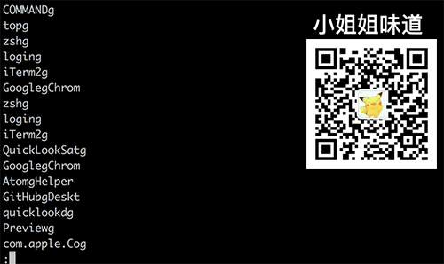
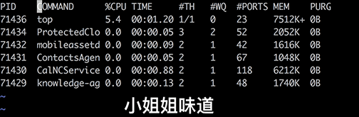
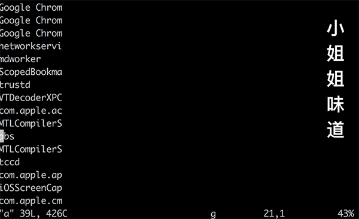

# Linux生产环境上，最常用的一套“vim“技巧

> 原文链接：[Linux生产环境上，最常用的一套“vim“技巧](https://juejin.im/post/6844903721550217229)

**最有用系列：**

[《Linux生产环境上，最常用的一套“vim“技巧》](https://juejin.im/post/6844903721550217229)

[《Linux生产环境上，最常用的一套“Sed“技巧》](https://juejin.im/post/6844903848885092365)

[《Linux生产环境上，最常用的一套“AWK“技巧》](https://juejin.im/post/6844903871895044109)

[《"Sed" 高级功能：我这小脑瓜都快绕晕了》](https://juejin.im/post/6844903859396050957)

# 引子

研发线上使用最多的编辑器，就是`vi`。无论是最快查看某个文件内容，还是快速编辑某个文件，`vi`都能帮上忙。

软件世界貌似有一些非常长寿的东西，`vi`算是一个。本篇文章聚焦的是研发线上最常用的一些功能。至于安装插件，写一些脚本，那一般是在开发机上玩的，生产环境没有条件、也没有时间忍受你做这些增强。希望看完本文，能够对这款神器有一个大体印象。当然，熟练的使用还需要日常有意识的培养。

> `vim`是`vi`的增强版，一般现代`linux`都不缺那几兆空间，所以预装的都是增强版，本文默认使用`vim`。

# 养成习惯

`vim`最大的贡献就是它的**按键系统**。这也是为什么**chrome**、**idea**、**atom**等编辑器都会提供一个`vim mode`。**笔者见过很多资深的程序员，包括架构师，习惯使用方向键去控制光标的移动。**这不能说不对，但这也抛弃了`vim`最大的精华所在，效率上低了一大截。坚持使用`h`、`j`、`k`、`l`，你会感谢你今天的纠正。大脑和手指真的是有记忆，当你用的足够多，这也就成了你约定俗成的设定。

`vim`另外一个特点就是**带模式的**。一共四种模式，我们不需要记忆，只需要使用例子去理解即可。

# 不要添乱

不要使用`vim`打开大文件，`vim`会一次性读取所有内容到内存，容易造成宿主机内存溢出。 打开文件前，可以使用`du -h`命令查看文件大小。一般，`100MB`以下为宜。

# 常用操作

#### 以下操作在普通模式下执行，连续按键

## 漫游

> - **j** 向下
> - **30j** 向下移动30行
> - **k** 向上
> - **h** 向左
> - **l** 向右
> - **0** 到行首
> - **^** 到行首第一个字符，如果前面有空格的话
> - **$** 到行尾
> - **gg** 快速到文件头
> - **G** 快速到文件尾
> - **100G** 跳转到第100行

*不建议在插入模式下进行光标移动，这很低效*

## 复制：y

> - **yy** 复制一行
> - **10yy** 向下复制10行
> - **yw** 复制光标开始的一个单词
> - **y$** 复制光标到行尾
> - **yfB** 复制光标到第一个大写B中间的内容
> - **y2fB** 复制光标到第二个大写B中间的内容

## 剪切: x

> - **x** 向剪切一个一个字符，如果是在行尾，则为向前剪切
> - **3x** 剪切三个
> - **xp** 非行尾交换两个字符，如从`bs`变成`sb`

## 删除：d

*删除的内容会放到剪贴板，按`p`即可粘贴到其他地方*

> - **dd** 删除一行
> - **200dd** 删除200行
> - **dw** 删除一个单词 （最喜欢啦）
> - **df"** 删除到出现的第一个双引号

## 粘贴: p

> - **p** 粘贴复制或剪切的内容
> - **3p** 将复制或剪切的内容粘贴三次

# 可视化模式

### `v` 行模式，选择一些内容

可视化模式是非常有用的一种模式，在普通模式下按**v**即可进入。 使用`h`、`j`、`k`、`l`进行漫游，选中相应的内容。

例子，选中一部分想要的内容，并删除。

### `ctrl+v` 块模式

演示：将文件中的每一行添加到`ArrayList`中：

- **1)** 在命令模式下，执行`%s/$/");/g`，在行尾追加数据
- **2)** 按`ESC`进入普通模式，并使用`gg`回到行首
- **3)** 按`ctrl+v`进入可视化模式，然后按`G`到文件尾
- **4)** 不要理会编辑器反应，按`I`进入插入模式，输入`list.add("`
- **5)** 按`ESC`回到普通模式，可以发现以上输入已经在每一行生效了

块模式还可以完成列的呼唤，貌似在`UE`里见过此神技。

# 命令模式

上面的例子里已经展示了命令模式的进入模式。**在普通模式下，输入`:`即可进入**。

> - **%s/$/sth/** 在行尾追加sth
> - **%s/^M//g** 替换掉dos换行符，`\^M`使用`ctrl+v + Enter`即可输入
> - **:g/^\s\*$/d** 删除空行以及只有空格的行
> - **%s/#.\*//g** 删除`#`之后的字符

*没错，命令模式用的是正则，这些经验是通用的*

你已经发现了，这大概就是针对编辑器窗口的`sed`命令。

# 查找字符串

*同样的，正则的知识也可以应用**

在普通模式下，按下`/`直接进入查找，输入相应的字符串按确定即可。

> - **n** 查找下一个匹配
> - **N** 查找上一个匹配
> - **2n** 查找下面第二个匹配

如果觉得跳来跳去晕头转向，可以在命令模式下输入`set nu`开启行号。

# 宏录制

这可以说是`vim`的一个杀手锏了。拿上面的例子来说。 将文件中的每一行添加到`ArrayList`中。

> - **1)** 按下`gg`到行首
> - **2)** 按下`qa`进行宏录制，`a`是我们起的一个标记名称
> - **3)** 按`I`进入插入模式，输入`list.add("`
> - **4)** 按`ESC`进入普通模式，然后按`$`跳到行尾
> - **5)** 按`j`进入下一行，然后按`^`回到行首
> - **6)** 再次按下`q`结束宏录制
> - **7)** 输入`@a`触发宏测试一下录制效果
> - **8)** 输入`100@a`重复宏100次，也就是影响下面的100行

*可以录制不同的多个宏，方面的进行批量操作*

# 其他

另外用的一些比较少的主要功能有

> - **r** 替换字符
> - **ggVG** 全选
> - **u** 恢复更改
> - **J** 合并下一行
> - **gU** 光标处转大写
> - **ggguG** 整篇文章大写转化为小写
> - **%** 跳转到下一个匹配,如在`
`上按`%`，则跳转到相应的`
`
> - **:e /tmp/a** 在同一个编辑器内打开`/tmp/a`文件。同一个编辑器的缓冲区是剪贴板是共享的，可以方便在多个文件中复制
> - **bp** 跳转到上一个缓冲区
> - **bn** 跳转到下一个缓冲区

# 退出编辑器

> - **wq** 保存当前文件并退出
> - **wqa** 保存所有文件并退出
> - **q!** 不保存，直接退出
> - **qa!** 有多个文件被打开，同时退出

本篇文章只聚焦常用功能，帮助读者快速处理线上文本。至于更多的，也装不下，只有你自己去探索喽。

`vim`的入门门槛比较高，幸运的是，用多了，你就无法释手了。