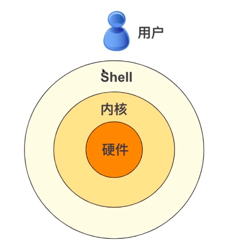
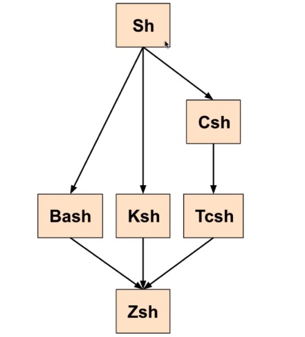

# 学习如何编写 Shell 脚本（基础篇）

> 原文链接：[学习如何编写 Shell 脚本（基础篇）](https://juejin.cn/post/6930013333454061575)

## 前言

如果仅仅会 `Linux` 一些命令，其实已经可以让你在平时的工作中游刃有余了。但如果你还会编写 `Shell` 脚本（尤其是前端工程师），它会令你“添光加彩”。

如果本文对你有所帮助，请点个👍 👍 👍 吧。

## Shell 是什么

- `Shell` 可以是一个程序，提供一个与用户对话的环境。这个环境只有一个命令提示符，让用户从键盘输入命令，所以又称为命令行环境（ `command line interface` ，简写为 `CLI` ）。 `Shell` 接收到用户输入的命令，将命令送入操作系统执行，并将结果返回给用户。
- Shell 也可以是一个命令解释器，解释用户输入的命令。它支持变量、条件判断、循环操作等语法，所以用户可以用 `Shell` 命令写出各种小程序，又称为脚本 `script`。这些脚本都通过 `Shell` 的解释执行，而不通过编译。
- `Shell` 还可以是一个工具箱，提供了各种小工具，供用户方便地使用操作系统的功能。


`Shell` 不像 `C` 语言， `C++`、`Java` 等编程语言那么完整，但是 `Shell` 这门语言可以帮助我们完成很多自动化任务，例如：保存数据，监测系统的负载，等等。

`Shell` 相比 `C` 等语言的优势在于它是完全嵌入在 `Linux` 中的，不需要安装，编译。

下图表示 `Shell` 与内核、操作系统之间的关系：



## Shell 的种类

`Shell` 有很多种，只要能给用户提供命令行环境的程序，都可以看作是 `Shell` 。

历史上，主要的 `Shell` 有下面这些：

- `Bourne Shell（sh）` ，是目前所有 `Shell` 的祖先，被安装在几乎所有发源于 `Unix` 的操作系统上。
- `Bourne Again shell（bash）` ，是 `sh` 的一个进阶版本，比 `sh` 更优秀， `bash` 是目前大多数 `Linux` 发行版以及 `macOS` 操作系统的默认 `Shell` 。
- `C Shell（csh）` ，它的语法类似 `C` 语言。
- `TENEX C Shell（tcsh）` ，它是 `csh` 的优化版本。
- `Korn shell（ksh）` ，一般在收费的 `Unix` 版本上比较多见。
- `Z Shell（zsh）` ，它是一种比较新近的 `Shell` ，集 `bash` 、 `ksh` 和 `tcsh` 各家之大成。


它们之间的演化关系图：


关于 `Shell` 的几个常见命令：

- `echo $SHELL` 可以查看本机正在使用的 `Shell` ，其中 `$SHELL` 是环境变量。
- `cat /etc/shells` 可以查看当前的 `Linux` 系统安装的所有 `Shell` 。
- 执行 `chsh` 命令是切换 `Shell` 类型为 `chsh` 。

## 什么是 Shell 脚本

计算机脚本程序是确定的一系列控制计算机进行运算操作动作的组合，在其中可以实现一定的逻辑分支等。

通俗的理解就是，多个 `Shell` 命令的组合并通过 `if` 条件分支控制或循环来组合运算，实现一些复杂功能。

例如我们常用的 `ls` 命令，它本身也是一个 `Shell` 脚本，通过执行这个 `Shell` 脚本可以列举当前目录下的文件列表。

本文使用的 `Shell` 种类是 `Bash` 。

编写我们的第一个 `Shell` 脚本 `hello.sh`

```bash
#!/bin/bash

# 执行的命令主体
ls
echo "hello world"
```

- `#!/bin/bash` 指定脚本要使用的 `Shell` 类型为 `Bash` 。
- `#!` 被称为 `Sha-bang` ，或者 `Shebang` ， `Linux` 会分析它之后的指令，并载入该指令作为解析器。
- `ls` 就是脚本文件的内容了，表明我们执行 `hello.sh` 脚本时会列举出当前目录的文件列表并且会向控制台打印 `hello world` 。


如果我们不是 `root` 用户的话，需要给脚本添加可执行权限才可以运行， `chmod +x hello.sh` 。

增加执行权限后可以执行 `./hello.sh` 来运行该脚本，也可以使用 `bash -x hello.sh` 以调试模式运行脚本。

### 系统命令

上面是通过 ./hello.sh 的方式执行的脚本文件，每次都需要添加路径，那么我们可以像执行 ls 一样，直接执行 hello.sh 吗，答案是可以的。

1. `echo $PATH` 获取系统里所有可以被直接执行程序的路径。
2. `sudo cp hello.sh /usr/bin` 将 `hello.sh` 拷贝到上诉任意一个 `path` 路径路径中，这里拷贝到 `/usr/bin` 。
3. 现在可以直接运行 `hello.sh` 命令而不需要添加路径了。

## echo 命令

`echo` 命令的作用是在屏幕输出一行文本，可以将该命令的参数原样输出。

```bash
echo hello world # 输出当行文本

# 输出多行文本
echo "
  hello
  world
"
```

### 解析转义字符

用 `-e` 参数使得 `echo` 可以解析转义字符

```bash
echo -e "hello \n world" # 如果不添加 -e 则会原样输出，添加了 -e 输出则会换行
```

## 引号

`Bash` 中有3种引号类型：

1. 单引号 `''` ，单引号用于保留字符的字面含义，各种特殊字符在单引号里面，都会变为普通字符，比如星号`*` 、美元符号`$` 、反斜杠 `\` 等。
2. 双引号 `""` ，双引号比单引号宽松，大部分特殊字符在双引号里面，都会失去特殊含义，变成普通字符。三个特殊字符除外：美元符号 `$` 、反引号 ``` 和反斜杠 `\` 。
3. 反引号 `` ，要求 `Shell` 执行被它括起来的内容，例如执行 echo `pwd`，相当于直接执行 `pwd` 命令 。

## 变量

`Bash` 没有数据类型的概念，所有的变量值都是字符串。

### 环境变量

环境变量是 `Bash` 环境自带的变量，进入 `Shell` 时已经定义好了，可以直接使用。它们通常是系统定义好的，可以理解成全局的常量。

常见环境变量种类：

- `BASHPID`： `Bash` 进程的进程 `ID` 。
- `EDITOR`：默认的文本编辑器。
- `HOME`：用户的主目录。
- `HOST`：当前主机的名称。
- `LANG`：字符集以及语言编码，比如 `zh_CN.UTF-8`。
- `PATH`：由冒号分开的目录列表，当输入可执行程序名后，会搜索这个目录列表。
- `PWD`：当前工作目录。
- `SHELL`： `Shell` 的名字。
- `TERM`：终端类型名，即终端仿真器所用的协议。
- `UID`：当前用户的 `ID` 编号。
- `USER`：当前用户的用户名。


环境变量相关命令：

```bash
env # 显示所有环境变量。
echo $PATH # 单独输出PATH环境变量

# 自定义环境变量
1. vim .bashrc # 进入bash的配置文件
2. export EDITOR=vim # 写入一个全局变量EDITOR并赋值vim
```

### 创建变量

- 字母、数字和下划线字符组成。
- 第一个字符必须是一个字母或一个下划线，不能是数字。
- 不允许出现空格和标点符号。

```bash
message="Hello World" # message 为变量名
```

### 使用变量

使用上面创建的变量，需要在变量名前面添加美元符号 `$` 

```bash
echo $message # 打印message变量
```

### 参数变量

可以这样调用我们的脚本文件 `./variable.sh 参数1 参数2 ...` 其中参数1、参数2...被称为“参数变量”。

在 `Shell` 脚本中可以通过以下变量获取参数：

- `$#` 参数的数目
- `$0` 被运行的脚本名称
- `$1` 第一个参数
- `$2` 第二个参数
- `$N` 第N个参数


使用 `shift` 命令来挪移变量值：

```bash
# shift.sh（具体内容）
#!/bin/bash
echo "第一个参数是 $1"
shift
echo "第一个参数是 $1"

# 控制台
./shift.sh p1 p2 p3
第一个参数是 p1
第一个参数是 p2
```

同样是 `$1` ，通过 `shift` 使得它的值会变成原本是 `$2` 的值。因此 `shift` 命令常被用在循环中，使得参数一个接一个地被处理。

## 数组

```bash
#!/bin/bash
# 定义数组
array=('v1' 'v2' 'v3') 

# 访问数组
echo ${array[2]} # 访问数组（bash下标是从0开始）
echo ${array[*]} # 使用*号访问数组所有的值
```

## 数学运算

在 `Bash` 中，所有的变量都是字符串， `Bash` 本身不会操作数字，因此它也不会做运算。不过可以使用 `let` 命令来实现运算。

```bash
#!/bin/bash

let "a = 5"
let "b = 2"
let "c = a + b"

echo "c = $c" # 输出 c = 7
```

在 `bash` 中可用的运算符有以下几种：

| 运算                 | 符号 |
| -------------------- | ---- |
| 加法                 | +    |
| 减法                 | -    |
| 乘法                 | *    |
| 除法                 | /    |
| 幂（乘方）           | **   |
| 余（整数除法的余数） | %    |

## read

请求输入， `read` 命令读取到的文本会立即被存储在一个变量里。

```
read.sh
#!/bin/bash

read name

echo "hello $name !"
```

执行 `./read.sh` 时，会发现光标处于接收输入的状态，此时我们输入一个字符串 `lion` 按下回车键后，控制台会打印出 `hello lion` 。

### 同时给几个变量赋值

可以用 `read` 命令一次性给多个变量赋值， `read` 命令一个单词一个单词（空格分开）地读取你输入的参数，并且把每个参数赋值给对应的变量。

```bash
#!/bin/bash

read oneName towName

echo "hello $oneName $towName !"
```

### 显示提示信息

`read` 命令的 `-p` 参数， `p` 是 `prompt` 的首字母，表示“提示”。

```bash
#!/bin/bash

read -p "请输入您的姓名：" name

echo "hello $name !"
```

### 限制字符数目

用 `-n` 参数可以限制用户输入的字符串的最大长度（字符数）

```bash
read -p "请输入您的姓名：" -n 5 name
```

### 限制输入时间

用 `-t` 参数可以限定用户的输入时间（单位：秒）超过这个时间，就不读取输入了。

```bash
read -p "请输入您的姓名：" -n 5 -t 10 name
```

### 隐藏输入内容

用 `-s` 参数可以隐藏输入内容，在用户输入密码时使用。

```bash
read -p "请输入密码：" -s password
```

## 条件语句

任意语言都有条件语言，用它来做条件判断。

### if 格式

```bash
if [ 条件测试 ] # 条件测试左右必须要有空格
then
	...
fi # 结束符

或者

if [ 条件测试 ]; then
	...
fi  
```

实例：

```bash
name="lion"

if [ $name = 'lion' ]; then # 这里使用 = 做判断条件，而不是 ==
    echo "hello $name"
fi
```

### if else 格式：

```bash
if [ 条件测试 ]
then
	...
else
	...
fi
```

实例：

```bash
if [ $n1 = $n2 ]
then
    echo "n1=n2"
else
    echo "n1!=n2"
fi 
```

### if else elif 格式

```bash
if [ 条件测试1 ]
then
 ....
elif [ 条件测试2 ]
then
	...
elif [ 条件测试3 ]
then
	...
else
	...default
fi  
```

实例：

```bash
#!/bin/bash

if [ $1 = "lion" ]
then
	echo "hello lion"
elif [ $1 = "frank" ]  
then 
	echo "hello frank"
else
	echo "我不认识你"
fi  
```

### 条件测试

不同的测试类型：

- 测试字符串
- 测试数字
- 测试文件


测试字符串：

- `$string1 = $string2` 表示两个字符串是否相等。
- `$string1 != $string2` 表示两个字符串是否不相等。
- `-z $string` 表示字符串 `string` 是否为空。
- `-n $string` 表示字符串 `string` 是否不为空。


测试数字：

- `$num1 -eq $num2` `equal` 的缩写，表示两个数字是否相等。
- `$num1 -ne $num2` `not equal` 的缩写，表示两个数字是否不相等。
- `$num1 -lt $num2` `lower than` 的缩写，表示 `num1` 是否小于 `num2` 。
- `$num1 -le $num2` `lower or equal` 的缩写，表示 `num1` 是否小于或等于 `num2` 。
- `$num1 -gt $num2` `greater than` 的缩写，表示 `num1` 是否大于 `num2` 。
- `$num1 -ge $num2` `greate or equal` 的缩写，表示 `num1` 是否大于或等于 `num2` 。


测试文件：

- `-e $file` `exist` 的缩写，表示文件是否存在。
- `-d $file` `directory` 的缩写，表示文件是否为一个目录。
- `-f $file` `file` 的缩写，表示文件是否是一个文件。
- `-L $file` `Link` 的缩写，表示链接。
- `-r $file` `readable` 的缩写，表示文件是否可读。
- `-w $file` `writable` 的缩写，表示文件是否可写。
- `-x $file` `executable` 的缩写，表示文件是否可执行。
- `$file1 -nt $file2` 表示文件 `file1` 是否比 `file2` 更新。
- `$file1 -ot $file2` 表示文件 `file1` 是否比 `file2` 更旧。


同时测试多个条件：

- `&&` 表示逻辑与，只要有一个不为真，整个条件测试为假。
- `||` 表示逻辑或，只要有一个为真，整个条件测试就为真。
- `!` 表示反转测试条件。

```bash
#!/bin/bash

read -p "输入文件路径：" file

if [ ! -e $file ]
then
	echo "$file 不存在"
else
	echo "$file 存在"
fi  
```

### case 测试多个条件

```bash
#!/bin/bash

case $1 in
    "lion")
  	echo "hello lion"
    ;;
   "frank" | "frank1" | "frank2") # 这里的逻辑或是一根竖线
   	echo "hello frank*"
    ;;
   *)
   	echo "我不认识你"
    ;;
esac    
```

把它理解成普通编程语言中的 `swtich ... case` 即可。

## 循环语句

使我们可以重复一个代码块任意多次。

`Bash` 中有3中类型的循环语句：

- `while` 循环
- `until` 循环
- `for` 循环

### while 循环

```bash
while [ 条件测试 ]
do
	...
done # 结束  
```

实例：

```bash
#!/bin/bash

while [ -z $response ] || [ $response != 'yes' ] # 输入的语句为空或者不是yes就会一直循环
do
    read -p 'Say yes：' response
done 
```

### until 循环

它的执行逻辑和 `while` 正好相反。

```bash
until [ 条件测试 ] # 条件测试为假会执行do，条件测试为真是结束循环
do
	...
done # 结束  
```

实例：

```bash
#!/bin/bash

while [ $response = 'yes' ] # 当 response 输入为 yes 时会结束循环，否则一直循环
do
    read -p 'Say yes：' response
done 
```

### for 循环

主要用于遍历列表

```bash
for 变量 in '值1' '值2' '值3' '值4'
do
	...
done  
```

实例：

```bash
#!/bin/bash

# 遍历一组值
for animal in 'dog' 'cat' 'pig'
do
    echo "$animal"
done

# 遍历 ls 命令的执行结果
listfile=`ls`
for file in $listfile
do
	echo "$file"
done

# 借助 seq 的 for 循环（seq后面会详细讲解）
for i in `seq 1 10`
do
	echo $i
done  
```

## 函数

函数是实现一定功能的代码块，函数还是重用代码的一种方式。

```bash
函数名 (){
	函数体
}
```

- 函数名后面的圆括号中不加任何参数，这点与主流编程语言不相同。
- 函数的完整定义必须置于函数的调用之前。


实例：

```bash
#!/bin/bash

print_something(){
    echo "我是一个函数"
}
print_something # 调用
```

### 传递参数

```bash
#!/bin/bash

print_something(){
    echo "hello $1" # $1 获取第一个参数
}
print_something Lion # Lion 为参数
print_something Frank # Frank 为参数
```

### 函数返回值

`Shell` 的函数可以返回一个状态，也用的是 `return` 关键字

```bash
#!/bin/bash

print_something(){
    echo "Hello $1"
    return 1
}

print_something Lion

echo "函数的返回值是 $?" # $? 获取到的是上一个函数的返回值
```

统计文件行数实例：

```bash
#!/bin/bash

line_in_file(){
	cat $1 | wc -l
}

line_num=$(line_in_file $1) # 函数的返回值赋给变量了

echo "这个文件 $1 有 $line_num 行"
```

### 函数的局部变量

```bash
#!/bin/bash

local_global(){
  local var1='local 1' # 通过 local 关键字定义局部变量
  echo "var1 is $var1"
}

local_global
```

### 函数重载命令

可以用函数来实现命令的重载，也就是说把函数的名字取成与我们通常在命令行用的命令相同的名字，重载需要用到 `command` 关键字。

重载 `ls` 命令实例：

```bash
#!/bin/bash

ls (){
    command ls -lh
}

ls
```

## 实战练习

### 需求分析

统计下面这段文本26个英文字母（从 `a` 到 `z` ）出现的次数。

```
words.txt
# 展示文本部分内容
Abigail
Ada
Adela
Adelaide
Afra
Agatha
Agnes
Alberta
Alexia
Alice
Alma
Alva
...
```

最终希望输出这样的结果：

```bash
A - 230
C - 57
D - 21
...
```

### 思路分析

在之前学习的知识中，我们知道 `grep` 可以查找文件中的关键字。

1. `grep` 命令可以帮助我们找到 `words.txt` 文本中所有出现的字母 `a` ，并且希望忽略大小写， `grep-io a words.txt`。
2. 通过管道符传递给 `wc -l` 命令这样就可以统计到数据了， `grep -io a words.txt | wc -l` ，这样就能统计到 `a` 字母的出现次数了。
3. 结合 `for` 循环，我们可以遍历字母 `a - z` ，去统计每个字母出现次数。
4. 最后对统计结果使用 `sort` 命令进行排序，就可以获取到我们想要的结果。

### 代码实现

```bash
#!/bin/bash
# 判断是否有参数
if [ -z $1 ]
then 
    echo "请输入文件"
    exit # 没有参数则退出
fi

# 判断文件是否存在
if [ ! -e $1 ]
then
    echo "文件为空"
    exit # 文件为空则退出
fi

# 定义统计函数
statistics(){
    for char in {a..z} # 循环字母a-z
    do
      # 这里的echo起的不是打印的作用，而是输出一个字符串，从而可以使用管道符进行转换，最后输出到tmp.txt文件中
      echo "$char - `grep -io "$char" $1 | wc -l`" | tr /a-z/ /A-Z/ >> tmp.txt
    done # 循环结束
    sort -rn -k 2 -t - tmp.txt # 排序并打印到控制台
    rm tmp.txt # 删除tem.txt
}

statistics $1 # 调用函数并传入 $1 参数
```

- `tr /a-z/ /A-Z/` 是用来转换所有小写字母为大写。
- `>>` 重定向输出追加到一个临时文件末尾。
- `sort -rn -k 2 -t - tmp.txt` 对这个临时文件按数字进行排序并打印到控制台。

## 小结

通过本文，我们学习了编写 `Shell` 脚本的一些基本语法：变量、数组、条件语句、循环语句以及函数，最后我们通过一个统计字母出现的次数作为一个小练习，巩固了所学的知识。

但其实编写 `Shell` 脚本还需要掌握最重要的文本处理三剑客 `sed` 、 `awk` 、 `grep` ，并且还需要掌握一些更加高级的技能使得我们可以实实在在地编写出工作中有实际用途的脚本，而不是停留在写 `Demo` 阶段。作者将会在《Shell 脚本进阶篇》中来主攻这些知识。