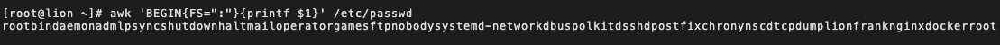
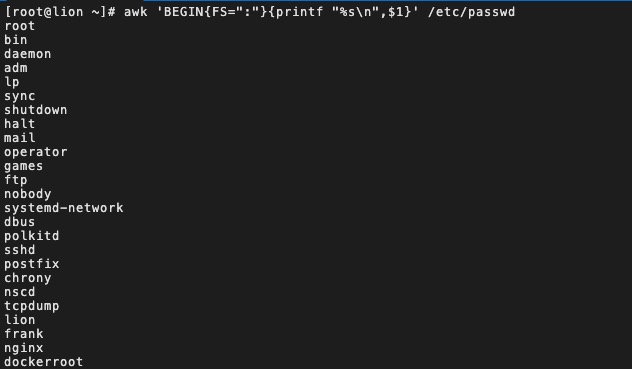
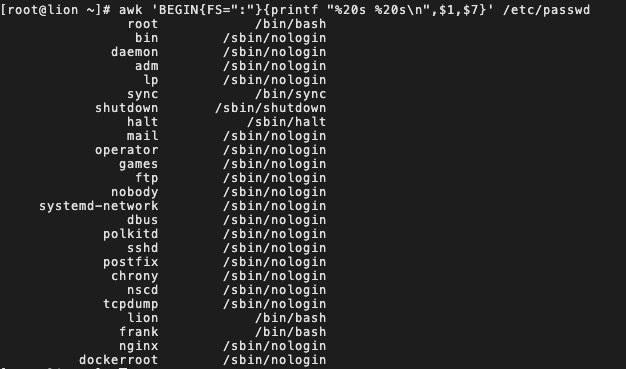
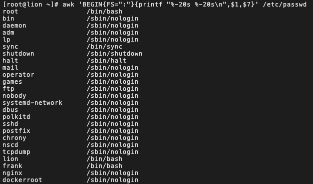

# 学习如何编写 Shell 脚本（进阶篇）

> 原文链接：[学习如何编写 Shell 脚本（进阶篇）](https://juejin.cn/post/6935365727205457928)

## 前言

在《[学习如何编写 Shell 脚本（基础篇）](https://juejin.cn/post/6930013333454061575)》一文中已经讲解了 `Shell` 脚本编程的基础知识，如果还有不熟悉的同学可以去回顾下，本文将主要讲解 `Shell` 脚本的进阶知识，以及进阶必备秘籍文本处理三剑客。

如果本文对你有所帮助，请点个👍 👍 👍 吧。

## 字符串

### 字符串替换

替换规则：

- `${变量名#匹配规则}` 从变量开头进行规则匹配，将符合最短的数据删除。
- `${变量名##匹配规则}` 从变量开头进行规则匹配，将符合最长的数据删除。
- `${变量名%匹配规则}` 从变量尾部进行规则匹配，将符合最短的数据删除。
- `${变量名%%匹配规则}` 从变量尾部进行规则匹配，将符合最长的数据删除。
- `${变量名/旧字符串/新字符串}` 变量内容符合旧字符串，则第一个旧字符串会被新字符串取代。
- `${变量名//旧字符串/新字符串}` 变量内容符合旧字符串，则全部旧字符串会被新字符串取代。

```bash
var_1="I love you, Do you love me"

var=${var_1#*ov} # e you, Do you love me

var=${var_1##*ov} # e me

var=${var_1%ov*} # I love you, Do you l

var=${var_1%%ov*} # I l

var_2="/usr/local/bin:/usr/bin:/bin:/usr/sbin:/sbin"

# 第一个小写bin被替换为大写的BIN
var=${var_2/bin/BIN} # /usr/local/BIN:/usr/bin:/bin:/usr/sbin:/sbin 

# 所有小写bin会被替换为大写的BIN
var=${var_2//bin/BIN} # /usr/local/BIN:/usr/BIN:/BIN:/usr/sBIN:/sBIN
```

### 计算字符串的长度

- `${#string}` 
- `expr length "$string"` 如果 `string` 有空格则必须加双引号。

```bash
var_1="Hello world"

len=${#var_1} # 11

len=`expr length "$var_1"` # 11
```

### 获取子串在字符串中的索引位置

- `expr index $string $substring` 从1开始计算索引位置。

```bash
var_1="quickstart is an app"

ind=`expr index "$var_1" start` # 6
ind=`expr index "$var_1" uniq` # 1
ind=`expr index "$var_1" f` # 0
```

它其实是按照子串的每个字符每个字符去进行匹配

- 第一个例子匹配到的是 `s` 位置6。
- 第二个匹配到的是 `q` 位置1。
- 第三个例子什么都没有匹配到所以位置是0。

### 计算子串长度

`expr match $string substr`从头开始匹配子串长度，如果没有匹配到则返回0，匹配到了则返回配的子串长度。

```bash
var_1="quickstart is an app"

sub_len=`expr match "$var_1" app` # 0
sub_len=`expr match "$var_1" quic` # 4
sub_len=`expr match "$var_1" quic.*` # 18
```

### 抽取子串

- `${string:position}` 从 `string` 的 `position` 开始。
- `${string:position:length}` 从 `position` 开始，匹配长度为 `length` 。
- `${string: -position}` 从右边开始匹配。
- `${string:(position)}` 从左边开始匹配。
- `expr substr $string $postion $length` 从 `position` 开始，匹配长度为 `length` 。

```bash
var_1="quickstartisanapp"

# 从索引10到最后提取子串，这种方式的索引是从0开始计算的
substr=${var_1:10} # isanapp

substr=${var_1:10:2} # is

# -5 前面需要添加空格，如果不添加空格也可以使用括号
substr=${var_1: -5} # anapp
substr=${var_1:(-5)} # anapp

# expr 这种方式的索引是从1开始
substr=`expr substr "$var_1" 10 5` # tisan
```

### 字符串实战练习

变量 `string="Bigdata process framework is Hadoop,Hadoop is an open source project"` 执行脚本后，打印输出 `string` 字符串变量，并给用户以下选项：

- (1)、打印 `string` 长度
- (2)、删除字符串中所有的 `Hadoop` 
- (3)、替换第一个 `Hadoop` 为 `Mapreduce` 
- (4)、替换全部 `Hadoop` 为 `Mapreduce` 

用户输入数字 `1|2|3|4` ，可以执行对应项的功能；输入 `q|Q` 则退出交互模式。

##### 思路分析

1. 打印字符串很简单，直接 `echo` 打印即可。
2. 删除字符串也不难，使用 `${变量名//旧字符串/新字符串}` ，把 `Hadoop` 替换为空就从原字符串中删除了。
3. 至于替换也是使用 `${变量名/旧字符串//新字符串}`
4. 用户输入，则使用的是上一篇文章讲到的 `read` 命令。

好了这个练习的思路非常简单，下面就让我们直接编写代码吧。

##### 代码实现

```bash
#!/bin/bash

string="Bigdata process framework is Hadoop,Hadoop is an open source project"

# 打印提示函数
print_tips(){
  echo "(1)、打印string长度"
  echo "(2)、删除字符串中所有的Hadoop"
  echo "(3)、替换第一个Hadoop为Mapreduce"
  echo "(4)、替换全部Hadoop为Mapreduce"
}

# 输出字符串长度函数
len_of_string(){
  echo "${#string}"
}

# 替换Hadoop子串为空，相当于删除
delete_Hadoop(){
  echo "${string//Hadoop/}"
}

# 替换一个Hadoop为Mapreduce
rep_hadoop_mapreduce_first(){
  echo "${string/Hadoop/Mapreduce}"
}

# 替换全部Hadoop为Mapreduce
rep_hadoop_mapreduce_all(){
  echo "${string//Hadoop/Mapreduce}"
}

# 无限循环的接收用户输入，直到用户输入了q|Q则退出进程
while true
do
  echo "$string" # 打印字符串
  echo # 打印一个空
  print_tips # 输出提示信息
  read -p "请输入你的选择(1|2|3|4|q|Q)：" choice # 接收用户输入
  # 根据用户的输入，进入不同的分支，调用不同的函数
  case $choice in
    1)
    	len_of_string
      ;;
    2)
    	delete_Hadoop
      ;;
    3)
    	rep_hadoop_mapreduce_first
      ;;
    4)
    	rep_hadoop_mapreduce_all
      ;;
    q|Q)
    	exit
      ;;
    *)
    	echo "错误的输入"
      ;;
    esac  
done
```

这样我们就轻轻松松完成了一个 `shell` 脚本了。

## 运算

`bash` 中的运算方式有以下几种：

- `$((...))` 
- `expr` 
- `let` 
- `bc` 
- `declare -i` 

### $((...))

```bash
echo $((2 + 2)) # 加法
echo $((5 / 2)) # 除法

i=0
echo $((i++)) # 先返回值后运算
echo $((++i)) # 先运算后返回值

echo $(( (2 + 3) * 4 )) # 圆括号改变运算顺序

echo $((0xff)) # 16进制转成10进制的运算

echo $((16>>2)) # 位运算

echo $((3 > 2)) # 逻辑运算，如果逻辑表达式为真，返回1，否则返回0


a=0
echo $((a<1 ? 1 : 0)) # 三元运算符

echo $((a=1)) # 变量赋值
```

[注意] 这个语法只能计算整数。

### expr

语法格式： `expr $num1 operator $num2`

操作符概览：

- `num1 | num2` -- `num1` 不为空且非0，返回 `num1` ; 否则返回 `num2` 
- `num1 & num2` -- `num1` 不为空且非0，返回 `num1` ；否则返回0
- `num1 < num2` -- `num1` 小于 `num2` ，返回1；否则返回0
- `num1 <= num2` -- `num1` 小于等于 num2 ，返回1；否则返回0
- `num1 = num2` -- `num1` 等于 `num2` ，返回1；否则返回0
- `num1 != num2` -- `num1` 不等于 `num2` ，返回1；否则返回0
- `num1 > num2` -- `num1` 大于 `num2` ，返回1；否则返回0
- `num1 >= num2` -- `num1` 大于等于 `num2` ，返回1；否则返回0
- `num1 + num2` -- 求和
- `num1 - num2` -- 求差
- `num1 * num2` -- 求积
- `num1 / num2` -- 求商
- `num1 % num2` -- 求余

```bash
$num1=30; $num2=50
expr $num1 \> $num2 # 大于不成立，返回0
expr $num1 \< $num2 # 小于成立，返回1
expr $num1 \| $num2 # 返回 num1
expr $num1 \& $num2 # 返回 num1
expr $num1 + $num2 # 计算加法
num3=`expr $num1 + $num2` # 计算结果赋值给num3
expr $num1 - $num2 # 计算减法
```

[注意] `>`、`<` 等操作符是 `Shell` 中的保留关键字，因此需要进行转义。否则就变成输出和输入重定向了。

##### 练习案例

提示用户输入一个正整数 `num` ，然后计算从 `1+2+3` 加到给定正整数。 必须对给定的 `num` 值进行是否为正整数判断，如果不是正整数则重新输入。

代码实现：

```bash
#!/bin/bash

while true # 无限循环接收用户输入
do
	read -p "pls input a positive number: " num # 接收到用户的输入，存为num值

	expr $num + 1 2>&1 /dev/null # 对num进行加1的运算，运算结果重定向到/dev/null
	
      # 由于 expr 只能运算整数，如果运算浮点数的话会报错，$?获取的是表达式执行结果，并非运算结果
      # 执行结果如果是正常的返回0
	if [ $? -eq 0 ];then # $? 获取到上一次运算结果
		if [ `expr $num \> 0` -eq 1 ];then # 上面判断了是否为整数，这里判断是否为正整数
    	# 类似JavaScript循环的写法遍历一个数值
			for((i=1;i<=$num;i++))
			do
				sum=`expr $sum + $i` # 获取运算结果总和
			done	
			echo "1+2+3+....+$num = $sum" # 输出运算结果
			exit # 退出循环
		fi
	fi
	echo "error,input enlegal" # 表示输入的值有误
	continue # 如果输入有误继续循环让用户输入
done

```

### let 命令

`let` 命令声明变量时，可以直接执行算术表达式。

```bash
let "foo = 1 + 2"
echo $foo # 3
```

### bc

支持浮点数运算。

```bash
echo "scale=2;23/5" | bc # scale表示浮点位数
num1=`echo "scale=2;23/5" | bc` # 运算结果保存为变量
```

### declare -i 命令

`-i` 参数声明整数变量以后，可以直接进行数学运算。

```bash
declare -i val1=12 val2=5
declare -i result
result=val1*val2
echo $result # 60
```

## 命令替换

获取某一段命令的执行结果，它的方式有两种：

- `command`
- `$(command)` 

```bash
all_files=`ls` # 获取ls命令的执行结果
all_files=$(ls) # 效果同上
```

这两种命令替换的方式都是等价的，可以任选其一使用。

### 实际案例

#### 获取系统的所有用户并输出

```bash
#!/bin/bash

index=1

for user in `cat /etc/passwd | cut -d ":" -f 1`
do
	# cat /etc/passwd 获取系统中的所有用户和密码
	# cut -d ":" -f 1 根据冒号切每一行的字符串，获取切好后的第一部分
	# 使用for循环进行遍历，并输出用户
	echo "This is $index user: $user"
	index=$(($index + 1))
done
```

#### 获取今年已经过了多少天和周

```bash
echo "This year have passed $(date +%j) days"
echo "This year have passed $(($(date +%j)/7)) weeks"
```

[注意] `$(())` 用于数学运算， `$()` 用于命令替换，这两个是平时使用中特别容易混淆的语法。

## declare

`declare` 命令可以声明一些特殊类型的变量，为变量设置一些限制，比如声明只读类型的变量和整数类型的变量。

### 语法格式

```bash
declare OPTION VARIABLE=value
```

### 常用参数

- `-r` 将变量设为只读；
- `-i` 将变量设为整数；
- `-a` 将变量定义为数组；
- `-f` 显示此脚本前定义过的所有函数及内容；
- `-F` 仅显示此脚本前定义过的函数名；
- `-x` 将变量声明为环境变量。

`declare`命令如果用在函数中，声明的变量只在函数内部有效，等同于`local`命令。

不带任何参数时，`declare`命令输出当前环境的所有变量，包括函数在内，等同于不带有任何参数的`set`命令。

##### `-i`

`-i` 参数声明整数变量以后，可以直接进行数学运算。

```bash
declare -i val1=12 val2=5
declare -i result
result=val1*val2
echo $result # 60
```

##### `-x`

`-x` 参数等同于 `export` 命令，可以输出一个变量为子 `Shell` 的环境变量。

```bash
declare -x foo=3 

# 等同于
export foo=3 
```

##### `-r`

`-r` 参数可以声明只读变量，无法改变变量值，也不能 `unset` 变量。

```bash
declare -r bar=1

# 如果此时更改bar
bar=2 # -bash: bar：只读变量
```

##### `-u` 

`-u` 参数声明变量为大写字母，可以自动把变量值转成大写字母。

```bash
declare -u foo
foo=upper
echo $foo # UPPER
```

##### `-l` 

`-l` 参数声明变量为小写字母，可以自动把变量值转成小写字母。

```bash
declare -l bar
bar=LOWER
echo $bar # lower
```

##### `-p` 

`-p` 参数输出变量信息。

```bash
foo=hello
declare -p foo #控制台输出：declare -x foo="hello"
```

## 数组

### 定义数组

```bash
array=('v1' 'v2' 'v3') 
```

### 输出数组内容

```bash
${array[@]} # 输出全部内容
${array[*]} # 也是输出全部内容
${array[1]} # 输出下标索引为1的内容
```

### 获取数组长度

```bash
${#array} # 数组内元素个数
${#array[2]} # 数组内下标为2的元素长度
```

### 数组赋值

```bash
array[0]="frank" # 给数组下标为1的元素赋值为frank
array[20]="lion" # 在数组尾部添加一个新元素
```

### 删除元素

```bash
unset array[2] # 清除元素
unset array # 清空整个数组
```

### 数组遍历

```bash
for v in ${array[@]}
do
done
```

## 文本三剑客

在之前的文章中也学习过 `grep` 命令了，这里为了统一学习文本三剑客，因此再复习下 `grep` 命令。

### grep

全局搜索一个正则表达式，并且打印到屏幕。简单来说就是，在文件中查找关键字，并显示关键字所在行。

#### 基础语法

```bash
grep text file # text代表要搜索的文本，file代表供搜索的文件

# 实例
[root@lion ~]# grep path /etc/profile
pathmunge () {
    pathmunge /usr/sbin
    pathmunge /usr/local/sbin
    pathmunge /usr/local/sbin after
    pathmunge /usr/sbin after
unset -f pathmunge
```

#### 常用参数

- `-i` 忽略大小写， `grep -i path /etc/profile`
- `-n` 显示行号，`grep -n path /etc/profile`
- `-v` 只显示搜索文本不在的那些行，`grep -v path /etc/profile`
- `-r` 递归查找， `grep -r hello /etc` ， `Linux` 中还有一个 `rgrep` 命令，作用相当于 `grep -r`

#### 高级用法

`grep` 可以配合正则表达式使用。

```bash
grep -E path /etc/profile --> 完全匹配path
grep -E ^path /etc/profile --> 匹配path开头的字符串
grep -E [Pp]ath /etc/profile --> 匹配path或Path
```

### sed

`stream Editor` 的缩写，流编辑器，对标准输出或文件逐行进行处理。

#### 语法格式

```bash
sed [option] "pattern/command" file

例如：
sed '/python/p' name.txt # 省略了option，/python/为pattern正则，p为command命令打印的意思
```

[注意] 匹配模式中存在变量要使用双引号。

#### 选项 option

##### `-n` 只打印模式匹配行

```bash
sed 'p' name.txt # 会对没一行字符串输出两遍，第一遍是原文本，第二遍是模式匹配到的文本
sed -n 'p' name.txt # 加了-n参数后就只打印模式匹配到的行
```

##### -e 默认选项

支持多个 `pattern command` 的形式

```bash
sed -e "pattern command" -e "pattern command" file
```

##### -f 指定动作文件

```bash
# 简单命令
sed -n '/python/p' name.txt # 但是一旦正则比较复杂，我们就可以把它保存在一个单独文件中，使用-f进行指定

# edit.sed 内容为 /python/p

sed -n -f edit.sed name.txt # '/python/p'这个命令保存在edit.sed文件中，使用-f指定
```

##### -E 扩展表达式

```bash
sed -n -E '/python|PYTHON/p' name.txt
```

##### -i 直接修改文件内容

```bash
sed -i 's/love/like/g' name.txt # -i修改原文件，全局love替换为like
```

#### 模式匹配 pattern

`pattern` 用法表

| 匹配模式                       | 含义                                                     | 用法                                                         |
| ------------------------------ | -------------------------------------------------------- | ------------------------------------------------------------ |
| `10command`                    | 匹配到第10行                                             | `sed -n "17p" name.txt` 打印 name 文件的第17行               |
| `10,20command`                 | 匹配从第10行开始，到第20行结束                           | `sed -n "10,20p" name.txt` 打印 `name` 文件的10到20行        |
| `10,+5command`                 | 匹配从第10行开始，到第15行结束                           | `sed -n "10,+5p" name.txt`                                   |
| `/pattern1/command`            | 匹配到 `pattern1` 的行                                   | `sed -n "/^root/p" name.txt` 打印 `root` 开头的行            |
| `/pattern1/,/pattern2/command` | 匹配到 `pattern1` 的行开始，至匹配到 `pattern2` 的行结束 | `sed -n "/^ftp/,/^mail/p" name.txt`                          |
| `10,/pattern1/command`         | 匹配从第10行开始，到匹配到 `pattern1` 的行结束           | `sed -n "4,/^ok/p" name.txt` 打印 `name` 文件从第4行开始匹配，直到以 `ok` 开头的行结束 |
| `/pattern1/,10command`         | 匹配到 `pattern1` 的行开始，到第10行匹配结束             | `sed -n "/root/,10p" name.txt`                               |

#### 命令 command

- 查询
  - `p` -- 打印
- 增加
  - `a` -- 行后追加
  - `i` -- 行前追加
  - `r` -- 外部文件读入，行后追加
  - `w` -- 匹配行写入外部文件
- 删除
  - `d` -- 删除
- 修改
  - `s/old/new` -- 将行内第一个 `old` 替换为 `new`
  - `s/old/new/g` -- 将行内全部的 `old` 替换为 `new`
  - `s/old/new/2g` --同一行，只替换从第二个开始到剩下所有的
  - `s/old/new/ig` -- 将行内 `old` 全部替换为 `new` ，忽略大小写

实例：

```bash
sed '/python/p' name.txt # 打印

sed '1d' name.txt # 删除第一行

sed -i '/frank/a hello' name.txt # 匹配到字符串frank就在这一行后面插入“hello”
sed -i '/frank/r list' name.txt # 把list文件内容追加到匹配frank字符串后面的行
sed -n '/frank/w tmp.txt' name.txt # 将匹配到frank的行全部写入tmp.txt文件中

sed -i 's/love/like/g' name.txt # 全局替换love为like，并修改源文件
```

#### 反向应用

引用前面的匹配到的字符。

假设有一个文件 `test.txt` 内容为：

```bash
a heAAo vbv
c heBBo sdsad
k heCCo mnh
```

现在需要匹配到 `heAAo heBBo heCCo` 并在他们后面添加 `s` 。

使用反向引用可以这样做：

```bash
sed -i 's/he..o/&s/g' test.txt # 其中&就是引用前面匹配到的字符
sed -i 's/\(he..o\)/\1s/g' test.txt # 与上面的写法等价

# 输出结果
a heAAos vbv
c heBBos sdsad
k heCCos mnh
```

### awk

`awk` 是一个文本处理工具，通常用于处理数据并生成结果报告。

#### 语法格式

```bash
awk 'BEGIN{}pattern{commands}END{}' file_name
```

- `BEGIN{}` 正式处理数据之前执行；
- `pattern` 匹配模式；
- `{commands}` 处理命令，可能多行；
- `END{}` 处理完所有匹配数据后执行。

#### 内置变量

- `$0` -- 整行内容。
- `$1-$n` -- 当前行的第 `1-n` 个字段。
- `NF` -- `Number Field` 的缩写，表示当前行的字段个数，也就是有多少列。
- `NR` -- `Number Row` 的缩写，表示当前行的行号，从1开始计数。
- `FNR` -- `File Number Row` 的缩写，表示多文本处理时，每个文件行号单独计数，都是从1开始。
- `FS` -- `Field Separator` 的缩写，表示输入字段分隔符，不指定默认以空格或 `tab` 键分割。
- `RS` -- `Row Separator` 的缩写，表示输入行分隔符，默认回车换行 `\n` 。
- `OFS` -- `Output Field Separator` ，表示输出字段分隔符，默认为空格。
- `ORS` -- `Output Row Separator` 的缩写，表示输出行分隔符，默认为回车换行。
- `FILENAME` -- 当前输入的文件名字。
- `ARGC` -- 命令行参数个数。
- `ARGV` -- 命令行参数数组。

[注意] 字段个数，非字符个数，例如 `"frank lion alan"` 这一行有3个字段。

```bash
awk '{print $0}' /etc/passwd # 只有处理命令，输出每一行的内容

awk 'BEGIN{FS=":"}{print $1}' /etc/passwd # 处理文本之前先定义好分隔符为冒号，然后打印每一行被冒号分割后的文本的第一个字段

awk 'BEGIN{FS=":"}{print $NF}' /etc/passwd # 输出没一行的最后一列，NF中存的总列数，因此$NF表示最后一列的字段

awk '{print $NF}' /etc/passwd # 输出每一行的字段个数（默认以空格分割后的字段个数）

awk '{print NR}' /etc/passwd # 输出文件的行号

awk '{print FNR}' /etc/passwd name.txt # 输出两个文件的行号，每个文件单独计数

awk 'BEGIN{RS="---"}{print $0}' /etc/passwd # 行分隔符设置为---

awk 'BEGIN{ORS="---"}{print $0}' /etc/passwd # 定义输出的每一行的分隔符为 --- 

awk 'BEGIN{ORS="---";RS="---"}{print $0}' /etc/passwd # BEGIN 中定义多个变量需要;分割

awk '{print FILENAME}' name.txt # 输出name.txt

```

[备注] `/etc/passwd` 就是 `Linux` 系统中的密码文本，后续会一直使用，大概是如下格式：

```bash
root:x:0:0:root:/root:/bin/bash
bin:x:1:1:bin:/bin:/sbin/nologin
daemon:x:2:2:daemon:/sbin:/sbin/nologin
adm:x:3:4:adm:/var/adm:/sbin/nologin
lp:x:4:7:lp:/var/spool/lpd:/sbin/nologin
sync:x:5:0:sync:/sbin:/bin/sync
```

#### printf

`awk` 格式化输出。

格式符：

- `%s` -- 打印字符串；
- `%d` -- 打印10进制数；
- `%f` -- 打印浮点数；
- `%x` -- 打印16进制数；
- `%o` -- 打印8进制数；
- `%e` -- 打印数字的科学计数法格式；
- `%c` -- 打印单个字符的 `ASCII` 码。

修饰符：

- `-` -- 左对齐；
- `+` -- 右对齐；
- `#` -- 显示8进制在前面加0，显示16进制在前面加 `0x` 。

```bash
awk 'BEGIN{FS=":"}{printf $1}' /etc/passwd
```

输入上面 `awk` 命令打印后得到这样的结果：  不再像使用 `print` 命令会默认以换行符作为默认的输出了，而是全部集中在一行，因此使用 `printf` 需要自定义输出格式：

```bash
awk 'BEGIN{FS=":"}{printf "%s\n",$1}' /etc/passwd # %s表示打印字符串 \n表示换行
```



是不是认为直接使用 `print` 也可以简单的做到，何必使用 `printf` 呢，但其实 `printf` 在处理多个字段的分隔符上是非常方便的。

```bash
awk 'BEGIN{FS=":"}{printf "%20s %20s\n",$1,$7}' /etc/passwd
```

- `%20s` 表示 `20` 个字符，如果实际字符不够会默认使用空格补全
- `$1` 表示第一部分， `$7` 表示第 `7` 部分



默认是右对齐，我们也可以添加修饰符，使其左对齐：

```bash
awk 'BEGIN{FS=":"}{printf "%-20s %-20s\n",$1,$7}' /etc/passwd
```



其它示例：

```bash
awk 'BEGIN{FS=":"} {printf "%d\n", $3}' /etc/passwd # 打印十进制数字，默认是左对齐的

awk 'BEGIN{FS=":"} {printf "%20d\n", $3}' /etc/passwd # %20d 不够的位数默认补全空格，因此它是右对齐

awk 'BEGIN{FS=":"} {printf "%f\n", $3}' /etc/passwd # 打印浮点数，默认保留小数点后6位置

awk 'BEGIN{FS=":"} {printf "%0.2f\n", $3}' /etc/passwd # 打印浮点数，保留小数点后2位置
```

#### 模式匹配 pattern

它与 `sed` 的 `pattern` 非常类似，都是按行进行匹配。

模式匹配的两种用法：

1. 按正则表达式匹配。
2. 运算符匹配。

正则匹配：

```bash
# 匹配/etc/passwd文件行中包含root字符串的所有行
awk '/root/{print $0}' /etc/passwd

# 匹配/etc/passwd文件行中以lion开头的所有行
awk '/^lion/{print $0}' /etc/passwd
```

运算符匹配：

- `<` 小于
- `>` 大于
- `<=` 小于等于
- `>=` 大于等于
- `==` 等于
- `!=` 不等于
- `~` 匹配正则表达式
- `!~` 不匹配正则表达式
- `||` 或
- `&&` 与
- `!` 非

```bash
# 以:为分隔符，匹配/etc/passwd文件中第三个字段小于50的所有信息
awk 'BEGIN{FS=":"}$3<50{print $0}' /etc/passwd

# 输出第三个字段值等于1的行
awk 'BEGIN{FS=":"}$3==1{print $0}' /etc/passwd

# 输出第七个字段值等于 /bin/bash 的行
awk 'BEGIN{FS=":"}$7=="/bin/bash"{print $0}' /etc/passwd

# 输出第三个字段值的位数大于3的行
awk 'BEGIN{FS=":"}$3~/[0-9]{3,}/{print $0}' /etc/passwd

# 以:为分隔符，匹配/etc/passwd文件中第一个字段包含hdfs或yarn的所有行信息
awk 'BEGIN{FS=":"}$1=="lion" || $1=="frank" {print $0}' /etc/passwd

# 以:为分隔符，匹配/etc/passwd文件中第三个字段小于50并且第四个字段大于50的所有行信息
awk 'BEGIN{FS=":"}$3<50 && $4>50{print $0}' /etc/passwd

```

#### awk 中的表达式

```bash
awk 'BEGIN{var=20;var1="aaa";print var,var1}' # 输出 20 aaa

awk 'BEGIN{n1=20;n2+=n1;print n1,n2}' # 20 20

awk 'BEGIN{n1=20;n2=30;printf "%0.2f\n",n1/n2}' # 输出浮点数，精确到小数点后两位
```

[注意] 在 `BEGIN` 和 `END` 中都可以正常执行表达式。

##### 巩固习题：使用 awk 计算 `/etc/services` 中的空白行数量

```bash
# BEGIN 定义变量，通过正则/^$/匹配到空行后，执行sum++，全面匹配结束后在打印sum的值
awk 'BEGIN{sum=0}/^$/{sum++}END{print sum}' /etc/services 
```

#### awk 中的条件语句

语法格式：

```bash
if(条件表达式)
	{动作1} 
else if(条件表达式)
	{动作2}
else
	{动作3}
```

练习：以冒号为分隔符，只打印 `/etc/passwd` 中第3个字段的数值在 `50-100` 范围内的行信息

```bash
awk 'BEGIN{FS=":"}{ if($3>50 && $3<100){print $0} }' /etc/passwd
```

#### awk 中的循环语句

语法格式：

```bash
# while 循环
while(条件表达式)
  动作
    
# do while 循环
do
  动作
while(条件表达式)
  
# for循环
for(初始化计数器;计数器测试;计数器变更)
  动作
```

##### 计算 1+2+3+...+100 的和

`while` 循环：

```bash
创建文件：while.awk
BEGIN{
  while(i<=100){
    sum+=i
    i++
  }
  print sum
}
执行命令：awk -f while.awk # 以脚本的方式执行awk动作
```

`for` 循环：

```bash
创建文件：for.awk
BEGIN{
  for(i=0;i<=100;i++)
  {
  	sum+=i
  }
  print sum
}
执行命令：awk -f for.awk # 以脚本的方式执行awk动作
```

`do...while` 循环：

```bash
创建文件：do-while.awk
BEGIN{
  do
  {
    sum+=i
    i++
  }while(i<=100)
  print sum
}
执行命令：awk -f do-while.awk # 以脚本的方式执行awk动作
```

#### awk 字符串函数

- `length(str)` 计算长度；
- `index(str1,str2)` 返回在 `str1` 中查询到的 `str2` 的位置；
- `tolower(str)` 小写转换；
- `toupper(str)` 大写转换；
- `split(str,arr,fs)` 分隔符字符串，并保存到数组中；
- `match(str,RE)` 返回正则表达式匹配到的子串位置；
- `substr(str,m,n)` 截取子串，从 `m` 个字符开始，截取 `n` 位。若 `n` 不指定，则默认截取到字符串末尾；
- `sub(RE,ReqStr,str)` 替换查找到的第一个子串；
- `gsub(RE,ReqStr,str)` 替换查找到的所有子串。

##### length(str)

计算字符长度

```bash
awk 'BEGIN{FS=":"}{print length($3)}' /etc/passwd # 计算第三个字段的长度
```

##### index(str1,str2)

返回在 `str1` 中查询到的 `str2` 的位置

```bash
awk 'BEGIN{print index("I have a dream","ea")}' # 查找ea在字符串中的位置
```

##### tolower(str)

转换为小写字符

```bash
awk 'BEGIN{print tolower("I have a dream")}' # i have a dream
```

##### toupper(str)

转换为大写字符

```bash
awk 'BEGIN{print toupper("I have a dream")}' # I HAVE A DREAM
```

##### split(str,arr,fs)

分隔符字符串，并保存到数组中

```bash
# 将字符串"I have a dream"按照空格进行分割

awk 'BEGIN{str="I have a dream";split(str,arr," ");for(a in arr) print arr[a]}'

# 输出
# dream
# I
# have
# a
```

通过 `for…in` 得到是无序的数组。如果需要得到有序数组，需要通过下标获得：

```bash
awk 'BEGIN{str="I have a dream";len = split(str,arr," ");for(i=1;i<=len;i++) print arr[i]}'
```

##### match(str,RE)

返回正则表达式匹配到的子串位置

```bash
# 输出字符串第一个数字出现所在的位置
awk 'BEGIN{str="I have 1 dream";print match(str,/[0-9]/)}' # 8
```

##### substr(str,m,n)

截取子串，从 `m` 个字符开始，截取 `n` 位。若 `n` 不指定，则默认截取到字符串末尾。

```bash
# 截取字符串"I have a dream"的子串，从第四个位置开始，一直到最后
awk 'BEGIN{str="I have a dream";print substr(str,4)}' # ave a dream
```

##### sub(RE,ReqStr,str)

替换查找到的第一个子串。

- `RE` 为正则表达式
- `ReqStr` 为要替换的字符串
- `str` 为源字符串

```bash
# 替换字符串"I have 123 dream"中第一个数字为$符号
awk 'BEGIN{str="I have 123 dream";sub(/[0-9]+/,"$",str);print str}' # I have $ dream
```

##### gsub(RE,ReqStr,str)

替换查找到的所有子串

- `RE` 为正则表达式
- `ReqStr` 为要替换的字符串
- `str` 为源字符串

```bash
# 替换字符串"I have 123 dream 456"中第一个数字为$符号
awk 'BEGIN{str="I have 123 dream 456";gsub(/[0-9]+/,"$",str);print str}' # I have $ dream $
```

#### 选项 option

- `-v` 参数传递
- `-f` 指定脚本文件
- `-F` 指定分隔符
- `-V` 查看 `awk` 的版本号

##### 参数传递

`awk` 的 `BEGIN` 中不能直接使用 `shell` 中定义的变量，需要通过 `-v` 参数进行传递

```bash
[root@lion ~]# var=20
[root@lion ~]# num=30
[root@lion ~]# awk -v var1="$var" -v var2="$num" 'BEGIN{print var1,var2}'
20 30
```

##### 指定脚本文件

`'BEGIN{}pattern{commands}END{}'` 这里的内容可以写在一个独立的文件中，通过 `-f` 参数来引入。

```bash
# test.awk
BEGIN{
  var=30
  print var
}

awk -f test.awk # 输出30
```

这种写法更易于编写和维护，适合复杂 `awk` 语句。

##### 指定分隔符

```bash
awk 'BEGIN{FS=":"}{print length($3)}' /etc/passwd

等同于：

awk -F : '{print length($3)}' /etc/passwd
```

##### 查看 awk 的版本号

```bash
[root@lion ~]# awk -V
GNU Awk 4.0.2
Copyright (C) 1989, 1991-2012 Free Software Foundation.
...
```

#### awk 处理生产数据实例

假设我们有一堆以下格式数据保存在文件 `data.txt` 中：

```bash
2020-01-01 00:01:01 1000 Batches: user frank insert 2010 records databases:product table:detail, insert 1000 records successfully,failed 1010 records
2020-01-01 00:01:02 1001 Batches: user lion insert 1030 records databases:product table:detail, insert 989 records successfully,failed 41 records
2020-01-01 00:01:03 1002 Batches: user mike insert 1290 records databases:product table:detail, insert 235 records successfully,failed 1055 records
2020-01-01 00:01:04 1003 Batches: user alan insert 3452 records databases:product table:detail, insert 1257 records successfully,failed 2195 records
2020-01-01 00:01:05 1004 Batches: user ben insert 4353 records databases:product table:detail, insert 2245 records successfully,failed 2108 records
2020-01-01 00:01:06 1005 Batches: user bily insert 5633 records databases:product table:detail, insert 3456 records successfully,failed 2177 records
2020-01-01 00:01:07 1006 Batches: user frank insert 2010 records databases:product table:detail, insert 1000 records successfully,failed 1010 records
```

统计每个人员分别插入了多少条 record 进数据库，预期结果：

```bash
USER	Total Records
frank	4020
lion  1030
...
```

代码演示：

```bash
# data.awk
BEGIN{
	printf "%-10s %-10s\n", "User", "Total Records"
}

{
	USER[$6]+=$8 # USER为数组，空格分割后$6这个变量是用户名，$8是records，每次都去数组中取出$6的值进行相加以获取重复用户的总Records
}

END{
    for(u in USER) # 遍历USER数组，打印数组每一项
    {
    	printf "%-10s %-10d\n", u , USER[u]
    }
}

# awk 语句
awk -f data.awk data.txt

# 输出结果
User       Total Records
frank      4020      
mike       1290      
bily       5633      
alan       3452      
lion       1030      
ben        4353 
```

## 小结

通过本文，我们学习了编写 `Shell` 脚本的一些进阶语法：操作字符串、算术运算、操作数组以及最核心的文本三剑客 `grep` 、 `sed` 和 `awk` 的详细用法。

虽然讲解知识时贯穿有实际应用案例，但想彻底掌握这些知识，还需要多多实战。

往期 `Linux` 相关文章链接：

- [学习 Linux 命令（基础篇）](https://juejin.cn/post/6919252234240786446)
- [学习 Linux 命令（进阶篇）](https://juejin.cn/post/6927040867756834823/)
- [十分钟掌握 Vim 编辑器核心功能](https://juejin.cn/post/6929248764746006535/)
- [学习如何编写 Shell 脚本（基础篇）](https://juejin.cn/post/6930013333454061575/)

