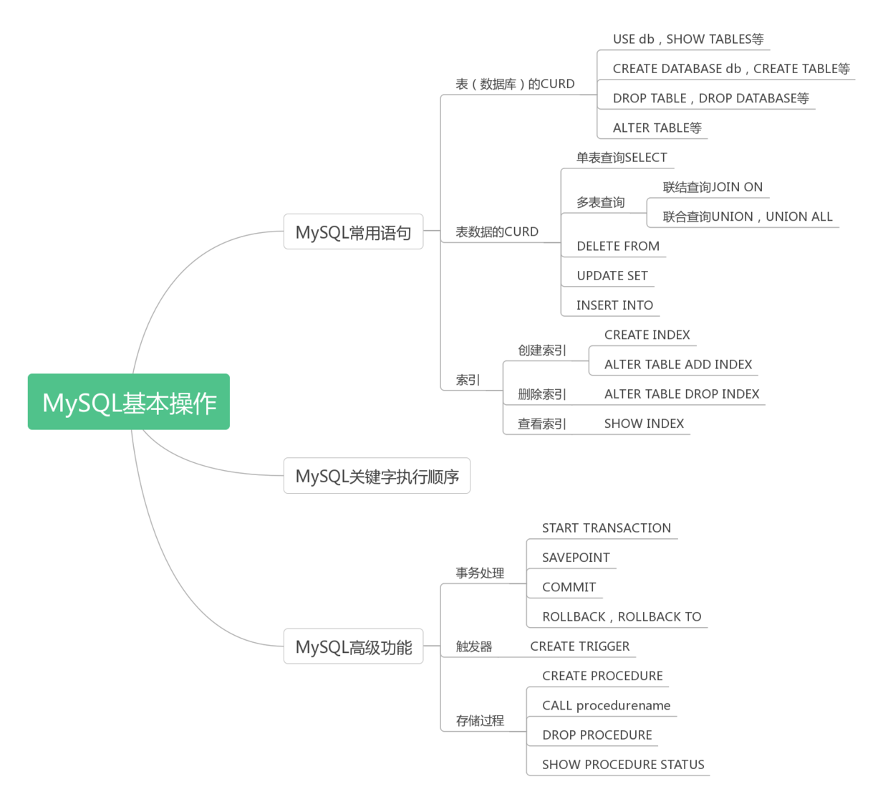

# MySQL基础必知必会



- MySQL常用语句
  1. 表（或者数据库）的CRUD
  2. 表数据的CRUD，其中表数据查询使用最多，也更复杂。查询可以按照单表还是多表可以分为：单表SELECT查询和多表的联结查询（INNER JOIN, LEFT JOIN, RIGHT JOIN和FULL JOIN）以及组合查询UNION和UNION ALL
  3. SQL语句中各个关键字的执行顺序
- MySQL的高级功能
  1. 存储过程
  2. 事务处理
  3. 触发器

# 1. 表(或数据库)操作语句

## 1.1. 查询表（或数据库）

1. **获取所有可用的数据库**：`SHOW DATABASES`；
2. **选择数据库**：`USE customers`；
3. **用于显示数据库服务器的状态信息**：`SHOW STATUS`；
4. **用于显示授权用户的安全权限**：`SHOW GRANTS`；
5. **用于显示数据库服务器或警告信息**：`SHOW ERRORS` 或者 `SHOW WARNINGS`；
6. **用于显示创建数据库时的创建语句**：`SHOW CREATE DATABASE customers`；
7. **用于显示创建表时的创建语句**：`SHOW CREATE TABLE customers`；
8. **获取当前所选的数据库中所有可用的表**：`SHOW TABLES`；
9. **获取表中所有列的信息**：`SHOW COLUMNS FROM tableName`；同时DESCRIBE语句有相同的效果：`DESCRIBE tableName`；

## 1.2. 新建表（或）数据库

1. **新建数据库**：`CREATE DATABASE customers`;

2. **创建表可以使用CREATE TABLE语句**:

   ```
    CREATE TABLE customers(
      cust_id INT NOT NULL AUTO_INCREMENT,
      cust_name CHAR(50) NOT NULL,
      cust_age INT NULL DEFAULT 18,
      PRIMARY KEY(cust_id)
    )ENGINE=INNODB;
   ```

   有这样一些细节：

   1. 允许**NULL**值，则说明在插入行数据时允许不给出该列的值，而**NOT NULL**则表示在插入或者更新该列数据，必须明确给出该列的值；
   2. **DEFAULT**表示该列的默认值，在插入行数据时，若没有给出该列的值就会使用其指定的默认值；
   3. **PRIMARY KEY**用于指定主键，主键可以指定一列数据，而可以由多列数据组合构成，如`PRIMARY KEY(cust_id,cust_name)`；
   4. **ENGINE**用于指定引擎类型。常见的引擎类型有这些：（1）InnoDB是一个支持可靠的事务处理的引擎，但是不支持全文本搜索；（2）MyISAM是一个性能极高的引擎，它支持全文本搜索，但是不支持事务处理；（3）MEMORY在功能上等同于MyISAM，但由于数据存储在内存中，速度很快（特别适合于临时表）；

3. 在创建表的时候可以使用**FOREIGN KEY**来创建外键，即一个表中的FOREIGN KEY指向另一个表中PRIMARY KEY。外键FOREIGN KEY用于约束破坏表的联结动作，保证两个表的数据完整性。同时也能防止非法数据插入外键列，因为该列值必须指向另一个表的主键。实例为：

   ```
    CREATE TABLE Orders
    (
    Id_O int NOT NULL,
    OrderNo int NOT NULL,
    Id_P int,
    PRIMARY KEY (Id_O),
    FOREIGN KEY (Id_P) REFERENCES Persons(Id_P)
    )
   ```

## 1.3 删除表（或数据库）

1. **删除数据库**：`DROP DATABASE customers`；
2. **删除表**，使用DROP TABLE子句：`DROP TABLE customers`。

## 1.4 更新表

1. 更新表结构信息可以使用**ALTER TABLE**子句，如为表增加一列：`ALTER TABLE vendors ADD vend_name CHAR(20)`；另外经常用于定义外键，如：

   ```
    ALTER TABLE customers 
    ADD CONSTRAINT fk_custormer_orders
    FOREIGN KEY(cust_id) REFERENCES orders (order_cust)
   ```

2. **重命名表，使用RENAME子句**。`RENAME TABLE backup_customers TO customers, backup_vendors TO vendors`；更改多个表名，之间用逗号间隔

# 2 表数据操作语句

## 2.1 查询表数据

> **基本查询语句**

1. 根据过滤条件查询表中的单列或者多列或者全部列的信息**SELECT FROM WEHERE**：`SELECT cust_id,cust_name FROM customers WHERE cust_id.10086`；其中过滤条件操作符有：=，<>,!=,<,<=,>,>=,BETWEEN AND,IS NULL；
2. 为查询出的某一列信息去重**DISTINCT**：`SELECT DISTINCT cust_name FROM customers`；
3. 限制单列查询结果的行数：`SELECT cust_name FROM customers LIMIT 5`；LIMIT后跟一个数值，表示从第0行开始取，共取5行数据；如果LIMIT 5，5表示从第5行（数据库中实际第6行记录）开始取，共取5行数据。注意：数据是从第0行开始计数的；
4. **ORDER BY**子句取一个或者多个列，据此对输出进行排序：`SELECT cust_id,cust_name FROM customers ORDER BY cust_id DESC, cust_name`;
5. **IN**操作符用来指定条件范围，范围中的每个条件都可以进行匹配：`SELECT cust_id, cust_name FROM customers WHERE cust_id IN (1000,2000)`。另外，NOT操作符可以和IN操作符配合使用，用于表示检索出不符合条件的所有数据；
6. **LIKE**操作符用来表明模糊查询，与之配合使用的通配符有**%**，%表示任何字符出现任何次数；`_`，`_`表示只能匹配一个字符：`SELECT cust_id,cust_name FROM customers WHERE cust_name LIKE '%happy%'`；
7. 使用分组查询并可以满足一定的分组过滤条件**GROUP BY HAVING**。如检索总计订单金额大于等于50的订单号和订单总金额，并按总金额进行排序：`SELECT order_num,SUM(quantity*item_price) AS order_total FROM orderitems GROUP BY order_num HAVING SUM(quantity*item_price)>=50 ORDER BY order_total`
8. **WHERE和HAVING的比较**。WHERE是行级过滤，而HAVING是组级过滤。被WHERE过滤掉的数据不会出现在分组中。WHERE中通配符以及多个WHERE子句的连接同样适用于HAVING子句；
9. GROUP BY的使用注意事项： （1）GROUP BY子句中可以嵌套分组（即通过多个列进行分组`GROUP BY cust_id, cust_name`），但是进行数据汇总时，是在最后规定的分组上进行；（2）GROUP BY子句中列出的每个列都必须是检索列或者是有效的表达式。（3）如果有NULL值，将值NULL作为一个分组进行返回，如果有多行NULL值，它们将分为一组
10. 嵌套其他查询中的查询，称之为**子查询**。执行过程由里向外，里层查询结果作为外层查询的条件：`SELECT cust_id FROM orders WHERE order_num IN (SELECT order_num FROM orderitems WHERE prod_id = 'happy')`。当然，多表的查询可以是用联结查询。

> **联结查询**

1. 内联结用又称之为内部联结，是基于两个表 之间的的相等测试。如果不加过滤条件，会造成“笛卡尔积”。`SELECT vend_name,prod_name,prod_price FROM vendors INNER JOIN products ON vendors.vend_id=products.vend_id`；同样可以使用WHERE进行多表联结查询，但是更推荐使用INNER JOIN等联结方式；
2. 外部联结包括左外联结**LEFT JOIN**和右外联结**RIGHT JOIN**和全连接**FULL JOIN**。例如查询每个客户的订单数：`SELECT customers.cust_id,orders.orders_num FROM customers LEFT JOIN orders ON orders.cust_id =customers.cust_id`；LEFT JOIN 会全部返回左表数据，RIGHT JOIN会全部返回右表数据，FULL JOIN会将左右两个表的数据全部返回；
3. 联结查询与聚集函数一起使用。如查询每个客户的订单数：`SELECT customers.cust_name,customers.cust_id,COUNT(orders.order_num) AS num_ord FROM customers INNER JOIN orders ON customers.cust_id=orders.cust_id GROUP BY customers.cust_id`；

> **组合查询**

1. 多个查询（SELECT）可以使用UNION将多个查询结果进行合并成一个结果集返回，**UNIO**N必须包含两个及两个以上的SELECT查询，并且每个传必须包含相同的列、表达式或聚集函数，数据类型不必完全相同，MySQL会进行隐式的类型转换。`SELECT vend_id,prod_id,prod_price FROM products WHERE prod_price>5 UINON SELECT vend_id,prod_id,prod_price FROM products WHERE vend_id IN (1001,1002)`;
2. **UNION**返回的是去重后的结果，如果不需要去重则可以使用**UNION ALL**；
3. 可以多组合查询使用ORDER BY进行排序，但是是针对的最终的结果集进行排序，而不是其中单个SELECT查询进行排序，因此对于组合查询来说ORDER BY子句只有一个。`SELECT vend_id,prod_id,prod_price FROM products WHERE prod_price>5 UINON SELECT vend_id,prod_id,prod_price FROM products WHERE vend_id IN (1001,1002) ORDER BY vend_id`

> **使用函数对数据进行处理**

1. 拼接列名：`SELECT Concat (vendName,'(',vendCountry,')') FROM vendors ORDER BY vendName`；
2. 执行算术表达式计算：`SELECT prodId, quantity,price, quantity`*`price AS expandedPrice FROM orderItems`；
3. 文本处理函数如Upper(),LTrim(),RTrim()等函数。比如使用Upper函数将文本转换成大写：`SELECT vendName, Upper(vendName) FROM vendors ORDER BY vendName`；
4. 时间和日期处理函数，如Date(),Day()等。`SELECT custId, orderNum FROM orders WHERE Date(orderDate)='2015-09-01'`；
5. 数值处理函数，如Abs(),Cos()等；
6. 常用的聚集函数。如AVG(),COUNT(),MAX(),MIN()以及SUM()。`SELECT COUNT(*) AS numbers, MIN(prod_price) AS price_min, MAX(prod_price) AS price_max,AVG(prod_price) AS price_avg FROM products`；

## 2.2 插入表数据

1. 向表中插入行数据可以使用INSERT INTO子句，更安全的方式是指定列名。`INSERT INTO customers (cust_name, cust_email) VALUES('happy','happy@gmail.com')`；在INSERT INTO子句中能够省略列名的前提条件是：该列可以允许定义为NULL值或者在定义该列时给出去了默认值；
2. 如果插入多行数据可以将多组值用逗号进行分隔即可。`INSERT INTO customers (cust_name, cust_email) VALUES('happy','happy@gmail.com'),('smart','smart@gmail.com')`；
3. 将查询出来的数据插入表中，可以使用INSERT SELECT语句。`INSERT INTO customers(cust_id,cust_contact) SELECT cust_id, cust_contact FROM customers WHERE cust_id>5`；其中SELECT中可以带WHERE过滤条件；INSERT SELECT通常被用于复制表数据

## 2.3 更新表数据

1. 如果要更新表数据的话，使用UPDATE子句：`UPDATE customers SET cust_name ='happy',cust_email='happy@gmail.com' WHERE cust_id = 1001`；
2. **注意：如果不加WHERE条件指定到某一行的话，会更新表中某一列全部的数据**。

## 2.4 删除表数据

1. 如果从表中删除数据的话，可以使用DELETE子句。`DELETE FROM customers WHERE cust_id = 10086`；删除的数据必定是表中行数据，而不是某一列。因此，与UPDATE子句相比，DELETE子句并不需要指定是哪一列，而仅仅只需要指定具体的表名即可；
2. **注意：如果不添加WHERE指定条件的话，会将整个表中所有行数据全部删除。另外，DELETE只是删除表中的数据，而不会删除表结构信息；**
3. 如果想删除表中全部的数据，可以使用**TRUNCATE**，比DELETE删除效率更高；

# 3. SQL中关键字执行顺序

在SQL语句中每个关键字都会按照顺序往下执行，而每一步操作，会生成一个虚拟表，最后产生的虚拟表会作为执行的最终结果返回。下面的是常用的关键字的执行顺序：

```
(8)SELECT (9)DISTINCT<select_list>
(1)FROM <left_table>
(3)<join_type> JOIN <right_table>
(2)            ON <join_condition>
(4)WHERE <where_condition>
(5)GROUP BY<group_by_list>
(6)WITH{CUBE|ROLLUP}
(7)HAVING<having_condition>
(10)ORDER BY<order_by_list>
(11)LIMIT<limit_number>
```

1. **FROM**：对FROM左边的表和右边的表计算笛卡尔积，产生虚表VT1；
2. **ON**：对虚拟表VT1进行ON筛选，只有那些符合<join_condition>条件的行才会被记录在虚拟表VT2中；
3. **JOIN**：如果是OUT JOIN，那么将保留表中（如左表或者右表）未匹配的行作为外部行添加到虚拟表VT2中，从而产生虚拟表VT3；
4. **WHERE**:对虚拟表VT3进行WHERE条件过滤，只有符合<where_condition>的记录才会被放入到虚拟表VT4；
5. **GROUP BY**：根据GROUP BY子句中的列，对虚拟表VT4进行分组操作，产生虚拟表VT5；
6. **CUBE|ROLLUP**：对虚拟表VT5进行CUBE或者ROLLUP操作，产生虚拟表VT6；
7. **HAVING**：对虚拟表VT6进行HAVING条件过滤，只有符合<having_condition>的记录才会被插入到虚拟表VT7中；
8. **SELECT**：执行SELECT操作，选择指定的列，插入到虚拟表VT8中；
9. **DISTINCT**：对虚拟表VT8中的记录进行去重，产生虚拟表VT9；
10. **ORDER BY**：将虚拟表VT9中的记录按照<order_by_list>进行排序操作，产生虚拟表VT10；
11. **LIMIT**：取出指定行的记录，产生虚拟表VT11，并将结果返回。

# 4. 索引

MySQL索引的建立对于MySQL的高效运行是很重要的，索引可以大大提高MySQL的检索速度。索引分单列索引和组合索引。单列索引，即一个索引只包含单个列，而组合索引，即一个索引包含多个列。

## 4.1 创建索引

创建索引有两种方式，一种是直接利用CREATE INDEX进行创建，另外一种则是通过修改表结构来进行添加，则是利用ALTER TABLE语句。

1. 使用CREATE INDEX

   语法为：

   ```
     CREATE [UNIQUE|FULLTEXT|SPATIAL] INDEX index_name
     [USING index_type]
     ON table_name (index_col_name,...)
   ```

   其中对应的语法变量信息如下：

   > **[UNIQUE|FULLTEXT|SPATIAL]**

   其中括号中的这三个关键字表示创建的索引类型，它们分别表示**唯一索引**、**全文索引**、**空间索引**三种不同的索引类型。如果我们不指定任何关键字，则默认为普通索引。

   > **index_name**

   `index_name`表示索引的名称，由用户自行定义，以便于以后对该索引进行修改等管理操作。

   > **index_type**

   `index_type`表示索引的具体实现方式，在MySQL中，有两种不同形式的索引——BTREE索引和HASH索引。在存储引擎为MyISAM和InnoDB的表中只能使用BTREE，其默认值就是BTREE；在存储引擎为MEMORY或者HEAP的表中可以使用HASH和BTREE两种类型的索引，其默认值为HASH。

   > **index_colname**

   `index_col_name`表示需要创建索引的字段名称，我们还可以针对多个字段创建复合索引，只需要在多个字段名称之间以英文逗号隔开即可。此外，对于CHAR或VARCHAR类型的字段，我们还可以只使用字段内容前面的一部分来创建索引，只需要在对应的字段名称后面加上形如(length)的指令即可，表示只需要使用字段内容前面的length个字符来创建索引。在这里，我们以customers表的cust_name字段(类型为VARCHAR(50))为例，使用cust_name字段的6个字符前缀来创建索引。

   ```
    CREATE INDEX idx_cust_name ON user (cust_name(6));
   ```

2. 使用ALTER TABLE

   语法为：

   ```
    ALTER TABLE table_name
    ADD [UNIQUE|FULLTEXT|SPATIAL] INDEX index_name 
    (index_col_name,...) [USING index_type]
   ```

## 4.2 删除索引

删除指定表中指定名称的索引，语法为：

```
ALTER TABLE table_name
DROP INDEX index_name;
```

例如删除名称为idx_cust_name的索引，其SQL语句为：

```
ALTER TABLE customers
DROP INDEX idx_cust_name;
```

## 4.3 修改索引

在MySQL中并没有提供修改索引的直接指令，一般情况下，我们需要先删除掉原索引，再根据需要创建一个同名的索引，从而变相地实现修改索引操作。

```
--先删除
ALTER TABLE user
DROP INDEX idx_user_username;
--再以修改后的内容创建同名索引
CREATE INDEX idx_cust_name ON customers (cust_name(8));
```

## 4.4 查看索引

在MySQL中，要查看某个数据库表中的索引也非常简单，只需要使用以下两个命令中的任意一种即可。

```
--如果查看索引前，没有使用user db_name等命令指定具体的数据库，则必须加上FROM db_name
SHOW INDEX FROM table_name [FROM db_name]
--如果查看索引前，没有使用user db_name等命令指定具体的数据库，则必须加上db_name.前缀
SHOW INDEX FROM [db_name.]table_name
```

# 5. 存储过程

1. 什么是存储过程？存储过程简单来说，就是为了复用性或者实现复杂的业务功能，而保存的一条或多条MySQL语句的集合，可将其视为批文件；
2. 为什么使用存储过程？（1）通过把处理封装在容易使用的单元中，简化复杂的操作；（2）由于不要求反复建立一系列处理步骤，这保证了数据的完整性，如果所有的开发人员和应用程序都使用同一存储过程，则所使用的代码都是相同的；（3）简化对变动的管理。如果表名、列名或业务逻辑有变化，只需要更改存储过程的代码，使用它的开发人员甚至不需要知道这些变化，也就是具备了安全性；（4）提高了性能，因为使用存储过程比单独使用SQL语句要快；（5）存储过程可用来编写功能更灵活的代码。因此，存储过程的具备三个特性:**简单可复用、安全以及高性能**；
3. 存储过程的缺点？（1）存储过程编写比基本的SQL语句更加复杂，需要更高的技能；（2）可能没有创建存储过程的权限，数据库管理员可能会限制创建存储过程的权限，允许用户使用存储过程，而不允许用户自由创建存储过程；

> **创建存储过程**

1. 创建存储过程。如需要统计用户订单总金额，如果该用户需要交税的话，订单总金额则需要再加上税费

   ```
    DELIMITER //
    CREATE PROCEDURE ordertotal(
    IN custid INT,
    IN taxable BOOLEAN,
    OUT ototal DECIMAL(8,2)
    )COMMENT 'obtain total order price'
    
    BEGIN
    
    /*declare variable for total*/
    DECLARE total DECIMAL(8,2);
    DECLARE taxrate INT DEFAULT 6;
    
    
    /*get the order total*/
    
    SELECT SUM(item_price*item_quantity) INTO total
    FROM customers
    WHERE cust_id = custid;
    
    /*is this taxable?*/
    
    IF taxable THEN
    	SELECT total+(total/100*taxrate) INTO total;
    END IF;
    SELECT total INTO ototal;
    END //
   ```

有这样一些细节： 

1. 使用`CREATE PROCEDURE`语句进行创建，（）圆括号中为存储过程的参数，其中参数类型有：①. **IN**类型，表示传递给存储过程；②. **OUT** 类型，表示存储过程返回的结果，在调用存储过程时需要传入@开始的变量；③. **INOUT**类型，表示在存储过程中可以传入和传出；

  2. **DECLARE**用来声明一个变量，如这里的total，taxrate。注意MySQL中定义变量时都是变量名在前，数据类型在后。 
  3. 存储过程具体逻辑写在**BEGIN END**之间； 
  4. 将值赋给变量使用**INTO**关键字；
  5. 由于存储过程中每个SQL语句中用；作为分隔符，会和单个SQL造成冲突，因此可使用**DELIMITER**重新定义分类符，如该例子中定义//为分隔符，自然存储过程结尾就用END //结尾，而不再是END。同时，分隔符//成对出现后，恢复到默认的";"作为分隔符；

> **执行存储过程**

1. 使用CALL子句执行存储过程，CALL子句接受存储过程的名称以及需要传递的参数。

   ```
    CALL ordertotal(1,TRUE,@total);
    SELECT @total;
   ```

如果存储过程中定义了OUT类型的输入参数，那么在执行存储过程时需要传入变量，如这里@total，并且变量都是用@开始的。如果存储过程中没有参数的话，就用空圆括号表示即可，`CALL ordertotal()`；

> **删除存储过程**

1. 删除存储过程，可以使用DROP PROCEDURE子句。如`DROP PROCEDURE ordertotal`；

> **查询存储过程**

1. 显示创建一个存储过程的语句，可以使用SHOW CREATE PROCEDURE。如`SHOW CREATE PROCEDURE ordertotal`；
2. 查询所有存储过程的状态，如果在定义存储过程中使用COMMENT添加注释，可以查看。同时可以LIKE进行过滤结果。如`SHOW PROCEDURE STATUS LIKE '%order%'`;

# 6. 事务处理

1. 什么是事务

   事务处理是用来维护数据库的完整性，它保证成批的MySQL操作要么完全执行，要么完全不执行。事务处理是一种机制，用来管理必须成批执行的MySQL操作，它们要么时作为整体执行或者完全不执行。

2. 关键概念：

   1. 事务：是指一组SQL语句；
   2. 回退：是指撤销指定的SQL语句的过程；
   3. 提交：指将未存储的SQL语句的结果写入数据库表中；
   4. 保留点：指事务处理中设置的临时占位符，可以对它发布回退；

3. 如何创建执行事务

   ```
    START TRANSACTION;
    INSERT INTO customers (cust_name,item_price,item_quantity) VALUES ('1',5,18);
    SELECT * FROM customers;
    SAVEPOINT insertinto;
    INSERT INTO customers (cust_name,item_price,item_quantity) VALUES ('2',5,18);
    ROLLBACK TO insertinto;
   ```

   执行结果为：插入数据('1',5,18)有效，因为，只会从保留点SAFEPOINT之后开始回退，也就是说保留点SAFEPOINT之前的SQL语句执行的结果仍然有效。

   有这样一些细节：

   1. **STAET TRANSACTION**用来表示下面的SQL语句集为一段事务；
   2. **SAFEPOINT** 用于指定保留点insertinto；
   3. **ROLLBACK TO**表示从指定保留点开=开始回退，也就是说保留点之前的SQL语句执行结果依然有效。如果仅仅使用**ROLLBACK**进行回退的话就表示从STAET TRANSACTION之后所有的SQL语句执行效果都会撤销；

4. MySQL提交（写或保存）操作是自动进行的，这称之为隐含提交。但是在事务处理块中，提交不会隐含进行，要使用COMMIT子句进行提交。如：

   ```
    START TRANSACTION;
    INSERT INTO customers (cust_name,item_price,item_quantity) VALUES ('1',5,18);
    INSERT INTO customers (cust_name,item_price,item_quantity) VALUES ('2',5,18);
    COMMIT;
   ```

采用COMMIT提交事务，如果两条SQL语句都执行成功，才会将数据都写入表中。

# 7. 触发器

1. 什么是触发器

   当某条SQL语句发生时，自动执行某些其他的SQL语句的时候就需要使用到触发器。触发器只能响应：DELETE，INSERT,UPDATE这三个特定操作。

2. 创建触发器

   创建触发器时需要给出最重要的四条信息：1.全局唯一的触发器名；2.触发器关联的表；3.触发器在何时执行（操作执行之前或者之后）4.触发器应该响应的活动（DELETE, INSERT或者UPDATE）；

   由于触发器只能响应特定的三种类型的操作，因此可创建的触发器也就三种类型:INSERT触发器，DELETE触发器以及UPDATE触发器。

   > **INSERT触发器**

   在执行INSERT触发器时，也这样几点需要注意：1.在INSERT触发器代码内，可以引用一个名为NEW的虚拟表，可以用NEW来访问刚插入的行数据；2.在BEFORE INSERT触发器中，NEW中的值可以被更新；3.对于AUTO_INCREMENT列，NEW在INSERT执行之前包含0.在INSERT执行之后包含新的自定生成值。

   创建一个INSERT触发器，每次插入一行数据，每次会返回当前插入的行数据的id。

   ```
    /*创建触发器*/
    CREATE TRIGGER insertcustomers AFTER INSERT ON customers
    FOR EACH ROW SELECT NEW.cust_id INTO @newinsertid;
    
    /*执行触发器*/
    INSERT INTO customers (cust_name,item_price,item_quantity) VALUES ('2',5,18);
    SELECT @newinsertid;
   ```

   有这样一些细节：

   1. 使用CREATE TRIGGER来创建触发器；
   2. AFTER INSERT表明在插入行数据之后，触发器才会执行特征操作；
   3. FOR EACH ROW 表示对插入的每一行数据，触发器都起作用；
   4. 针对INSERT触发器，可以使用虚拟表NEW，来使用刚插入的行数据。比如例子中，`SELECT NEW.cust_id INTO @newinsertid`表示将新插入的行数据的id赋值给变量@newinsertid；

   > **DELETE触发器**

   DELETE触发器在DELETE语句执行之前或者之后，需要知道以下两点：

   1. 在DELETE触发器代码内，可以引用一个名为OLD的虚拟表，来访问被删除的行；
   2. OLD表中的数据只能读，不能被更新，而在INSERT触发器中，就可以通过NEW来更新被插入的行数据；

   例如，针对customers表，当删除一行数据时，返回被删除数据的`cust_id`以及`cust_name`:

   ```
    /*创建DELETE触发器*/
    
    DELIMITER //
    CREATE TRIGGER insertcustomers AFTER DELETE ON customers
    FOR EACH ROW 
    BEGIN 
      SELECT OLD.cust_name INTO @deletecustname;
      SELECT OLD.cust_id INTO @deletecustid;
    END //
    
    /*调用DELETE触发器*/
    DELETE FROM customers WHERE cust_id = 3;
    SELECT @deletecustname;
    SELECT @deletecustid;
   ```

   基本上与创建INSERT触发器一样，只不过在DELETE触发器中只能使用OLD来访问被删除的行数据。

   > **UPDATE触发器**

   UPDATE触发器在UPDATE语句执行之前或者之后执行，需要知道一下几点：

   1. 在BEFORE UPDATE触发器中可以使用NEW和OLD来访问数据，而在AFTER UPDATE触发器中使用NEW来访问数据会报错，只能使用OLD来访问数据；
   2. 在BEFORE UPDATE触发器中，NEW中的值可以被改变，即允许更改将用于UPDATE的数据；
   3. OLD中的行数据只能读，不能被更新；

   一个UPDATE触发器示例如下：

   ```
    /*创建UPDATE触发器*/
    
    DELIMITER //
    CREATE TRIGGER insertcustomers BEFORE UPDATE ON customers
    FOR EACH ROW 
    BEGIN 
    
    SELECT NEW.cust_name INTO @beforeupdate;
    SET NEW.cust_name = 'reset_name';
    SELECT OLD.cust_name INTO @afterupdate;
    END //
    
    /*调用UPDATE触发器*/
    UPDATE customers SET cust_name = 'happy' WHERE cust_id = 5;
    SELECT @beforeupdate;
    SELECT @afterupdate;
   ```

   输出为@beforeupdate为‘happay’，而@afterupdate为'reset_name'。有这样一些细节：

   1. NEW虚拟表中的数据可以更改，如这里采用	`SET NEW.cust_name = 'reset_name';`，将待更新的`cust_name由“happy”变成了“reset_name”`；
   2. 在BEFORE UPDATE触发器中可以使用NEW和OLD来访问数据，而在AFTER UPDATE触发器中使用NEW来访问数据会报错；

3. 删除触发器

   删除触发器，可以使用 DROP TRIGGER语句，比如`DROP TRIGGER insertcustomers;`。触发器不能更新或者覆盖，如果要修改触发器，必须删除这个触发器。