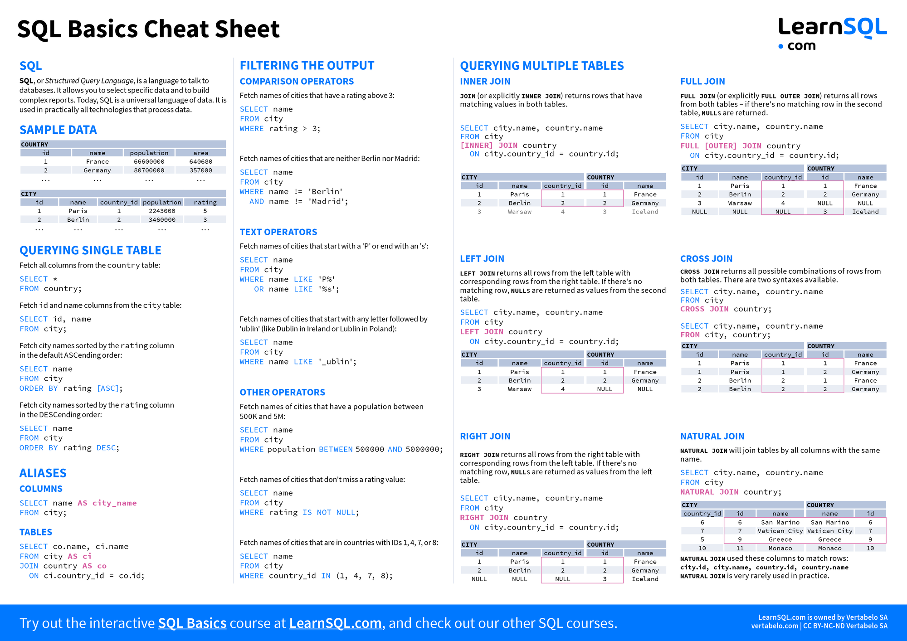
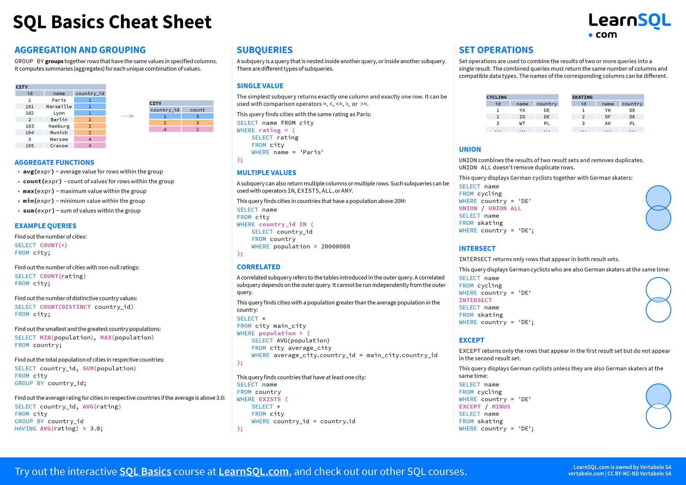
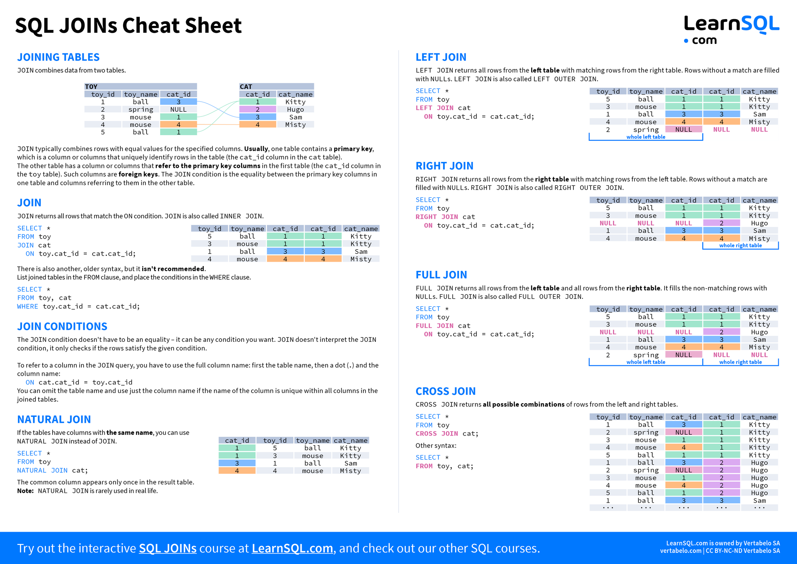
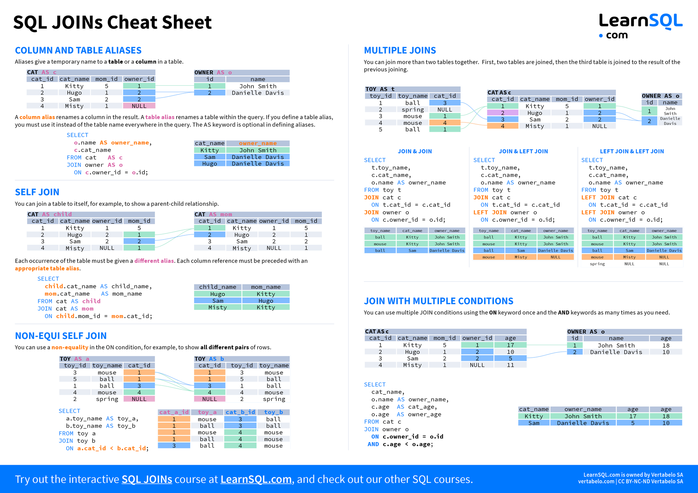
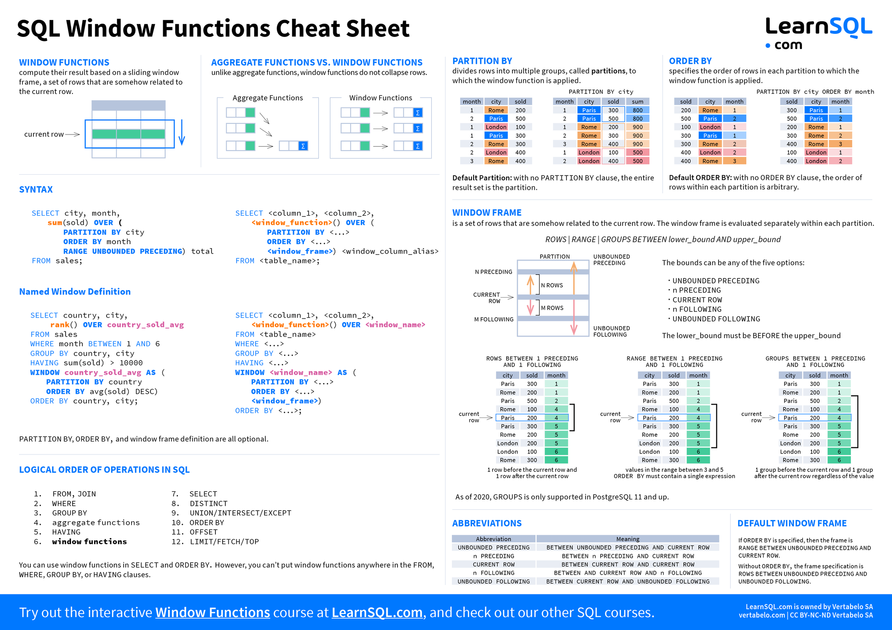
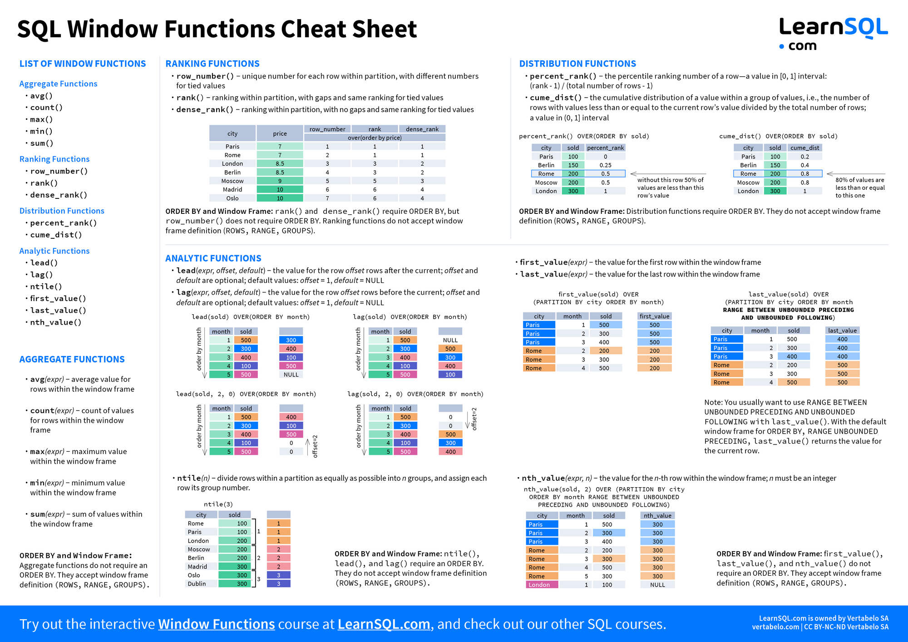

# MySQL

---

社区&大牛博客

* https://imysql.com/
* https://imysql.com/my-cnf-wizard.html
* https://opensource.actionsky.com/
* http://mysqlhighavailability.com/
* https://www.mysqltutorial.org/
* https://planet.mysql.com/
* https://planet.mysql.com/zh/
* http://wubx.net/
* http://www.netkiller.cn/mysql/index.html
* https://www.cnblogs.com/gomysql/
* https://www.cnblogs.com/zhoujinyi/
* http://blog.itpub.net/29773961/
* https://www.fordba.com/

---

## 教程

* https://learnsql.com/cookbook/
* https://learnsql.com/blog/sql-basics-cheat-sheet/
* https://learnsql.com/blog/sql-join-cheat-sheet/
* https://learnsql.com/blog/sql-window-functions-cheat-sheet/
* [MySQL行转列&列转行](https://www.cnblogs.com/xiaoxi/p/7151433.html)
* https://imysql.com/
* https://imysql.com/2015/05/24/mysql-optimization-reference-1.shtml
* https://imysql.com/2015/05/29/mysql-optimization-reference-2.shtml
* [MySQL binlog 分析工具 analysis_binlog 的使用介绍](https://opensource.actionsky.com/20210331-mysql/)
* [MySQL Load Data 的多种用法](https://opensource.actionsky.com/20210325-mysql/)
* [Redis 故障诊断及常用运维命令—内存篇](https://opensource.actionsky.com/20210415-redis/)
* [MySQL5.7 使用 mysqldump 重要避坑事项](https://opensource.actionsky.com/20201112-mysqldump/)
* [MySQL 优化案例 – select count(*)](https://opensource.actionsky.com/20200707-mysql/)