# 通过Nginx、Consul、Upsync实现动态负载均衡和服务平滑发布

> [原文链接](https://throwx.cn/2020/06/13/nginx-smooth-release)

前段时间顺利地把整个服务集群和中间件全部从`UCloud`迁移到阿里云，笔者担任了架构和半个运维的角色。这里详细记录一下通过`Nginx`、`Consul`、`Upsync`实现动态负载均衡和服务平滑发布的核心知识点和操作步骤，整个体系已经在生产环境中平稳运行。编写本文使用的虚拟机系统为`CentOS7.x`，虚拟机的内网`IP`为`192.168.56.200`。


## 动态负载均衡的基本原理

一般会通过`upstream`配置`Nginx`的反向代理池：

```shell
http {
    
    upstream upstream_server{
        server 127.0.0.1:8081;
        server 127.0.0.1:8082;
    }

    server {
        listen       80;
        server_name localhost;

        location / {
            proxy_pass http://upstream_server;
        }
    }
}
```

现在假如`8081`端口的服务实例挂了需要剔除，那么需要修改`upstream`为：

```shell
upstream upstream_server{
    # 添加down标记该端口的服务实例不参与负载
    server 127.0.0.1:8081 down;
    server 127.0.0.1:8082;
}
```

并且通过`nginx -s reload`重新加载配置，该`upstream`配置才会生效。我们知道，服务发布时候重启过程中是处于不可用状态，正确的服务发布过程应该是：

- 把该服务从对应的`upstream`剔除，一般是置为`down`，告知`Nginx`服务`upstream`配置变更，需要通过`nginx -s reload`进行重载。
- 服务构建、部署和重启。
- 通过探活脚本感知服务对应的端口能够访问，把该服务从对应的`upstream`中拉起，一般是把`down`去掉，告知`Nginx`服务`upstream`配置变更，需要通过`nginx -s reload`进行重载。

上面的步骤一则涉及到`upstream`配置，二则需要`Nginx`重新加载配置（`nginx -s reload`），显得比较笨重，在高负载的情况下重新启动`Nginx`并重新加载配置会进一步增加系统的负载并可能暂时降低性能。

所以，可以考虑使用分布式缓存把`upstream`配置存放在缓存服务中，然后`Nginx`直接从这个缓存服务中读取`upstream`的配置，这样如果有`upstream`的配置变更就可以直接修改缓存服务中对应的属性，而`Nginx`服务也不需要`reload`。在实战中，这里提到的缓存服务就选用了`Consul`，`Nginx`读取缓存中的配置属性选用了新浪微博提供的`Nginx`的`C`语言模块`nginx-upsync-module`。示意图大致如下：

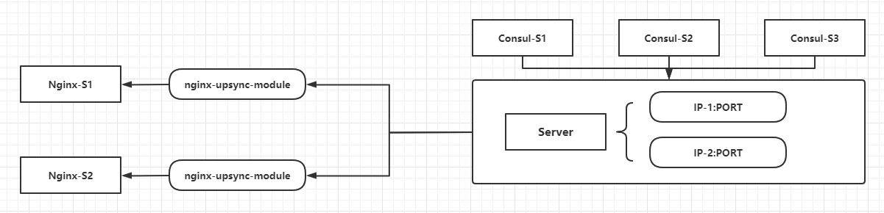

## Consul安装和集群搭建

`Consul`是`Hashicorp`公司的一个使用`Golang`开发的开源项目，它是一个用于服务发现和配置的工具，具备分布式和高度可用特性，并且具有极高的可伸缩性。`Consul`主要提供下面的功能：

- 服务发现。
- 运行状况检查。
- 服务分块/服务网格（`Service Segmentation/Service Mesh`）。
- 密钥/值存储。
- 多数据中心。

下面是安装过程：

```shell
mkdir /data/consul
cd /data/consul
wget https://releases.hashicorp.com/consul/1.7.3/consul_1.7.3_linux_amd64.zip
# 注意解压后只有一个consul执行文件
unzip consul_1.7.3_linux_amd64.zip
```

解压完成后，使用命令`nohup /data/consul/consul agent -server -data-dir=/tmp/consul -bootstrap -ui -advertise=192.168.56.200 -client=192.168.56.200 > /dev/null 2>&1 &`即可后台启动单机的`Consul`服务。启动`Consul`实例后，访问`http://192.168.56.200:8500/`即可打开其后台管理`UI`：

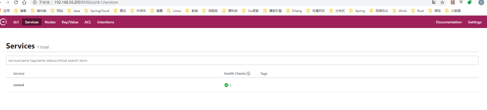

下面基于单台虚拟机搭建一个伪集群，**关于集群的一些配置属性的含义和命令参数的解释暂时不进行展开**。

```shell
# 创建集群数据目录
mkdir /data/consul/node1 /data/consul/node2 /data/consul/node3
# 创建集群日志目录
mkdir /data/consul/node1/logs /data/consul/node2/logs /data/consul/node3/logs
```

在`/data/consul/node1`目录添加`consul_conf.json`文件，内容如下：

```json
{
  "datacenter": "es8-dc",
  "data_dir": "/data/consul/node1",
  "log_file": "/data/consul/node1/consul.log",
  "log_level": "INFO",
  "server": true,
  "node_name": "node1",
  "ui": true,
  "bind_addr": "192.168.56.200",
  "client_addr": "192.168.56.200",
  "advertise_addr": "192.168.56.200",
  "bootstrap_expect": 3,
  "ports":{
    "http": 8510,
    "dns": 8610,
    "server": 8310,
    "serf_lan": 8311,
    "serf_wan": 8312
    }
}
```

在`/data/consul/node2`目录添加`consul_conf.json`文件，内容如下：

```json
{
  "datacenter": "es8-dc",
  "data_dir": "/data/consul/node2",
  "log_file": "/data/consul/node2/consul.log",
  "log_level": "INFO",
  "server": true,
  "node_name": "node2",
  "ui": true,
  "bind_addr": "192.168.56.200",
  "client_addr": "192.168.56.200",
  "advertise_addr": "192.168.56.200",
  "bootstrap_expect": 3,
  "ports":{
    "http": 8520,
    "dns": 8620,
    "server": 8320,
    "serf_lan": 8321,
    "serf_wan": 8322
    }
}
```

在`/data/consul/node3`目录添加`consul_conf.json`文件，内容如下：

```json
{
  "datacenter": "es8-dc",
  "data_dir": "/data/consul/node3",
  "log_file": "/data/consul/node3/consul.log",
  "log_level": "INFO",
  "server": true,
  "node_name": "node3",
  "ui": true,
  "bind_addr": "192.168.56.200",
  "client_addr": "192.168.56.200",
  "advertise_addr": "192.168.56.200",
  "bootstrap_expect": 3,
  "ports":{
    "http": 8530,
    "dns": 8630,
    "server": 8330,
    "serf_lan": 8331,
    "serf_wan": 8332
    }
}
```

新建一个集群启动脚本：

```shell
cd /data/consul
touch service.sh
# /data/consul/service.sh内容如下：
nohup /data/consul/consul agent -config-file=/data/consul/node1/consul_conf.json > /dev/null 2>&1 &
sleep 10
nohup /data/consul/consul agent -config-file=/data/consul/node2/consul_conf.json -retry-join=192.168.56.200:8311 > /dev/null 2>&1 &
sleep 10
nohup /data/consul/consul agent -config-file=/data/consul/node3/consul_conf.json -retry-join=192.168.56.200:8311 > /dev/null 2>&1 &
```

如果集群启动成功，观察节点1中的日志如下：

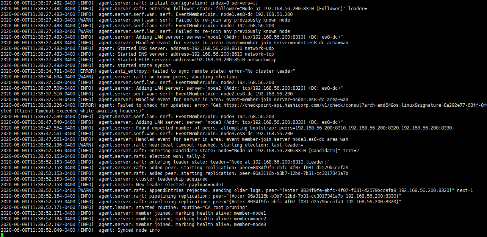

通过节点1的`HTTP`端点访问后台管理页面如下（可见当前的节点1被标记了一颗红色的星星，说明当前节点1是`Leader`节点）：

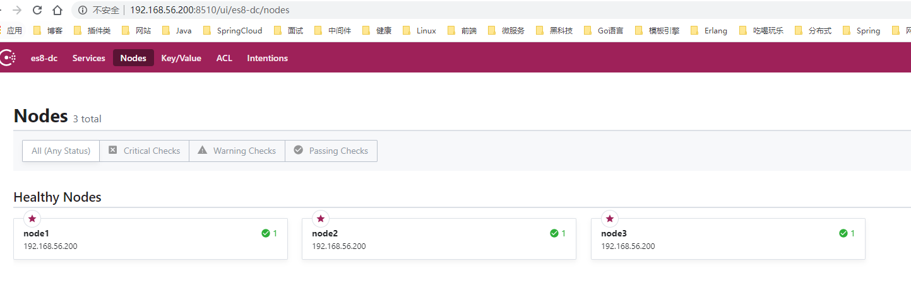

至此，`Consul`单机伪集群搭建完成（其实分布式集群的搭建大同小异，注意集群节点所在的机器需要开放使用到的端口的访问权限），由于`Consul`使用`Raft`作为共识算法，该算法是**强领导者模型，也就是只有`Leader`节点可以进行写操作**，因此接下来的操作都需要使用节点1的`HTTP`端点，就是`192.168.56.200:8510`。

> 重点笔记：如果`Consul`集群重启或者重新选举，`Leader`节点有可能发生更变，外部使用的时候建议把`Leader`节点的`HTTP`端点抽离到可动态更新的配置项中或者动态获取`Leader`节点的`IP`和端口。

## Nginx编译安装

直接从官网下载二进制的安装包并且解压：

```shell
mkdir /data/nginx
cd /data/nginx
wget http://nginx.org/download/nginx-1.18.0.tar.gz
tar -zxvf nginx-1.18.0.tar.gz
```

解压后的所有源文件在`/data/nginx/nginx-1.18.0`目录下，编译之前需要安装`pcre-devel`、`zlib-devel`依赖：

```shell
yum -y install pcre-devel
yum install -y zlib-devel
```

编译命令如下：

```shell
cd /data/nginx/nginx-1.18.0
./configure --prefix=/data/nginx
```

如果`./configure`执行过程不出现问题，那么结果如下：

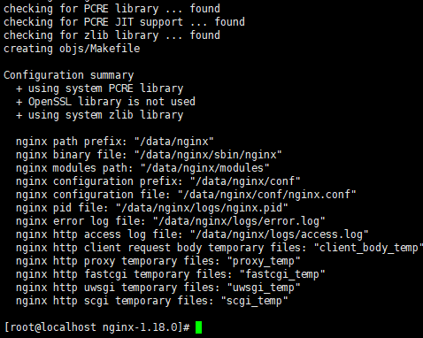

接着执行`make`：

```shell
cd /data/nginx/nginx-1.18.0
make
```

如果`make`执行过程不出现问题，那么结果如下：

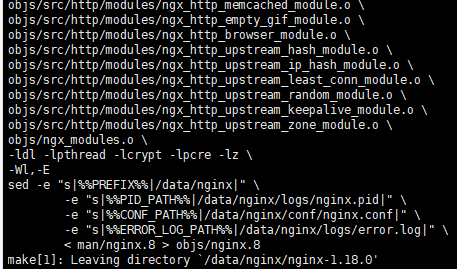

最后，如果是首次安装，可以执行`make install`进行安装（实际上只是拷贝编译好的文件到`--prefix`指定的路径下）：

```shell
cd /data/nginx/nginx-1.18.0
make install
```

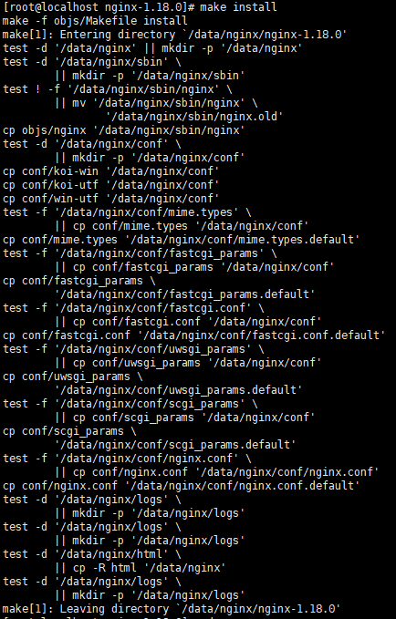

`make install`执行完毕后，`/data/nginx`目录下新增了数个文件夹：

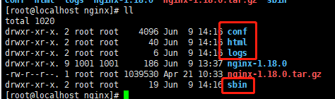

其中，`Nginx`启动程序在`sbin`目录下，`logs`是其日志目录，`conf`是其配置文件所在的目录。尝试启动一下`Nginx`：

```shell
/data/nginx/sbin/nginx
```

然后访问虚拟机的`80`端口，从而验证`Nginx`已经正常启动：


### 通过nginx-upsync-module和nginx_upstream_check_module模块进行编译

上面做了一个`Nginx`极简的编译过程，实际上，在做动态负载均衡的时候需要添加`nginx-upsync-module`和`nginx_upstream_check_module`两个模块，两个模块必须提前下载源码，并且在编译`Nginx`过程中需要指定两个模块的物理路径：

```shell
mkdir /data/nginx/modules
cd /data/nginx/modules
# 这里是Github的资源，不能用wget下载，具体是：
nginx-upsync-module需要下载release里面的最新版本：v2.1.2
nginx_upstream_check_module需要下载整个项目的源码，主要用到靠近当前版本的补丁，使用patch命令进行补丁升级
```

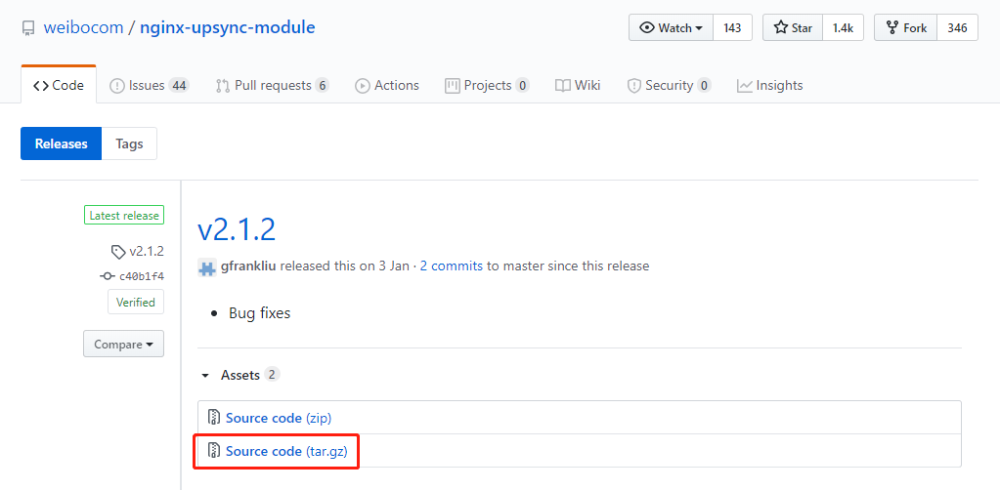


下载完成后分别（解压）放在`/data/nginx/modules`目录下：

```shell
ll /data/nginx/modules
drwxr-xr-x. 6 root root   4096 Nov  3  2019 nginx_upstream_check_module-master
drwxrwxr-x. 5 root root     93 Dec 18 00:56 nginx-upsync-module-2.1.2
```

编译前，还要先安装一些前置依赖组件：

```shell
yum -y install libpcre3 libpcre3-dev ruby zlib1g-dev patch
```

接下来开始编译安装`Nginx`：

```shell
cd /data/nginx/nginx-1.18.0
patch -p1 < /data/nginx/modules/nginx_upstream_check_module-master/check_1.16.1+.patch
./configure --prefix=/data/nginx --add-module=/data/nginx/modules/nginx_upstream_check_module-master --add-module=/data/nginx/modules/nginx-upsync-module-2.1.2
make
make install
```

上面的编译和安装过程无论怎么调整，都会出现部分依赖缺失导致`make`异常，估计是这两个模块并不支持太高版本的`Nginx`。（生产上用了一个版本比较低的`OpenResty`，这里想复原一下使用相对新版本`Nginx`的踩坑过程）于是尝试降级进行编译，下面是参考多个`Issue`后得到的相对比较新的可用版本组合：

- [nginx-1.14.2.tar.gz](http://nginx.org/download/nginx-1.14.2.tar.gz)
- [xiaokai-wang/nginx_upstream_check_module](https://github.com/xiaokai-wang/nginx_upstream_check_module)，使用补丁`check_1.12.1+.patch`
- [nginx-upsync-module:release:v2.1.2](https://github.com/weibocom/nginx-upsync-module/releases/tag/v2.1.2)

```shell
# 提前把/data/nginx下除了之前下载过的modules目录外的所有文件删除
cd /data/nginx
wget http://nginx.org/download/nginx-1.14.2.tar.gz
tar -zxvf nginx-1.14.2.tar.gz
```

开始编译安装：

```shell
cd /data/nginx/nginx-1.14.2
patch -p1 < /data/nginx/modules/nginx_upstream_check_module-master/check_1.12.1+.patch
./configure --prefix=/data/nginx --add-module=/data/nginx/modules/nginx_upstream_check_module-master --add-module=/data/nginx/modules/nginx-upsync-module-2.1.2
make && make install
```

安装完成后通过`/data/nginx/sbin/nginx`命令启动即可。

### 启用动态负载均和健康检查

首先编写一个简易的`HTTP`服务，因为`Java`比较重量级，这里选用`Golang`，代码如下：

```go
package main

import (
	"flag"
	"fmt"
	"net/http"
)

func main() {
    var host string
    var port int
    flag.StringVar(&host, "h", "127.0.0.1", "IP地址")
    flag.IntVar(&port, "p", 9000, "端口")
    flag.Parse()
    address := fmt.Sprintf("%s:%d", host, port)
    http.HandleFunc("/ping", func(writer http.ResponseWriter, request *http.Request) {
        _, _ = fmt.Fprintln(writer, fmt.Sprintf("%s by %s", "pong", address))
    })
    http.HandleFunc("/", func(writer http.ResponseWriter, request *http.Request) {
        _, _ = fmt.Fprintln(writer, fmt.Sprintf("%s by %s", "hello world", address))
    })
    err := http.ListenAndServe(address, nil)
    if nil != err {
        panic(err)
    }
}
```

编译：

```shell
cd src
set GOARCH=amd64
set GOOS=linux
go build -o ../bin/app app.go
```

这样子在项目的`bin`目录下就得到一个`Linux`下可执行的二进制文件`app`，分别在端口`9000`和`9001`启动两个服务实例：

```shell
# 记得先给app文件的执行权限chmod 773 app
nohup ./app -p 9000 >/dev/null 2>&1 &
nohup ./app -p 9001 >/dev/null 2>&1 &
```

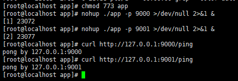

修改一下`Nginx`的配置，添加`upstream`：

```shell
# /data/nginx/conf/nginx.conf部分片段
http {
    include       mime.types;
    default_type  application/octet-stream;
    sendfile        on;
    keepalive_timeout  65;

    upstream app {
       # 这里是consul的leader节点的HTTP端点
       upsync 192.168.56.200:8510/v1/kv/upstreams/app/ 
       upsync_timeout=6m 
       upsync_interval=500ms        
       upsync_type=consul 
       strong_dependency=off;
       # consul访问不了的时候的备用配置
       upsync_dump_path /data/nginx/app.conf;
       # 这里是为了兼容Nginx的语法检查
       include /data/nginx/app.conf;
       # 下面三个配置是健康检查的配置
       check interval=1000 rise=2 fall=2 timeout=3000 type=http default_down=false;
       check_http_send "HEAD / HTTP/1.0\r\n\r\n";
       check_http_expect_alive http_2xx http_3xx;
    }

    server {
        listen       80;
        server_name  localhost;
        location / {
            proxy_pass http://app;
        }
        # 健康检查 - 查看负载均衡的列表
        location /upstream_list {
            upstream_show;
        }
        # 健康检查 - 查看负载均衡的状态
        location /upstream_status {
            check_status;
            access_log off;
        }
    }
}

# /data/nginx/app.conf
server 127.0.0.1:9000 weight=1 fail_timeout=10 max_fails=3;
server 127.0.0.1:9001 weight=1 fail_timeout=10 max_fails=3;
```

手动添加两个`HTTP`服务进去`Consul`中：

```shell
curl -X PUT -d '{"weight":1, "max_fails":2, "fail_timeout":10}' http://192.168.56.200:8510/v1/kv/upstreams/app/127.0.0.1:9000
curl -X PUT -d '{"weight":1, "max_fails":2, "fail_timeout":10}' http://192.168.56.200:8510/v1/kv/upstreams/app/127.0.0.1:9001
```

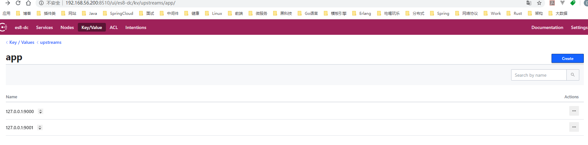

最后重新加载`Nginx`的配置即可。

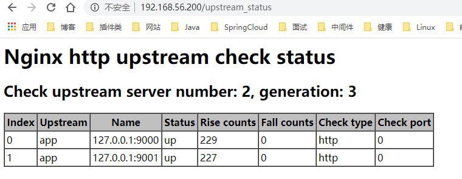

## 动态负载均衡测试

前置工作准备好，现在尝试动态负载均衡，先从`Consul`下线`9000`端口的服务实例：

```shell
curl -X PUT -d '{"weight":1, "max_fails":2, "fail_timeout":10, "down":1}' http://192.168.56.200:8510/v1/kv/upstreams/app/127.0.0.1:9000
```

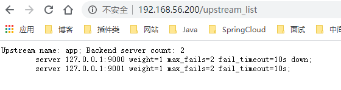

可见负载均衡的列表中，`9000`端口的服务实例已经置为`down`，此时疯狂请求`http://192.168.56.200`，只输出`hello world by 127.0.0.1:9001`，可见`9000`端口的服务实例已经不再参与负载。重新上线`9000`端口的服务实例：

```shell
curl -X PUT -d '{"weight":1, "max_fails":2, "fail_timeout":10, "down":0}' http://192.168.56.200:8510/v1/kv/upstreams/app/127.0.0.1:9000
```

再疯狂请求`http://192.168.56.200`，发现`hello world by 127.0.0.1:9000`和`hello world by 127.0.0.1:9001`交替输出。到此可以验证动态负载均衡是成功的。此时再测试一下服务健康监测，通过`kill -9`随机杀掉其中一个服务实例，然后观察`/upstream_status`端点：

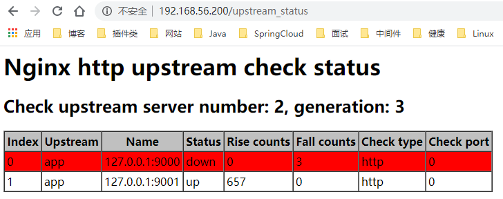

疯狂请求`http://192.168.56.200`，只输出`hello world by 127.0.0.1:9001`，可见`9000`端口的服务实例已经不再参与负载，但是查看`Consul`中`9000`端口的服务实例的配置，并没有标记为`down`，可见是`nginx_upstream_check_module`为我们过滤了异常的节点，让这些节点不再参与负载。

总的来说，这个相对完善的动态负载均衡功能需要`nginx_upstream_check_module`和`nginx-upsync-module`共同协作才能完成。

## 服务平滑发布

服务平滑发布依赖于前面花大量时间分析的动态负载均衡功能。笔者所在的团队比较小，所以选用了阿里云的云效作为产研管理平台，通过里面的流水线功能实现了服务平滑发布，下面是其中一个服务的生产环境部署的流水线：


其实平滑发布和平台的关系不大，整体的步骤大概如下：

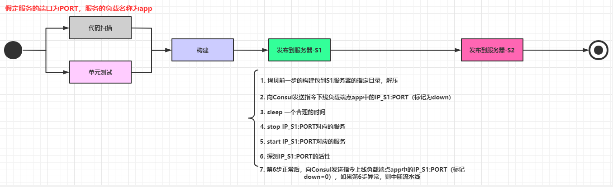

步骤比较多，并且涉及到大量的`shell`脚本，这里不把详细的脚本内容列出，简单列出一下每一步的操作（注意某些步骤之间可以插入合理的`sleep n`保证前一步执行完毕）：

- 代码扫描、单元测试等等。
- 代码构建，生成构建后的压缩包。
- 压缩包上传到服务器`X`中，解压到对应的目录。
- 向`Consul`发送指令，把当前发布的`X_IP:PORT`的负载配置更新为`down=1`。
- `stop`服务`X_IP:PORT`。
- `start`服务`X_IP:PORT`。
- 检查服务`X_IP:PORT`的健康状态（可以设定一个时间周期例如120秒内每10秒检查一次），如果启动失败，则直接中断返回，确保还有另一个正常的旧节点参与负载，并且人工介入处理。
- 向`Consul`发送指令，把当前发布的`X_IP:PORT`的负载配置更新为`down=0`。

上面的流程是通过`hard code`完成，对于不同的服务器，只需要添加一个发布流程节点并且改动一个`IP`的占位符即可，不需要对`Nginx`进行配置重新加载。笔者所在的平台流量不大，目前每个服务部署两个节点就能满足生产需要，试想一下，如果要实现动态扩容，应该怎么构建流水线？

## 小结

服务平滑发布是`CI/CD`中比较重要的一个环节，而动态负载均衡则是服务平滑发布的基础。虽然现在很多云平台都提供了十分便捷的持续集成工具，但是在使用这些工具和配置流程的时候，最好能够理解背后的基本原理，这样才能在工具不适用的时候或者出现问题的时时候，迅速地作出判断和响应。

参考资料：

- [nginx-upsync-module](https://github.com/weibocom/nginx-upsync-module)
- [Nginx docs](https://nginx.org/en/docs)
- [Consul docs](https://www.consul.io/docs)
