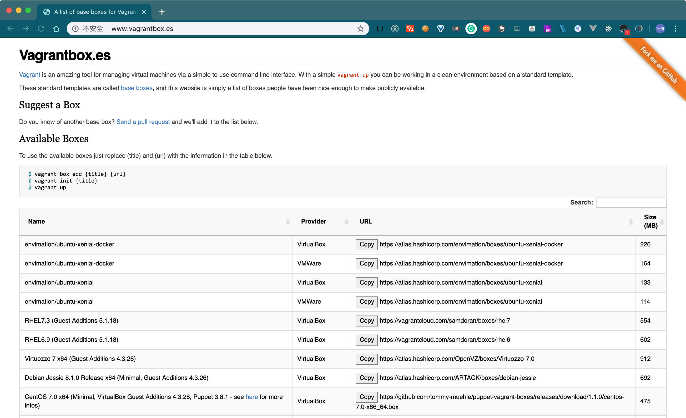
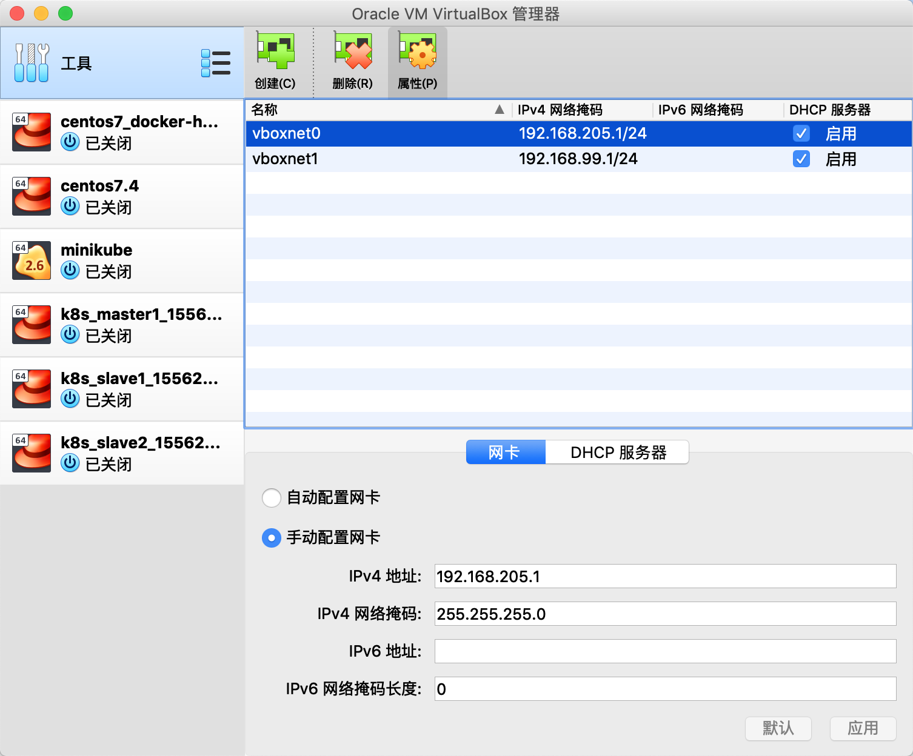

# Mac 下使用 Vagrant 快速搭建 Centos/7 虚拟机

## 1. 什么是 Vagrant

### 1.1. Vagrant 简介

什么是 Vagrant，要回答这个问题，最好的答案应该来自官网(https://www.vagrantup.com/intro/index.html)

> Vagrant is a tool for building and managing virtual machine environments in a single workflow. With an easy-to-use workflow and focus on automation, Vagrant lowers development environment setup time, increases production parity, and makes the "works on my machine" excuse a relic of the past.

翻译：Vagrant 是一个在单个工作流中实现构建和管理虚拟机环境的工具。通过一种简单易用的工作流并专注于自动化，Vagrant 减少了开发环境的配置时间，提高了生产效率，也正因为 Vagrant 的存在，使得『这个在我的电脑可以运行』这种借口成为过去。

官网的简介，我们简单的总结一下：`Vagrant 是一个可以快速构建并管理虚拟机的工具`。

### 1.2. Vagrant 优势

1. 配置简单，避免相同环境重复配置，仅需共享一个 `Vagrantfile` 即可快速搭建一个相同配置的虚拟机。
2. 一处配置，多端运行，不受系统环境影响，`Linux / Mac OS X / Windows` 启用命令一致。
3. 安装简单，卸载干净。安装虚拟机，只会在当前 `Vagrantfile` 目录生成少数的缓存文件，卸载时可以卸载的干干净净，丝毫不污染宿主机环境。
4. 支持多种 `provider`，便于用户自行选择 provider 去挂载虚拟机，包括：`VirtualBox`，`VMware`，`AWS`，`Docker` 等。

---

## 2. 安装 Vagrant

### 2.1. 环境准备

安装 provider，主要用于挂载虚拟机。本文将采用开源免费的 `VirtualBox` 作为 Vagrant 的 provider 来挂载我们的虚拟机。`VirtualBox` 是一款开源免费的虚拟机软件，相比 `VMware` 体系的软件来说，更加 ~~小巧~~（主要是 **免费**）。

> 下载地址：https://www.virtualbox.org/wiki/Downloads

笔者使用的 `VirtualBox` 版本是 **6.0.6** 。

安装方式是傻瓜式安装，只需要选择好对应系统的版本，下一步操作即可。

### 2.2. 安装 Vagrant

主角登场，接下来我们来安装 `Vagrant`。

> 下载地址：https://www.vagrantup.com/downloads.html

笔者使用的 `Vagrant` 版本是 **2.2.4** 。

安装方式和 VirtualBox 一样，同样是傻瓜式安装，只需要选择好对应系统的版本，下一步操作即可。

安装完成之后，前往 Terminal 执行命令验证是否安装成功：

```bash
$ vagrant version
Installed Version: 2.2.4
Latest Version: 2.2.4

You're running an up-to-date version of Vagrant!
```

---

## 3. Vagrant 命令

```bash
vagrant init <名称>   # 初始化box的操作
vagrant box add <虚拟机名> <box文件名>   # 添加box的操作
vagrant up   # 启动虚拟机的操作
vagrant ssh <hostname>   # 登录拟机的操作，也可以指定hostname登陆
vagrant box list   # 显示当前已经添加的box列表
vagrant box remove 名称   # 删除相应的box  
vagrant destroy   # 停止当前正在运行的虚拟机并销毁所有创建的资源
vagrant halt   # 关机
vagrant status <hostname>   # 获取当前虚拟机的状态，也可以查看指定hostname
vagrant suspend   # 挂起当前的虚拟机
vagrant resume   # 恢复前面被挂起的状态
vagrant reload   # 重新启动虚拟机，主要用于重新载入配置文件
vagrant global-status   # 查看所有虚拟机的ID号
vagrant plugin   # 用于安装卸载插件
vagrant ssh-config   # 输出用于ssh连接的一些信息
vagrant package   # 打包命令，可以把当前的运行的虚拟机环境进行打包
vagrant ssh-config   # 查看ssh登录信息，可以把这些信息 保存到.ssh文件下config中，先用vagrant ssh 登录，然后把宿主机的ssh公钥保存到虚拟机的authorized_keys文件里，然后在宿主机ssh <名称>就可以免密码登录
```

---

## 4. Vagrant 实战

> 本小节我们完成一个实战，使用 Vagrant 安装 centos7。

### 4.1. 寻找box

box 就是我们系统的初始化镜像，我们可以在 http://www.vagrantbox.es/ 找到我们需要的系统镜像

> 建议大家去给这个仓库点个 Star，方便好用的东西永远值得表扬! 附上仓库链接：https://github.com/garethr/vagrantboxes-heroku 。



理论上这里能搜到的 box，都可以在下面的初始化中直接使用 `init` 命令直接初始化。（但是国内的网络会导致经常失败。）

因此我们可以拷贝上面的 box 链接，先单独下载，再进行安装。

假设我们的 box 下载地址为：`/Users/yangkai.shen/Downloads/vagrant-images/CentOS-7-x86_64-Vagrant-1803_01.VirtualBox.box`

打开 Terminal，输入如下命令：

```shell
$ vagrant box add centos/7 /Users/yangkai.shen/Downloads/vagrant-images/CentOS-7-x86_64-Vagrant-1803_01.VirtualBox.box
==> box: Box file was not detected as metadata. Adding it directly...
==> box: Adding box 'centos/7' (v0) for provider:
    box: Unpacking necessary files from: file:///Users/yangkai.shen/Downloads/vagrant-images/CentOS-7-x86_64-Vagrant-1803_01.VirtualBox.box
==> box: Successfully added box 'centos/7' (v0) for 'virtualbox'!
```

这样，我们就可以使用我们添加的 box 进行初始化了。

### 4.2. 初始化

我们创建一个目录 `centos7`，然后在 Terminal 中进入该目录，然后执行初始化命令。

```shell
$ vagrant init centos/7
A `Vagrantfile` has been placed in this directory. You are now
ready to `vagrant up` your first virtual environment! Please read
the comments in the Vagrantfile as well as documentation on
`vagrantup.com` for more information on using Vagrant.
```

此时会发现 `centos7` 目录下已经创建了一个 `Vagrantfile`，里面已经包含了默认的配置。

### 4.3. 安装 / 启动

在 Terminal 中输入如下命令，即可进行自动安装虚拟机：

```shell
$ vagrant up
```

等待几分钟，即可安装成功。

### 4.4. 登录

在 Terminal 中执行如下命令：

```shell
$ vagrant ssh
```

就会登录到虚拟机的 bash 中，非常方便。

> 这里需要注意，windows用户直接使用cmd命令不能使用ssh，建议使用 git-bash.exe 进行操作

---

## 5. Vagrant 高阶操作

### 5.1. 共享宿主机文件夹

实现共享文件夹，首先我们必须先安装一个 Vagrant 插件：`vagrant-vbguest`，打开 Terminal 输入以下命令安装：

```shell
$ vagrant plugin install vagrant-vbguest
Installing the 'vagrant-vbguest' plugin. This can take a few minutes...
Fetching: micromachine-2.0.0.gem (100%)
Fetching: vagrant-vbguest-0.17.2.gem (100%)
Installed the plugin 'vagrant-vbguest (0.17.2)'!
```

安装成功后，我们只需要在 `Vagrantfile` 中配置共享文件夹，参考如下：

```ruby
# 第一个参数是宿主机文件夹地址
# 第二个参数是虚拟机中映射过去的虚拟文件夹地址
config.vm.synced_folder "../data", "/vagrant_data"
```

### 5.2. 网络代理配置

这里我们总共有 3 个步骤实现网络代理：

#### 5.2.1. 安装插件

实现网络代理，首先我们必须先安装一个 Vagrant 插件：`vagrant-proxyconf`，打开 Terminal 输入以下命令安装：

```shell
$ vagrant plugin install vagrant-proxyconf
Installing the 'vagrant-proxyconf' plugin. This can take a few minutes...
Fetching: vagrant-proxyconf-2.0.1.gem (100%)
Installed the plugin 'vagrant-proxyconf (2.0.1)'!
```

#### 5.2.2. 配置宿主机固定 IP

注意：这里我们是对 VirtualBox 全局设置，前往不要仅对某一台虚拟机设置了，这样的好处是所有的虚拟机都会绑定上我们配置的网卡信息。

安装成功后，我们还需要拿到宿主机的一个固定 IP，显然这个 IP 需要在我们切换网络环境的时候，仍然保证固定不变。此时我们可以通过 `VirtualBox` 自带的一个小技巧实现~

打开 VirtualBox，找到左上角 『工具』右侧的小图标，点击该图标，选择『网络』，可以看到如下界面：



可以看到网卡列表里存在网卡信息，如果不存在，可以自己手动创建。这里网卡信息里的必须选择『手动配置网卡』。我们可以从虚拟机中访问宿主机的固定IP就是这里的IPv4地址。

#### 5.2.3. 配置 `Vagrantfile`

最后，我们需要在 `Vagrantfile` 中配置代理，参考如下：

```ruby
 if Vagrant.has_plugin?("vagrant-proxyconf")
   config.proxy.http     = "http://192.168.205.1:1087/"
   config.proxy.https    = "http://192.168.205.1:1087/"
   config.proxy.no_proxy = "localhost,127.0.0.1"
 end
```

这样启动虚拟机之后，我们的网络请求都会通过我们宿主机的 1087 端口代理出去。

### 5.3. 安装后系统环境配置

Vagrant 可以在虚拟机安装之后，使用 shell 命令对系统环境做一些初始化配置，我们可以在 `Vagrantfile` 中配置。

Vagrant 支持 2 种方式执行 shell，第一种方式是直接在 Vagrantfile 中写 shell 命令，如下：

```ruby
config.vm.provision "shell", privileged: true, inline: <<-SHELL
	apt-get update
	apt-get install -y apache2
SHELL
```

第二种方式，支持引用外部 shell 脚本，如下：

```ruby
config.vm.provision "shell", privileged: true, path: "./setup.sh"
```

### 5.4. 如何配置聚群化环境

####	5.4.1. 设置硬件参数

设置虚拟机内存大小和CPU核数，在 `Vagrantfile` 中配置如下信息即可：

```ruby
 config.vm.provider "virtualbox" do |v|
   v.customize ["modifyvm", :id, "--memory", "1024"]
   v.customize ["modifyvm", :id, "--cpus", "1"]
 end
```

####	5.4.2. 设置hostname

在 `Vagrantfile` 中配置如下信息即可：

```ruby
config.vm.hostname = "master1"
```

####	5.4.3. 设置静态IP

在 `Vagrantfile` 中配置如下信息即可：

```ruby
config.vm.network "private_network", ip: "192.168.205.10"
```

### 5.5. 可用插件

从上面的 *`共享宿主机文件夹`*、*`网络代理`* 等高阶操作，我们可以发现，Vagrant 拥有丰富的插件可以帮助我们完成很多个性化需求，对于这些插件，官方提供了一个地址，专门整理了大量的 Vagrant 插件。

> 插件列表地址：https://github.com/hashicorp/vagrant/wiki/Available-Vagrant-Plugins

---

## 6. Vagrantfile 案例

> 本小节，我们展示一个 `Vagrantfile` 启动 3 台虚拟机节点，设置好硬件信息、安装docker、并设置开机启动，同时开启代理配置。

**Vagrantfile**

```ruby
# -*- mode: ruby -*-
# vi: set ft=ruby :

# 设置虚拟机配置，包括hostname，ip，内存，CPU等
boxes = [
    {
        :name => "master1",
        :eth1 => "192.168.205.10",
        :mem => "1024",
        :cpu => "1"
    },
    {
        :name => "slave1",
        :eth1 => "192.168.205.11",
        :mem => "1024",
        :cpu => "1"
    },
    {
        :name => "slave2",
        :eth1 => "192.168.205.12",
        :mem => "1024",
        :cpu => "1"
    }
]

Vagrant.configure("2") do |config|
  # box名称
  config.vm.box = "centos/7"

  # 循环设置每台虚拟机
  boxes.each do |opts|
    config.vm.define opts[:name] do |config|
      # 配置 hostname
      config.vm.hostname = opts[:name]

      # 配置内存和CPU
      config.vm.provider "virtualbox" do |v|
        v.customize ["modifyvm", :id, "--memory", opts[:mem]]
        v.customize ["modifyvm", :id, "--cpus", opts[:cpu]]
      end

      # 配置 IP
      config.vm.network :private_network, ip: opts[:eth1]
      
      # 设置网络代理(需要安装 vagrant-proxyconf 插件)
      if Vagrant.has_plugin?("vagrant-proxyconf")
        config.proxy.http     = "http://192.168.205.1:1087/"
        config.proxy.https    = "http://192.168.205.1:1087/"
        config.proxy.no_proxy = "localhost,127.0.0.1"
      end

      # 设置启动后初始化脚本，注意 privileged: true，表示以 sudo 方式运行
      config.vm.provision "shell", privileged: true, path: "./setup.sh"
      
      # 设置宿主机共享文件夹(需要安装 vagrant-vbguest 插件)
      # config.vm.synced_folder "../data", "/vagrant_data"
    end
  end

end
```

**setup.sh**

```bash
#/bin/sh

# set timezone
echo "set timezone"
timedatectl set-timezone Asia/Shanghai

echo "vagrant ALL=(ALL) NOPASSWD: ALL" >> /etc/sudoers

# change yum repo
echo "change yum repo -> aliyun repo"
sudo yum install -y wget yum-utils
sudo cp /etc/yum.repos.d/CentOS-Base.repo /etc/yum.repos.d/CentOS-Base.repo.bak
sudo wget -O /etc/yum.repos.d/CentOS-Base.repo http://mirrors.aliyun.com/repo/Centos-7.repo
sudo wget -P /etc/yum.repos.d/ http://mirrors.aliyun.com/repo/epel-7.repo 
sudo yum clean all
sudo yum makecache

# install some tools
echo "install some tools"
sudo yum install -y yum-utils device-mapper-persistent-data lvm2 git vim gcc glibc-static telnet bridge-utils

# install docker
echo "install docker"
sudo yum-config-manager --add-repo http://mirrors.aliyun.com/docker-ce/linux/centos/docker-ce.repo
sudo yum makecache fast
sudo yum -y install docker-ce

# start docker service
echo "start docker service"
sudo groupadd docker
sudo usermod -aG docker vagrant
sudo systemctl enable docker
```

---

## 参考

- [Mac下使用Vagrant配置CentOS虚拟环境](http://kkprince.top/2018/05/09/Mac%E4%B8%8B%E4%BD%BF%E7%94%A8Vagrant%E9%85%8D%E7%BD%AECentOS%E8%99%9A%E6%8B%9F%E7%8E%AF%E5%A2%83/)
- [Vagrant 笔记](https://networm.me/2017/01/01/vagrant-note/)
- [使用vagrant和vitrualBox搭建虚拟开发环境](https://zhuyasen.com/post/vv_evn.html)
- [Vagrant搭建虚拟化开发环境](https://zhuanlan.zhihu.com/p/27793159)

