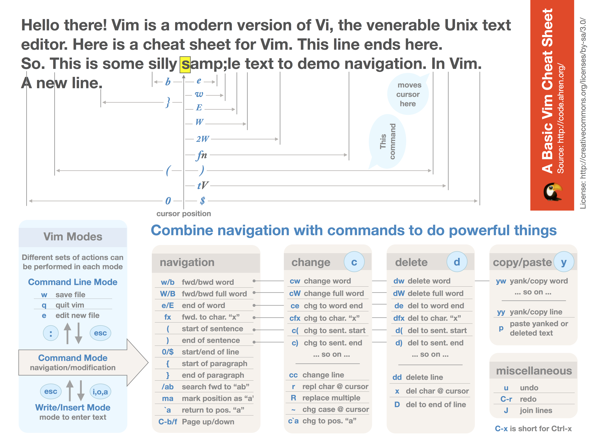
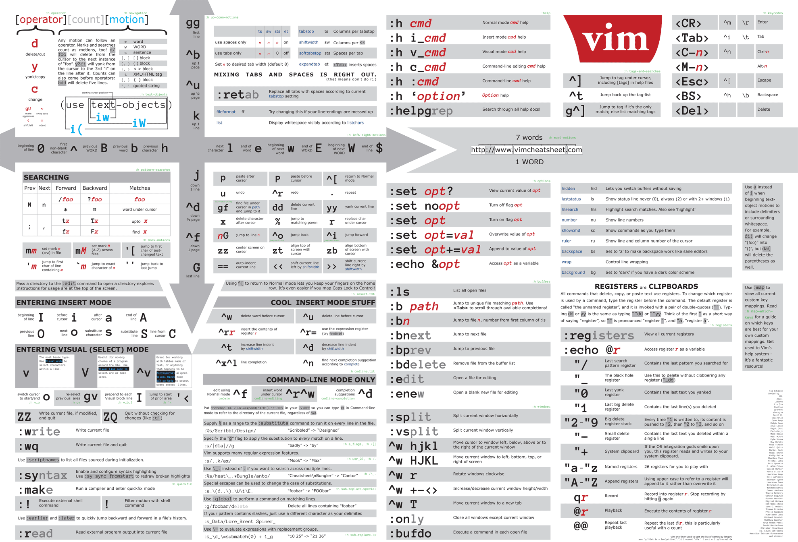
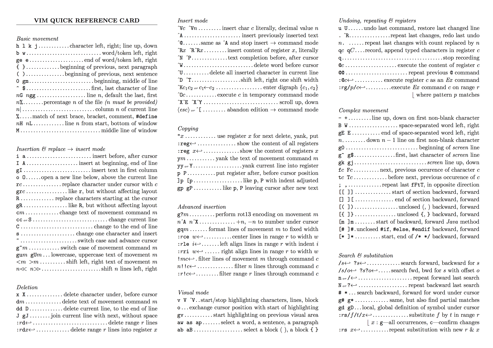
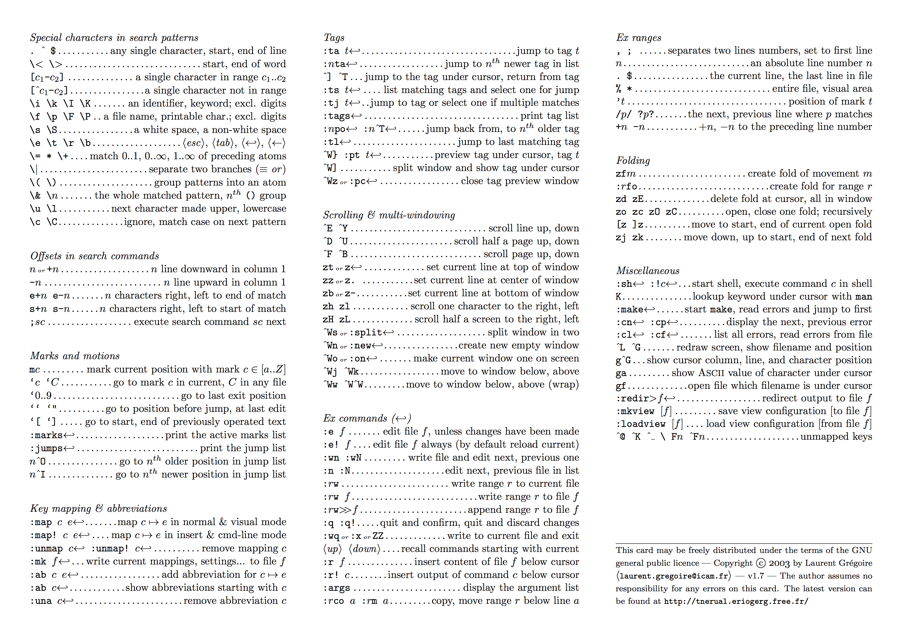

# 史上最全Vim快捷键键位图 -- 入门到进阶

> 文章欢迎转载，但转载时请保留本段文字，并置于文章的顶部 作者：卢钧轶(cenalulu) 本文原文地址：[http://cenalulu.github.io/linux/all-vim-cheatsheat/](http://cenalulu.github.io/linux/all-vim-cheatsheat/)

#### 申明

本文所有键位图虽然都不是博主原创，但是所有资源均为博主亲自收集整理。如需全文转载，希望尊重原作者和博主的劳动成果，保留原文链接。 本文所有图片为了方便读者使用均为原图，可以右击图片在新标签页打开后另存为或者打印。同时注明了原图链接，方便读者收藏。

* * *

## 经典版

下面这个键位图应该是大家最常看见的经典版了。其实这个版本是一系列的入门教程键位图的组合结果。要查看不同编辑模式下的键位图，可以看[这里打包下载](http://www.viemu.com/a_vi_vim_graphical_cheat_sheet_tutorial.html)此外，[这里](assets/vi-vim-cheat-sheet-sch.gif)还有简体中文版。

* * *

## 入门版

基本操作的入门版。[原版出处](https://github.com/ahrencode/Miscellaneous)还有keynote版本可供DIY以及其他相关有用的cheatsheet。

* * *

## 进阶版

下图是300DPI的超清大图，另外[查看原文](http://michael.peopleofhonoronly.com/vim/)还有更多版本：黑白，低分辨率，色盲等

* * *

## 增强版

下图是一个更新时间较新的现代版，含有的信息也更丰富。[原文链接](http://vimcheatsheet.com/)

* * *

## 文字版

[原文链接](http://tnerual.eriogerg.free.fr/vimqrc.pdf)
