# 0.学习目标

- 了解电商行业
- 了解乐优商城项目结构
- 能独立搭建项目基本框架
- 能参考使用ES6的新语法


# 1.了解电商行业

学习电商项目，自然要先了解这个行业，所以我们首先来聊聊电商行业


## 1.1.项目分类

主要从需求方、盈利模式、技术侧重点这三个方面来看它们的不同

### 1.1.1.传统项目

各种企业里面用的管理系统（ERP、HR、OA、CRM、物流管理系统。。。。。。。）

- 需求方：公司、企业内部
- 盈利模式：项目本身卖钱
- 技术侧重点：业务功能


### 1.1.2.互联网项目

门户网站、电商网站：baidu.com、qq.com、taobao.com、jd.com  ...... 

- 需求方：广大用户群体
- 盈利模式：虚拟币、增值服务、广告收益......
- 技术侧重点：网站性能、业务功能

而我们今天要聊的就是互联网项目中的重要角色：电商


## 1.2.电商行业的发展

### 1.2.1.钱景

近年来，中国的电子商务快速发展，交易额连创新高，电子商务在各领域的应用不断拓展和深化、相关服务业蓬勃发展、支撑体系不断健全完善、创新的动力和能力不断增强。电子商务正在与实体经济深度融合，进入规模性发展阶段，对经济社会生活的影响不断增大，正成为我国经济发展的新引擎。

中国电子商务研究中心数据显示，截止到 2012 年底，中国电子商务市场交易规模达 7.85万亿人民币，同比增长 30.83%。其中，B2B 电子商务交易额达 6.25 万亿，同比增长 27%。而 2011 年全年，中国电子商务市场交易额达 6 万亿人民币，同比增长 33%，占 GDP 比重上升到 13%；2012 年，电子商务占 GDP 的比重已经高达 15%。

 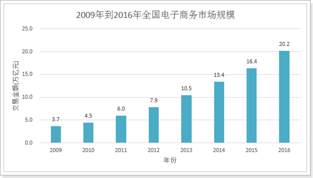


### 1.2.2.数据

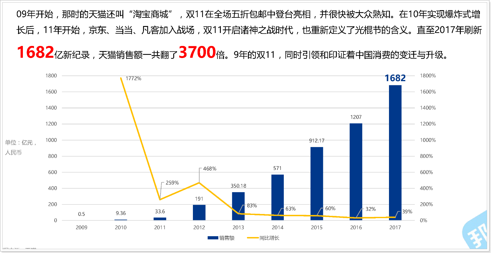

来看看双十一的成交数据：

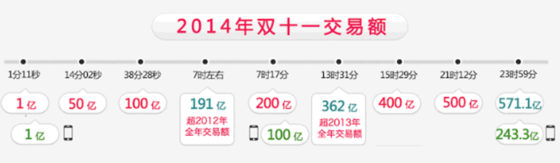


2016双11开场30分钟，创造**每秒交易峰值17.5万笔**，**每秒**支付峰值**12万笔**的新纪录。菜鸟单日物流订单量超过**4.67亿**，创历史新高。

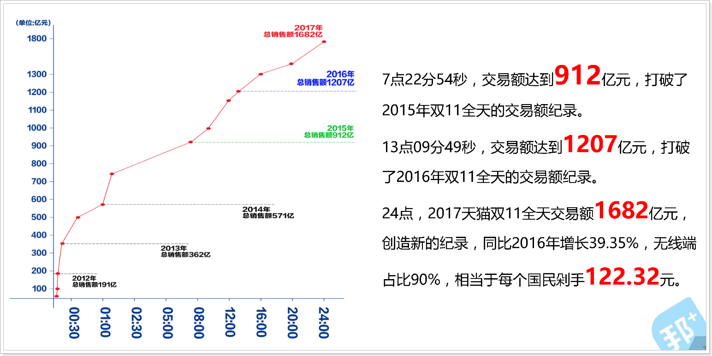


### 1.2.3.技术特点

从上面的数据我们不仅要看到钱，更要看到背后的技术实力。正是得益于电商行业的高强度并发压力，促使了BAT等巨头们的技术进步。电商行业有些什么特点呢？ 

- 技术范围广
- 技术新
- 高并发（分布式、静态化技术、缓存技术、异步并发、池化、队列）
- 高可用（集群、负载均衡、限流、降级、熔断）
- 数据量大 
- 业务复杂
- 数据安全


## 1.3.常见电商模式

电商行业的一些常见模式：

- B2C：商家对个人，如：亚马逊、当当等
- C2C平台：个人对个人，如：闲鱼、拍拍网、ebay
- B2B平台：商家对商家，如：阿里巴巴、八方资源网等
- O2O：线上和线下结合，如：饿了么、电影票、团购等
- P2P：在线金融，贷款，如：网贷之家、人人聚财等。
- B2C平台：天猫、京东、一号店等


## 1.4.一些专业术语

- SaaS：软件即服务

- SOA：面向服务

- RPC：远程过程调用

- RMI：远程方法调用

- PV：(page view)，即页面浏览量；

  用户每1次对网站中的每个网页访问均被记录1次。用户对同一页面的多次访问，访问量累计

- UV：(unique visitor)，独立访客

  指访问某个站点或点击某条新闻的不同IP地址的人数。在同一天内，uv只记录第一次进入网站的具有独立IP的访问者，在同一天内再次访问该网站则不计数。

- PV与带宽：

  - 计算带宽大小需要关注两个指标：峰值流量和页面的平均大小。
  - 计算公式是：网站带宽= ( PV * 平均页面大小（单位MB）* 8 )/统计时间（换算到秒）
  - 为什么要乘以8？
    - 网站大小为单位是字节(Byte)，而计算带宽的单位是bit，1Byte=8bit
  - 这个计算的是平均带宽，高峰期还需要扩大一定倍数

- PV、QPS、并发

  - QPS：每秒处理的请求数量。

    - 比如你的程序处理一个请求平均需要0.1S，那么1秒就可以处理10个请求。QPS自然就是10，多线程情况下，这个数字可能就会有所增加。

  - 由PV和QPS如何需要部署的服务器数量？

    - 根据二八原则，80%的请求集中在20%的时间来计算峰值压力：
    - （每日PV * 80%） / （3600s * 24 * 20%） * 每个页面的请求数  = 每个页面每秒的请求数量
    - 然后除以服务器的QPS值，即可计算得出需要部署的服务器数量


## 1.5.项目开发流程

项目经理：管人 

技术经理：

产品经理：设计需求原型 

测试：

前端：大前端：UI 前端页面。

后端：

移动端：

项目开发流程图：

 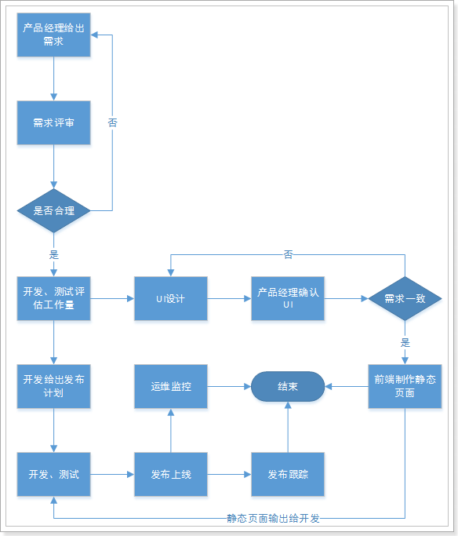


公司现状：

 


# 2.乐优商城介绍

## 2.1.项目介绍

- 乐优商城是一个全品类的电商购物网站（B2C）。
- 用户可以在线购买商品、加入购物车、下单
- 可以评论已购买商品
- 管理员可以在后台管理商品的上下架、促销活动
- 管理员可以监控商品销售状况
- 客服可以在后台处理退款操作
- 希望未来3到5年可以支持千万用户的使用


## 2.2.系统架构

### 2.2.1.架构图

乐优商城架构缩略图，大图请参考课前资料：

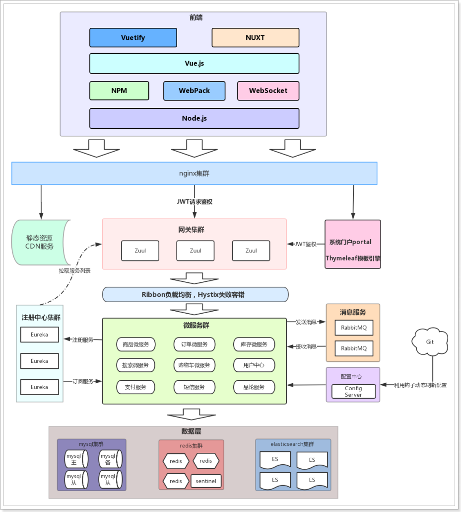


### 2.2.2.系统架构解读

整个乐优商城可以分为两部分：后台管理系统、前台门户系统。

- 后台管理：

  - 后台系统主要包含以下功能：
    - 商品管理，包括商品分类、品牌、商品规格等信息的管理
    - 销售管理，包括订单统计、订单退款处理、促销活动生成等
    - 用户管理，包括用户控制、冻结、解锁等
    - 权限管理，整个网站的权限控制，采用JWT鉴权方案，对用户及API进行权限控制
    - 统计，各种数据的统计分析展示
  - 后台系统会采用前后端分离开发，而且整个后台管理系统会使用Vue.js框架搭建出单页应用（SPA）。

- 前台门户

  - 前台门户面向的是客户，包含与客户交互的一切功能。例如：
    - 搜索商品
    - 加入购物车
    - 下单
    - 评价商品等等
  - 前台系统我们会使用Thymeleaf模板引擎技术来完成页面开发。出于SEO优化的考虑，我们将不采用单页应用。

  


无论是前台还是后台系统，都共享相同的微服务集群，包括：

- 商品微服务：商品及商品分类、品牌、库存等的服务
- 搜索微服务：实现搜索功能
- 订单微服务：实现订单相关
- 购物车微服务：实现购物车相关功能
- 用户中心：用户的登录注册等功能
- Eureka注册中心
- Zuul网关服务
- ...


# 3.项目搭建

## 3.1.技术选型

前端技术：

- 基础的HTML、CSS、JavaScript（基于ES6标准）
- JQuery
- Vue.js 2.0以及基于Vue的框架：Vuetify（UI框架）
- 前端构建工具：WebPack
- 前端安装包工具：NPM
- Vue脚手架：Vue-cli
- Vue路由：vue-router
- ajax框架：axios
- 基于Vue的富文本框架：quill-editor 

后端技术：

- 基础的SpringMVC、Spring 5.x和MyBatis3
- Spring Boot 2.0.7版本
- Spring Cloud 最新版 Finchley.SR2
- Redis-4.0 
- RabbitMQ-3.4
- Elasticsearch-6.3
- nginx-1.14.2
- FastDFS - 5.0.8
- MyCat
- Thymeleaf
- mysql 5.6


## 3.2.开发环境

为了保证开发环境的统一，希望每个人都按照我的环境来配置：

- IDE：我们使用Idea 2017.3 版本
- JDK：统一使用JDK1.8
- 项目构建：maven3.3.9以上版本即可（3.5.2）
- 版本控制工具：git

idea大家可以在我的课前资料中找到。另外，使用帮助大家可以参考课前资料的《idea使用指南.md》


## 3.3.域名

我们在开发的过程中，为了保证以后的生产、测试环境统一。尽量都采用域名来访问项目。

一级域名：www.leyou.com，leyou.com leyou.cn 

二级域名：manage.leyou.com/item , api.leyou.com

我们可以通过switchhost工具来修改自己的host对应的地址，只要把这些域名指向127.0.0.1，那么跟你用localhost的效果是完全一样的。

switchhost可以去课前资料寻找。


## 3.4.创建父工程

创建统一的父工程：leyou，用来管理依赖及其版本，注意是创建project，而不是module

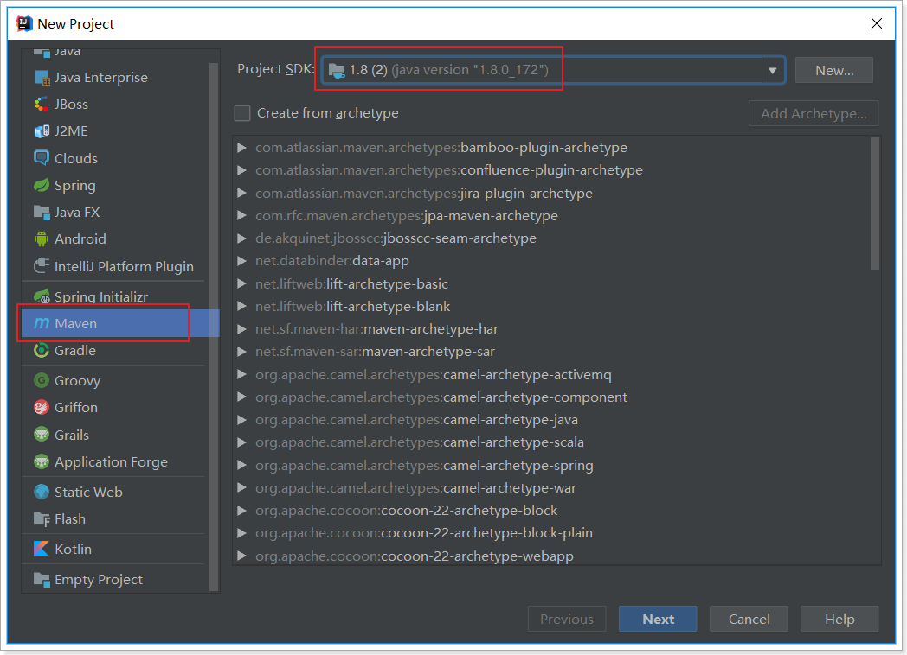

填写项目信息：

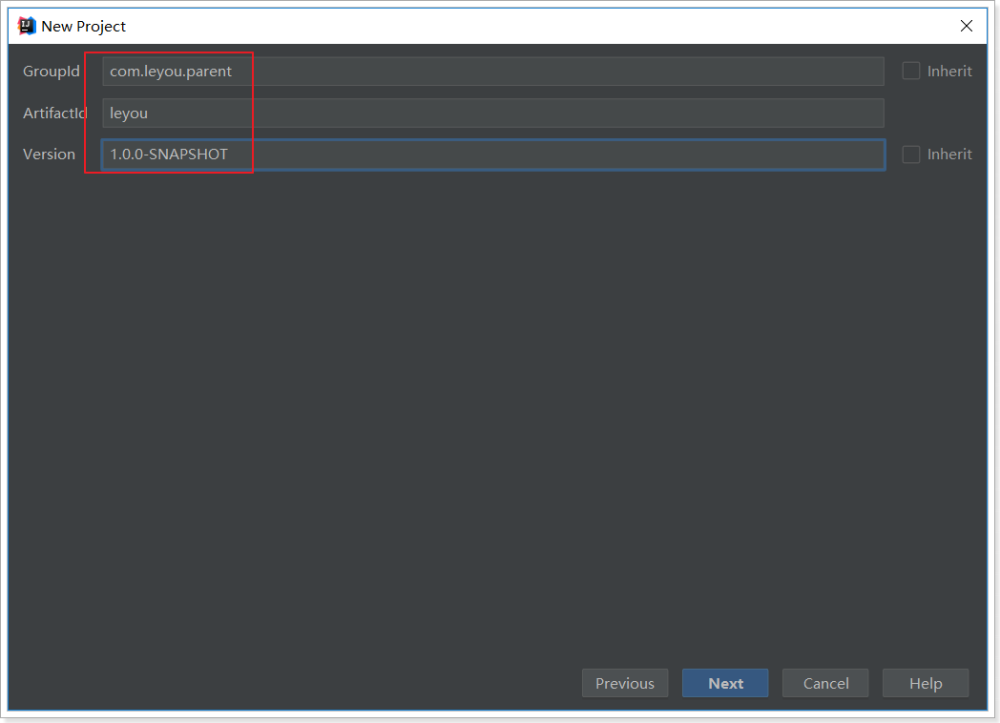

填写保存的位置信息：

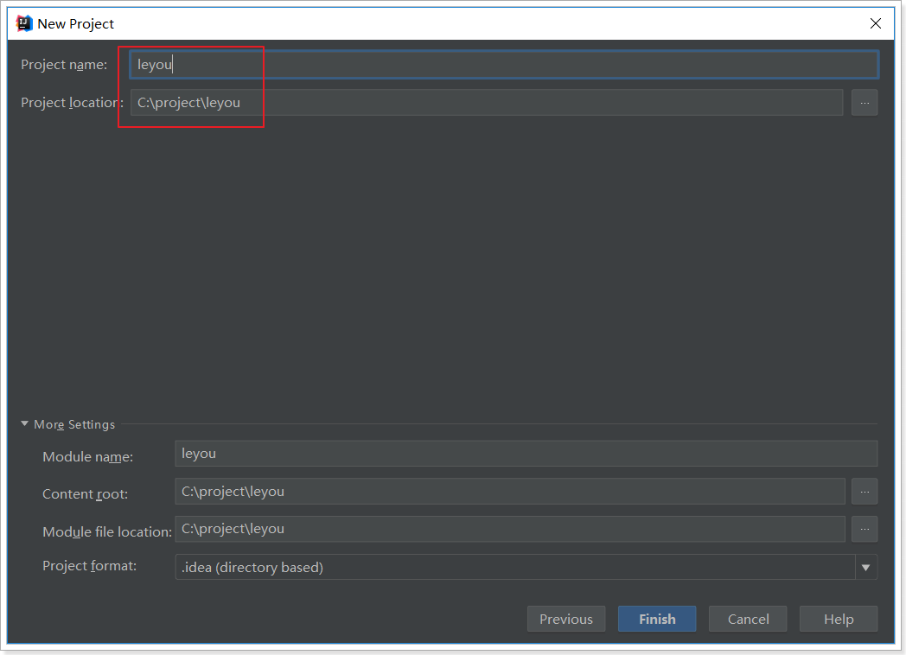

然后将pom文件修改成我这个样子：

```xml
<?xml version="1.0" encoding="UTF-8"?>
<project xmlns="http://maven.apache.org/POM/4.0.0" xmlns:xsi="http://www.w3.org/2001/XMLSchema-instance"
	xsi:schemaLocation="http://maven.apache.org/POM/4.0.0 http://maven.apache.org/xsd/maven-4.0.0.xsd">
	<modelVersion>4.0.0</modelVersion>

	<groupId>com.leyou.parent</groupId>
	<artifactId>leyou</artifactId>
	<version>1.0.0-SNAPSHOT</version>
	<packaging>pom</packaging>

	<name>leyou</name>
	<description>Demo project for Spring Boot</description>

	<parent>
		<groupId>org.springframework.boot</groupId>
		<artifactId>spring-boot-starter-parent</artifactId>
		<version>2.0.7.RELEASE</version>
		<relativePath/> <!-- lookup parent from repository -->
	</parent>

	<properties>
		<project.build.sourceEncoding>UTF-8</project.build.sourceEncoding>
		<project.reporting.outputEncoding>UTF-8</project.reporting.outputEncoding>
		<java.version>1.8</java.version>
		<spring-cloud.version>Finchley.SR2</spring-cloud.version>
		<mybatis.starter.version>1.3.2</mybatis.starter.version>
		<mapper.starter.version>2.0.2</mapper.starter.version>
		<druid.starter.version>1.1.9</druid.starter.version>
		<mysql.version>5.1.32</mysql.version>
		<pageHelper.starter.version>1.2.3</pageHelper.starter.version>
		<leyou.latest.version>1.0.0-SNAPSHOT</leyou.latest.version>
		<fastDFS.client.version>1.26.1-RELEASE</fastDFS.client.version>
	</properties>

	<dependencyManagement>
		<dependencies>
			<!-- springCloud -->
			<dependency>
				<groupId>org.springframework.cloud</groupId>
				<artifactId>spring-cloud-dependencies</artifactId>
				<version>${spring-cloud.version}</version>
				<type>pom</type>
				<scope>import</scope>
			</dependency>
			<!-- mybatis启动器 -->
			<dependency>
				<groupId>org.mybatis.spring.boot</groupId>
				<artifactId>mybatis-spring-boot-starter</artifactId>
				<version>${mybatis.starter.version}</version>
			</dependency>
			<!-- 通用Mapper启动器 -->
			<dependency>
				<groupId>tk.mybatis</groupId>
				<artifactId>mapper-spring-boot-starter</artifactId>
				<version>${mapper.starter.version}</version>
			</dependency>
			<!-- 分页助手启动器 -->
			<dependency>
				<groupId>com.github.pagehelper</groupId>
				<artifactId>pagehelper-spring-boot-starter</artifactId>
				<version>${pageHelper.starter.version}</version>
			</dependency>
			<!-- mysql驱动 -->
			<dependency>
				<groupId>mysql</groupId>
				<artifactId>mysql-connector-java</artifactId>
				<version>${mysql.version}</version>
			</dependency>
			<!--FastDFS客户端-->
			<dependency>
				<groupId>com.github.tobato</groupId>
				<artifactId>fastdfs-client</artifactId>
				<version>${fastDFS.client.version}</version>
			</dependency>
          </dependencies>
	</dependencyManagement>

	<build>
		<plugins>
			<plugin>
				<groupId>org.springframework.boot</groupId>
				<artifactId>spring-boot-maven-plugin</artifactId>
			</plugin>
		</plugins>
	</build>
</project>

```

可以发现，我们在父工程中引入了SpringCloud等，很多以后需要用到的依赖，以后创建的子工程就不需要自己引入了。

可以删除src目录，工程结构如下：

 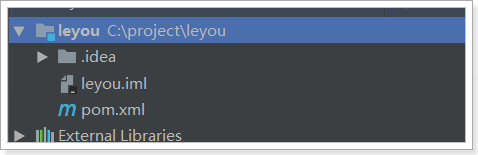


## 3.5.创建EurekaServer

### 3.5.1.创建工程

我们的注册中心，起名为：leyou-registry

选择新建module：

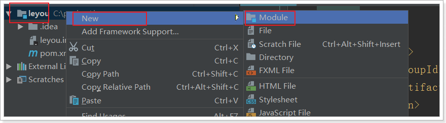

不要选择骨架：

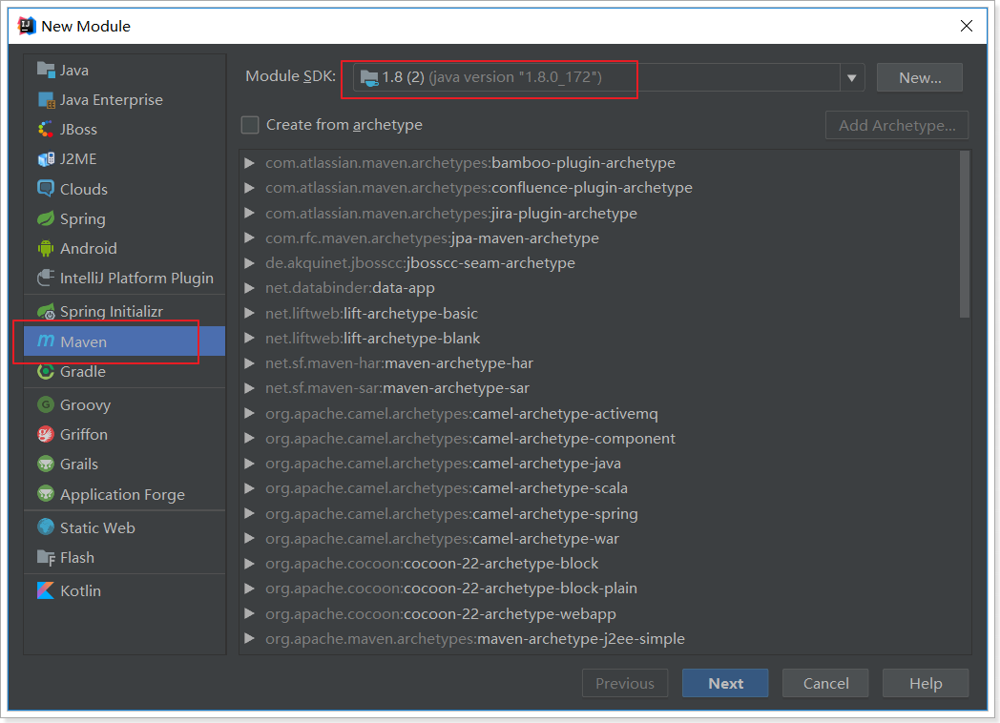

然后填写项目坐标，我们的项目名称为leyou-registry:


选择安装目录，因为是聚合项目，目录应该是在父工程leyou的下面：

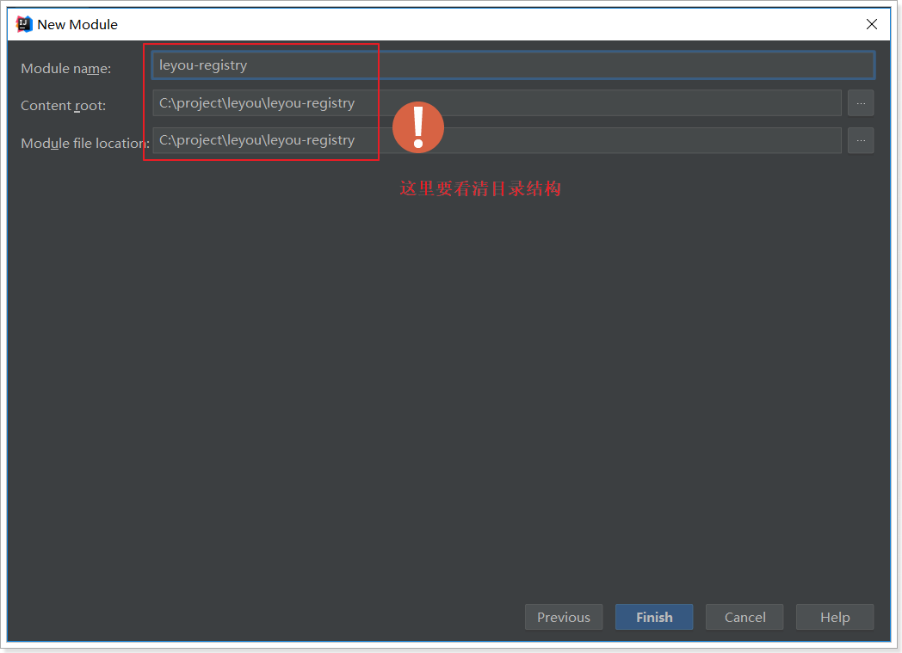


### 3.5.2.添加依赖

添加EurekaServer的依赖：

```xml
<?xml version="1.0" encoding="UTF-8"?>
<project xmlns="http://maven.apache.org/POM/4.0.0"
         xmlns:xsi="http://www.w3.org/2001/XMLSchema-instance"
         xsi:schemaLocation="http://maven.apache.org/POM/4.0.0 http://maven.apache.org/xsd/maven-4.0.0.xsd">
    <parent>
        <artifactId>leyou</artifactId>
        <groupId>com.leyou.parent</groupId>
        <version>1.0.0-SNAPSHOT</version>
    </parent>
    <modelVersion>4.0.0</modelVersion>

    <groupId>com.leyou.common</groupId>
    <artifactId>leyou-registry</artifactId>
    <version>1.0.0-SNAPSHOT</version>

    <dependencies>
        <dependency>
            <groupId>org.springframework.cloud</groupId>
            <artifactId>spring-cloud-starter-netflix-eureka-server</artifactId>
        </dependency>

    </dependencies>
</project>
```


### 3.5.3.编写启动类

```java
@SpringBootApplication
@EnableEurekaServer
public class LeyouRegistryApplication {

    public static void main(String[] args) {
        SpringApplication.run(LeyouRegistryApplication.class, args);
    }
}
```

### 3.5.4.配置文件

```yaml
server:
  port: 10086
spring:
  application:
    name: leyou-registry
eureka:
  client:
    service-url:
      defaultZone: http://127.0.0.1:${server.port}/eureka
    register-with-eureka: false # 把自己注册到eureka服务列表
    fetch-registry: false # 拉取eureka服务信息
  server:
    enable-self-preservation: false # 关闭自我保护
    eviction-interval-timer-in-ms: 5000 # 每隔5秒钟，进行一次服务列表的清理
```


### 3.5.5.项目的结构

目前，整个项目的结构如图：

 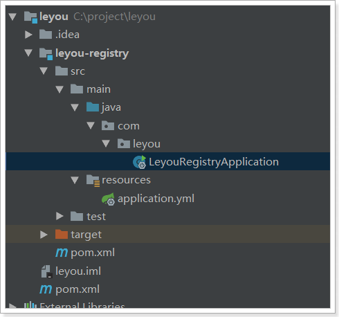


## 3.6.创建Zuul网关

### 3.6.1.创建工程

与上面类似，选择maven方式创建Module，然后填写项目名称，我们命名为：leyou-gateway


填写保存的目录：

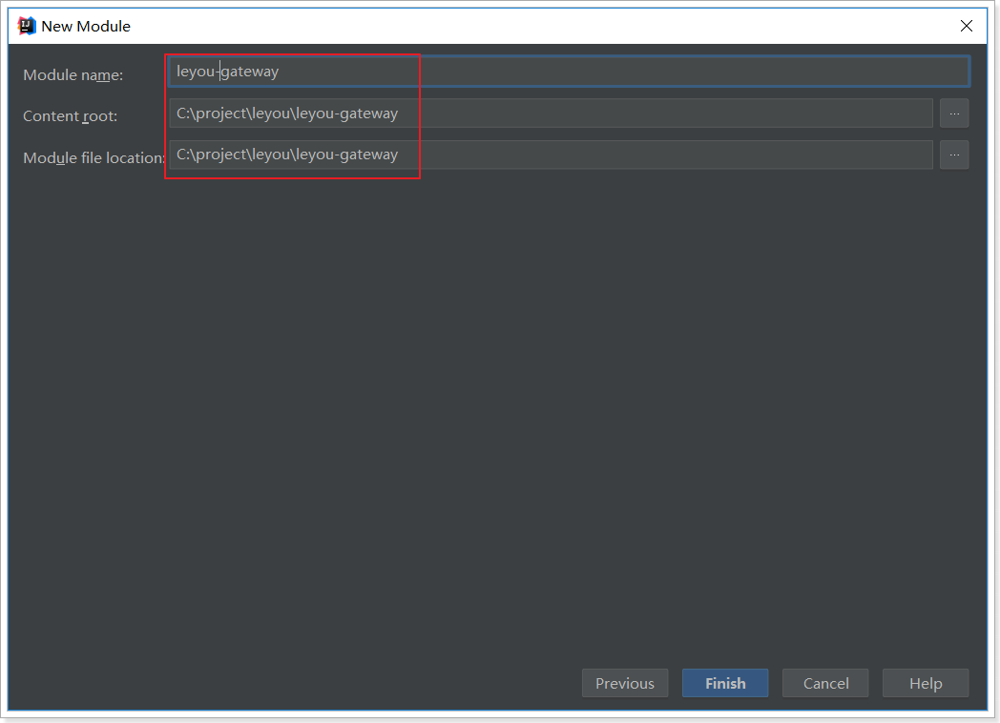


### 3.6.2.添加依赖

这里我们需要添加Zuul和EurekaClient的依赖：

```xml
<?xml version="1.0" encoding="UTF-8"?>
<project xmlns="http://maven.apache.org/POM/4.0.0"
         xmlns:xsi="http://www.w3.org/2001/XMLSchema-instance"
         xsi:schemaLocation="http://maven.apache.org/POM/4.0.0 http://maven.apache.org/xsd/maven-4.0.0.xsd">
    <parent>
        <artifactId>leyou</artifactId>
        <groupId>com.leyou.parent</groupId>
        <version>1.0.0-SNAPSHOT</version>
    </parent>
    <modelVersion>4.0.0</modelVersion>

    <groupId>com.leyou.common</groupId>
    <artifactId>leyou-gateway</artifactId>
    <version>1.0.0-SNAPSHOT</version>

    <dependencies>
        <dependency>
            <groupId>org.springframework.cloud</groupId>
            <artifactId>spring-cloud-starter-netflix-zuul</artifactId>
        </dependency>
        <dependency>
            <groupId>org.springframework.cloud</groupId>
            <artifactId>spring-cloud-starter-netflix-eureka-client</artifactId>
        </dependency>
        <!-- springboot提供微服务检测接口，默认对外提供几个接口 -->
        <dependency>
            <groupId>org.springframework.boot</groupId>
            <artifactId>spring-boot-starter-actuator</artifactId>
        </dependency>
    </dependencies>
</project>
```

### 3.6.3.编写启动类

```java
@SpringBootApplication
@EnableDiscoveryClient
@EnableZuulProxy
public class LeyouGatewayApplication {
    public static void main(String[] args) {
        SpringApplication.run(LeyouGatewayApplication.class, args);
    }
}
```


### 3.6.4.配置文件

```yaml
server:
  port: 10010
spring:
  application:
    name: leyou-gateway
eureka:
  client:
    registry-fetch-interval-seconds: 5
    service-url:
      defaultZone: http://127.0.0.1:10086/eureka
zuul:
  prefix: /api # 路由路径前缀
```


### 3.6.5.项目结构

目前，leyou下有两个子模块：

- leyou-registry：服务的注册中心（EurekaServer）
- leyou-gateway：服务网关（Zuul）

目前，服务的结构如图所示：

 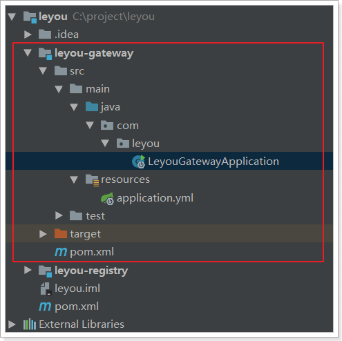


截止到这里，我们已经把基础服务搭建完毕，为了便于开发，统一配置中心（ConfigServer）我们留待以后添加。


## 3.7.创建商品微服务

既然是一个全品类的电商购物平台，那么核心自然就是商品。因此我们要搭建的第一个服务，就是商品微服务。其中会包含对于商品相关的一系列内容的管理，包括：

- 商品分类管理
- 品牌管理
- 商品规格参数管理
- 商品管理
- 库存管理


### 3.7.1.微服务的结构

因为与商品的品类相关，我们的工程命名为`leyou-item`.

需要注意的是，我们的leyou-item是一个微服务，那么将来肯定会有其它系统需要来调用服务中提供的接口，获取的接口数据，也需要对应的实体类来封装，因此肯定也会使用到接口中关联的实体类。

因此这里我们需要使用聚合工程，将要提供的接口及相关实体类放到独立子工程中，以后别人引用的时候，只需要知道坐标即可。

我们会在leyou-item中创建两个子工程：

- leyou-item-interface：主要是对外暴露的接口及相关实体类
- leyou-item-service：所有业务逻辑及内部使用接口

调用关系如图所示：

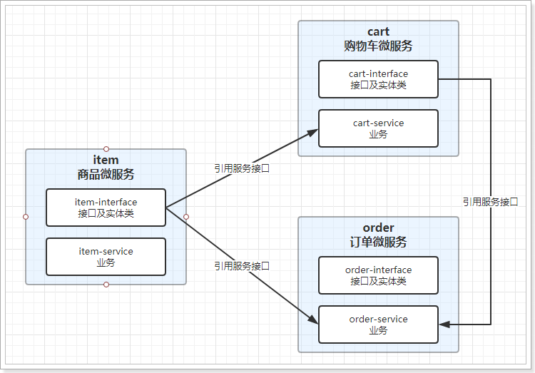


### 3.7.2.leyou-item

依然是使用maven构建：

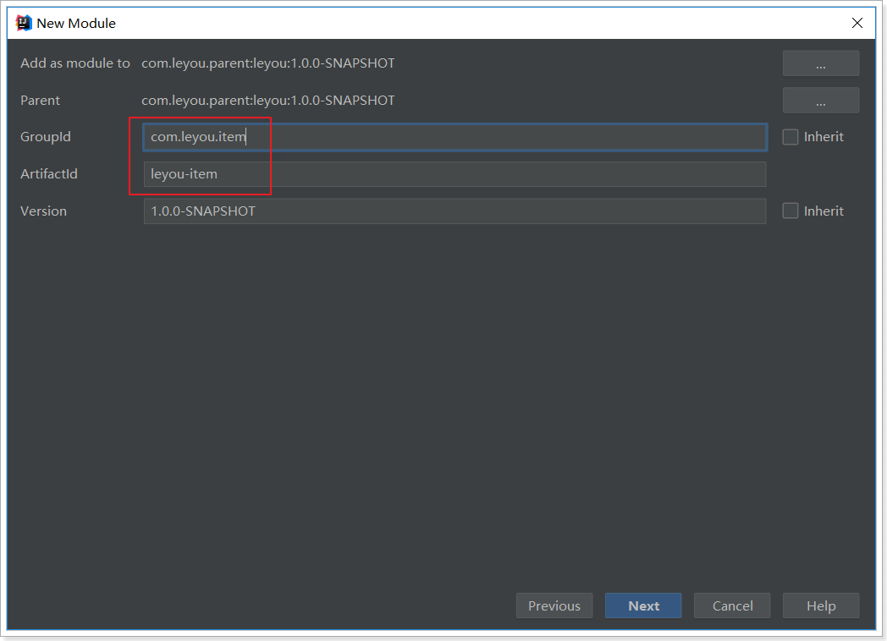

保存的位置：

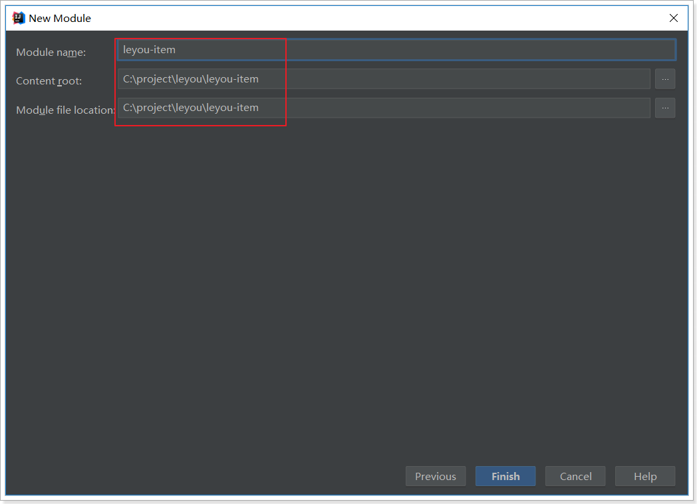

因为是聚合工程，所以把项目打包方式设置为pom

```xml
<?xml version="1.0" encoding="UTF-8"?>
<project xmlns="http://maven.apache.org/POM/4.0.0"
         xmlns:xsi="http://www.w3.org/2001/XMLSchema-instance"
         xsi:schemaLocation="http://maven.apache.org/POM/4.0.0 http://maven.apache.org/xsd/maven-4.0.0.xsd">
    <parent>
        <artifactId>leyou</artifactId>
        <groupId>com.leyou.parent</groupId>
        <version>1.0.0-SNAPSHOT</version>
    </parent>
    <modelVersion>4.0.0</modelVersion>

    <groupId>com.leyou.item</groupId>
    <artifactId>leyou-item</artifactId>
    <version>1.0.0-SNAPSHOT</version>
    <!-- 打包方式为pom -->
    <packaging>pom</packaging>

</project>
```


### 3.7.3.leyou-item-interface

在leyou-item工程上点击右键，选择new --> module:

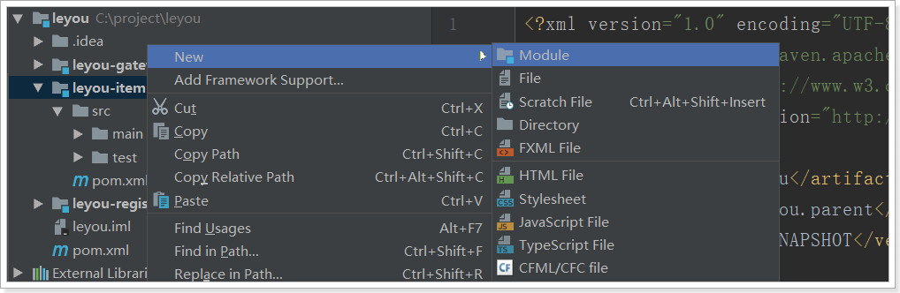

依然是使用maven构建，注意父工程是leyou-item：

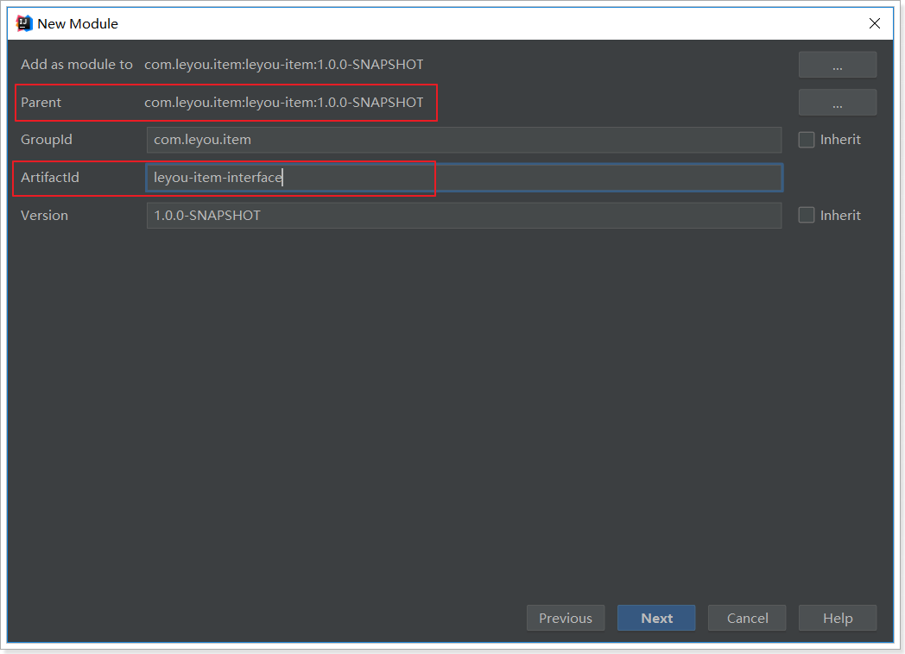

**注意**：目录结构，保存到`leyou-item`下的`leyou-item-interface`目录中：

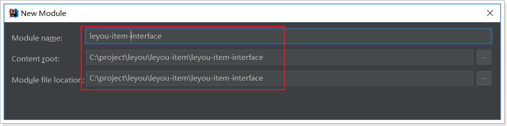

点击Finish完成。

此时的项目结构：

 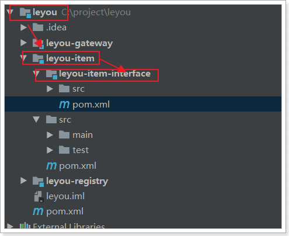


### 3.7.4.leyou-item-service

与`leyou-item-interface`类似，我们选择在`leyou-item`上右键，新建module，然后填写项目信息：


填写存储位置

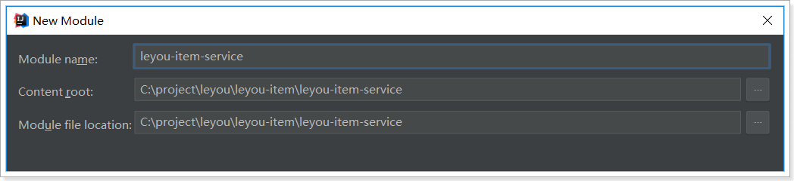

点击Finish完成。


### 3.7.5.整个微服务结构

如图所示：

 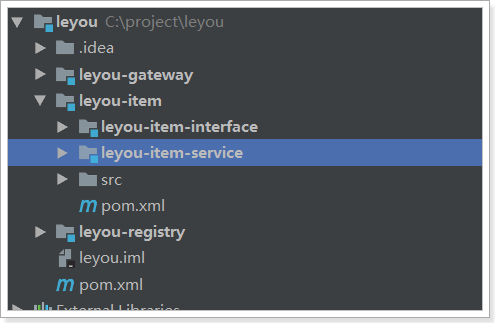

我们打开leyou-item的pom查看，会发现leyou-item-interface和leyou-item-service都已经成为module了：

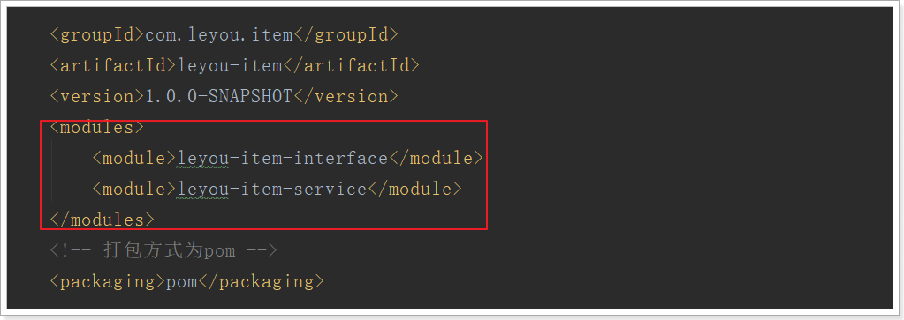

可以删除leyou-item工程的src目录


### 3.7.6.添加依赖

接下来我们给`leyou-item-service`中添加依赖：

思考一下我们需要什么？

- Eureka客户端
- web启动器
- mybatis启动器
- 通用mapper启动器
- 分页助手启动器
- 连接池，我们用默认的Hykira
- mysql驱动
- 千万不能忘了，我们自己也需要`ly-item-interface`中的实体类

这些依赖，我们在顶级父工程：leyou中已经添加好了。所以直接引入即可：

```xml
<?xml version="1.0" encoding="UTF-8"?>
<project xmlns="http://maven.apache.org/POM/4.0.0"
         xmlns:xsi="http://www.w3.org/2001/XMLSchema-instance"
         xsi:schemaLocation="http://maven.apache.org/POM/4.0.0 http://maven.apache.org/xsd/maven-4.0.0.xsd">
    <parent>
        <artifactId>leyou-item</artifactId>
        <groupId>com.leyou.item</groupId>
        <version>1.0.0-SNAPSHOT</version>
    </parent>
    <modelVersion>4.0.0</modelVersion>

    <groupId>com.leyou.item</groupId>
    <artifactId>leyou-item-service</artifactId>
    <version>1.0.0-SNAPSHOT</version>

    <dependencies>
        <!-- web启动器 -->
        <dependency>
            <groupId>org.springframework.boot</groupId>
            <artifactId>spring-boot-starter-web</artifactId>
        </dependency>
        <!-- eureka客户端 -->
        <dependency>
            <groupId>org.springframework.cloud</groupId>
            <artifactId>spring-cloud-starter-netflix-eureka-client</artifactId>
        </dependency>
        <!-- mybatis的启动器 -->
        <dependency>
            <groupId>org.mybatis.spring.boot</groupId>
            <artifactId>mybatis-spring-boot-starter</artifactId>
        </dependency>
        <!-- 通用mapper启动器 -->
        <dependency>
            <groupId>tk.mybatis</groupId>
            <artifactId>mapper-spring-boot-starter</artifactId>
        </dependency>
        <!-- 分页助手启动器 -->
        <dependency>
            <groupId>com.github.pagehelper</groupId>
            <artifactId>pagehelper-spring-boot-starter</artifactId>
        </dependency>
        <!-- jdbc启动器 -->
        <dependency>
            <groupId>org.springframework.boot</groupId>
            <artifactId>spring-boot-starter-jdbc</artifactId>
        </dependency>
        <!-- mysql驱动 -->
        <dependency>
            <groupId>mysql</groupId>
            <artifactId>mysql-connector-java</artifactId>
        </dependency>
        <dependency>
            <groupId>com.leyou.item</groupId>
            <artifactId>leyou-item-interface</artifactId>
            <version>1.0.0-SNAPSHOT</version>
        </dependency>
        <!-- springboot检测服务启动器 -->
        <dependency>
            <groupId>org.springframework.boot</groupId>
            <artifactId>spring-boot-starter-actuator</artifactId>
        </dependency>
    </dependencies>

</project>
```


leyou-item-interface中需要什么我们暂时不清楚，所以先不管。以后需要什么依赖，再引入。

 

### 3.7.7.编写启动和配置

在整个`leyou-item工程`中，只有`leyou-item-service`是需要启动的。因此在其中编写启动类即可：

```java
@SpringBootApplication
@EnableDiscoveryClient
public class LeyouItemServiceApplication {

    public static void main(String[] args) {
        SpringApplication.run(LeyouItemServiceApplication.class, args);
    }
}
```


然后是全局属性文件：

```yaml
server:
  port: 8081
spring:
  application:
    name: item-service
  datasource:
    url: jdbc:mysql://localhost:3306/leyou
    username: root
    password: root
    hikari:
      max-lifetime: 28830000 # 一个连接的生命时长（毫秒），超时而且没被使用则被释放（retired），缺省:30分钟，建议设置比数据库超时时长少30秒，参考MySQL wait_timeout参数（show variables like '%timeout%';）
      maximum-pool-size: 9 # 连接池中允许的最大连接数。缺省值：10；推荐的公式：((core_count * 2) + effective_spindle_count)
eureka:
  client:
    service-url:
      defaultZone: http://127.0.0.1:10086/eureka
  instance:
    lease-renewal-interval-in-seconds: 5 # 5秒钟发送一次心跳
    lease-expiration-duration-in-seconds: 10 # 10秒不发送就过期
```


## 3.8.添加商品微服务的路由规则

既然商品微服务已经创建，接下来肯定要添加路由规则到Zuul中，我们不使用默认的路由规则。

修改leyou-gateway工程的application.yml配置文件：

```yaml
zuul:
  prefix: /api # 路由路径前缀
  routes:
    item-service: /item/** # 商品微服务的映射路径
```


## 3.9.启动测试

我们分别启动：leyou-registry，leyou-gateway，leyou-item-service

 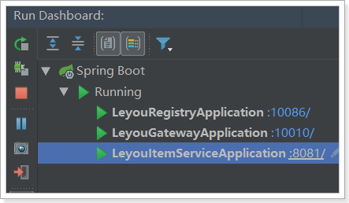

查看Eureka面板：

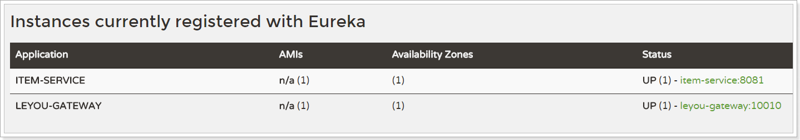


## 3.10.测试路由规则

为了测试路由规则是否畅通，我们是不是需要在item-service中编写一个controller接口呢？

其实不需要，SpringBoot提供了一个依赖：actuator

只要我们添加了actuator的依赖，它就会为我们生成一系列的访问接口：

- /info
- /health
- /refresh
- ...

添加依赖：

```xml
<dependency>
    <groupId>org.springframework.boot</groupId>
    <artifactId>spring-boot-starter-actuator</artifactId>
</dependency>
```

重启后访问Eureka控制台：

鼠标悬停在item-service上，会显示一个地址：

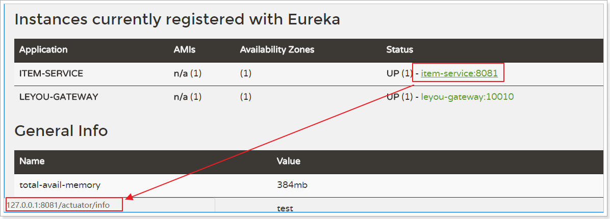

这就是actuator提供的接口，我们点击访问：

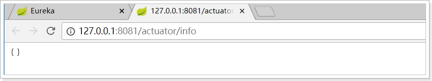

因为我们没有添加信息，所以是一个空的json，但是可以肯定的是：我们能够访问到item-service了。

接下来我们通过路由访问试试，根据路由规则，我们需要访问的地址是：

http://127.0.0.1:10010/api/item/actuator/info

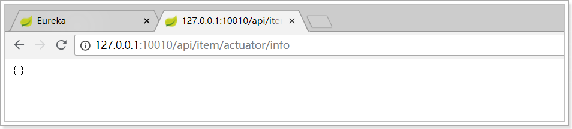


## 3.11.通用工具模块

有些工具或通用的约定内容，我们希望各个服务共享，因此需要创建一个工具模块：`leyou-common`

右键leyou工程，使用maven来构建module：

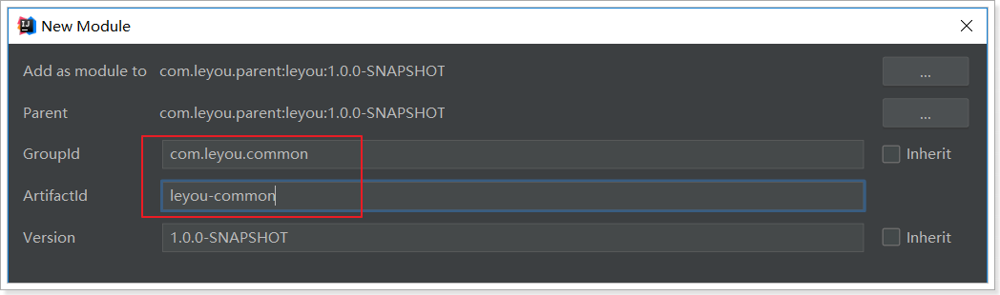

位置信息：

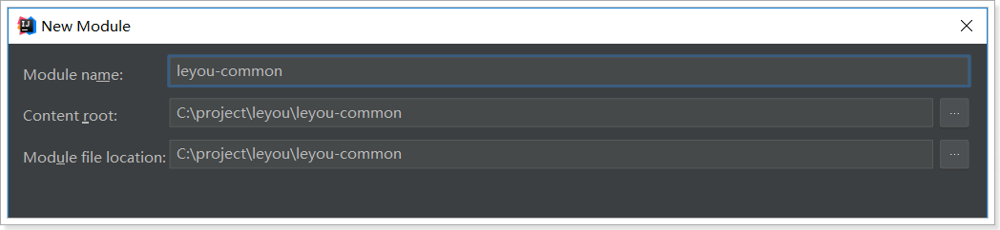


结构：

 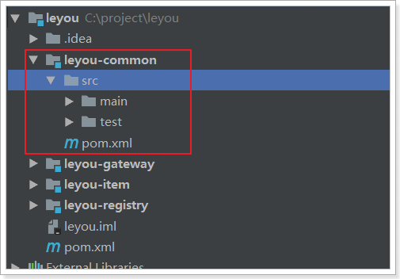

目前还不需要编码。

 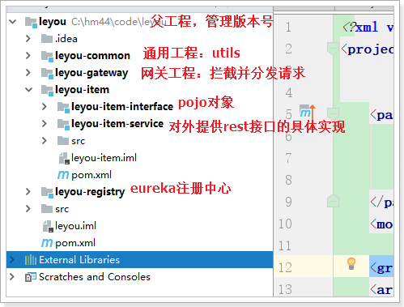


# 4.ES6语法指南

后端项目搭建完毕，接下来就是前端页面了。不过在这之前需要一些准备工作。我们需要学习ES6的语法标准。

什么是ES6？就是ECMAScript第6版标准。

## 4.1.什么是ECMAScript？

来看下前端的发展历程：

> web1.0时代：

- 最初的网页以HTML为主，是纯静态的网页。网页是只读的，信息流只能从服务的到客户端单向流通。**开发人员也只关心页面的样式和内容**即可。

> web2.0时代：

- 1995年，网景工程师Brendan Eich 花了10天时间设计了JavaScript语言。
- 1996年，微软发布了JScript，其实是JavaScript的逆向工程实现。
- 1997年，为了统一各种不同script脚本语言，ECMA（欧洲计算机制造商协会）以JavaScript为基础，制定了`ECMAscript`标准规范。JavaScript和JScript都是`ECMAScript`的标准实现者，随后各大浏览器厂商纷纷实现了`ECMAScript`标准。

所以，ECMAScript是浏览器脚本语言的规范，而各种我们熟知的js语言，如JavaScript则是规范的具体实现。

## 4.2.ECMAScript的快速发展

而后，ECMAScript就进入了快速发展期。

- 1998年6月，ECMAScript 2.0 发布。

- 1999年12月，ECMAScript 3.0 发布。这时，ECMAScript 规范本身也相对比较完善和稳定了，但是接下来的事情，就比较悲剧了。

- 2007年10月。。。。ECMAScript 4.0 草案发布。

  这次的新规范，历时颇久，规范的新内容也有了很多争议。在制定ES4的时候，是分成了两个工作组同时工作的。

  - 一边是以 Adobe, Mozilla, Opera 和 Google为主的 ECMAScript 4.0 工作组。
  - 一边是以 Microsoft 和 Yahoo 为主的 ECMAScript 3.1 工作组。

  ECMAScript 4 的很多主张比较激进，改动较大。而 ECMAScript 3.1 则主张小幅更新。最终经过 TC39 的会议，决定将一部分不那么激进的改动保留发布为 ECMAScript 3.1，而ES4的内容，则延续到了后来的ECMAScript5和6版本中

- 2009年12月，ECMAScript 5 发布。

- 2011年6月，ECMAScript 5.1 发布。

- 2015年6月，ECMAScript 6，也就是 ECMAScript 2015 发布了。 并且从 ECMAScript 6 开始，开始采用年号来做版本。即 ECMAScript 2015，就是ECMAScript6。 它的目标，是使得 JavaScript 语言可以用来编写复杂的大型应用程序，成为企业级开发语言。


## 4.3.ES5和6的一些新特性

我们这里只把一些常用的进行学习，更详细的大家参考：[阮一峰的ES6教程](http://es6.ruanyifeng.com/?search=reduce&x=0&y=0#README)

创建一个空的html页面：

```html
<!DOCTYPE html>
<html lang="en">
<head>
    <meta charset="UTF-8">
    <meta name="viewport" content="width=device-width, initial-scale=1.0">
    <meta http-equiv="X-UA-Compatible" content="ie=edge">
    <title>Document</title>
</head>
<script>

</script>
<body>
    
</body>
</html>
```


### 4.3.1.let 和 const 命令

> var

之前，js定义变量只有一个关键字：`var`

`var`有一个问题，就是定义的变量有时会莫名奇妙的成为全局变量。

例如这样的一段代码：

```js
for(var i = 0; i < 5; i++){
    console.log(i);
}
console.log("循环外：" + i)
```

你猜下打印的结果是什么？

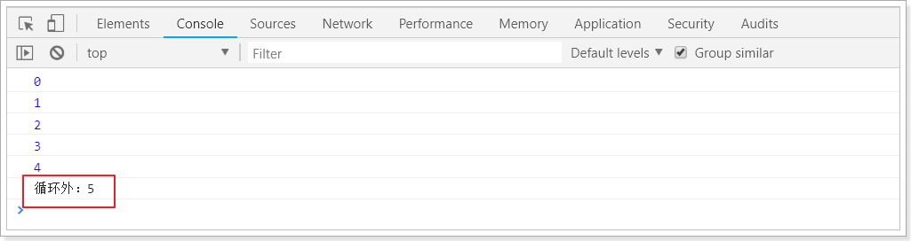


> let

`let`所声明的变量，只在`let`命令所在的代码块内有效。

我们把刚才的`var`改成`let`试试：

```js
for(let i = 0; i < 5; i++){
    console.log(i);
}
console.log("循环外：" + i)
```

结果：

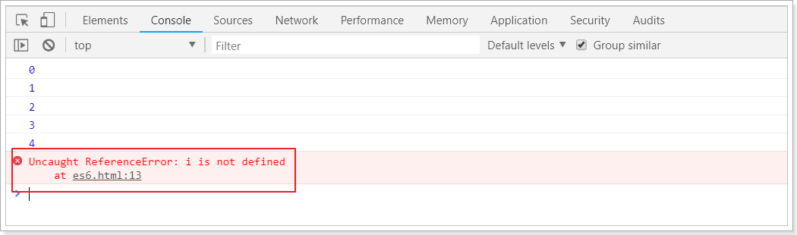

> const

`const`声明的变量是常量，不能被修改

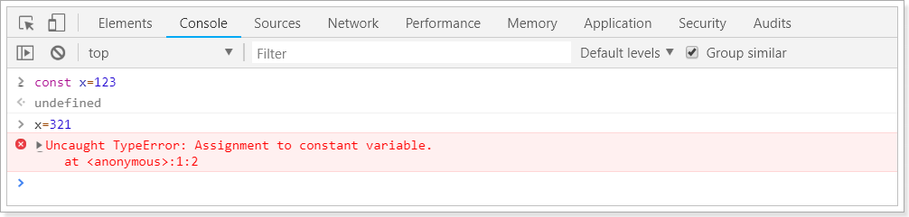


### 4.3.2.字符串扩展

> 新的API

ES6为字符串扩展了几个新的API：

- `includes()`：返回布尔值，表示是否找到了参数字符串。
- `startsWith()`：返回布尔值，表示参数字符串是否在原字符串的头部。
- `endsWith()`：返回布尔值，表示参数字符串是否在原字符串的尾部。

实验一下：

 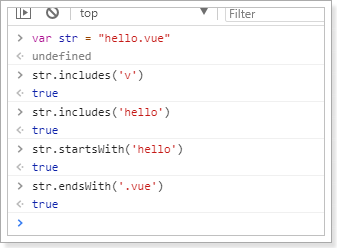


> 字符串模板

ES6中提供了`来作为字符串模板标记。我们可以这么玩：

 

在两个`之间的部分都会被作为字符串的值，不管你任意换行，甚至加入js脚本


### 4.3.3.解构表达式

> 数组解构

比如有一个数组：

```js
let arr = [1,2,3]
```

我想获取其中的值，只能通过角标。ES6可以这样：

```js
const [x,y,z] = arr;// x，y，z将与arr中的每个位置对应来取值
// 然后打印
console.log(x,y,z);
```

结果：

 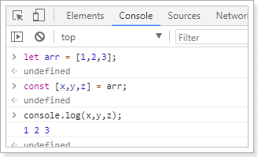


> 对象解构

例如有个person对象：

```js
const person = {
    name:"jack",
    age:21,
    language: ['java','js','css']
}
```

我们可以这么做：

```js
// 解构表达式获取值
const {name,age,language} = person;
// 打印
console.log(name);
console.log(age);
console.log(language);
```

结果：

 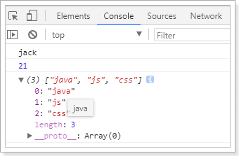


如过想要用其它变量接收，需要额外指定别名：

 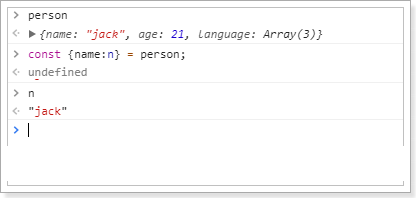

`{name:n}`：name是person中的属性名，冒号后面的n是解构后要赋值给的变量。


### 4.3.4.函数优化

> 函数参数默认值

在ES6以前，我们无法给一个函数参数设置默认值，只能采用变通写法：

```js
    function add(a , b) {
        // 判断b是否为空，为空就给默认值1
        b = b || 1;
        return a + b;
    }
    // 传一个参数
    console.log(add(10));
```

现在可以这么写：

```js
function add(a , b = 1) {
    return a + b;
}
// 传一个参数
console.log(add(10));
```


> 箭头函数

ES6中定义函数的简写方式：

一个参数时：

```js
var print = function (obj) {
    console.log(obj);
}
// 简写为：
var print2 = obj => console.log(obj);
```

多个参数：

```js
// 两个参数的情况：
var sum = function (a , b) {
    return a + b;
}
// 简写为：
var sum2 = (a,b) => a+b;
```

代码不止一行，可以用`{}`括起来

```js
var sum3 = (a,b) => {
    return a + b;
}
```


> 对象的函数属性简写

比如一个Person对象，里面有eat方法：

```js
let person = {
    name: "jack",
    // 以前：
    eat: function (food) {
        console.log(this.name + "在吃" + food);
    },
    // 箭头函数版：
    eat2: food => console.log(person.name + "在吃" + food),// 这里拿不到this
    // 简写版：
    eat3(food){
        console.log(this.name + "在吃" + food);
    }
}
```


> 箭头函数结合解构表达式

比如有一个函数：

```js
const person = {
    name:"jack",
    age:21,
    language: ['java','js','css']
}

function hello(person) {
    console.log("hello," + person.name)
}
```

如果用箭头函数和解构表达式

```js
var hi = ({name}) =>  console.log("hello," + name);
```


### 4.3.5.map和reduce

数组中新增了map和reduce方法。

> map

`map()`：接收一个函数，将原数组中的所有元素用这个函数处理后放入新数组返回。

举例：有一个字符串数组，我们希望转为int数组

```js
let arr = ['1','20','-5','3'];
console.log(arr)

arr = arr.map(s => parseInt(s));
console.log(arr)
```

  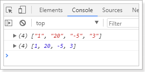


> reduce

`reduce()`：接收一个函数（必须）和一个初始值（可选）。

第一个参数（函数）接收两个参数：

- 第一个参数是上一次reduce处理的结果
- 第二个参数是数组中要处理的下一个元素

`reduce()`会从左到右依次把数组中的元素用reduce处理，并把处理的结果作为下次reduce的第一个参数。如果是第一次，会把前两个元素作为计算参数，或者把用户指定的初始值作为起始参数

举例：

```
const arr = [1,20,-5,3]
```

没有初始值：

 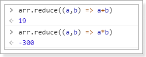

指定初始值：

 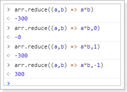


### 4.3.6.对象扩展

ES6给Object拓展了许多新的方法，如：

- keys(obj)：获取对象的所有key形成的数组
- values(obj)：获取对象的所有value形成的数组
- entries(obj)：获取对象的所有key和value形成的二维数组。格式：`[[k1,v1],[k2,v2],...]`
- assign(dest, ...src) ：将多个src对象的值 拷贝到 dest中（浅拷贝）。

 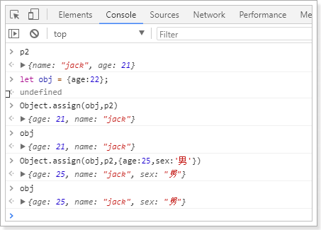


### 4.3.7.数组扩展

ES6给数组新增了许多方法：

- find(callback)：数组实例的find方法，用于找出第一个符合条件的数组成员。它的参数是一个回调函数，所有数组成员依次执行该回调函数，直到找出第一个返回值为true的成员，然后返回该成员。如果没有符合条件的成员，则返回undefined。 
- findIndex(callback)：数组实例的findIndex方法的用法与find方法非常类似，返回第一个符合条件的数组成员的位置，如果所有成员都不符合条件，则返回-1。 
- includes(数组元素)：与find类似，如果匹配到元素，则返回true，代表找到了。