# 0.学习目标

- 使用资料搭建后台系统
- 会使用nginx进行反向代理
- 实现商品分类查询功能
- 掌握cors解决跨域
- 实现品牌查询功能


# 1.搭建后台管理前端

## 1.1.导入已有资源

后台项目相对复杂，为了有利于教学，我们不再从0搭建项目，而是直接使用课前资料中给大家准备好的源码：


我们解压缩，放到工作目录中：


然后在Intellij idea中导入新的工程：

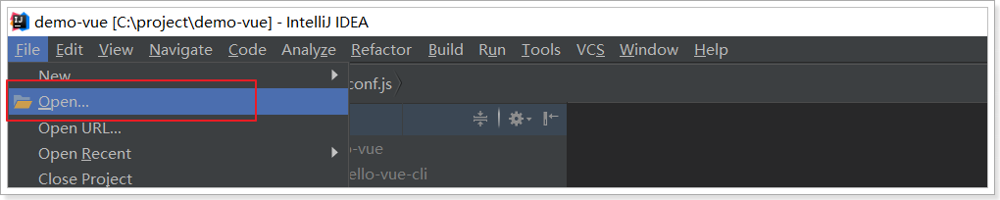

选中我们的工程：

 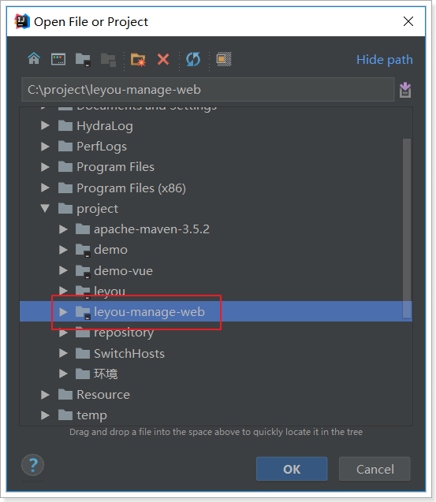


## 1.2.安装依赖

你应该注意到，这里并没有node_modules文件夹，方便给大家下发，已经把依赖都删除了。不过package.json中依然定义了我们所需的一切依赖：

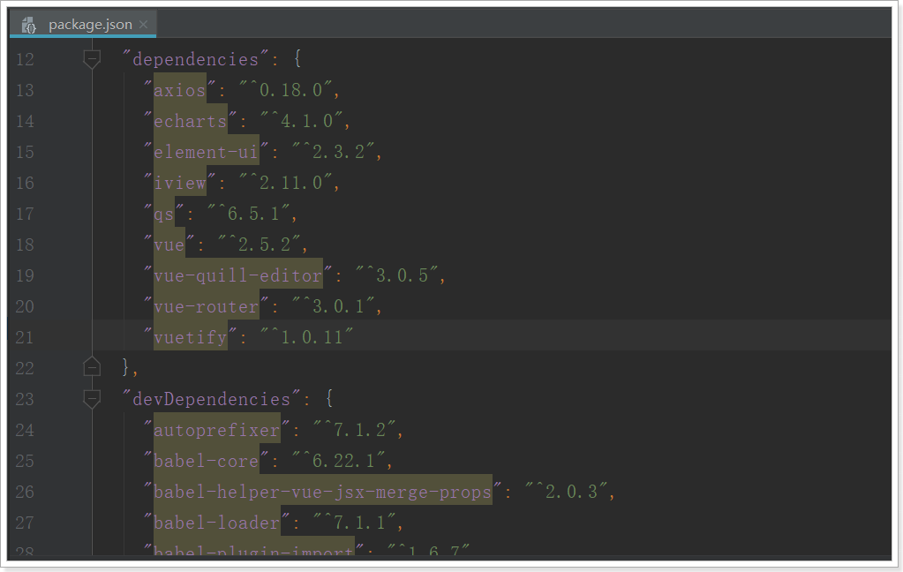

我们只需要打开终端，进入项目目录，输入：`npm install`命令，即可安装这些依赖。


大概需要几分钟。

**如果安装过程出现以下问题**：

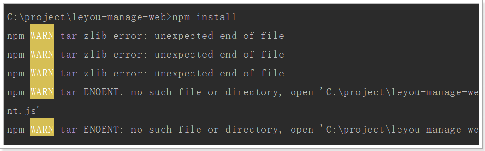

建议删除node_modules目录，重新安装。或者copy其他人的node_modules使用


## 1.3.运行一下看看


在package.json文件中有scripts启动脚本配置，可以输入命令：`npm run dev`或者`npm start`


发现默认的端口是9001。访问：http://localhost:9001

会自动进行跳转：


## 1.4.目录结构

 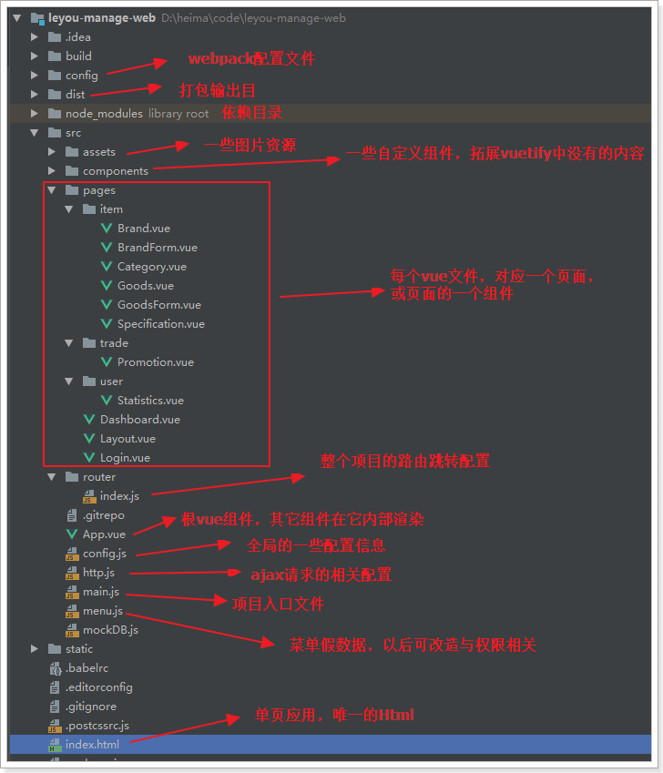

webpack：是一个现代 JavaScript 应用程序的*静态模块打包器(module bundler)*。并且提供了前端项目的热部署插件。


## 1.5.调用关系

我们最主要理清index.html、main.js、App.vue之间的关系：


理一下：

- index.html：html模板文件。定义了空的`div`，其id为`app`。
- main.js：**实例化vue对象**，并且通过id选择器绑定到index.html的div中，因此**main.js的内容都将在index.html的div中显示**。main.js中使用了App组件，即App.vue，也就是说index.html中最终展现的是App.vue中的内容。index.html引用它之后，就拥有了vue的内容（包括组件、样式等），所以，main.js也是**webpack打包的入口**。
- index.js：定义请求路径和组件的映射关系。相当于之前的`<vue-router>`
- App.vue中也没有内容，而是定义了vue-router的锚点：`<router-view>`,我们之前讲过，vue-router路由后的组件将会在锚点展示。
- 最终结论：**一切路由后的内容都将通过App.vue在index.html中显示。**
- 访问流程：用户在浏览器输入路径，例如：http://localhost:9001/#/item/brand --> index.js(/item/brand路径对应pages/item/Brand.vue组件) --> 该组件显示在App.vue的锚点位置 --> main.js使用了App.vue组件，并把该组件渲染在index.html文件中（id为“app”的div中）


# 2.Vuetify框架

## 2.1.为什么要学习UI框架

Vue虽然会帮我们进行视图的渲染，但样式还是由我们自己来完成。这显然不是我们的强项，因此后端开发人员一般都喜欢使用一些现成的UI组件，拿来即用，常见的例如：

- BootStrap
- LayUI
- EasyUI
- ZUI

然而这些UI组件的基因天生与Vue不合，因为他们更多的是利用DOM操作，借助于jQuery实现，而不是MVVM的思想。

而目前与Vue吻合的UI框架也非常的多，国内比较知名的如：

- element-ui：饿了么出品
- i-view：某公司出品

然而我们都不用，我们今天推荐的是一款国外的框架：Vuetify

官方网站：https://vuetifyjs.com/zh-Hans/


## 2.2.为什么是Vuetify

有中国的为什么还要用外国的？原因如下：

- Vuetify几乎不需要任何CSS代码，而element-ui许多布局样式需要我们来编写
- Vuetify从底层构建起来的语义化组件。简单易学，容易记住。
- Vuetify基于Material Design（谷歌推出的多平台设计规范），更加美观，动画效果酷炫，且风格统一

这是官网的说明：

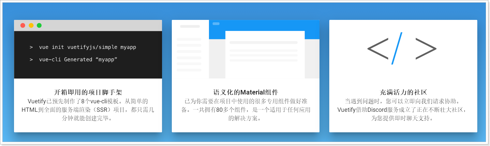

缺陷：

- 目前官网虽然有中文文档，但因为翻译问题，几乎不太能看。


## 2.3.怎么用？

基于官方网站的文档进行学习：


我们重点关注`UI components`即可，里面有大量的UI组件，我们要用的时候再查看，不用现在学习，先看下有什么：

 

 

以后用到什么组件，就来查询即可。


## 2.4.项目页面布局

接下来我们一起看下页面布局。

Layout组件是我们的整个页面的布局组件：


一个典型的三块布局。包含左，上，中三部分：

 


里面使用了Vuetify中的2个组件和一个布局元素：

- `v-navigation-drawer` ：导航抽屉，主要用于容纳应用程序中的页面的导航链接。 

  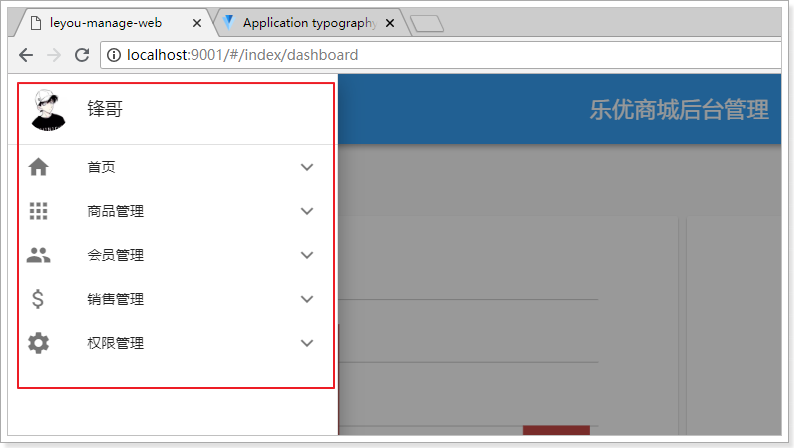

- `v-toolbar `：工具栏通常是网站导航的主要途径。可以与导航抽屉一起很好地工作，动态选择是否打开导航抽屉，实现可伸缩的侧边栏。

  

- `v-content`：并不是一个组件，而是标记页面布局的元素。可以根据您指定的**app**组件的结构动态调整大小，使得您可以创建高度可定制的组件。

那么问题来了：`v-content`中的内容来自哪里？

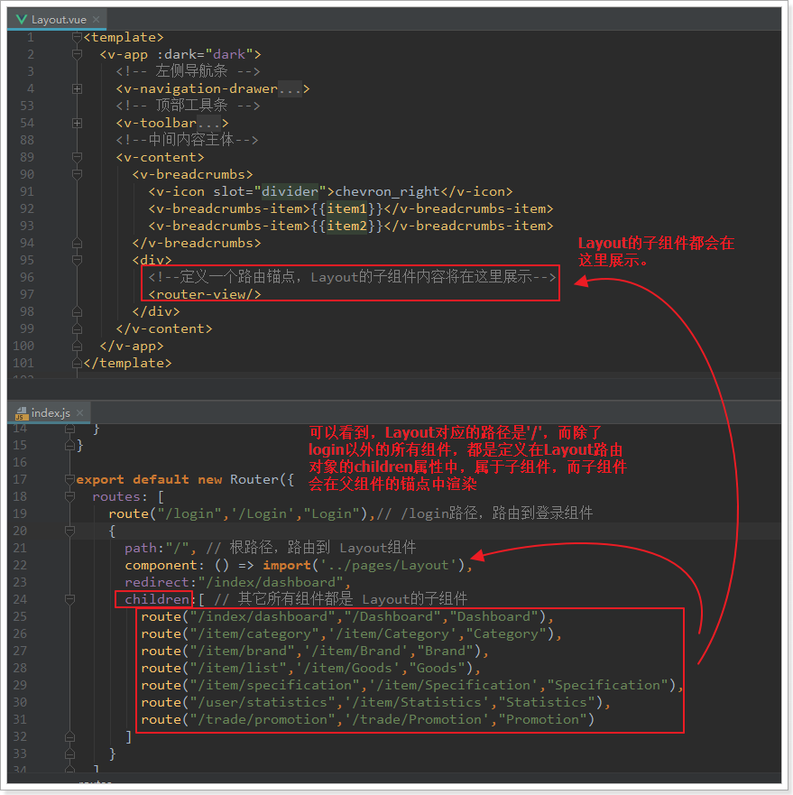

- Layout映射的路径是`/`
- 除了Login以外的所有组件，都是定义在Layout的children属性，并且路径都是`/`的下面
- 因此当路由到子组件时，会在Layout中定义的锚点中显示。
- 并且Layout中的其它部分不会变化，这就实现了布局的共享。


# 3.使用域名访问本地项目

## 3.1.统一环境

我们现在访问页面使用的是：http://localhost:9001

有没有什么问题？

实际开发中，会有不同的环境：

- 开发环境：自己的电脑
- 测试环境：提供给测试人员使用的环境
- 预发布环境：数据是和生成环境的数据一致，运行最新的项目代码进去测试
- 生产环境：项目最终发布上线的环境

如果不同环境使用不同的ip去访问，可能会出现一些问题。为了保证所有环境的一致，我们会在各种环境下都使用域名来访问。

我们将使用以下域名：

- 主域名是：www.leyou.com，leyou.com 
- 管理系统域名：manage.leyou.com
- 网关域名：api.leyou.com
- ...

但是最终，我们希望这些域名指向的还是我们本机的某个端口。

那么，当我们在浏览器输入一个域名时，浏览器是如何找到对应服务的ip和端口的呢？


## 3.2.域名解析

一个域名一定会被解析为一个或多个ip。这一般会包含两步：

- 本地域名解析

  浏览器会首先在本机的hosts文件中查找域名映射的IP地址，如果查找到就返回IP ，没找到则进行域名服务器解析，一般本地解析都会失败，因为默认这个文件是空的。

  - Windows下的hosts文件地址：C:/Windows/System32/drivers/etc/hosts
  - Linux下的hosts文件所在路径： /etc/hosts 

  样式：

  ```
  # My hosts
  127.0.0.1 localhost
  ```

- 域名服务器解析

  本地解析失败，才会进行域名服务器解析，域名服务器就是网络中的一台计算机，里面记录了所有注册备案的域名和ip映射关系，一般只要域名是正确的，并且备案通过，一定能找到。


## 3.3.解决域名解析问题

我们不可能去购买一个域名，因此我们可以伪造本地的hosts文件，实现对域名的解析。修改本地的host为：

```
127.0.0.1 api.leyou.com
127.0.0.1 manage.leyou.com
```

这样就实现了域名的关系映射了。

每次在C盘寻找hosts文件并修改是非常麻烦的，给大家推荐一个快捷修改host的工具，在课前资料中可以找到：

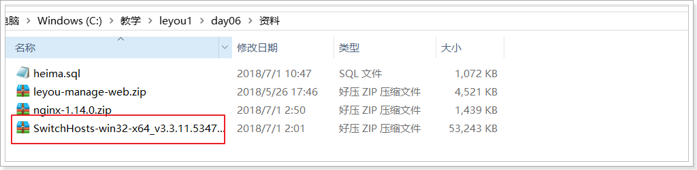

解压，运行exe文件，效果：


我们添加了两个映射关系（中间用空格隔开）：

- 127.0.0.1 api.leyou.com ：我们的网关Zuul
- 127.0.0.1 manage.leyou.com：我们的后台系统地址

现在，ping一下域名试试是否畅通：


OK！

通过域名访问：


原因：我们配置了项目访问的路径，虽然manage.leyou.com映射的ip也是127.0.0.1，但是webpack会验证host是否符合配置。


在webpack.dev.conf.js中取消host验证：`disableHostCheck: true`

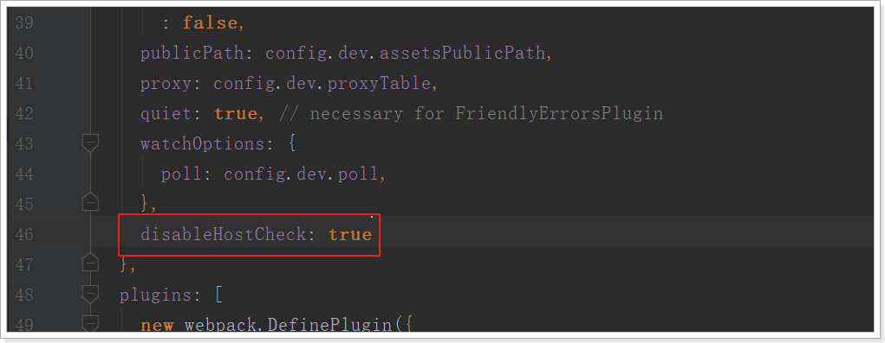

重新执行`npm run dev`，刷新浏览器：


OK！


## 3.4.nginx解决端口问题

域名问题解决了，但是现在要访问后台页面，还得自己加上端口：`http://manage.taotao.com:9001`。

这就不够优雅了。我们希望的是直接域名访问：`http://manage.taotao.com`。这种情况下端口默认是80，如何才能把请求转移到9001端口呢？

这里就要用到反向代理工具：Nginx


### 3.4.1.什么是Nginx

 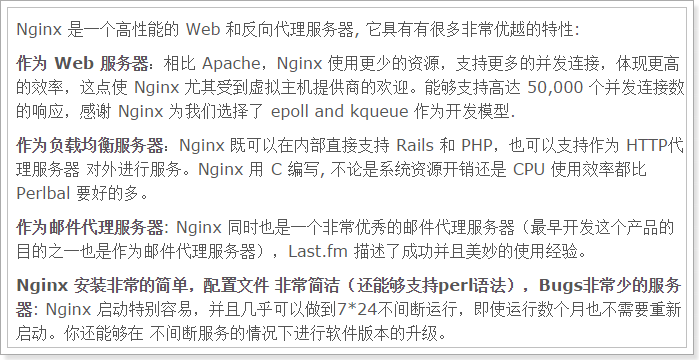

nginx可以作为web服务器，但更多的时候，我们把它作为网关，因为它具备网关必备的功能：

- 反向代理
- 负载均衡
- 动态路由
- 请求过滤


### 3.4.2.nginx作为web服务器

Web服务器分2类：

- web应用服务器，如：
  - tomcat 
  - resin
  - jetty
- web服务器，如：
  - Apache 服务器 
  - Nginx
  - IIS  

区分：web服务器不能解析jsp等页面，只能处理js、css、html等静态资源。
并发：web服务器的并发能力远高于web应用服务器。


### 3.4.3.nginx作为反向代理

什么是反向代理？

- 代理：通过客户机的配置，实现让一台服务器代理客户机，客户的所有请求都交给代理服务器处理。
- 反向代理：用一台服务器，代理真实服务器，用户访问时，不再是访问真实服务器，而是代理服务器。

nginx可以当做反向代理服务器来使用：

- 我们需要提前在nginx中配置好反向代理的规则，不同的请求，交给不同的真实服务器处理
- 当请求到达nginx，nginx会根据已经定义的规则进行请求的转发，从而实现路由功能


利用反向代理，就可以解决我们前面所说的端口问题，如图


### 3.4.4.安装和使用

> ### 安装

安装非常简单，把课前资料提供的nginx直接解压即可，绿色免安装，舒服！

 

我们在本地安装一台nginx：


解压后，目录结构：


1. conf：配置目录
2. contrib：第三方依赖
3. html：默认的静态资源目录，类似于tomcat的webapps
4. logs：日志目录
5. nginx.exe：启动程序。可双击运行，但不建议这么做。


> ### 反向代理配置

示例：

 

nginx中的每个server就是一个反向代理配置，可以有多个server


完整配置：

```nginx
#user  nobody;
worker_processes  1;

events {
    worker_connections  1024;
}

http {
    include       mime.types;
    default_type  application/octet-stream;
    sendfile        on;
   
    keepalive_timeout  65;

    gzip  on;
	server {
        listen       80;
        server_name  manage.leyou.com;

        proxy_set_header X-Forwarded-Host $host;
        proxy_set_header X-Forwarded-Server $host;
        proxy_set_header X-Forwarded-For $proxy_add_x_forwarded_for;

        location / {
			proxy_pass http://127.0.0.1:9001;
			proxy_connect_timeout 600;
			proxy_read_timeout 600;
        }
    }
	server {
        listen       80;
        server_name  api.leyou.com;

        proxy_set_header X-Forwarded-Host $host;
        proxy_set_header X-Forwarded-Server $host;
        proxy_set_header X-Forwarded-For $proxy_add_x_forwarded_for;

        location / {
			proxy_pass http://127.0.0.1:10010;
			proxy_connect_timeout 600;
			proxy_read_timeout 600;
        }
    }
}
```


> ### 使用

nginx可以通过命令行来启动，操作命令：

- 启动：`start nginx.exe`
- 停止：`nginx.exe -s stop`
- 重新加载：`nginx.exe -s reload`

启动过程会闪烁一下，启动成功后，任务管理器中会有两个nginx进程：

 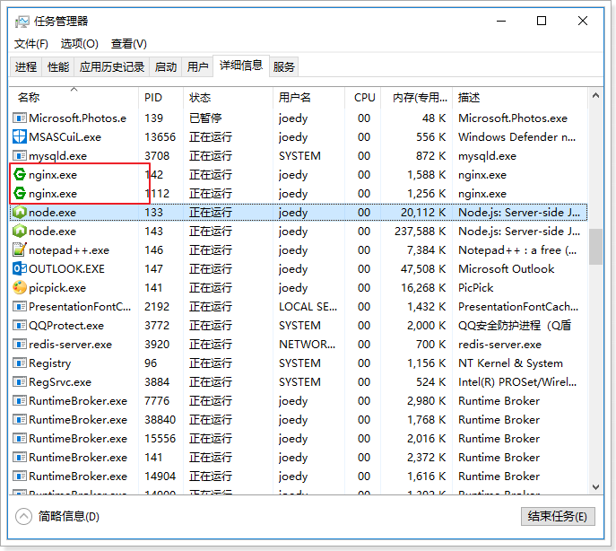


## 3.5.测试

启动nginx，然后用域名访问后台管理系统：


现在实现了域名访问网站了，中间的流程是怎样的呢？


1. 浏览器准备发起请求，访问http://mamage.leyou.com，但需要进行域名解析

2. 优先进行本地域名解析，因为我们修改了hosts，所以解析成功，得到地址：127.0.0.1

3. 请求被发往解析得到的ip，并且默认使用80端口：http://127.0.0.1:80

   本机的nginx一直监听80端口，因此捕获这个请求

4. nginx中配置了反向代理规则，将manage.leyou.com代理到127.0.0.1:9001，因此请求被转发

5. 后台系统的webpack server监听的端口是9001，得到请求并处理，完成后将响应返回到nginx

6. nginx将得到的结果返回到浏览器


# 4.实现商品分类查询

商城的核心自然是商品，而商品多了以后，肯定要进行分类，并且不同的商品会有不同的品牌信息，我们需要依次去完成：商品分类、品牌、商品的开发。

## 4.1.导入数据

首先导入课前资料提供的sql：

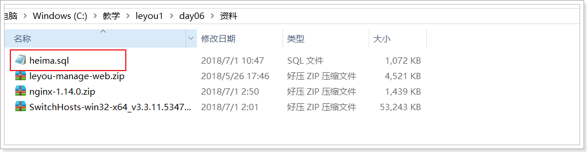

我们先看商品分类表：

 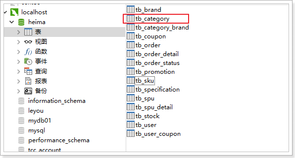

```mysql
CREATE TABLE `tb_category` (
  `id` bigint(20) NOT NULL AUTO_INCREMENT COMMENT '类目id',
  `name` varchar(20) NOT NULL COMMENT '类目名称',
  `parent_id` bigint(20) NOT NULL COMMENT '父类目id,顶级类目填0',
  `is_parent` tinyint(1) NOT NULL COMMENT '是否为父节点，0为否，1为是',
  `sort` int(4) NOT NULL COMMENT '排序指数，越小越靠前',
  PRIMARY KEY (`id`),
  KEY `key_parent_id` (`parent_id`) USING BTREE
) ENGINE=InnoDB AUTO_INCREMENT=1424 DEFAULT CHARSET=utf8 COMMENT='商品类目表，类目和商品(spu)是一对多关系，类目与品牌是多对多关系';
```

因为商品分类会有层级关系，因此这里我们加入了`parent_id`字段，对本表中的其它分类进行自关联。


## 4.2.实现功能

在浏览器页面点击“分类管理”菜单：


根据这个路由路径到路由文件（src/route/index.js），可以定位到分类管理页面：


由路由文件知，页面是src/pages/item/Category.vue


商品分类使用了树状结构，而这种结构的组件vuetify并没有为我们提供，这里自定义了一个树状组件。不要求实现或者查询组件的实现，只要求可以参照文档使用该组件即可：

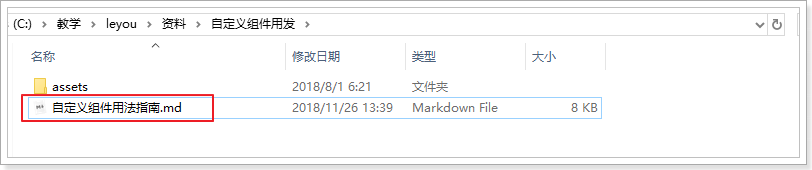


### 4.2.1.url异步请求

点击商品管理下的分类管理子菜单，在浏览器控制台可以看到：


页面中没有，只是发起了一条请求：http://api.leyou.com/api/item/category/list?pid=0 


大家可能会觉得很奇怪，我们明明是使用的相对路径：/item/category/list，讲道理发起的请求地址应该是：

http://manage.leyou.com/item/category/list

但实际却是：

http://api.leyou.com/api/item/category/list?pid=0 

这是因为，我们有一个全局的配置文件，对所有的请求路径进行了约定：

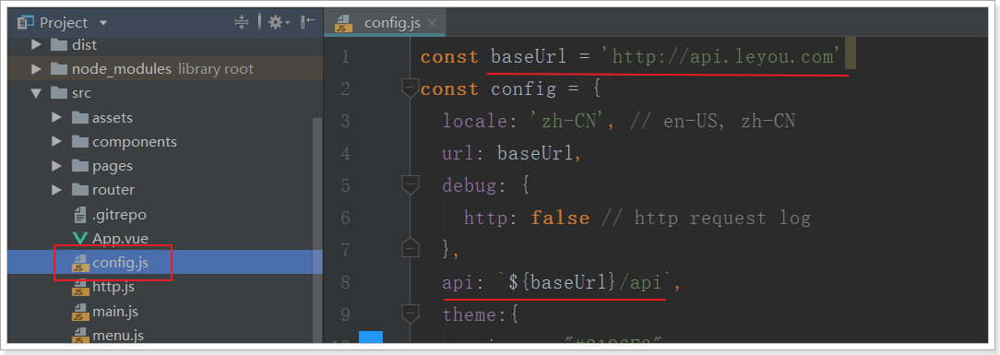

路径是http://api.leyou.com，并且默认加上了/api的前缀，这恰好与我们的网关设置匹配，我们只需要把地址改成网关的地址即可,因为我们使用了nginx反向代理，这里可以写域名。

接下来，我们要做的事情就是编写后台接口，返回对应的数据即可。


### 4.2.2.实体类

在`leyou-item-interface`中添加category实体类：

 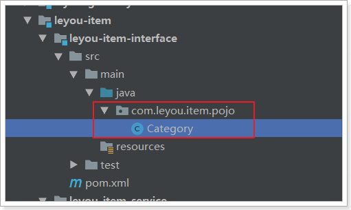

内容：

```java
@Table(name="tb_category")
public class Category {
	@Id
	@GeneratedValue(strategy=GenerationType.IDENTITY)
	private Long id;
	private String name;
	private Long parentId;
	private Boolean isParent; // 注意isParent生成的getter和setter方法需要手动加上Is
	private Integer sort;
	// getter和setter略
}
```

需要注意的是，这里要用到jpa的注解，因此我们在`leyou-item-iterface`中添加jpa依赖

```xml
<dependency>
    <groupId>javax.persistence</groupId>
    <artifactId>persistence-api</artifactId>
    <version>1.0</version>
</dependency>
```


### 4.2.3.controller

编写一个controller一般需要知道四个内容：

- 请求方式：决定我们用GetMapping还是PostMapping
- 请求路径：决定映射路径
- 请求参数：决定方法的参数
- 返回值结果：决定方法的返回值

在刚才页面发起的请求中，我们就能得到绝大多数信息：


- 请求方式：Get，插叙肯定是get请求

- 请求路径：/api/item/category/list。其中/api是网关前缀，/item是网关的路由映射，真实的路径应该是/category/list

- 请求参数：pid=0，根据tree组件的说明，应该是父节点的id，第一次查询为0，那就是查询一级类目

- 返回结果：？？

  根据前面tree组件的用法我们知道，返回的应该是json数组：

  ```json
  [
      { 
          "id": 74,
          "name": "手机",
          "parentId": 0,
          "isParent": true,
          "sort": 2
  	},
       { 
          "id": 75,
          "name": "家用电器",
          "parentId": 0,
          "isParent": true,
          "sort": 3
  	}
  ]
  ```

  对应的java类型可以是List集合，里面的元素就是类目对象了。也就是`List<Category>`

添加Controller：

 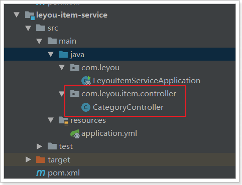

controller代码：

```java
@Controller
@RequestMapping("category")
public class CategoryController {

    @Autowired
    private CategoryService categoryService;

    /**
     * 根据父id查询子节点
     * @param pid
     * @return
     */
    @GetMapping("list")
    public ResponseEntity<List<Category>> queryCategoriesByPid(@RequestParam("pid") Long pid) {

        if (pid == null || pid.longValue() < 0) {
            // 响应400，相当于ResponseEntity.status(HttpStatus.BAD_REQUEST).build();
            return ResponseEntity.badRequest().build();
        }
        List<Category> categories = this.categoryService.queryCategoriesByPid(pid);
        if (CollectionUtils.isEmpty(categories)) {
            // 响应404
            return ResponseEntity.notFound().build();
        }
        return ResponseEntity.ok(categories);
    }
}
```


### 4.2.4.service

一般service层我们会定义接口和实现类，不过这里我们就偷懒一下，直接写实现类了：

 

```java
@Service
public class CategoryService {

    @Autowired
    private CategoryMapper categoryMapper;

    /**
     * 根据parentId查询子类目
     * @param pid
     * @return
     */
    public List<Category> queryCategoriesByPid(Long pid) {
        Category record = new Category();
        record.setParentId(pid);
        return this.categoryMapper.select(record);
    }
}
```


### 4.2.5.mapper

我们使用通用mapper来简化开发：

```java
public interface CategoryMapper extends Mapper<Category> {
}
```

要注意，我们并没有在mapper接口上声明@Mapper注解，那么mybatis如何才能找到接口呢？

我们在启动类上添加一个扫描包功能：

```java
@SpringBootApplication
@EnableDiscoveryClient
@MapperScan("com.leyou.item.mapper") // mapper接口的包扫描
public class LeyouItemServiceApplication {

    public static void main(String[] args) {
        SpringApplication.run(LeyouItemServiceApplication.class, args);
    }
}
```


### 4.2.6.启动并测试

我们不经过网关，直接访问：http://localhost:8081/category/list

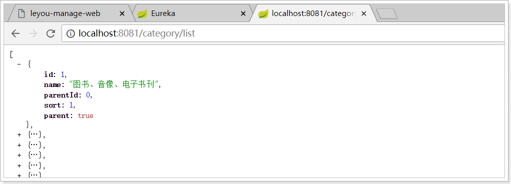

然后试试网关是否畅通：http://api.leyou.com/api/item/category/list

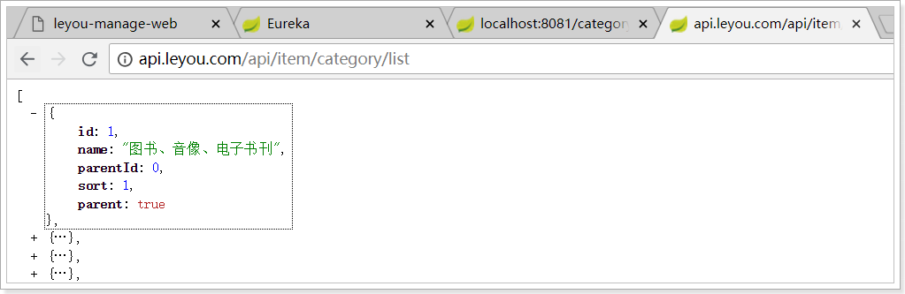

一切OK！

然后刷新后台管理页面查看：


发现报错了！

浏览器直接访问没事，但是这里却报错，什么原因？

这其实是浏览器的同源策略造成的跨域问题。


# 5.跨域问题

跨域：浏览器对于javascript的同源策略的限制 。

以下情况都属于跨域：

| 跨域原因说明       | 示例                                   |
| ------------------ | -------------------------------------- |
| 域名不同           | `www.jd.com` 与 `www.taobao.com`       |
| 域名相同，端口不同 | `www.jd.com:8080` 与 `www.jd.com:8081` |
| 二级域名不同       | `item.jd.com` 与 `miaosha.jd.com`      |

如果**域名和端口都相同，但是请求路径不同**，不属于跨域，如：

`www.jd.com/item` 

`www.jd.com/goods`

http和https也属于跨域

而我们刚才是从`manage.leyou.com`去访问`api.leyou.com`，这属于二级域名不同，跨域了。


## 5.1.为什么有跨域问题？

跨域不一定都会有跨域问题。

因为跨域问题是浏览器对于ajax请求的一种安全限制：**一个页面发起的ajax请求，只能是与当前页域名相同的路径**，这能有效的阻止跨站攻击。

因此：**跨域问题 是针对ajax的一种限制**。

但是这却给我们的开发带来了不便，而且在实际生产环境中，肯定会有很多台服务器之间交互，地址和端口都可能不同，怎么办？


## 5.2.解决跨域问题的方案

目前比较常用的跨域解决方案有3种：

- Jsonp

  最早的解决方案，利用script标签可以跨域的原理实现。

  限制：

  - 需要服务的支持
  - 只能发起GET请求

- nginx反向代理

  思路是：利用nginx把跨域反向代理为不跨域，支持各种请求方式

  缺点：需要在nginx进行额外配置，语义不清晰 

- CORS

  规范化的跨域请求解决方案，安全可靠。

  优势：

  - 在服务端进行控制是否允许跨域，可自定义规则
  - 支持各种请求方式

  缺点：

  - 会产生额外的请求

我们这里会采用cors的跨域方案。


## 5.3.cors解决跨域

### 5.3.1.什么是cors

CORS是一个W3C标准，全称是"跨域资源共享"（Cross-origin resource sharing）。

它允许浏览器向跨源服务器，发出[`XMLHttpRequest`](http://www.ruanyifeng.com/blog/2012/09/xmlhttprequest_level_2.html)请求，从而克服了AJAX只能[同源](http://www.ruanyifeng.com/blog/2016/04/same-origin-policy.html)使用的限制。

CORS需要浏览器和服务器同时支持。目前，所有浏览器都支持该功能，IE浏览器不能低于IE10。

- 浏览器端：

  目前，所有浏览器都支持该功能（IE10以下不行）。整个CORS通信过程，都是浏览器自动完成，不需要用户参与。

- 服务端：

  CORS通信与AJAX没有任何差别，因此你不需要改变以前的业务逻辑。只不过，浏览器会在请求中携带一些头信息，我们需要以此判断是否允许其跨域，然后在响应头中加入一些信息即可。这一般通过过滤器完成即可。


### 5.3.2.原理有点复杂

浏览器会将ajax请求分为两类，其处理方案略有差异：简单请求、特殊请求。

#### 5.3.2.1.简单请求

只要同时满足以下两大条件，就属于简单请求。：

（1) 请求方法是以下三种方法之一：

- HEAD
- GET
- POST

（2）HTTP的头信息不超出以下几种字段：

- Accept
- Accept-Language
- Content-Language
- Last-Event-ID
- Content-Type：只限于三个值`application/x-www-form-urlencoded`、`multipart/form-data`、`text/plain`


当浏览器发现发起的ajax请求是简单请求时，会在请求头中携带一个字段：`Origin`.


Origin中会指出当前请求属于哪个域（协议+域名+端口）。服务会根据这个值决定是否允许其跨域。

如果服务器允许跨域，需要在返回的响应头中携带下面信息：

```http
Access-Control-Allow-Origin: http://manage.leyou.com
Access-Control-Allow-Credentials: true
Content-Type: text/html; charset=utf-8
```

- Access-Control-Allow-Origin：可接受的域，是一个具体域名或者*（代表任意域名）
- Access-Control-Allow-Credentials：是否允许携带cookie，默认情况下，cors不会携带cookie，除非这个值是true

> 有关cookie：

要想操作cookie，需要满足3个条件：

- 服务的响应头中需要携带Access-Control-Allow-Credentials并且为true。
- 浏览器发起ajax需要指定withCredentials 为true
- 响应头中的Access-Control-Allow-Origin一定不能为*，必须是指定的域名


#### 5.3.2.2.特殊请求

不符合简单请求的条件，会被浏览器判定为特殊请求,，例如请求方式为PUT。

> 预检请求

特殊请求会在正式通信之前，增加一次HTTP查询请求，称为"预检"请求（preflight）。

浏览器先询问服务器，当前网页所在的域名是否在服务器的许可名单之中，以及可以使用哪些HTTP动词和头信息字段。只有得到肯定答复，浏览器才会发出正式的`XMLHttpRequest`请求，否则就报错。

一个“预检”请求的样板：

```http
OPTIONS /cors HTTP/1.1
Origin: http://manage.leyou.com
Access-Control-Request-Method: PUT
Access-Control-Request-Headers: X-Custom-Header
Host: api.leyou.com
Accept-Language: en-US
Connection: keep-alive
User-Agent: Mozilla/5.0...
```

与简单请求相比，除了Origin以外，多了两个头：

- Access-Control-Request-Method：接下来会用到的请求方式，比如PUT
- Access-Control-Request-Headers：会额外用到的头信息

> 预检请求的响应

服务的收到预检请求，如果许可跨域，会发出响应：

```http
HTTP/1.1 200 OK
Date: Mon, 01 Dec 2008 01:15:39 GMT
Server: Apache/2.0.61 (Unix)
Access-Control-Allow-Origin: http://manage.leyou.com
Access-Control-Allow-Credentials: true
Access-Control-Allow-Methods: GET, POST, PUT
Access-Control-Allow-Headers: X-Custom-Header
Access-Control-Max-Age: 1728000
Content-Type: text/html; charset=utf-8
Content-Encoding: gzip
Content-Length: 0
Keep-Alive: timeout=2, max=100
Connection: Keep-Alive
Content-Type: text/plain
```

除了`Access-Control-Allow-Origin`和`Access-Control-Allow-Credentials`以外，这里又额外多出3个头：

- Access-Control-Allow-Methods：允许访问的方式
- Access-Control-Allow-Headers：允许携带的头
- Access-Control-Max-Age：本次许可的有效时长，单位是秒，**过期之前的ajax请求就无需再次进行预检了**


如果浏览器得到上述响应，则认定为可以跨域，后续就跟简单请求的处理是一样的了。


### 5.3.3.实现非常简单

虽然原理比较复杂，但是前面说过：

- 浏览器端都有浏览器自动完成，我们无需操心
- 服务端可以通过拦截器统一实现，不必每次都去进行跨域判定的编写。

事实上，SpringMVC已经帮我们写好了CORS的跨域过滤器：CorsFilter ,内部已经实现了刚才所讲的判定逻辑，我们直接用就好了。

在`leyou-gateway`中编写一个配置类，并且注册CorsFilter：

```java
import org.springframework.context.annotation.Bean;
import org.springframework.context.annotation.Configuration;
import org.springframework.web.cors.CorsConfiguration;
import org.springframework.web.cors.UrlBasedCorsConfigurationSource;
import org.springframework.web.filter.CorsFilter;

@Configuration
public class LeyouCorsConfig {
    @Bean
    public CorsFilter corsFilter() {
        //1.添加CORS配置信息
        CorsConfiguration config = new CorsConfiguration();
        //1) 允许的域,不要写*，否则cookie就无法使用了
        config.addAllowedOrigin("http://manage.leyou.com");
        //2) 是否发送Cookie信息
        config.setAllowCredentials(true);
        //3) 允许的请求方式
        config.addAllowedMethod("OPTIONS");
        config.addAllowedMethod("HEAD");
        config.addAllowedMethod("GET");
        config.addAllowedMethod("PUT");
        config.addAllowedMethod("POST");
        config.addAllowedMethod("DELETE");
        config.addAllowedMethod("PATCH");
        // 4）允许的头信息
        config.addAllowedHeader("*");

        //2.添加映射路径，我们拦截一切请求
        UrlBasedCorsConfigurationSource configSource = new UrlBasedCorsConfigurationSource();
        configSource.registerCorsConfiguration("/**", config);

        //3.返回新的CorsFilter.
        return new CorsFilter(configSource);
    }
}
```

结构：

 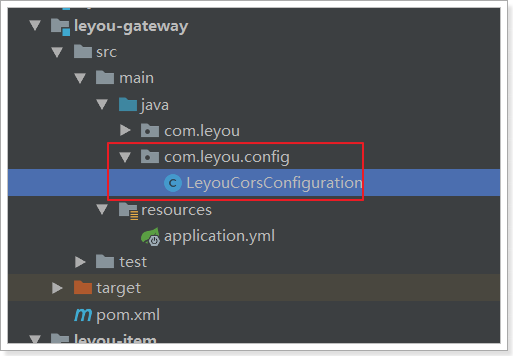


重启测试，访问正常：

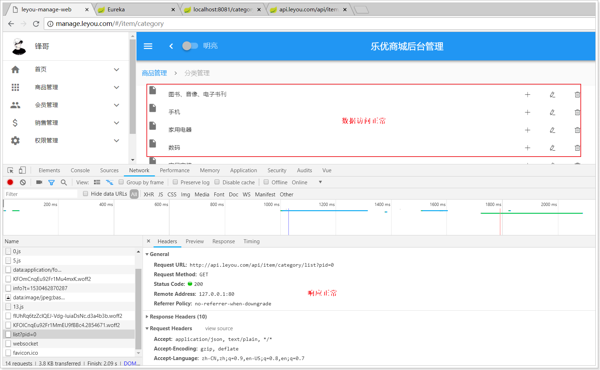

分类的增删改功能暂时就不做了，页面已经预留好了事件接口，有兴趣的同学可以完成一下。


# 6.品牌的查询

商品分类完成以后，自然轮到了品牌功能了。

先看看我们要实现的效果：

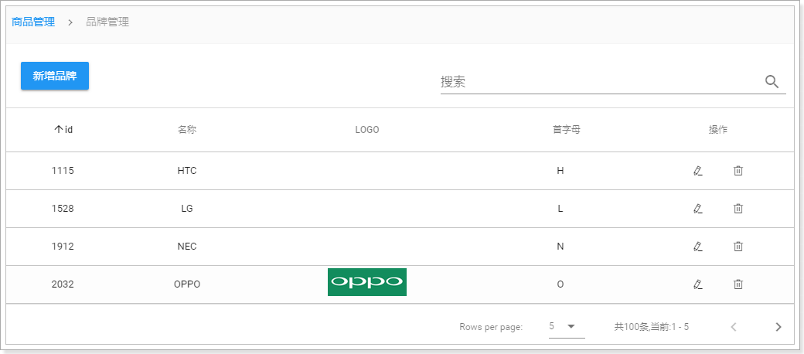

点击“品牌管理”菜单：

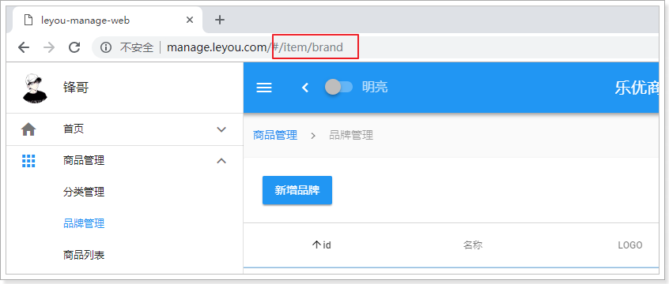

路由路径：/item/brand

根据路由文件知，对应的页面是：src/pages/item/Brand.vue

页面会发送如下请求：

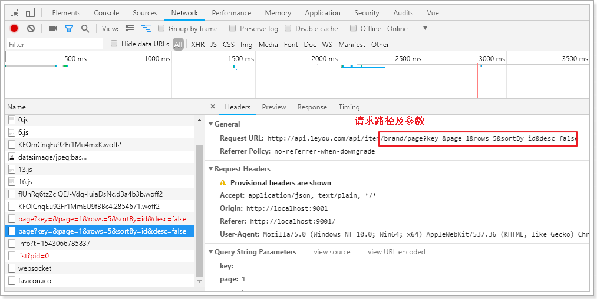


## 6.1.后台提供查询接口

前台页面已经准备好，接下来就是后台提供数据接口了。

### 6.1.1.数据库表

```mysql
CREATE TABLE `tb_brand` (
  `id` bigint(20) NOT NULL AUTO_INCREMENT COMMENT '品牌id',
  `name` varchar(50) NOT NULL COMMENT '品牌名称',
  `image` varchar(200) DEFAULT '' COMMENT '品牌图片地址',
  `letter` char(1) DEFAULT '' COMMENT '品牌的首字母',
  PRIMARY KEY (`id`)
) ENGINE=InnoDB AUTO_INCREMENT=325400 DEFAULT CHARSET=utf8 COMMENT='品牌表，一个品牌下有多个商品（spu），一对多关系';
```

简单的四个字段，不多解释。

这里需要注意的是，品牌和商品分类之间是多对多关系。因此我们有一张中间表，来维护两者间关系：

```mysql
CREATE TABLE `tb_category_brand` (
  `category_id` bigint(20) NOT NULL COMMENT '商品类目id',
  `brand_id` bigint(20) NOT NULL COMMENT '品牌id',
  PRIMARY KEY (`category_id`,`brand_id`)
) ENGINE=InnoDB DEFAULT CHARSET=utf8 COMMENT='商品分类和品牌的中间表，两者是多对多关系';

```

但是，你可能会发现，这张表中并**没有设置外键约束**，似乎与数据库的设计范式不符。为什么这么做？

- 外键会严重影响数据库读写的效率
- 数据删除时会比较麻烦

在电商行业，性能是非常重要的。我们宁可在代码中通过逻辑来维护表关系，也不设置外键。


### 6.1.2.实体类

 

```java
@Table(name = "tb_brand")
public class Brand {
    @Id
    @GeneratedValue(strategy = GenerationType.IDENTITY)
    private Long id;
    private String name;// 品牌名称
    private String image;// 品牌图片
    private Character letter;
    // getter setter 略
}
```


### 6.1.3.mapper

 

通用mapper来简化开发：

```java
public interface BrandMapper extends Mapper<Brand> {
}
```

### 6.1.4.controller

编写controller先思考四个问题，参照前端页面的控制台

- 请求方式：查询，肯定是Get
- 请求路径：分页查询，/brand/page
- 请求参数：根据我们刚才编写的页面，有分页功能，有排序功能，有搜索过滤功能，因此至少要有5个参数：
  - page：当前页，int
  - rows：每页大小，int
  - sortBy：排序字段，String
  - desc：是否为降序，boolean
  - key：搜索关键词，String
- 响应结果：分页结果一般至少需要两个数据
  - total：总条数
  - items：当前页数据
  - totalPage：有些还需要总页数

这里我们封装一个类，来表示分页结果：

```java
public class PageResult<T> {
    private Long total;// 总条数
    private Integer totalPage;// 总页数
    private List<T> items;// 当前页数据

    public PageResult() {
    }

    public PageResult(Long total, List<T> items) {
        this.total = total;
        this.items = items;
    }

    public PageResult(Long total, Long totalPage, List<T> items) {
        this.total = total;
        this.totalPage = totalPage;
        this.items = items;
    }

    public Long getTotal() {
        return total;
    }

    public void setTotal(Long total) {
        this.total = total;
    }

    public List<T> getItems() {
        return items;
    }

    public void setItems(List<T> items) {
        this.items = items;
    }

    public Long getTotalPage() {
        return totalPage;
    }

    public void setTotalPage(Long totalPage) {
        this.totalPage = totalPage;
    }
}
```

另外，这个PageResult以后可能在其它项目中也有需求，因此我们将其抽取到`leyou-common`中，提高复用性：

 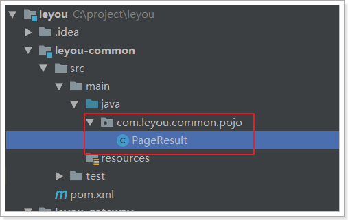

**不要忘记在leyou-item-service工程的pom.xml中引入leyou-common的依赖**：

```xml
<dependency>
    <groupId>com.leyou.common</groupId>
    <artifactId>leyou-common</artifactId>
    <version>1.0.0-SNAPSHOT</version>
</dependency>
```


接下来，我们编写Controller

 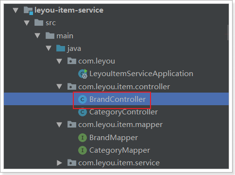

```java
@RestController
@RequestMapping("brand")
public class BrandController {

    @Autowired
    private BrandService brandService;

        /**
     * 根据查询条件分页并排序查询品牌信息
     * @param key
     * @param page
     * @param rows
     * @param sortBy
     * @param desc
     * @return
     */
    @GetMapping("page")
    public ResponseEntity<PageResult<Brand>> queryBrandsByPage(
            @RequestParam(value = "key", required = false)String key,
            @RequestParam(value = "page", defaultValue = "1")Integer page,
            @RequestParam(value = "rows", defaultValue = "5")Integer rows,
            @RequestParam(value = "sortBy", required = false)String sortBy,
            @RequestParam(value = "desc", required = false)Boolean desc
    ){
        PageResult<Brand> result = this.brandService.queryBrandsByPage(key, page, rows, sortBy, desc);
        if (CollectionUtils.isEmpty(result.getItems())){
            return ResponseEntity.notFound().build();
        }
        return ResponseEntity.ok(result);
    }
}
```


### 6.1.5.Service

```java
@Service
public class BrandService {

    @Autowired
    private BrandMapper brandMapper;

    /**
     * 根据查询条件分页并排序查询品牌信息
     *
     * @param key
     * @param page
     * @param rows
     * @param sortBy
     * @param desc
     * @return
     */
    public PageResult<Brand> queryBrandsByPage(String key, Integer page, Integer rows, String sortBy, Boolean desc) {

        // 初始化example对象
        Example example = new Example(Brand.class);
        Example.Criteria criteria = example.createCriteria();

        // 根据name模糊查询，或者根据首字母查询
        if (StringUtils.isNotBlank(key)) {
            criteria.andLike("name", "%" + key + "%").orEqualTo("letter", key);
        }

        // 添加分页条件
        PageHelper.startPage(page, rows);

        // 添加排序条件
        if (StringUtils.isNotBlank(sortBy)) {
            example.setOrderByClause(sortBy + " " + (desc ? "desc" : "asc"));
        }

        List<Brand> brands = this.brandMapper.selectByExample(example);
        // 包装成pageInfo
        PageInfo<Brand> pageInfo = new PageInfo<>(brands);
        // 包装成分页结果集返回
        return new PageResult<>(pageInfo.getTotal(), pageInfo.getList());
    }
}
```


### 6.1.6.测试

通过浏览器访问试试：http://api.leyou.com/api/item/brand/page


接下来，去页面请求数据并渲染


## 6.2.异步查询工具axios

异步查询数据，自然是通过ajax查询，大家首先想起的肯定是jQuery。但jQuery与MVVM的思想不吻合，而且ajax只是jQuery的一小部分。因此不可能为了发起ajax请求而去引用这么大的一个库。

### 6.2.1.axios入门

Vue官方推荐的ajax请求框架叫做：axios，看下demo：

 

axios的Get请求语法：

```js
axios.get("/item/category/list?pid=0") // 请求路径和请求参数拼接
    .then(function(resp){
    	// 成功回调函数
	})
    .catch(function(){
    	// 失败回调函数
	})
// 参数较多时，可以通过params来传递参数
axios.get("/item/category/list", {
        params:{
            pid:0
        }
	})
    .then(function(resp){})// 成功时的回调
    .catch(function(error){})// 失败时的回调
```

axios的POST请求语法：

比如新增一个用户

```js
axios.post("/user",{
    	name:"Jack",
    	age:21
	})
    .then(function(resp){})
    .catch(function(error){})
```

注意，POST请求传参，不需要像GET请求那样定义一个对象，在对象的params参数中传参。post()方法的第二个参数对象，就是将来要传递的参数

PUT和DELETE请求与POST请求类似

### 6.2.2.axios的全局配置

而在我们的项目中，已经引入了axios，并且进行了简单的封装，在src下的http.js中：

 

http.js中对axios进行了一些默认配置：

```js
import Vue from 'vue'
import axios from 'axios'
import config from './config'
// config中定义的基础路径是：http://api.leyou.com/api
axios.defaults.baseURL = config.api; // 设置axios的基础请求路径
axios.defaults.timeout = 2000; // 设置axios的请求时间

Vue.prototype.$http = axios;// 将axios赋值给Vue原型的$http属性，这样所有vue实例都可使用该对象
```

- http.js中导入了config的配置，还记得吗？

     

- http.js对axios进行了全局配置：`baseURL=config.api`，即`http://api.leyou.com/api`。因此以后所有用axios发起的请求，都会以这个地址作为前缀。

- 通过`Vue.property.$http = axios`，将`axios`赋值给了 Vue原型中的`$http`。这样以后所有的Vue实例都可以访问到$http，也就是访问到了axios了。


### 6.2.3.项目中使用

我们在组件`Brand.vue`的getDataFromServer方法，通过$http发起get请求，测试查询品牌的接口，看是否能获取到数据：

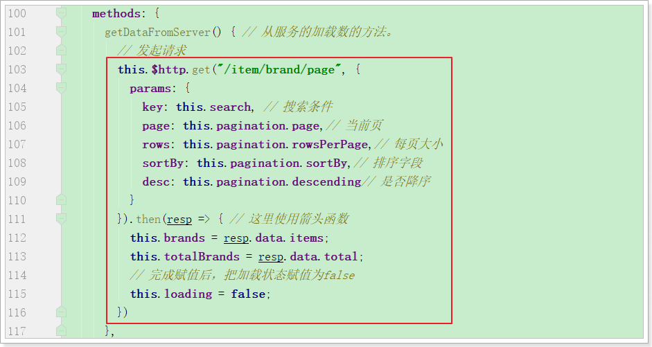

网络监视：

 

resp到底都有那些数据，查看控制台结果：

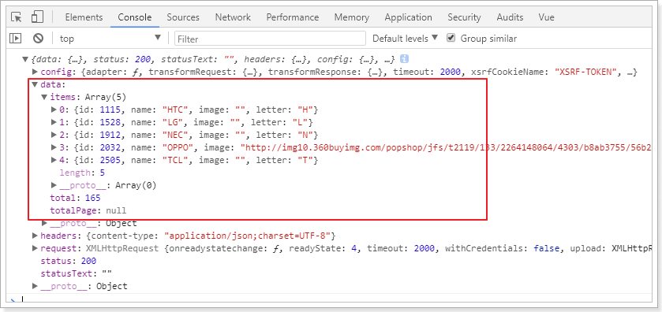

可以看到，在请求成功的返回结果response中，有一个data属性，里面就是真正的响应数据。

响应结果中与我们设计的一致，包含3个内容：

- total：总条数，目前是165
- items：当前页数据
- totalPage：总页数，我们没有返回


## 6.3.完成分页和过滤

### 6.3.1.分页

点击分页，会发起请求，通过浏览器工具查看，会发现pagination对象的属性一直在变化：

 

我们可以利用Vue的监视功能：watch，当pagination发生改变时，会调用我们的回调函数，我们在回调函数中进行数据的查询！

具体实现：

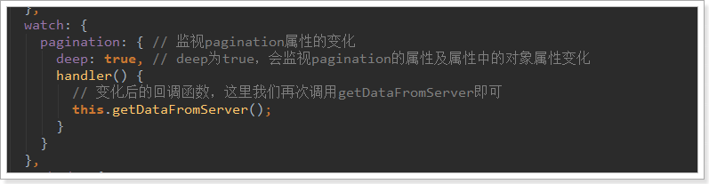

成功实现分页功能：


### 6.3.2.过滤

过滤字段对应的是search属性，我们只要监视这个属性即可:

 

查看网络请求：

 

页面结果：


