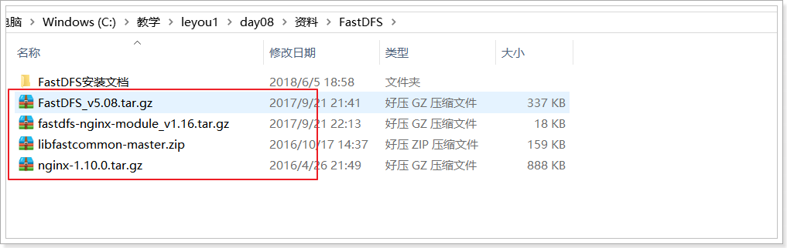
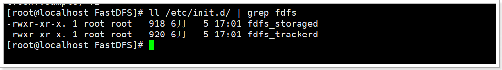
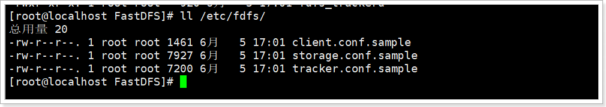
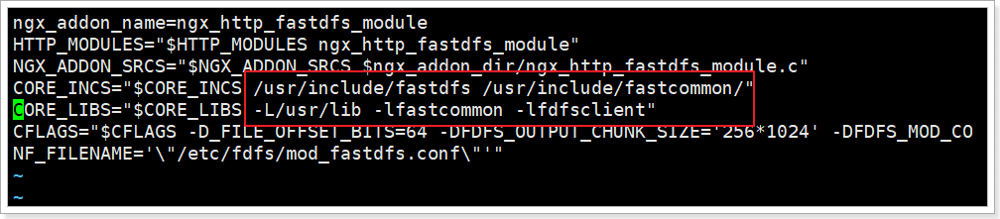
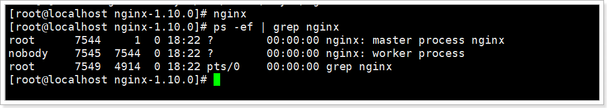

# 1.Linux下使用FastDFS

**本教程所有操作均在CentOS 6.x环境下进行。**

将课前资料中的所需文件，上传到/usr/local/leyou目录下：



  

## 1.1.单节点FastDFS

整个安装过程非常复杂，很容易出错，建议进行多次备份。

我们这里不打算安装多台虚拟机，因此会把tracker和storage都安装在一起。

 

### 1.1.1.安装gcc

GCC用来对C语言代码进行编译运行，使用yum命令安装：

```shell
yum -y install gcc
```

后面会用到解压命令（unzip），所以这里可以用yum把unzip 也装一下

```shell
yum install -y unzip zip
```

 

### 1.1.2.安装libevent

```shell
yum -y install libevent
```

 

### 1.1.3.安装libfastcommon-master

```shell
解压刚刚上传的libfastcommon-master.zip
unzip libfastcommon-master.zip

进入解压完成的目录
cd libfastcommon-master

编译并且安装：
./make.sh 
./make.sh install
```

 

### 1.1.4.安装fastdfs

```shell
tar -zxvf FastDFS_v5.08.tar.gz

cd FastDFS

./make.sh 

./make.sh install
```

 

如果安装成功，会看到/etc/init.d/下看到提供的脚本文件：

```shell
ll /etc/init.d/ | grep fdfs
```



- `fdfs_trackerd` 是tracker启动脚本
- `fdfs_storaged` 是storage启动脚本


能够在 /etc/fdfs/ 目录下看到默认的配置文件模板：

```shell
ll /etc/fdfs/
```



- `tarcker.conf.sample` 是tracker的配置文件模板
- `storage.conf.sample` 是storage的配置文件模板
- `client.conf.sample` 是客户端的配置文件模板


### 1.1.5.配置并启动tracker服务

FastDFS的tracker和storage在刚刚的安装过程中，都已经被安装了，因此我们安装这两种角色的方式是一样的。不同的是，两种需要不同的配置文件。

我们要启动tracker，就修改刚刚看到的`tarcker.conf`，并且启动`fdfs_trackerd`脚本即可。

1）首先将模板文件复制

```shell
cp /etc/fdfs/tracker.conf.sample /etc/fdfs/tracker.conf
```

 

2）修改复制后的配置文件：

```shell
vim /etc/fdfs/tracker.conf 
```

\# 修改的内容如下：

```shell
base_path=/leyou/tracker                 # 存储日志和数据的根目录
```


3）新建目录：     

```shell
mkdir -p /leyou/tracker
```

 

注意：关闭防火墙：

```shell
chkconfig iptables off
```

 

4）启动和停止

启动tracker服务器:     `/etc/init.d/fdfs_trackerd start`

停止tracker服务器:     `/etc/init.d/fdfs_trackerd stop`

不过安装过程中，fdfs已经被设置为系统服务，我们可以采用熟悉的服务启动方式：

```shell
service fdfs_trackerd start # 启动fdfs_trackerd服务，停止用stop
```


检查FastDFS Tracker Server是否启动成功：

```shell
ps -ef | grep fdfs_trackerd
```


设置tracker服务开机启动:

```shell
chkconfig fdfs_trackerd on
```

 

### 1.1.6.配置并启动storage服务

1）首先将模板文件复制

```shell
cp /etc/fdfs/storage.conf.sample /etc/fdfs/storage.conf
```

 

2）修改复制后的配置文件：

```shell
vim /etc/fdfs/storage.conf
```

\# 修改的内容如下: 

```shell
base_path=/leyou/storage                 # 数据和日志文件存储根目录 

store_path0=/leyou/storage           # 第一个存储目录 

tracker_server=192.168.56.101:22122       #  tracker服务器IP和端口 
```


3）新建目录：     

```
mkdir -p /leyou/storage
```

 

注意关闭防火墙：   `chkconfig iptables off`

 

4）启动和停止

启动storage服务器：`/etc/init.d/fdfs_storaged start`

停止storage服务器：`/etc/init.d/fdfs_storaged stop`

推荐使用：

```shell
service fdfs_storaged start  # 启动fdfs_storaged服务，停止用stop
```


设置storage服务开机启动：

```
chkconfig fdfs_storaged on
```


ps -ef | grep fdfs


# 2.使用nginx访问FastDFS

## 2.1.为什么需要用Nginx访问？

FastDFS通过Tracker服务器,将文件放在Storage服务器存储，但是同组存储服务器之间需要进入文件复制，有同步延迟的问题。

假设Tracker服务器将文件上传到了192.168.4.125，上传成功后文件ID已经返回给客户端。此时FastDFS存储集群机制会将这个文件同步到同组存储192.168.4.126，在文件还没有复制完成的情况下，客户端如果用这个文件ID在192.168.4.126上取文件,就会出现文件无法访问的错误。

而fastdfs-nginx-module可以重定向文件连接到文件上传时的源服务器取文件,避免客户端由于复制延迟导致的文件无法访问错误


## 2.2.安装fastdfs-nginx-module

### 2.2.1.解压

```shell
tar -zxvf fastdfs-nginx-module_v1.16.tar.gz
```


### 2.2.2.修改config

1）进入src目录

```shell
cd fastdfs-nginx-module/src/
```

 

2）编辑config

```shell
vim config
```

 

使用以下底行命令：

```shell
:%s+/usr/local/+/usr/+g
```

将所有的/usr/local替换为 /usr，这个才是正确的目录:




### 2.2.3.配置nginx与FastDFS关联配置文件

复制 fastdfs-nginx-module 源码中的配置文件到/etc/fdfs 目录， 并修改

```shell
cp /usr/local/leyou/fastdfs-nginx-module/src/mod_fastdfs.conf /etc/fdfs/

vi /etc/fdfs/mod_fastdfs.conf
```

修改以下配置：

```shell
connect_timeout=10                       # 客户端访问文件连接超时时长（单位：秒）

tracker_server=192.168.56.101:22122    # tracker服务IP和端口

url_have_group_name=true                # 访问链接前缀加上组名

store_path0=/leyou/storage            # 文件存储路径
```


复制 FastDFS 的部分配置文件到/etc/fdfs 目录

```shell
cd /usr/local/leyou/FastDFS/conf/
cp http.conf mime.types /etc/fdfs/
```


## 2.3.安装Nginx的插件

### 2.3.1.如果没有安装过nginx

- 安装nginx的依赖库


```shell
yum -y install gcc pcre pcre-devel zlib zlib-devel openssl openssl-devel
```

 

- 解压安装包


```shell
tar -zxvf nginx-1.10.0.tar.gz
```

 

- 配置nginx安装包，并指定fastdfs-nginx-model

```shell
cd nginx-1.10.0

./configure --prefix=/opt/nginx --sbin-path=/usr/bin/nginx --add-module=/usr/local/leyou/fastdfs-nginx-module/src
```

**注意**：在执行./configure配置nginx参数的时候，需要将fastdfs-nginx-moudle源码作为模块编译进去。


- 编译并安装

```shell
make && make install
```


### 2.3.2.如果已经安装过nginx

1） 进入nginx目录：

```shell
cd /usr/local/leyou/nginx-1.10.0/
```

 

2） 配置FastDFS 模块

```shell
./configure --prefix=/opt/nginx --sbin-path=/usr/bin/nginx --add-module=/usr/local/leyou/fastdfs-nginx-module/src
```

注意：这次配置时，要添加fastdfs-nginx-moudle模块

 

3） 编译，注意，这次不要安装（install）

```shell
make
```

 

4） 替换nginx二进制文件:

备份：

```shell
mv /usr/bin/nginx /usr/bin/nginx-bak
```

用新编译的nginx启动文件替代原来的：

```shell
cp objs/nginx /usr/bin/
```

 

 

### 2.3.3.启动nginx

配置nginx整合fastdfs-module模块

我们需要修改nginx配置文件，在/opt/nginx/config/nginx.conf文件中：

```shell
vim  /opt/nginx/conf/nginx.conf
```

将文件中，原来的`server 80{ ...}` 部分代码替换为如下代码：

```nginx
    server {
        listen       80;
        server_name  image.leyou.com;

    	# 监听域名中带有group的，交给FastDFS模块处理
        location ~/group([0-9])/ {
            ngx_fastdfs_module;
        }

        location / {
            root   html;
            index  index.html index.htm;
        }

        error_page   500 502 503 504  /50x.html;
        location = /50x.html {
            root   html;
        }
    }
```


启动nginx：

```shell
nginx	# 启动nginx

nginx -s stop	# 停止nginx

nginx -s reload	# 重新载入配置文件
```

\# 可通过ps -ef | grep nginx查看nginx是否已启动成功    




### 2.3.4.设置nginx开机启动

创建一个开机启动的脚本：

```shell
vim /etc/init.d/nginx
```

添加以下内容：

```sh
#!/bin/sh
#
# nginx - this script starts and stops the nginx daemon
#
# chkconfig:   - 85 15
# description:  NGINX is an HTTP(S) server, HTTP(S) reverse \
#               proxy and IMAP/POP3 proxy server
# processname: nginx
# config:      /etc/nginx/nginx.conf
# config:      /etc/sysconfig/nginx
# pidfile:     /var/run/nginx.pid

# Source function library.
. /etc/rc.d/init.d/functions

# Source networking configuration.
. /etc/sysconfig/network

# Check that networking is up.
[ "$NETWORKING" = "no" ] && exit 0

nginx="/usr/bin/nginx"
prog=$(basename $nginx)

NGINX_CONF_FILE="/opt/nginx/conf/nginx.conf"

[ -f /etc/sysconfig/nginx ] && . /etc/sysconfig/nginx

lockfile=/var/lock/subsys/nginx

make_dirs() {
   # make required directories
   user=`$nginx -V 2>&1 | grep "configure arguments:.*--user=" | sed 's/[^*]*--user=\([^ ]*\).*/\1/g' -`
   if [ -n "$user" ]; then
      if [ -z "`grep $user /etc/passwd`" ]; then
         useradd -M -s /bin/nologin $user
      fi
      options=`$nginx -V 2>&1 | grep 'configure arguments:'`
      for opt in $options; do
          if [ `echo $opt | grep '.*-temp-path'` ]; then
              value=`echo $opt | cut -d "=" -f 2`
              if [ ! -d "$value" ]; then
                  # echo "creating" $value
                  mkdir -p $value && chown -R $user $value
              fi
          fi
       done
    fi
}

start() {
    [ -x $nginx ] || exit 5
    [ -f $NGINX_CONF_FILE ] || exit 6
    make_dirs
    echo -n $"Starting $prog: "
    daemon $nginx -c $NGINX_CONF_FILE
    retval=$?
    echo
    [ $retval -eq 0 ] && touch $lockfile
    return $retval
}

stop() {
    echo -n $"Stopping $prog: "
    killproc $prog -QUIT
    retval=$?
    echo
    [ $retval -eq 0 ] && rm -f $lockfile
    return $retval
}

restart() {
    configtest || return $?
    stop
    sleep 1
    start
}

reload() {
    configtest || return $?
    echo -n $"Reloading $prog: "
    killproc $nginx -HUP
    RETVAL=$?
    echo
}

force_reload() {
    restart
}

configtest() {
  $nginx -t -c $NGINX_CONF_FILE
}

rh_status() {
    status $prog
}

rh_status_q() {
    rh_status >/dev/null 2>&1
}

case "$1" in
    start)
        rh_status_q && exit 0
        $1
        ;;
    stop)
        rh_status_q || exit 0
        $1
        ;;
    restart|configtest)
        $1
        ;;
    reload)
        rh_status_q || exit 7
        $1
        ;;
    force-reload)
        force_reload
        ;;
    status)
        rh_status
        ;;
    condrestart|try-restart)
        rh_status_q || exit 0
            ;;
    *)
        echo $"Usage: $0 {start|stop|status|restart|condrestart|try-restart|reload|force-reload|configtest}"
        exit 2
esac

```

修改文件权限，并加入服务列表

```shell
# 修改权限
chmod 777 /etc/init.d/nginx 
# 添加到服务列表
chkconfig --add /etc/init.d/nginx 
```

设置开机启动

```shell
chkconfig nginx on
```

