# 0.学习目标

- 独立实现品牌新增
- 实现图片上传
- 了解FastDFS的安装
- 使用FastDFS客户端实现上传


# 1.品牌的新增

昨天我们完成了品牌的查询，接下来就是新增功能。点击新增品牌按钮

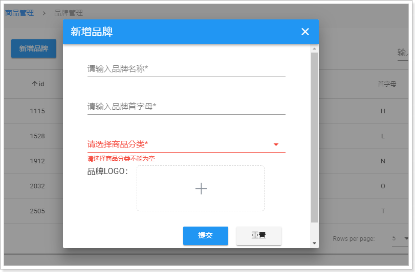

Brand.vue页面有一个提交按钮：

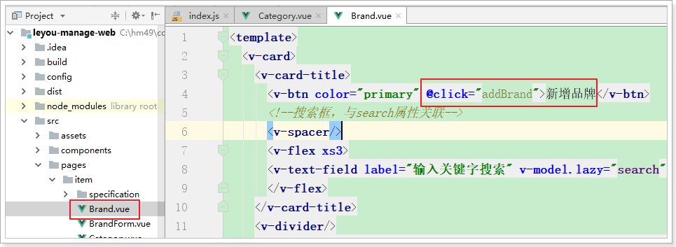

点击触发addBrand方法：

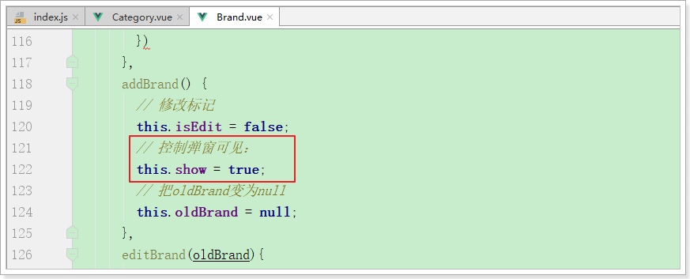

把数据模型之的show置为true，而页面中有一个弹窗与show绑定：

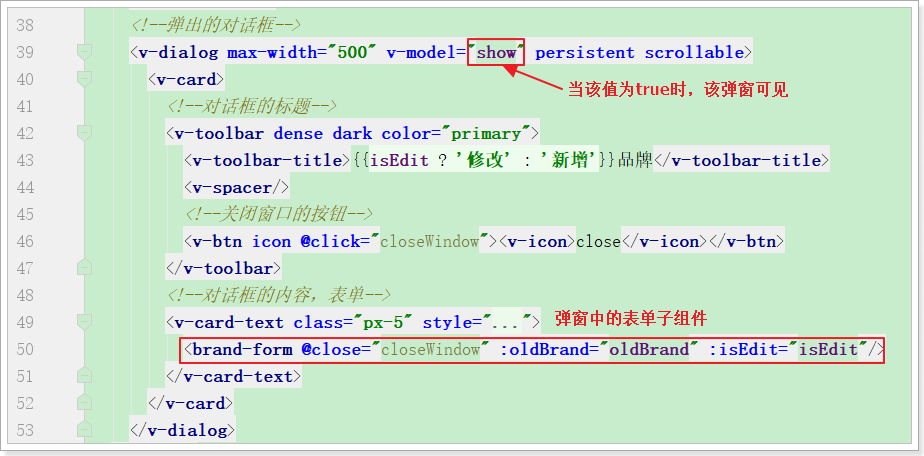

弹窗中有一个表单子组件，并且是一个局部子组件，有页面可以找到该组件：

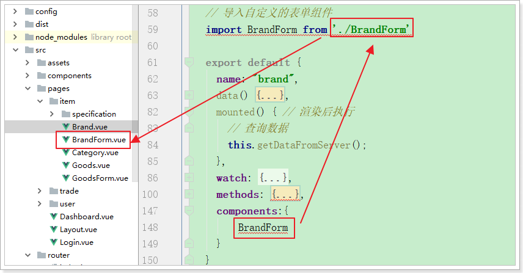


## 1.1.页面实现

### 1.1.1.重置表单

重置表单相对简单，因为v-form组件已经提供了reset方法，用来清空表单数据。只要我们拿到表单组件对象，就可以调用方法了。

我们可以通过`$refs`内置对象来获取表单组件。

首先，在表单上定义`ref`属性：

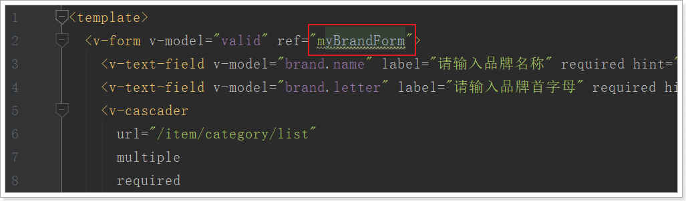

然后，在页面查看`this.$refs`属性：

```js
      reset(){
        // 重置表单
        console.log(this);
      }
```

查看如下：

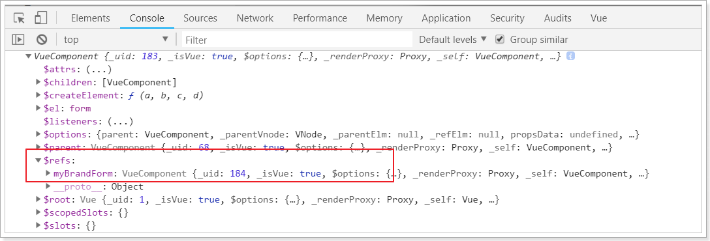

看到`this.$refs`中只有一个属性，就是`myBrandForm`

我们在clear中来获取表单对象并调用reset方法：

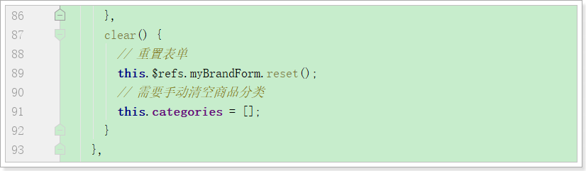

要注意的是，这里我们还手动把this.categories清空了，因为我写的级联选择组件并没有跟表单结合起来。需要手动清空。


### 1.1.2.表单校验

#### 1.1.2.1.校验规则

Vuetify的表单校验，是通过rules属性来指定的：

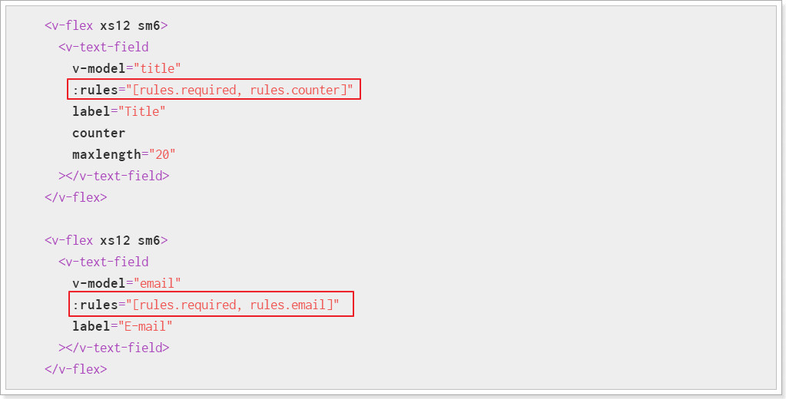

校验规则的写法：

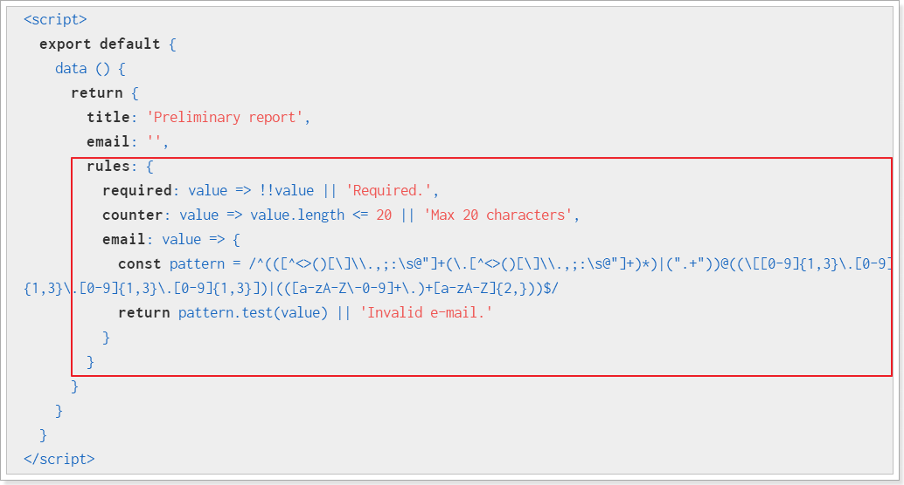

说明：

- 规则是一个数组
- 数组中的元素是一个函数，该函数接收表单项的值作为参数，函数返回值两种情况：
  - 返回true，代表成功，
  - 返回错误提示信息，代表失败


#### 1.1.2.2.编写校验

我们有四个字段：

- name：做非空校验和长度校验，长度必须大于1
- letter：首字母，校验长度为1，非空。
- image：图片，不做校验，图片可以为空
- categories：非空校验，自定义组件已经帮我们完成，不用写了

首先，我们定义规则：

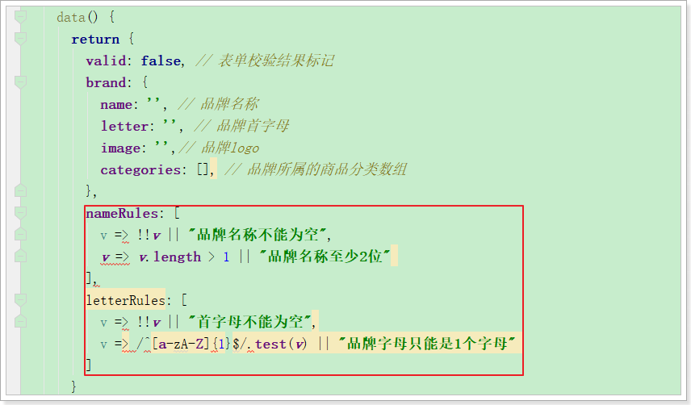

然后，在页面标签中指定：

```html
<v-text-field v-model="brand.name" label="请输入品牌名称" hint="例如：oppo" :rules="[rules.required, rules.nameLength]"></v-text-field>
<v-text-field v-model="brand.letter" label="请输入品牌首字母" hint="例如：O" :rules="[rules.letter]"></v-text-field>
```

效果：

 


### 1.1.3.表单提交

在submit方法中添加表单提交的逻辑：

```js
submit() {
    console.log(this.$qs);
    // 表单校验
    if (this.$refs.myBrandForm.validate()) {
        // 定义一个请求参数对象，通过解构表达式来获取brand中的属性{categories letter name image}
        const {categories, letter, ...params} = this.brand; // params:{name, image, cids, letter}
        // 数据库中只要保存分类的id即可，因此我们对categories的值进行处理,只保留id，并转为字符串
        params.cids = categories.map(c => c.id).join(",");
        // 将字母都处理为大写
        params.letter = letter.toUpperCase();
        // 将数据提交到后台
        // this.$http.post('/item/brand', this.$qs.stringify(params))
        this.$http({
            method: this.isEdit ? 'put' : 'post',
            url: '/item/brand',
            data: params
        }).then(() => {
            // 关闭窗口
            this.$emit("close");
            this.$message.success("保存成功！");
        })
            .catch(() => {
            this.$message.error("保存失败！");
        });
    }
}
```

1. 通过`this.$refs.myBrandForm`选中表单，然后调用表单的`validate`方法，进行表单校验。返回boolean值，true代表校验通过
2. 通过解构表达式来获取brand中的值，categories需要处理，单独获取。其它的存入params对象中
3. 品牌和商品分类的中间表只保存两者的id，而brand.categories中保存的是对象数组，里面有id和name属性，因此这里通过数组的map功能转为id数组，然后通过join方法拼接为字符串
4. 发起请求
5. 弹窗提示成功还是失败，这里用到的是我们的自定义组件功能message组件：

 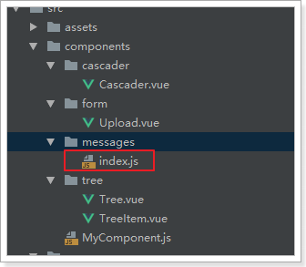

  这个插件把`$message`对象绑定到了Vue的原型上，因此我们可以通过`this.$message`来直接调用。

  包含以下常用方法：

- info、error、success、warning等，弹出一个带有提示信息的窗口，色调与为普通（灰）、错误（红色）、成功（绿色）和警告（黄色）。使用方法：this.$message.info("msg")
- confirm：确认框。用法：`this.$message.confirm("确认框的提示信息")`，返回一个Promise。


## 1.2.后台实现新增

### 1.2.1.controller

还是一样，先分析四个内容：

- 请求方式：POST
- 请求路径：/brand
- 请求参数：brand对象，外加商品分类的id数组cids
- 返回值：无，只需要响应状态码

代码：

```java
    /**
     * 新增品牌
     * @param brand
     * @param cids
     */
    @PostMapping
    public ResponseEntity<Void> saveBrand(Brand brand, @RequestParam("cids") List<Long> cids){
        this.brandService.saveBrand(brand, cids);
        return ResponseEntity.status(HttpStatus.CREATED).build();
    }
```


### 1.2.2.Service

这里要注意，我们不仅要新增品牌，还要维护品牌和商品分类的中间表。

```java
    /**
     * 新增品牌
     *
     * @param brand
     * @param cids
     */
    @Transactional
    public void saveBrand(Brand brand, List<Long> cids) {

        // 先新增brand
        this.brandMapper.insertSelective(brand);

        // 在新增中间表
        cids.forEach(cid -> {
            this.brandMapper.insertCategoryAndBrand(cid, brand.getId());
        });
    }
```

这里调用了brandMapper中的一个自定义方法，来实现中间表的数据新增

### 1.2.3.Mapper

通用Mapper只能处理单表，也就是Brand的数据，因此我们手动编写一个方法及sql，实现中间表的新增：

```java
public interface BrandMapper extends Mapper<Brand> {

    /**
     * 新增商品分类和品牌中间表数据
     * @param cid 商品分类id
     * @param bid 品牌id
     * @return
     */
    @Insert("INSERT INTO tb_category_brand(category_id, brand_id) VALUES (#{cid},#{bid})")
    int insertBrandAndCategory(@Param("cid") Long cid, @Param("bid") Long bid);
}
```


### 1.2.4.测试

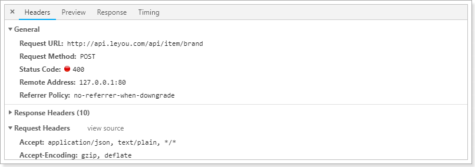

400：请求参数不合法


## 1.3.解决400

### 1.3.1.原因分析

我们填写表单并提交，发现报错了。查看控制台的请求详情：

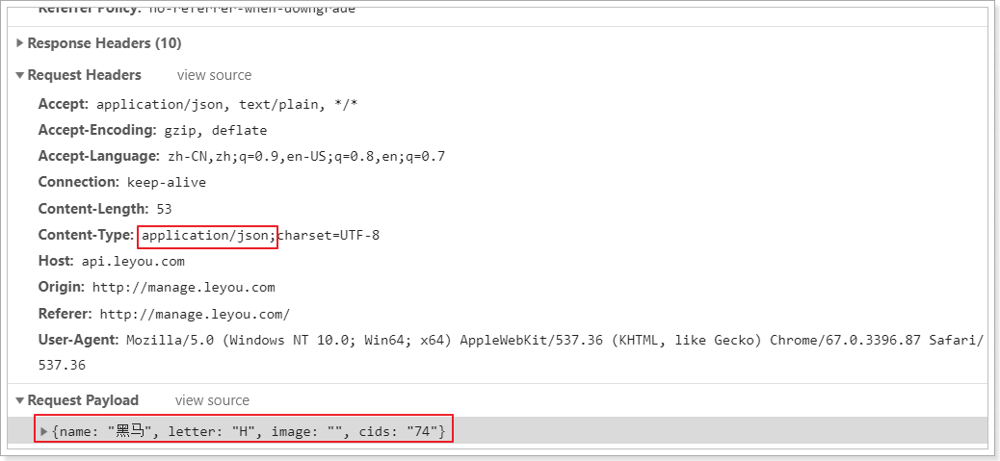


发现请求的数据格式是JSON格式。

> 原因分析：

axios处理请求体的原则会根据请求数据的格式来定：

- 如果请求体是对象：会转为json发送

- 如果请求体是String：会作为普通表单请求发送，但需要我们自己保证String的格式是键值对。

  如：name=jack&age=12


### 1.3.2.QS工具

QS是一个第三方库，我们可以用`npm install qs --save`来安装。不过我们在项目中已经集成了，大家无需安装：

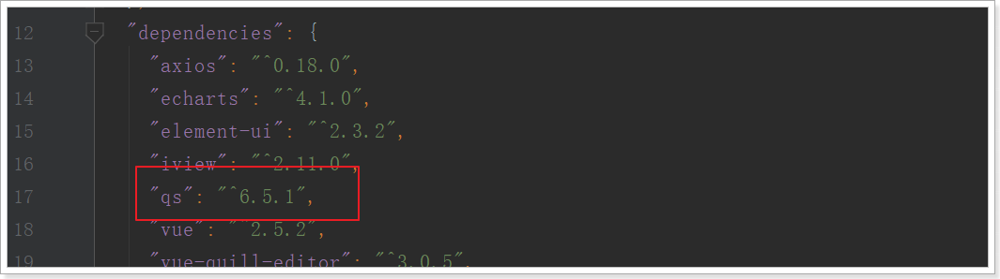

这个工具的名字：QS，即Query String，请求参数字符串。

什么是请求参数字符串？例如： name=jack&age=21

QS工具可以便捷的实现 JS的Object与QueryString的转换。


在我们的项目中，将QS注入到了Vue的原型对象中，我们可以通过`this.$qs`来获取这个工具：

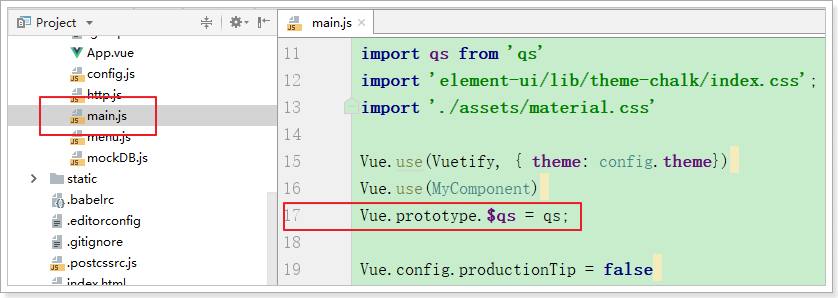

我们将`this.$qs`对象打印到控制台：

```js
created(){
    console.log(this.$qs);
}
```

发现其中有3个方法：

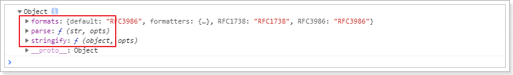

这里我们要使用的方法是stringify，它可以把Object转为QueryString。


测试一下，使用浏览器工具，把qs对象保存为一个临时变量temp1，然后调用stringify方法：

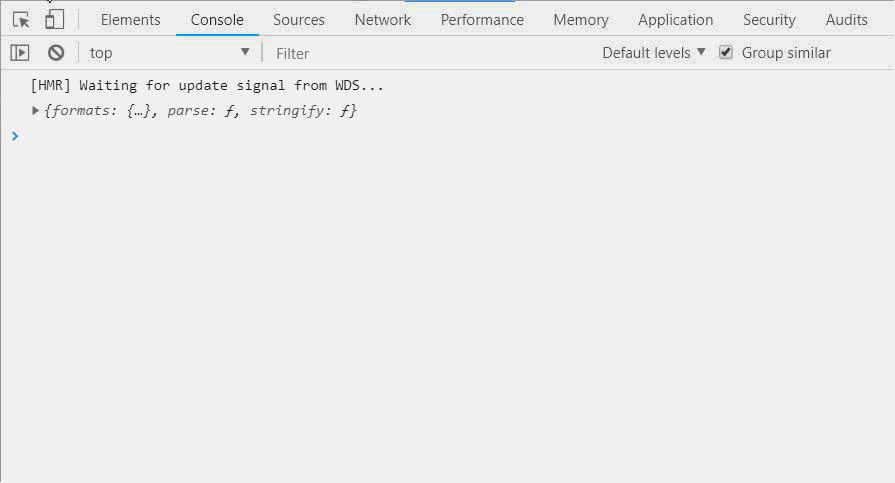

成功将person对象变成了 name=zhangsan&age=30的字符串了


### 1.3.3.解决问题

修改页面，对参数处理后发送：

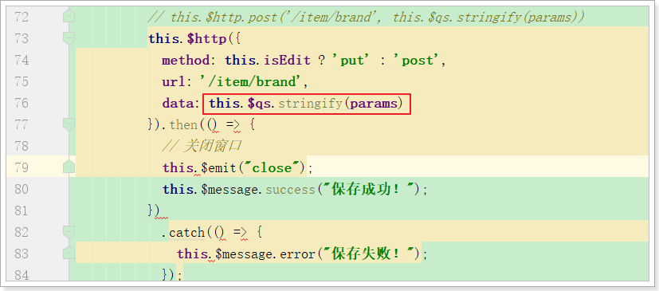

然后再次发起请求，发现请求成功：

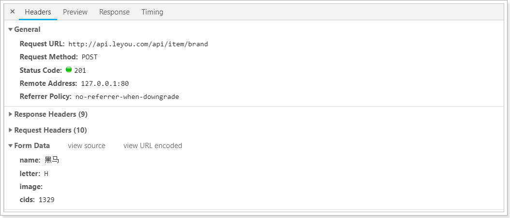


## 1.4.新增完成后关闭窗口

我们发现有一个问题：新增不管成功还是失败，窗口都一致在这里，不会关闭。

这样很不友好，我们希望如果新增失败，窗口保持；但是新增成功，窗口关闭才对。


因此，我们需要**在新增的ajax请求完成以后，关闭窗口**

但问题在于，控制窗口是否显示的标记在父组件：MyBrand.vue中。子组件如何才能操作父组件的属性？或者告诉父组件该关闭窗口了？


之前我们讲过一个父子组件的通信，有印象吗？

- 第一步：在父组件中定义一个函数，用来关闭窗口，不过之前已经定义过了。父组件在使用子组件时，绑定事件，关联到这个函数：Brand.vue

```html
<!--对话框的内容，表单-->
<v-card-text class="px-5" style="height:400px">
    <brand-form @close="closeWindow" :oldBrand="oldBrand" :isEdit="isEdit"/>
</v-card-text>
```

- 第二步，子组件通过`this.$emit`调用父组件的函数：BrandForm.vue

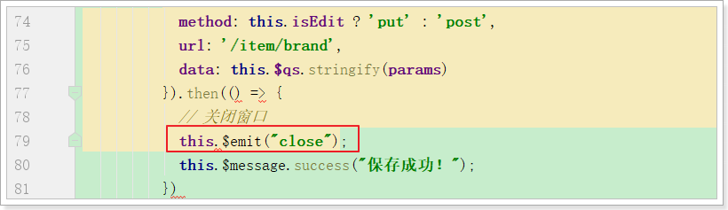


测试一下，保存成功：

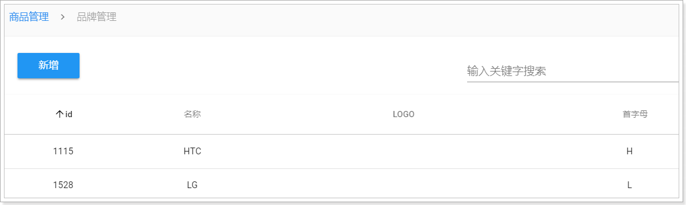


我们优化一下，关闭的同时重新加载数据：

```js
closeWindow(){
    // 关闭窗口
    this.show = false;
    // 重新加载数据
    this.getDataFromServer();
}
```


# 2.实现图片上传

刚才的新增实现中，我们并没有上传图片，接下来我们一起完成图片上传逻辑。

文件的上传并不只是在品牌管理中有需求，以后的其它服务也可能需要，因此我们创建一个独立的微服务，专门处理各种上传。

## 2.1.搭建项目

### 2.1.1.创建module

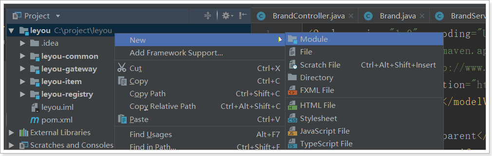

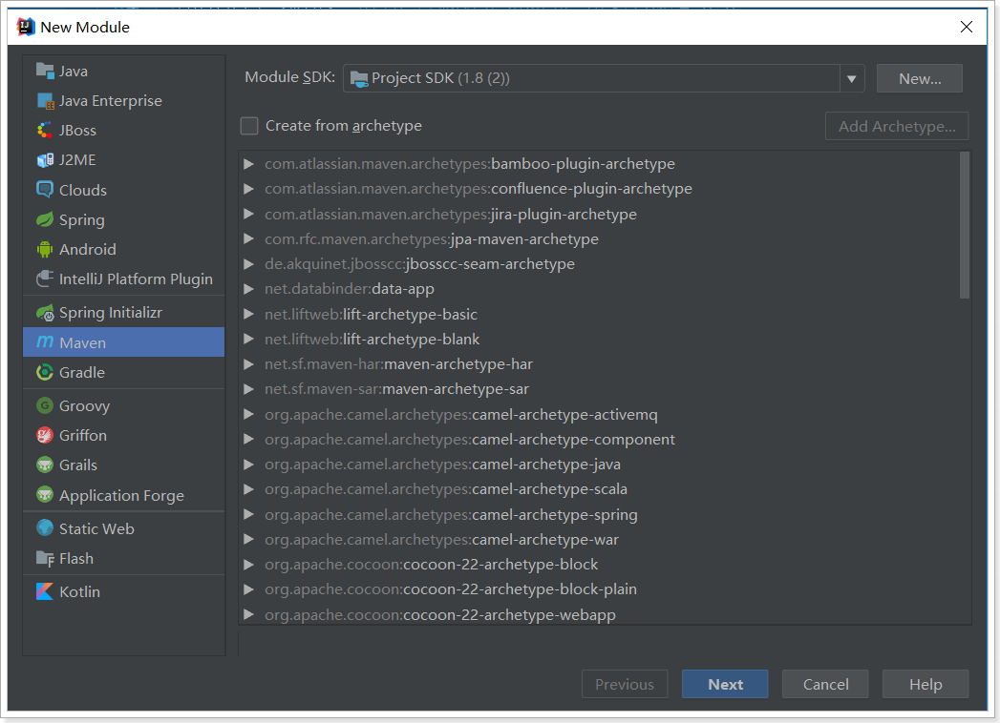

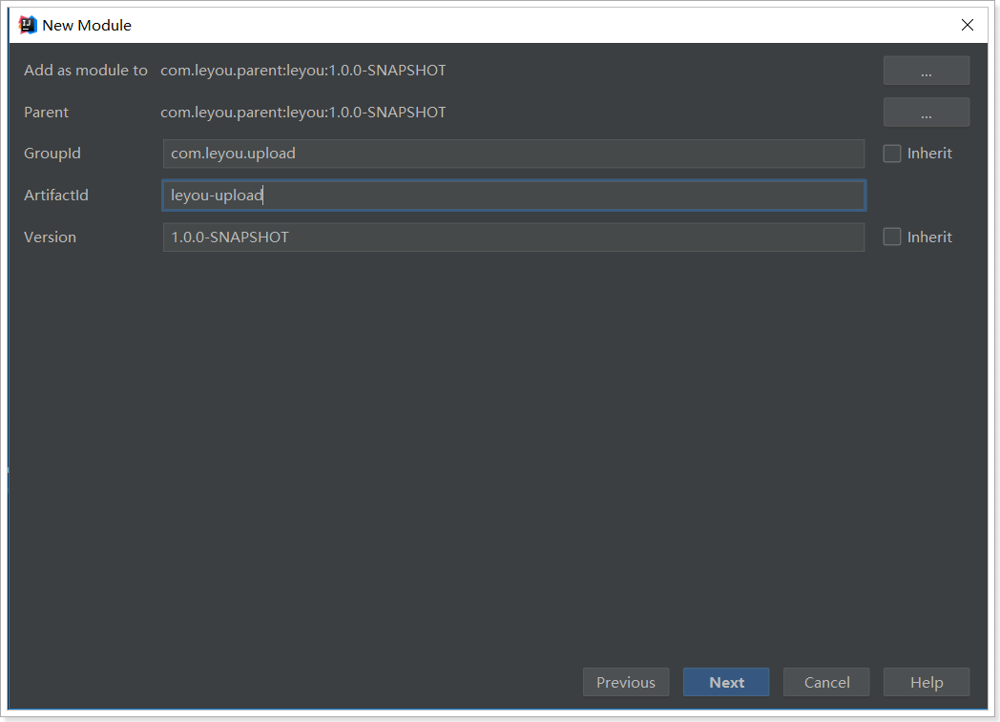

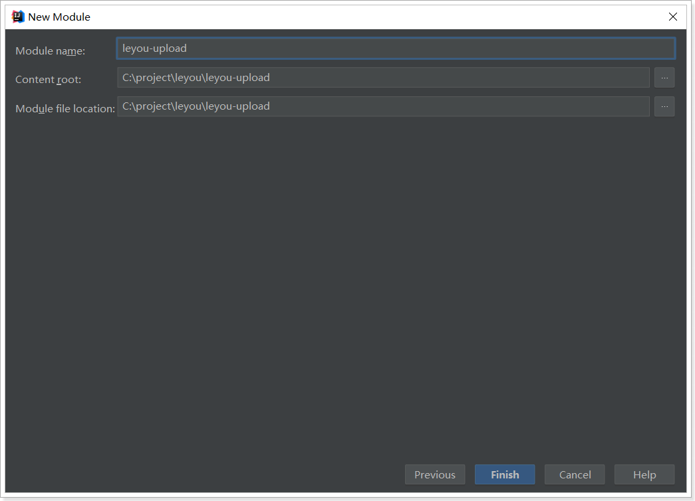


### 2.1.2.依赖

我们需要EurekaClient和web依赖：

```xml
<?xml version="1.0" encoding="UTF-8"?>
<project xmlns="http://maven.apache.org/POM/4.0.0"
         xmlns:xsi="http://www.w3.org/2001/XMLSchema-instance"
         xsi:schemaLocation="http://maven.apache.org/POM/4.0.0 http://maven.apache.org/xsd/maven-4.0.0.xsd">
    <parent>
        <artifactId>leyou</artifactId>
        <groupId>com.leyou.parent</groupId>
        <version>1.0.0-SNAPSHOT</version>
    </parent>
    <modelVersion>4.0.0</modelVersion>

    <groupId>com.leyou.upload</groupId>
    <artifactId>leyou-upload</artifactId>
    <version>1.0.0-SNAPSHOT</version>

    <dependencies>
        <dependency>
            <groupId>org.springframework.cloud</groupId>
            <artifactId>spring-cloud-starter-netflix-eureka-client</artifactId>
        </dependency>
        <dependency>
            <groupId>org.springframework.boot</groupId>
            <artifactId>spring-boot-starter-web</artifactId>
        </dependency>
        <dependency>
            <groupId>org.springframework.boot</groupId>
            <artifactId>spring-boot-starter-test</artifactId>
        </dependency>
    </dependencies>
</project>
```


### 2.1.3.编写配置

```yaml
server:
  port: 8082
spring:
  application:
    name: upload-service
  servlet:
    multipart:
      max-file-size: 5MB # 限制文件上传的大小
# Eureka
eureka:
  client:
    service-url:
      defaultZone: http://127.0.0.1:10086/eureka
  instance:
    lease-renewal-interval-in-seconds: 5 # 每隔5秒发送一次心跳
    lease-expiration-duration-in-seconds: 10 # 10秒不发送就过期
```

需要注意的是，我们应该添加了限制文件大小的配置


### 2.1.4.引导类

```java
@SpringBootApplication
@EnableDiscoveryClient
public class LeyouUploadApplication {

    public static void main(String[] args) {
        SpringApplication.run(LeyouUploadApplication.class, args);
    }
}
```

结构：

 


## 2.2.编写上传功能

文件上传功能，也是自定义组件完成的，参照自定义组件用法指南：

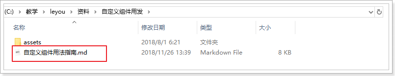

在页面中的使用：

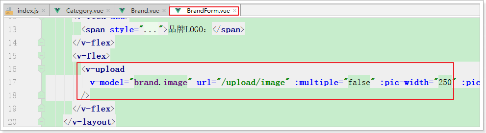


### 2.2.1.controller

编写controller需要知道4个内容：结合用法指南

- 请求方式：上传肯定是POST
- 请求路径：/upload/image
- 请求参数：文件，参数名是file，SpringMVC会封装为一个接口：MultipartFile
- 返回结果：上传成功后得到的文件的url路径，也就是返回String

代码如下：

```java
@Controller
@RequestMapping("upload")
public class UploadController {

    @Autowired
    private UploadService uploadService;

    /**
     * 图片上传
     * @param file
     * @return
     */
    @PostMapping("image")
    public ResponseEntity<String> uploadImage(@RequestParam("file") MultipartFile file){
        String url = this.uploadService.upload(file);
        if (StringUtils.isBlank(url)) {
            return ResponseEntity.badRequest().build();
        }
        return ResponseEntity.status(HttpStatus.CREATED).body(url);
    }
}
```


### 2.2.2.service

在上传文件过程中，我们需要对上传的内容进行校验：

1. 校验文件大小
2. 校验文件的媒体类型
3. 校验文件的内容

文件大小在Spring的配置文件中设置，因此已经会被校验，我们不用管。

具体代码：

```java
@Service
public class UploadService {

    private static final List<String> CONTENT_TYPES = Arrays.asList("image/jpeg", "image/gif");

    private static final Logger LOGGER = LoggerFactory.getLogger(UploadService.class);

    public String upload(MultipartFile file) {

        String originalFilename = file.getOriginalFilename();
        // 校验文件的类型
        String contentType = file.getContentType();
        if (!CONTENT_TYPES.contains(contentType)){
            // 文件类型不合法，直接返回null
            LOGGER.info("文件类型不合法：{}", originalFilename);
            return null;
        }

        try {
            // 校验文件的内容
            BufferedImage bufferedImage = ImageIO.read(file.getInputStream());
            if (bufferedImage == null){
                LOGGER.info("文件内容不合法：{}", originalFilename);
                return null;
            }

            // 保存到服务器
            file.transferTo(new File("C:\\leyou\\images\\" + originalFilename));

            // 生成url地址，返回
            return "http://image.leyou.com/" + originalFilename;
        } catch (IOException e) {
            LOGGER.info("服务器内部错误：{}", originalFilename);
            e.printStackTrace();
        }
        return null;
    }
}
```

这里有一个问题：为什么图片地址需要使用另外的url？

- 图片不能保存在服务器内部，这样会对服务器产生额外的加载负担
- 一般静态资源都应该使用独立域名，这样访问静态资源时不会携带一些不必要的cookie，减小请求的数据量


### 2.2.3.测试上传

我们通过RestClient工具来测试：

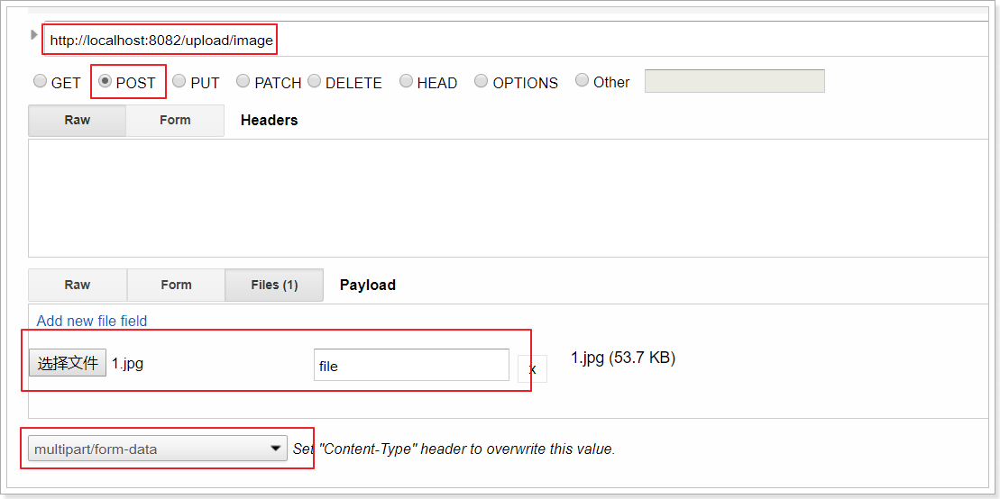

结果：


去目录下查看：

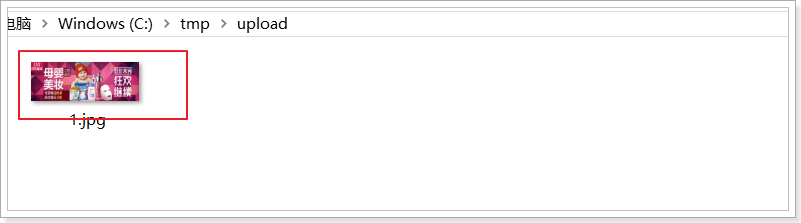

上传成功！


## 2.3.绕过网关

图片上传是文件的传输，如果也经过Zuul网关的代理，文件就会经过多次网路传输，造成不必要的网络负担。在高并发时，可能导致网络阻塞，Zuul网关不可用。这样我们的整个系统就瘫痪了。

所以，我们上传文件的请求就不经过网关来处理了。

### 2.3.1.Zuul的路由过滤

Zuul中提供了一个ignored-patterns属性，用来忽略不希望路由的URL路径，示例：

```properties
zuul.ignored-patterns: /upload/**
```

路径过滤会对一切微服务进行判定。

Zuul还提供了`ignored-services`属性，进行服务过滤：

```properties
zuul.ignored-services: upload-servie
```

我们这里采用忽略服务：

```yaml
zuul:
  ignored-services:
    - upload-service # 忽略upload-service服务
```

上面的配置采用了集合语法，代表可以配置多个。


### 2.3.2.Nginx的rewrite指令

现在，我们修改页面的访问路径：

```html
<v-upload
      v-model="brand.image" 
      url="/upload/image" 
      :multiple="false" 
      :pic-width="250" :pic-height="90"
      />
```

查看页面的请求路径：

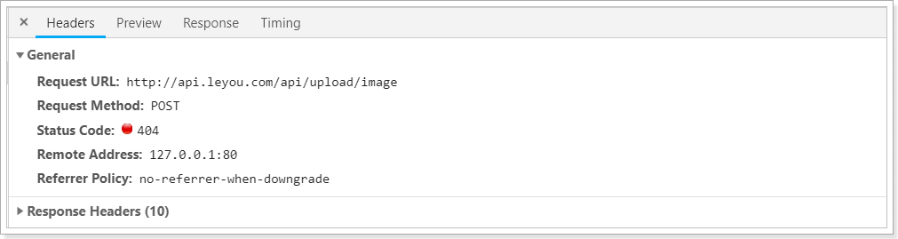

可以看到这个地址不对，依然是去找Zuul网关，因为我们的系统全局配置了URL地址。怎么办？

有同学会想：修改页面请求地址不就好了。

注意：原则上，我们是不能把除了网关以外的服务对外暴露的，不安全。


既然不能修改页面请求，那么就只能在Nginx反向代理上做文章了。

我们修改nginx配置，将以/api/upload开头的请求拦截下来，转交到真实的服务地址:

```nginx
location /api/upload {
    proxy_pass http://127.0.0.1:8082;
    proxy_connect_timeout 600;
    proxy_read_timeout 600;
}
```

这样写大家觉得对不对呢？


显然是不对的，因为ip和端口虽然对了，但是路径没变，依然是：http://127.0.0.1:8002/api/upload/image

前面多了一个/api


Nginx提供了rewrite指令，用于对地址进行重写，语法规则：

```nginx
rewrite "用来匹配路径的正则" 重写后的路径 [指令];
```

我们的案例：

```nginx 
	server {
        listen       80;
        server_name  api.leyou.com;

        proxy_set_header X-Forwarded-Host $host;
        proxy_set_header X-Forwarded-Server $host;
        proxy_set_header X-Forwarded-For $proxy_add_x_forwarded_for;

    	# 上传路径的映射
		location /api/upload {	
			proxy_pass http://127.0.0.1:8082;
			proxy_connect_timeout 600;
			proxy_read_timeout 600;
			
			rewrite "^/api/(.*)$" /$1 break; 
        }
		
        location / {
			proxy_pass http://127.0.0.1:10010;
			proxy_connect_timeout 600;
			proxy_read_timeout 600;
        }
    }
```

- 首先，我们映射路径是/api/upload，而下面一个映射路径是 / ，根据最长路径匹配原则，/api/upload优先级更高。也就是说，凡是以/api/upload开头的路径，都会被第一个配置处理

- `proxy_pass`：反向代理，这次我们代理到8082端口，也就是upload-service服务

- `rewrite "^/api/(.*)$" /$1 break`，路径重写：

  - `"^/api/(.*)$"`：匹配路径的正则表达式，用了分组语法，把`/api/`以后的所有部分当做1组

  - `/$1`：重写的目标路径，这里用$1引用前面正则表达式匹配到的分组（组编号从1开始），即`/api/`后面的所有。这样新的路径就是除去`/api/`以外的所有，就达到了去除`/api`前缀的目的

  - `break`：指令，常用的有2个，分别是：last、break

    - last：重写路径结束后，将得到的路径重新进行一次路径匹配
    - break：重写路径结束后，不再重新匹配路径。

    我们这里不能选择last，否则以新的路径/upload/image来匹配，就不会被正确的匹配到8082端口了

修改完成，输入`nginx -s reload`命令重新加载配置。然后再次上传试试。


## 2.4.跨域问题

重启nginx，再次上传，发现跟上次的状态码已经不一样了，但是依然报错：


不过庆幸的是，这个错误已经不是第一次见了，跨域问题。

我们在upload-service中添加一个CorsFilter即可：

 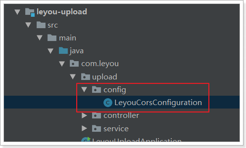

```java
@Configuration
public class LeyouCorsConfiguration {

    @Bean
    public CorsFilter corsFilter() {
        //1.添加CORS配置信息
        CorsConfiguration config = new CorsConfiguration();
        //1) 允许的域,不要写*，否则cookie就无法使用了
        config.addAllowedOrigin("http://manage.leyou.com");
        //3) 允许的请求方式
        config.addAllowedMethod("OPTIONS");
        config.addAllowedMethod("POST");
        // 4）允许的头信息
        config.addAllowedHeader("*");

        //2.添加映射路径，我们拦截一切请求
        UrlBasedCorsConfigurationSource configSource = new UrlBasedCorsConfigurationSource();
        configSource.registerCorsConfiguration("/**", config);

        //3.返回新的CorsFilter.
        return new CorsFilter(configSource);
    }
}
```


再次测试：

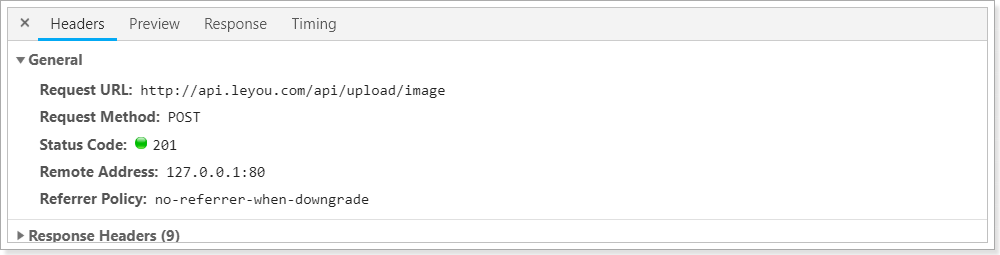

不过，非常遗憾的是，访问图片地址，却没有响应。

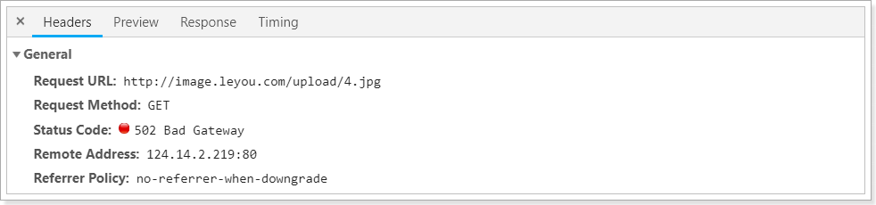

这是因为我们并没有任何服务器对应image.leyou.com这个域名。。

这个问题，我们暂时放下，回头再来解决。


## 2.5.文件上传的缺陷

先思考一下，现在上传的功能，有没有什么问题？

上传本身没有任何问题，问题出在保存文件的方式，我们是保存在服务器机器，就会有下面的问题：

- 单机器存储，存储能力有限
- 无法进行水平扩展，因为多台机器的文件无法共享,会出现访问不到的情况
- 数据没有备份，有单点故障风险
- 并发能力差

这个时候，最好使用分布式文件存储来代替本地文件存储。


# 3.FastDFS

## 3.1.什么是分布式文件系统

分布式文件系统（Distributed File System）是指文件系统管理的物理存储资源不一定直接连接在本地节点上，而是通过计算机网络与节点相连。 

通俗来讲：

- 传统文件系统管理的文件就存储在本机。
- 分布式文件系统管理的文件存储在很多机器，这些机器通过网络连接，要被统一管理。无论是上传或者访问文件，都需要通过管理中心来访问


## 3.2.什么是FastDFS

FastDFS是由淘宝的余庆先生所开发的一个轻量级、高性能的开源分布式文件系统。用纯C语言开发，功能丰富：

- 文件存储
- 文件同步
- 文件访问（上传、下载）
- 存取负载均衡
- 在线扩容

适合有大容量存储需求的应用或系统。同类的分布式文件系统有谷歌的GFS、HDFS（Hadoop）、TFS（淘宝）等。

## 3.3.FastDFS的架构

### 3.3.1.架构图

先上图：

 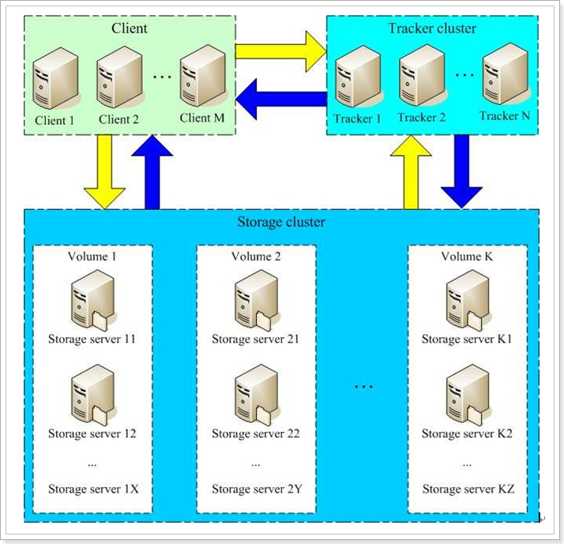

FastDFS两个主要的角色：Tracker Server 和 Storage Server 。

- Tracker Server：跟踪服务器，主要负责调度storage节点与client通信，在访问上起负载均衡的作用，和记录storage节点的运行状态，是连接client和storage节点的枢纽。 
- Storage Server：存储服务器，保存文件和文件的meta data（元数据），每个storage server会启动一个单独的线程主动向Tracker cluster中每个tracker server报告其状态信息，包括磁盘使用情况，文件同步情况及文件上传下载次数统计等信息
- Group：文件组，多台Storage Server的集群。上传一个文件到同组内的一台机器上后，FastDFS会将该文件即时同步到同组内的其它所有机器上，起到备份的作用。不同组的服务器，保存的数据不同，而且相互独立，不进行通信。 
- Tracker Cluster：跟踪服务器的集群，有一组Tracker Server（跟踪服务器）组成。
- Storage Cluster ：存储集群，有多个Group组成。


### 3.3.2.上传和下载流程

> 上传

 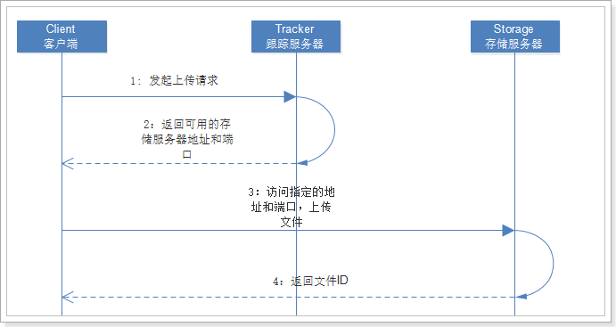

1. Client通过Tracker server查找可用的Storage server。
2. Tracker server向Client返回一台可用的Storage server的IP地址和端口号。
3. Client直接通过Tracker server返回的IP地址和端口与其中一台Storage server建立连接并进行文件上传。
4. 上传完成，Storage server返回Client一个文件ID，文件上传结束。

> 下载

 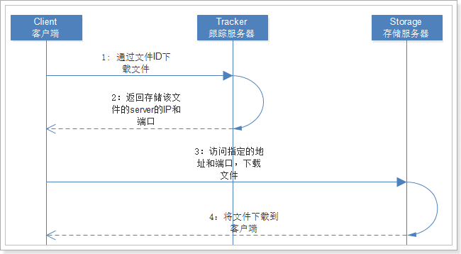

1. Client通过Tracker server查找要下载文件所在的的Storage server。
2. Tracker server向Client返回包含指定文件的某个Storage server的IP地址和端口号。
3. Client直接通过Tracker server返回的IP地址和端口与其中一台Storage server建立连接并指定要下载文件。
4. 下载文件成功。


## 3.4.安装和使用

参考课前资料的：

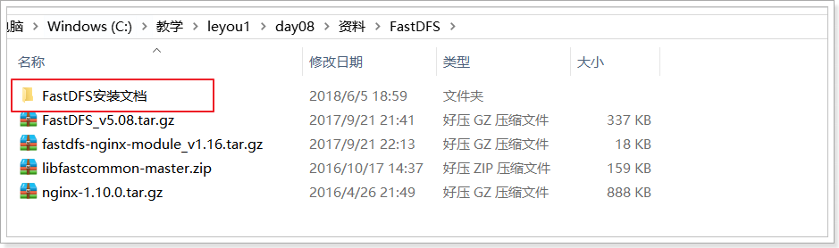


## 3.5.java客户端

余庆先生提供了一个Java客户端，但是作为一个C程序员，写的java代码可想而知。而且已经很久不维护了。

这里推荐一个开源的FastDFS客户端，支持最新的SpringBoot2.0。

配置使用极为简单，支持连接池，支持自动生成缩略图，狂拽酷炫吊炸天啊，有木有。

地址：[tobato/FastDFS_client](https://github.com/tobato/FastDFS_Client)

 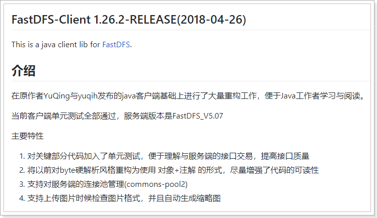

接下来，我们就用FastDFS改造**leyou-upload**工程。


### 3.5.1.引入依赖

在父工程中，我们已经管理了依赖，版本为：

```xml
<fastDFS.client.version>1.26.2</fastDFS.client.version>
```

因此，这里我们直接在taotao-upload工程的pom.xml中引入坐标即可：

```xml
<dependency>
    <groupId>com.github.tobato</groupId>
    <artifactId>fastdfs-client</artifactId>
</dependency>
```


### 3.5.2.引入配置类

 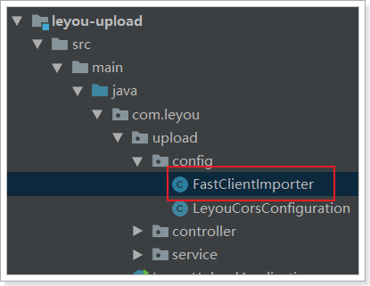

纯java配置：

```java
@Configuration
@Import(FdfsClientConfig.class)
// 解决jmx重复注册bean的问题
@EnableMBeanExport(registration = RegistrationPolicy.IGNORE_EXISTING)
public class FastClientImporter {
    
}
```


### 3.5.3.编写FastDFS属性

在application.yml配置文件中追加如下内容：

```yaml
fdfs:
  so-timeout: 1501 # 超时时间
  connect-timeout: 601 # 连接超时时间
  thumb-image: # 缩略图
    width: 60
    height: 60
  tracker-list: # tracker地址：你的虚拟机服务器地址+端口（默认是22122）
    - 192.168.56.101:22122
```

### 3.5.4.配置hosts

将来通过域名：image.leyou.com这个域名访问fastDFS服务器上的图片资源。所以，需要代理到虚拟机地址：

配置hosts文件，使image.leyou.com可以访问fastDFS服务器

 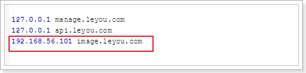

### 3.5.5.测试

创建测试类：

 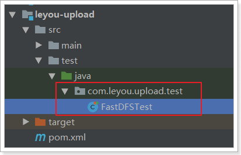

把以下内容copy进去：

```java
@SpringBootTest
@RunWith(SpringRunner.class)
public class FastDFSTest {

    @Autowired
    private FastFileStorageClient storageClient;

    @Autowired
    private ThumbImageConfig thumbImageConfig;

    @Test
    public void testUpload() throws FileNotFoundException {
        // 要上传的文件
        File file = new File("C:\\Users\\joedy\\Pictures\\xbx1.jpg");
        // 上传并保存图片，参数：1-上传的文件流 2-文件的大小 3-文件的后缀 4-可以不管他
        StorePath storePath = this.storageClient.uploadFile(
                new FileInputStream(file), file.length(), "jpg", null);
        // 带分组的路径
        System.out.println(storePath.getFullPath());
        // 不带分组的路径
        System.out.println(storePath.getPath());
    }

    @Test
    public void testUploadAndCreateThumb() throws FileNotFoundException {
        File file = new File("C:\\Users\\joedy\\Pictures\\xbx1.jpg");
        // 上传并且生成缩略图
        StorePath storePath = this.storageClient.uploadImageAndCrtThumbImage(
                new FileInputStream(file), file.length(), "png", null);
        // 带分组的路径
        System.out.println(storePath.getFullPath());
        // 不带分组的路径
        System.out.println(storePath.getPath());
        // 获取缩略图路径
        String path = thumbImageConfig.getThumbImagePath(storePath.getPath());
        System.out.println(path);
    }
}
```

结果：

```
group1/M00/00/00/wKg4ZVsWl5eAdLNZAABAhya2V0c424.jpg
M00/00/00/wKg4ZVsWl5eAdLNZAABAhya2V0c424.jpg
```

```
group1/M00/00/00/wKg4ZVsWmD-ARnWiAABAhya2V0c772.png
M00/00/00/wKg4ZVsWmD-ARnWiAABAhya2V0c772.png
M00/00/00/wKg4ZVsWmD-ARnWiAABAhya2V0c772_60x60.png
```

访问第二组第一个路径：

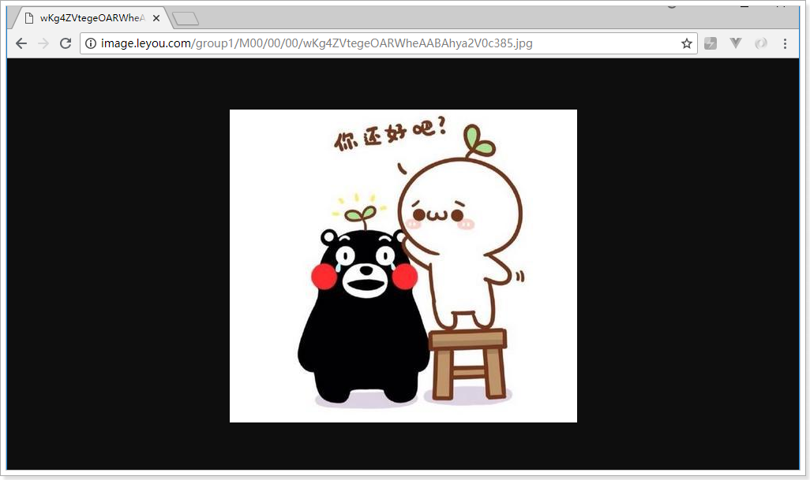

访问最后一个路径（缩略图路径），**注意加组名（group1）**：

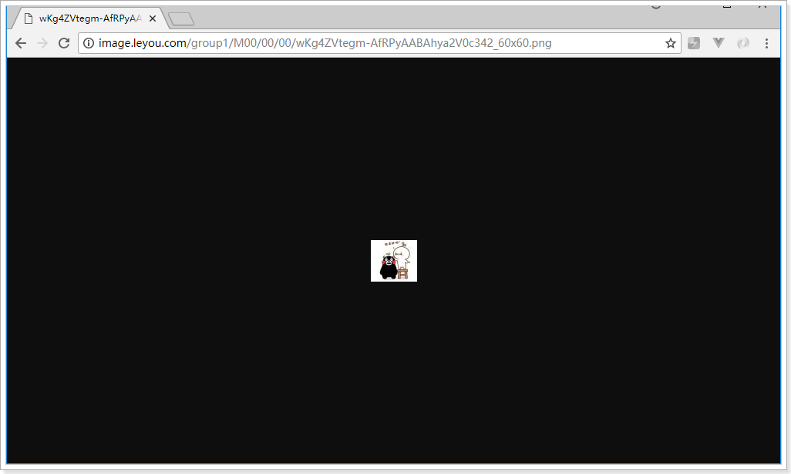


### 3.5.6.改造上传逻辑

```java
@Service
public class UploadService {

    @Autowired
    private FastFileStorageClient storageClient;

    private static final List<String> CONTENT_TYPES = Arrays.asList("image/jpeg", "image/gif");

    private static final Logger LOGGER = LoggerFactory.getLogger(UploadService.class);

    public String upload(MultipartFile file) {

        String originalFilename = file.getOriginalFilename();
        // 校验文件的类型
        String contentType = file.getContentType();
        if (!CONTENT_TYPES.contains(contentType)){
            // 文件类型不合法，直接返回null
            LOGGER.info("文件类型不合法：{}", originalFilename);
            return null;
        }

        try {
            // 校验文件的内容
            BufferedImage bufferedImage = ImageIO.read(file.getInputStream());
            if (bufferedImage == null){
                LOGGER.info("文件内容不合法：{}", originalFilename);
                return null;
            }

            // 保存到服务器
            // file.transferTo(new File("C:\\leyou\\images\\" + originalFilename));
            String ext = StringUtils.substringAfterLast(originalFilename, ".");
            StorePath storePath = this.storageClient.uploadFile(file.getInputStream(), file.getSize(), ext, null);

            // 生成url地址，返回
            return "http://image.leyou.com/" + storePath.getFullPath();
        } catch (IOException e) {
            LOGGER.info("服务器内部错误：{}", originalFilename);
            e.printStackTrace();
        }
        return null;
    }
}
```

只需要把原来保存文件的逻辑去掉，然后上传到FastDFS即可。


### 3.5.7.测试

通过RestClient测试：

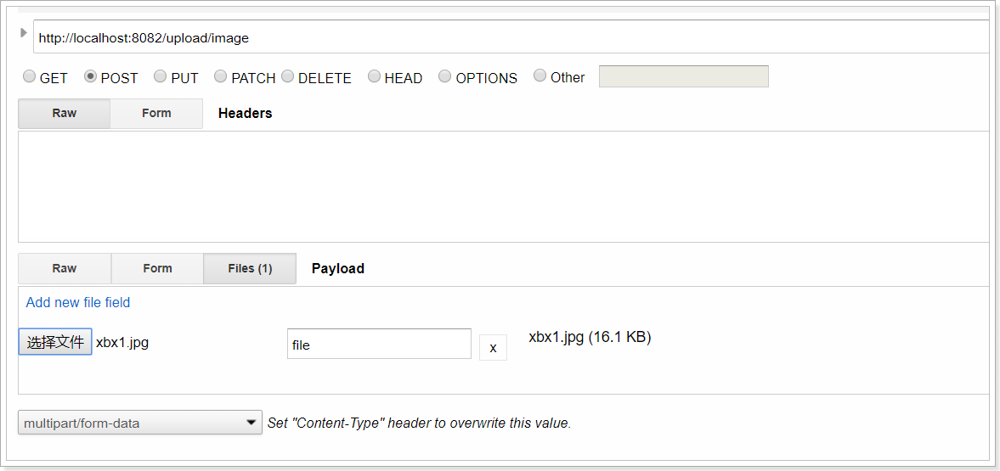

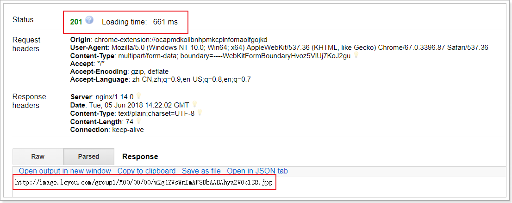


## 3.6.页面测试上传

发现上传成功：

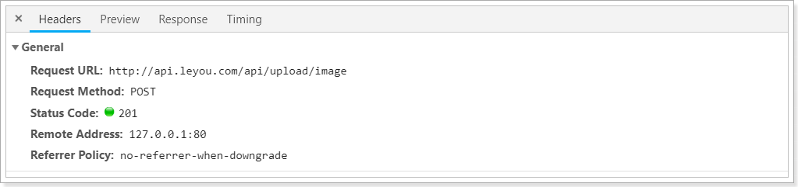

 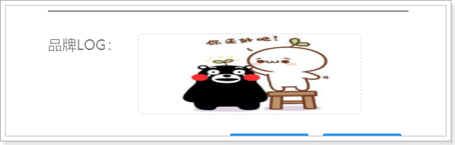


# 4.修改品牌（作业）

修改的难点在于回显。

当我们点击编辑按钮，希望弹出窗口的同时，看到原来的数据：

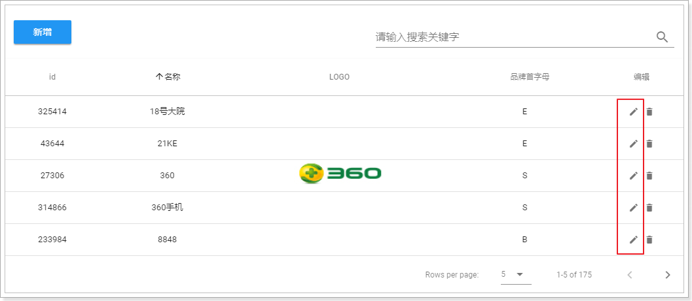


## 4.1.点击编辑出现弹窗

这个比较简单，修改show属性为true即可实现，我们绑定一个点击事件：

```html
<v-icon small class="mr-2" @click="editItem(props.item)">
    edit
</v-icon>
```

然后编写事件，改变show 的状态：

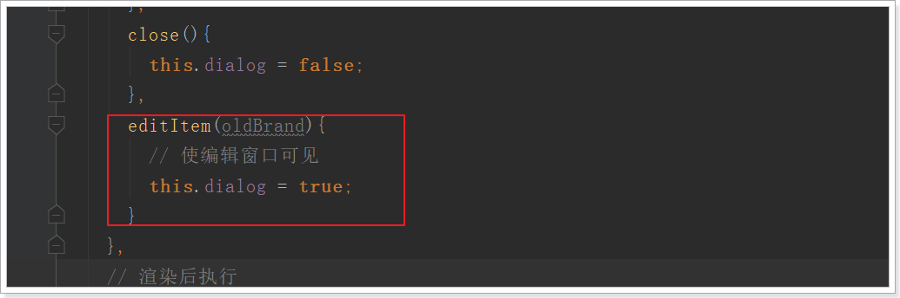

如果仅仅是这样，编辑按钮与新增按钮将没有任何区别，关键在于，如何回显呢？


## 4.2.回显数据

回显数据，就是把当前点击的品牌数据传递到子组件（MyBrandForm）。而父组件给子组件传递数据，通过props属性。

- 第一步：在编辑时获取当前选中的品牌信息，并且记录到data中

  先在data中定义属性，用来接收用来编辑的brand数据：

  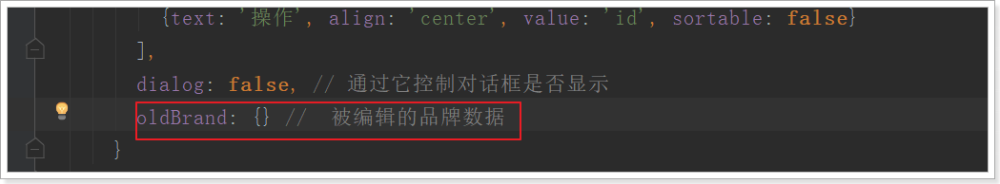

  我们在页面触发编辑事件时，把当前的brand传递给editBrand方法：

  ```html
  <v-btn color="info" @click="editBrand(props.item)">编辑</v-btn>
  ```

  然后在editBrand中接收数据，赋值给oldBrand：

  ```js
  editItem(oldBrand){
      // 使编辑窗口可见
      this.dialog = true;
      // 初始化编辑的数据
      this.oldBrand = oldBrand;
  }
  ```

- 第二步：把获取的brand数据 传递给子组件

  ```html
  <!--对话框内容-->
  <v-card-text class="px-5">
      <!--这是一个表单-->
      <my-brand-form @close="close" :oldBrand="oldBrand"></my-brand-form>
  </v-card-text>
  ```

- 第三步：在子组件（MyBrandForm.vue）中通过props接收要编辑的brand数据，Vue会自动完成回显

  接收数据：

  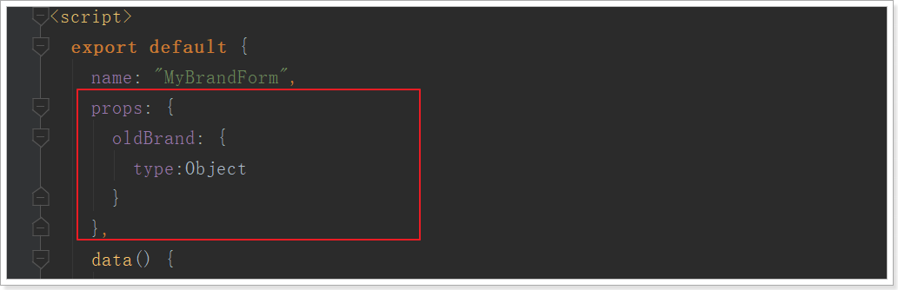

  通过watch函数监控oldBrand的变化，把值copy到本地的brand：

  ```js
  watch: {
      oldBrand: {// 监控oldBrand的变化
          handler(val) {
              if(val){
                  // 注意不要直接赋值，否则这边的修改会影响到父组件的数据，copy属性即可
                  this.brand =  Object.deepCopy(val)
              }else{
                  // 为空，初始化brand
                  this.brand = {
                      name: '',
                      letter: '',
                      image: '',
                      categories: []
                  }
              }
          },
              deep: true
      }
  }
  ```

  - Object.deepCopy 自定义的对象进行深度复制的方法。
  - 需要判断监听到的是否为空，如果为空，应该进行初始化


测试：发现数据回显了，除了商品分类以外：

 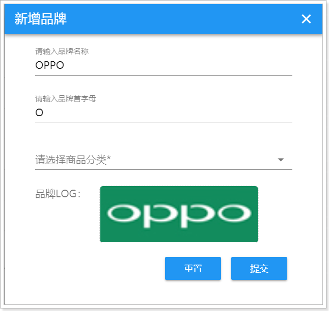


## 4.3.商品分类回显

为什么商品分类没有回显？

因为品牌中并没有商品分类数据。我们需要在进入编辑页面之前，查询商品分类信息：

### 4.3.1.后台提供接口

> #### controller

```java
/**
     * 通过品牌id查询商品分类
     * @param bid
     * @return
     */
@GetMapping("bid/{bid}")
public ResponseEntity<List<Category>> queryByBrandId(@PathVariable("bid") Long bid) {
    List<Category> list = this.categoryService.queryByBrandId(bid);
    if (list == null || list.size() < 1) {
        return new ResponseEntity<>(HttpStatus.NOT_FOUND);
    }
    return ResponseEntity.ok(list);
}
```


> Service

```java
public List<Category> queryByBrandId(Long bid) {
    return this.categoryMapper.queryByBrandId(bid);
}
```


> mapper

因为需要通过中间表进行子查询，所以这里要手写Sql：

```java
/**
     * 根据品牌id查询商品分类
     * @param bid
     * @return
     */
@Select("SELECT * FROM tb_category WHERE id IN (SELECT category_id FROM tb_category_brand WHERE brand_id = #{bid})")
List<Category> queryByBrandId(Long bid);
```

### 4.3.2.前台查询分类并渲染

我们在编辑页面打开之前，先把数据查询完毕：

```js
editBrand(oldBrand){
    // 根据品牌信息查询商品分类
    this.$http.get("/item/category/bid/" + oldBrand.id)
        .then(({data}) => {
        // 控制弹窗可见：
        this.dialog = true;
        // 获取要编辑的brand
        this.oldBrand = oldBrand
        // 回显商品分类
        this.oldBrand.categories = data;
    })
}
```


再次测试：数据成功回显了

 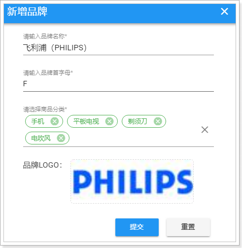


### 4.3.3.新增窗口数据干扰

但是，此时却产生了新问题：新增窗口竟然也有数据？

原因：

	如果之前打开过编辑，那么在父组件中记录的oldBrand会保留。下次再打开窗口，如果是编辑窗口到没问题，但是新增的话，就会再次显示上次打开的品牌信息了。


解决：

	新增窗口打开前，把数据置空。

```js
addBrand() {
    // 控制弹窗可见：
    this.dialog = true;
    // 把oldBrand变为null
    this.oldBrand = null;
}
```


### 4.3.4.提交表单时判断是新增还是修改

新增和修改是同一个页面，我们该如何判断？

父组件中点击按钮弹出新增或修改的窗口，因此父组件非常清楚接下来是新增还是修改。

因此，最简单的方案就是，在父组件中定义变量，记录新增或修改状态，当弹出页面时，把这个状态也传递给子组件。

第一步：在父组件中记录状态：

 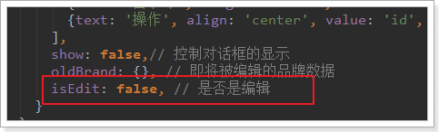


第二步：在新增和修改前，更改状态：

 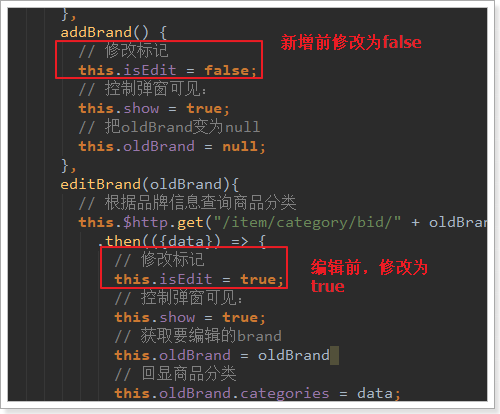

第三步：传递给子组件

 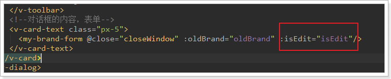

第四步，子组件接收标记：

 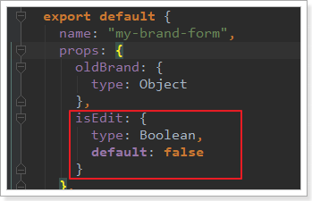


标题的动态化：

 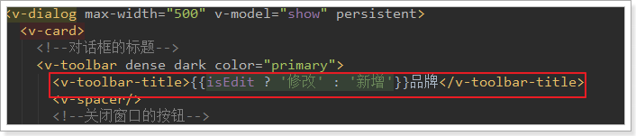

表单提交动态：

axios除了除了get和post外，还有一个通用的请求方式：

```js
// 将数据提交到后台
// this.$http.post('/item/brand', this.$qs.stringify(params))
this.$http({
    method: this.isEdit ? 'put' : 'post', // 动态判断是POST还是PUT
    url: '/item/brand',
    data: this.$qs.stringify(this.brand)
}).then(() => {
    // 关闭窗口
    this.$emit("close");
    this.$message.success("保存成功！");
})
    .catch(() => {
    this.$message.error("保存失败！");
});
```


# 5.删除（作业）