# 0.学习目标

- 独立实现商品新增后台
- 独立实现商品编辑后台
- 独立搭建前台系统页面


# 1.商品新增

当我们点击新增商品按钮：

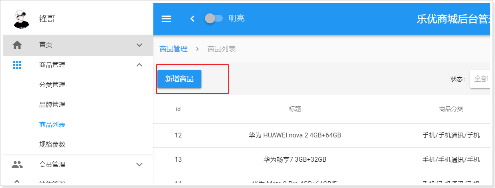

就会出现一个弹窗：

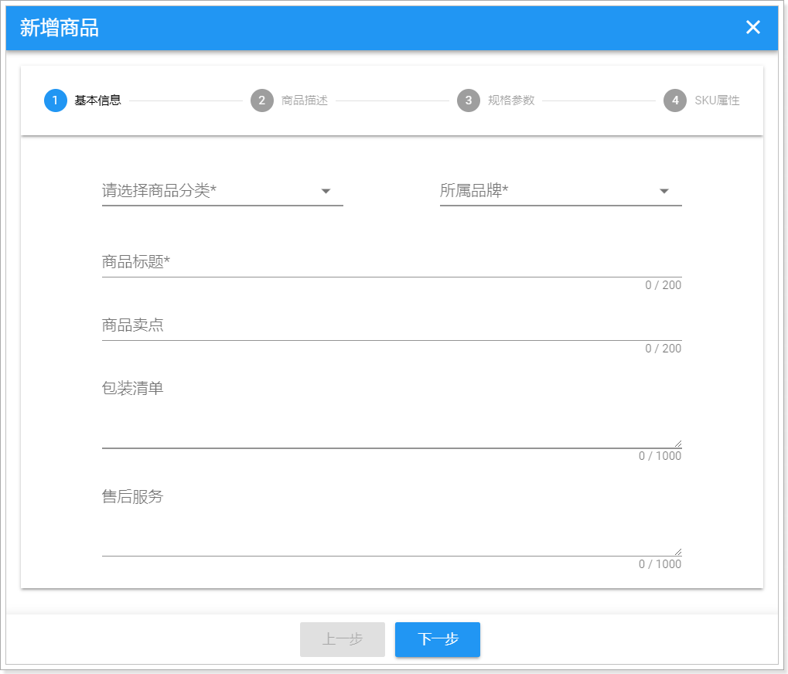

里面把商品的数据分为了4部分来填写：

- 基本信息：主要是一些简单的文本数据，包含了SPU和SpuDetail的部分数据，如
  - 商品分类：是SPU中的`cid1`，`cid2`，`cid3`属性
  - 品牌：是spu中的`brandId`属性
  - 标题：是spu中的`title`属性
  - 子标题：是spu中的`subTitle`属性
  - 售后服务：是SpuDetail中的`afterService`属性
  - 包装列表：是SpuDetail中的`packingList`属性
- 商品描述：是SpuDetail中的`description`属性，数据较多，所以单独放一个页面
- 规格参数：商品规格信息，对应SpuDetail中的`genericSpec`属性
- SKU属性：spu下的所有Sku信息

对应到页面中的四个`stepper-content`：

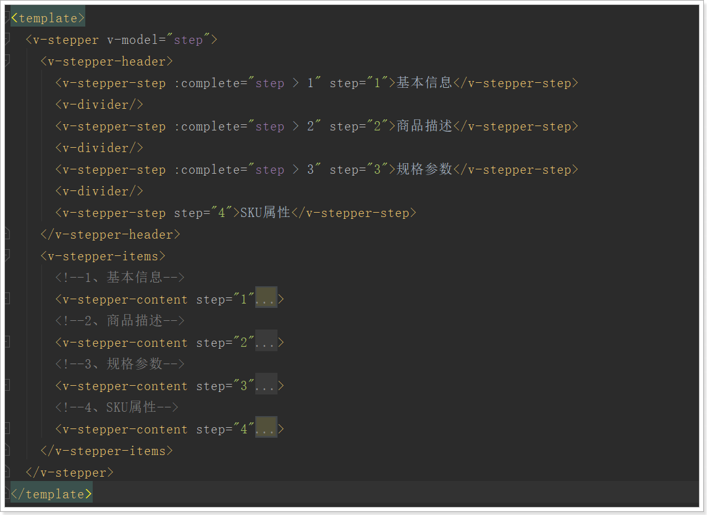


## 1.1.弹窗事件

弹窗是一个独立组件：

 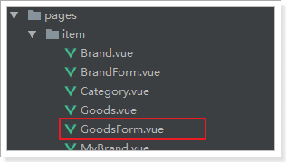

并且在Goods组件中已经引用它：

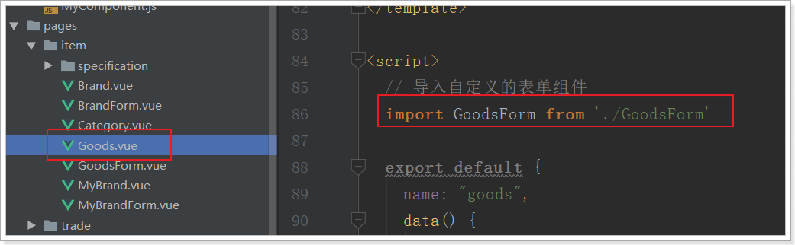

并且在页面中渲染：

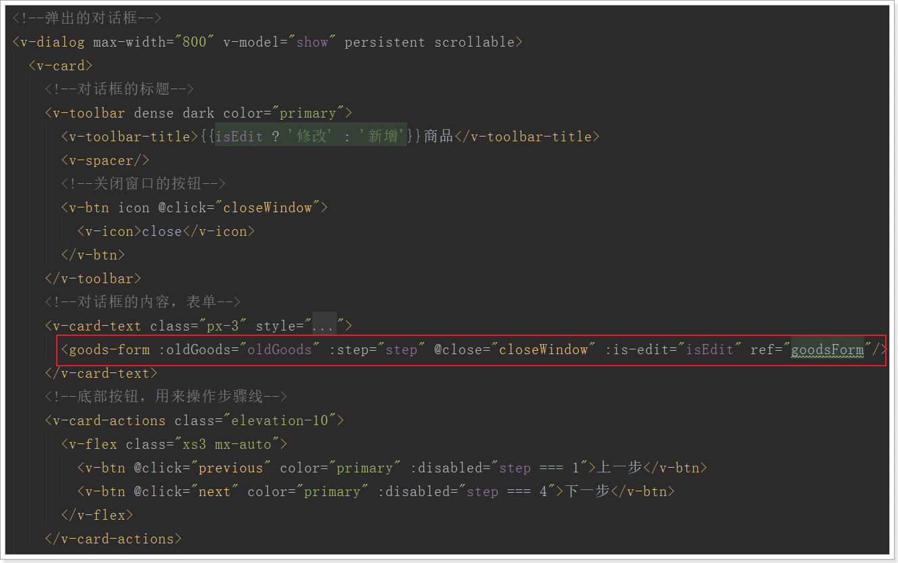

在`新增商品`按钮的点击事件中，改变这个`dialog`的`show`属性：

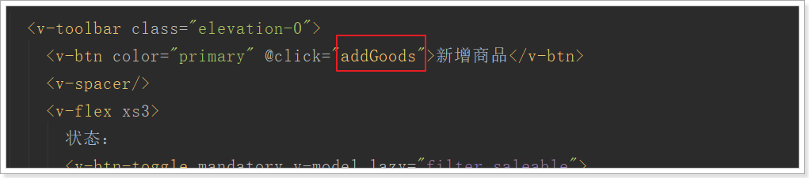

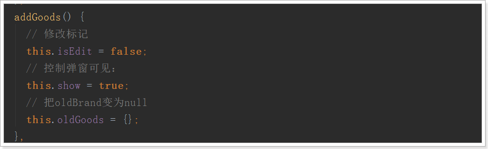


## 1.2.基本数据

我们先来看下基本数据：


### 1.2.1.商品分类

商品分类信息查询我们之前已经做过，所以这里的级联选框已经实现完成：

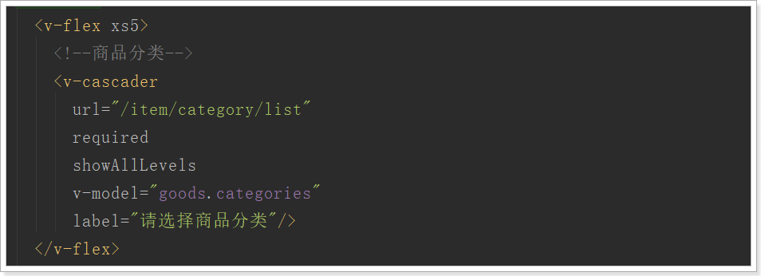

刷新页面，可以看到请求已经发出：

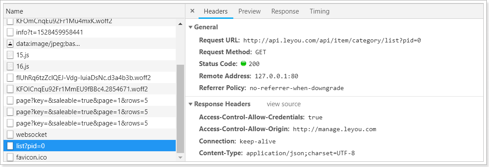

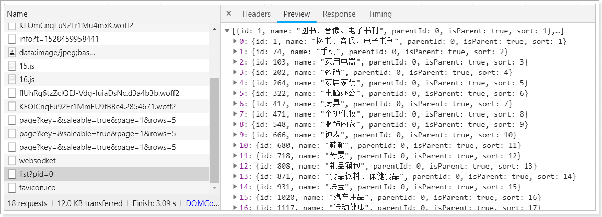

效果：

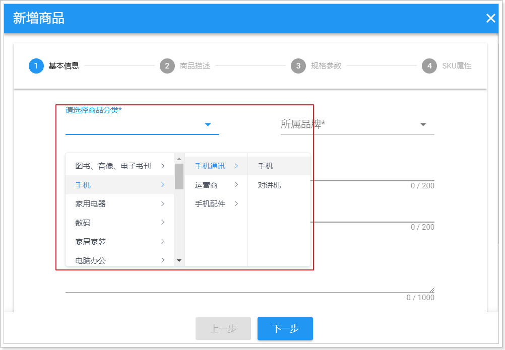


### 1.2.2.品牌选择

#### 1.2.2.1页面

品牌也是一个下拉选框，不过其选项是不确定的，只有当用户选择了商品分类，才会把这个分类下的所有品牌展示出来。

所以页面编写了watch函数，监控商品分类的变化，每当商品分类值有变化，就会发起请求，查询品牌列表：

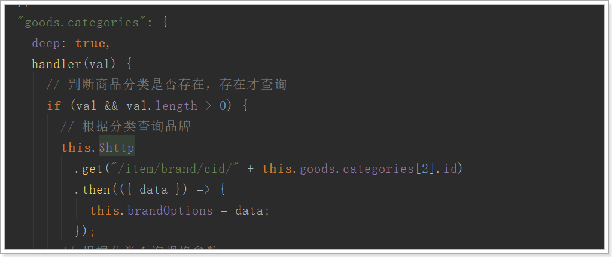

选择商品分类后，可以看到请求发起：


接下来，我们只要编写后台接口，根据商品分类id，查询对应品牌即可。

#### 1.2.2.2后台接口

页面需要去后台查询品牌信息，我们自然需要提供：

请求方式：GET

请求路径：/brand/cid/{cid}

请求参数：cid

响应数据：品牌集合

> BrandController

```java
@GetMapping("cid/{cid}")
public ResponseEntity<List<Brand>> queryBrandsByCid(@PathVariable("cid")Long cid){
    List<Brand> brands = this.brandService.queryBrandsByCid(cid);
    if (CollectionUtils.isEmpty(brands)) {
        return ResponseEntity.notFound().build();
    }
    return ResponseEntity.ok(brands);
}
```

> BrandService

```java
public List<Brand> queryBrandsByCid(Long cid) {

    return this.brandMapper.selectBrandByCid(cid);
}
```


> BrandMapper

根据分类查询品牌有中间表，需要自己编写Sql：

```java
@Select("SELECT b.* from tb_brand b INNER JOIN tb_category_brand cb on b.id=cb.brand_id where cb.category_id=#{cid}")
List<Brand> selectBrandByCid(Long cid);
```


效果：


### 1.2.3.其它文本框

剩余的几个属性：标题、子标题等都是普通文本框，我们直接填写即可，没有需要特别注意的。

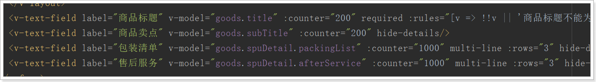


## 1.3.商品描述

商品描述信息比较复杂，而且图文并茂，甚至包括视频。

这样的内容，一般都会使用富文本编辑器。

### 1.3.1.什么是富文本编辑器

百度百科：

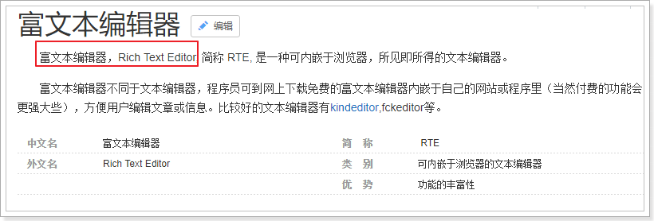

通俗来说：富文本，就是比较丰富的文本编辑器。普通的框只能输入文字，而富文本还能给文字加颜色样式等。

富文本编辑器有很多，例如：KindEditor、Ueditor。但并不原生支持vue

但是我们今天要说的，是一款支持Vue的富文本编辑器：`vue-quill-editor`


### 1.3.2.Vue-Quill-Editor

GitHub的主页：https://github.com/surmon-china/vue-quill-editor

Vue-Quill-Editor是一个基于Quill的富文本编辑器：[Quill的官网](https://quilljs.com/)

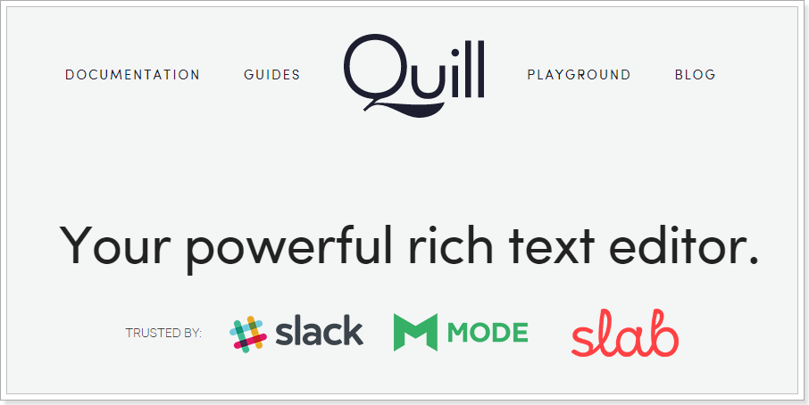


### 1.3.3.使用指南

使用非常简单：已经在项目中集成。以下步骤不需操作，仅供参考

第一步：安装，使用npm命令：

```
npm install vue-quill-editor --save
```

第二步：加载，在js中引入：

全局引入：

```js
import Vue from 'vue'
import VueQuillEditor from 'vue-quill-editor'

const options = {}; /* { default global options } */

Vue.use(VueQuillEditor, options); // options可选
```


局部引入：

```js
import 'quill/dist/quill.core.css'
import 'quill/dist/quill.snow.css'
import 'quill/dist/quill.bubble.css'

import {quillEditor} from 'vue-quill-editor'

var vm = new Vue({
    components:{
        quillEditor
    }
})
```


我们这里采用局部引用：

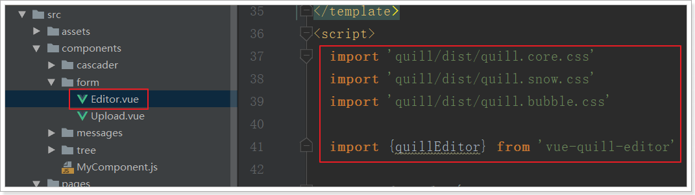


第三步：页面使用：

```html
<quill-editor v-model="goods.spuDetail.description" :options="editorOption"/>
```


### 1.3.4.自定义的富文本编辑器

不过这个组件有个小问题，就是图片上传的无法直接上传到后台，因此我们对其进行了封装，支持了图片的上传。

 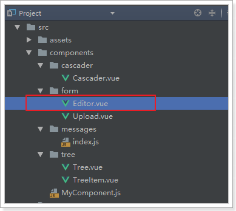

使用也非常简单：

```html
<v-stepper-content step="2">
    <v-editor v-model="goods.spuDetail.description" upload-url="/upload/image"/>
</v-stepper-content>
```

- upload-url：是图片上传的路径
- v-model：双向绑定，将富文本编辑器的内容绑定到goods.spuDetail.description


### 1.3.5.效果

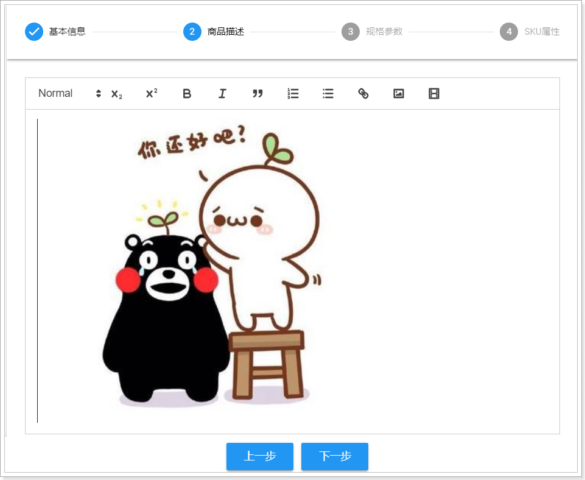


## 1.4.商品规格参数

规格参数的查询我们之前也已经编写过接口，因为商品规格参数也是与商品分类绑定，所以需要在商品分类变化后去查询，我们也是通过watch监控来实现：

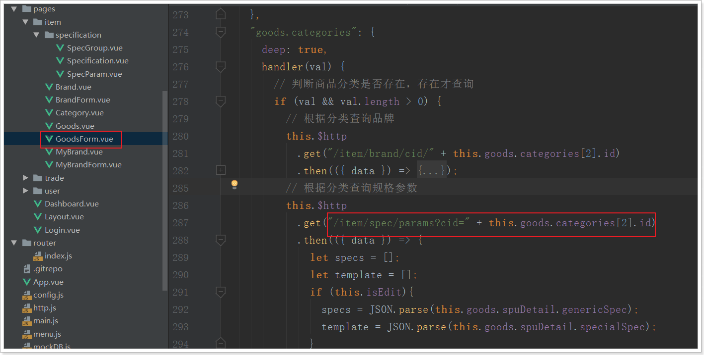

可以看到这里是根据商品分类id查询规格参数：SpecParam。我们之前写过一个根据gid（分组id）来查询规格参数的接口，我们接下来完成根据分类id查询规格参数。

> ### 改造查询规格参数接口

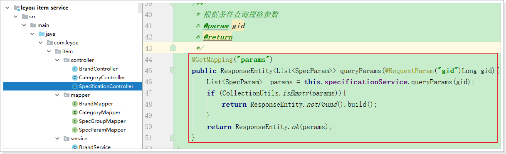

我们在原来的根据 gid（规格组id)查询规格参数的接口上，添加一个参数：cid，即商品分类id。

等一下， 考虑到以后可能还会根据是否搜索、是否为通用属性等条件过滤，我们多添加几个过滤条件：

```java
    @GetMapping("params")
    public ResponseEntity<List<SpecParam>> queryParams(
            @RequestParam(value = "gid", required = false)Long gid,
            @RequestParam(value = "cid", required = false)Long cid,
            @RequestParam(value = "generic", required = false)Boolean generic,
            @RequestParam(value = "searching", required = false)Boolean searching
    ){

        List<SpecParam> params = this.specificationService.queryParams(gid, cid, generic, searching);

        if (CollectionUtils.isEmpty(params)){
            return ResponseEntity.notFound().build();
        }
        return ResponseEntity.ok(params);
    }
```

改造SpecificationService：

```java
    /**
     * 根据gid查询规格参数
     * @param gid
     * @return
     */
    public List<SpecParam> queryParams(Long gid, Long cid, Boolean generic, Boolean searching) {
        SpecParam record = new SpecParam();
        record.setGroupId(gid);
        record.setCid(cid);
        record.setGeneric(generic);
        record.setSearching(searching);
        return this.specParamMapper.select(record);
    }
```

如果param中有属性为null，则不会把属性作为查询条件，因此该方法具备通用性，即可根据gid查询，也可根据cid查询。

测试：

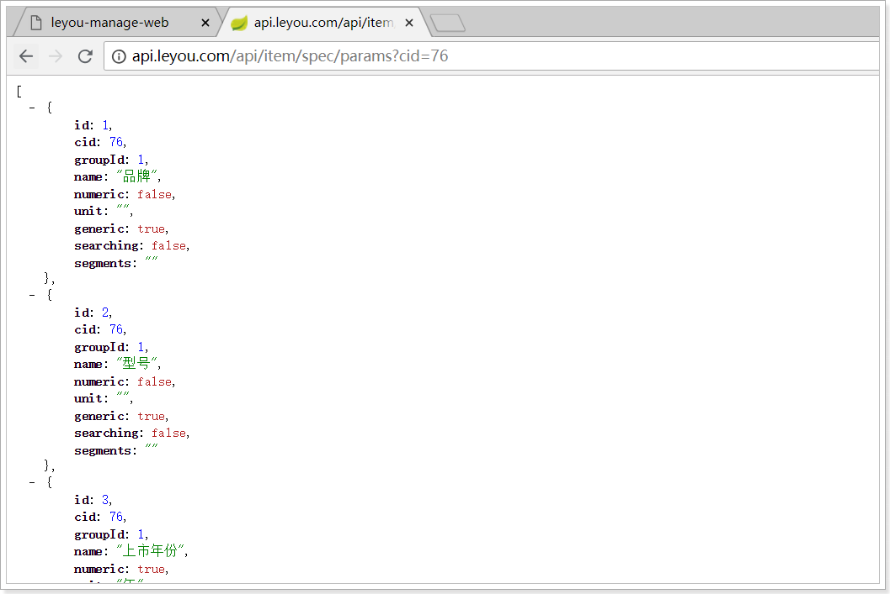


刷新页面测试：

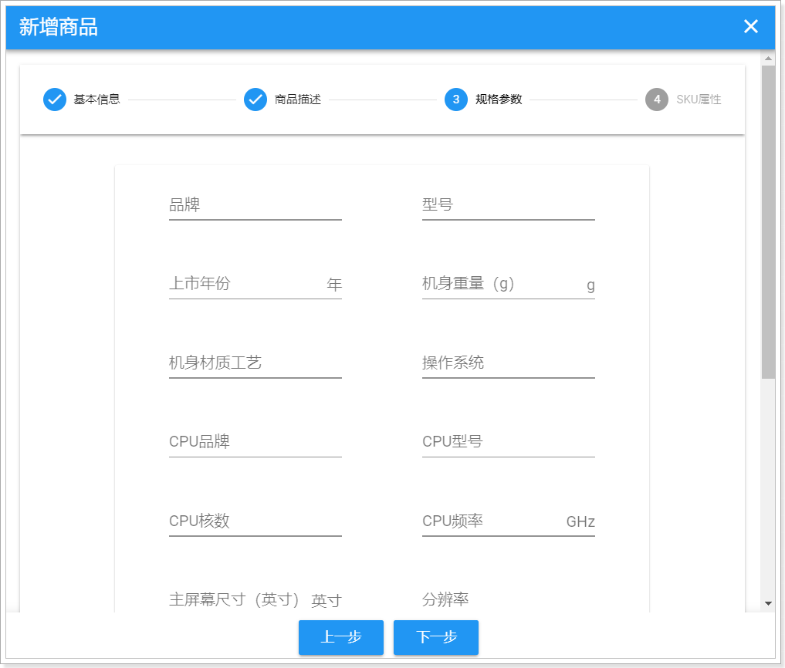


## 1.5.SKU信息

Sku属性是SPU下的每个商品的不同特征，如图：

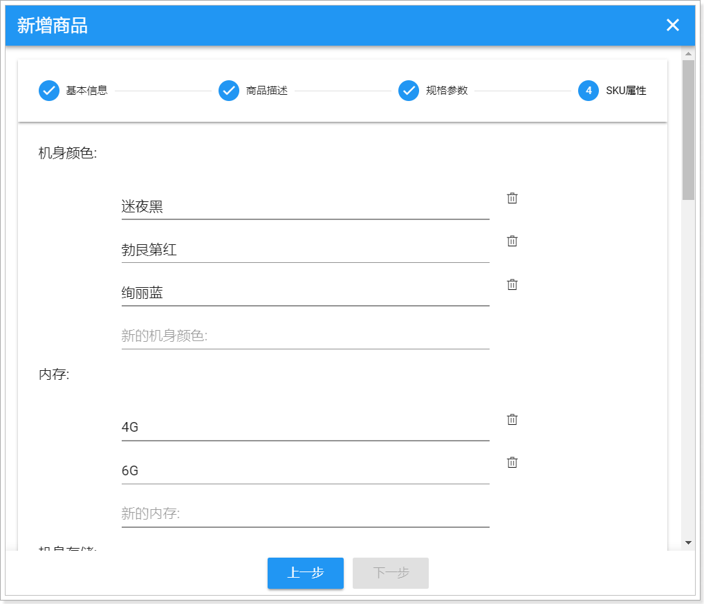

当我们填写一些属性后，会在页面下方生成一个sku表格，大家可以计算下会生成多少个不同属性的Sku呢？

当你选择了上图中的这些选项时：

- 颜色共2种：迷夜黑，勃艮第红，绚丽蓝
- 内存共2种：4GB，6GB
- 机身存储1种：64GB，128GB

此时会产生多少种SKU呢？ 应该是 3 * 2 * 2 = 12种，这其实就是在求笛卡尔积。

我们会在页面下方生成一个sku的表格：

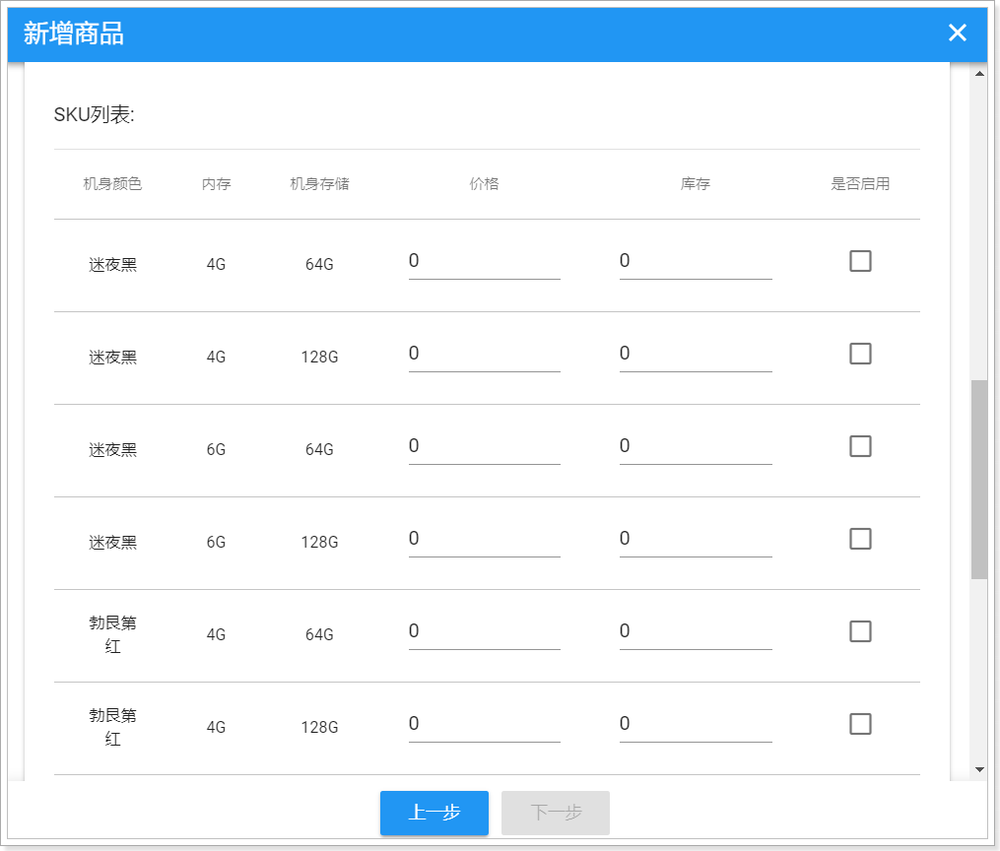


## 1.6.页面表单提交

在sku列表的下方，有一个提交按钮：

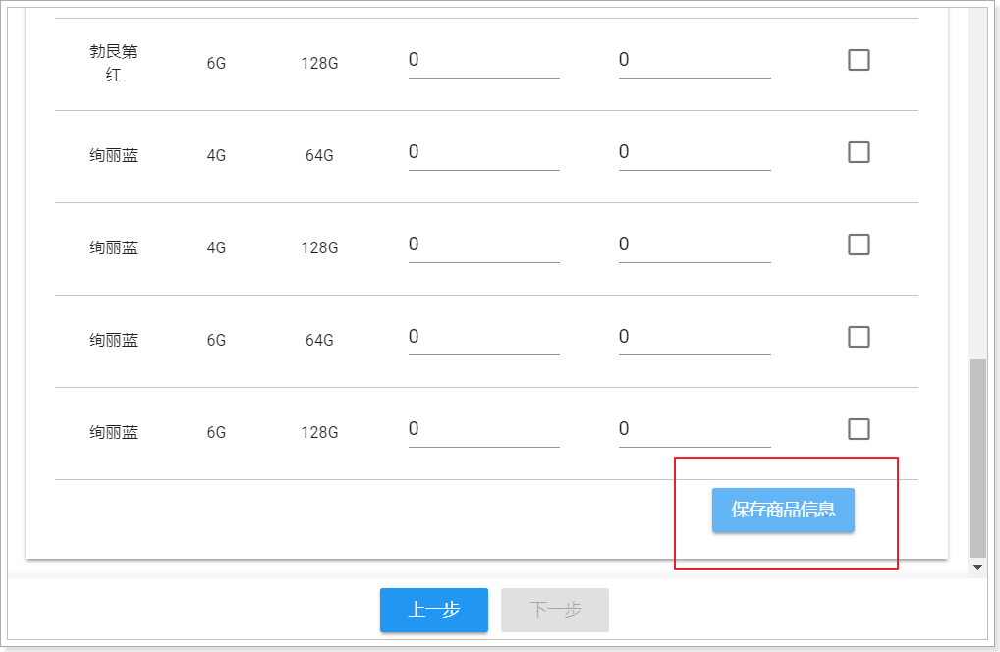

并且绑定了点击事件：

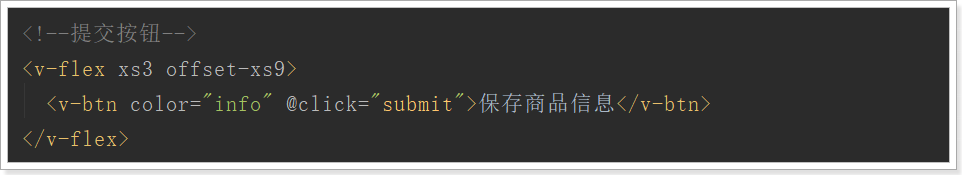

点击后会组织数据并向后台提交：

```js
    submit() {
      // 表单校验。
      if(!this.$refs.basic.validate){
        this.$message.error("请先完成表单内容！");
      }
      // 先处理goods，用结构表达式接收,除了categories外，都接收到goodsParams中
      const {
        categories: [{ id: cid1 }, { id: cid2 }, { id: cid3 }],
        ...goodsParams
      } = this.goods;
      // 处理规格参数
      const specs = {};
      this.specs.forEach(({ id,v }) => {
        specs[id] = v;
      });
      // 处理特有规格参数模板
      const specTemplate = {};
      this.specialSpecs.forEach(({ id, options }) => {
        specTemplate[id] = options;
      });
      // 处理sku
      const skus = this.skus
        .filter(s => s.enable)
        .map(({ price, stock, enable, images, indexes, ...rest }) => {
          // 标题，在spu的title基础上，拼接特有规格属性值
          const title = goodsParams.title + " " + Object.values(rest).map(v => v.v).join(" ");
          const obj = {};
          Object.values(rest).forEach(v => {
            obj[v.id] = v.v;
          });
          return {
            price: this.$format(price), // 价格需要格式化
            stock,
            indexes,
            enable,
            title, // 基本属性
            images: images ? images.join(",") : '', // 图片
            ownSpec: JSON.stringify(obj) // 特有规格参数
          };
        });
      Object.assign(goodsParams, {
        cid1,
        cid2,
        cid3, // 商品分类
        skus // sku列表
      });
      goodsParams.spuDetail.genericSpec = JSON.stringify(specs);
      goodsParams.spuDetail.specialSpec = JSON.stringify(specTemplate);

      // 提交到后台
      this.$http({
        method: this.isEdit ? "put" : "post",
        url: "/item/goods",
        data: goodsParams
      })
        .then(() => {
          // 成功，关闭窗口
          this.$emit("close");
          // 提示成功
          this.$message.success("保存成功了");
        })
        .catch(() => {
          this.$message.error("保存失败！");
        });
    }
```


点击提交，查看控制台提交的数据格式：

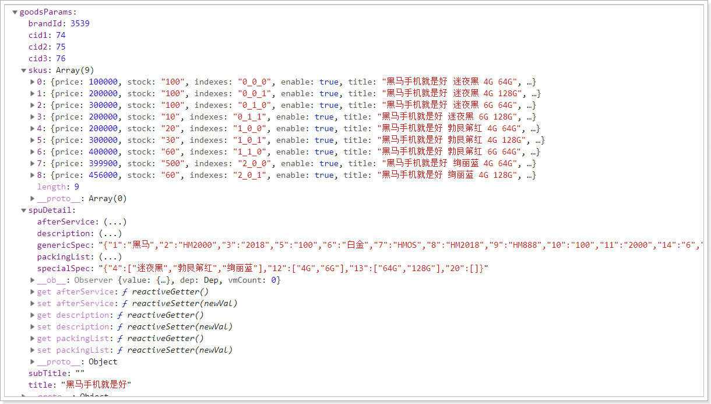

整体是一个json格式数据，包含Spu表所有数据：

- brandId：品牌id
- cid1、cid2、cid3：商品分类id
- subTitle：副标题
- title：标题
- spuDetail：是一个json对象，代表商品详情表数据
  - afterService：售后服务
  - description：商品描述
  - packingList：包装列表
  - specialSpec：sku规格属性模板
  - genericSpec：通用规格参数
- skus：spu下的所有sku数组，元素是每个sku对象：
  - title：标题
  - images：图片
  - price：价格
  - stock：库存
  - ownSpec：特有规格参数
  - indexes：特有规格参数的下标


## 1.7.后台实现

### 1.7.1.实体类

SPU和SpuDetail实体类已经添加过，添加Sku和Stock对象：

 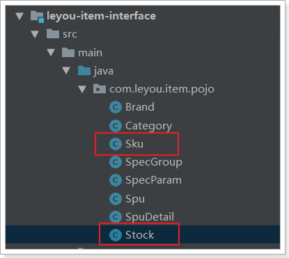

> Sku

```java
@Table(name = "tb_sku")
public class Sku {
    @Id
    @GeneratedValue(strategy = GenerationType.IDENTITY)
    private Long id;
    private Long spuId;
    private String title;
    private String images;
    private Long price;
    private String ownSpec;// 商品特殊规格的键值对
    private String indexes;// 商品特殊规格的下标
    private Boolean enable;// 是否有效，逻辑删除用
    private Date createTime;// 创建时间
    private Date lastUpdateTime;// 最后修改时间
    @Transient
    private Integer stock;// 库存
}
```

注意：这里保存了一个库存字段，在数据库中是另外一张表保存的，方便查询。

> Stock

```java
@Table(name = "tb_stock")
public class Stock {
    @Id
    private Long skuId;
    private Integer seckillStock;// 秒杀可用库存
    private Integer seckillTotal;// 已秒杀数量
    private Integer stock;// 正常库存
}
```


### 1.7.2.GoodsController

结合浏览器页面控制台，可以发现：

请求方式：POST

请求路径：/goods

请求参数：Spu的json格式的对象，spu中包含spuDetail和Sku集合。这里我们该怎么接收？我们之前定义了一个SpuBo对象，作为业务对象。这里也可以用它，不过需要再扩展spuDetail和skus字段：

```java
public class SpuBo extends Spu {

    String cname;// 商品分类名称
    String bname;// 品牌名称
    SpuDetail spuDetail;// 商品详情
    List<Sku> skus;// sku列表
}
```

- 返回类型：无


在GoodsController中添加新增商品的代码：

```java
@PostMapping("goods")
public ResponseEntity<Void> saveGoods(@RequestBody SpuBo spuBo){
    this.goodsService.saveGoods(spuBo);
    return ResponseEntity.status(HttpStatus.CREATED).build();
}
```

注意：通过@RequestBody注解来接收Json请求

### 1.7.3.GoodsService

这里的逻辑比较复杂，我们除了要对SPU新增以外，还要对SpuDetail、Sku、Stock进行保存

```java
/**
     * 新增商品
     * @param spuBo
     */
@Transactional
public void saveGoods(SpuBo spuBo) {
    // 新增spu
    // 设置默认字段
    spuBo.setId(null);
    spuBo.setSaleable(true);
    spuBo.setValid(true);
    spuBo.setCreateTime(new Date());
    spuBo.setLastUpdateTime(spuBo.getCreateTime());
    this.spuMapper.insertSelective(spuBo);

    // 新增spuDetail
    SpuDetail spuDetail = spuBo.getSpuDetail();
    spuDetail.setSpuId(spuBo.getId());
    this.spuDetailMapper.insertSelective(spuDetail);

    saveSkuAndStock(spuBo);
}

private void saveSkuAndStock(SpuBo spuBo) {
    spuBo.getSkus().forEach(sku -> {
        // 新增sku
        sku.setSpuId(spuBo.getId());
        sku.setCreateTime(new Date());
        sku.setLastUpdateTime(sku.getCreateTime());
        this.skuMapper.insertSelective(sku);

        // 新增库存
        Stock stock = new Stock();
        stock.setSkuId(sku.getId());
        stock.setStock(sku.getStock());
        this.stockMapper.insertSelective(stock);
    });
}
```


### 1.7.4.Mapper

都是通用Mapper，略

目录结构：

 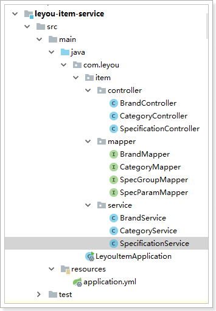


# 2.商品修改

## 2.1.编辑按钮点击事件

在商品详情页，每一个商品后面，都会有一个编辑按钮：

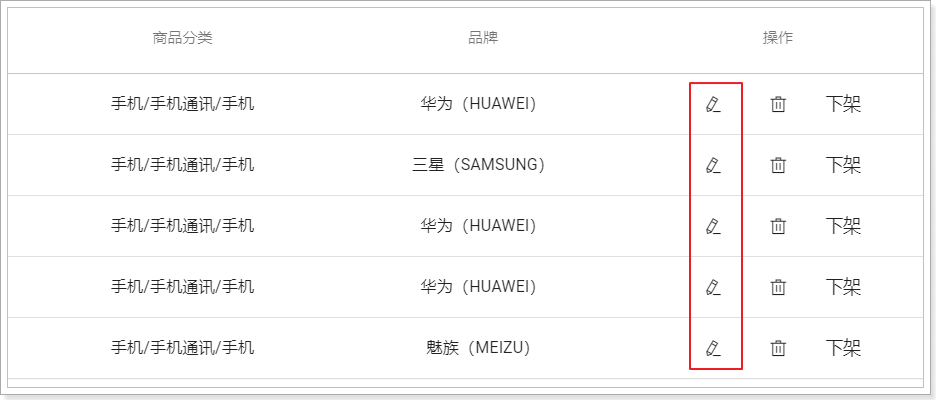

点击这个按钮，就会打开一个商品编辑窗口，我们看下它所绑定的点击事件：（在item/Goods.vue）

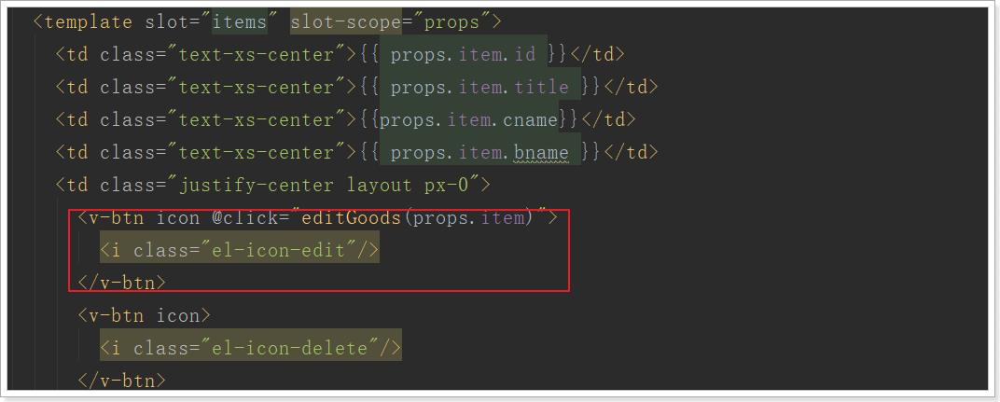

对应的方法：

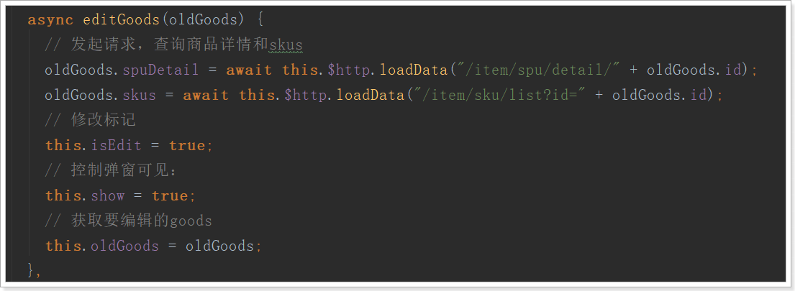

可以看到这里发起了两个请求，在查询商品详情和sku信息。

因为在商品列表页面，只有spu的基本信息：id、标题、品牌、商品分类等。比较复杂的商品详情（spuDetail)和sku信息都没有，编辑页面要回显数据，就需要查询这些内容。

因此，接下来我们就编写后台接口，提供查询服务接口。


## 2.2.查询SpuDetail接口

> GoodsController

需要分析的内容：

- 请求方式：GET
- 请求路径：/spu/detail/{id}
- 请求参数：id，应该是spu的id
- 返回结果：SpuDetail对象

```java
@GetMapping("spu/detail/{spuId}")
public ResponseEntity<SpuDetail> querySpuDetailBySpuId(@PathVariable("spuId")Long spuId){
    SpuDetail spuDetail = this.goodsService.querySpuDetailBySpuId(spuId);
    if (spuDetail == null) {
        return ResponseEntity.notFound().build();
    }
    return ResponseEntity.ok(spuDetail);
}
```

> GoodsService

```java
/**
     * 根据spuId查询spuDetail
     * @param spuId
     * @return
     */
public SpuDetail querySpuDetailBySpuId(Long spuId) {

    return this.spuDetailMapper.selectByPrimaryKey(spuId);
}
```

> 测试

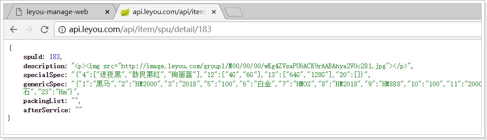


## 2.3.查询sku

> 分析

- 请求方式：Get
- 请求路径：/sku/list
- 请求参数：id，应该是spu的id
- 返回结果：sku的集合

> GoodsController

```java
@GetMapping("sku/list")
public ResponseEntity<List<Sku>> querySkusBySpuId(@RequestParam("id")Long spuId){
    List<Sku> skus = this.goodsService.querySkusBySpuId(spuId);
    if (CollectionUtils.isEmpty(skus)) {
        return ResponseEntity.notFound().build();
    }
    return ResponseEntity.ok(skus);
}
```


> GoodsService

需要注意的是，为了页面回显方便，我们一并把sku的库存stock也查询出来

```java
/**
     * 根据spuId查询sku的集合
     * @param spuId
     * @return
     */
public List<Sku> querySkusBySpuId(Long spuId) {
    Sku sku = new Sku();
    sku.setSpuId(spuId);
    List<Sku> skus = this.skuMapper.select(sku);
    skus.forEach(s -> {
        Stock stock = this.stockMapper.selectByPrimaryKey(s.getId());
        s.setStock(stock.getStock());
    });
    return skus;
}
```

> 测试：

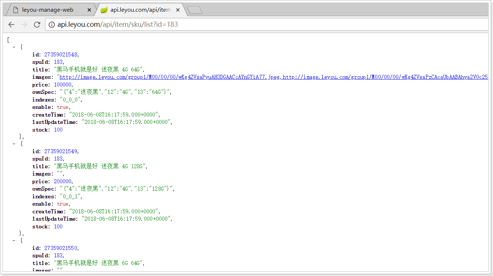


## 2.4.页面回显

随便点击一个编辑按钮，发现数据回显完成：

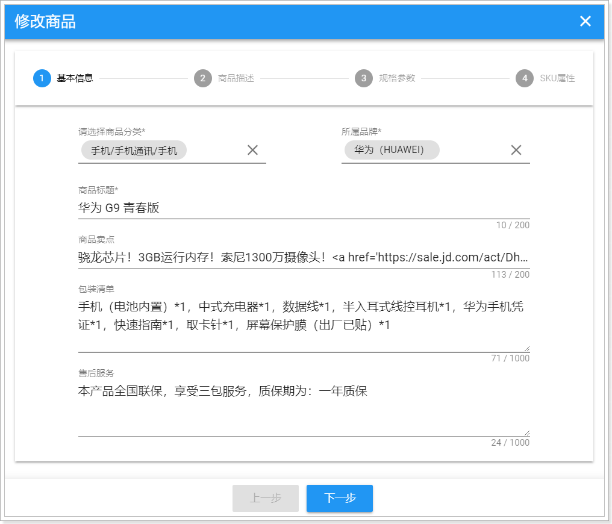

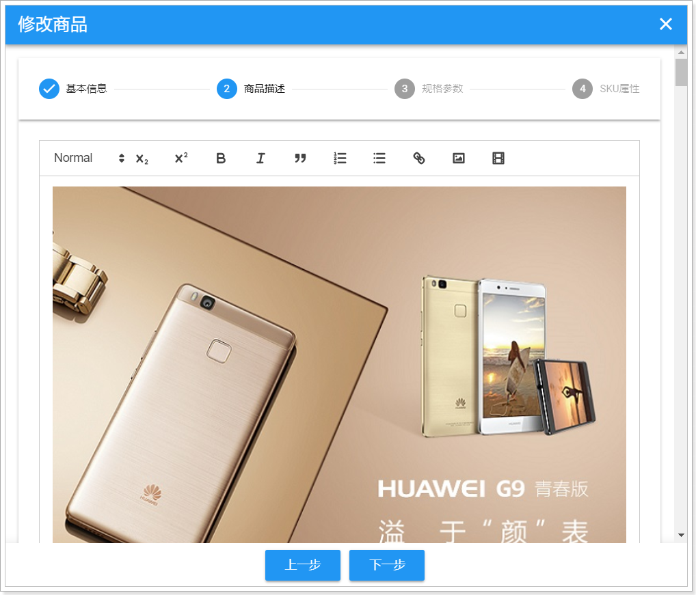

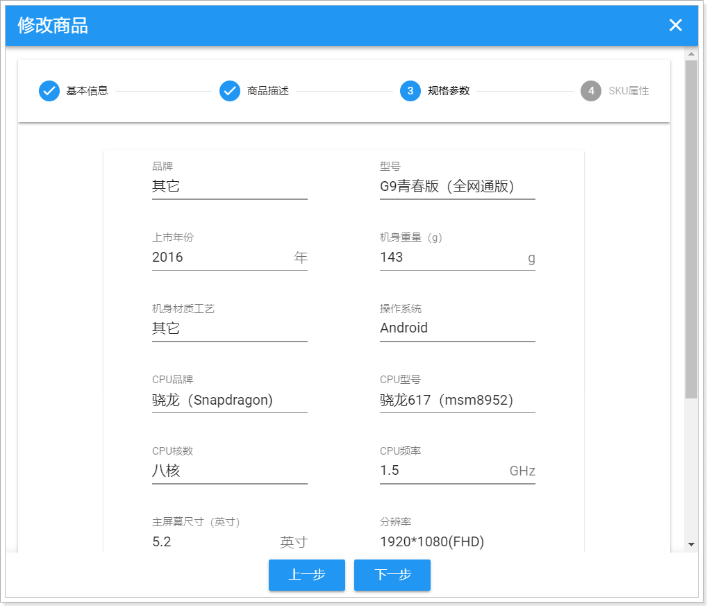

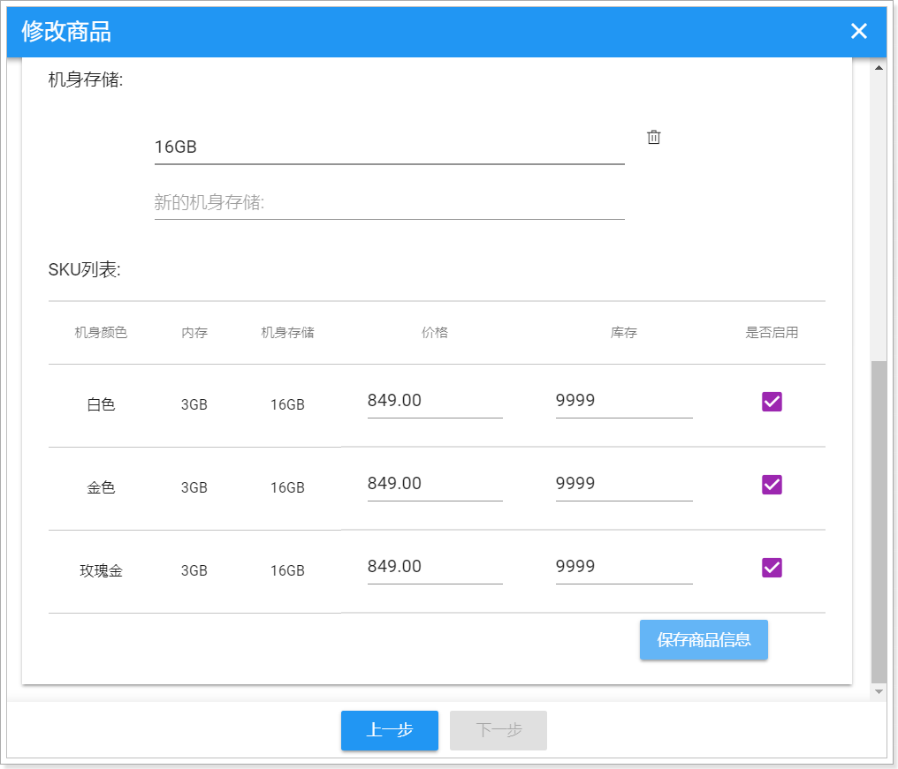


## 2.5.页面提交

这里的保存按钮与新增其实是同一个，因此提交的逻辑也是一样的，这里不再赘述。

随便修改点数据，然后点击保存，可以看到浏览器已经发出请求：

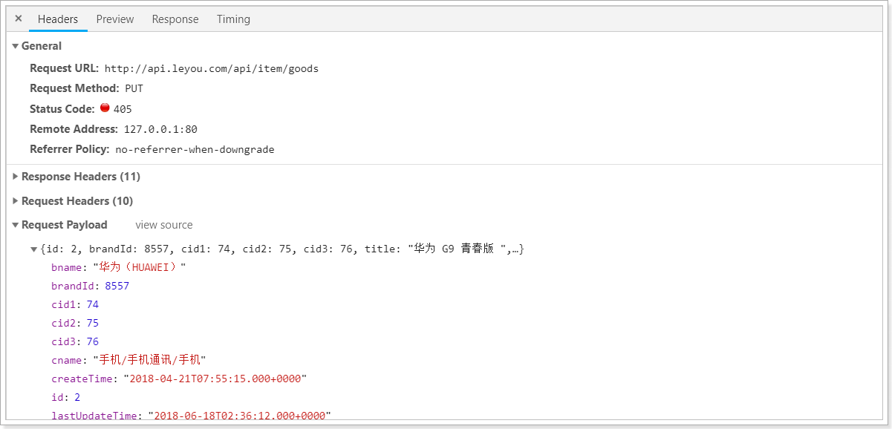


## 2.6.后台实现

接下来，我们编写后台，实现修改商品接口。

### 2.6.1.GoodsController

- 请求方式：PUT
- 请求路径：/
- 请求参数：Spu对象
- 返回结果：无

```java
@PutMapping("goods")
public ResponseEntity<Void> updateGoods(@RequestBody SpuBo spuBo){
    this.goodsService.updateGoods(spuBo);
    return ResponseEntity.status(HttpStatus.NO_CONTENT).build();
}
```


### 2.6.2.GoodsService

spu数据可以修改，但是SKU数据无法修改，因为有可能之前存在的SKU现在已经不存在了，或者以前的sku属性都不存在了。比如以前内存有4G，现在没了。

因此这里直接删除以前的SKU，然后新增即可。

代码：

```java
@Transactional
public void update(SpuBo spu) {
    // 查询以前sku
    List<Sku> skus = this.querySkuBySpuId(spu.getId());
    // 如果以前存在，则删除
    if(!CollectionUtils.isEmpty(skus)) {
        List<Long> ids = skus.stream().map(s -> s.getId()).collect(Collectors.toList());
        // 删除以前库存
        Example example = new Example(Stock.class);
        example.createCriteria().andIn("skuId", ids);
        this.stockMapper.deleteByExample(example);

        // 删除以前的sku
        Sku record = new Sku();
        record.setSpuId(spu.getId());
        this.skuMapper.delete(record);

    }
    // 新增sku和库存
    saveSkuAndStock(spuBo);

    // 更新spu
    spu.setLastUpdateTime(new Date());
    spu.setCreateTime(null);
    spu.setValid(null);
    spu.setSaleable(null);
    this.spuMapper.updateByPrimaryKeySelective(spu);

    // 更新spu详情
    this.spuDetailMapper.updateByPrimaryKeySelective(spu.getSpuDetail());
}
```


### 2.6.3.mapper

与以前一样。


## 2.7.其它

商品的删除、上下架大家自行实现。


# 3.搭建前台系统

后台系统的内容暂时告一段落，有了商品，接下来我们就要在页面展示商品，给用户提供浏览和购买的入口，那就是我们的门户系统。

门户系统面向的是用户，安全性很重要，而且搜索引擎对于单页应用并不友好。因此我们的门户系统不再采用与后台系统类似的SPA（单页应用）。

依然是前后端分离，不过前端的页面会使用独立的html，在每个页面中使用vue来做页面渲染。


## 3.1.静态资源

webpack打包多页应用配置比较繁琐，项目结构也相对复杂。这里为了简化开发（毕竟我们不是专业的前端人员），我们不再使用webpack，而是直接编写原生的静态HTML。


### 3.1.1.创建工程

创建一个新的工程：

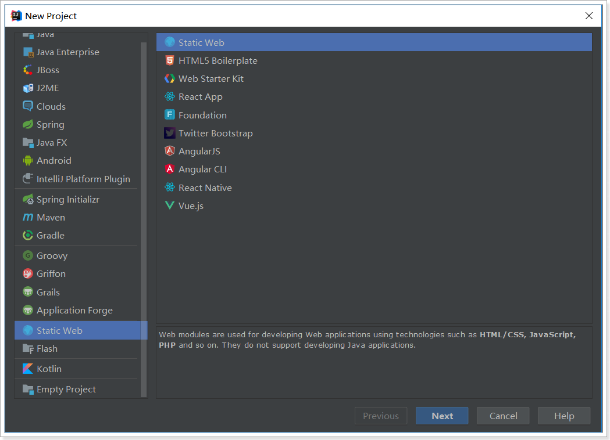

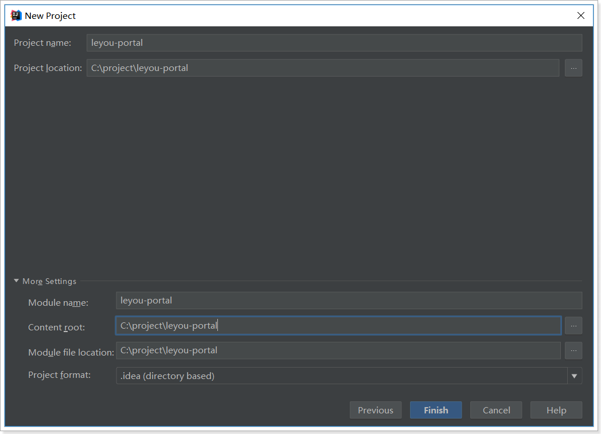


### 3.1.2.导入静态资源

将课前资料中的leyou-portal解压，并复制到这个项目下

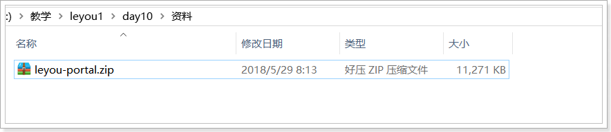

解压缩：

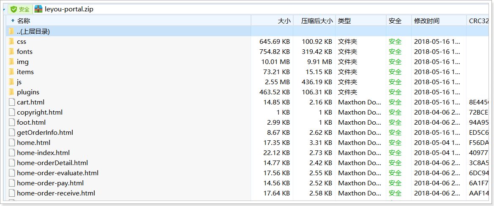

项目结构：

 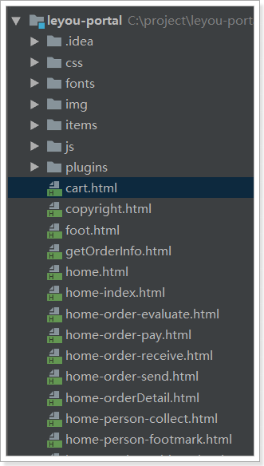


## 3.2.live-server

没有webpack，我们就无法使用webpack-dev-server运行这个项目，实现热部署。

所以，这里我们使用另外一种热部署方式：live-server，

### 3.2.1.简介

地址；https://www.npmjs.com/package/live-server

 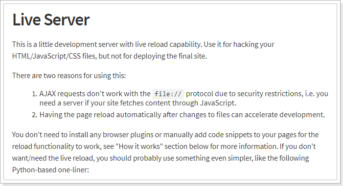

这是一款带有热加载功能的小型开发服务器。用它来展示你的HTML / JavaScript / CSS，但不能用于部署最终的网站。 


### 3.2.2.安装和运行参数

安装，使用npm命令即可，这里建议全局安装，以后任意位置可用

```
npm install -g live-server
```


运行时，直接输入命令：

```
live-server
```

另外，你可以在运行命令后，跟上一些参数以配置：

- `--port=NUMBER` - 选择要使用的端口，默认值：PORT env var或8080
- `--host=ADDRESS` - 选择要绑定的主机地址，默认值：IP env var或0.0.0.0（“任意地址”）
- `--no-browser` - 禁止自动Web浏览器启动
- `--browser=BROWSER` - 指定使用浏览器而不是系统默认值
- `--quiet | -q` - 禁止记录
- `--verbose | -V` - 更多日志记录（记录所有请求，显示所有侦听的IPv4接口等）
- `--open=PATH` - 启动浏览器到PATH而不是服务器root
- `--watch=PATH` - 用逗号分隔的路径来专门监视变化（默认值：观看所有内容）
- `--ignore=PATH`- 要忽略的逗号分隔的路径字符串（[anymatch](https://github.com/es128/anymatch) -compatible definition）
- `--ignorePattern=RGXP`-文件的正则表达式忽略（即`.*\.jade`）（**不推荐使用**赞成`--ignore`）
- `--middleware=PATH` - 导出要添加的中间件功能的.js文件的路径; 可以是没有路径的名称，也可以是引用`middleware`文件夹中捆绑的中间件的扩展名
- `--entry-file=PATH` - 提供此文件（服务器根目录）代替丢失的文件（对单页应用程序有用）
- `--mount=ROUTE:PATH` - 在定义的路线下提供路径内容（可能有多个定义）
- `--spa` - 将请求从/ abc转换为/＃/ abc（方便单页应用）
- `--wait=MILLISECONDS` - （默认100ms）等待所有更改，然后重新加载
- `--htpasswd=PATH` - 启用期待位于PATH的htpasswd文件的http-auth
- `--cors` - 为任何来源启用CORS（反映请求源，支持凭证的请求）
- `--https=PATH` - 到HTTPS配置模块的路径
- `--proxy=ROUTE:URL` - 代理ROUTE到URL的所有请求
- `--help | -h` - 显示简洁的使用提示并退出
- `--version | -v` - 显示版本并退出


### 3.2.3.测试

我们进入leyou-portal目录，输入命令：

```
live-server --port=9002
```

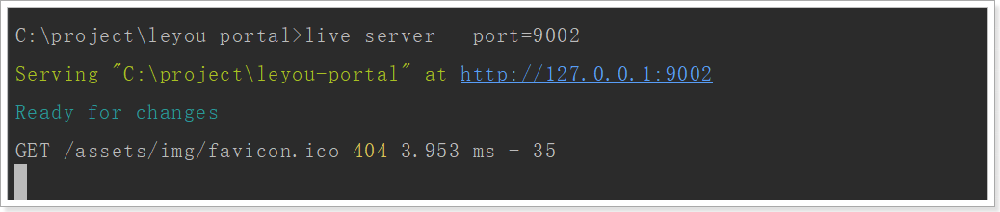


## 3.3.域名访问

现在我们访问只能通过：http://127.0.0.1:9002

我们希望用域名访问：http://www.leyou.com

第一步，修改hosts文件，添加一行配置：

```
127.0.0.1 www.leyou.com
```

第二步，修改nginx配置，将www.leyou.com反向代理到127.0.0.1:9002

```nginx
server {
    listen       80;
    server_name  www.leyou.com;

    proxy_set_header X-Forwarded-Host $host;
    proxy_set_header X-Forwarded-Server $host;
    proxy_set_header X-Forwarded-For $proxy_add_x_forwarded_for;

    location / {
        proxy_pass http://127.0.0.1:9002;
        proxy_connect_timeout 600;
        proxy_read_timeout 600;
    }
}
```

重新加载nginx配置：`nginx.exe -s reload`

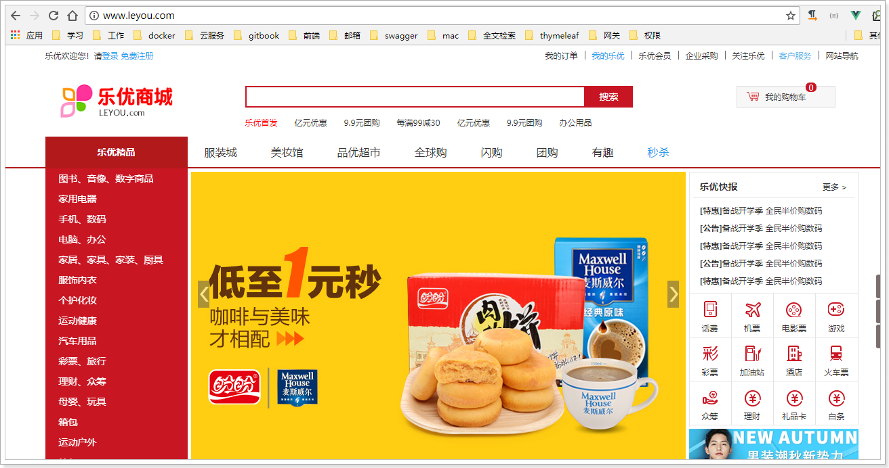


## 3.4.common.js

为了方便后续的开发，我们在前台系统中定义了一些工具，放在了common.js中：

 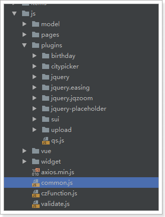


部分代码截图：

 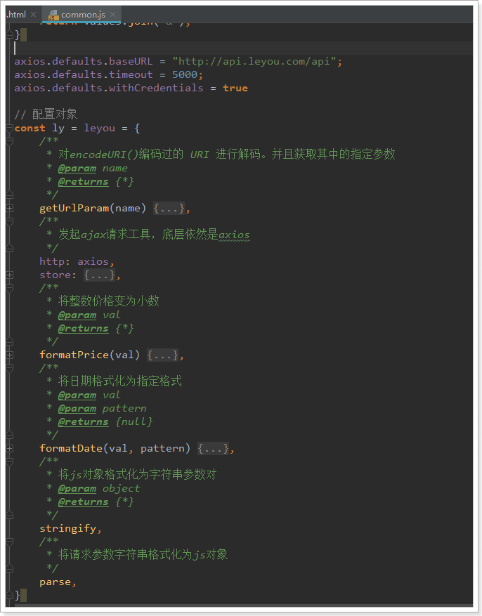

首先对axios进行了一些全局配置，请求超时时间，请求的基础路径，是否允许跨域操作cookie等

定义了对象 ly ，也叫leyou，包含了下面的属性：

- getUrlParam(key)：获取url路径中的参数
- http：axios对象的别名。以后发起ajax请求，可以用ly.http.get()
- store：localstorage便捷操作，后面用到再详细说明
- formatPrice：格式化价格，如果传入的是字符串，则扩大100被并转为数字，如果传入是数字，则缩小100倍并转为字符串
- formatDate(val, pattern)：对日期对象val按照指定的pattern模板进行格式化
- stringify：将对象转为参数字符串
- parse：将参数字符串变为js对象