# 0.学习目标

- 独立安装Elasticsearch
- 会使用Rest的API操作索引
- 会使用Rest的API查询数据
- 会使用Rest的API聚合数据
- 掌握Spring Data Elasticsearch使用


# 1.Elasticsearch介绍和安装

用户访问我们的首页，一般都会直接搜索来寻找自己想要购买的商品。

而商品的数量非常多，而且分类繁杂。如何能正确的显示出用户想要的商品，并进行合理的过滤，尽快促成交易，是搜索系统要研究的核心。

面对这样复杂的搜索业务和数据量，使用传统数据库搜索就显得力不从心，一般我们都会使用全文检索技术，比如之前大家学习过的Solr。

不过今天，我们要讲的是另一个全文检索技术：Elasticsearch。


## 1.1.简介

### 1.1.1.Elastic

Elastic官网：https://www.elastic.co/cn/

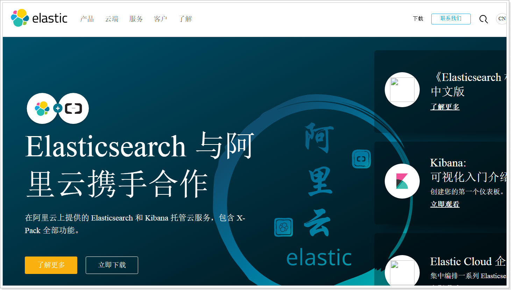

Elastic有一条完整的产品线及解决方案：Elasticsearch、Kibana、Logstash等，前面说的三个就是大家常说的ELK技术栈。

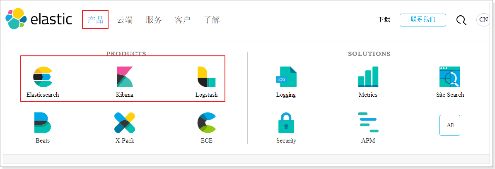


### 1.1.2.Elasticsearch

Elasticsearch官网：https://www.elastic.co/cn/products/elasticsearch

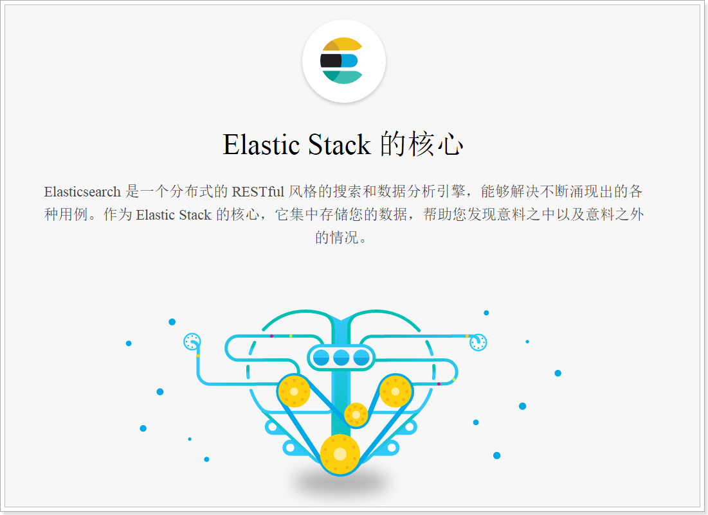

如上所述，Elasticsearch具备以下特点：

- 分布式，无需人工搭建集群（solr就需要人为配置，使用Zookeeper作为注册中心）
- Restful风格，一切API都遵循Rest原则，容易上手
- 近实时搜索，数据更新在Elasticsearch中几乎是完全同步的。


### 1.1.3.版本

目前Elasticsearch最新的版本是6.3.1，我们就使用6.3.0

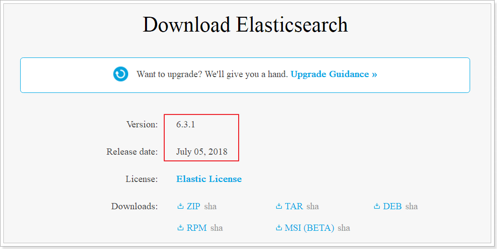

需要虚拟机JDK1.8及以上


## 1.2.安装和配置

为了模拟真实场景，我们将在linux下安装Elasticsearch。

### 1.2.1.新建一个用户leyou

出于安全考虑，elasticsearch默认不允许以root账号运行。

创建用户：

```sh
useradd leyou
```

设置密码：

```
passwd leyou
```

切换用户：

```
su - leyou
```


### 1.2.2.上传安装包,并解压

我们将安装包上传到：/home/leyou目录

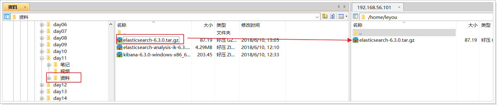

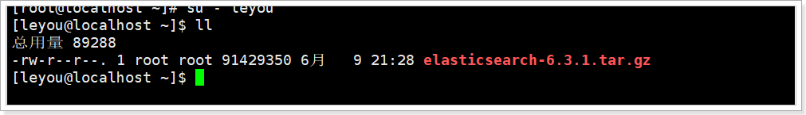

解压缩：

```
tar -zxvf elasticsearch-6.2.4.tar.gz
```


我们把目录重命名：

```
mv elasticsearch-6.3.0/ elasticsearch
```

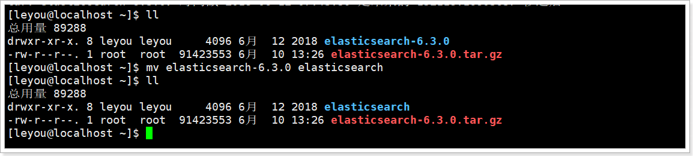

进入，查看目录结构：

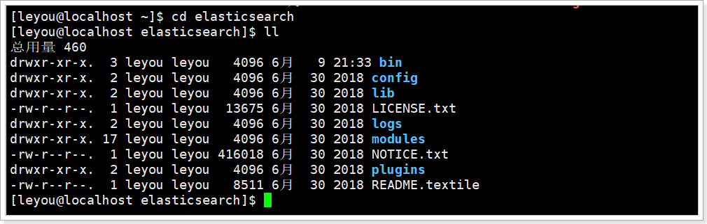


### 1.2.3.修改配置

我们进入config目录：`cd config`

需要修改的配置文件有两个：

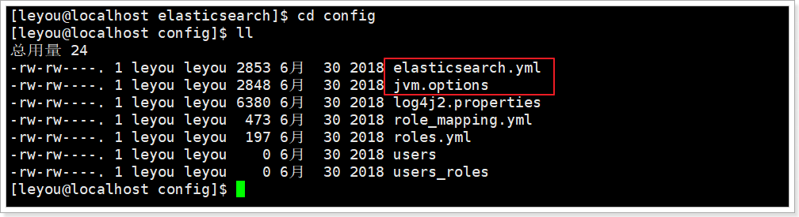

1. **jvm.options**

Elasticsearch基于Lucene的，而Lucene底层是java实现，因此我们需要配置jvm参数。

编辑jvm.options：

```
vim jvm.options
```

默认配置如下：

```
-Xms1g
-Xmx1g
```

内存占用太多了，我们调小一些：

```
-Xms512m
-Xmx512m
```

2. **elasticsearch.yml**

```
vim elasticsearch.yml
```

- 修改数据和日志目录：


```yml
path.data: /home/leyou/elasticsearch/data # 数据目录位置
path.logs: /home/leyou/elasticsearch/logs # 日志目录位置
```

我们把data和logs目录修改指向了elasticsearch的安装目录。但是这两个目录并不存在，因此我们需要创建出来。

进入elasticsearch的根目录，然后创建：

```
mkdir data
mkdir logs
```

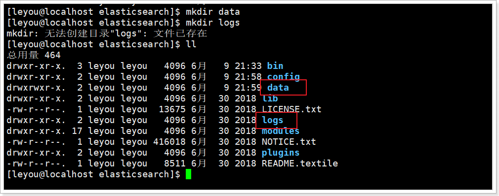


- 修改绑定的ip：

```
network.host: 0.0.0.0 # 绑定到0.0.0.0，允许任何ip来访问
```

默认只允许本机访问，修改为0.0.0.0后则可以远程访问


目前我们是做的单机安装，如果要做集群，只需要在这个配置文件中添加其它节点信息即可。

> elasticsearch.yml的其它可配置信息：

| 属性名                             | 说明                                                         |
| ---------------------------------- | ------------------------------------------------------------ |
| cluster.name                       | 配置elasticsearch的集群名称，默认是elasticsearch。建议修改成一个有意义的名称。 |
| node.name                          | 节点名，es会默认随机指定一个名字，建议指定一个有意义的名称，方便管理 |
| path.conf                          | 设置配置文件的存储路径，tar或zip包安装默认在es根目录下的config文件夹，rpm安装默认在/etc/ elasticsearch |
| path.data                          | 设置索引数据的存储路径，默认是es根目录下的data文件夹，可以设置多个存储路径，用逗号隔开 |
| path.logs                          | 设置日志文件的存储路径，默认是es根目录下的logs文件夹         |
| path.plugins                       | 设置插件的存放路径，默认是es根目录下的plugins文件夹          |
| bootstrap.memory_lock              | 设置为true可以锁住ES使用的内存，避免内存进行swap             |
| network.host                       | 设置bind_host和publish_host，设置为0.0.0.0允许外网访问       |
| http.port                          | 设置对外服务的http端口，默认为9200。                         |
| transport.tcp.port                 | 集群结点之间通信端口                                         |
| discovery.zen.ping.timeout         | 设置ES自动发现节点连接超时的时间，默认为3秒，如果网络延迟高可设置大些 |
| discovery.zen.minimum_master_nodes | 主结点数量的最少值 ,此值的公式为：(master_eligible_nodes / 2) + 1 ，比如：有3个符合要求的主结点，那么这里要设置为2 |
|                                    |                                                              |


## 1.3.运行

进入elasticsearch/bin目录，可以看到下面的执行文件：

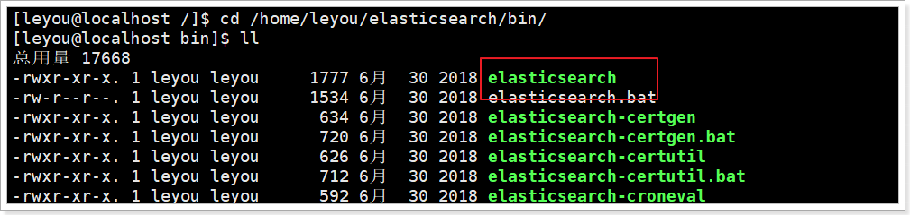

然后输入命令：

```
./elasticsearch
```

发现报错了，启动失败。


### 1.3.1.错误1：内核过低

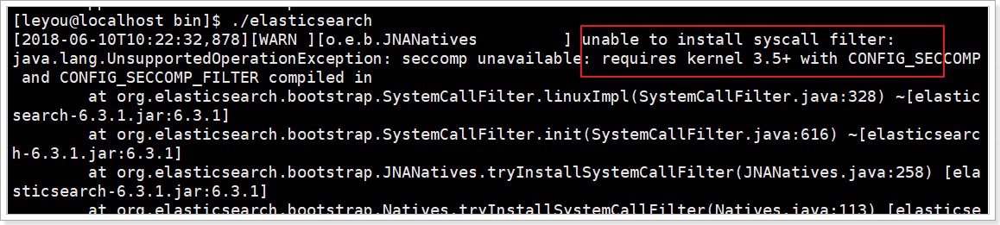

我们使用的是centos6，其linux内核版本为2.6。而Elasticsearch的插件要求至少3.5以上版本。不过没关系，我们禁用这个插件即可。

修改elasticsearch.yml文件，在最下面添加如下配置：

```
bootstrap.system_call_filter: false
```

然后重启


### 1.3.2.错误2：文件权限不足

再次启动，又出错了：

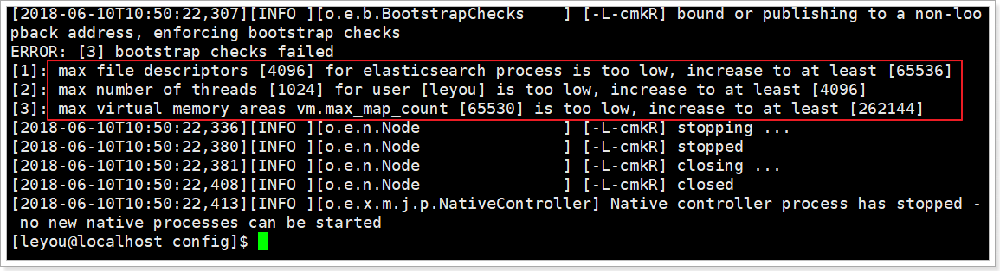

```
[1]: max file descriptors [4096] for elasticsearch process likely too low, increase to at least [65536]
```

我们用的是leyou用户，而不是root，所以文件权限不足。

**首先用root用户登录。**

然后修改配置文件:

```
vim /etc/security/limits.conf
```

添加下面的内容：

```
* soft nofile 65536

* hard nofile 131072

* soft nproc 4096

* hard nproc 4096
```


### 1.3.3.错误3：线程数不够

刚才报错中，还有一行：

```
[1]: max number of threads [1024] for user [leyou] is too low, increase to at least [4096]
```

这是线程数不够。

继续修改配置：

```
vim /etc/security/limits.d/90-nproc.conf 
```

修改下面的内容：

```
* soft nproc 1024
```

改为：

```
* soft nproc 4096
```


### 1.3.4.错误4：进程虚拟内存

```
[3]: max virtual memory areas vm.max_map_count [65530] likely too low, increase to at least [262144]
```

vm.max_map_count：限制一个进程可以拥有的VMA(虚拟内存区域)的数量，继续修改配置文件， ：

```
vim /etc/sysctl.conf 
```

添加下面内容：

```
vm.max_map_count=655360
```

然后执行命令：

```
sysctl -p
```


### 1.3.5.重启终端窗口

所有错误修改完毕，一定要重启你的 Xshell终端，否则配置无效。


### 1.3.6.启动

再次启动，终于成功了！

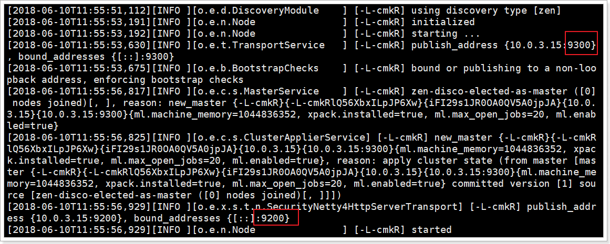

可以看到绑定了两个端口:

- 9300：集群节点间通讯接口
- 9200：客户端访问接口

我们在浏览器中访问：http://192.168.56.101:9200

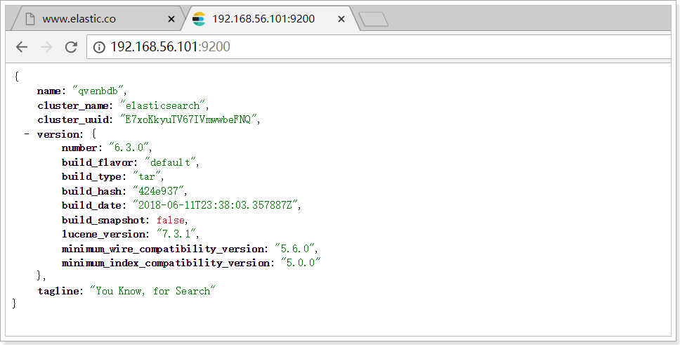


## 1.4.安装kibana

### 1.4.1.什么是Kibana？

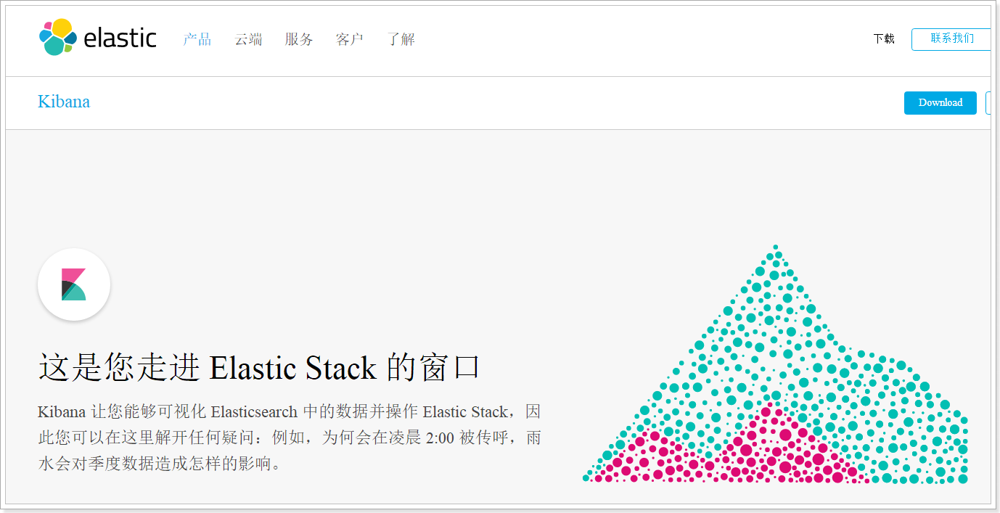

Kibana是一个基于Node.js的Elasticsearch索引库数据统计工具，可以利用Elasticsearch的聚合功能，生成各种图表，如柱形图，线状图，饼图等。

而且还提供了操作Elasticsearch索引数据的控制台，并且提供了一定的API提示，非常有利于我们学习Elasticsearch的语法。


### 1.4.2.安装

因为Kibana依赖于node，我们的虚拟机没有安装node，而window中安装过。所以我们选择在window下使用kibana。

最新版本与elasticsearch保持一致，也是6.3.0

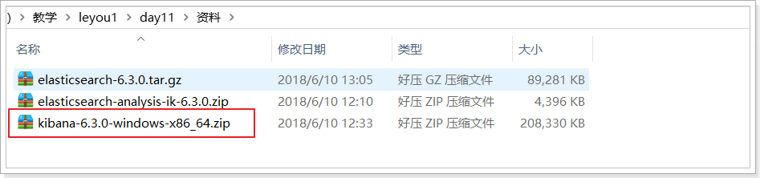

解压到特定目录即可


### 1.4.3.配置运行

> 配置

进入安装目录下的config目录，修改kibana.yml文件：

修改elasticsearch服务器的地址：

```
elasticsearch.url: "http://192.168.56.101:9200"
```

> 运行

进入安装目录下的bin目录：

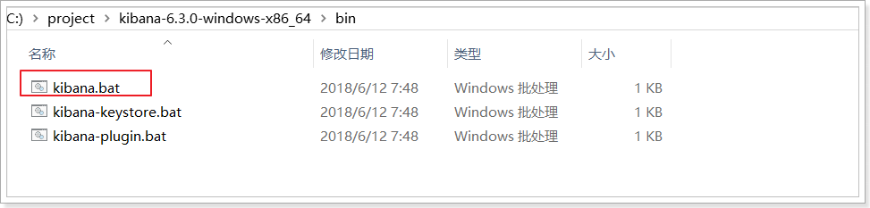

双击运行：

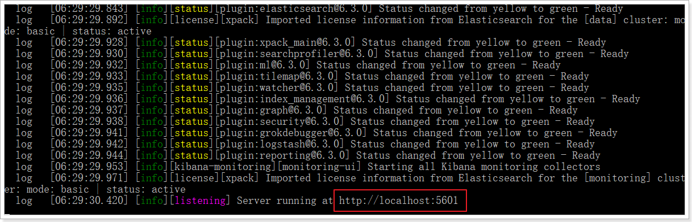

发现kibana的监听端口是5601

我们访问：http://127.0.0.1:5601

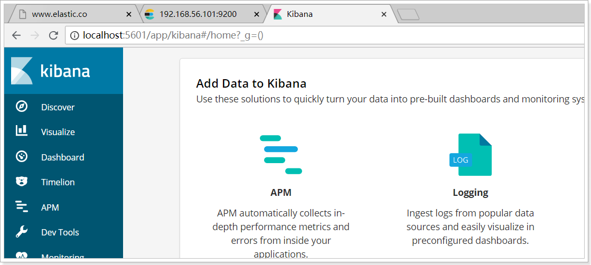


### 1.4.4.控制台

选择左侧的DevTools菜单，即可进入控制台页面：

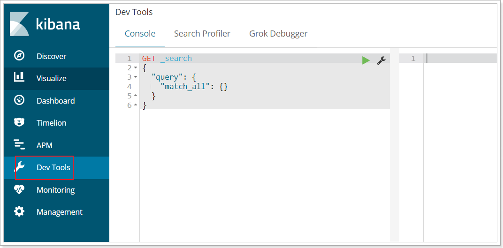


在页面右侧，我们就可以输入请求，访问Elasticsearch了。

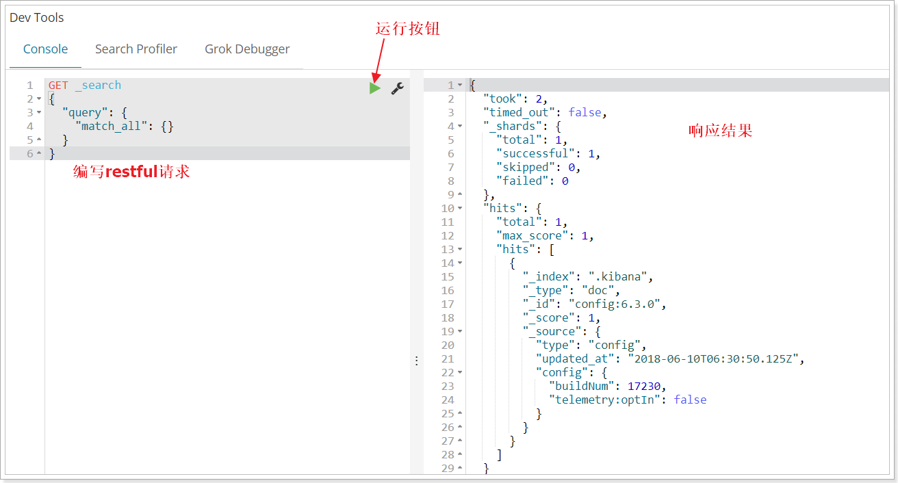


## 1.5.安装ik分词器

Lucene的IK分词器早在2012年已经没有维护了，现在我们要使用的是在其基础上维护升级的版本，并且开发为ElasticSearch的集成插件了，与Elasticsearch一起维护升级，版本也保持一致，最新版本：6.3.0

### 1.5.1.安装

上传课前资料中的zip包，解压到Elasticsearch目录的plugins目录中：

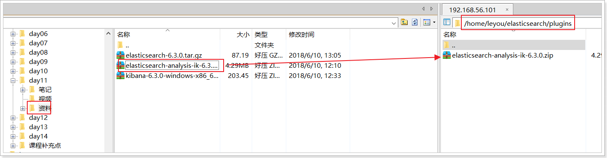

使用unzip命令解压：

```
unzip elasticsearch-analysis-ik-6.3.0.zip -d ik-analyzer
```

然后重启elasticsearch：

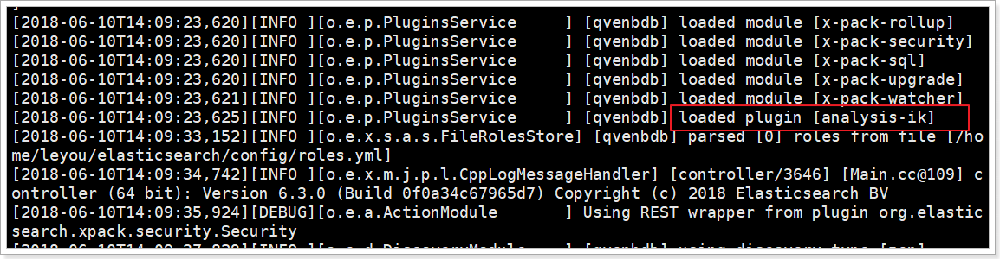


### 1.5.2.测试

大家先不管语法，我们先测试一波。

在kibana控制台输入下面的请求：

```
POST _analyze
{
  "analyzer": "ik_max_word",
  "text":     "我是中国人"
}
```

运行得到结果：

```
{
  "tokens": [
    {
      "token": "我",
      "start_offset": 0,
      "end_offset": 1,
      "type": "CN_CHAR",
      "position": 0
    },
    {
      "token": "是",
      "start_offset": 1,
      "end_offset": 2,
      "type": "CN_CHAR",
      "position": 1
    },
    {
      "token": "中国人",
      "start_offset": 2,
      "end_offset": 5,
      "type": "CN_WORD",
      "position": 2
    },
    {
      "token": "中国",
      "start_offset": 2,
      "end_offset": 4,
      "type": "CN_WORD",
      "position": 3
    },
    {
      "token": "国人",
      "start_offset": 3,
      "end_offset": 5,
      "type": "CN_WORD",
      "position": 4
    }
  ]
}
```


## 1.7.API

Elasticsearch提供了Rest风格的API，即http请求接口，而且也提供了各种语言的客户端API

### 1.7.1.Rest风格API

文档地址：https://www.elastic.co/guide/en/elasticsearch/reference/current/index.html

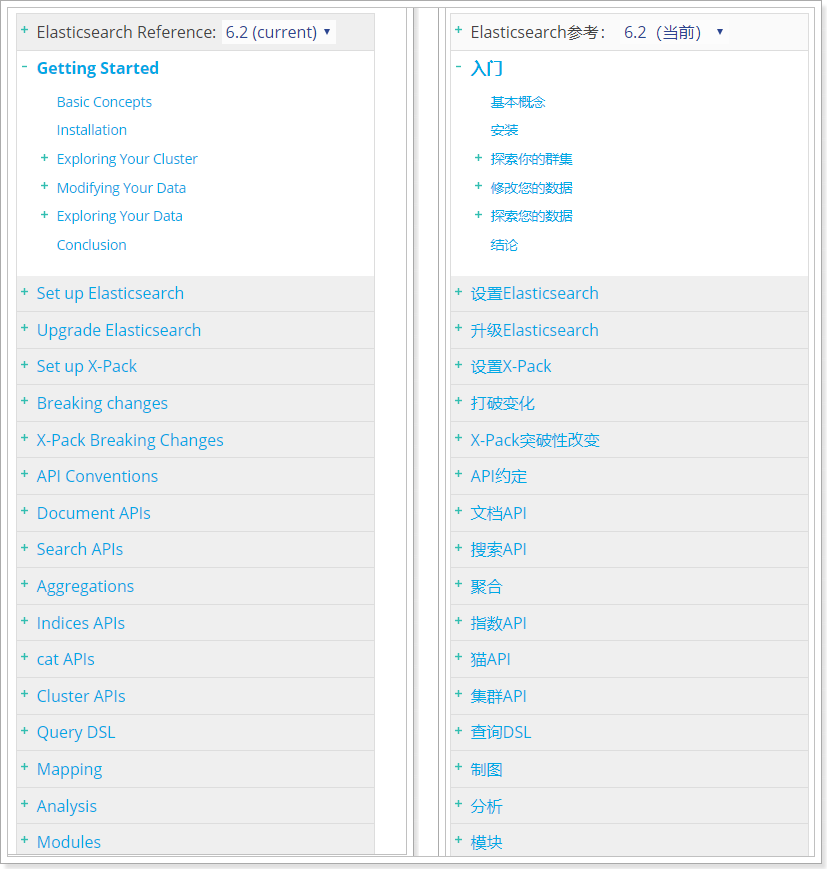


### 1.7.2.客户端API

Elasticsearch支持的客户端非常多：https://www.elastic.co/guide/en/elasticsearch/client/index.html

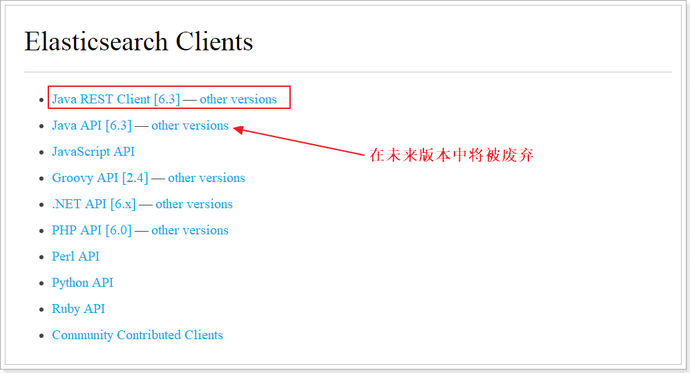

点击Java Rest Client后，你会发现又有两个：

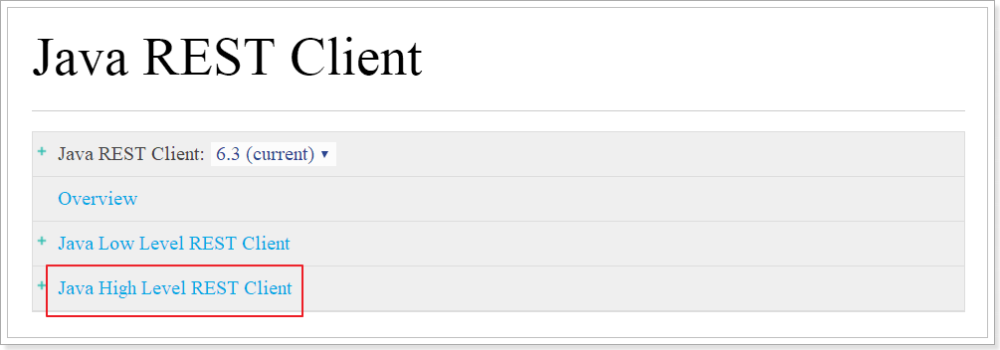


Low Level Rest Client是低级别封装，提供一些基础功能，但更灵活

High Level Rest Client，是在Low  Level Rest Client基础上进行的高级别封装，功能更丰富和完善，而且API会变的简单

 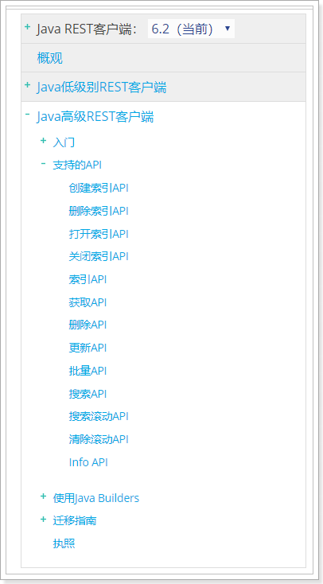


### 1.7.3.如何学习

建议先学习Rest风格API，了解发起请求的底层实现，请求体格式等。


# 2.操作索引

## 2.1.基本概念

Elasticsearch也是基于Lucene的全文检索库，本质也是存储数据，很多概念与MySQL类似的。

对比关系：

```
索引（indices）--------------------------------Databases 数据库

  类型（type）-----------------------------Table 数据表

     文档（Document）----------------Row 行

	   字段（Field）-------------------Columns 列 
```


详细说明：

| 概念                 | 说明                                                         |
| -------------------- | ------------------------------------------------------------ |
| 索引库（indices)     | indices是index的复数，代表许多的索引，                       |
| 类型（type）         | 类型是模拟mysql中的table概念，一个索引库下可以有不同类型的索引，比如商品索引，订单索引，其数据格式不同。不过这会导致索引库混乱，因此未来版本中会移除这个概念 |
| 文档（document）     | 存入索引库原始的数据。比如每一条商品信息，就是一个文档       |
| 字段（field）        | 文档中的属性                                                 |
| 映射配置（mappings） | 字段的数据类型、属性、是否索引、是否存储等特性               |


是不是与Lucene和solr中的概念类似。

另外，在SolrCloud中，有一些集群相关的概念，在Elasticsearch也有类似的：

- 索引集（Indices，index的复数）：逻辑上的完整索引 collection1 
- 分片（shard）：数据拆分后的各个部分
- 副本（replica）：每个分片的复制


要注意的是：Elasticsearch本身就是分布式的，因此即便你只有一个节点，Elasticsearch默认也会对你的数据进行分片和副本操作，当你向集群添加新数据时，数据也会在新加入的节点中进行平衡。


## 2.2.创建索引

### 2.2.1.语法

Elasticsearch采用Rest风格API，因此其API就是一次http请求，你可以用任何工具发起http请求

创建索引的请求格式：

- 请求方式：PUT

- 请求路径：/索引库名

- 请求参数：json格式：

  ```json
  {
      "settings": {
          "number_of_shards": 3,
          "number_of_replicas": 2
        }
  }
  ```

  - settings：索引库的设置
    - number_of_shards：分片数量
    - number_of_replicas：副本数量


### 2.2.2.测试

我们先用RestClient来试试


响应：

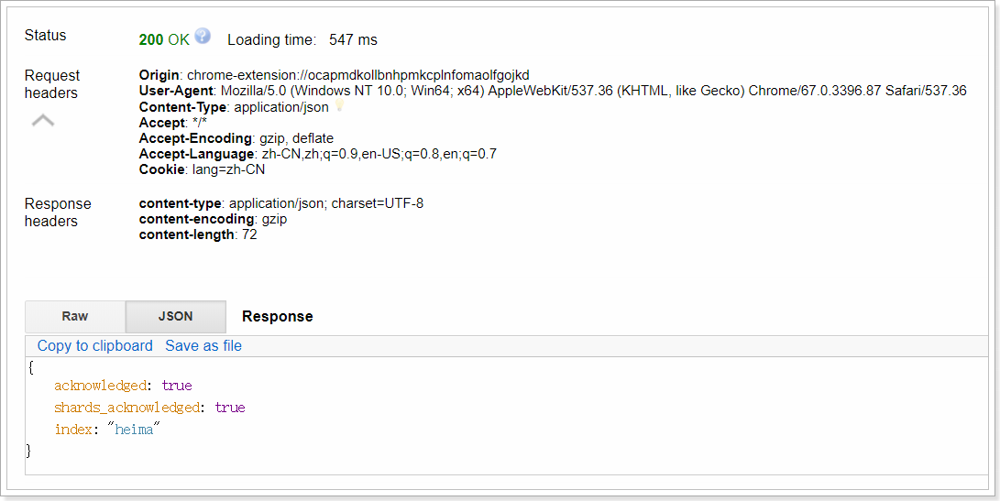

可以看到索引创建成功了。

### 2.2.3.使用kibana创建

kibana的控制台，可以对http请求进行简化，示例：

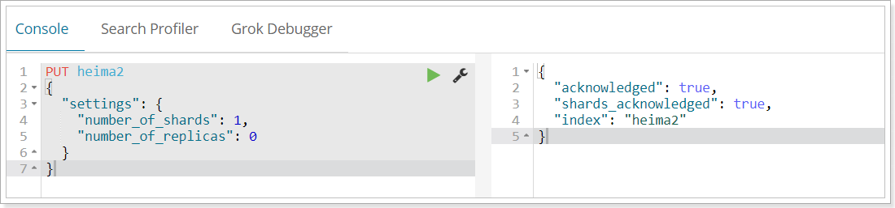

相当于是省去了elasticsearch的服务器地址

而且还有语法提示，非常舒服。


## 2.3.查看索引设置

> 语法

Get请求可以帮我们查看索引信息，格式：

```
GET /索引库名
```

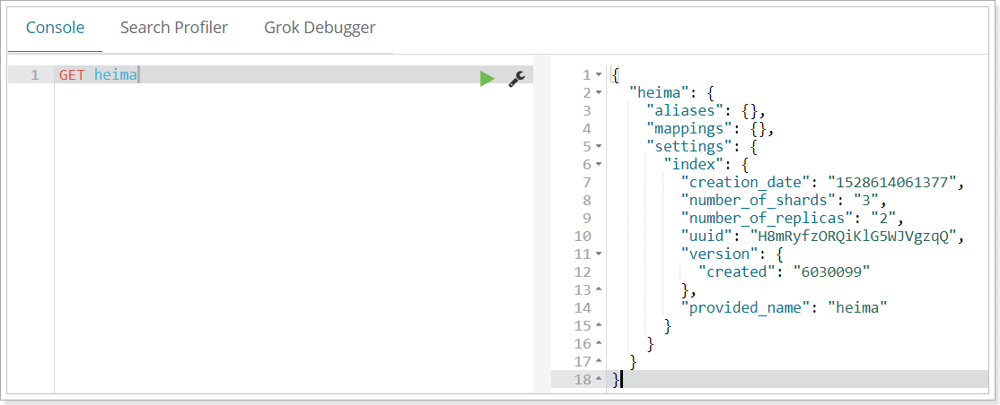


或者，我们可以使用*来查询所有索引库配置：

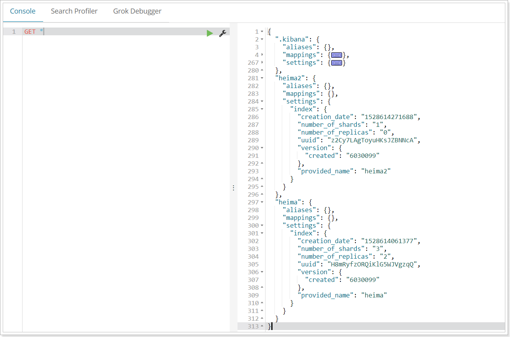


## 2.4.删除索引

删除索引使用DELETE请求

> 语法

```
DELETE /索引库名
```

> 示例

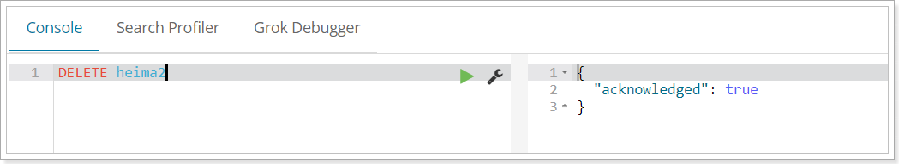

再次查看heima2：

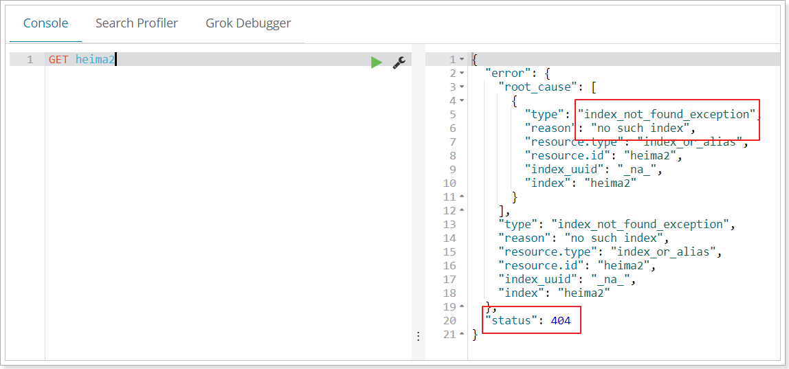

当然，我们也可以用HEAD请求，查看索引是否存在：

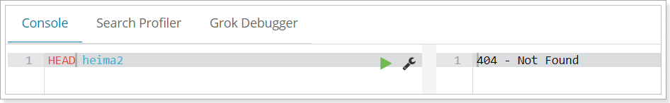


## 2.5.映射配置

索引有了，接下来肯定是添加数据。但是，在添加数据之前必须定义映射。

什么是映射？

> 映射是定义文档的过程，文档包含哪些字段，这些字段是否保存，是否索引，是否分词等

只有配置清楚，Elasticsearch才会帮我们进行索引库的创建（不一定）


### 2.5.1.创建映射字段

> 语法

请求方式依然是PUT 

```
PUT /索引库名/_mapping/类型名称
{
  "properties": {
    "字段名": {
      "type": "类型",
      "index": true，
      "store": true，
      "analyzer": "分词器"
    }
  }
}
```

- 类型名称：就是前面将的type的概念，类似于数据库中的不同表
  字段名：任意填写	，可以指定许多属性，例如：
- type：类型，可以是text、long、short、date、integer、object等
- index：是否索引，默认为true
- store：是否存储，默认为false
- analyzer：分词器，这里的`ik_max_word`即使用ik分词器

> 示例

发起请求：

```json
PUT heima/_mapping/goods
{
  "properties": {
    "title": {
      "type": "text",
      "analyzer": "ik_max_word"
    },
    "images": {
      "type": "keyword",
      "index": "false"
    },
    "price": {
      "type": "float"
    }
  }
}

```

响应结果：

```
{
  "acknowledged": true
}

```


### 2.5.2.查看映射关系

> 语法：

```
GET /索引库名/_mapping
```

> 示例：

```
GET /heima/_mapping
```

> 响应：

```json
{
  "heima": {
    "mappings": {
      "goods": {
        "properties": {
          "images": {
            "type": "keyword",
            "index": false
          },
          "price": {
            "type": "float"
          },
          "title": {
            "type": "text",
            "analyzer": "ik_max_word"
          }
        }
      }
    }
  }
}
```


### 2.5.3.字段属性详解

#### 2.5.3.1.type

Elasticsearch中支持的数据类型非常丰富：

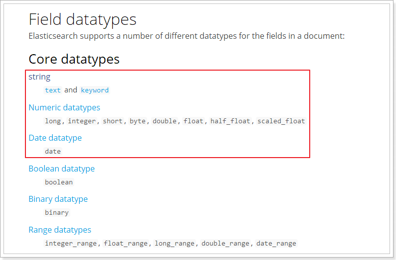

我们说几个关键的：

- String类型，又分两种：

  - text：可分词，不可参与聚合
  - keyword：不可分词，数据会作为完整字段进行匹配，可以参与聚合

- Numerical：数值类型，分两类

  - 基本数据类型：long、interger、short、byte、double、float、half_float
  - 浮点数的高精度类型：scaled_float
    - 需要指定一个精度因子，比如10或100。elasticsearch会把真实值乘以这个因子后存储，取出时再还原。

- Date：日期类型

  elasticsearch可以对日期格式化为字符串存储，但是建议我们存储为毫秒值，存储为long，节省空间。


#### 2.5.3.2.index

index影响字段的索引情况。

- true：字段会被索引，则可以用来进行搜索。默认值就是true
- false：字段不会被索引，不能用来搜索

index的默认值就是true，也就是说你不进行任何配置，所有字段都会被索引。

但是有些字段是我们不希望被索引的，比如商品的图片信息，就需要手动设置index为false。


#### 2.5.3.3.store

是否将数据进行额外存储。

在学习lucene和solr时，我们知道如果一个字段的store设置为false，那么在文档列表中就不会有这个字段的值，用户的搜索结果中不会显示出来。

但是在Elasticsearch中，即便store设置为false，也可以搜索到结果。

原因是Elasticsearch在创建文档索引时，会将文档中的原始数据备份，保存到一个叫做`_source`的属性中。而且我们可以通过过滤`_source`来选择哪些要显示，哪些不显示。

而如果设置store为true，就会在`_source`以外额外存储一份数据，多余，因此一般我们都会将store设置为false，事实上，**store的默认值就是false。**


#### 2.5.3.4.boost

激励因子，这个与lucene中一样

其它的不再一一讲解，用的不多，大家参考官方文档：

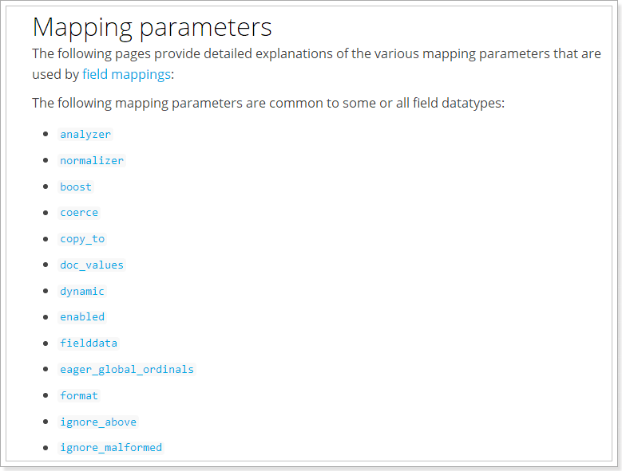


## 2.6.新增数据

### 2.6.1.随机生成id

通过POST请求，可以向一个已经存在的索引库中添加数据。

> 语法：

```
POST /索引库名/类型名
{
    "key":"value"
}
```

> 示例：

```json
POST /heima/goods/
{
    "title":"小米手机",
    "images":"http://image.leyou.com/12479122.jpg",
    "price":2699.00
}
```

响应：

```json
{
  "_index": "heima",
  "_type": "goods",
  "_id": "r9c1KGMBIhaxtY5rlRKv",
  "_version": 1,
  "result": "created",
  "_shards": {
    "total": 3,
    "successful": 1,
    "failed": 0
  },
  "_seq_no": 0,
  "_primary_term": 2
}
```


通过kibana查看数据：

```js
get _search
{
    "query":{
        "match_all":{}
    }
}
```


```json
{
  "_index": "heima",
  "_type": "goods",
  "_id": "r9c1KGMBIhaxtY5rlRKv",
  "_version": 1,
  "_score": 1,
  "_source": {
    "title": "小米手机",
    "images": "http://image.leyou.com/12479122.jpg",
    "price": 2699
  }
}
```

- `_source`：源文档信息，所有的数据都在里面。
- `_id`：这条文档的唯一标示，与文档自己的id字段没有关联


### 2.6.2.自定义id

如果我们想要自己新增的时候指定id，可以这么做：

```
POST /索引库名/类型/id值
{
    ...
}

```

示例：

```json
POST /heima/goods/2
{
    "title":"大米手机",
    "images":"http://image.leyou.com/12479122.jpg",
    "price":2899.00
}
```

得到的数据：

```json
{
  "_index": "heima",
  "_type": "goods",
  "_id": "2",
  "_score": 1,
  "_source": {
    "title": "大米手机",
    "images": "http://image.leyou.com/12479122.jpg",
    "price": 2899
  }
}
```


### 2.6.3.智能判断

在学习Solr时我们发现，我们在新增数据时，只能使用提前配置好映射属性的字段，否则就会报错。

不过在Elasticsearch中并没有这样的规定。

事实上Elasticsearch非常智能，你不需要给索引库设置任何mapping映射，它也可以根据你输入的数据来判断类型，动态添加数据映射。

测试一下：

```json
POST /heima/goods/3
{
    "title":"超米手机",
    "images":"http://image.leyou.com/12479122.jpg",
    "price":2899.00,
    "stock": 200,
    "saleable":true
}
```

我们额外添加了stock库存，和saleable是否上架两个字段。

来看结果：

```json
{
  "_index": "heima",
  "_type": "goods",
  "_id": "3",
  "_version": 1,
  "_score": 1,
  "_source": {
    "title": "超米手机",
    "images": "http://image.leyou.com/12479122.jpg",
    "price": 2899,
    "stock": 200,
    "saleable": true
  }
}
```

在看下索引库的映射关系:

```json
{
  "heima": {
    "mappings": {
      "goods": {
        "properties": {
          "images": {
            "type": "keyword",
            "index": false
          },
          "price": {
            "type": "float"
          },
          "saleable": {
            "type": "boolean"
          },
          "stock": {
            "type": "long"
          },
          "title": {
            "type": "text",
            "analyzer": "ik_max_word"
          }
        }
      }
    }
  }
}
```

stock和saleable都被成功映射了。

## 2.7.修改数据

把刚才新增的请求方式改为PUT，就是修改了。不过修改必须指定id，

- id对应文档存在，则修改
- id对应文档不存在，则新增

比如，我们把id为3的数据进行修改：

```json
PUT /heima/goods/3
{
    "title":"超大米手机",
    "images":"http://image.leyou.com/12479122.jpg",
    "price":3899.00,
    "stock": 100,
    "saleable":true
}
```

结果：

```json
{
  "took": 17,
  "timed_out": false,
  "_shards": {
    "total": 9,
    "successful": 9,
    "skipped": 0,
    "failed": 0
  },
  "hits": {
    "total": 1,
    "max_score": 1,
    "hits": [
      {
        "_index": "heima",
        "_type": "goods",
        "_id": "3",
        "_score": 1,
        "_source": {
          "title": "超大米手机",
          "images": "http://image.leyou.com/12479122.jpg",
          "price": 3899,
          "stock": 100,
          "saleable": true
        }
      }
    ]
  }
}
```


## 2.8.删除数据

删除使用DELETE请求，同样，需要根据id进行删除：

> 语法

```
DELETE /索引库名/类型名/id值
```

> 示例：


# 3.查询

我们从4块来讲查询：

- 基本查询
- `_source`过滤
- 结果过滤
- 高级查询
- 排序


## 3.1.基本查询

> 基本语法

```json
GET /索引库名/_search
{
    "query":{
        "查询类型":{
            "查询条件":"查询条件值"
        }
    }
}
```

这里的query代表一个查询对象，里面可以有不同的查询属性

- 查询类型：
  - 例如：`match_all`， `match`，`term` ， `range` 等等
- 查询条件：查询条件会根据类型的不同，写法也有差异，后面详细讲解


### 3.1.1 查询所有（match_all)

> 示例：

```json
GET /heima/_search
{
    "query":{
        "match_all": {}
    }
}
```

- `query`：代表查询对象
- `match_all`：代表查询所有

> 结果：

```json
{
  "took": 2,
  "timed_out": false,
  "_shards": {
    "total": 3,
    "successful": 3,
    "skipped": 0,
    "failed": 0
  },
  "hits": {
    "total": 2,
    "max_score": 1,
    "hits": [
      {
        "_index": "heima",
        "_type": "goods",
        "_id": "2",
        "_score": 1,
        "_source": {
          "title": "大米手机",
          "images": "http://image.leyou.com/12479122.jpg",
          "price": 2899
        }
      },
      {
        "_index": "heima",
        "_type": "goods",
        "_id": "r9c1KGMBIhaxtY5rlRKv",
        "_score": 1,
        "_source": {
          "title": "小米手机",
          "images": "http://image.leyou.com/12479122.jpg",
          "price": 2699
        }
      }
    ]
  }
}
```

- took：查询花费时间，单位是毫秒
- time_out：是否超时
- _shards：分片信息
- hits：搜索结果总览对象
  - total：搜索到的总条数
  - max_score：所有结果中文档得分的最高分
  - hits：搜索结果的文档对象数组，每个元素是一条搜索到的文档信息
    - _index：索引库
    - _type：文档类型
    - _id：文档id
    - _score：文档得分
    - _source：文档的源数据


### 3.1.2 匹配查询（match）

我们先加入一条数据，便于测试：

```json
PUT /heima/goods/3
{
    "title":"小米电视4A",
    "images":"http://image.leyou.com/12479122.jpg",
    "price":3899.00
}
```

现在，索引库中有2部手机，1台电视：

 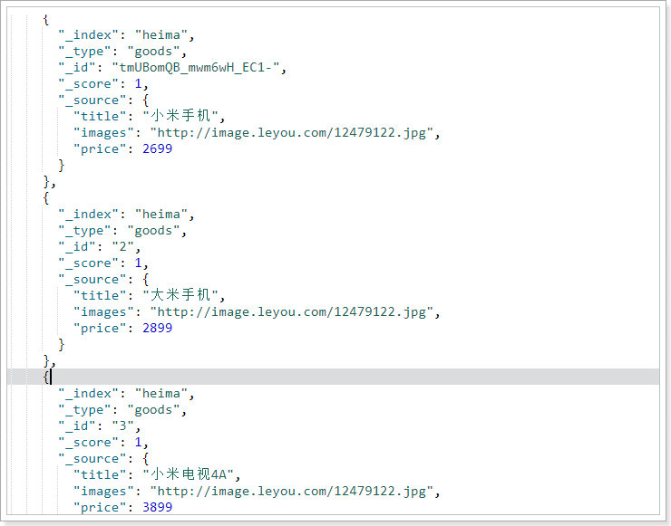

- or关系

`match`类型查询，会把查询条件进行分词，然后进行查询,多个词条之间是or的关系

```json
GET /heima/_search
{
    "query":{
        "match":{
            "title":"小米电视"
        }
    }
}
```

结果：

```json
"hits": {
    "total": 2,
    "max_score": 0.6931472,
    "hits": [
        {
            "_index": "heima",
            "_type": "goods",
            "_id": "tmUBomQB_mwm6wH_EC1-",
            "_score": 0.6931472,
            "_source": {
                "title": "小米手机",
                "images": "http://image.leyou.com/12479122.jpg",
                "price": 2699
            }
        },
        {
            "_index": "heima",
            "_type": "goods",
            "_id": "3",
            "_score": 0.5753642,
            "_source": {
                "title": "小米电视4A",
                "images": "http://image.leyou.com/12479122.jpg",
                "price": 3899
            }
        }
    ]
}
```


在上面的案例中，不仅会查询到电视，而且与小米相关的都会查询到，多个词之间是`or`的关系。


- and关系

某些情况下，我们需要更精确查找，我们希望这个关系变成`and`，可以这样做：

```json
GET /heima/_search
{
    "query":{
        "match": {
          "title": {
            "query": "小米电视",
            "operator": "and"
          }
        }
    }
}
```

结果：

```json
{
  "took": 2,
  "timed_out": false,
  "_shards": {
    "total": 3,
    "successful": 3,
    "skipped": 0,
    "failed": 0
  },
  "hits": {
    "total": 1,
    "max_score": 0.5753642,
    "hits": [
      {
        "_index": "heima",
        "_type": "goods",
        "_id": "3",
        "_score": 0.5753642,
        "_source": {
          "title": "小米电视4A",
          "images": "http://image.leyou.com/12479122.jpg",
          "price": 3899
        }
      }
    ]
  }
}
```

本例中，只有同时包含`小米`和`电视`的词条才会被搜索到。


- or和and之间？

在 `or` 与 `and` 间二选一有点过于非黑即白。 如果用户给定的条件分词后有 5 个查询词项，想查找只包含其中 4 个词的文档，该如何处理？将 operator 操作符参数设置成 `and` 只会将此文档排除。

有时候这正是我们期望的，但在全文搜索的大多数应用场景下，我们既想包含那些可能相关的文档，同时又排除那些不太相关的。换句话说，我们想要处于中间某种结果。

`match` 查询支持 `minimum_should_match` 最小匹配参数， 这让我们可以指定必须匹配的词项数用来表示一个文档是否相关。我们可以将其设置为某个具体数字，更常用的做法是将其设置为一个`百分数`，因为我们无法控制用户搜索时输入的单词数量：

```json
GET /heima/_search
{
    "query":{
        "match":{
            "title":{
            	"query":"小米曲面电视",
            	"minimum_should_match": "75%"
            }
        }
    }
}
```

本例中，搜索语句可以分为3个词，如果使用and关系，需要同时满足3个词才会被搜索到。这里我们采用最小品牌数：75%，那么也就是说只要匹配到总词条数量的75%即可，这里3*75% 约等于2。所以只要包含2个词条就算满足条件了。

结果：

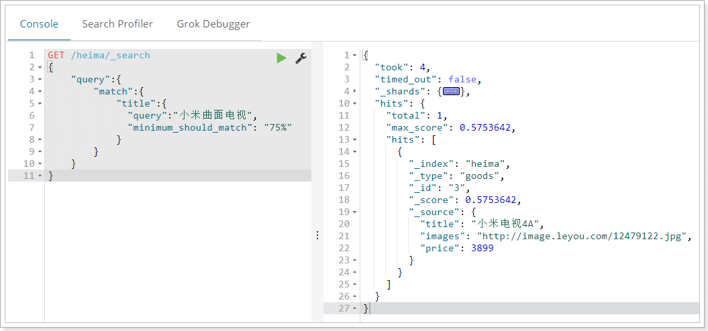


### 3.1.3 多字段查询（multi_match）

`multi_match`与`match`类似，不同的是它可以在多个字段中查询

```json
GET /heima/_search
{
    "query":{
        "multi_match": {
            "query":    "小米",
            "fields":   [ "title", "subTitle" ]
        }
	}
}
```

本例中，我们会在title字段和subtitle字段中查询`小米`这个词


### 3.1.4 词条匹配(term)

`term` 查询被用于精确值 匹配，这些精确值可能是数字、时间、布尔或者那些**未分词**的字符串

```json
GET /heima/_search
{
    "query":{
        "term":{
            "price":2699.00
        }
    }
}
```

结果：

```json
{
  "took": 2,
  "timed_out": false,
  "_shards": {
    "total": 3,
    "successful": 3,
    "skipped": 0,
    "failed": 0
  },
  "hits": {
    "total": 1,
    "max_score": 1,
    "hits": [
      {
        "_index": "heima",
        "_type": "goods",
        "_id": "r9c1KGMBIhaxtY5rlRKv",
        "_score": 1,
        "_source": {
          "title": "小米手机",
          "images": "http://image.leyou.com/12479122.jpg",
          "price": 2699
        }
      }
    ]
  }
}
```


### 3.1.5 多词条精确匹配(terms)

`terms` 查询和 term 查询一样，但它允许你指定多值进行匹配。如果这个字段包含了指定值中的任何一个值，那么这个文档满足条件：

```json
GET /heima/_search
{
    "query":{
        "terms":{
            "price":[2699.00,2899.00,3899.00]
        }
    }
}
```

结果：

```json
{
  "took": 4,
  "timed_out": false,
  "_shards": {
    "total": 3,
    "successful": 3,
    "skipped": 0,
    "failed": 0
  },
  "hits": {
    "total": 3,
    "max_score": 1,
    "hits": [
      {
        "_index": "heima",
        "_type": "goods",
        "_id": "2",
        "_score": 1,
        "_source": {
          "title": "大米手机",
          "images": "http://image.leyou.com/12479122.jpg",
          "price": 2899
        }
      },
      {
        "_index": "heima",
        "_type": "goods",
        "_id": "r9c1KGMBIhaxtY5rlRKv",
        "_score": 1,
        "_source": {
          "title": "小米手机",
          "images": "http://image.leyou.com/12479122.jpg",
          "price": 2699
        }
      },
      {
        "_index": "heima",
        "_type": "goods",
        "_id": "3",
        "_score": 1,
        "_source": {
          "title": "小米电视4A",
          "images": "http://image.leyou.com/12479122.jpg",
          "price": 3899
        }
      }
    ]
  }
}
```


## 3.2.结果过滤

默认情况下，elasticsearch在搜索的结果中，会把文档中保存在`_source`的所有字段都返回。

如果我们只想获取其中的部分字段，我们可以添加`_source`的过滤

### 3.2.1.直接指定字段

示例：

```json
GET /heima/_search
{
  "_source": ["title","price"],
  "query": {
    "term": {
      "price": 2699
    }
  }
}
```

返回的结果：

```json
{
  "took": 12,
  "timed_out": false,
  "_shards": {
    "total": 3,
    "successful": 3,
    "skipped": 0,
    "failed": 0
  },
  "hits": {
    "total": 1,
    "max_score": 1,
    "hits": [
      {
        "_index": "heima",
        "_type": "goods",
        "_id": "r9c1KGMBIhaxtY5rlRKv",
        "_score": 1,
        "_source": {
          "price": 2699,
          "title": "小米手机"
        }
      }
    ]
  }
}
```


### 3.2.2.指定includes和excludes

我们也可以通过：

- includes：来指定想要显示的字段
- excludes：来指定不想要显示的字段

二者都是可选的。

示例：

```json
GET /heima/_search
{
  "_source": {
    "includes":["title","price"]
  },
  "query": {
    "term": {
      "price": 2699
    }
  }
}
```

与下面的结果将是一样的：

```json
GET /heima/_search
{
  "_source": {
     "excludes": ["images"]
  },
  "query": {
    "term": {
      "price": 2699
    }
  }
}
```


## 3.3 高级查询

### 3.3.1 布尔组合（bool)

`bool`把各种其它查询通过`must`（与）、`must_not`（非）、`should`（或）的方式进行组合

```json
GET /heima/_search
{
    "query":{
        "bool":{
        	"must":     { "match": { "title": "大米" }},
        	"must_not": { "match": { "title":  "电视" }},
        	"should":   { "match": { "title": "手机" }}
        }
    }
}
```

结果：

```json
{
  "took": 10,
  "timed_out": false,
  "_shards": {
    "total": 3,
    "successful": 3,
    "skipped": 0,
    "failed": 0
  },
  "hits": {
    "total": 1,
    "max_score": 0.5753642,
    "hits": [
      {
        "_index": "heima",
        "_type": "goods",
        "_id": "2",
        "_score": 0.5753642,
        "_source": {
          "title": "大米手机",
          "images": "http://image.leyou.com/12479122.jpg",
          "price": 2899
        }
      }
    ]
  }
}
```


### 3.3.2 范围查询(range)

`range` 查询找出那些落在指定区间内的数字或者时间

```json
GET /heima/_search
{
    "query":{
        "range": {
            "price": {
                "gte":  1000.0,
                "lt":   2800.00
            }
    	}
    }
}
```

`range`查询允许以下字符：

| 操作符 |   说明   |
| :----: | :------: |
|   gt   |   大于   |
|  gte   | 大于等于 |
|   lt   |   小于   |
|  lte   | 小于等于 |


### 3.3.3 模糊查询(fuzzy)

我们新增一个商品：

```json
POST /heima/goods/4
{
    "title":"apple手机",
    "images":"http://image.leyou.com/12479122.jpg",
    "price":6899.00
}
```


`fuzzy` 查询是 `term` 查询的模糊等价。它允许用户搜索词条与实际词条的拼写出现偏差，但是偏差的编辑距离不得超过2：

```json
GET /heima/_search
{
  "query": {
    "fuzzy": {
      "title": "appla"
    }
  }
}
```

上面的查询，也能查询到apple手机

我们可以通过`fuzziness`来指定允许的编辑距离：

```json
GET /heima/_search
{
  "query": {
    "fuzzy": {
        "title": {
            "value":"appla",
            "fuzziness":1
        }
    }
  }
}
```


## 3.4 过滤(filter)

> **条件查询中进行过滤**

所有的查询都会影响到文档的评分及排名。如果我们需要在查询结果中进行过滤，并且不希望过滤条件影响评分，那么就不要把过滤条件作为查询条件来用。而是使用`filter`方式：

```json
GET /heima/_search
{
    "query":{
        "bool":{
        	"must":{ "match": { "title": "小米手机" }},
        	"filter":{
                "range":{"price":{"gt":2000.00,"lt":3800.00}}
        	}
        }
    }
}
```

注意：`filter`中还可以再次进行`bool`组合条件过滤。


> **无查询条件，直接过滤**

如果一次查询只有过滤，没有查询条件，不希望进行评分，我们可以使用`constant_score`取代只有 filter 语句的 bool 查询。在性能上是完全相同的，但对于提高查询简洁性和清晰度有很大帮助。

```json
GET /heima/_search
{
    "query":{
        "constant_score":   {
            "filter": {
            	 "range":{"price":{"gt":2000.00,"lt":3000.00}}
            }
        }
}
```


## 3.5 排序

### 3.4.1 单字段排序

`sort` 可以让我们按照不同的字段进行排序，并且通过`order`指定排序的方式

```json
GET /heima/_search
{
  "query": {
    "match": {
      "title": "小米手机"
    }
  },
  "sort": [
    {
      "price": {
        "order": "desc"
      }
    }
  ]
}
```


### 3.4.2 多字段排序

假定我们想要结合使用 price和 _score（得分） 进行查询，并且匹配的结果首先按照价格排序，然后按照相关性得分排序：

```json
GET /goods/_search
{
    "query":{
        "bool":{
        	"must":{ "match": { "title": "小米手机" }},
        	"filter":{
                "range":{"price":{"gt":200000,"lt":300000}}
        	}
        }
    },
    "sort": [
      { "price": { "order": "desc" }},
      { "_score": { "order": "desc" }}
    ]
}
```


# 4. 聚合aggregations

聚合可以让我们极其方便的实现对数据的统计、分析。例如：

- 什么品牌的手机最受欢迎？
- 这些手机的平均价格、最高价格、最低价格？
- 这些手机每月的销售情况如何？

实现这些统计功能的比数据库的sql要方便的多，而且查询速度非常快，可以实现实时搜索效果。


## 4.1 基本概念

Elasticsearch中的聚合，包含多种类型，最常用的两种，一个叫`桶`，一个叫`度量`：

> **桶（bucket）**

桶的作用，是按照某种方式对数据进行分组，每一组数据在ES中称为一个`桶`，例如我们根据国籍对人划分，可以得到`中国桶`、`英国桶`，`日本桶`……或者我们按照年龄段对人进行划分：0~10,10~20,20~30,30~40等。

Elasticsearch中提供的划分桶的方式有很多：

- Date Histogram Aggregation：根据日期阶梯分组，例如给定阶梯为周，会自动每周分为一组
- Histogram Aggregation：根据数值阶梯分组，与日期类似
- Terms Aggregation：根据词条内容分组，词条内容完全匹配的为一组
- Range Aggregation：数值和日期的范围分组，指定开始和结束，然后按段分组
- ……


bucket aggregations 只负责对数据进行分组，并不进行计算，因此往往bucket中往往会嵌套另一种聚合：metrics aggregations即度量


> **度量（metrics）**

分组完成以后，我们一般会对组中的数据进行聚合运算，例如求平均值、最大、最小、求和等，这些在ES中称为`度量`

比较常用的一些度量聚合方式：

- Avg Aggregation：求平均值
- Max Aggregation：求最大值
- Min Aggregation：求最小值
- Percentiles Aggregation：求百分比
- Stats Aggregation：同时返回avg、max、min、sum、count等
- Sum Aggregation：求和
- Top hits Aggregation：求前几
- Value Count Aggregation：求总数
- ……


为了测试聚合，我们先批量导入一些数据

创建索引：

```json
PUT /cars
{
  "settings": {
    "number_of_shards": 1,
    "number_of_replicas": 0
  },
  "mappings": {
    "transactions": {
      "properties": {
        "color": {
          "type": "keyword"
        },
        "make": {
          "type": "keyword"
        }
      }
    }
  }
}
```

**注意**：在ES中，需要进行聚合、排序、过滤的字段其处理方式比较特殊，因此不能被分词。这里我们将color和make这两个文字类型的字段设置为keyword类型，这个类型不会被分词，将来就可以参与聚合


导入数据

```json
POST /cars/transactions/_bulk
{ "index": {}}
{ "price" : 10000, "color" : "red", "make" : "honda", "sold" : "2014-10-28" }
{ "index": {}}
{ "price" : 20000, "color" : "red", "make" : "honda", "sold" : "2014-11-05" }
{ "index": {}}
{ "price" : 30000, "color" : "green", "make" : "ford", "sold" : "2014-05-18" }
{ "index": {}}
{ "price" : 15000, "color" : "blue", "make" : "toyota", "sold" : "2014-07-02" }
{ "index": {}}
{ "price" : 12000, "color" : "green", "make" : "toyota", "sold" : "2014-08-19" }
{ "index": {}}
{ "price" : 20000, "color" : "red", "make" : "honda", "sold" : "2014-11-05" }
{ "index": {}}
{ "price" : 80000, "color" : "red", "make" : "bmw", "sold" : "2014-01-01" }
{ "index": {}}
{ "price" : 25000, "color" : "blue", "make" : "ford", "sold" : "2014-02-12" }
```


## 4.2 聚合为桶

首先，我们按照 汽车的颜色`color`来划分`桶`

```json
GET /cars/_search
{
    "size" : 0,
    "aggs" : { 
        "popular_colors" : { 
            "terms" : { 
              "field" : "color"
            }
        }
    }
}
```

- size： 查询条数，这里设置为0，因为我们不关心搜索到的数据，只关心聚合结果，提高效率
- aggs：声明这是一个聚合查询，是aggregations的缩写
  - popular_colors：给这次聚合起一个名字，任意。
    - terms：划分桶的方式，这里是根据词条划分
      - field：划分桶的字段

结果：

```json
{
  "took": 1,
  "timed_out": false,
  "_shards": {
    "total": 1,
    "successful": 1,
    "skipped": 0,
    "failed": 0
  },
  "hits": {
    "total": 8,
    "max_score": 0,
    "hits": []
  },
  "aggregations": {
    "popular_colors": {
      "doc_count_error_upper_bound": 0,
      "sum_other_doc_count": 0,
      "buckets": [
        {
          "key": "red",
          "doc_count": 4
        },
        {
          "key": "blue",
          "doc_count": 2
        },
        {
          "key": "green",
          "doc_count": 2
        }
      ]
    }
  }
}
```

- hits：查询结果为空，因为我们设置了size为0
- aggregations：聚合的结果
- popular_colors：我们定义的聚合名称
- buckets：查找到的桶，每个不同的color字段值都会形成一个桶
  - key：这个桶对应的color字段的值
  - doc_count：这个桶中的文档数量

通过聚合的结果我们发现，目前红色的小车比较畅销！


## 4.3 桶内度量

前面的例子告诉我们每个桶里面的文档数量，这很有用。 但通常，我们的应用需要提供更复杂的文档度量。 例如，每种颜色汽车的平均价格是多少？

因此，我们需要告诉Elasticsearch`使用哪个字段`，`使用何种度量方式`进行运算，这些信息要嵌套在`桶`内，`度量`的运算会基于`桶`内的文档进行

现在，我们为刚刚的聚合结果添加 求价格平均值的度量：

```json
GET /cars/_search
{
    "size" : 0,
    "aggs" : { 
        "popular_colors" : { 
            "terms" : { 
              "field" : "color"
            },
            "aggs":{
                "avg_price": { 
                   "avg": {
                      "field": "price" 
                   }
                }
            }
        }
    }
}
```

- aggs：我们在上一个aggs(popular_colors)中添加新的aggs。可见`度量`也是一个聚合
- avg_price：聚合的名称
- avg：度量的类型，这里是求平均值
- field：度量运算的字段


结果：

```json
...
  "aggregations": {
    "popular_colors": {
      "doc_count_error_upper_bound": 0,
      "sum_other_doc_count": 0,
      "buckets": [
        {
          "key": "red",
          "doc_count": 4,
          "avg_price": {
            "value": 32500
          }
        },
        {
          "key": "blue",
          "doc_count": 2,
          "avg_price": {
            "value": 20000
          }
        },
        {
          "key": "green",
          "doc_count": 2,
          "avg_price": {
            "value": 21000
          }
        }
      ]
    }
  }
...
```

可以看到每个桶中都有自己的`avg_price`字段，这是度量聚合的结果


## 4.4 桶内嵌套桶

刚刚的案例中，我们在桶内嵌套度量运算。事实上桶不仅可以嵌套运算， 还可以再嵌套其它桶。也就是说在每个分组中，再分更多组。

比如：我们想统计每种颜色的汽车中，分别属于哪个制造商，按照`make`字段再进行分桶

```json
GET /cars/_search
{
    "size" : 0,
    "aggs" : { 
        "popular_colors" : { 
            "terms" : { 
              "field" : "color"
            },
            "aggs":{
                "avg_price": { 
                   "avg": {
                      "field": "price" 
                   }
                },
                "maker":{
                    "terms":{
                        "field":"make"
                    }
                }
            }
        }
    }
}
```

- 原来的color桶和avg计算我们不变
- maker：在嵌套的aggs下新添一个桶，叫做maker
- terms：桶的划分类型依然是词条
- filed：这里根据make字段进行划分


部分结果：

```json
...
{"aggregations": {
    "popular_colors": {
      "doc_count_error_upper_bound": 0,
      "sum_other_doc_count": 0,
      "buckets": [
        {
          "key": "red",
          "doc_count": 4,
          "maker": {
            "doc_count_error_upper_bound": 0,
            "sum_other_doc_count": 0,
            "buckets": [
              {
                "key": "honda",
                "doc_count": 3
              },
              {
                "key": "bmw",
                "doc_count": 1
              }
            ]
          },
          "avg_price": {
            "value": 32500
          }
        },
        {
          "key": "blue",
          "doc_count": 2,
          "maker": {
            "doc_count_error_upper_bound": 0,
            "sum_other_doc_count": 0,
            "buckets": [
              {
                "key": "ford",
                "doc_count": 1
              },
              {
                "key": "toyota",
                "doc_count": 1
              }
            ]
          },
          "avg_price": {
            "value": 20000
          }
        },
        {
          "key": "green",
          "doc_count": 2,
          "maker": {
            "doc_count_error_upper_bound": 0,
            "sum_other_doc_count": 0,
            "buckets": [
              {
                "key": "ford",
                "doc_count": 1
              },
              {
                "key": "toyota",
                "doc_count": 1
              }
            ]
          },
          "avg_price": {
            "value": 21000
          }
        }
      ]
    }
  }
}
...
```

- 我们可以看到，新的聚合`maker`被嵌套在原来每一个`color`的桶中。
- 每个颜色下面都根据 `make`字段进行了分组
- 我们能读取到的信息：
  - 红色车共有4辆
  - 红色车的平均售价是 $32，500 美元。
  - 其中3辆是 Honda 本田制造，1辆是 BMW 宝马制造。


## 4.5.划分桶的其它方式

前面讲了，划分桶的方式有很多，例如：

- Date Histogram Aggregation：根据日期阶梯分组，例如给定阶梯为周，会自动每周分为一组
- Histogram Aggregation：根据数值阶梯分组，与日期类似
- Terms Aggregation：根据词条内容分组，词条内容完全匹配的为一组
- Range Aggregation：数值和日期的范围分组，指定开始和结束，然后按段分组

刚刚的案例中，我们采用的是Terms Aggregation，即根据词条划分桶。

接下来，我们再学习几个比较实用的：

### 4.5.1.阶梯分桶Histogram

> 原理：

histogram是把数值类型的字段，按照一定的阶梯大小进行分组。你需要指定一个阶梯值（interval）来划分阶梯大小。

举例：

比如你有价格字段，如果你设定interval的值为200，那么阶梯就会是这样的：

0，200，400，600，...

上面列出的是每个阶梯的key，也是区间的启点。

如果一件商品的价格是450，会落入哪个阶梯区间呢？计算公式如下：

```
bucket_key = Math.floor((value - offset) / interval) * interval + offset
```

value：就是当前数据的值，本例中是450

offset：起始偏移量，默认为0

interval：阶梯间隔，比如200

因此你得到的key = Math.floor((450 - 0) / 200) * 200 + 0 = 400

> 操作一下：

比如，我们对汽车的价格进行分组，指定间隔interval为5000：

```json
GET /cars/_search
{
  "size":0,
  "aggs":{
    "price":{
      "histogram": {
        "field": "price",
        "interval": 5000
      }
    }
  }
}
```

结果：

```json
{
  "took": 21,
  "timed_out": false,
  "_shards": {
    "total": 5,
    "successful": 5,
    "skipped": 0,
    "failed": 0
  },
  "hits": {
    "total": 8,
    "max_score": 0,
    "hits": []
  },
  "aggregations": {
    "price": {
      "buckets": [
        {
          "key": 10000,
          "doc_count": 2
        },
        {
          "key": 15000,
          "doc_count": 1
        },
        {
          "key": 20000,
          "doc_count": 2
        },
        {
          "key": 25000,
          "doc_count": 1
        },
        {
          "key": 30000,
          "doc_count": 1
        },
        {
          "key": 35000,
          "doc_count": 0
        },
        {
          "key": 40000,
          "doc_count": 0
        },
        {
          "key": 45000,
          "doc_count": 0
        },
        {
          "key": 50000,
          "doc_count": 0
        },
        {
          "key": 55000,
          "doc_count": 0
        },
        {
          "key": 60000,
          "doc_count": 0
        },
        {
          "key": 65000,
          "doc_count": 0
        },
        {
          "key": 70000,
          "doc_count": 0
        },
        {
          "key": 75000,
          "doc_count": 0
        },
        {
          "key": 80000,
          "doc_count": 1
        }
      ]
    }
  }
}
```

你会发现，中间有大量的文档数量为0 的桶，看起来很丑。

我们可以增加一个参数min_doc_count为1，来约束最少文档数量为1，这样文档数量为0的桶会被过滤

示例：

```json
GET /cars/_search
{
  "size":0,
  "aggs":{
    "price":{
      "histogram": {
        "field": "price",
        "interval": 5000,
        "min_doc_count": 1
      }
    }
  }
}
```

结果：

```json
{
  "took": 15,
  "timed_out": false,
  "_shards": {
    "total": 5,
    "successful": 5,
    "skipped": 0,
    "failed": 0
  },
  "hits": {
    "total": 8,
    "max_score": 0,
    "hits": []
  },
  "aggregations": {
    "price": {
      "buckets": [
        {
          "key": 10000,
          "doc_count": 2
        },
        {
          "key": 15000,
          "doc_count": 1
        },
        {
          "key": 20000,
          "doc_count": 2
        },
        {
          "key": 25000,
          "doc_count": 1
        },
        {
          "key": 30000,
          "doc_count": 1
        },
        {
          "key": 80000,
          "doc_count": 1
        }
      ]
    }
  }
}
```

完美，！

如果你用kibana将结果变为柱形图，会更好看：

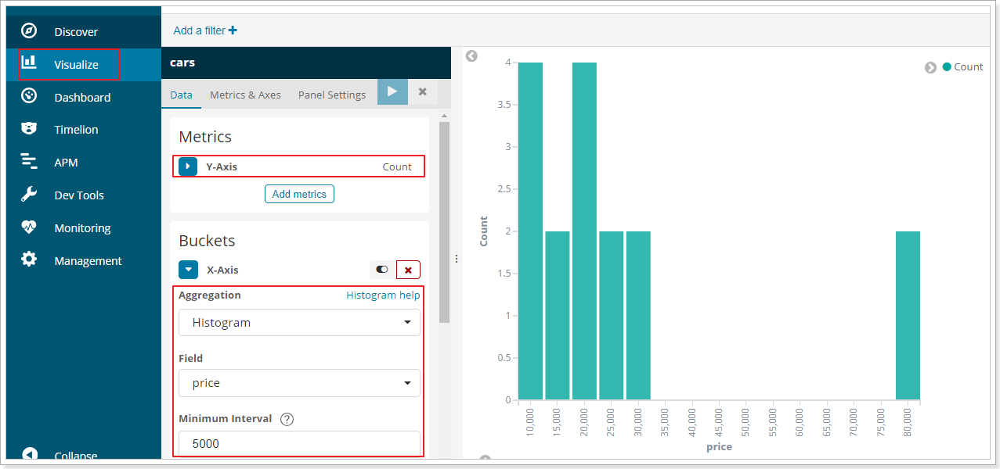


### 4.5.2.范围分桶range

范围分桶与阶梯分桶类似，也是把数字按照阶段进行分组，只不过range方式需要你自己指定每一组的起始和结束大小。


# 5.Spring Data Elasticsearch

Elasticsearch提供的Java客户端有一些不太方便的地方：

- 很多地方需要拼接Json字符串，在java中拼接字符串有多恐怖你应该懂的
- 需要自己把对象序列化为json存储
- 查询到结果也需要自己反序列化为对象

因此，我们这里就不讲解原生的Elasticsearch客户端API了。

而是学习Spring提供的套件：Spring Data Elasticsearch。


## 5.1.简介

Spring Data Elasticsearch是Spring Data项目下的一个子模块。

查看 Spring Data的官网：http://projects.spring.io/spring-data/

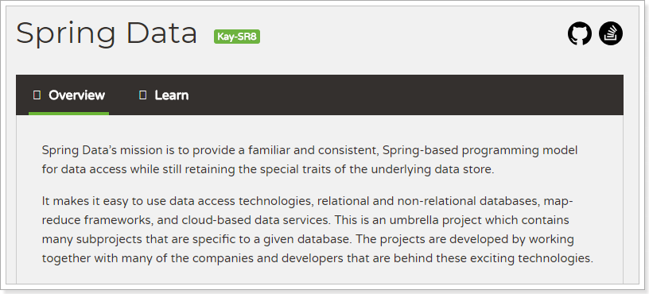

> Spring Data的使命是为数据访问提供熟悉且一致的基于Spring的编程模型，同时仍保留底层数据存储的特殊特性。
>
> 它使得使用数据访问技术，关系数据库和非关系数据库，map-reduce框架和基于云的数据服务变得容易。这是一个总括项目，其中包含许多特定于给定数据库的子项目。这些令人兴奋的技术项目背后，是由许多公司和开发人员合作开发的。

Spring Data 的使命是给各种数据访问提供统一的编程接口，不管是关系型数据库（如MySQL），还是非关系数据库（如Redis），或者类似Elasticsearch这样的索引数据库。从而简化开发人员的代码，提高开发效率。

包含很多不同数据操作的模块：

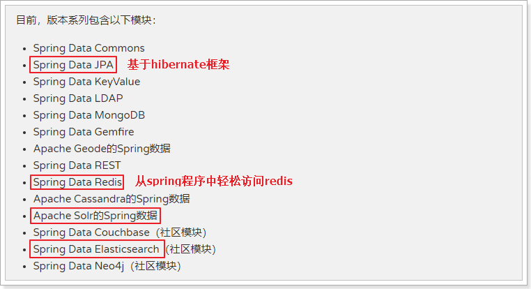


Spring Data Elasticsearch的页面：https://projects.spring.io/spring-data-elasticsearch/

 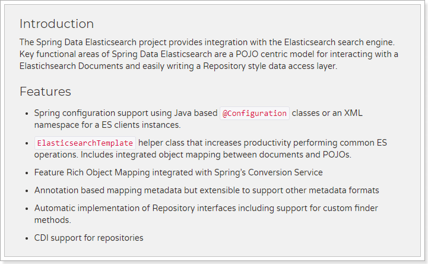

特征：

- 支持Spring的基于`@Configuration`的java配置方式，或者XML配置方式
- 提供了用于操作ES的便捷工具类**`ElasticsearchTemplate`**。包括实现文档到POJO之间的自动智能映射。
- 利用Spring的数据转换服务实现的功能丰富的对象映射
- 基于注解的元数据映射方式，而且可扩展以支持更多不同的数据格式
- 根据持久层接口自动生成对应实现方法，无需人工编写基本操作代码（类似mybatis，根据接口自动得到实现）。当然，也支持人工定制查询


## 5.2.创建Demo工程

我们使用spring脚手架新建一个demo，学习Elasticsearch

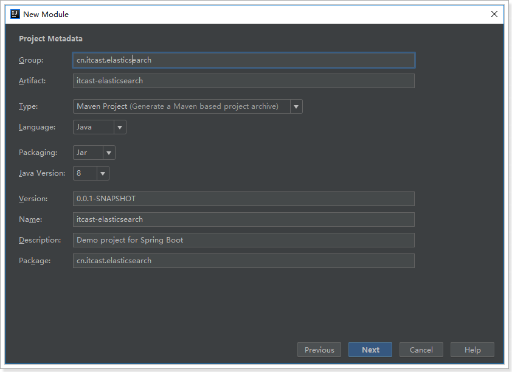

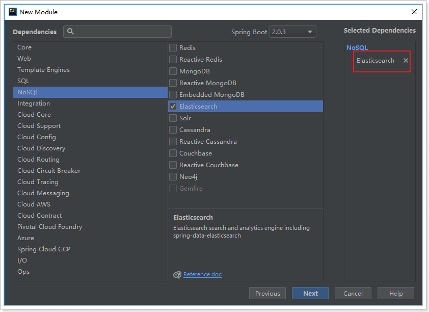

pom依赖：

```xml
<?xml version="1.0" encoding="UTF-8"?>
<project xmlns="http://maven.apache.org/POM/4.0.0" xmlns:xsi="http://www.w3.org/2001/XMLSchema-instance"
	xsi:schemaLocation="http://maven.apache.org/POM/4.0.0 http://maven.apache.org/xsd/maven-4.0.0.xsd">
	<modelVersion>4.0.0</modelVersion>

	<groupId>com.leyou.demo</groupId>
	<artifactId>elasticsearch</artifactId>
	<version>0.0.1-SNAPSHOT</version>
	<packaging>jar</packaging>

	<name>elasticsearch</name>
	<description>Demo project for Spring Boot</description>

	<parent>
		<groupId>org.springframework.boot</groupId>
		<artifactId>spring-boot-starter-parent</artifactId>
		<version>2.0.6.RELEASE</version>
		<relativePath/> <!-- lookup parent from repository -->
	</parent>

	<properties>
		<project.build.sourceEncoding>UTF-8</project.build.sourceEncoding>
		<project.reporting.outputEncoding>UTF-8</project.reporting.outputEncoding>
		<java.version>1.8</java.version>
	</properties>

	<dependencies>
		<dependency>
			<groupId>org.springframework.boot</groupId>
			<artifactId>spring-boot-starter-data-elasticsearch</artifactId>
		</dependency>
		<dependency>
			<groupId>org.springframework.boot</groupId>
			<artifactId>spring-boot-starter-test</artifactId>
			<scope>test</scope>
		</dependency>
	</dependencies>

	<build>
		<plugins>
			<plugin>
				<groupId>org.springframework.boot</groupId>
				<artifactId>spring-boot-maven-plugin</artifactId>
			</plugin>
		</plugins>
	</build>
</project>
```

application.yml文件配置：

```yaml
spring:
  data:
    elasticsearch:
      cluster-name: elasticsearch
      cluster-nodes: 192.168.56.101:9300
```


## 5.3.实体类及注解

首先我们准备好实体类：

```java
public class Item {
    Long id;
    String title; //标题
    String category;// 分类
    String brand; // 品牌
    Double price; // 价格
    String images; // 图片地址
}
```

> 映射

Spring Data通过注解来声明字段的映射属性，有下面的三个注解：

- `@Document` 作用在类，标记实体类为文档对象，一般有四个属性
  - indexName：对应索引库名称
  - type：对应在索引库中的类型
  - shards：分片数量，默认5
  - replicas：副本数量，默认1
- `@Id` 作用在成员变量，标记一个字段作为id主键
- `@Field` 作用在成员变量，标记为文档的字段，并指定字段映射属性：
  - type：字段类型，取值是枚举：FieldType
  - index：是否索引，布尔类型，默认是true
  - store：是否存储，布尔类型，默认是false
  - analyzer：分词器名称：ik_max_word

示例：

```java
@Document(indexName = "item",type = "docs", shards = 1, replicas = 0)
public class Item {
    @Id
    private Long id;
    
    @Field(type = FieldType.Text, analyzer = "ik_max_word")
    private String title; //标题
    
    @Field(type = FieldType.Keyword)
    private String category;// 分类
    
    @Field(type = FieldType.Keyword)
    private String brand; // 品牌
    
    @Field(type = FieldType.Double)
    private Double price; // 价格
    
    @Field(index = false, type = FieldType.Keyword)
    private String images; // 图片地址
}
```


## 5.4.Template索引操作

### 5.4.1.创建索引和映射

> 创建索引

 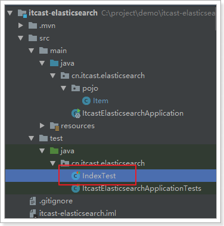

ElasticsearchTemplate中提供了创建索引的API：

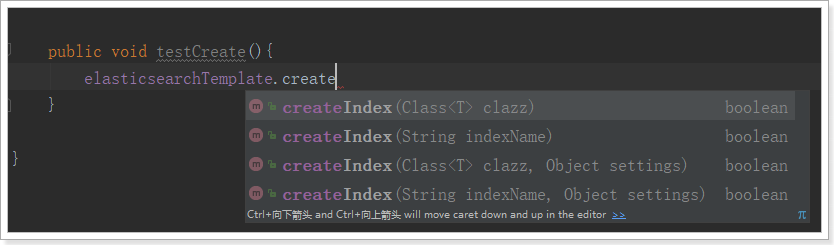

可以根据类的信息自动生成，也可以手动指定indexName和Settings

> 映射

映射相关的API：

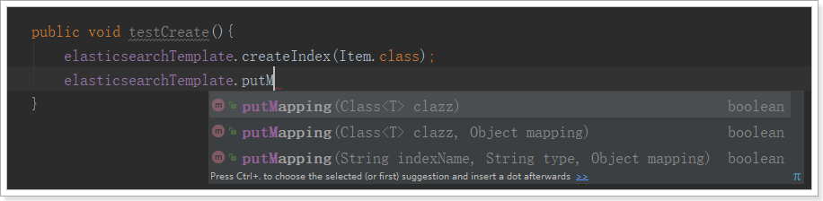

可以根据类的字节码信息（注解配置）来生成映射，或者手动编写映射


我们这里采用类的字节码信息创建索引并映射：

```java
@RunWith(SpringRunner.class)
@SpringBootTest(classes = ItcastElasticsearchApplication.class)
public class IndexTest {

    @Autowired
    private ElasticsearchTemplate elasticsearchTemplate;

    @Test
    public void testCreate(){
        // 创建索引，会根据Item类的@Document注解信息来创建
        elasticsearchTemplate.createIndex(Item.class);
        // 配置映射，会根据Item类中的id、Field等字段来自动完成映射
        elasticsearchTemplate.putMapping(Item.class);
    }
}
```

结果：

```json
GET /item
{
  "item": {
    "aliases": {},
    "mappings": {
      "docs": {
        "properties": {
          "brand": {
            "type": "keyword"
          },
          "category": {
            "type": "keyword"
          },
          "images": {
            "type": "keyword",
            "index": false
          },
          "price": {
            "type": "double"
          },
          "title": {
            "type": "text",
            "analyzer": "ik_max_word"
          }
        }
      }
    },
    "settings": {
      "index": {
        "refresh_interval": "1s",
        "number_of_shards": "1",
        "provided_name": "item",
        "creation_date": "1525405022589",
        "store": {
          "type": "fs"
        },
        "number_of_replicas": "0",
        "uuid": "4sE9SAw3Sqq1aAPz5F6OEg",
        "version": {
          "created": "6020499"
        }
      }
    }
  }
}
```


### 5.3.2.删除索引

删除索引的API：

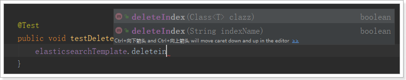

可以根据类名或索引名删除。

示例：

```java
@Test
public void deleteIndex() {
    elasticsearchTemplate.deleteIndex("heima");
}
```

结果：

 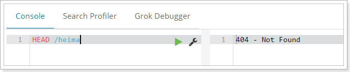


## 5.4.Repository文档操作

Spring Data 的强大之处，就在于你不用写任何DAO处理，自动根据方法名或类的信息进行CRUD操作。只要你定义一个接口，然后继承Repository提供的一些子接口，就能具备各种基本的CRUD功能。

我们只需要定义接口，然后继承它就OK了。

 

```java
public interface ItemRepository extends ElasticsearchRepository<Item,Long> {
}
```

来看下Repository的继承关系：

 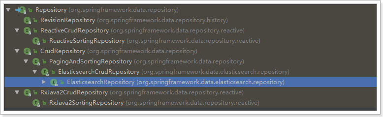

我们看到有一个ElasticsearchRepository接口：

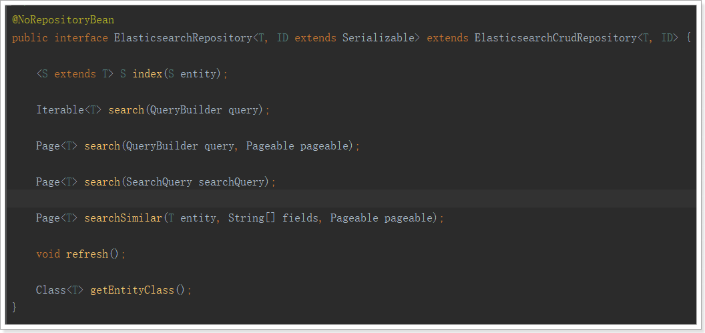


### 5.4.1.新增文档

```java
@Autowired
private ItemRepository itemRepository;

@Test
public void index() {
    Item item = new Item(1L, "小米手机7", " 手机",
                         "小米", 3499.00, "http://image.leyou.com/13123.jpg");
    itemRepository.save(item);
}
```

去页面查询看看：

```
GET /item/_search
```

结果：

```json
{
  "took": 14,
  "timed_out": false,
  "_shards": {
    "total": 1,
    "successful": 1,
    "skipped": 0,
    "failed": 0
  },
  "hits": {
    "total": 1,
    "max_score": 1,
    "hits": [
      {
        "_index": "item",
        "_type": "docs",
        "_id": "1",
        "_score": 1,
        "_source": {
          "id": 1,
          "title": "小米手机7",
          "category": " 手机",
          "brand": "小米",
          "price": 3499,
          "images": "http://image.leyou.com/13123.jpg"
        }
      }
    ]
  }
}
```


### 5.4.2.批量新增

代码：

```java
@Test
public void indexList() {
    List<Item> list = new ArrayList<>();
    list.add(new Item(2L, "坚果手机R1", " 手机", "锤子", 3699.00, "http://image.leyou.com/123.jpg"));
    list.add(new Item(3L, "华为META10", " 手机", "华为", 4499.00, "http://image.leyou.com/3.jpg"));
    // 接收对象集合，实现批量新增
    itemRepository.saveAll(list);
}
```

再次去页面查询：

```json
{
  "took": 5,
  "timed_out": false,
  "_shards": {
    "total": 1,
    "successful": 1,
    "skipped": 0,
    "failed": 0
  },
  "hits": {
    "total": 3,
    "max_score": 1,
    "hits": [
      {
        "_index": "item",
        "_type": "docs",
        "_id": "2",
        "_score": 1,
        "_source": {
          "id": 2,
          "title": "坚果手机R1",
          "category": " 手机",
          "brand": "锤子",
          "price": 3699,
          "images": "http://image.leyou.com/13123.jpg"
        }
      },
      {
        "_index": "item",
        "_type": "docs",
        "_id": "3",
        "_score": 1,
        "_source": {
          "id": 3,
          "title": "华为META10",
          "category": " 手机",
          "brand": "华为",
          "price": 4499,
          "images": "http://image.leyou.com/13123.jpg"
        }
      },
      {
        "_index": "item",
        "_type": "docs",
        "_id": "1",
        "_score": 1,
        "_source": {
          "id": 1,
          "title": "小米手机7",
          "category": " 手机",
          "brand": "小米",
          "price": 3499,
          "images": "http://image.leyou.com/13123.jpg"
        }
      }
    ]
  }
}
```

### 5.4.3.修改文档

修改和新增是同一个接口，区分的依据就是id，这一点跟我们在页面发起PUT请求是类似的。


### 5.4.4.基本查询

ElasticsearchRepository提供了一些基本的查询方法：

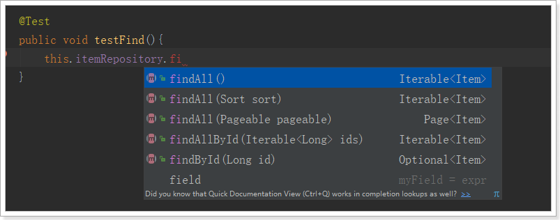

我们来试试查询所有：

```java
@Test
public void testQuery(){
    Optional<Item> optional = this.itemRepository.findById(1l);
    System.out.println(optional.get());
}

@Test
public void testFind(){
    // 查询全部，并按照价格降序排序
    Iterable<Item> items = this.itemRepository.findAll(Sort.by(Sort.Direction.DESC, "price"));
    items.forEach(item-> System.out.println(item));
}
```

结果：

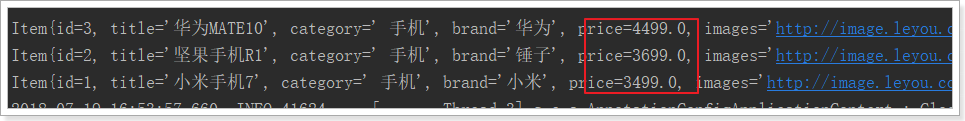


### 5.4.5.自定义方法

Spring Data 的另一个强大功能，是根据方法名称自动实现功能。

比如：你的方法名叫做：findByTitle，那么它就知道你是根据title查询，然后自动帮你完成，无需写实现类。

当然，方法名称要符合一定的约定：

| Keyword               | Sample                                     | Elasticsearch Query String                                   |
| --------------------- | ------------------------------------------ | ------------------------------------------------------------ |
| `And`                 | `findByNameAndPrice`                       | `{"bool" : {"must" : [ {"field" : {"name" : "?"}}, {"field" : {"price" : "?"}} ]}}` |
| `Or`                  | `findByNameOrPrice`                        | `{"bool" : {"should" : [ {"field" : {"name" : "?"}}, {"field" : {"price" : "?"}} ]}}` |
| `Is`                  | `findByName`                               | `{"bool" : {"must" : {"field" : {"name" : "?"}}}}`           |
| `Not`                 | `findByNameNot`                            | `{"bool" : {"must_not" : {"field" : {"name" : "?"}}}}`       |
| `Between`             | `findByPriceBetween`                       | `{"bool" : {"must" : {"range" : {"price" : {"from" : ?,"to" : ?,"include_lower" : true,"include_upper" : true}}}}}` |
| `LessThanEqual`       | `findByPriceLessThan`                      | `{"bool" : {"must" : {"range" : {"price" : {"from" : null,"to" : ?,"include_lower" : true,"include_upper" : true}}}}}` |
| `GreaterThanEqual`    | `findByPriceGreaterThan`                   | `{"bool" : {"must" : {"range" : {"price" : {"from" : ?,"to" : null,"include_lower" : true,"include_upper" : true}}}}}` |
| `Before`              | `findByPriceBefore`                        | `{"bool" : {"must" : {"range" : {"price" : {"from" : null,"to" : ?,"include_lower" : true,"include_upper" : true}}}}}` |
| `After`               | `findByPriceAfter`                         | `{"bool" : {"must" : {"range" : {"price" : {"from" : ?,"to" : null,"include_lower" : true,"include_upper" : true}}}}}` |
| `Like`                | `findByNameLike`                           | `{"bool" : {"must" : {"field" : {"name" : {"query" : "?*","analyze_wildcard" : true}}}}}` |
| `StartingWith`        | `findByNameStartingWith`                   | `{"bool" : {"must" : {"field" : {"name" : {"query" : "?*","analyze_wildcard" : true}}}}}` |
| `EndingWith`          | `findByNameEndingWith`                     | `{"bool" : {"must" : {"field" : {"name" : {"query" : "*?","analyze_wildcard" : true}}}}}` |
| `Contains/Containing` | `findByNameContaining`                     | `{"bool" : {"must" : {"field" : {"name" : {"query" : "**?**","analyze_wildcard" : true}}}}}` |
| `In`                  | `findByNameIn(Collection<String>names)`    | `{"bool" : {"must" : {"bool" : {"should" : [ {"field" : {"name" : "?"}}, {"field" : {"name" : "?"}} ]}}}}` |
| `NotIn`               | `findByNameNotIn(Collection<String>names)` | `{"bool" : {"must_not" : {"bool" : {"should" : {"field" : {"name" : "?"}}}}}}` |
| `Near`                | `findByStoreNear`                          | `Not Supported Yet !`                                        |
| `True`                | `findByAvailableTrue`                      | `{"bool" : {"must" : {"field" : {"available" : true}}}}`     |
| `False`               | `findByAvailableFalse`                     | `{"bool" : {"must" : {"field" : {"available" : false}}}}`    |
| `OrderBy`             | `findByAvailableTrueOrderByNameDesc`       | `{"sort" : [{ "name" : {"order" : "desc"} }],"bool" : {"must" : {"field" : {"available" : true}}}}` |

例如，我们来按照价格区间查询，定义这样的一个方法：

```java
public interface ItemRepository extends ElasticsearchRepository<Item,Long> {

    /**
     * 根据价格区间查询
     * @param price1
     * @param price2
     * @return
     */
    List<Item> findByPriceBetween(double price1, double price2);
}
```

然后添加一些测试数据：

```java
@Test
public void indexList() {
    List<Item> list = new ArrayList<>();
    list.add(new Item(1L, "小米手机7", "手机", "小米", 3299.00, "http://image.leyou.com/13123.jpg"));
    list.add(new Item(2L, "坚果手机R1", "手机", "锤子", 3699.00, "http://image.leyou.com/13123.jpg"));
    list.add(new Item(3L, "华为META10", "手机", "华为", 4499.00, "http://image.leyou.com/13123.jpg"));
    list.add(new Item(4L, "小米Mix2S", "手机", "小米", 4299.00, "http://image.leyou.com/13123.jpg"));
    list.add(new Item(5L, "荣耀V10", "手机", "华为", 2799.00, "http://image.leyou.com/13123.jpg"));
    // 接收对象集合，实现批量新增
    itemRepository.saveAll(list);
}
```


不需要写实现类，然后我们直接去运行：

```java
@Test
public void queryByPriceBetween(){
    List<Item> list = this.itemRepository.findByPriceBetween(2000.00, 3500.00);
    for (Item item : list) {
        System.out.println("item = " + item);
    }
}
```

结果：

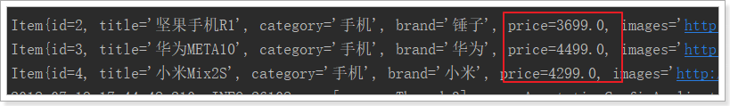


虽然基本查询和自定义方法已经很强大了，但是如果是复杂查询（模糊、通配符、词条查询等）就显得力不从心了。此时，我们只能使用原生查询。


## 5.5.高级查询

### 5.5.1.基本查询

先看看基本玩法

```java
@Test
public void testQuery(){
    // 词条查询
    MatchQueryBuilder queryBuilder = QueryBuilders.matchQuery("title", "小米");
    // 执行查询
    Iterable<Item> items = this.itemRepository.search(queryBuilder);
    items.forEach(System.out::println);
}
```

Repository的search方法需要QueryBuilder参数，elasticSearch为我们提供了一个对象QueryBuilders：

 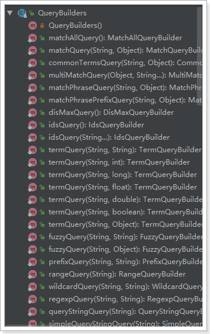

QueryBuilders提供了大量的静态方法，用于生成各种不同类型的查询对象，例如：词条、模糊、通配符等QueryBuilder对象。

结果：

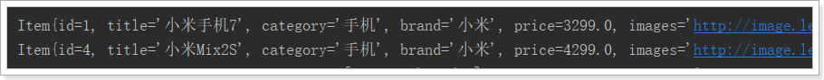


elasticsearch提供很多可用的查询方式，但是不够灵活。如果想玩过滤或者聚合查询等就很难了。


### 5.5.2.自定义查询

先来看最基本的match query：

```java
@Test
public void testNativeQuery(){
    // 构建查询条件
    NativeSearchQueryBuilder queryBuilder = new NativeSearchQueryBuilder();
    // 添加基本的分词查询
    queryBuilder.withQuery(QueryBuilders.matchQuery("title", "小米"));
    // 执行搜索，获取结果
    Page<Item> items = this.itemRepository.search(queryBuilder.build());
    // 打印总条数
    System.out.println(items.getTotalElements());
    // 打印总页数
    System.out.println(items.getTotalPages());
    items.forEach(System.out::println);
}
```

NativeSearchQueryBuilder：Spring提供的一个查询条件构建器，帮助构建json格式的请求体

`Page<item>`：默认是分页查询，因此返回的是一个分页的结果对象，包含属性：

- totalElements：总条数
- totalPages：总页数
- Iterator：迭代器，本身实现了Iterator接口，因此可直接迭代得到当前页的数据
- 其它属性：

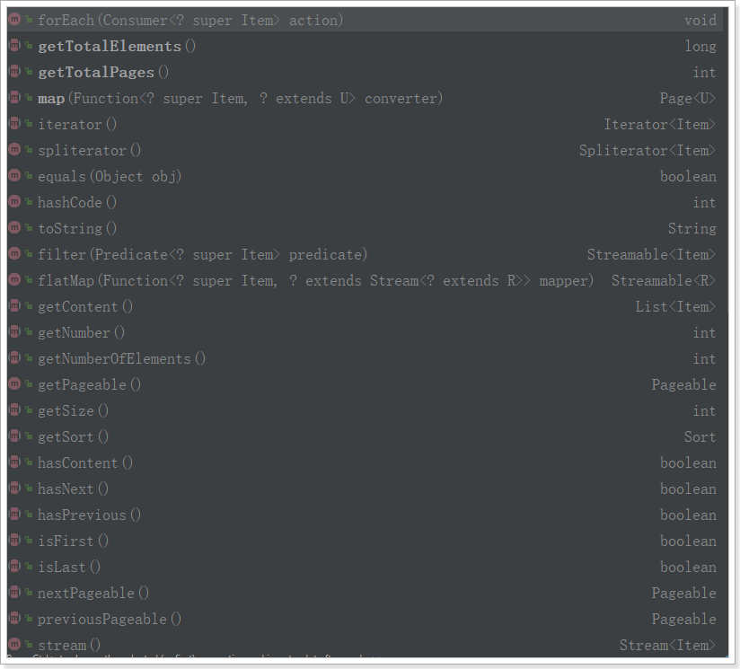

结果：


### 5.5.4.分页查询

利用`NativeSearchQueryBuilder`可以方便的实现分页：

```java
@Test
public void testNativeQuery(){
    // 构建查询条件
    NativeSearchQueryBuilder queryBuilder = new NativeSearchQueryBuilder();
    // 添加基本的分词查询
    queryBuilder.withQuery(QueryBuilders.termQuery("category", "手机"));

    // 初始化分页参数
    int page = 0;
    int size = 3;
    // 设置分页参数
    queryBuilder.withPageable(PageRequest.of(page, size));

    // 执行搜索，获取结果
    Page<Item> items = this.itemRepository.search(queryBuilder.build());
    // 打印总条数
    System.out.println(items.getTotalElements());
    // 打印总页数
    System.out.println(items.getTotalPages());
    // 每页大小
    System.out.println(items.getSize());
    // 当前页
    System.out.println(items.getNumber());
    items.forEach(System.out::println);
}
```

结果：

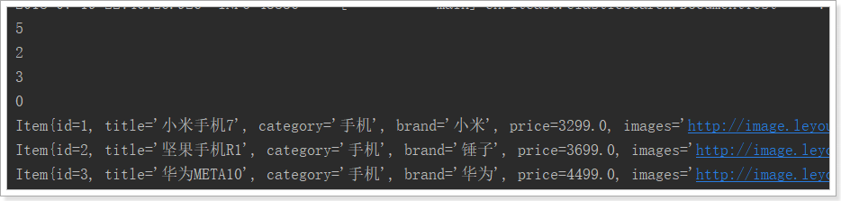

可以发现，**Elasticsearch中的分页是从第0页开始**。


### 5.5.5.排序

排序也通用通过`NativeSearchQueryBuilder`完成：

```java
@Test
public void testSort(){
    // 构建查询条件
    NativeSearchQueryBuilder queryBuilder = new NativeSearchQueryBuilder();
    // 添加基本的分词查询
    queryBuilder.withQuery(QueryBuilders.termQuery("category", "手机"));

    // 排序
    queryBuilder.withSort(SortBuilders.fieldSort("price").order(SortOrder.DESC));

    // 执行搜索，获取结果
    Page<Item> items = this.itemRepository.search(queryBuilder.build());
    // 打印总条数
    System.out.println(items.getTotalElements());
    items.forEach(System.out::println);
}
```


结果：

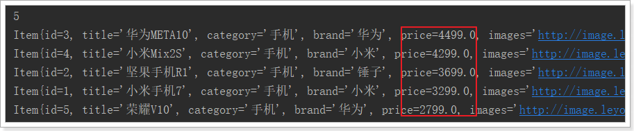


## 5.6.聚合

### 5.6.1.聚合为桶

桶就是分组，比如这里我们按照品牌brand进行分组：

```java
@Test
public void testAgg(){
    NativeSearchQueryBuilder queryBuilder = new NativeSearchQueryBuilder();
    // 不查询任何结果
    queryBuilder.withSourceFilter(new FetchSourceFilter(new String[]{""}, null));
    // 1、添加一个新的聚合，聚合类型为terms，聚合名称为brands，聚合字段为brand
    queryBuilder.addAggregation(
        AggregationBuilders.terms("brands").field("brand"));
    // 2、查询,需要把结果强转为AggregatedPage类型
    AggregatedPage<Item> aggPage = (AggregatedPage<Item>) this.itemRepository.search(queryBuilder.build());
    // 3、解析
    // 3.1、从结果中取出名为brands的那个聚合，
    // 因为是利用String类型字段来进行的term聚合，所以结果要强转为StringTerm类型
    StringTerms agg = (StringTerms) aggPage.getAggregation("brands");
    // 3.2、获取桶
    List<StringTerms.Bucket> buckets = agg.getBuckets();
    // 3.3、遍历
    for (StringTerms.Bucket bucket : buckets) {
        // 3.4、获取桶中的key，即品牌名称
        System.out.println(bucket.getKeyAsString());
        // 3.5、获取桶中的文档数量
        System.out.println(bucket.getDocCount());
    }

}
```


显示的结果：


关键API：

- `AggregationBuilders`：聚合的构建工厂类。所有聚合都由这个类来构建，看看他的静态方法：

  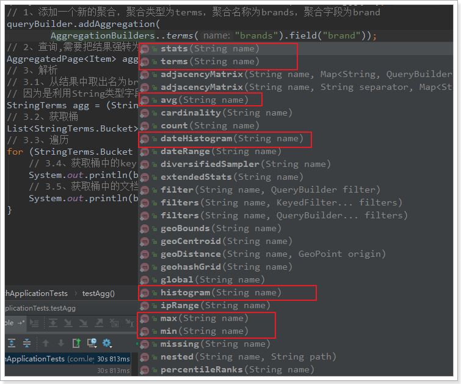

- `AggregatedPage`：聚合查询的结果类。它是`Page<T>`的子接口：

    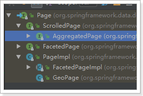

  `AggregatedPage`在`Page`功能的基础上，拓展了与聚合相关的功能，它其实就是对聚合结果的一种封装，大家可以对照聚合结果的JSON结构来看。

   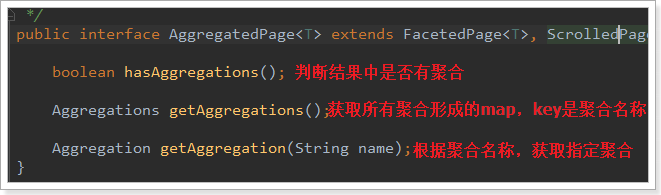

  而返回的结果都是Aggregation类型对象，不过根据字段类型不同，又有不同的子类表示

   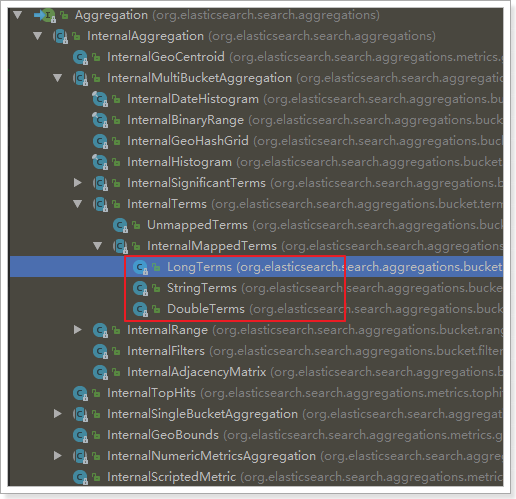


我们看下页面的查询的JSON结果与Java类的对照关系：

 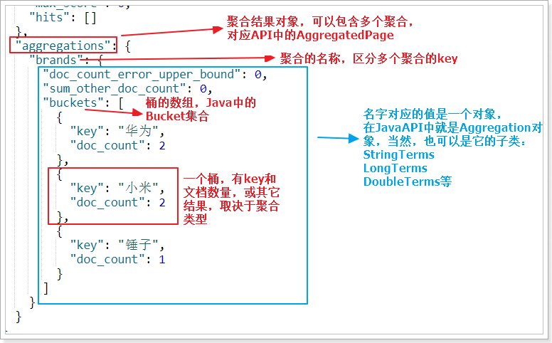


### 5.6.2.嵌套聚合，求平均值

代码：

```java
@Test
public void testSubAgg(){
    NativeSearchQueryBuilder queryBuilder = new NativeSearchQueryBuilder();
    // 不查询任何结果
    queryBuilder.withSourceFilter(new FetchSourceFilter(new String[]{""}, null));
    // 1、添加一个新的聚合，聚合类型为terms，聚合名称为brands，聚合字段为brand
    queryBuilder.addAggregation(
        AggregationBuilders.terms("brands").field("brand")
        .subAggregation(AggregationBuilders.avg("priceAvg").field("price")) // 在品牌聚合桶内进行嵌套聚合，求平均值
    );
    // 2、查询,需要把结果强转为AggregatedPage类型
    AggregatedPage<Item> aggPage = (AggregatedPage<Item>) this.itemRepository.search(queryBuilder.build());
    // 3、解析
    // 3.1、从结果中取出名为brands的那个聚合，
    // 因为是利用String类型字段来进行的term聚合，所以结果要强转为StringTerm类型
    StringTerms agg = (StringTerms) aggPage.getAggregation("brands");
    // 3.2、获取桶
    List<StringTerms.Bucket> buckets = agg.getBuckets();
    // 3.3、遍历
    for (StringTerms.Bucket bucket : buckets) {
        // 3.4、获取桶中的key，即品牌名称  3.5、获取桶中的文档数量
        System.out.println(bucket.getKeyAsString() + "，共" + bucket.getDocCount() + "台");

        // 3.6.获取子聚合结果：
        InternalAvg avg = (InternalAvg) bucket.getAggregations().asMap().get("priceAvg");
        System.out.println("平均售价：" + avg.getValue());
    }

}
```

结果：

 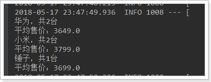

