# 0.学习目标

- 了解过滤功能的基本思路
- 实现分类和品牌展示
- 了解规格参数展示
- 实现过滤条件筛选
- 实现已选过滤项回显
- 实现取消选择过滤项


# 1.过滤功能分析

首先看下页面要实现的效果：

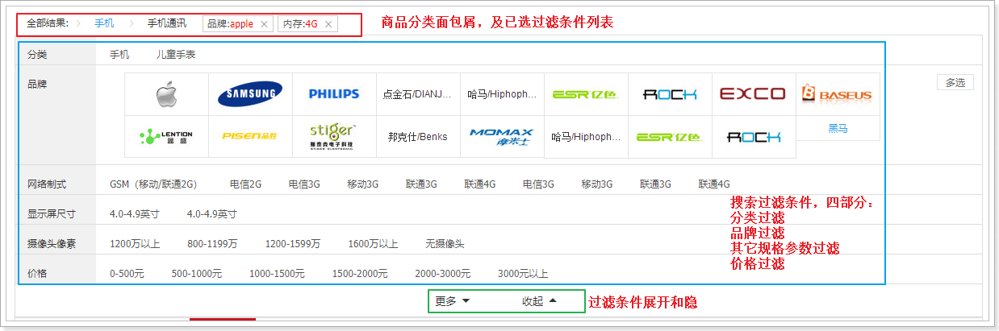

整个过滤部分有3块：

- 顶部的导航，已经选择的过滤条件展示：
  - 商品分类面包屑，根据用户选择的商品分类变化
  - 其它已选择过滤参数
- 过滤条件展示，又包含3部分
  - 商品分类展示
  - 品牌展示
  - 其它规格参数
- 展开或收起的过滤条件的按钮


顶部导航要展示的内容跟用户选择的过滤条件有关。

- 比如用户选择了某个商品分类，则面包屑中才会展示具体的分类
- 比如用户选择了某个品牌，列表中才会有品牌信息。

所以，这部分需要依赖第二部分：过滤条件的展示和选择。因此我们先不着急去做。


展开或收起的按钮是否显示，取决于过滤条件有多少，如果很少，那么就没必要展示。所以也是跟第二部分的过滤条件有关。

这样分析来看，我们必须先做第二部分：过滤条件展示。


# 2.生成分类和品牌过滤

先来看分类和品牌。在我们的数据库中已经有所有的分类和品牌信息。在这个位置，是不是把所有的分类和品牌信息都展示出来呢？

显然不是，用户搜索的条件会对商品进行过滤，而在搜索结果中，不一定包含所有的分类和品牌，直接展示出所有商品分类，让用户选择显然是不合适的。

无论是分类信息，还是品牌信息，都应该从搜索的结果商品中进行聚合得到。

## 2.1.扩展返回的结果

原来，我们返回的结果是PageResult对象，里面只有total、totalPage、items3个属性。但是现在要对商品分类和品牌进行聚合，数据显然不够用，我们需要对返回的结果进行扩展，添加分类和品牌的数据。

那么问题来了：以什么格式返回呢？

看页面：

 


分类：页面显示了分类名称，但背后肯定要保存id信息。所以至少要有id和name

品牌：页面展示的有logo，有文字，当然肯定有id，基本上是品牌的完整数据

我们新建一个类，继承PageResult，然后扩展两个新的属性：分类集合和品牌集合：

 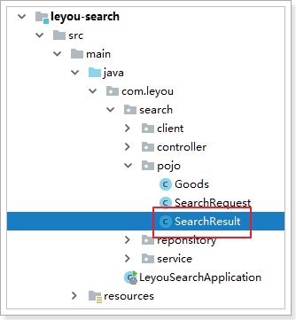

```java
public class SearchResult extends PageResult<Goods> {
    
    private List<Map<String, Object>> categories;
    private List<Brand> brands;

    public SearchResult() {
    }

    public SearchResult(List<Map<String, Object>> categories, List<Brand> brands) {
        this.categories = categories;
        this.brands = brands;
    }

    public SearchResult(List<Goods> items, Long total, List<Map<String, Object>> categories, List<Brand> brands) {
        super(items, total);
        this.categories = categories;
        this.brands = brands;
    }

    public SearchResult(List<Goods> items, Long total, Integer totalPage, List<Map<String, Object>> categories, List<Brand> brands) {
        super(items, total, totalPage);
        this.categories = categories;
        this.brands = brands;
    }

    public List<Map<String, Object>> getCategories() {
        return categories;
    }

    public void setCategories(List<Map<String, Object>> categories) {
        this.categories = categories;
    }

    public List<Brand> getBrands() {
        return brands;
    }

    public void setBrands(List<Brand> brands) {
        this.brands = brands;
    }
}
```


## 2.2.聚合商品分类和品牌

我们修改搜索的业务逻辑，对分类和品牌聚合。

因为索引库中只有id，所以我们根据id聚合，然后再根据id去查询完整数据。

所以，商品微服务需要提供一个接口：根据品牌id集合，批量查询品牌。


修改SearchService：

```java
public SearchResult search(SearchRequest request) {

    // 判断查询条件
    if (StringUtils.isBlank(request.getKey())) {
        // 返回默认结果集
        return null;
    }

    // 初始化自定义查询构建器
    NativeSearchQueryBuilder queryBuilder = new NativeSearchQueryBuilder();
    // 添加查询条件
    queryBuilder.withQuery(QueryBuilders.matchQuery("all", request.getKey()).operator(Operator.AND));
    // 添加结果集过滤，只需要：id,subTitle, skus
    queryBuilder.withSourceFilter(new FetchSourceFilter(new String[]{"id", "subTitle", "skus"}, null));

    // 获取分页参数
    Integer page = request.getPage();
    Integer size = request.getSize();
    // 添加分页
    queryBuilder.withPageable(PageRequest.of(page - 1, size));

    String categoryAggName = "categories";
    String brandAggName = "brands";
    queryBuilder.addAggregation(AggregationBuilders.terms(categoryAggName).field("cid3"));
    queryBuilder.addAggregation(AggregationBuilders.terms(brandAggName).field("brandId"));

    // 执行搜索，获取搜索的结果集
    AggregatedPage<Goods> goodsPage = (AggregatedPage<Goods>)this.goodsReponsitory.search(queryBuilder.build());

    // 解析聚合结果集
    List<Map<String, Object>> categories = getCategoryAggResult(goodsPage.getAggregation(categoryAggName));
    List<Brand> brands = getBrandAggResult(goodsPage.getAggregation(brandAggName));

    // 封装成需要的返回结果集
    return new SearchResult(goodsPage.getContent(), goodsPage.getTotalElements(), goodsPage.getTotalPages(), categories, brands);
}
/**
     * 解析品牌聚合结果集
     * @param aggregation
     * @return
     */
private List<Brand> getBrandAggResult(Aggregation aggregation) {
    // 处理聚合结果集
    LongTerms terms = (LongTerms)aggregation;
    // 获取所有的品牌id桶
    List<LongTerms.Bucket> buckets = terms.getBuckets();
    // 定义一个品牌集合，搜集所有的品牌对象
    List<Brand> brands = new ArrayList<>();
    // 解析所有的id桶，查询品牌
    buckets.forEach(bucket -> {
        Brand brand = this.brandClient.queryBrandById(bucket.getKeyAsNumber().longValue());
        brands.add(brand);
    });
    return brands;
    // 解析聚合结果集中的桶，把桶的集合转化成id的集合
    // List<Long> brandIds = terms.getBuckets().stream().map(bucket -> bucket.getKeyAsNumber().longValue()).collect(Collectors.toList());
    // 根据ids查询品牌
    //return brandIds.stream().map(id -> this.brandClient.queryBrandById(id)).collect(Collectors.toList());
    // return terms.getBuckets().stream().map(bucket -> this.brandClient.queryBrandById(bucket.getKeyAsNumber().longValue())).collect(Collectors.toList());
}

/**
     * 解析分类
     * @param aggregation
     * @return
     */
private List<Map<String,Object>> getCategoryAggResult(Aggregation aggregation) {
    // 处理聚合结果集
    LongTerms terms = (LongTerms)aggregation;
    // 获取所有的分类id桶
    List<LongTerms.Bucket> buckets = terms.getBuckets();
    // 定义一个品牌集合，搜集所有的品牌对象
    List<Map<String, Object>> categories = new ArrayList<>();
    List<Long> cids = new ArrayList<>();
    // 解析所有的id桶，查询品牌
    buckets.forEach(bucket -> {
        cids.add(bucket.getKeyAsNumber().longValue());
    });
    List<String> names = this.categoryClient.queryNamesByIds(cids);
    for (int i = 0; i < cids.size(); i++) {
        Map<String, Object> map = new HashMap<>();
        map.put("id", cids.get(i));
        map.put("name", names.get(i));
        categories.add(map);
    }
    return categories;
}
```


测试：

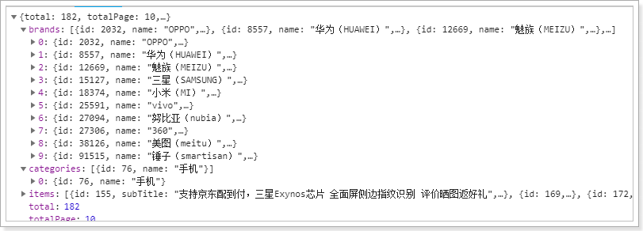


## 2.3.页面渲染数据

### 2.3.1.过滤参数数据结构

来看下页面的展示效果：

 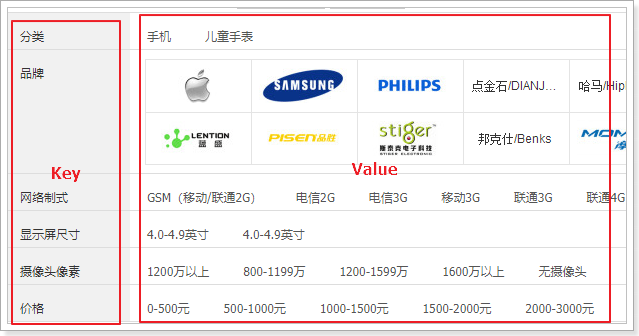

虽然分类、品牌内容都不太一样，但是结构相似，都是key和value的结构。

而且页面结构也极为类似：

 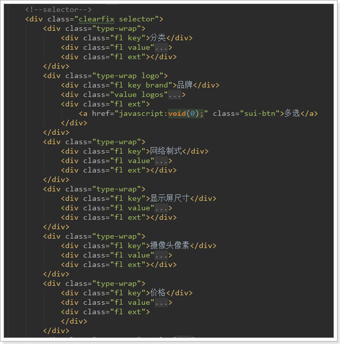


所以，我们可以把所有的过滤条件放入一个`数组`中，然后在页面利用`v-for`遍历一次生成。

其基本结构是这样的：

```js
[
    {
        k:"过滤字段名",
        options:[{/*过滤字段值对象*/},{/*过滤字段值对象*/}]
    }
]
```

我们先在data中定义数组：filters，等待组装过滤参数：

```js
data: {
    ly,
    search:{
        key: "",
        page: 1
    },
    goodsList:[], // 接收搜索得到的结果
    total: 0, // 总条数
    totalPage: 0, // 总页数
    filters:[] // 过滤参数集合
},
```

然后在查询搜索结果的回调函数中，对过滤参数进行封装：

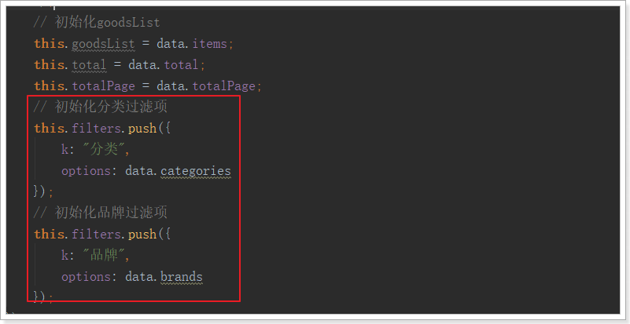

然后刷新页面，通过浏览器工具，查看封装的结果：

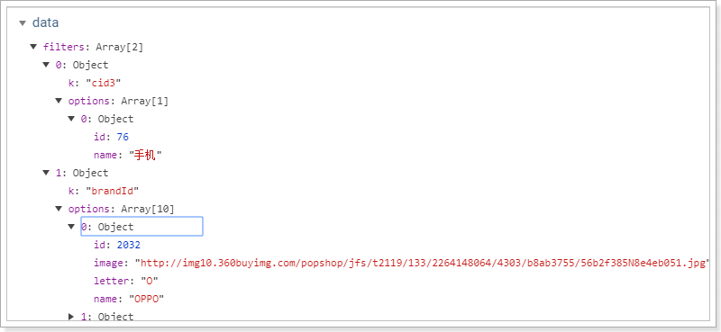


### 2.3.2.页面渲染数据

首先看页面原来的代码：

 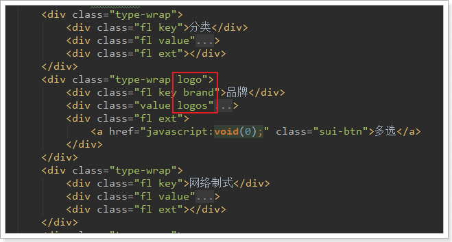

我们注意到，虽然页面元素是一样的，但是品牌会比其它搜索条件多出一些样式，因为品牌是以图片展示。需要进行特殊处理。数据展示是一致的，我们采用v-for处理：

```html
<div class="type-wrap" v-for="(f,i) in filters" :key="i" v-if="f.k !== '品牌'">
    <div class="fl key">{{f.k}}</div>
    <div class="fl value">
        <ul class="type-list">
            <li v-for="(option, j) in f.options" :key="j">
                <a>{{option.name}}</a>
            </li>
        </ul>
    </div>
    <div class="fl ext"></div>
</div>
<div class="type-wrap logo" v-else>
    <div class="fl key brand">{{f.k}}</div>
    <div class="value logos">
        <ul class="logo-list">
            <li v-for="(option, j) in f.options" v-if="option.image">
                
            </li>
            <li style="text-align: center" v-else>
                <a style="line-height: 30px; font-size: 12px" href="#">{{option.name}}</a>
            </li>
        </ul>
    </div>
    <div class="fl ext">
        <a href="javascript:void(0);" class="sui-btn">多选</a>
    </div>
</div>
```

结果：


# 3.生成规格参数过滤

## 3.1.谋而后动

有四个问题需要先思考清楚：

- 什么时候显示规格参数过滤？ 分类只有一个
- 如何知道哪些规格需要过滤？ 
- 要过滤的参数，其可选值是如何获取的？ 
- 规格过滤的可选值，其数据格式怎样的？


> 什么情况下显示有关规格参数的过滤？

如果用户尚未选择商品分类，或者聚合得到的分类数大于1，那么就没必要进行规格参数的聚合。因为不同分类的商品，其规格是不同的。

因此，我们在后台**需要对聚合得到的商品分类数量进行判断，如果等于1，我们才继续进行规格参数的聚合**。


> 如何知道哪些规格需要过滤？

我们不能把数据库中的所有规格参数都拿来过滤。因为并不是所有的规格参数都可以用来过滤，参数的值是不确定的。

值的庆幸的是，我们在设计规格参数时，已经标记了某些规格可搜索，某些不可搜索。

因此，一旦商品分类确定，我们就可以根据商品分类查询到其对应的规格，从而知道哪些规格要进行搜索。


> 要过滤的参数，其可选值是如何获取的？

虽然数据库中有所有的规格参数，但是不能把一切数据都用来供用户选择。

与商品分类和品牌一样，应该是从用户搜索得到的结果中聚合，得到与结果品牌的规格参数可选值。


> 规格过滤的可选值，其数据格式怎样的？

我们直接看页面效果：

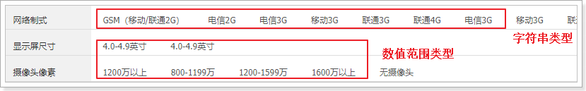

我们之前存储时已经将数据分段，恰好符合这里的需求


## 3.2.实战

接下来，我们就用代码实现刚才的思路。

总结一下，应该是以下几步：

- 1）用户搜索得到商品，并聚合出商品分类
- 2）判断分类数量是否等于1，如果是则进行规格参数聚合
- 3）先根据分类，查找可以用来搜索的规格
- 4）对规格参数进行聚合
- 5）将规格参数聚合结果整理后返回


### 3.2.1.扩展返回结果

返回结果中需要增加新数据，用来保存规格参数过滤条件。这里与前面的品牌和分类过滤的json结构类似：

```json
[
    {
        "k":"规格参数名",
        "options":["规格参数值","规格参数值"]
    }
]
```

因此，在java中我们用List<Map<String, Object>>来表示。

```java
public class SearchResult extends PageResult<Goods> {
    private List<Map<String, Object>> categories;
    private List<Brand> brands;
    private List<Map<String, Object>> specs;

    public SearchResult() {
    }

    public SearchResult(List<Map<String, Object>> categories, List<Brand> brands, List<Map<String, Object>> specs) {
        this.categories = categories;
        this.brands = brands;
        this.specs = specs;
    }

    public SearchResult(List<Goods> items, Long total, List<Map<String, Object>> categories, List<Brand> brands, List<Map<String, Object>> specs) {
        super(items, total);
        this.categories = categories;
        this.brands = brands;
        this.specs = specs;
    }

    public SearchResult(List<Goods> items, Long total, Integer totalPage, List<Map<String, Object>> categories, List<Brand> brands, List<Map<String, Object>> specs) {
        super(items, total, totalPage);
        this.categories = categories;
        this.brands = brands;
        this.specs = specs;
    }

    public List<Map<String, Object>> getCategories() {
        return categories;
    }

    public void setCategories(List<Map<String, Object>> categories) {
        this.categories = categories;
    }

    public List<Brand> getBrands() {
        return brands;
    }

    public void setBrands(List<Brand> brands) {
        this.brands = brands;
    }

    public List<Map<String, Object>> getSpecs() {
        return specs;
    }

    public void setSpecs(List<Map<String, Object>> specs) {
        this.specs = specs;
    }
}
```


### 3.2.2.判断是否需要聚合

首先，在聚合得到商品分类后，判断分类的个数，如果是1个则进行规格聚合：

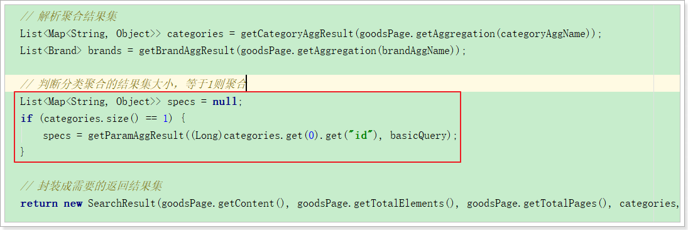

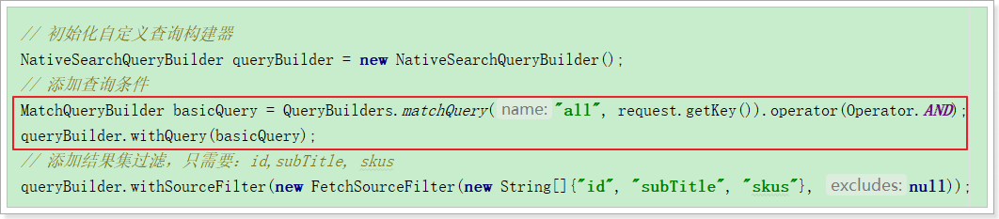

我们将聚合的代码抽取到了一个`getParamAggResult`方法中。


### 3.2.3.获取需要聚合的规格参数

然后，我们需要根据商品分类，查询所有可用于搜索的规格参数：

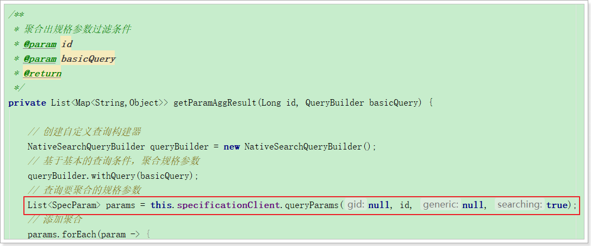

要注意的是，这里我们需要根据分类id查询规格，而规格参数接口需要从商品微服务提供


### 3.2.4.聚合规格参数

因为规格参数保存时不做分词，因此其名称会自动带上一个.keyword后缀：

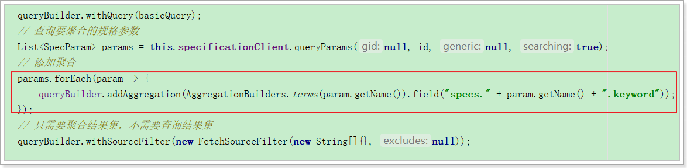


### 3.2.5.解析聚合结果

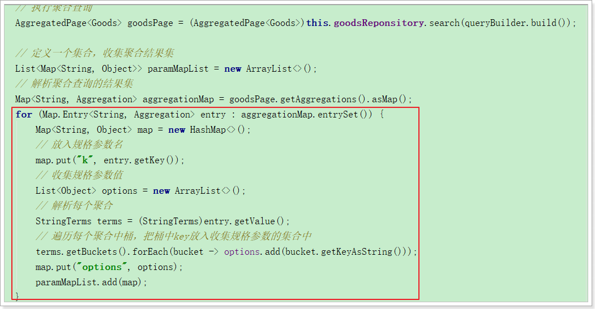


### 3.2.6.最终的完整代码

```java
public SearchResult search(SearchRequest request) {

    // 判断查询条件
    if (StringUtils.isBlank(request.getKey())) {
        // 返回默认结果集
        return null;
    }

    // 初始化自定义查询构建器
    NativeSearchQueryBuilder queryBuilder = new NativeSearchQueryBuilder();
    // 添加查询条件
    MatchQueryBuilder basicQuery = QueryBuilders.matchQuery("all", request.getKey()).operator(Operator.AND);
    queryBuilder.withQuery(basicQuery);
    // 添加结果集过滤，只需要：id,subTitle, skus
    queryBuilder.withSourceFilter(new FetchSourceFilter(new String[]{"id", "subTitle", "skus"}, null));

    // 获取分页参数
    Integer page = request.getPage();
    Integer size = request.getSize();
    // 添加分页
    queryBuilder.withPageable(PageRequest.of(page - 1, size));

    String categoryAggName = "categories";
    String brandAggName = "brands";
    queryBuilder.addAggregation(AggregationBuilders.terms(categoryAggName).field("cid3"));
    queryBuilder.addAggregation(AggregationBuilders.terms(brandAggName).field("brandId"));

    // 执行搜索，获取搜索的结果集
    AggregatedPage<Goods> goodsPage = (AggregatedPage<Goods>)this.goodsReponsitory.search(queryBuilder.build());

    // 解析聚合结果集
    List<Map<String, Object>> categories = getCategoryAggResult(goodsPage.getAggregation(categoryAggName));
    List<Brand> brands = getBrandAggResult(goodsPage.getAggregation(brandAggName));

    // 判断分类聚合的结果集大小，等于1则聚合
    List<Map<String, Object>> specs = null;
    if (categories.size() == 1) {
        specs = getParamAggResult((Long)categories.get(0).get("id"), basicQuery);
    }

    // 封装成需要的返回结果集
    return new SearchResult(goodsPage.getContent(), goodsPage.getTotalElements(), goodsPage.getTotalPages(), categories, brands, specs);
}

/**
     * 聚合出规格参数过滤条件
     * @param id
     * @param basicQuery
     * @return
     */
private List<Map<String,Object>> getParamAggResult(Long id, QueryBuilder basicQuery) {

    // 创建自定义查询构建器
    NativeSearchQueryBuilder queryBuilder = new NativeSearchQueryBuilder();
    // 基于基本的查询条件，聚合规格参数
    queryBuilder.withQuery(basicQuery);
    // 查询要聚合的规格参数
    List<SpecParam> params = this.specificationClient.queryParams(null, id, null, true);
    // 添加聚合
    params.forEach(param -> {
        queryBuilder.addAggregation(AggregationBuilders.terms(param.getName()).field("specs." + param.getName() + ".keyword"));
    });
    // 只需要聚合结果集，不需要查询结果集
    queryBuilder.withSourceFilter(new FetchSourceFilter(new String[]{}, null));

    // 执行聚合查询
    AggregatedPage<Goods> goodsPage = (AggregatedPage<Goods>)this.goodsReponsitory.search(queryBuilder.build());

    // 定义一个集合，收集聚合结果集
    List<Map<String, Object>> paramMapList = new ArrayList<>();
    // 解析聚合查询的结果集
    Map<String, Aggregation> aggregationMap = goodsPage.getAggregations().asMap();
    for (Map.Entry<String, Aggregation> entry : aggregationMap.entrySet()) {
        Map<String, Object> map = new HashMap<>();
        // 放入规格参数名
        map.put("k", entry.getKey());
        // 收集规格参数值
        List<Object> options = new ArrayList<>();
        // 解析每个聚合
        StringTerms terms = (StringTerms)entry.getValue();
        // 遍历每个聚合中桶，把桶中key放入收集规格参数的集合中
        terms.getBuckets().forEach(bucket -> options.add(bucket.getKeyAsString()));
        map.put("options", options);
        paramMapList.add(map);
    }

    return paramMapList;
}

```


### 3.2.7.测试结果


## 3.3.页面渲染

### 3.3.1.渲染规格过滤条件

首先把后台传递过来的specs添加到filters数组：

要注意：分类、品牌的option选项是对象，里面有name属性，而specs中的option是简单的字符串，所以需要进行封装，变为相同的结构：

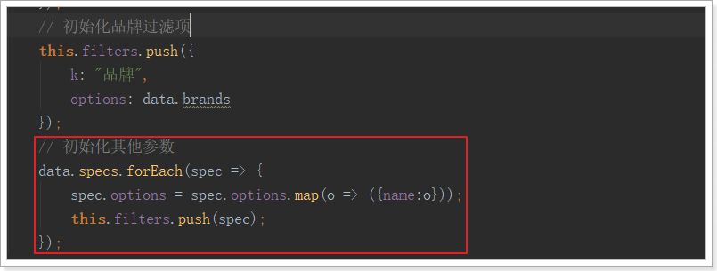

最后的结果：

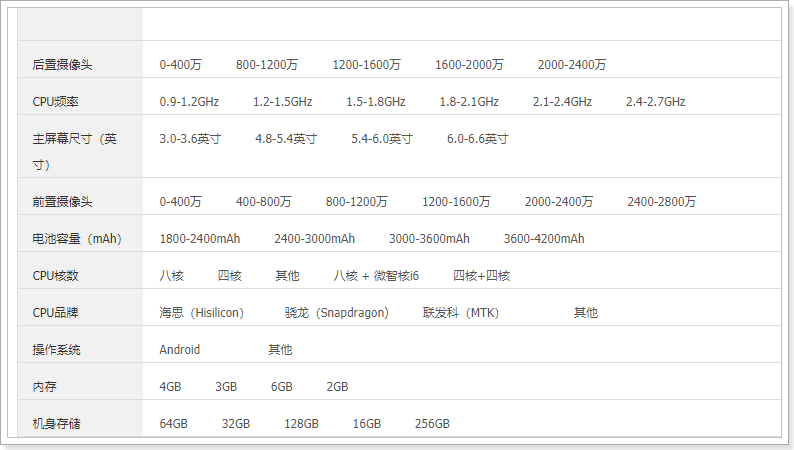


### 3.3.2.展示或收起过滤条件

是不是感觉显示的太多了，我们可以通过按钮点击来展开和隐藏部分内容：

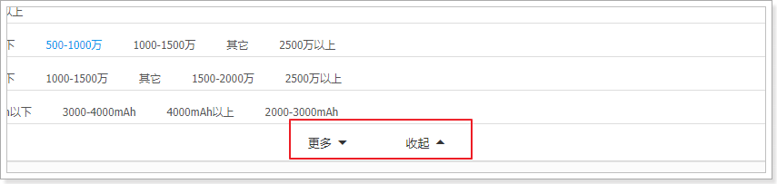

我们在data中定义变量，记录展开或隐藏的状态：

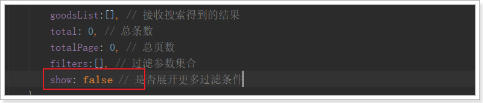

然后在按钮绑定点击事件，以改变show的取值：

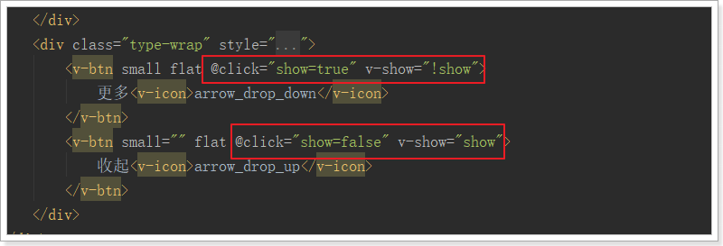


在展示规格时，对show进行判断：


OK！


# 4.过滤条件的筛选

当我们点击页面的过滤项，要做哪些事情？

- 把过滤条件保存在search对象中（watch监控到search变化后就会发送到后台）
- 在页面顶部展示已选择的过滤项
- 把商品分类展示到顶部面包屑


## 4.1.保存过滤项

### 4.1.1.定义属性

我们把已选择的过滤项保存在search中：

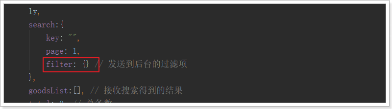

要注意，在created构造函数中会对search进行初始化，所以要在构造函数中对filter进行初始化：

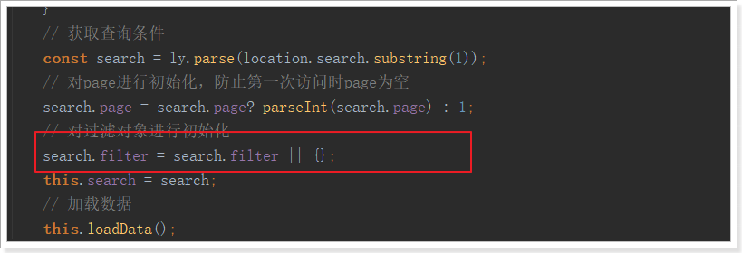

search.filter是一个对象，结构：

```js
{
    "过滤项名":"过滤项值"
}
```


### 4.1.2.绑定点击事件

给所有的过滤项绑定点击事件：

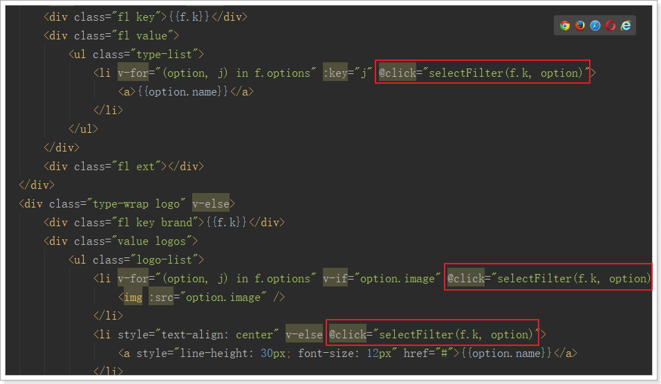

要注意，点击事件传2个参数：

- k：过滤项的key
- option：当前过滤项对象

在点击事件中，保存过滤项到`selectedFilter`：

```js
selectFilter(k, o){
    const obj = {};
    Object.assign(obj, this.search);
    if(k === '分类' || k === '品牌'){
        o = o.id;
    }
    obj.filter[k] = o.name || o;
    this.search = obj;
}
```

另外，这里search对象中嵌套了filter对象，请求参数格式化时需要进行特殊处理，修改common.js中的一段代码：

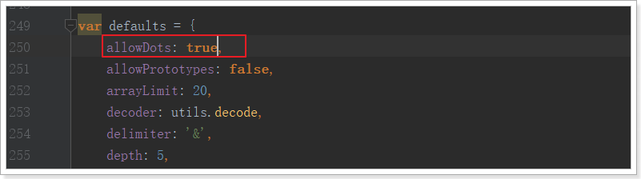


我们刷新页面，点击后通过浏览器功能查看`search.filter`的属性变化：

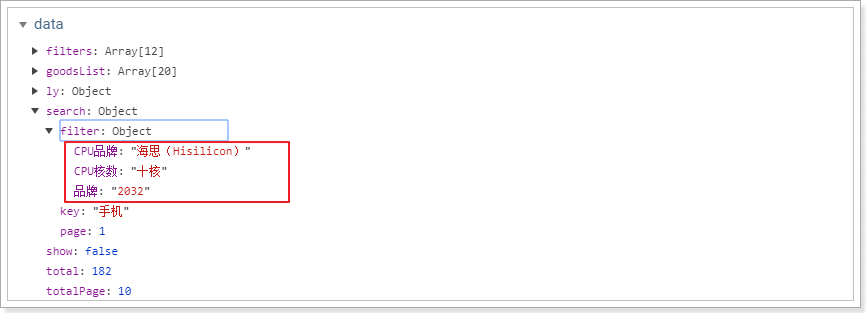

并且，此时浏览器地址也发生了变化：

```
http://www.leyou.com/search.html?key=%E6%89%8B%E6%9C%BA&page=1&filter.%E5%93%81%E7%89%8C=2032&filter.CPU%E5%93%81%E7%89%8C=%E6%B5%B7%E6%80%9D%EF%BC%88Hisilicon%EF%BC%89&filter.CPU%E6%A0%B8%E6%95%B0=%E5%8D%81%E6%A0%B8
```

网络请求也正常发出：

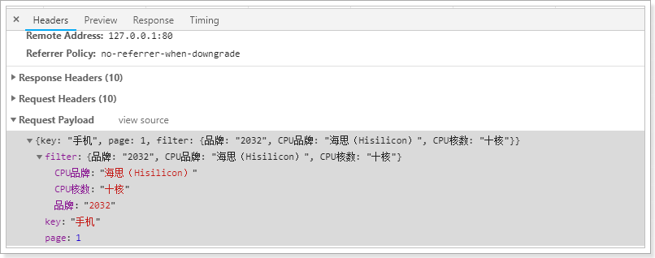


## 4.2.后台添加过滤条件

既然请求已经发送到了后台，那接下来我们就在后台去添加这些条件：

### 4.2.1.拓展请求对象

我们需要在请求类：`SearchRequest`中添加属性，接收过滤属性。过滤属性都是键值对格式，但是key不确定，所以用一个map来接收即可。

 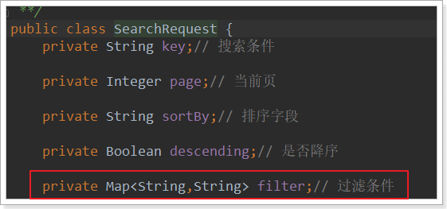


### 4.2.2.添加过滤条件

目前，我们的基本查询是这样的：

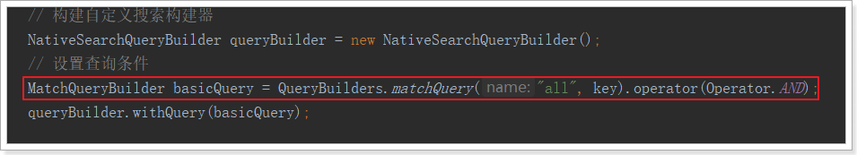

现在，我们要把页面传递的过滤条件也加入进去。

因此不能在使用普通的查询，而是要用到BooleanQuery，基本结构是这样的：

```json
GET /heima/_search
{
    "query":{
        "bool":{
        	"must":{ "match": { "title": "小米手机",operator:"and"}},
        	"filter":{
                "range":{"price":{"gt":2000.00,"lt":3800.00}}
        	}
        }
    }
}
```

所以，我们对原来的基本查询进行改造：（SearchService中的search方法）


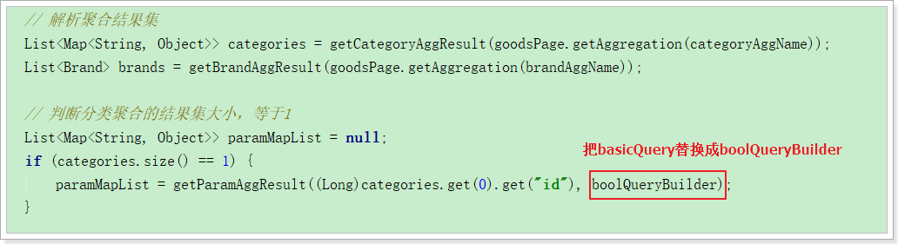

因为比较复杂，我们将其封装到一个方法中：

```java
/**
     * 构建bool查询构建器
     * @param request
     * @return
     */
private BoolQueryBuilder buildBooleanQueryBuilder(SearchRequest request) {
    BoolQueryBuilder boolQueryBuilder = QueryBuilders.boolQuery();

    // 添加基本查询条件
    boolQueryBuilder.must(QueryBuilders.matchQuery("all", request.getKey()).operator(Operator.AND));

    // 添加过滤条件
    if (CollectionUtils.isEmpty(request.getFilter())){
        return boolQueryBuilder;
    }
    for (Map.Entry<String, Object> entry : request.getFilter().entrySet()) {

        String key = entry.getKey();
        // 如果过滤条件是“品牌”, 过滤的字段名：brandId
        if (StringUtils.equals("品牌", key)) {
            key = "brandId";
        } else if (StringUtils.equals("分类", key)) {
            // 如果是“分类”，过滤字段名：cid3
            key = "cid3";
        } else {
            // 如果是规格参数名，过滤字段名：specs.key.keyword
            key = "specs." + key + ".keyword";
        }
        boolQueryBuilder.filter(QueryBuilders.termQuery(key, entry.getValue()));
    }

    return boolQueryBuilder;
}
```

其它不变。


## 4.3.页面测试

我们先不点击过滤条件，直接搜索手机：

 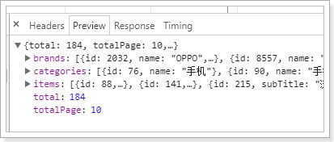

总共184条


接下来，我们点击一个过滤条件：

 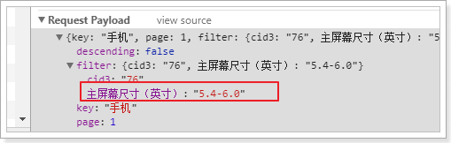

得到的结果：

 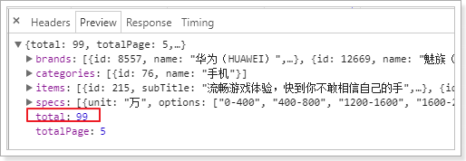


# 5.页面展示选择的过滤项(作业)

## 5.1.商品分类面包屑

当用户选择一个商品分类以后，我们应该在过滤模块的上方展示一个面包屑，把三级商品分类都显示出来。

 

用户选择的商品分类就存放在`search.filter`中，但是里面只有第三级分类的id：cid3

我们需要根据它查询出所有三级分类的id及名称

### 5.1.1.提供查询分类接口

我们在商品微服务中提供一个根据三级分类id查询1~3级分类集合的方法：

> Controller

```java
/**
     * 根据3级分类id，查询1~3级的分类
     * @param id
     * @return
     */
@GetMapping("all/level")
public ResponseEntity<List<Category>> queryAllByCid3(@RequestParam("id") Long id){
    List<Category> list = this.categoryService.queryAllByCid3(id);
    if (list == null || list.size() < 1) {
        return new ResponseEntity<>(HttpStatus.NOT_FOUND);
    }
    return ResponseEntity.ok(list);
}
```

> Service

```java
public List<Category> queryAllByCid3(Long id) {
    Category c3 = this.categoryMapper.selectByPrimaryKey(id);
    Category c2 = this.categoryMapper.selectByPrimaryKey(c3.getParentId());
    Category c1 = this.categoryMapper.selectByPrimaryKey(c2.getParentId());
    return Arrays.asList(c1,c2,c3);
}
```

测试：

 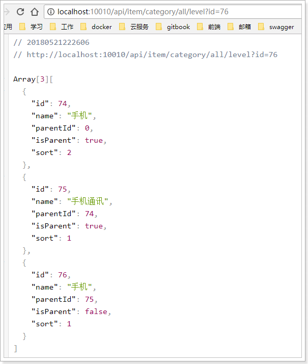

### 5.1.2.页面展示面包屑

后台提供了接口，下面的问题是，我们在哪里去查询接口？

大家首先想到的肯定是当用户点击以后。


但是我们思考一下：用户点击以后，就会重新发起请求，页面刷新，那么你渲染的结果就没了。

因此，应该是在页面重新加载完毕后，此时因为过滤条件中加入了商品分类的条件，所以查询的结果中只有1个分类。

我们判断商品分类是否只有1个，如果是，则查询三级商品分类，添加到面包屑即可。

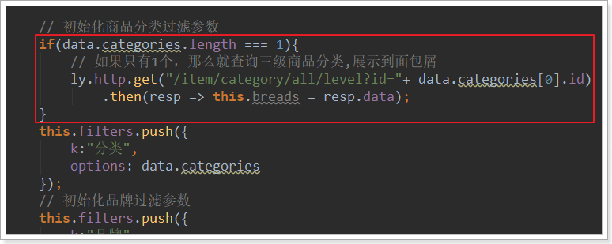

渲染：

 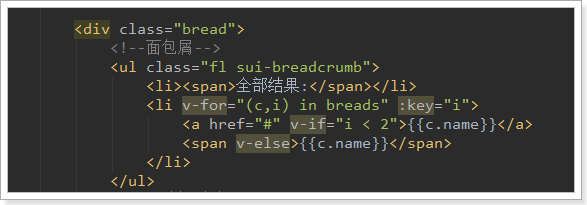


刷新页面：

 


## 5.2.其它过滤项

接下来，我们需要在页面展示用户已选择的过滤项，如图：

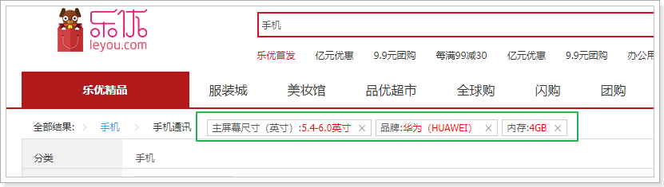

我们知道，所有已选择过滤项都保存在`search.filter`中，因此在页面遍历并展示即可。

但这里有个问题，filter中数据的格式：

 

基本有四类数据：

- 商品分类：这个不需要展示，分类展示在面包屑位置
- 品牌：这个要展示，但是其key和值不合适，我们不能显示一个id在页面。需要找到其name值
- 数值类型规格：这个展示的时候，需要把单位查询出来
- 非数值类型规格：这个直接展示其值即可

因此，我们在页面上这样处理：

```html
<!--已选择过滤项-->
<ul class="tags-choose">
    <li class="tag" v-for="(v,k) in search.filter" v-if="k !== 'cid3'" :key="k">
        {{k === 'brandId' ? '品牌' : k}}:<span style="color: red">{{getFilterValue(k,v)}}</span></span>
<i class="sui-icon icon-tb-close"></i>
</li>
</ul>
```

- 判断如果 `k === 'cid3'`说明是商品分类，直接忽略
- 判断`k === 'brandId'`说明是品牌，页面显示品牌，其它规格则直接显示`k`的值
- 值的处理比较复杂，我们用一个方法`getFilterValue(k,v)`来处理，调用时把`k`和`v`都传递

方法内部：

```js
getFilterValue(k,v){
    // 如果没有过滤参数，我们跳过展示
    if(!this.filters || this.filters.length === 0){
        return null;
    }
    let filter = null;
    // 判断是否是品牌
    if(k === 'brandId'){
        // 返回品牌名称
        return this.filters.find(f => f.k === 'brandId').options[0].name;
    }
    return v;
}
```

然后刷新页面，即可看到效果：

 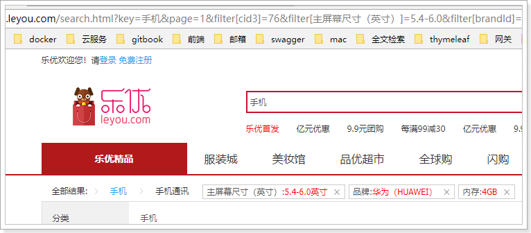


## 5.3.隐藏已经选择的过滤项

现在，我们已经实现了已选择过滤项的展示，但是你会发现一个问题：

已经选择的过滤项，在过滤列表中依然存在：

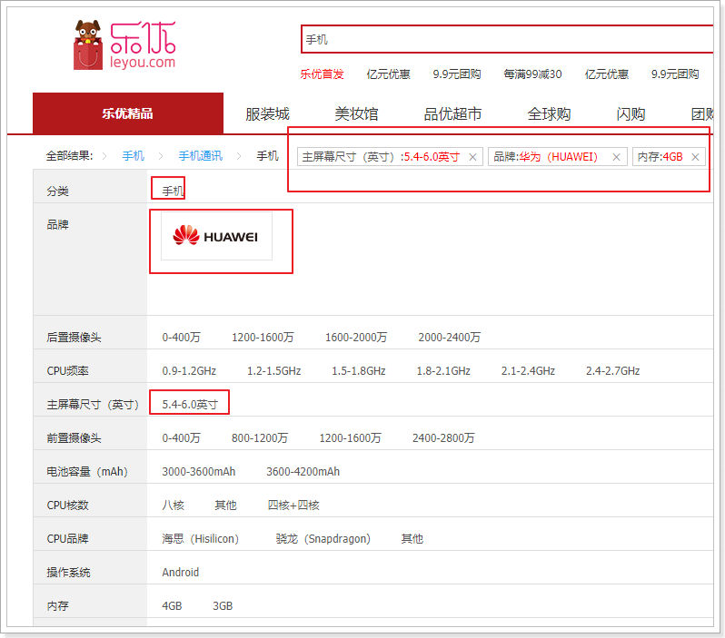


这些已经选择的过滤项，应该从列表中移除。

怎么做呢？

你必须先知道用户选择了什么。用户选择的项保存在`search.filter`中：

 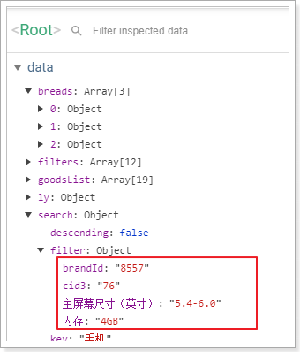

我们可以编写一个计算属性，把filters中的 已经被选择的key过滤掉：

```js
computed:{
    remainFilters(){
        const keys = Object.keys(this.search.filter);
        if(this.search.filter.cid3){
            keys.push("cid3")
        }
        if(this.search.filter.brandId){
            keys.push("brandId")
        }
        return this.filters.filter(f => !keys.includes(f.k));
    }
}
```

然后页面不再直接遍历`filters`，而是遍历`remainFilters`

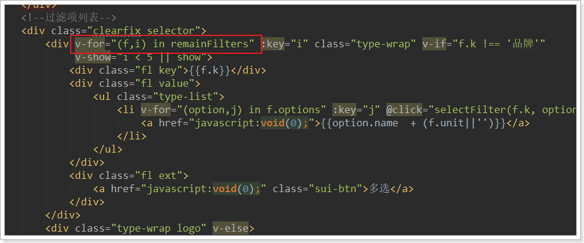

刷新页面：

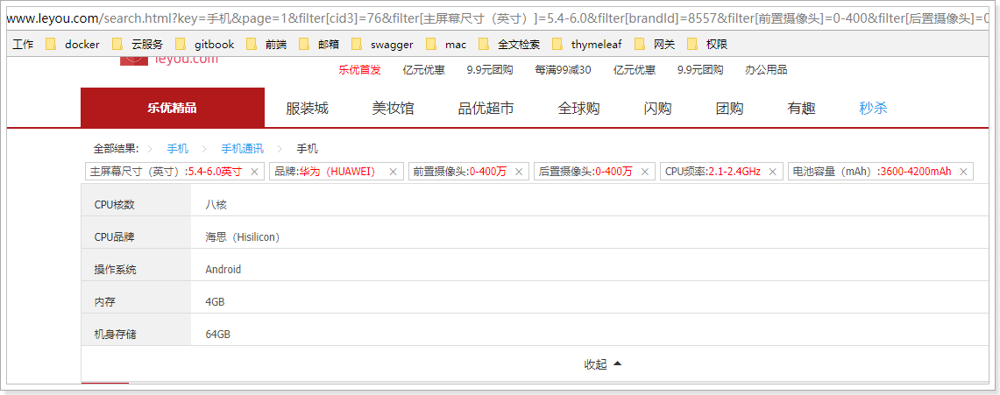


最后发现，还剩下一堆没选过的。但是都只有一个可选项，此时再过滤没有任何意义，应该隐藏，所以，在刚才的过滤条件中，还应该添加一条：如果只剩下一个可选项，不显示

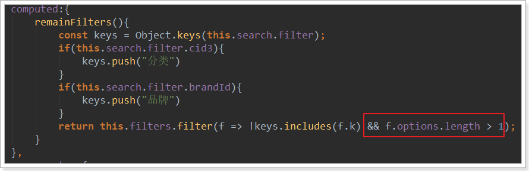


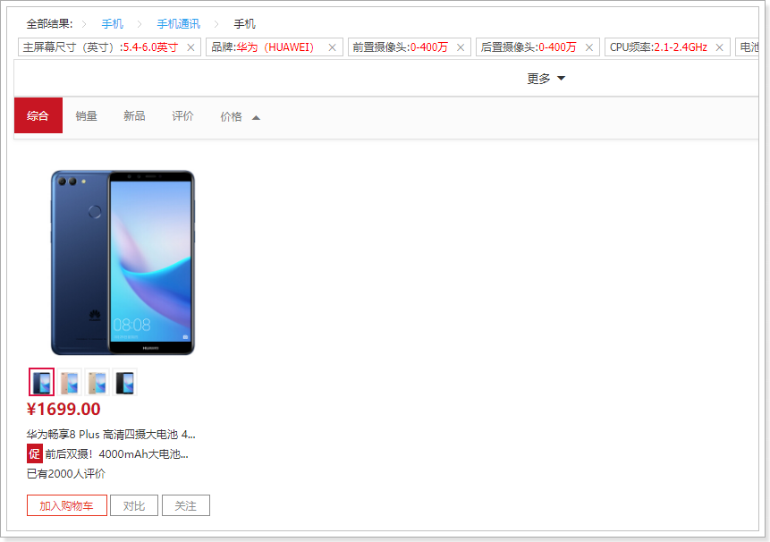


# 6.取消过滤项（作业）

我们能够看到，每个过滤项后面都有一个小叉，当点击后，应该取消对应条件的过滤。

思路非常简单：

- 给小叉绑定点击事件
- 点击后把过滤项从`search.filter`中移除，页面会自动刷新，OK


> 绑定点击事件：

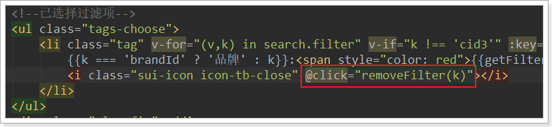

绑定点击事件时，把k传递过去，方便删除

> 删除过滤项

```js
removeFilter(k){
    this.search.filter[k] = null;
}
```


# 7.优化

搜索系统需要优化的点：

- 查询规格参数部分可以添加缓存 
- 聚合计算interval变化频率极低，所以可以设计为定时任务计算（周期为天），然后缓存起来。
- elasticsearch本身有查询缓存，可以不进行优化
- 商品图片应该采用缩略图，减少流量，提高页面加载速度
- 图片采用延迟加载
- 图片还可以采用CDN服务器
- sku信息应该在页面异步加载，而不是放到索引库


