# 0.学习目标

- 创建用户中心
- 了解面向接口开发方式
- 实现数据校验功能
- 实现短信发送功能
- 实现注册功能
- 实现根据用户名和密码查询用户功能


# 1.创建用户中心

用户搜索到自己心仪的商品，接下来就要去购买，但是购买必须先登录。所以接下来我们编写用户中心，实现用户的登录和注册功能。

用户中心的提供的服务：

- 用户的注册
- 用户登录
- 用户个人信息管理
- 用户地址管理
- 用户收藏管理
- 我的订单
- 优惠券管理

这里我们暂时先实现基本的：`注册和登录`功能，其它功能大家可以自行补充完整。

因为用户中心的服务其它微服务也会调用，因此这里我们做聚合。

leyou-user：父工程，包含2个子工程：
- leyou-user-interface：实体及接口
- leyou-user-service：业务和服务


## 1.1.创建父module

创建

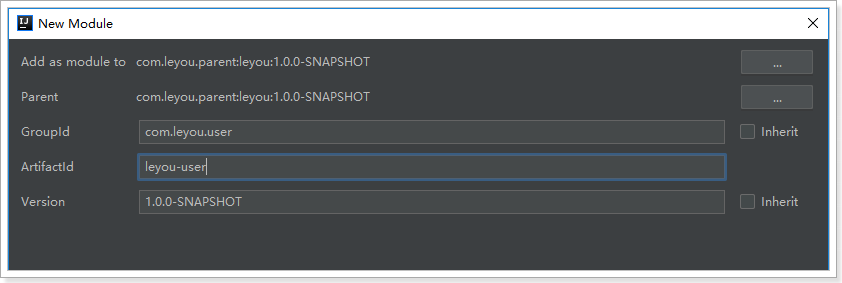

位置：

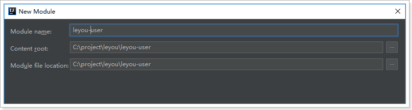


## 1.2.创建leyou-user-interface

在leyou-user下，创建module：

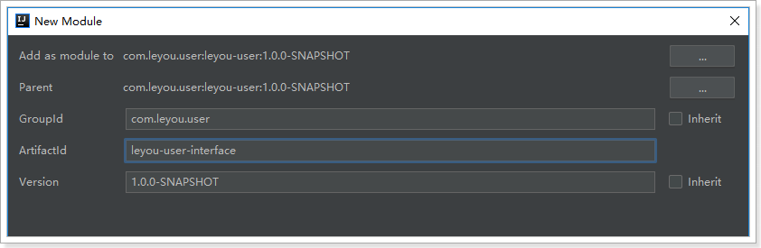

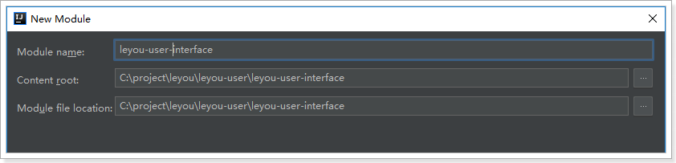

pom：

```xml
<?xml version="1.0" encoding="UTF-8"?>
<project xmlns="http://maven.apache.org/POM/4.0.0"
         xmlns:xsi="http://www.w3.org/2001/XMLSchema-instance"
         xsi:schemaLocation="http://maven.apache.org/POM/4.0.0 http://maven.apache.org/xsd/maven-4.0.0.xsd">
    <parent>
        <artifactId>leyou-user</artifactId>
        <groupId>com.leyou.user</groupId>
        <version>1.0.0-SNAPSHOT</version>
    </parent>
    <modelVersion>4.0.0</modelVersion>

    <groupId>com.leyou.user</groupId>
    <artifactId>leyou-user-interface</artifactId>
    <version>1.0.0-SNAPSHOT</version>

</project>
```


## 1.3.创建leyou-user-service

创建module

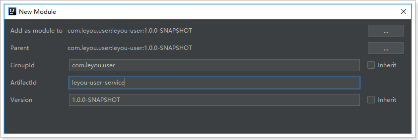

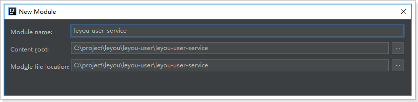

pom

```xml
<?xml version="1.0" encoding="UTF-8"?>
<project xmlns="http://maven.apache.org/POM/4.0.0"
         xmlns:xsi="http://www.w3.org/2001/XMLSchema-instance"
         xsi:schemaLocation="http://maven.apache.org/POM/4.0.0 http://maven.apache.org/xsd/maven-4.0.0.xsd">
    <parent>
        <artifactId>leyou-user</artifactId>
        <groupId>com.leyou.user</groupId>
        <version>1.0.0-SNAPSHOT</version>
    </parent>
    <modelVersion>4.0.0</modelVersion>

    <groupId>com.leyou.user</groupId>
    <artifactId>leyou-user-service</artifactId>
    <version>1.0.0-SNAPSHOT</version>

    <dependencies>
        <dependency>
            <groupId>org.springframework.boot</groupId>
            <artifactId>spring-boot-starter-web</artifactId>
        </dependency>
        <dependency>
            <groupId>org.springframework.cloud</groupId>
            <artifactId>spring-cloud-starter-netflix-eureka-client</artifactId>
        </dependency>
        <dependency>
            <groupId>org.springframework.boot</groupId>
            <artifactId>spring-boot-starter-jdbc</artifactId>
        </dependency>
        <!-- mybatis启动器 -->
        <dependency>
            <groupId>org.mybatis.spring.boot</groupId>
            <artifactId>mybatis-spring-boot-starter</artifactId>
        </dependency>
        <!-- 通用Mapper启动器 -->
        <dependency>
            <groupId>tk.mybatis</groupId>
            <artifactId>mapper-spring-boot-starter</artifactId>
        </dependency>
        <!-- mysql驱动 -->
        <dependency>
            <groupId>mysql</groupId>
            <artifactId>mysql-connector-java</artifactId>
        </dependency>
        <dependency>
            <groupId>com.leyou.user</groupId>
            <artifactId>leyou-user-interface</artifactId>
            <version>1.0.0-SNAPSHOT</version>
        </dependency>
        <dependency>
            <groupId>org.springframework.boot</groupId>
            <artifactId>spring-boot-starter-test</artifactId>
        </dependency>
    </dependencies>

</project>
```


启动类

```java
@SpringBootApplication
@EnableDiscoveryClient
@MapperScan("com.leyou.user.mapper")
public class LeyouUserApplication {

    public static void main(String[] args) {
        SpringApplication.run(LeyouUserApplication.class, args);
    }
}
```


配置：

```yaml
server:
  port: 8085
spring:
  application:
    name: user-service
  datasource:
    url: jdbc:mysql://127.0.0.1:3306/leyou
    username: root
    password: root
    driver-class-name: com.mysql.jdbc.Driver
eureka:
  client:
    service-url:
      defaultZone: http://127.0.0.1:10086/eureka
  instance:
    lease-renewal-interval-in-seconds: 5
    lease-expiration-duration-in-seconds: 15

mybatis:
  type-aliases-package: com.leyou.user.pojo
```


父工程leyou-user的pom：

```xml
<?xml version="1.0" encoding="UTF-8"?>
<project xmlns="http://maven.apache.org/POM/4.0.0"
         xmlns:xsi="http://www.w3.org/2001/XMLSchema-instance"
         xsi:schemaLocation="http://maven.apache.org/POM/4.0.0 http://maven.apache.org/xsd/maven-4.0.0.xsd">
    <parent>
        <artifactId>leyou</artifactId>
        <groupId>com.leyou.parent</groupId>
        <version>1.0.0-SNAPSHOT</version>
    </parent>
    <modelVersion>4.0.0</modelVersion>

    <groupId>com.leyou.user</groupId>
    <artifactId>leyou-user</artifactId>
    <packaging>pom</packaging>
    <version>1.0.0-SNAPSHOT</version>
    <modules>
        <module>leyou-user-interface</module>
        <module>leyou-user-service</module>
    </modules>

</project>
```


## 1.4.添加网关路由

我们修改`leyou-gateway`，添加路由规则，对`leyou-user-service`进行路由:

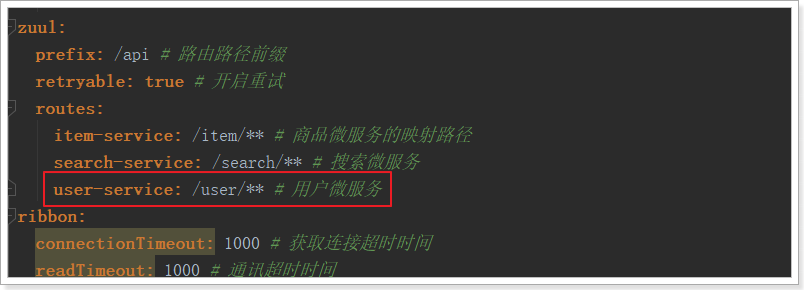


# 2.后台功能准备

## 2.1.接口文档

整个用户中心的开发，我们将模拟公司内面向接口的开发。

现在假设项目经理已经设计好了接口文档，详见：《用户中心接口说明.md》

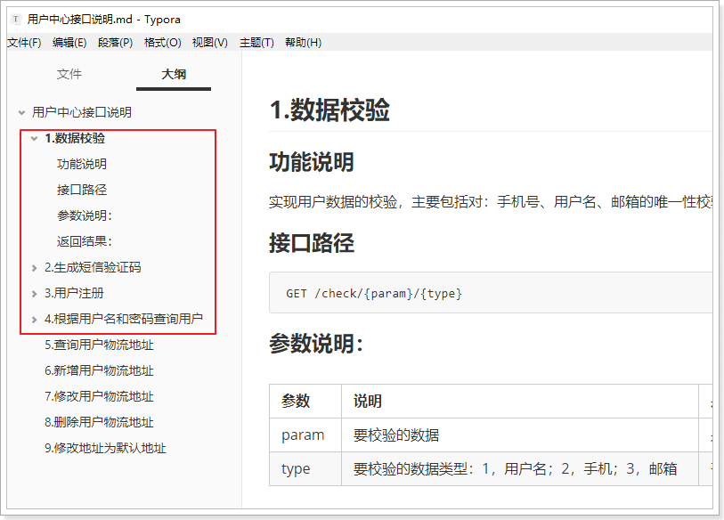

我们将根据文档直接编写后台功能，不关心页面实现。


## 2.2.数据结构

```mysql
CREATE TABLE `tb_user` (
  `id` bigint(20) NOT NULL AUTO_INCREMENT,
  `username` varchar(50) NOT NULL COMMENT '用户名',
  `password` varchar(32) NOT NULL COMMENT '密码，加密存储',
  `phone` varchar(20) DEFAULT NULL COMMENT '注册手机号',
  `created` datetime NOT NULL COMMENT '创建时间',
  `salt` varchar(32) NOT NULL COMMENT '密码加密的salt值',
  PRIMARY KEY (`id`),
  UNIQUE KEY `username` (`username`) USING BTREE
) ENGINE=InnoDB AUTO_INCREMENT=28 DEFAULT CHARSET=utf8 COMMENT='用户表';
```

数据结构比较简单，因为根据用户名查询的频率较高，所以我们给用户名创建了索引


## 2.3.基本代码

 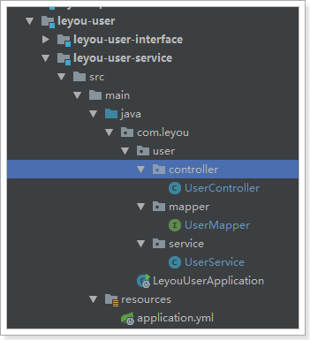

### 2.3.1.实体类

```java
@Table(name = "tb_user")
public class User {
    @Id
    @GeneratedValue(strategy = GenerationType.IDENTITY)
    private Long id;

    private String username;// 用户名

    @JsonIgnore
    private String password;// 密码

    private String phone;// 电话

    private Date created;// 创建时间

    @JsonIgnore
    private String salt;// 密码的盐值
}
```

注意：为了安全考虑。这里对password和salt添加了注解@JsonIgnore，这样在json序列化时，就不会把password和salt返回。


### 2.3.2.mapper

```java
public interface UserMapper extends Mapper<User> {
}
```


### 2.3.3.Service

```java
@Service
public class UserService {

    @Autowired
    private UserMapper userMapper;
}
```


### 2.3.4.controller

```java
@Controller
public class UserController {

    @Autowired
    private UserService userService;
    
}
```


# 3.数据验证功能

## 3.1.接口说明

实现用户数据的校验，主要包括对：手机号、用户名的唯一性校验。

**接口路径：**

```
GET /check/{data}/{type}
```

**参数说明：**

| 参数 | 说明                                   | 是否必须 | 数据类型 | 默认值 |
| ---- | -------------------------------------- | -------- | -------- | ------ |
| data | 要校验的数据                           | 是       | String   | 无     |
| type | 要校验的数据类型：1，用户名；2，手机； | 否       | Integer  | 1      |

**返回结果：**

返回布尔类型结果：

- true：可用
- false：不可用

状态码：

- 200：校验成功
- 400：参数有误
- 500：服务器内部异常


## 3.2.controller

因为有了接口，我们可以不关心页面，所有需要的东西都一清二楚：

- 请求方式：GET
- 请求路径：/check/{param}/{type}
- 请求参数：param,type
- 返回结果：true或false

```java
/**
  * 校验数据是否可用
  * @param data
  * @param type
  * @return
  */
@GetMapping("check/{data}/{type}")
public ResponseEntity<Boolean> checkUserData(@PathVariable("data") String data, @PathVariable(value = "type") Integer type) {
    Boolean boo = this.userService.checkData(data, type);
    if (boo == null) {
        return ResponseEntity.status(HttpStatus.BAD_REQUEST).build();
    }
    return ResponseEntity.ok(boo);
}
```

## 3.3.Service

```java
public Boolean checkData(String data, Integer type) {
    User record = new User();
    switch (type) {
        case 1:
            record.setUsername(data);
            break;
        case 2:
            record.setPhone(data);
            break;
        default:
            return null;
    }
    return this.userMapper.selectCount(record) == 0;
}
```


## 3.4.测试

我们在数据库插入一条假数据：

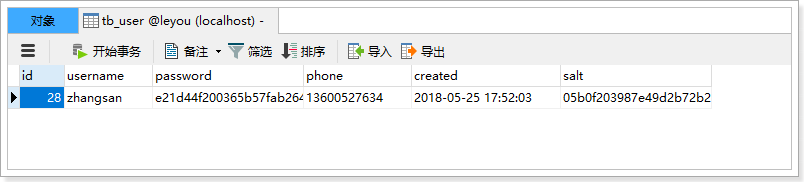

然后在浏览器调用接口，测试：

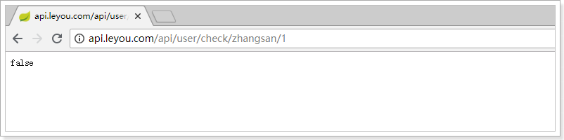

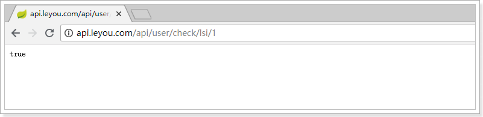


# 4.阿里大于短信服务

## 4.1.demo

注册页面上有短信发送的按钮，当用户点击发送短信，我们需要生成验证码，发送给用户。我们将使用阿里提供的阿里大于来实现短信发送。

参考课前资料的《阿里短信.md》学习demo入门


## 4.2.创建短信微服务

因为系统中不止注册一个地方需要短信发送，因此我们将短信发送抽取为微服务：`leyou-sms-service`，凡是需要的地方都可以使用。

另外，因为短信发送API调用时长的不确定性，为了提高程序的响应速度，短信发送我们都将采用异步发送方式，即：

- 短信服务监听MQ消息，收到消息后发送短信。
- 其它服务要发送短信时，通过MQ通知短信微服务。


### 4.2.1.创建module

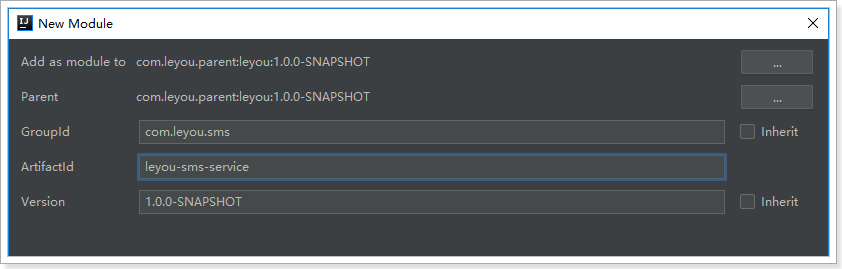

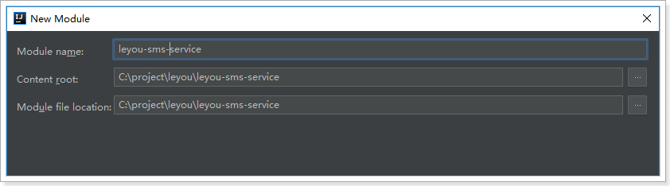


### 4.2.2.pom

```xml
<?xml version="1.0" encoding="UTF-8"?>
<project xmlns="http://maven.apache.org/POM/4.0.0"
         xmlns:xsi="http://www.w3.org/2001/XMLSchema-instance"
         xsi:schemaLocation="http://maven.apache.org/POM/4.0.0 http://maven.apache.org/xsd/maven-4.0.0.xsd">
    <parent>
        <artifactId>leyou</artifactId>
        <groupId>com.leyou.parent</groupId>
        <version>1.0.0-SNAPSHOT</version>
    </parent>
    <modelVersion>4.0.0</modelVersion>

    <groupId>com.leyou.sms</groupId>
    <artifactId>leyou-sms-service</artifactId>
    <version>1.0.0-SNAPSHOT</version>

    <dependencies>
        <dependency>
            <groupId>org.springframework.boot</groupId>
            <artifactId>spring-boot-starter-web</artifactId>
        </dependency>
        <dependency>
            <groupId>org.springframework.boot</groupId>
            <artifactId>spring-boot-starter-amqp</artifactId>
        </dependency>
        <dependency>
            <groupId>com.aliyun</groupId>
            <artifactId>aliyun-java-sdk-core</artifactId>
            <version>3.3.1</version>
        </dependency>
        <dependency>
            <groupId>com.aliyun</groupId>
            <artifactId>aliyun-java-sdk-dysmsapi</artifactId>
            <version>1.0.0</version>
        </dependency>
    </dependencies>
</project>
```


### 4.2.3.编写启动类

```java
@SpringBootApplication
public class LeyouSmsApplication {
    public static void main(String[] args) {
        SpringApplication.run(LeyouSmsApplication.class, args);
    }
}
```


### 4.2.4.编写application.yml

```yaml
server:
  port: 8086
spring:
  application:
    name: sms-service
  rabbitmq:
    host: 192.168.56.101
    username: leyou
    password: leyou
    virtual-host: /leyou
```


## 4.3.编写短信工具类

项目结构：

 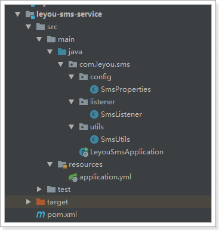

### 4.3.1.属性抽取

我们首先把一些常量抽取到application.yml中：

```yaml
leyou:
  sms:
    accessKeyId: JWffwFJIwada # 你自己的accessKeyId
    accessKeySecret: aySRliswq8fe7rF9gQyy1Izz4MQ # 你自己的AccessKeySecret
    signName: 乐优商城 # 签名名称
    verifyCodeTemplate: SMS_133976814 # 模板名称
```

然后注入到属性类中：

```java
@ConfigurationProperties(prefix = "leyou.sms")
public class SmsProperties {

    String accessKeyId;

    String accessKeySecret;

    String signName;

    String verifyCodeTemplate;

    public String getAccessKeyId() {
        return accessKeyId;
    }

    public void setAccessKeyId(String accessKeyId) {
        this.accessKeyId = accessKeyId;
    }

    public String getAccessKeySecret() {
        return accessKeySecret;
    }

    public void setAccessKeySecret(String accessKeySecret) {
        this.accessKeySecret = accessKeySecret;
    }

    public String getSignName() {
        return signName;
    }

    public void setSignName(String signName) {
        this.signName = signName;
    }

    public String getVerifyCodeTemplate() {
        return verifyCodeTemplate;
    }

    public void setVerifyCodeTemplate(String verifyCodeTemplate) {
        this.verifyCodeTemplate = verifyCodeTemplate;
    }
}
```


### 4.3.2.工具类

我们把阿里提供的demo进行简化和抽取，封装一个工具类：

```java
@Component
@EnableConfigurationProperties(SmsProperties.class)
public class SmsUtils {

    @Autowired
    private SmsProperties prop;

    //产品名称:云通信短信API产品,开发者无需替换
    static final String product = "Dysmsapi";
    //产品域名,开发者无需替换
    static final String domain = "dysmsapi.aliyuncs.com";

    static final Logger logger = LoggerFactory.getLogger(SmsUtils.class);

    public SendSmsResponse sendSms(String phone, String code, String signName, String template) throws ClientException {

        //可自助调整超时时间
        System.setProperty("sun.net.client.defaultConnectTimeout", "10000");
        System.setProperty("sun.net.client.defaultReadTimeout", "10000");

        //初始化acsClient,暂不支持region化
        IClientProfile profile = DefaultProfile.getProfile("cn-hangzhou",
                prop.getAccessKeyId(), prop.getAccessKeySecret());
        DefaultProfile.addEndpoint("cn-hangzhou", "cn-hangzhou", product, domain);
        IAcsClient acsClient = new DefaultAcsClient(profile);

        //组装请求对象-具体描述见控制台-文档部分内容
        SendSmsRequest request = new SendSmsRequest();
        request.setMethod(MethodType.POST);
        //必填:待发送手机号
        request.setPhoneNumbers(phone);
        //必填:短信签名-可在短信控制台中找到
        request.setSignName(signName);
        //必填:短信模板-可在短信控制台中找到
        request.setTemplateCode(template);
        //可选:模板中的变量替换JSON串,如模板内容为"亲爱的${name},您的验证码为${code}"时,此处的值为
        request.setTemplateParam("{\"code\":\"" + code + "\"}");

        //选填-上行短信扩展码(无特殊需求用户请忽略此字段)
        //request.setSmsUpExtendCode("90997");

        //可选:outId为提供给业务方扩展字段,最终在短信回执消息中将此值带回给调用者
        request.setOutId("123456");

        //hint 此处可能会抛出异常，注意catch
        SendSmsResponse sendSmsResponse = acsClient.getAcsResponse(request);

        logger.info("发送短信状态：{}", sendSmsResponse.getCode());
        logger.info("发送短信消息：{}", sendSmsResponse.getMessage());

        return sendSmsResponse;
    }
}
```


## 4.4.编写消息监听器

接下来，编写消息监听器，当接收到消息后，我们发送短信。

```java
@Component
@EnableConfigurationProperties(SmsProperties.class)
public class SmsListener {

    @Autowired
    private SmsUtils smsUtils;

    @Autowired
    private SmsProperties prop;

    @RabbitListener(bindings = @QueueBinding(
            value = @Queue(value = "leyou.sms.queue", durable = "true"),
            exchange = @Exchange(value = "leyou.sms.exchange", 
                                 ignoreDeclarationExceptions = "true"),
            key = {"sms.verify.code"}))
    public void listenSms(Map<String, String> msg) throws Exception {
        if (msg == null || msg.size() <= 0) {
            // 放弃处理
            return;
        }
        String phone = msg.get("phone");
        String code = msg.get("code");

        if (StringUtils.isBlank(phone) || StringUtils.isBlank(code)) {
            // 放弃处理
            return;
        }
        // 发送消息
        SendSmsResponse resp = this.smsUtils.sendSms(phone, code, 
                                                     prop.getSignName(),
                                                     prop.getVerifyCodeTemplate());
        
    }
}
```

我们注意到，消息体是一个Map，里面有两个属性：

- phone：电话号码
- code：短信验证码


## 4.5.启动

启动项目，然后查看RabbitMQ控制台，发现交换机已经创建：

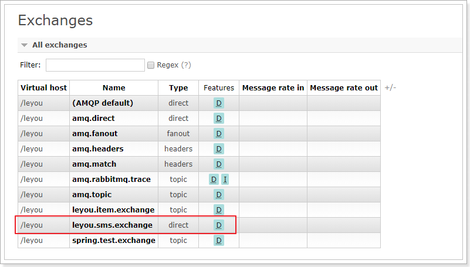

队列也已经创建：

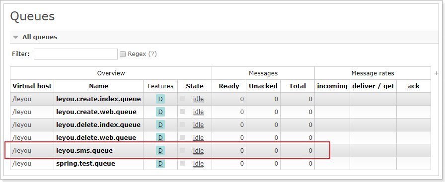

并且绑定：

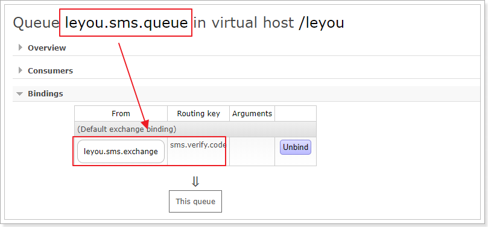


# 5.发送短信功能

短信微服务已经准备好，我们就可以继续编写用户中心接口了。

## 5.1.接口说明

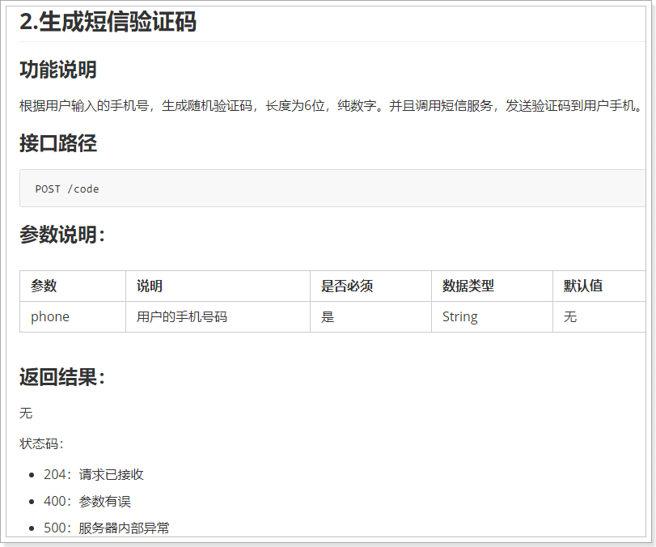


这里的业务逻辑是这样的：

- 1）我们接收页面发送来的手机号码
- 2）生成一个随机验证码
- 3）将验证码保存在服务端
- 4）发送短信，将验证码发送到用户手机


那么问题来了：验证码保存在哪里呢？

验证码有一定有效期，一般是5分钟，我们可以利用Redis的过期机制来保存。


## 5.2.Redis

### 5.2.1.安装

参考课前资料中的：《centos下的redis安装配置.md》

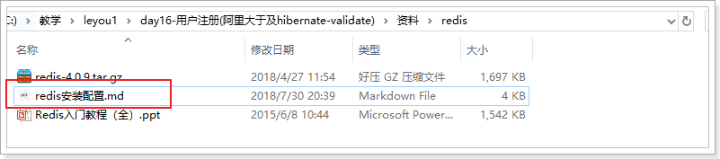


### 5.2.2.Spring Data Redis

官网：<http://projects.spring.io/spring-data-redis/>

 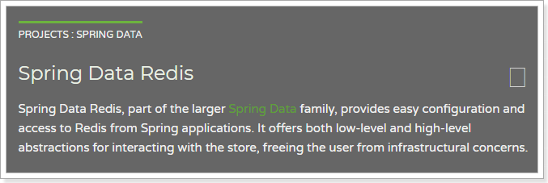                                    

Spring Data Redis，是Spring Data 家族的一部分。 对Jedis客户端进行了封装，与spring进行了整合。可以非常方便的来实现redis的配置和操作。 

### 5.2.3.RedisTemplate基本操作

Spring Data Redis 提供了一个工具类：RedisTemplate。里面封装了对于Redis的五种数据结构的各种操作，包括：

- redisTemplate.opsForValue() ：操作字符串 
- redisTemplate.opsForHash() ：操作hash
- redisTemplate.opsForList()：操作list
- redisTemplate.opsForSet()：操作set
- redisTemplate.opsForZSet()：操作zset

其它一些通用命令，如expire，可以通过redisTemplate.xx()来直接调用

5种结构：

- String：等同于java中的，`Map<String,String>`
- list：等同于java中的`Map<String,List<String>>`
- set：等同于java中的`Map<String,Set<String>>`
- sort_set：可排序的set
- hash：等同于java中的：`Map<String,Map<String,String>>


### 5.2.4.StringRedisTemplate

RedisTemplate在创建时，可以指定其泛型类型：

- K：代表key 的数据类型
- V: 代表value的数据类型

注意：这里的类型不是Redis中存储的数据类型，而是Java中的数据类型，RedisTemplate会自动将Java类型转为Redis支持的数据类型：字符串、字节、二进制等等。

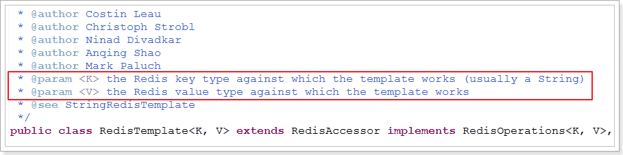

不过RedisTemplate默认会采用JDK自带的序列化（Serialize）来对对象进行转换。生成的数据十分庞大，因此一般我们都会指定key和value为String类型，这样就由我们自己把对象序列化为json字符串来存储即可。


因为大部分情况下，我们都会使用key和value都为String的RedisTemplate，因此Spring就默认提供了这样一个实现： 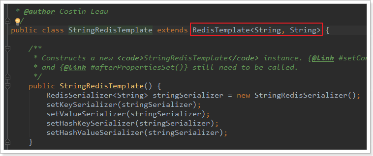


### 5.2.5.测试

我们在项目中编写一个测试案例，把课前资料中的redisTest.java导入到项目中

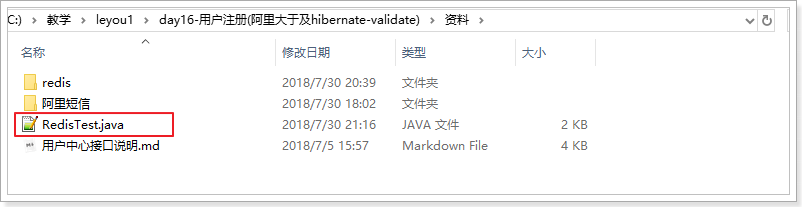

 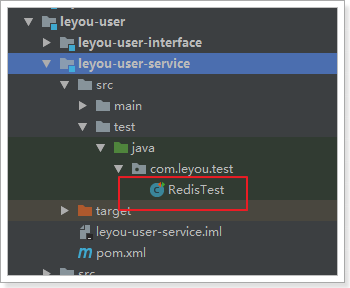

需要在项目中引入Redis启动器：

```xml
<dependency>
    <groupId>org.springframework.boot</groupId>
    <artifactId>spring-boot-starter-data-redis</artifactId>
</dependency>
```

然后在配置文件中指定Redis地址：

```yaml
spring:
  redis:
    host: 192.168.56.101
```


## 5.3.在项目中实现

需要三个步骤：

- 生成随机验证码
- 将验证码保存到Redis中，用来在注册的时候验证
- 发送验证码到`leyou-sms-service`服务，发送短信

因此，我们需要引入Redis和AMQP：

```xml
<dependency>
    <groupId>org.springframework.boot</groupId>
    <artifactId>spring-boot-starter-data-redis</artifactId>
</dependency>
<dependency>
    <groupId>org.springframework.boot</groupId>
    <artifactId>spring-boot-starter-amqp</artifactId>
</dependency>
```

添加RabbitMQ和Redis配置：

```yaml
spring:
  redis:
    host: 192.168.56.101
  rabbitmq:
    host: 192.168.56.101
    username: leyou
    password: leyou
    virtual-host: /leyou
```


另外还要用到工具类，生成6位随机码，这个我们封装到了`leyou-common`中，因此需要引入依赖：

```xml
<dependency>
    <groupId>com.leyou.common</groupId>
    <artifactId>leyou-common</artifactId>
    <version>${leyou.latest.version}</version>
</dependency>
```

NumberUtils中有生成随机码的工具方法：

```java
/**
 * 生成指定位数的随机数字
 * @param len 随机数的位数
 * @return 生成的随机数
 */
public static String generateCode(int len){
    len = Math.min(len, 8);
    int min = Double.valueOf(Math.pow(10, len - 1)).intValue();
    int num = new Random().nextInt(
        Double.valueOf(Math.pow(10, len + 1)).intValue() - 1) + min;
    return String.valueOf(num).substring(0,len);
}
```


### 5.3.1.UserController

在leyou-user-service工程中的UserController添加方法：

```java
/**
 * 发送手机验证码
 * @param phone
 * @return
 */
@PostMapping("code")
public ResponseEntity<Void> sendVerifyCode(String phone) {
    Boolean boo = this.userService.sendVerifyCode(phone);
    if (boo == null || !boo) {
        return new ResponseEntity<>(HttpStatus.INTERNAL_SERVER_ERROR);
    }
    return new ResponseEntity<>(HttpStatus.CREATED);
}
```


### 5.3.2.UserService

在Service中添加代码：

```java
@Autowired
private StringRedisTemplate redisTemplate;

@Autowired
private AmqpTemplate amqpTemplate;

static final String KEY_PREFIX = "user:code:phone:";

static final Logger logger = LoggerFactory.getLogger(UserService.class);

public Boolean sendVerifyCode(String phone) {
    // 生成验证码
    String code = NumberUtils.generateCode(6);
    try {
        // 发送短信
        Map<String, String> msg = new HashMap<>();
        msg.put("phone", phone);
        msg.put("code", code);
        this.amqpTemplate.convertAndSend("leyou.sms.exchange", "sms.verify.code", msg);
        // 将code存入redis
        this.redisTemplate.opsForValue().set(KEY_PREFIX + phone, code, 5, TimeUnit.MINUTES);
        return true;
    } catch (Exception e) {
        logger.error("发送短信失败。phone：{}， code：{}", phone, code);
        return false;
    }
}
```

注意：要设置短信验证码在Redis的缓存时间为5分钟


### 5.3.3.测试

通过RestClient发送请求试试：

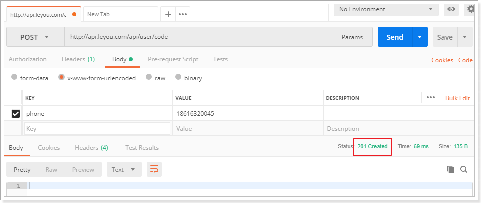

查看Redis中的数据：

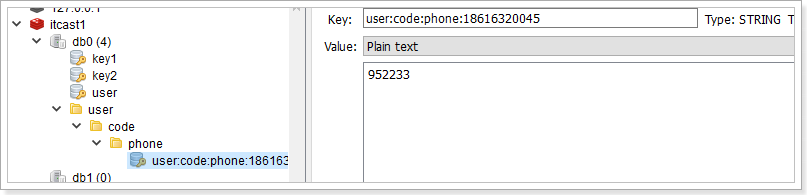

查看短信：

 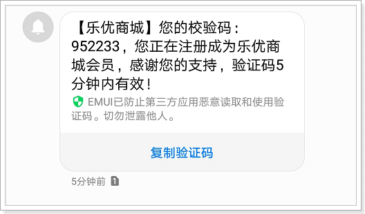


# 6.注册功能

## 6.1.接口说明

 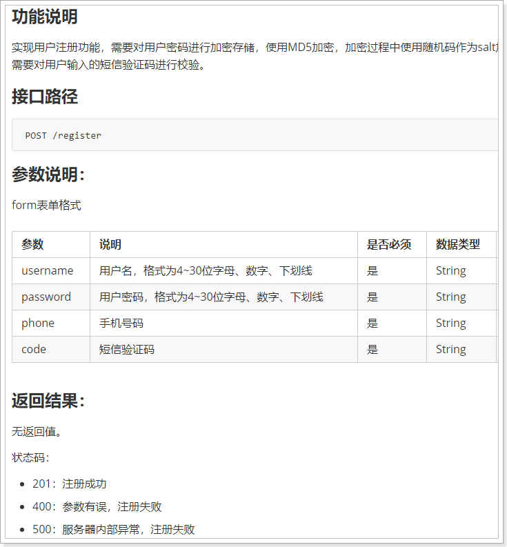

基本逻辑：

- 1）校验短信验证码
- 2）生成盐
- 3）对密码加密
- 4）写入数据库
- 5）删除Redis中的验证码


## 6.2.UserController

```java
/**
 * 注册
 * @param user
 * @param code
 * @return
 */
@PostMapping("register")
public ResponseEntity<Void> register(User user, @RequestParam("code") String code) {
    Boolean boo = this.userService.register(user, code);
    if (boo == null || !boo) {
        return ResponseEntity.status(HttpStatus.BAD_REQUEST).build();
    }
    return new ResponseEntity<>(HttpStatus.CREATED);
}
```


## 6.3.UserService

```java
public Boolean register(User user, String code) {
    // 校验短信验证码
    String cacheCode = this.redisTemplate.opsForValue().get(KEY_PREFIX + user.getPhone());
    if (!StringUtils.equals(code, cacheCode)) {
        return false;
    }

    // 生成盐
    String salt = CodecUtils.generateSalt();
    user.setSalt(salt);

    // 对密码加密
    user.setPassword(CodecUtils.md5Hex(user.getPassword(), salt));

    // 强制设置不能指定的参数为null
    user.setId(null);
    user.setCreated(new Date());
    // 添加到数据库
    boolean b = this.userMapper.insertSelective(user) == 1;

    if(b){
        // 注册成功，删除redis中的记录
        this.redisTemplate.delete(KEY_PREFIX + user.getPhone());
    }
    return b;
}
```

此处使用了课前资料中的CodeUtils：

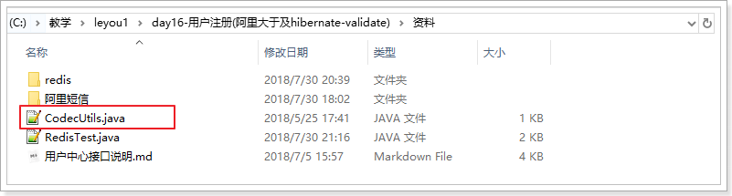

该工具类需要apache加密工具包：

```xml
<dependency>
    <groupId>commons-codec</groupId>
    <artifactId>commons-codec</artifactId>
</dependency>
```


## 6.4.测试

我们通过RestClient测试：

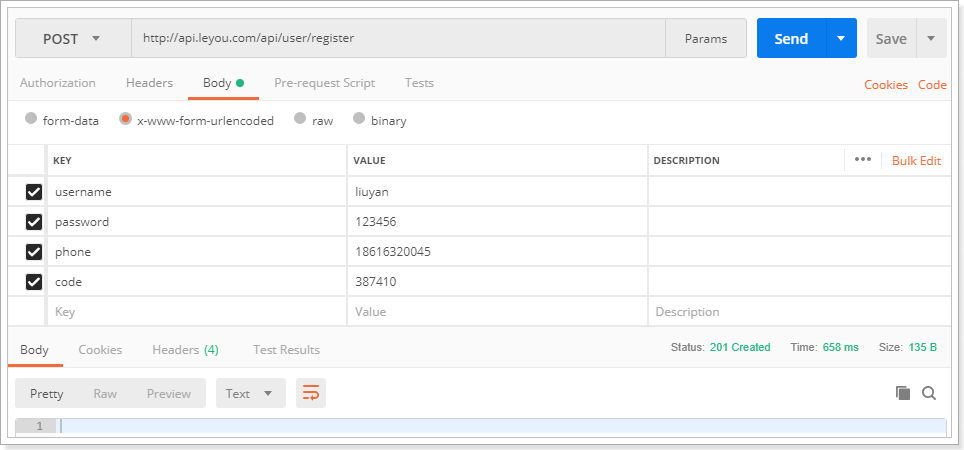

查看数据库：

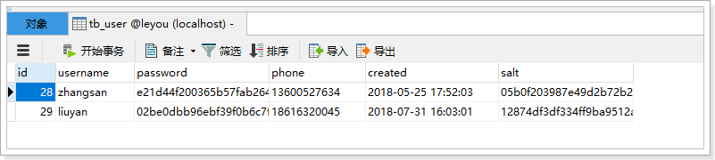

查看redis中的信息也被删除


## 6.5.hibernate-validate

刚才虽然实现了注册，但是服务端并没有进行数据校验，而前端的校验是很容易被有心人绕过的。所以我们必须在后台添加数据校验功能：

我们这里会使用Hibernate-Validator框架完成数据校验：

而SpringBoot的web启动器中已经集成了相关依赖：

 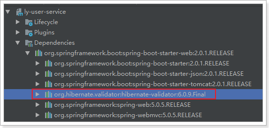

### 6.5.1.什么是Hibernate Validator

Hibernate Validator是Hibernate提供的一个开源框架，使用注解方式非常方便的实现服务端的数据校验。

官网：http://hibernate.org/validator/

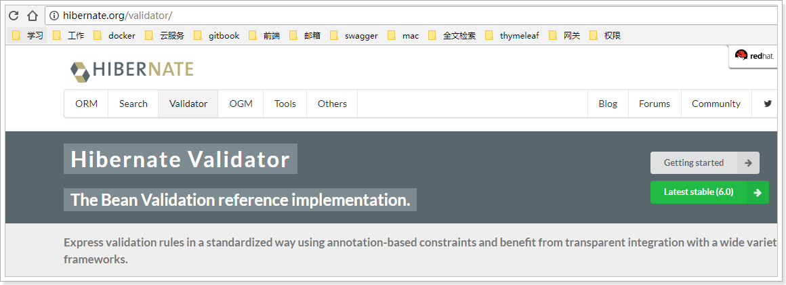


**hibernate Validator** 是 Bean Validation 的参考实现 。

Hibernate Validator 提供了 JSR 303 规范中所有内置 constraint（约束） 的实现，除此之外还有一些附加的 constraint。

在日常开发中，Hibernate Validator经常用来验证bean的字段，基于注解，方便快捷高效。


### 6.5.2.Bean校验的注解

常用注解如下：

| **Constraint**                                     | **详细信息**                                                 |
| -------------------------------------------------- | ------------------------------------------------------------ |
| **@Valid**                                         | 被注释的元素是一个对象，需要检查此对象的所有字段值           |
| **@Null**                                          | 被注释的元素必须为 null                                      |
| **@NotNull**                                       | 被注释的元素必须不为 null                                    |
| **@AssertTrue**                                    | 被注释的元素必须为 true                                      |
| **@AssertFalse**                                   | 被注释的元素必须为 false                                     |
| **@Min(value)**                                    | 被注释的元素必须是一个数字，其值必须大于等于指定的最小值     |
| **@Max(value)**                                    | 被注释的元素必须是一个数字，其值必须小于等于指定的最大值     |
| **@DecimalMin(value)**                             | 被注释的元素必须是一个数字，其值必须大于等于指定的最小值     |
| **@DecimalMax(value)**                             | 被注释的元素必须是一个数字，其值必须小于等于指定的最大值     |
| **@Size(max,   min)**                              | 被注释的元素的大小必须在指定的范围内                         |
| **@Digits   (integer, fraction)**                  | 被注释的元素必须是一个数字，其值必须在可接受的范围内         |
| **@Past**                                          | 被注释的元素必须是一个过去的日期                             |
| **@Future**                                        | 被注释的元素必须是一个将来的日期                             |
| **@Pattern(value)**                                | 被注释的元素必须符合指定的正则表达式                         |
| **@Email**                                         | 被注释的元素必须是电子邮箱地址                               |
| **@Length**                                        | 被注释的字符串的大小必须在指定的范围内                       |
| **@NotEmpty**                                      | 被注释的字符串的必须非空                                     |
| **@Range**                                         | 被注释的元素必须在合适的范围内                               |
| **@NotBlank**                                      | 被注释的字符串的必须非空                                     |
| **@URL(protocol=,host=,   port=,regexp=, flags=)** | 被注释的字符串必须是一个有效的url                            |
| **@CreditCardNumber**                              | 被注释的字符串必须通过Luhn校验算法，银行卡，信用卡等号码一般都用Luhn计算合法性 |


### 6.5.3.给User添加校验

我们在`leyou-user-interface`中添加Hibernate-Validator依赖：

```xml
<dependency>
    <groupId>org.hibernate.validator</groupId>
    <artifactId>hibernate-validator</artifactId>
</dependency>
```


我们在User对象的部分属性上添加注解：

```java
@Table(name = "tb_user")
public class User {
    @Id
    @GeneratedValue(strategy = GenerationType.IDENTITY)
    private Long id;
    @Length(min = 4, max = 30, message = "用户名只能在4~30位之间")
    private String username;// 用户名

    @JsonIgnore
    @Length(min = 4, max = 30, message = "密码只能在4~30位之间")
    private String password;// 密码

    @Pattern(regexp = "^1[35678]\\d{9}$", message = "手机号格式不正确")
    private String phone;// 电话

    private Date created;// 创建时间

    @JsonIgnore
    private String salt;// 密码的盐值
}
```


### 6.5.4.在controller上进行控制

在controller中改造register方法，只需要给User添加 @Valid注解即可。

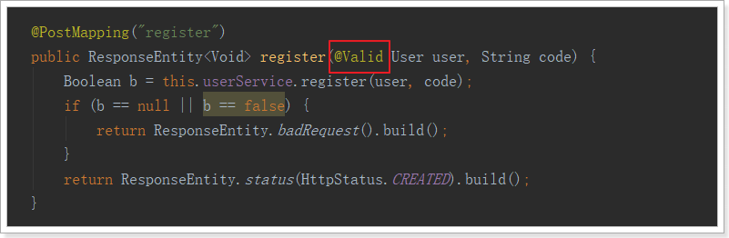


### 6.5.5.测试

我们故意填错：

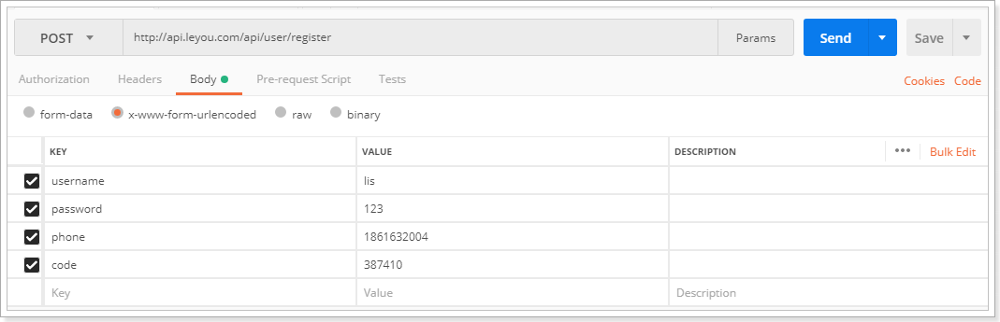

然后SpringMVC会自动返回错误信息：

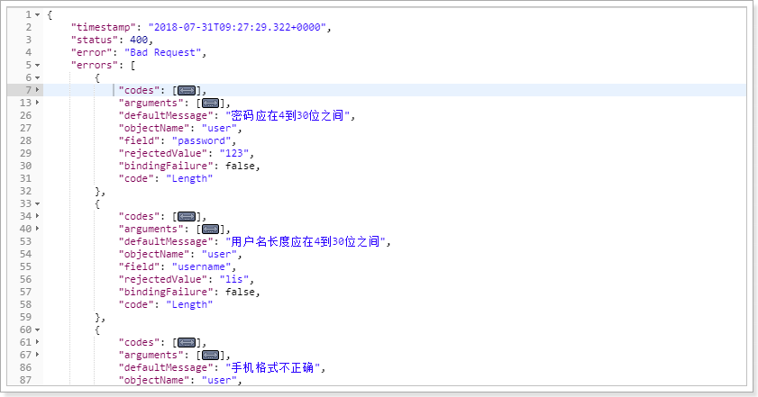


# 7.根据用户名和密码查询用户

**功能说明**

查询功能，根据参数中的用户名和密码查询指定用户


**接口路径**

```
GET /query
```


**参数说明**

| 参数     | 说明                                     | 是否必须 | 数据类型 | 默认值 |
| -------- | ---------------------------------------- | -------- | -------- | ------ |
| username | 用户名，格式为4~30位字母、数字、下划线   | 是       | String   | 无     |
| password | 用户密码，格式为4~30位字母、数字、下划线 | 是       | String   | 无     |


**返回结果**

用户的json格式数据

```json
{
    "id": 6572312,
    "username":"test",
    "phone":"13688886666",
    "created": 1342432424
}
```


**状态码**

- 200：注册成功
- 400：用户名或密码错误
- 500：服务器内部异常，注册失败


## 7.1.controller

```java
/**
 * 根据用户名和密码查询用户
 * @param username
 * @param password
 * @return
 */
@GetMapping("query")
public ResponseEntity<User> queryUser(
    @RequestParam("username") String username,
    @RequestParam("password") String password
    ) {
        User user = this.userService.queryUser(username, password);
        if (user == null) {
            return ResponseEntity.status(HttpStatus.BAD_REQUEST).build();
        }
        return ResponseEntity.ok(user);
    }
```

## 7.2.service

```java
public User queryUser(String username, String password) {
    // 查询
    User record = new User();
    record.setUsername(username);
    User user = this.userMapper.selectOne(record);
    // 校验用户名
    if (user == null) {
        return null;
    }
    // 校验密码
    if (!user.getPassword().equals(CodecUtils.md5Hex(password, user.getSalt()))) {
        return null;
    }
    // 用户名密码都正确
    return user;
}
```

要注意，查询时也要对密码进行加密后判断是否一致。


## 7.3.测试

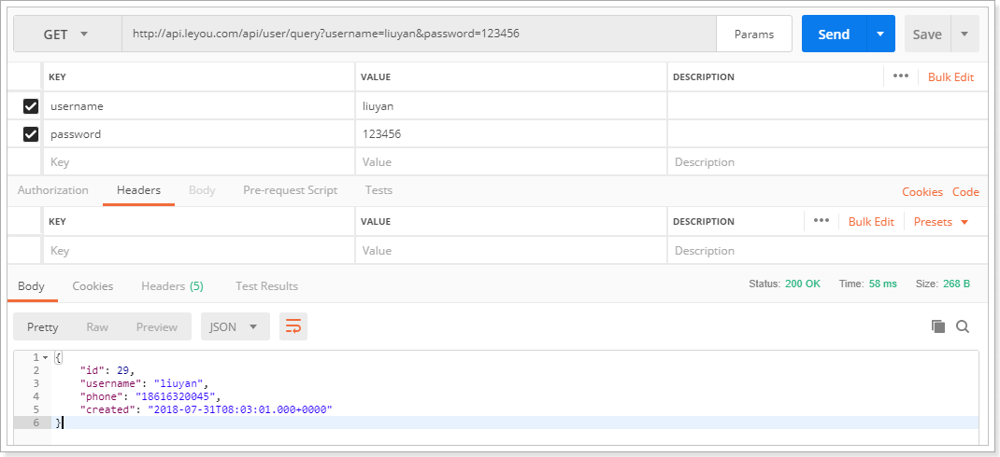


# 8.在注册页进行测试

在注册页填写信息：

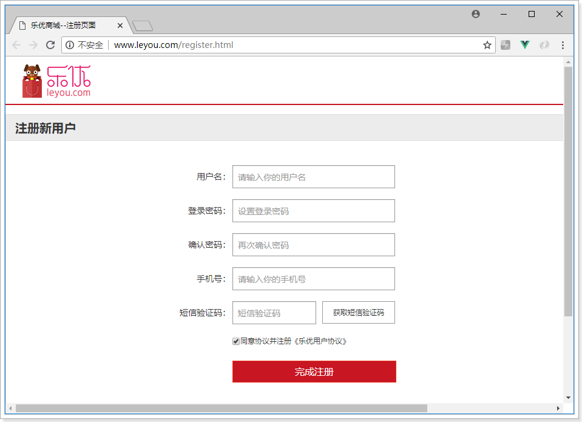

提交发现页面自动跳转到了登录页，查看数据库：

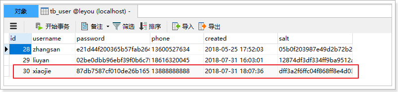


