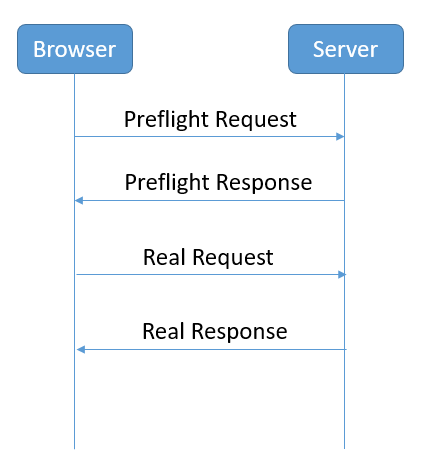
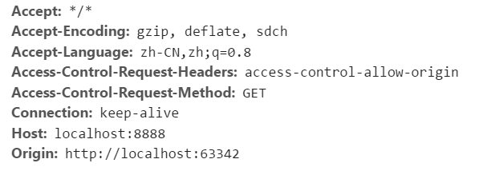
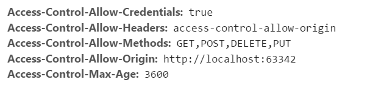

# 第2章 分布式文件存储 

## 学习目标

目标1：能够CORS解决跨域问题

目标2：能够使用黑马架构师批量生成代码

目标3：理解规格参数模板与商品分类表结构

目标4：掌握通用mapper自定义方法的使用

目标5：能够使用分布式文件存储FastDFS上传文件

## 1. 跨域解决方案CORS

### 1.1 什么是跨域

出于浏览器的同源策略限制。同源策略（Sameoriginpolicy）是一种约定，它是浏览器最核心也最基本的安全功能，如果缺少了同源策略，则浏览器的正常功能可能都会受到影响。可以说Web是构建在同源策略基础之上的，浏览器只是针对同源策略的一种实现。同源策略会阻止一个域的javascript脚本和另外一个域的内容进行交互。所谓同源（即指在同一个域）就是两个页面具有相同的协议（protocol），主机（host）和端口号（port）

如果跨域调用，会出现如下错误：

> No 'Access-Control-Allow-Origin' header is present on the requested resource. Origin
> 'http://localhost:9100' is therefore not allowed access. The response had HTTP status code 400.

由于我们采用的是前后端分离的编程方式，前端和后端必定存在跨域问题。解决跨域问题可以采用CORS

### 1.2 CORS简介

CORS 是一个 W3C 标准，全称是"跨域资源共享"（Cross-origin resource sharing）。CORS需要浏览器和服务器同时支持。目前，所有浏览器都支持该功能，IE 浏览器不能低于 IE10。它允许浏览器向跨源服务器，发出 XMLHttpRequest 请求，从而克服了 AJAX 只能同源使用的限制。整个 CORS 通信过程，都是浏览器自动完成，不需要用户参与。对于开发者来说，CORS 通信与同源的 AJAX 通信没有差别，代码完全一样。浏览器一旦发现 AJAX 请求跨源，就会自动添加一些附加的头信息，有时还会多出一次附加的请求，但用户不会有感觉。因此，实现 CORS 通信的关键是服务器。只要服务器实现了 CORS 接口，就可以跨源通信。

请求过程如下图:



Preflight Request：



然后服务器端给我们返回一个PreflightResponse



那么具体如何实现呢？springMVC的版本在4.2或以上版本，可以使用注解实现跨域。 我们只需要在Controller类上添加注解`@CrossOrigin`就可以了。

## 2. 导入基础架构项目（了解） 

项目基础架构包解压, 复制到idea工程中

### 2.1 导入项目

在`idea`下点击`file`菜单中的`open`项, 找到`changgou_parent`位置打开

### 2.2 配置maven本地仓库

1. 将本地仓库解压到硬盘根目录, 然后配置里面的 `settings.xml` 文件为本地仓库的所在位置

2. 在Idea下点击 `file`菜单中的 `settings` 选项, 然后搜索, 关键词为 maven
3. 在maven选项中, 配置maven所在位置, `注意maven版本必须为3.3.9版本`
4. 配置maven配置文件为本地仓库 `settings.xml`位置


## 3.规格参数与分类管理（后台）

我们本小节只需同学们理解管理后台规格参数与分类管理的需求和表结构的设计，没有代码实现，因为管理后台所需的代码“黑马架构师”都已经帮我们生成了，无需我们自己编写了。

### 3.1 规格参数管理

#### 3.1.1 需求分析

规格参数模板是用于管理规格参数的单元。规格是例如颜色、手机运行内存等信息，参数是例如系统：安卓（Android）后置摄像头像素：2000万及以上  热点：快速充电等信息 。

前端交互方式见管理后台的静态原型

#### 3.1.2 表结构分析

规格参数模板相关的表有3个

tb_template  表（模板表）

| 字段名称     | 字段含义 | 字段类型    | 字段长度 | 备注   |
| -------- | ---- | ------- | ---- | ---- |
| id       | ID   | INT     |      |      |
| name     | 模板名称 | VARCHAR |      |      |
| spec_num | 规格数量 | INT     |      |      |
| para_num | 参数数量 | INT     |      |      |

tb_spec  表（ 规格表）

| 字段名称        | 字段含义 | 字段类型    | 字段长度 | 备注   |
| ----------- | ---- | ------- | ---- | ---- |
| id          | ID   | INT     |      |      |
| name        | 名称   | VARCHAR |      |      |
| options     | 规格选项 | VARCHAR |      |      |
| seq         | 排序   | INT     |      |      |
| template_id | 模板ID | INT     |      |      |

tb_para  表（参数表）

| 字段名称        | 字段含义 | 字段类型    | 字段长度 | 备注   |
| ----------- | ---- | ------- | ---- | ---- |
| id          | id   | INT     |      |      |
| name        | 名称   | VARCHAR |      |      |
| options     | 选项   | VARCHAR |      |      |
| seq         | 排序   | INT     |      |      |
| template_id | 模板ID | INT     |      |      |

模板与规格是一对多关系 ，模板与参数是一对多关系

### 3.2 分类管理 

#### 3.2.1 需求分析

商品分类一共分三级管理，主要作用是在网站首页中显示商品导航，以及在管理后台管理商品时使用。

前端交互方式见管理后台的静态原型

#### 3.2.2 表结构分析

tb_category  表 （**商品分类**）

| 字段名称        | 字段含义 | 字段类型    | 字段长度 | 备注            |
| ----------- | ---- | ------- | ---- | ------------- |
| id          | 分类ID | INT     |      |               |
| name        | 分类名称 | VARCHAR |      |               |
| goods_num   | 商品数量 | INT     |      |               |
| is_show     | 是否显示 | CHAR    |      | 0 不显示 1显示     |
| is_menu     | 是否导航 | CHAR    |      | 0 不时导航  1 为导航 |
| seq         | 排序   | INT     |      |               |
| parent_id   | 上级ID | INT     |      |               |
| template_id | 模板ID | INT     |      |               |

商品分类与模板是多对一关系

## 4.通用mapper自定义方法 

### 4.1 根据商品分类名称查询品牌列表 

#### 4.1.1 表结构分析 

一个品牌有可能隶属于多个分类，例如：华为，除了做手机之外，还做路由器、电脑设备、穿戴类的手环等，一个道理，一个分类下有可能有多个品牌，所以他们之间的关系属于多对多关系，这里通过tb_category_brand表来建立关联关系。

分类-品牌中间表

| 列名          | 类型      | 说明   |
| ----------- | ------- | ---- |
| category_id | int(11) | 分类ID |
| brand_id    | int(11) | 品牌ID |

#### 4.1.2 代码实现 

（1）修改BrandMapper，新增方法定义

```java
    /**
     * 根据分类名称查询品牌列表
     * @param categoryName
     * @return
     */
    @Select("SELECT name,image FROM tb_brand WHERE id  IN (SELECT brand_id FROM tb_category_brand WHERE  category_id IN (SELECT id FROM tb_category WHERE NAME=#{name}) )order by seq")
    public List<Map> findListByCategoryName(@Param("name") String categoryName);
```

（2）修改BrandService，新增方法定义

```java
    /**
     * 根据商品分类名称查询品牌列表
     * @param categoryName
     * @return
     */
    public List<Map> findListByCategoryName(String categoryName);
```

（3）BrandServiceImpl实现方法

```java
    @Override
    public List<Map> findListByCategoryName(String categoryName) {
        return brandMapper.findListByCategoryName(categoryName);
    }
```

（4）BrandController新增方法

```java
/**
 * 根据分类名称查询品牌列表
 * @param category
 * @return
 */
@GetMapping("/category/{category}")
public Result  findListByCategoryName(@PathVariable String category){
	System.out.println(category);
	List<Map> brandList = brandService.findListByCategoryName(category);
	return new Result(true,StatusCode.OK,"查询成功",brandList);
}
```


### 4.2 根据商品分类名称查询规格列表  

#### 4.2.1 表结构分析

我们这里会用到规格表、模板表、分类表  **注意：以下表结构已省略无关字段**

tb_template  表（模板表）

| 字段名称 | 字段含义 | 字段类型    | 字段长度 | 备注   |
| ---- | ---- | ------- | ---- | ---- |
| id   | ID   | INT     |      |      |
| name | 模板名称 | VARCHAR |      |      |

tb_spec  表（ 规格表）

| 字段名称        | 字段含义 | 字段类型    | 字段长度 | 备注   |
| ----------- | ---- | ------- | ---- | ---- |
| id          | ID   | INT     |      |      |
| name        | 名称   | VARCHAR |      |      |
| options     | 规格选项 | VARCHAR |      |      |
| seq         | 排序   | INT     |      |      |
| template_id | 模板ID | INT     |      |      |

tb_category  表 （商品分类）

| 字段名称        | 字段含义 | 字段类型    | 字段长度 | 备注   |
| ----------- | ---- | ------- | ---- | ---- |
| id          | 分类ID | INT     |      |      |
| name        | 分类名称 | VARCHAR |      |      |
| parent_id   | 上级ID | INT     |      |      |
| template_id | 模板ID | INT     |      |      |


#### 4.2.2 代码实现

（1）SpecMapper新增方法定义

```java
 @Select("SELECT name,options FROM tb_spec WHERE template_id IN ( SELECT template_id FROM tb_category WHERE NAME=#{categoryName}) order by seq")
    public List<Map> findListByCategoryName(@Param("categoryName") String categoryName);  
```

（2）SpecService新增方法定义

```java
    /**
     * 根据商品分类名称查询规格列表
     * @param categoryName
     * @return
     */
    public List<Map> findListByCategoryName(String categoryName);
```

（3）SpecServiceImpl实现方法

```java
    @Override
    public List<Map> findListByCategoryName(String categoryName) {
        List<Map> specList = specMapper.findListByCategoryName(categoryName);
        for(Map spec:specList){
            String[] options = ((String) spec.get("options")).split(",");//规格选项列表
            spec.put("options",options);
        }
        return specList;
    }
```

（4）SpecController新增方法

```java
    /**
     * 根据商品分类名称查询规格列表
     * @param category
     * @return
     */
    @GetMapping("/category/{category}")
    public Result findListByCategoryName(@PathVariable  String category){
        List<Map> specList = specService.findListByCategoryName(category);
        return new Result(true,StatusCode.OK,"",specList);
    }
```


## 5. 分布式文件存储-FastDFS

### 5.1 FastDFS简介

#### 5.1.1 FastDFS体系结构

FastDFS是一个开源的轻量级[分布式文件系统](https://baike.baidu.com/item/%E5%88%86%E5%B8%83%E5%BC%8F%E6%96%87%E4%BB%B6%E7%B3%BB%E7%BB%9F/1250388)，它对文件进行管理，功能包括：文件存储、文件同步、文件访问（文件上传、文件下载）等，解决了大容量存储和负载均衡的问题。特别适合以文件为载体的在线服务，如相册网站、视频网站等等。

FastDFS为互联网量身定制，充分考虑了冗余备份、负载均衡、线性扩容等机制，并注重高可用、高性能等指标，使用FastDFS很容易搭建一套高性能的文件服务器集群提供文件上传、下载等服务。

FastDFS 架构包括 Tracker server 和 Storage server。客户端请求 Tracker server 进行文件上传、下载，通过Tracker server 调度最终由 Storage server 完成文件上传和下载。

Tracker server 作用是负载均衡和调度，通过 Tracker server 在文件上传时可以根据一些策略找到Storage server 提供文件上传服务。可以将 tracker 称为追踪服务器或调度服务器。Storage server 作用是文件存储，客户端上传的文件最终存储在 Storage 服务器上，Storageserver 没有实现自己的文件系统而是利用操作系统的文件系统来管理文件。可以将storage称为存储服务器。


#### 5.1.2 上传流程


客户端上传文件后存储服务器将文件 ID 返回给客户端，此文件 ID 用于以后访问该文件的索引信息。文件索引信息包括：组名，虚拟磁盘路径，数据两级目录，文件名。


**组名**：文件上传后所在的 storage 组名称，在文件上传成功后有storage 服务器返回，需要客户端自行保存。

**虚拟磁盘路径**：storage 配置的虚拟路径，与磁盘选项store_path*对应。如果配置了

store_path0 则是 M00，如果配置了 store_path1 则是 M01，以此类推。

**数据两级目录**：storage 服务器在每个虚拟磁盘路径下创建的两级目录，用于存储数据

文件。

**文件名**：与文件上传时不同。是由存储服务器根据特定信息生成，文件名包含：源存储

服务器 IP 地址、文件创建时间戳、文件大小、随机数和文件拓展名等信息。

### 5.2 FastDFS搭建

我们使用Docker搭建FastDFS的开发环境

拉取镜像

```properties
docker pull morunchang/fastdfs
```

运行tracker

```properties
docker run -d --name tracker --net=host morunchang/fastdfs sh tracker.sh
```

运行storage

```properties
docker run -d --name storage --net=host -e TRACKER_IP=<your tracker server address>:22122 -e GROUP_NAME=<group name> morunchang/fastdfs sh storage.sh
```

- 使用的网络模式是–net=host, <your tracker server address> 替换为你机器的Ip即可  
- <group name> 是组名，即storage的组  
- 如果想要增加新的storage服务器，再次运行该命令，注意更换 新组名

（4）修改nginx的配置  

进入storage的容器内部，修改nginx.conf

```
docker exec -it storage  /bin/bash
```

进入后

```
vi /data/nginx/conf/nginx.conf
```

添加以下内容

```
location /group1/M00 {
   proxy_next_upstream http_502 http_504 error timeout invalid_header;
     proxy_cache http-cache;
     proxy_cache_valid  200 304 12h;
     proxy_cache_key $uri$is_args$args;
     proxy_pass http://fdfs_group1;
     expires 30d;
 }
```

（5）退出容器

```
exit
```

（6）重启storage容器

```
docker restart storage
```

### 5.3 文件存储微服务 

创建文件管理微服务changgou_service_file，该工程主要用于实现文件上传以及文件删除等功能。

（1）修改pom.xml，引入依赖

```xml
<?xml version="1.0" encoding="UTF-8"?>
<project xmlns="http://maven.apache.org/POM/4.0.0"
         xmlns:xsi="http://www.w3.org/2001/XMLSchema-instance"
         xsi:schemaLocation="http://maven.apache.org/POM/4.0.0 http://maven.apache.org/xsd/maven-4.0.0.xsd">
    <parent>
        <artifactId>changgou_service</artifactId>
        <groupId>com.changgou</groupId>
        <version>1.0-SNAPSHOT</version>
    </parent>
    <modelVersion>4.0.0</modelVersion>

    <artifactId>changgou_service_file</artifactId>
    <dependencies>
        <dependency>
            <groupId>org.springframework.boot</groupId>
            <artifactId>spring-boot-starter-web</artifactId>
        </dependency>
        <dependency>
            <groupId>net.oschina.zcx7878</groupId>
            <artifactId>fastdfs-client-java</artifactId>
            <version>1.27.0.0</version>
        </dependency>
        <dependency>
            <groupId>com.changgou</groupId>
            <artifactId>changgou_common</artifactId>
            <version>1.0-SNAPSHOT</version>
        </dependency>
    </dependencies>
</project>
```

（2）在resources文件夹下创建fasfDFS的配置文件fdfs_client.conf

```conf
connect_timeout = 60
network_timeout = 60
charset = UTF-8
http.tracker_http_port = 8080
tracker_server = 192.168.200.128:22122
```

connect_timeout：连接超时时间，单位为秒。

network_timeout：通信超时时间，单位为秒。发送或接收数据时。假设在超时时间后还不能发送或接收数据，则本次网络通信失败

charset： 字符集

http.tracker_http_port  ：.tracker的http端口

tracker_server： tracker服务器IP和端口设置

（3）在resources文件夹下创建application.yml

```yaml
spring:
  servlet:
    multipart:
      max-file-size: 10MB
      max-request-size: 10MB
server:
  port: 9008
eureka:
  client:
    service-url:
      defaultZone: http://127.0.0.1:6868/eureka
  instance:
    prefer-ip-address: true
feign:
  hystrix:
    enabled: true
```

max-file-size是单个文件大小，max-request-size是设置总上传的数据大小

（4）启动类    创建com.changgou包，创建启动类FileApplication

```java
@SpringBootApplication
@EnableEurekaClient
public class FileApplication {

    public static void main(String[] args) {
        SpringApplication.run(FileApplication.class);
    }
}
```

### 5.4 文件上传 

#### 5.4.1 文件信息封装

文件上传一般都有文件的名字、文件的内容、文件的扩展名、文件的md5值、文件的作者等相关属性，我们可以创建一个对象封装这些属性，代码如下：

创建com.changgou.file.pojo.FastDFSFile

```java
public class FastDFSFile {
	//文件名字
	private String name;
	//文件内容
	private byte[] content;
	//文件扩展名
	private String ext;
	//文件MD5摘要值
	private String md5;
	//文件创建作者
	private String author;

	public FastDFSFile(String name, byte[] content, String ext, String height,
					   String width, String author) {
		super();
		this.name = name;
		this.content = content;
		this.ext = ext;
		this.author = author;
	}

	public FastDFSFile(String name, byte[] content, String ext) {
		super();
		this.name = name;
		this.content = content;
		this.ext = ext;
	}

	// getter and setter ...
}
```

#### 5.4.2 文件操作

创建FastDFSClient类,放在com.itheima.file.util下在该类中实现FastDFS信息获取以及文件的相关操作，

代码如下：

```java
public class FastDFSClient {
    
    private static org.slf4j.Logger logger = LoggerFactory.getLogger(FastDFSClient.class);

	/***
	 * 初始化加载FastDFS的TrackerServer配置
	 */
	static {
		try {
			String filePath = new ClassPathResource("fdfs_client.conf").getFile().getAbsolutePath();
			ClientGlobal.init(filePath);
		} catch (Exception e) {
			logger.error("FastDFS Client Init Fail!",e);
		}
	}

	/***
	 * 文件上传
	 * @param file
	 * @return
	 */
	public static String[] upload(FastDFSFile file) {
		//获取文件的作者
		NameValuePair[] meta_list = new NameValuePair[1];
		meta_list[0] = new NameValuePair("author", file.getAuthor());

		//接收返回数据
		String[] uploadResults = null;
		StorageClient storageClient=null;
		try {
			//创建StorageClient客户端对象
			storageClient = getTrackerClient();

			/***
			 * 文件上传
			 * 1)文件字节数组
			 * 2)文件扩展名
			 * 3)文件作者
			 */
			uploadResults = storageClient.upload_file(file.getContent(), file.getExt(), meta_list);
		} catch (Exception e) {
			logger.error("Exception when uploadind the file:" + file.getName(), e);
		}

		if (uploadResults == null && storageClient!=null) {
			logger.error("upload file fail, error code:" + storageClient.getErrorCode());
		}
		//获取组名
		String groupName = uploadResults[0];
		//获取文件存储路径
		String remoteFileName = uploadResults[1];
		return uploadResults;
	}

	/***
	 * 获取文件信息
	 * @param groupName:组名
	 * @param remoteFileName：文件存储完整名
	 * @return
	 */
	public static FileInfo getFile(String groupName, String remoteFileName) {
		try {
			StorageClient storageClient = getTrackerClient();
			return storageClient.get_file_info(groupName, remoteFileName);
		} catch (Exception e) {
			logger.error("Exception: Get File from Fast DFS failed", e);
		}
		return null;
	}

	/***
	 * 文件下载
	 * @param groupName
	 * @param remoteFileName
	 * @return
	 */
	public static InputStream downFile(String groupName, String remoteFileName) {
		try {
			//创建StorageClient
			StorageClient storageClient = getTrackerClient();

			//下载文件
			byte[] fileByte = storageClient.download_file(groupName, remoteFileName);
			InputStream ins = new ByteArrayInputStream(fileByte);
			return ins;
		} catch (Exception e) {
			logger.error("Exception: Get File from Fast DFS failed", e);
		}
		return null;
	}

	/***
	 * 文件删除
	 * @param groupName
	 * @param remoteFileName
	 * @throws Exception
	 */
	public static void deleteFile(String groupName, String remoteFileName)
			throws Exception {
		//创建StorageClient
		StorageClient storageClient = getTrackerClient();

		//删除文件
		int i = storageClient.delete_file(groupName, remoteFileName);
	}

	/***
	 * 获取Storage组
	 * @param groupName
	 * @return
	 * @throws IOException
	 */
	public static StorageServer[] getStoreStorages(String groupName)
			throws IOException {
		//创建TrackerClient
		TrackerClient trackerClient = new TrackerClient();
		//获取TrackerServer
		TrackerServer trackerServer = trackerClient.getConnection();
		//获取Storage组
		return trackerClient.getStoreStorages(trackerServer, groupName);
	}

	/***
	 * 获取Storage信息,IP和端口
	 * @param groupName
	 * @param remoteFileName
	 * @return
	 * @throws IOException
	 */
	public static ServerInfo[] getFetchStorages(String groupName,
												String remoteFileName) throws IOException {
		TrackerClient trackerClient = new TrackerClient();
		TrackerServer trackerServer = trackerClient.getConnection();
		return trackerClient.getFetchStorages(trackerServer, groupName, remoteFileName);
	}

	/***
	 * 获取Tracker服务地址
	 * @return
	 * @throws IOException
	 */
	public static String getTrackerUrl() throws IOException {
		return "http://"+getTrackerServer().getInetSocketAddress().getHostString()+":"+ClientGlobal.getG_tracker_http_port()+"/";
	}

	/***
	 * 获取Storage客户端
	 * @return
	 * @throws IOException
	 */
	private static StorageClient getTrackerClient() throws IOException {
		TrackerServer trackerServer = getTrackerServer();
		StorageClient storageClient = new StorageClient(trackerServer, null);
		return  storageClient;
	}

	/***
	 * 获取Tracker
	 * @return
	 * @throws IOException
	 */
	private static TrackerServer getTrackerServer() throws IOException {
		TrackerClient trackerClient = new TrackerClient();
		TrackerServer trackerServer = trackerClient.getConnection();
		return  trackerServer;
	}
}
```

#### 5.4.3 文件上传

创建一个FileController，在该控制器中实现文件上传操作，代码如下：

```java
@RestController
@CrossOrigin
public class FileController {

    @PostMapping("/upload")
    public String upload(@RequestParam("file") MultipartFile file) {
        String path ="";
        try {
            path=saveFile(file);
            System.out.println(path);
        } catch (Exception e) {
            e.printStackTrace();
        }
        return path;
    }

    /**
     * @param multipartFile
     * @return
     * @throws IOException
     */
    public String saveFile(MultipartFile multipartFile) throws IOException {
        //1. 获取文件名
        String fileName = multipartFile.getOriginalFilename();
        //2. 获取文件内容
        byte[] content = multipartFile.getBytes();
        //3. 获取文件扩展名
        String ext = "";
        if (fileName != null && !"".equals(fileName)) {
            ext = fileName.substring(fileName.lastIndexOf("."));
        }
        //4. 创建文件实体类对象
        FastDFSFile fastDFSFile = new FastDFSFile(fileName, content, ext);
        //5. 上传
        String[] uploadResults = FastDFSClient.upload(fastDFSFile);
        //6. 拼接上传后的文件的完整路径和名字, uploadResults[0]为组名, uploadResults[1]为文件名称和路径
        String path = FastDFSClient.getTrackerUrl() + uploadResults[0] + "/" + uploadResults[1];
        //7. 返回
        return path;
    }
}
```

### 5.5 Postman测试文件上传

步骤：

1、选择post请求方式，输入请求地址  http://localhost:9007/upload

2、填写Headers

```properties
Key：Content-Type
Value：multipart/form-data
```

3、填写body

选择form-data   然后选择文件file   点击添加文件，最后发送即可。


