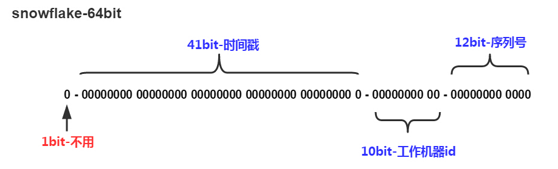

# 第4章 商品管理 

## 学习目标

- 能够使用开源算法snowflake生成分布式id

- 完成新增和修改商品功能

- 完成商品审核和上下架功能

- 完成删除与还原商品功能

  

## 1. 分布式ID生成解决方案

### 1.1 分布式ID生成解决方案

#### 1.1.1 UUID

常见的方式。可以利用数据库也可以利用程序生成，一般来说全球唯一。

优点：

1）简单，代码方便。

2）生成ID性能非常好，基本不会有性能问题。

3）全球唯一，在遇见数据迁移，系统数据合并，或者数据库变更等情况下，可以从容应对。

 缺点：

1）没有排序，无法保证趋势递增。

2）UUID往往是使用字符串存储，查询的效率比较低。

3）存储空间比较大，如果是海量数据库，就需要考虑存储量的问题。

4）传输数据量大

5）不可读。

#### 1.1.2 Redis生成ID

当使用数据库来生成ID性能不够要求的时候，我们可以尝试使用Redis来生成ID。这主要依赖于Redis是单线程的，所以也可以用生成全局唯一的ID。可以用Redis的原子操作 INCR和INCRBY来实现。

优点：

1）不依赖于数据库，灵活方便，且性能优于数据库。

2）数字ID天然排序，对分页或者需要排序的结果很有帮助。

缺点：

1）如果系统中没有Redis，还需要引入新的组件，增加系统复杂度。

2）需要编码和配置的工作量比较大。

3）网络传输造成性能下降。

#### 1.1.3 开源算法snowflake

 snowflake是Twitter开源的分布式ID生成算法，结果是一个long型的ID。其核心思想是：使用41bit作为毫秒数，10bit作为机器的ID（5个bit是数据中心，5个bit的机器ID），12bit作为毫秒内的流水号（意味着每个节点在每毫秒可以产生 4096 个 ID），最后还有一个符号位，永远是0



我们在《畅购》系统中采用的就是开源算法snowflake

### 1.2 snowflake快速入门

#### 1.2.1 快速入门

（1）新建工程，将资料/工具类下的IdWorker.java拷贝到工程中。

（2）编写代码

```java
        IdWorker idWorker=new IdWorker(1,1);

        for(int i=0;i<10000;i++){
            long id = idWorker.nextId();
            System.out.println(id);
        }
```

#### 1.2.2 配置分布式ID生成器

（1）IdWorker.java拷贝到changgou_common工程com.changgou.util包中

（2）changgou_service_goods的application.yml添加配置

```yaml
workerId: 0
datacenterId: 0
```

（3）修改GoodsApplication，增加代码

```java
    @Value("${workerId}")
    private Integer workerId;

    @Value("${datacenterId}")
    private Integer datacenterId;

    @Bean
    public IdWorker idWorker(){
        return new IdWorker(workerId,datacenterId);
    }
```

（4）在任意Controller类中注入IdWorker，测试是否能够生成ID

## 2 新增和修改商品 

### 2.1 概念与表结构分析 

#### 2.1.1 SPU与SKU概念

**SPU = Standard Product Unit  （标准产品单位）**

- 概念 : SPU 是商品信息聚合的最小单位，是一组可复用、易检索的标准化信息的集合，该集合描述了一个产品的特性。

- 通俗点讲，属性值、特性相同的货品就可以称为一个 SPU

  例如：**华为P30 就是一个 SPU**

**SKU=stock keeping unit( 库存量单位)**

- SKU 即库存进出计量的单位， 可以是以件、盒、托盘等为单位。

- SKU 是物理上不可分割的最小存货单元。在使用时要根据不同业态，不同管理模式来处理。

- 在服装、鞋类商品中使用最多最普遍。

  例如：**华为P30 红色 64G 就是一个 SKU**

#### 2.1.2 表结构分析

tb_spu  表 （SPU表）

| 字段名称           | 字段含义   | 字段类型    | 字段长度 | 备注   |
| -------------- | ------ | ------- | ---- | ---- |
| id             | 主键     | VARCHAR |      |      |
| sn             | 货号     | VARCHAR |      |      |
| name           | SPU名   | VARCHAR |      |      |
| caption        | 副标题    | VARCHAR |      |      |
| brand_id       | 品牌ID   | INT     |      |      |
| category1_id   | 一级分类   | INT     |      |      |
| category2_id   | 二级分类   | INT     |      |      |
| category3_id   | 三级分类   | INT     |      |      |
| template_id    | 模板ID   | INT     |      |      |
| freight_id     | 运费模板id | INT     |      |      |
| image          | 图片     | VARCHAR |      |      |
| images         | 图片列表   | VARCHAR |      |      |
| sale_service   | 售后服务   | VARCHAR |      |      |
| introduction   | 介绍     | TEXT    |      |      |
| spec_items     | 规格列表   | VARCHAR |      |      |
| para_items     | 参数列表   | VARCHAR |      |      |
| sale_num       | 销量     | INT     |      |      |
| comment_num    | 评论数    | INT     |      |      |
| is_marketable  | 是否上架   | CHAR    |      |      |
| is_enable_spec | 是否启用规格 | CHAR    |      |      |
| is_delete      | 是否删除   | CHAR    |      |      |
| status         | 审核状态   | CHAR    |      |      |

tb_sku  表（SKU商品表）

| 字段名称          | 字段含义                | 字段类型     | 字段长度 | 备注   |
| ------------- | ------------------- | -------- | ---- | ---- |
| id            | 商品id                | VARCHAR  |      |      |
| sn            | 商品条码                | VARCHAR  |      |      |
| name          | SKU名称               | VARCHAR  |      |      |
| price         | 价格（分）               | INT      |      |      |
| num           | 库存数量                | INT      |      |      |
| alert_num     | 库存预警数量              | INT      |      |      |
| image         | 商品图片                | VARCHAR  |      |      |
| images        | 商品图片列表              | VARCHAR  |      |      |
| weight        | 重量（克）               | INT      |      |      |
| create_time   | 创建时间                | DATETIME |      |      |
| update_time   | 更新时间                | DATETIME |      |      |
| spu_id        | SPUID               | BIGINT   |      |      |
| category_id   | 类目ID                | INT      |      |      |
| category_name | 类目名称                | VARCHAR  |      |      |
| brand_name    | 品牌名称                | VARCHAR  |      |      |
| spec          | 规格                  | VARCHAR  |      |      |
| sale_num      | 销量                  | INT      |      |      |
| comment_num   | 评论数                 | INT      |      |      |
| status        | 商品状态 1-正常，2-下架，3-删除 | CHAR     |      |      |


### 2.2 实现思路 

前端传递给后端的数据格式 是一个spu对象和sku列表组成的对象

```json
{
    "spu": {
      	"name": "这个是商品名称",
      	"caption": "这个是副标题",
		"brandId": 12,
		"category1Id": 558,
		"category2Id": 559,
		"category3Id": 560,
		"freightId": 10,
		"image": "http://www.qingcheng.com/image/1.jpg",
         "images": "http://www.qingcheng.com/image/1.jpg,http://www.qingcheng.com/image/2.jpg",
		"introduction": "这个是商品详情，html代码",
         "paraItems": {"出厂年份":"2019","赠品":"充电器"},
		"saleService": "七天包退,闪电退货",
		"sn": "020102331",
		"specItems":  {"颜色":["红","绿"],"机身内存":["64G","8G"]},
		"templateId": 42
	},
	"skuList": [{
		"sn": "10192010292",
         "num": 100,
      	 "alertNum": 20,
		"price": 900000,
         "spec": "{"颜色":"红","机身内存":"64G"}",
         "image": "http://www.qingcheng.com/image/1.jpg",
         "images": "http://www.qingcheng.com/image/1.jpg,http://www.qingcheng.com/image/2.jpg",
		"status": "1",
		"weight": 130
	},
    {
		"sn": "10192010293",
         "num": 100,
      	 "alertNum": 20,
		 "price": 600000,
         "spec": {"颜色":"绿","机身内存":"8G"},
         "image": "http://www.qingcheng.com/image/1.jpg",
         "images": "http://www.qingcheng.com/image/1.jpg,http://www.qingcheng.com/image/2.jpg",
		"status": "1",
		"weight": 130
	}
  ]
}
```


### 2.3 代码实现 

#### 2.3.1 SPU与SKU列表的保存  

代码实现：

（1）changgou_service_goods_api工程创建组合实体类Goods

```java
/**
 * 商品组合实体类
 */
public class Goods implements Serializable {

    private Spu spu;
    private List<Sku> skuList;

    public Spu getSpu() {
        return spu;
    }

    public void setSpu(Spu spu) {
        this.spu = spu;
    }

    public List<Sku> getSkuList() {
        return skuList;
    }

    public void setSkuList(List<Sku> skuList) {
        this.skuList = skuList;
    }
}
```

（2）changgou_service_goods工程SpuService新增方法add(Goods goods)

```java
    /***
     * 新增
     * @param goods
     */
    void add(Goods goods);
```

（3）changgou_service_goods工程SpuServiceImpl实现此方法

```java
    @Autowired
    private CategoryMapper categoryMapper;

    @Autowired
    private SkuMapper skuMapper;

    @Autowired
    private BrandMapper brandMapper;

    @Autowired
    private IdWorker idWorker;

    /**
     * 保存商品 SPU+SKU列表
     * @param goods 商品组合实体类
     */
    @Transactional
    @Override
    public void add(Goods goods) {
        //生成spuId
        long spuId = idWorker.nextId();
        //spuId放入SPU对象中
        goods.getSpu().setId(String.valueOf(spuId));
        //添加保存SPU数据
        spuMapper.insertSelective(goods.getSpu());

        //保存sku集合数据到数据库
        saveSkuList(goods);
    }

    /**
     * 保存sku列表
     * @param goods
     */
    private void saveSkuList(Goods goods){
        //获取spu对象
        Spu spu = goods.getSpu();
        //当前日期
        Date date = new Date();
        //获取品牌对象
        Brand brand = brandMapper.selectByPrimaryKey(spu.getBrandId());
        //获取分类对象
        Category category = categoryMapper.selectByPrimaryKey(spu.getCategory3Id());
        //获取sku集合对象
        List<Sku> skuList = goods.getSkuList();
        if (skuList != null) {
            for (Sku sku : skuList) {
                //设置sku主键ID
                sku.setId(String.valueOf(idWorker.nextId()));
                //设置sku规格
                if (sku.getSpec() == null || "".equals(sku.getSpec())) {
                    sku.setSpec("{}");
                }
                //设置sku名称(商品名称 + 规格)
                String name = spu.getName();
                //将规格json字符串转换成Map
                Map<String, String> specMap = JSON.parseObject(sku.getSpec(), Map.class);
                if (specMap != null && specMap.size() > 0) {
                    for(String value : specMap.values()){
                        name += " "+ value;
                    }
                }

                sku.setName(name);//名称
                sku.setSpuId(spu.getId());//设置spu的ID
                sku.setCreateTime(date);//创建日期
                sku.setUpdateTime(date);//修改日期
                sku.setCategoryId(category.getId());//商品分类ID
                sku.setCategoryName(category.getName());//商品分类名称
                sku.setBrandName(brand.getName());//品牌名称
                skuMapper.insertSelective(sku);//插入sku表数据
            }
        }
    }

```

（3）修改SpuController的add方法

```java
    /***
     * 新增数据
     * @param goods
     * @return
     */
    @PostMapping
    public Result add(@RequestBody Goods goods){
        spuService.add(goods);
        return new Result(true,StatusCode.OK,"添加成功");
    }
```

#### 2.3.2 品牌与分类关联 

实现思路：

将分类ID与SPU的品牌ID 一起插入到tb_category_brand表中

（1）创建实体类

```java
@Table(name="tb_category_brand")
public class CategoryBrand implements Serializable {

    @Id
    private Integer categoryId;

    @Id
    private Integer brandId;


    public Integer getCategoryId() {
        return categoryId;
    }

    public void setCategoryId(Integer categoryId) {
        this.categoryId = categoryId;
    }

    public Integer getBrandId() {
        return brandId;
    }

    public void setBrandId(Integer brandId) {
        this.brandId = brandId;
    }
}
```

这个表是联合主键，所以templateId和brandId都有@Id注解

（2）新建数据访问接口

```java
public interface CategoryBrandMapper extends Mapper<CategoryBrand> {
  
}
```

（3）SpuServiceImpl引入

```java
    @Autowired
    private CategoryBrandMapper categoryBrandMapper;
```

（4）修改SpuServiceImpl的saveSkuList方法，添加分类与品牌之间的关联, 修改后代码如下:

```java
private void saveSkuList(Goods goods) {
        //获取spu对象
        Spu spu = goods.getSpu();
        //当前日期
        Date date = new Date();
        //获取品牌对象
        Brand brand = brandMapper.selectByPrimaryKey(spu.getBrandId());
        //获取分类对象
        Category category = categoryMapper.selectByPrimaryKey(spu.getCategory3Id());

        /**
         * 添加分类与品牌之间的关联
         */
        CategoryBrand categoryBrand = new CategoryBrand();
        categoryBrand.setBrandId(spu.getBrandId());
        categoryBrand.setCategoryId(spu.getCategory3Id());
        int count = categoryBrandMapper.selectCount(categoryBrand);
        //判断是否有这个品牌和分类的关系数据
        if(count == 0) {
            //如果没有关系数据则添加品牌和分类关系数据
            categoryBrandMapper.insert(categoryBrand);
        }

        //获取sku集合对象
        List<Sku> skuList = goods.getSkuList();
        if (skuList != null) {
            for (Sku sku : skuList) {
                //设置sku主键ID
                sku.setId(String.valueOf(idWorker.nextId()));
                //设置sku规格
                if (sku.getSpec() == null || "".equals(sku.getSpec())) {
                    sku.setSpec("{}");
                }
                //设置sku名称(商品名称 + 规格)
                String name = spu.getName();
                //将规格json字符串转换成Map
                Map<String, String> specMap = JSON.parseObject(sku.getSpec(), Map.class);
                if (specMap != null && specMap.size() > 0) {
                    for(String value : specMap.values()){
                        name += " "+ value;
                    }
                }

                sku.setName(name);//名称
                sku.setSpuId(spu.getId());//设置spu的ID
                sku.setCreateTime(date);//创建日期
                sku.setUpdateTime(date);//修改日期
                sku.setCategoryId(category.getId());//商品分类ID
                sku.setCategoryName(category.getName());//商品分类名称
                sku.setBrandName(brand.getName());//品牌名称
                skuMapper.insertSelective(sku);//插入sku表数据
            }
        }
    }
```

#### 2.3.3 根据ID查询商品  

需求：根据id 查询SPU和SKU列表 ，显示效果如下：

```json
{
    "spu": {
		"brandId": 8557,
		"caption": "111",
		"category1Id": 558,
		"category2Id": 559,
		"category3Id": 560,
		"commentNum": 0,
		"freightId": 0,
		"id": 149187842867993,
		"image": "",
		"images": "[{\"color\":\"银白色\",\"url\":\"//img11.360buyimg.com/n7/jfs/t30040/100/1290632710/208879/1f7e2225/5cdd0d92Nb78895a6.jpg\"}]",
		"introduction": "这是测试手机数据",
		"isDelete": 0,
		"isEnableSpec": "0",
		"isMarketable": "0",
		"name": "黑马智能手机",
		"paraItems": "",
		"saleNum": 0,
		"saleService": "",
		"sn": "",
		"specItems": "{\"颜色\":[\"金色\",\"黑色\",\"蓝色\"],\"版本\":[\"6GB+64GB\"]}",
		"status": "0",
		"templateId": 42
	},
	"skuList": [{
		"alertNum": 100,
		"commentNum": 0,
		"image": "https://m.360buyimg.com/mobilecms/s720x720_jfs/t22642/312/2563982615/103706/1398b13d/5b865bb3N0409f0d0.jpg!q70.jpg.webp",
		"images": "https://m.360buyimg.com/mobilecms/s720x720_jfs/t22642/312/2563982615/103706/1398b13d/5b865bb3N0409f0d0.jpg!q70.jpg.webp",
		"num": 100,
		"price": 90000,
		"saleNum": 0,
		"sn": "",
		"spec": "{'颜色': '蓝色'}",
		"status": "1",
		"weight": 10
	},{
		"alertNum": 100,
		"commentNum": 0,
		"image": "https://m.360buyimg.com/mobilecms/s720x720_jfs/t22642/312/2563982615/103706/1398b13d/5b865bb3N0409f0d0.jpg!q70.jpg.webp",
		"images": "https://m.360buyimg.com/mobilecms/s720x720_jfs/t22642/312/2563982615/103706/1398b13d/5b865bb3N0409f0d0.jpg!q70.jpg.webp",
		"num": 100,
		"price": 80000,
		"saleNum": 0,
		"sn": "",
		"spec": "{'颜色': '黑色'}",
		"status": "1",
		"weight": 10
	  }
   ]
}
```

代码实现：

（1）changgou_service_goods工程SpuService新增方法定义

```java
    /**
     * 根据ID查询商品
     * @param id
     * @return
     */
    public Goods findGoodsById(String id);
```

（2）changgou_service_goods工程SpuServiceImpl实现此方法

```java
    /**
     * 根据ID查询商品
     * @param id
     * @return
     */
    public Goods findGoodsById(String id){
        //查询spu
        Spu spu = spuMapper.selectByPrimaryKey(id);

        //查询SKU 列表
        Example example=new Example(Sku.class);
        Example.Criteria criteria = example.createCriteria();
        criteria.andEqualTo("spuId",id);
        List<Sku> skuList = skuMapper.selectByExample(example);

        //封装，返回
        Goods goods=new Goods();
        goods.setSpu(spu);
        goods.setSkuList(skuList);
        return goods;
    }
```

（3）修改SpuController的findById方法

```java
    @GetMapping("/{id}")
    public Result findById(@PathVariable String id){
        Goods goods = spuService.findGoodsById(id);
        return new Result(true,StatusCode.OK,"查询成功",goods);
    }
```

#### 2.3.4 保存修改  

（1）changgou_service_goods工程SpuService新增方法定义

```java
    /***
     * 修改数据
     * @param spu
     */
    void update(Goods goods);
```

（2）changgou_service_goods工程SpuServiceImpl实现此方法

```java

    @Override
    public void update(Goods goods ) {
        //取出spu部分
        Spu spu = goods.getSpu();
        spuMapper.updateByPrimaryKey(spu);
        //删除原sku列表
        Example example=new Example(Sku.class);
        Example.Criteria criteria = example.createCriteria();
        criteria.andEqualTo("spuId",spu.getId());
        skuMapper.deleteByExample(example);

        saveSkuList(goods);//保存sku列表
    }
```

（3）修改SpuController的update方法

```java
    /***
     * 修改数据
     * @param goods
     * @param id
     * @return
     */
    @PutMapping(value="/{id}")
    public Result update(@RequestBody Goods goods,@PathVariable String id){
        spuService.update(goods);
        return new Result(true,StatusCode.OK,"修改成功");
    }
```


## 3 商品审核与上下架

### 3.1 需求分析

商品新增后，审核状态为0（未审核），默认为下架状态。

审核商品，需要校验是否是被删除的商品，如果未删除则修改审核状态为1，并自动上架

下架商品，需要校验是否是被删除的商品，如果未删除则修改上架状态为0

上架商品，需要审核通过的商品

### 3.2 实现思路

（1）按照ID查询SPU信息

（2）判断修改审核、上架和下架状态

（3）保存SPU

### 3.3 代码实现

#### 3.3.1 商品审核

审核通过，自动上架

（1）SpuService新增方法

```java
    /**
     * 审核
     * @param id
     */
    public void audit(String id);
```

（2）SpuServiceImpl实现方法

```java
    /**
     * 审核
     * @param id
     */
    public void audit(String id) {
        Spu spu = spuMapper.selectByPrimaryKey(id);
        spu.setStatus("1");//已审核
        spuMapper.updateByPrimaryKeySelective(spu);
    }
```

（2）SpuController新增方法

```java
    /**
     * 审核
     * @param id
     * @return
     */
    @PutMapping("/audit/{id}")
    public Result audit(@PathVariable String id){
        spuService.audit(id);
        return new Result();
    }
```

#### 3.3.2 下架商品

（1）SpuService新增方法

```java
    /**
     * 下架商品
     * @param id
     */
    public void pull(String id);
```

（2）SpuServiceImpl实现方法

```java
    /**
     * 下架商品
     * @param id
     */
    public void pull(String id) {
        Spu spu = spuMapper.selectByPrimaryKey(id);
        spu.setIsMarketable("0");//下架状态
        spuMapper.updateByPrimaryKeySelective(spu);
    }
```

（2）SpuController新增方法

```java
    /**
     * 下架
     * @param id
     * @return
     */
    @PutMapping("/pull/{id}")
    public Result pull(@PathVariable String id){
        spuService.pull(id);
        return new Result();
    }
```

#### 3.3.3 上架商品 

必须是通过审核的商品才能上架

（1）SpuService新增方法

```java
    /**
     * 上架商品
     * @param id
     */
    public void put(String id);
```

（2）SpuServiceImpl 实现此方法

```java
    /**
     * 上架商品
     * @param id
     */
    @Override
    public void put(String id) {
        Spu spu = spuMapper.selectByPrimaryKey(id);
        if(!spu.getStatus().equals("1")){
            throw new RuntimeException("未通过审核的商品不能上架！");
        }
        spu.setIsMarketable("1");//上架状态
        spuMapper.updateByPrimaryKeySelective(spu);
    }
```

（3）SpuController新增方法

```java
    /**
     * 上架
     * @param id
     * @return
     */
    @PutMapping("/put/{id}")
    public Result put(@PathVariable String id){
        spuService.put(id);
        return new Result();
    }
```


## 4 删除与还原商品 

### 4.1 需求分析 

请看管理后台的静态原型

商品列表中的删除商品功能，并非真正的删除，而是将删除标记的字段设置为1，

在回收站中有恢复商品的功能，将删除标记的字段设置为0

在回收站中有删除商品的功能，是真正的物理删除。

### 4.2 实现思路 

逻辑删除商品，修改spu表is_delete字段为1

商品回收站显示spu表is_delete字段为1的记录

回收商品，修改spu表is_delete字段为0

### 4.3 代码实现 

#### 4.3.1 逻辑删除商品 

修改SpuServiceImpl的delete方法

```java
    /**
     * 删除
     * @param id
     */
    @Override
    public void delete(String id){
        Spu spu = spuMapper.selectByPrimaryKey(id);
        //检查是否下架的商品
        if(!spu.getIsMarketable().equals("0")){
            throw new RuntimeException("必须先下架再删除！");
        }
        spu.setIsDelete("1");//删除
        spu.setStatus("0");//未审核
        spuMapper.updateByPrimaryKeySelective(spu);
    }
```

#### 4.3.2 还原被删除的商品 

（1）SpuService新增方法

```java
    /**
     * 恢复数据
     * @param id
     */
    public void restore(String id);
```

（2）SpuServiceImpl实现此方法

```java
    /**
     * 恢复数据
     * @param id
     */
    @Override
    public void restore(String id) {
        Spu spu = spuMapper.selectByPrimaryKey(id);
        //检查是否删除的商品
        if(!spu.getIsDelete().equals("1")){
            throw new RuntimeException("此商品未删除！");
        }
        spu.setIsDelete("0");//未删除
        spu.setStatus("0");//未审核
        spuMapper.updateByPrimaryKeySelective(spu);
    }    
```

（3）SpuController新增方法

```java
    /**
     * 恢复数据
     * @param id
     * @return
     */
    @PutMapping("/restore/{id}")
    public Result restore(@PathVariable String id){
        spuService.restore(id);
        return new Result();
    }
```

#### 4.3.3 物理删除商品  

判断必须逻辑删除商品才能物理删除

（1）SpuService 新增方法

```java
    /**
     * 物理删除
     * @param id
     */
    public void realDelete(String id);
```

（2）SpuServiceImpl 实现方法

```java
    @Override
    public void realDelete(String id) {
        Spu spu = spuMapper.selectByPrimaryKey(id);
        //检查是否删除的商品
        if(!spu.getIsDelete().equals("1")){
            throw new RuntimeException("此商品未删除！");
        }
        spuMapper.deleteByPrimaryKey(id);
        
    }
```

（3）SpuController新增方法

```java

    /**
     * 物理删除
     * @param id
     * @return
     */
    @DeleteMapping("/realDelete/{id}")
    public Result realDelete(@PathVariable String id){
        spuService.realDelete(id);
        return new Result();
    }
```

