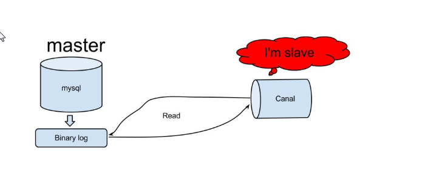
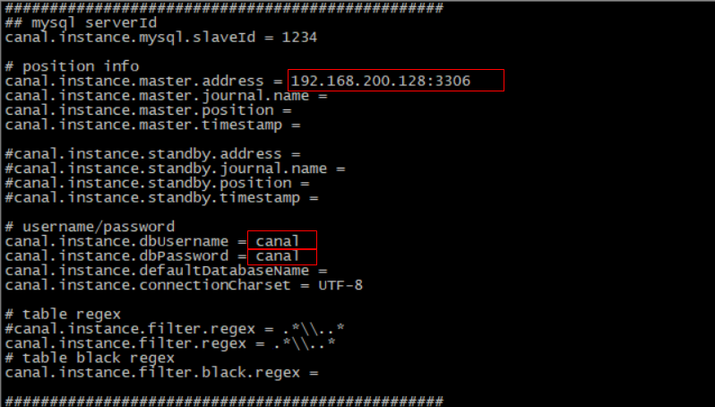
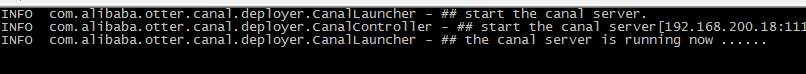
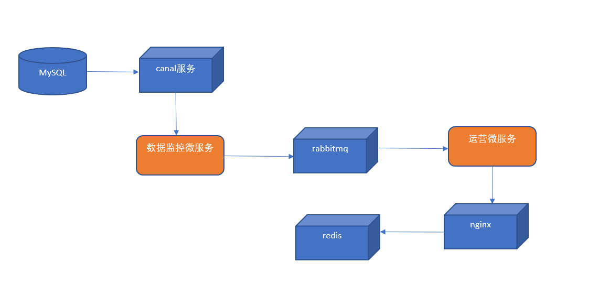
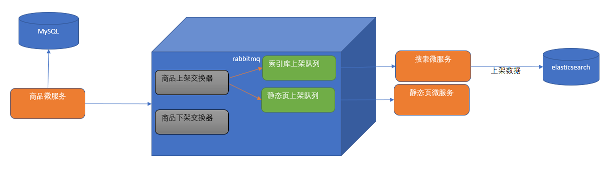
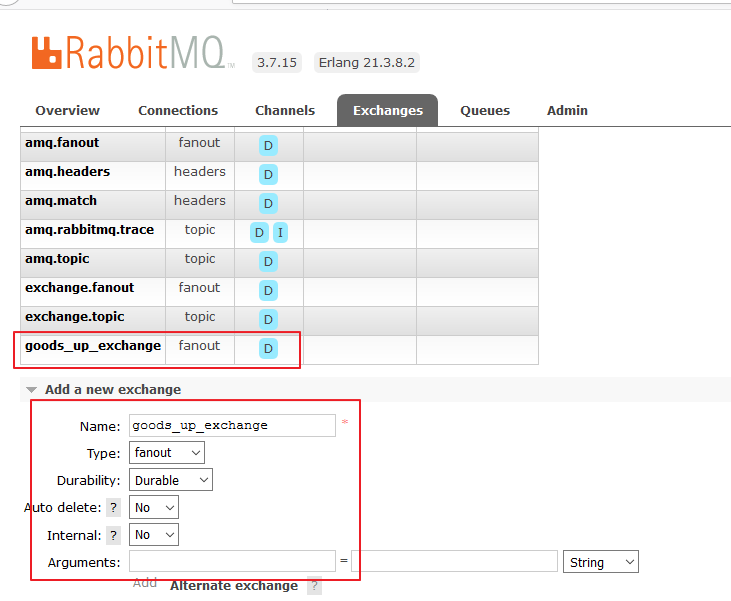
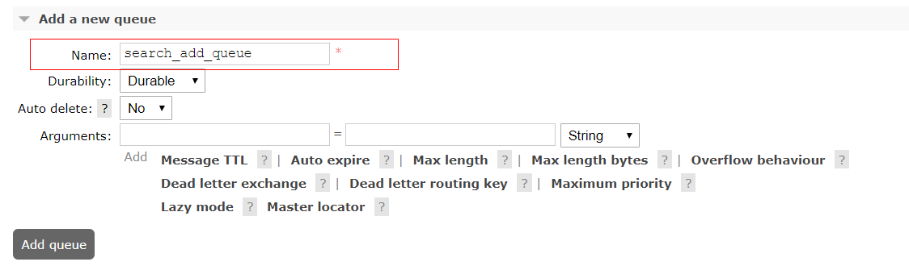
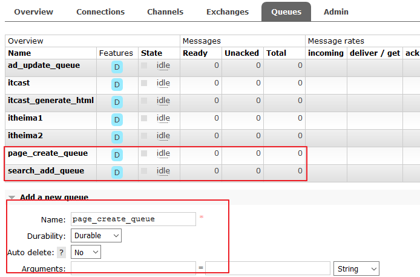
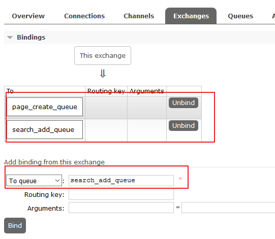
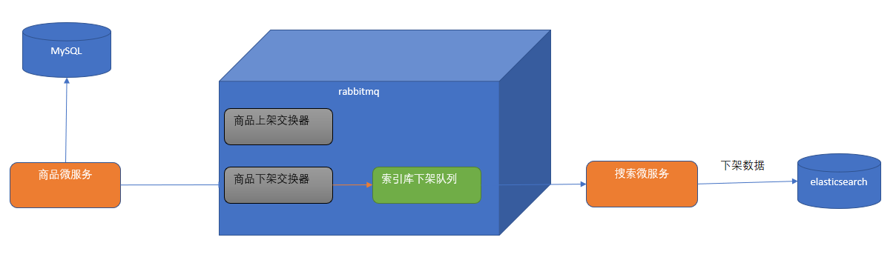

# 第6章 数据同步解决方案-canal

## 学习目标

- 能够完成canal环境的搭建与数据监控微服务的开发
- 能够完成首页广告缓存更新的功能，掌握OkHttpClient的基本使用方法
- 能够完成商品上架索引库导入数据功能，能够画出流程图和说出实现思路
- 能够完成商品下架索引库删除数据功能，能够画出流程图和说出实现思路

## 1. canal 

### 1.1 canal简介

canal可以用来监控数据库数据的变化，从而获得新增数据，或者修改的数据。

canal是应阿里巴巴存在杭州和美国的双机房部署，存在跨机房同步的业务需求而提出的。

阿里系公司开始逐步的尝试基于数据库的日志解析，获取增量变更进行同步，由此衍生出了增量订阅&消费的业务。



原理相对比较简单：

1. canal模拟mysql slave的交互协议，伪装自己为mysql slave，向mysql master发送dump请求
2. mysql master收到dump请求，开始推送binary log给canal
3. canal解析binary log对象(原始为byte流)


### 1.2 环境部署

#### 1.2.1 mysql开启binlog模式

（1）查看当前mysql是否开启binlog模式。

```sql
SHOW VARIABLES LIKE '%log_bin%'
```

如果log_bin的值为OFF是未开启，为ON是已开启。

（2）修改/etc/my.cnf 需要开启binlog模式。

```shell
[mysqld]
log-bin=mysql-bin
binlog-format=ROW
server_id=1
```

修改完成之后，重启mysqld的服务。

  (3) 进入mysql

```sql
mysql -h localhost -u root -p
```

（4）创建账号 用于测试使用

使用root账号创建用户并授予权限

```sql
create user canal@'%' IDENTIFIED by 'canal';
GRANT SELECT, REPLICATION SLAVE, REPLICATION CLIENT,SUPER ON *.* TO 'canal'@'%';
FLUSH PRIVILEGES;
```

#### 1.2.2 canal服务端安装配置

（1）下载地址canal

```url
https://github.com/alibaba/canal/releases/tag/canal-1.0.24
```


（2）下载之后 上传到linux系统中，解压缩到指定的目录/usr/local/canal

解压缩之后的目录结构如下：


（3）修改 exmaple下的实例配置

```shell
vi conf/example/instance.properties
```



修改如图所示的几个参数。

一定要注释掉下面这个参数，这样就会扫描全库

```shell
#canal.instance.defaultDatabaseName =
```

（3）启动服务：

```shell
[root@localhost canal]# ./bin/startup.sh
```

（4）查看日志：

```
cat /usr/local/canal/logs/canal/canal.log
```



这样就表示启动成功了。

#### 1.2.3 canal常见错误处理

错误信息如下: 

```shell
2019-06-17 19:35:20.918 [New I/O server worker #1-2] ERROR c.a.otter.canal.server.netty.handler.SessionHandler - something goes wrong with channel:[id: 0x7f2e9be3, /192.168.200.56:52225 => /192.168.200.128:11111], exception=java.io.IOException: Connection reset by peer
```

解决办法:

进入mysql中执行下面语句查看binlog所在位置

```shell
mysql> show master status;
显示如下:
+------------------+----------+--------------+------------------+-------------------+
| File             | Position | Binlog_Do_DB | Binlog_Ignore_DB | Executed_Gtid_Set |
+------------------+----------+--------------+------------------+-------------------+
| mysql-bin.000001 |      120 |              |                  |                   |
+------------------+----------+--------------+------------------+-------------------+
1 row in set (0.00 sec)
```

如果file中binlog文件不为 mysql-bin.000001 可以重置mysql

```sql
mysql> reset master;
```

查看canal配置文件

```shell
vim usr/local/canal/conf/example/meta.dat
```

找到对应的binlog信息更改一致即可, 或者删除这个meta.dat也可以.

```shell
"journalName":"mysql-bin.000001","position":43581207,"
```

### 1.3 数据监控微服务

当用户执行数据库的操作的时候，binlog 日志会被canal捕获到，并解析出数据。我们就可以将解析出来的数据进行相应的逻辑处理。

我们这里使用的一个开源的项目，它实现了springboot与canal的集成。比原生的canal更加优雅。

https://github.com/chenqian56131/spring-boot-starter-canal  

使用前需要将starter-canal安装到本地仓库。

我们可以参照它提供的canal-test，进行代码实现。

（1）创建工程模块changgou_canal，pom引入依赖

```xml
<dependency>
	<groupId>com.xpand</groupId>
	<artifactId>starter-canal</artifactId>
	<version>0.0.1-SNAPSHOT</version>
</dependency>
```

（2）创建包com.changgou.canal ，包下创建启动类

```java
@SpringBootApplication
@EnableCanalClient
public class CanalApplication {

	public static void main(String[] args) {
		SpringApplication.run(CanalApplication.class, args);
	}
}
```

（3）添加配置文件application.properties

```properties
canal.client.instances.example.host=192.168.200.128
canal.client.instances.example.port=11111
canal.client.instances.example.batchSize=1000
```

（4）创建com.changgou.canal.listener包，包下创建类

```java
@CanalEventListener
public class BusinessListener {

    @ListenPoint(schema = "changgou_business", table = {"tb_ad"})
    public void adUpdate(CanalEntry.EventType eventType, CanalEntry.RowData rowData) {
        System.err.println("广告数据发生变化");
        rowData.getBeforeColumnsList().forEach((c) -> System.err.println("更改前数据: " + c.getName() + " :: " + c.getValue()));
        rowData.getAfterColumnsList().forEach((c) -> System.err.println("更改后数据: " + c.getName() + " :: " + c.getValue()));
    }
}
```

 测试：启动数据监控微服务，修改changgou_business的tb_ad表，观察控制台输出。

## 2. 首页广告缓存更新 

### 2.1 需求分析

当tb_ad（广告）表的数据发生变化时，更新redis中的广告数据。

### 2.2 实现思路

（1）修改数据监控微服务，监控tb_ad表，当发生增删改操作时，提取position值（广告位置key），发送到rabbitmq

（2）从rabbitmq中提取消息，通过OkHttpClient调用ad_update来实现对广告缓存数据的更新。



### 2.3 代码实现

#### 2.3.1 发送消息到mq

（1）在rabbitmq管理后台创建队列 ad_update_queue ，用于接收广告更新通知

（2）引入rabbitmq起步依赖

```xml
<dependency>
	<groupId>org.springframework.amqp</groupId>
	<artifactId>spring-rabbit</artifactId>
</dependency>
```

（3）配置文件application.properties  添加内容

```properties
spring.rabbitmq.host=192.168.200.128
```

（4）修改BusinessListener类

```java
@CanalEventListener
public class BusinessListener {

    @Autowired
    private RabbitTemplate rabbitTemplate;

    @ListenPoint(schema = "changgou_business", table = {"tb_ad"})
    public void adUpdate(CanalEntry.EventType eventType, CanalEntry.RowData rowData) {
        System.err.println("广告数据发生变化");

        //修改前数据
        for(CanalEntry.Column column: rowData.getBeforeColumnsList()) {
            if(column.getName().equals("position")){
                System.out.println("发送消息到mq  ad_update_queue:"+column.getValue());
                rabbitTemplate.convertAndSend("","ad_update_queue",column.getValue());  //发送消息到mq
                break;
            }
        }

        //修改后数据
        for(CanalEntry.Column column: rowData.getAfterColumnsList()) {
            if(column.getName().equals("position")){
                System.out.println("发送消息到mq  ad_update_queue:"+column.getValue());
                rabbitTemplate.convertAndSend("","ad_update_queue",column.getValue());  //发送消息到mq
                break;
            }
        }
    }
}
```

（5）测试，运行数据监控微服务canal，新增、修改或删除tb_ad表数据，修改后观察控制台输出和rabbitmq管理界面中ad_update_queue是否接收到消息


#### 2.3.2 从mq中提取消息执行更新

（1）changgou_service_business工程pom.xml引入依赖

```xml
<dependency>
	<groupId>org.springframework.boot</groupId>
	<artifactId>spring-boot-starter-amqp</artifactId>
</dependency>
<dependency>
	<groupId>com.squareup.okhttp3</groupId>
	<artifactId>okhttp</artifactId>
	<version>3.9.0</version>
</dependency>
```

（2）在spring节点下添加rabbitmq配置

```yaml
spring:
  rabbitmq:
    host: 192.168.200.128
```

（3）com.changgou.business包下创建listener包，包下创建类

```java
@Component
@RabbitListener(queues = "ad_update_queue")
public class AdListener {

    /**
     * 获取更新广告通知
     * @param message
     */
    @RabbitHandler
    public void updateAd(String message){
        System.out.println("接收到消息："+message);
        String url = "http://192.168.200.128/ad_update?position="+message;
        OkHttpClient okHttpClient = new OkHttpClient();
        final Request request = new Request.Builder()
                .url(url)
                .build();
        Call call = okHttpClient.newCall(request);
        call.enqueue(new Callback() {
            @Override
            public void onFailure(Call call, IOException e) {
                e.printStackTrace();//显示错误信息
            }
            @Override
            public void onResponse(Call call, Response response) throws IOException {
                System.out.println("调用成功"+response.message());
            }
        });
    }
}
```

（4）测试，启动eureka和business微服务，观察控制台输出和数据同步效果。

## 3. 商品上架索引库导入数据

### 3.1 需求分析

商品上架将商品的sku列表导入或更新索引库。

### 3.2 实现思路

（1）当调用商品微服务中商品上架方法时候, 则商品微服务连接mysql数据库根据SPU的主键ID更改SPU表中is_marketable状态字段的值为1(已上架).

（2）在rabbitmq管理后台创建商品上架交换器（Exchanges）。使用分列模式(fanout)的交换器是考虑商品上架会有很多种逻辑需要处理，导入索引库只是其中一项，另外还有商品详细页静态化等操作。这样我们可以创建导入索引库的队列和商品详细页静态化队列并与商品上架交换器进行绑定。

（3）商品微服务将需要上架的SPU的主键ID发送给rabbitMq的商品上架交换器, 交换器则将数据根据路由规则发给对应的索引库上架队列和静态页上架队列.

  (4)  搜索微服务从rabbitmq的索引库上架队列中提取spu的id，通过feign调用商品微服务得到sku的列表，并且通过调用elasticsearch的高级restAPI 将sku列表导入到索引库。

  (5) 静态页微服务从rabbitmq的静态页上架队列中提取SPU的id, 通过feign调用商品微服务得到sku, 分类, 品牌, spu等各种数据信息, 然后根据模板生成静态化页面.



### 3.3 代码实现

#### 3.3.1 配置rabbitMQ

（1）在rabbitmq后台创建交换器goods_up_exchange（类型为fanout），创建队列search_add_queue绑定交换器goods_up_exchange

**a. 添加交换器**



**b. 添加搜索上架队列**



**c. 添加静态页上架队列**



**d. 交换器中绑定搜索上架队列和静态页上架队列**



#### 3.3.2 发送上架商品id到Mq

(1)  changgou_service_goods工程引入依赖:

```xml
<dependency>
    <groupId>org.springframework.boot</groupId>
    <artifactId>spring-boot-starter-amqp</artifactId>
</dependency>
```

(2) changgou_service_goods工程的application.yml中添加rabbitmq配置

```yaml
spring:
  rabbitmq:
    host: 192.168.200.128
```

  (3)  changgou_service_goods工程的SpuServiceImpl中更改方法

```java
@Autowired
private RabbitMessagingTemplate rabbitTemplate;

@Override
public void put(String id) {
    /**
      * 1. 更改数据库中的上架状态
      */
    Spu spu = spuMapper.selectByPrimaryKey(id);
    if(!spu.getStatus().equals("1")){
        throw new RuntimeException("未通过审核的商品不能上架！");
    }
    spu.setIsMarketable("1");//上架状态
    spuMapper.updateByPrimaryKeySelective(spu);

    /**
      * 2. 将数据发送到rabbitmq中
      */
    rabbitTemplate.convertAndSend("goods_up_exchange","",id);
}

```


#### 3.3.3 索引库环境准备

（1）elasticsearch 6.5.2安装

（2）ik中文分词器安装

（3）kibana-6.5.2 安装


#### 3.3.4 搜索微服务搭建

（1）创建changgou_service_search模块，pom.xml引入依赖

```xml
<dependency>
    <groupId>com.changgou</groupId>
    <artifactId>changgou_common</artifactId>
    <version>1.0-SNAPSHOT</version>
</dependency>
<dependency>
    <groupId>org.springframework.cloud</groupId>
    <artifactId>spring-cloud-starter-netflix-eureka-client</artifactId>
</dependency>
<dependency>
    <groupId>org.springframework.boot</groupId>
    <artifactId>spring-boot-starter-data-elasticsearch</artifactId>
</dependency>
<dependency>
    <groupId>com.changgou</groupId>
    <artifactId>changgou_service_goods_api</artifactId>
    <version>1.0-SNAPSHOT</version>
</dependency>
<dependency>
    <groupId>com.changgou</groupId>
    <artifactId>changgou_service_search_api</artifactId>
    <version>1.0-SNAPSHOT</version>
</dependency>
<dependency>
    <groupId>org.springframework.boot</groupId>
    <artifactId>spring-boot-starter-amqp</artifactId>
</dependency>
```

（2）changgou_service_search的application.yml

```yaml
server:
  port: 9009
spring:
  application:
    name: search
  rabbitmq:
    host: 192.168.200.128
  redis:
    host: 192.168.200.128
  main:
    allow-bean-definition-overriding: true #当遇到同样名字的时候，是否允许覆盖注册
  data:
    elasticsearch:
      cluster-name: elasticsearch
      cluster-nodes: 192.168.200.128:9300
eureka:
  client:
    service-url:
      defaultZone: http://127.0.0.1:6868/eureka
  instance:
    prefer-ip-address: true
feign:
  hystrix:
    enabled: true
  client:
    config:
      default:   #配置全局的feign的调用超时时间  如果 有指定的服务配置 默认的配置不会生效
        connectTimeout: 600000 # 指定的是 消费者 连接服务提供者的连接超时时间 是否能连接  单位是毫秒
        readTimeout: 600000  # 指定的是调用服务提供者的 服务 的超时时间（）  单位是毫秒
#hystrix 配置
hystrix:
  command:
    default:
      execution:
        timeout:
          #如果enabled设置为false，则请求超时交给ribbon控制
          enabled: false
        isolation:
          strategy: SEMAPHORE
```

elasticSearch的配置是我们自己定义的，后边的连接工厂类会用到

（3）创建com.changgou包，包下创建SearchApplication

```java
@SpringBootApplication
@EnableEurekaClient
@EnableDiscoveryClient
@EnableFeignClients(basePackages = "com.itheima.feign")
public class SearchApplication {

    public static void main(String[] args) {
        SpringApplication.run(SearchApplication.class);
    }
}
```

#### 3.3.5 创建索引库结构

1. 在changgou_service_api项目下创建changgou_service_search_api项目
2. pom.xml文件引入依赖

```xml
<dependency>
    <groupId>com.changgou</groupId>
    <artifactId>changgou_common</artifactId>
    <version>1.0-SNAPSHOT</version>
</dependency>
<dependency>
    <groupId>org.springframework.boot</groupId>
    <artifactId>spring-boot-starter-data-elasticsearch</artifactId>
</dependency>
```


1. 创建包com.changgou.pojo
2. 创建和ES索引库映射实体类SkuInfo.java

```java
@Document(indexName = "skuinfo", type = "docs")
public class SkuInfo implements Serializable {
    //商品id，同时也是商品编号
    @Id
    @Field(index = true, store = true, type = FieldType.Keyword)
    private Long id;

    //SKU名称
    @Field(index = true, store = true, type = FieldType.Text, analyzer = "ik_smart")
    private String name;

    //商品价格，单位为：元
    @Field(index = true, store = true, type = FieldType.Double)
    private Long price;

    //库存数量
    @Field(index = true, store = true, type = FieldType.Integer)
    private Integer num;

    //商品图片
    @Field(index = false, store = true, type = FieldType.Text)
    private String image;

    //商品状态，1-正常，2-下架，3-删除
    @Field(index = true, store = true, type = FieldType.Keyword)
    private String status;

    //创建时间
    private Date createTime;

    //更新时间
    private Date updateTime;

    //是否默认
    @Field(index = true, store = true, type = FieldType.Keyword)
    private String isDefault;

    //SPUID
    @Field(index = true, store = true, type = FieldType.Long)
    private Long spuId;

    //类目ID
    @Field(index = true, store = true, type = FieldType.Long)
    private Long categoryId;

    //类目名称
    @Field(index = true, store = true,type = FieldType.Keyword)
    private String categoryName;

    //品牌名称
    @Field(index = true, store = true,type = FieldType.Keyword)
    private String brandName;

    //规格
    private String spec;

    //规格参数
    private Map<String, Object> specMap;
    
    ......get和set方法......
```


#### 3.3.6 创建ES操作的Dao接口

```java
public interface SearchMapper extends ElasticsearchRepository<SkuInfo,Long> {

}
```


#### 3.3.7 搜索微服务批量导入数据逻辑

  (1) changgou_service_goods_api创建com.changgou.feign 包，包下创建接口

```java
@FeignClient(name="goods")
@RequestMapping("/sku")
public interface SkuFeign {

    /***
     * 多条件搜索品牌数据
     * @param searchMap
     * @return
     */
    @GetMapping(value = "/search" )
    public Result findList(@RequestParam Map searchMap);

}
```

（2）changgou_service_search项目下创建 com.changgou.search.service包包下创建接口EsManagerService

```java
public interface EsManagerService {

    /**
     * 创建索引库结构
     */
    public void createIndexAndMapping();

    /**
     * 根据spuid导入数据到ES索引库
     * @param spuId 商品id
     */
    public void importDataToESBySpuId(String spuId);

    /**
     * 导入全部数据到ES索引库
     */
    public void importAll();

}
```

（2）创建com.changgou.search.service包，包下创建服务实现类

```java
@Service
public class EsManagerServiceImpl implements EsManagerService {

    @Autowired
    private SearchMapper searchMapper;

    @Autowired
    private SkuFeign skuFeign;

    @Autowired
    private ElasticsearchTemplate esTemplate;


    /**
     * 创建索引库结构
     */
    @Override
    public void createIndexAndMapping() {
        //创建索引
        esTemplate.createIndex(SkuInfo.class);
        //创建映射
        esTemplate.putMapping(SkuInfo.class);
    }

    /**
     * 根据spuid导入数据到ES索引库
     * @param spuId 商品id
     */
    @Override
    public void importDataToESBySpuId(String spuId) {
        List<Sku> skuList = skuFeign.findSkuListBySpuId(spuId);
        List<SkuInfo> skuInfos = JSON.parseArray(JSON.toJSONString(skuList), SkuInfo.class);

        for (SkuInfo skuInfo : skuInfos) {
            skuInfo.setSpecMap(JSON.parseObject(skuInfo.getSpec(), Map.class));
        }


        searchMapper.saveAll(skuInfos);
    }

    /**
     * 导入全部数据到ES索引库
     */
    @Override
    public void importAll() {
        Map paramMap = new HashMap();
        paramMap.put("status", "1");
        Result result = skuFeign.findList(paramMap);
        List<SkuInfo> skuInfos = JSON.parseArray(JSON.toJSONString(result.getData()), SkuInfo.class);
        for (SkuInfo skuInfo : skuInfos) {
            skuInfo.setPrice(skuInfo.getPrice());
            skuInfo.setSpecMap(JSON.parseObject(skuInfo.getSpec(), Map.class));
        }
        searchMapper.saveAll(skuInfos);
    }
}
```


#### 3.3.8 根据spuId导入索引库数据 

（1）changgou_service_search项目下, 创建com.changgou.controller包, 包下创建SearchController

```java
@RestController
@RequestMapping("/sku_search")
public class SearchController {

    @Autowired
    private EsManagerService esManagerService;

    @Autowired
    private SearchService searchService;

    @GetMapping("/createIndexAndMapping")
    public Result createIndexAndMapping() {
        esManagerService.createIndexAndMapping();
        return new Result(true, StatusCode.OK, "创建成功");
    }


    /**
     * 导入所有审核通过的库存数据到ES索引库
     * @return
     */
    @GetMapping("/importAll")
    public Result importAllDataToES() {
        esManagerService.importAll();
        return new Result(true, StatusCode.OK, "导入数据成功!");
    }

    /**
     * 全文检索
     * @return
     */
    @GetMapping
    public Map search(@RequestParam Map<String, String> paramMap) throws Exception {
        Map resultMap = searchService.search(paramMap);
        return resultMap;
    }
}
```


#### 3.3.9 接收mq消息执行导入

（1）changgou_service_search工程的pom.xml文件中引入依赖包

```xml
<dependency>
     <groupId>org.springframework.boot</groupId>
     <artifactId>spring-boot-starter-amqp</artifactId>
</dependency>
```

（2）changgou_service_search工程创建com.changgou.listener包，包下创建类

```java
@Component
@RabbitListener(queues = "search_add_queue")
public class SpuAddListener {

    @Autowired
    private EsManagerService esManagerService;

    @RabbitHandler
    public void addDataToES(String spuId) {
        System.out.println("===接收到需要商品上架的spuId为======" + spuId);
        esManagerService.importDataToESBySpuId(spuId);
    }
}
```

测试：

注意: 测试前将ES中现有的SkuInfo索引库删除干净

（1）启动环境  eureka  、elasticsearch 、canal服务端、canal数据监控微服务、rabbitmq 

（2）启动商品微服务、搜索微服务

（3）先访问 http://localhost:9009/sku_search/createIndexAndMapping 创建索引库结构

  ( 4 )  修改tb_spu某记录的is_marketable值为1，观察控制台输出，启动kibana查询记录是否导入成功


## 4. 商品下架索引库删除数据

### 4.1 需求分析 

商品下架后将商品从索引库中移除。 

### 4.2 实现思路 

与商品上架的实现思路非常类似。

（1）当管理员操作商品微服务, 调用下架操作时, 首先更新mysql的SPU表中的is_marketable状态为0(下架)。

（2）在rabbitmq管理后台创建商品下架交换器（Exchanges）。使用分列模式(Fanout)的交换器是考虑商品下架会有很多种逻辑需要处理，索引库删除数据只是其中一项，另外还有删除商品详细页等操作。

（3）搜索微服务从rabbitmq的的队列中提取spu的id，通过调用elasticsearch的高级restAPI 将相关的sku列表从索引库删除。




### 4.3 代码实现（作业） 

根据上边讲解的实现思路完成商品下架索引库删除数据的功能

（1）完成商品下架交换器的创建，队列的创建与绑定，将spuId发送消息到mq

（2）编写业务逻辑，实现根据spuId删除索引库数据的方法

（3）从rabbitmq中提取消息，调动根据spuId删除索引库数据的方法