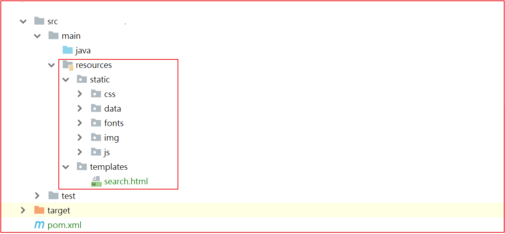

# 第7章 Thymeleaf、Rabbitmq实现静态页

# 学习目标

+ Thymeleaf的介绍
+ Thymeleaf的入门
+ Thymeleaf的语法及标签
+ 商品详情页静态化工程搭建
+ 商品详情页静态化功能实现
+ 搜索页面渲染


## 1.Thymeleaf介绍

​	thymeleaf是一个XML/XHTML/HTML5模板引擎，可用于Web与非Web环境中的应用开发。它是一个开源的Java库，基于Apache License 2.0许可，由Daniel Fernández创建，该作者还是Java加密库Jasypt的作者。

Thymeleaf提供了一个用于整合Spring MVC的可选模块，在应用开发中，你可以使用Thymeleaf来完全代替JSP或其他模板引擎，如Velocity、FreeMarker等。Thymeleaf的主要目标在于提供一种可被浏览器正确显示的、格式良好的模板创建方式，因此也可以用作静态建模。你可以使用它创建经过验证的XML与HTML模板。相对于编写逻辑或代码，开发者只需将标签属性添加到模板中即可。接下来，这些标签属性就会在DOM（文档对象模型）上执行预先制定好的逻辑。


它的特点便是：开箱即用，Thymeleaf允许您处理六种模板，每种模板称为模板模式：

- XML
- 有效的XML
- XHTML
- 有效的XHTML
- HTML5
- 旧版HTML5

所有这些模式都指的是格式良好的XML文件，但*Legacy HTML5*模式除外，它允许您处理HTML5文件，其中包含独立（非关闭）标记，没有值的标记属性或不在引号之间写入的标记属性。为了在这种特定模式下处理文件，Thymeleaf将首先执行转换，将您的文件转换为格式良好的XML文件，这些文件仍然是完全有效的HTML5（实际上是创建HTML5代码的推荐方法）[1](https://www.thymeleaf.org/doc/tutorials/2.1/usingthymeleaf.html#fn1)。

另请注意，验证仅适用于XML和XHTML模板。

然而，这些并不是Thymeleaf可以处理的唯一模板类型，并且用户始终能够通过指定在此模式下*解析*模板的方法和*编写*结果的方式来定义他/她自己的模式。这样，任何可以建模为DOM树（无论是否为XML）的东西都可以被Thymeleaf有效地作为模板处理。


## 2.Springboot整合thymeleaf

使用springboot 来集成使用Thymeleaf可以大大减少单纯使用thymleaf的代码量，所以我们接下来使用springboot集成使用thymeleaf.

实现的步骤为：

+ 创建一个sprinboot项目
+ 添加thymeleaf的起步依赖
+ 添加spring web的起步依赖
+ 编写html 使用thymleaf的语法获取变量对应后台传递的值
+ 编写controller 设置变量的值到model中


(1)创建工程

创建一个独立的工程springboot-thymeleaf,该工程为案例工程，不需要放到changgou工程中。

**pom.xml依赖**

```xml
<?xml version="1.0" encoding="UTF-8"?>
<project xmlns="http://maven.apache.org/POM/4.0.0"
         xmlns:xsi="http://www.w3.org/2001/XMLSchema-instance"
         xsi:schemaLocation="http://maven.apache.org/POM/4.0.0 http://maven.apache.org/xsd/maven-4.0.0.xsd">
    <modelVersion>4.0.0</modelVersion>

    <groupId>com.itheima</groupId>
    <artifactId>springboot-thymeleaf</artifactId>
    <version>1.0-SNAPSHOT</version>

    <parent>
        <groupId>org.springframework.boot</groupId>
        <artifactId>spring-boot-starter-parent</artifactId>
        <version>2.1.4.RELEASE</version>
    </parent>

    <dependencies>
        <!--web起步依赖-->
        <dependency>
            <groupId>org.springframework.boot</groupId>
            <artifactId>spring-boot-starter-web</artifactId>
        </dependency>

        <!--thymeleaf配置-->
        <dependency>
            <groupId>org.springframework.boot</groupId>
            <artifactId>spring-boot-starter-thymeleaf</artifactId>
        </dependency>
    </dependencies>
</project>
```


(2)创建html

在resources中创建templates目录，在templates目录创建 demo1.html,代码如下：

```html
<!DOCTYPE html>
<html xmlns:th="http://www.thymeleaf.org">
<head>
    <title>Thymeleaf的入门</title>
    <meta http-equiv="Content-Type" content="text/html; charset=UTF-8"/>
</head>
<body>
<!--输出hello数据-->
<p th:text="${hello}"></p>
</body>
</html>
```

解释：

`<html xmlns:th="http://www.thymeleaf.org">`:这句声明使用thymeleaf标签

`<p th:text="${hello}"></p>`:这句使用 th:text="${变量名}" 表示 使用thymeleaf获取文本数据，类似于EL表达式。


(3)修改application.yml配置

创建application.yml,并设置thymeleaf的缓存设置，设置为false。默认加缓存的，用于测试。

```yaml
spring:
  thymeleaf:
    cache: false
```


(4)控制层

创建controller用于测试后台 设置数据到model中。

创建com.itheima.controller.TestController，代码如下：

```java
@Controller
@RequestMapping("/test")
public class TestController {

    /***
     * 访问/test/hello  跳转到demo1页面
     * @param model
     * @return
     */
    @RequestMapping("/hello")
    public String hello(Model model){
        model.addAttribute("hello","hello welcome");
        return "demo1";
    }
}
```


(5)测试

启动系统，并在浏览器访问

```
http://localhost:8080/test/hello
```


## 3 Thymeleaf基本语法

(1)th:action

定义后台控制器路径，类似`<form>`标签的action属性。 

例如：

```html
<form th:action="@{/test/hello}" >
    <input th:type="text"  th:name="id">
    <button>提交</button>
</form>
```


(2)th:each

对象遍历，功能类似jstl中的`<c:forEach>`标签。 

创建com.itheima.model.User,代码如下：

```java
public class User {
    private Integer id;
    private String name;
    private String address;
    //..get..set
}
```


Controller添加数据

```java
/***
 * 访问/test/hello  跳转到demo1页面
 * @param model
 * @return
 */
@RequestMapping("/hello")
public String hello(Model model){
    model.addAttribute("hello","hello welcome");

    //集合数据
    List<User> users = new ArrayList<User>();
    users.add(new User(1,"张三","深圳"));
    users.add(new User(2,"李四","北京"));
    users.add(new User(3,"王五","武汉"));
    model.addAttribute("users",users);
    return "demo1";
}
```


页面输出

```html
<table>
    <tr>
        <td>下标</td>
        <td>编号</td>
        <td>姓名</td>
        <td>住址</td>
    </tr>
    <tr th:each="user,userStat:${users}">
        <td>
            下标:<span th:text="${userStat.index}"></span>,
        </td>
        <td th:text="${user.id}"></td>
        <td th:text="${user.name}"></td>
        <td th:text="${user.address}"></td>
    </tr>
</table>
```


测试效果


(3)Map输出

后台添加Map

```java
//Map定义
Map<String,Object> dataMap = new HashMap<String,Object>();
dataMap.put("No","123");
dataMap.put("address","深圳");
model.addAttribute("dataMap",dataMap);
```


页面输出

```html
<div th:each="map,mapStat:${dataMap}">
    <div th:text="${map}"></div>
    key:<span th:text="${mapStat.current.key}"></span><br/>
    value:<span th:text="${mapStat.current.value}"></span><br/>
    ==============================================
</div>
```


测试效果


(4)数组输出

后台添加数组

```java
//存储一个数组
String[] names = {"张三","李四","王五"};
model.addAttribute("names",names);
```

页面输出

```html
<div th:each="nm,nmStat:${names}">
    <span th:text="${nmStat.count}"></span><span th:text="${nm}"></span>
    ==============================================
</div>
```


测试效果


(5)Date输出

后台添加日期

```java
//日期
model.addAttribute("now",new Date());
```

页面输出

```php+HTML
<div>
    <span th:text="${#dates.format(now,'yyyy-MM-dd hh:ss:mm')}"></span>
</div>
```


测试效果


(6)th:if条件

后台添加年龄

```java
//if条件
model.addAttribute("age",22);
```


页面输出

```html
<div>
    <span th:if="${(age>=18)}">终于长大了！</span>
</div>
```


测试效果


(7)th:fragment 定义一个模块

可以定义一个独立的模块，创建一个footer.html代码如下：

```html
<!DOCTYPE html>
<html xmlns:th="http://www.thymeleaf.org">
<head>
    <meta http-equiv="Content-Type" content="text/html;charset=charset=utf-8">
    <title>fragment</title>
</head>
<body>
<div id="C" th:fragment="copy" >
    关于我们<br/>
</div>
</body>
```


(8)th:include

可以直接引入`th:fragment`,在demo1.html中引入如下代码：

```html
<div id="A" th:include="footer::copy"></div>
```


效果如下：


## 4 搜索页面渲染

### 4.1 搜索分析


搜索页面要显示的内容主要分为3块。

1)搜索的数据结果

2)筛选出的数据搜索条件

3)用户已经勾选的数据条件


### 4.2 搜索实现


搜索的业务流程如上图，用户每次搜索的时候，先经过搜索业务工程，搜索业务工程调用搜索微服务工程。


#### 4.2.1 搜索工程搭建

(1)工程创建

在changgou-service_search工程中的pom.xml中引入如下依赖：

```xml
<dependencies>
    <dependency>
        <groupId>com.changgou</groupId>
        <artifactId>changgou_common</artifactId>
        <version>1.0-SNAPSHOT</version>
    </dependency>
    <dependency>
        <groupId>org.springframework.cloud</groupId>
        <artifactId>spring-cloud-starter-netflix-eureka-client</artifactId>
    </dependency>
    <dependency>
        <groupId>org.springframework.boot</groupId>
        <artifactId>spring-boot-starter-data-elasticsearch</artifactId>
    </dependency>
    <dependency>
        <groupId>com.changgou</groupId>
        <artifactId>changgou_service_goods_api</artifactId>
        <version>1.0-SNAPSHOT</version>
    </dependency>
    <dependency>
        <groupId>com.changgou</groupId>
        <artifactId>changgou_service_search_api</artifactId>
        <version>1.0-SNAPSHOT</version>
    </dependency>
    <dependency>
        <groupId>org.springframework.boot</groupId>
        <artifactId>spring-boot-starter-amqp</artifactId>
    </dependency>
    <dependency>
        <groupId>org.springframework.boot</groupId>
        <artifactId>spring-boot-starter-thymeleaf</artifactId>
    </dependency>
</dependencies>
```


(2)静态资源导入

将资源中的`成品页面/搜索页面/所有内容`拷贝到工程的`resources`目录下如下图：




(3)changgou-service-search创建SearchPageController

代码如下：

```java
@Controller
@RequestMapping("/search")
public class SearchPageController {

    @Autowired
    private SearchService searchService;

    //对搜索入参带有特殊符号进行处理
    public void handlerSearchMap(Map<String,String> searchMap){

        if(null != searchMap){
            Set<Map.Entry<String, String>> entries = searchMap.entrySet();
            for (Map.Entry<String, String> entry : entries) {
                if(entry.getKey().startsWith("spec_")){
                    searchMap.put(entry.getKey(),entry.getValue().replace("+","%2B"));
                }
            }
        }

    }

    //搜索页面   http://localhost:9009/search/list?keywords=手机&brand=三星&spec_颜色=粉色&
    //入参：Map
    //返回值 Map
    //由于页面是thymeleaf 完成的 属于服务器内页面渲染 跳转页面
    @GetMapping("/list")
    public String search(@RequestParam Map<String, String> searchMap, Model model) throws Exception {

        //特殊符号处理
        handlerSearchMap(searchMap);

        //执行查询返回值
        Map<String, Object> resultMap = searchService.search(searchMap);


        model.addAttribute("searchMap", searchMap);
        model.addAttribute("result", resultMap);
        Page<SkuInfo> page = new Page<SkuInfo>(
                Long.parseLong(resultMap.get("total").toString()),
                Integer.parseInt(resultMap.get("pageNum").toString()),
                Page.pageSize);
        model.addAttribute("page", page);

        StringBuilder url = new StringBuilder();


        url.append("/search/list");
        if (null != searchMap && searchMap.size() > 0) {
            url.append("?");
            Set<Map.Entry<String, String>> entries = searchMap.entrySet();
            for (Map.Entry<String, String> entry : entries) {
                if (!"pageNum".equals(entry.getKey()) && !"sortRule".equals(entry.getKey())
                        && !"sortField".equals(entry.getKey())) {
                    url.append("&").append(entry.getKey()).append("=").append(entry.getValue());
                }
            }
        }
        model.addAttribute("url", url.toString());
        System.out.println(url.toString());


        return "search";
    }

}
```


(4)application.yml配置文件

```properties
server:
  port: 9009
spring:
  application:
    name: search
  rabbitmq:
    host: 192.168.200.128
  redis:
    host: 192.168.200.128
  main:
    allow-bean-definition-overriding: true #当遇到同样名字的时候，是否允许覆盖注册
  thymeleaf:
    cache: false
  data:
    elasticsearch:
      cluster-name: elasticsearch
      cluster-nodes: 192.168.200.128:9300
eureka:
  client:
    service-url:
      defaultZone: http://127.0.0.1:6868/eureka
  instance:
    prefer-ip-address: true
feign:
  hystrix:
    enabled: true
  client:
    config:
      default:   #配置全局的feign的调用超时时间  如果 有指定的服务配置 默认的配置不会生效
        connectTimeout: 600000 # 指定的是 消费者 连接服务提供者的连接超时时间 是否能连接  单位是毫秒
        readTimeout: 600000  # 指定的是调用服务提供者的 服务 的超时时间（）  单位是毫秒
#hystrix 配置
hystrix:
  command:
    default:
      execution:
        timeout:
          #如果enabled设置为false，则请求超时交给ribbon控制
          enabled: false
        isolation:
          strategy: SEMAPHORE
```


测试：`http://localhost:9009/search`,效果如下：


#### 4.2.2 搜索数据填充

后端搜索到数据后，前端页面进行数据显示，显示的数据分为3部分

```properties
1)搜索的数据结果
2)筛选出的数据搜索条件
3)用户已经勾选的数据条件
```


#### 4.2.3 关键字搜索

用户每次输入关键字的时候，直接根据关键字搜索，关键字搜索的数据会存储到`result.rows`中，页面每次根据result获取rows，然后循环输出即可,同时页面的搜索框每次需要回显搜索的关键词。

实现思路

```properties
1.前端表单提交搜索的关键词
2.后端根据关键词进行搜索
3.将搜索条件存储到Model中
4.页面循环迭代输出数据
5.搜索表单回显搜索的关键词
```


(1)后台搜索实现

修改SkuController的search方法，代码如下：

```java
/**
 * 搜索
 * @param searchMap
 * @return
 */
@GetMapping(value = "/list")
public String search(@RequestParam(required = false) Map<String,String> searchMap, Model model){
    //调用changgou-service-search微服务
    Map<String,Object> resultMap = skuFeign.search(searchMap);
    //搜索数据结果
    model.addAttribute("result",resultMap);
    //搜索条件
    model.addAttribute("searchMap",searchMap);
    return "search";
}
```


(2)页面搜索实现

修改search.html


(3)页面结果输出

修改search.html，代码如下：


(4)测试

搜索`华为`关键字,效果如下：


### 4.3 搜索条件回显


搜索条件除了关键字外，还有分类、品牌、以及规格，这些在我们前面已经将数据存入到了缓存中，我们可以直接从缓存中将数据取出，然后在页面输出即可。

品牌缓存：`result.brandList`

规格缓存：`result.specList`


修改search.html的条件显示部分，代码如下：


上图代码如下：

```html
<!--selector-->
<div class="clearfix selector">
    <div class="type-wrap" th:if="${#maps.containsKey(result, 'categoryList')}">
        <div class="fl key">分类</div>
        <div class="fl value">
            <span th:each="category,categoryStat:${result.categoryList}">
                <a th:text="${category}"></a>&nbsp;&nbsp;
            </span>
        </div>
        <div class="fl ext"></div>
    </div>
    <div class="type-wrap logo" th:if="${#maps.containsKey(result, 'brandList')}">
        <div class="fl key brand">品牌</div>
        <div class="value logos">
            <ul class="logo-list">
                <li th:each="brand,brandStat:${result.brandList}">
                    <a th:text="${brand}"></a>
                </li>
            </ul>
        </div>
        <div class="ext">
            <a href="javascript:void(0);" class="sui-btn">多选</a>
            <a href="javascript:void(0);">更多</a>
        </div>
    </div>
    <div class="type-wrap" th:each="spec,specStat:${result.specList}" th:unless="${#maps.containsKey(searchMap, 'spec_'+spec.key)}">
        <div class="fl key" th:text="${spec.key}"></div>
        <div class="fl value">
            <ul class="type-list">
                <li th:each="op,opStat:${spec.value}">
                    <a th:text="${op}"></a>
                </li>
            </ul>
        </div>
        <div class="fl ext"></div>
    </div>

    <div class="type-wrap" th:unless="${#maps.containsKey(searchMap, 'price')}">
        <div class="fl key">价格</div>
        <div class="fl value">
            <ul class="type-list">
                <li>
                    <a th:text="0-500元"></a>
                </li>
                <li>
                    <a th:text="500-1000元"></a>
                </li>
                <li>
                    <a th:text="1000-1500元"></a>
                </li>
                <li>
                    <a th:text="1500-2000元"></a>
                </li>
                <li>
                    <a th:text="2000-3000元"></a>
                </li>
                <li>
                    <a th:text="3000元以上"></a>
                </li>
            </ul>
        </div>
        <div class="fl ext">
        </div>
    </div>
    <div class="type-wrap">
        <div class="fl key">更多筛选项</div>
        <div class="fl value">
            <ul class="type-list">
                <li>
                    <a>特点</a>
                </li>
                <li>
                    <a>系统</a>
                </li>
                <li>
                    <a>手机内存 </a>
                </li>
                <li>
                    <a>单卡双卡</a>
                </li>
                <li>
                    <a>其他</a>
                </li>
            </ul>
        </div>
        <div class="fl ext">
        </div>
    </div>
</div>
```


### 4.4 条件搜索实现


用户每次点击搜索的时候，其实在上次搜索的基础之上加上了新的搜索条件，也就是在上一次请求的URL后面追加了新的搜索条件，我们可以在后台每次拼接组装出上次搜索的URL，然后每次将URL存入到Model中，页面每次点击不同条件的时候，从Model中取出上次请求的URL，然后再加上新点击的条件参数实现跳转即可。


(1)后台记录搜索URL

修改SkuController，添加组装URL的方法，并将组装好的URL存储起来,代码如下：


(2)页面搜索对接


### 4.5 移除搜索条件


如上图，用户点击条件搜索后，要将选中的条件显示出来，并提供移除条件的`x`按钮,显示条件我们可以从searchMap中获取，移除其实就是将之前的请求地址中的指定条件删除即可。


(1)条件显示

修改search.html，代码如下：


(2)移除搜素条件

修改search.html，移除分类、品牌、价格、规格搜索条件，代码如下：


### 4.6 排序


上图代码是排序代码，需要2个属性，`sortRule`:排序规则，ASC或者DESC，`sortField`:排序的域，前端每次只需要将这2个域的值传入到后台即可实现排序。


(1)后台组装排序URL

每次排序的时候恢复第1页查询，所以url地址我们需要重新拼接,每次切换排序的时候，不需要之前的排序信息，修改SkuController，组装sortURL，代码如下：


(2)前端排序实现

修改search.html，实现排序，代码如下：


这一块我们实现了价格排序，同学们课后去实现以下销量和新品排序。


### 4.7 分页

真实的分页应该像百度那样，如下图：


(1)分页工具类定义

在comm工程中添加Page分页对象，代码如下：

```java
public class Page <T> implements Serializable{

	// 页数（第几页）
	private long currentpage;

	// 查询数据库里面对应的数据有多少条
	private long total;// 从数据库查处的总记录数

	// 每页查5条
	private int size;

	// 下页
	private int next;
	
	private List<T> list;

	// 最后一页
	private int last;
	
	private int lpage;
	
	private int rpage;
	
	//从哪条开始查
	private long start;
	
	//全局偏移量
	public int offsize = 2;
	
	public Page() {
		super();
	}

	/****
	 *
	 * @param currentpage
	 * @param total
	 * @param pagesize
	 */
	public void setCurrentpage(long currentpage,long total,long pagesize) {
		//可以整除的情况下
		long pagecount =  total/pagesize;

		//如果整除表示正好分N页，如果不能整除在N页的基础上+1页
		int totalPages = (int) (total%pagesize==0? total/pagesize : (total/pagesize)+1);

		//总页数
		this.last = totalPages;

		//判断当前页是否越界,如果越界，我们就查最后一页
		if(currentpage>totalPages){
			this.currentpage = totalPages;
		}else{
			this.currentpage=currentpage;
		}

		//计算start
		this.start = (this.currentpage-1)*pagesize;
	}

	//上一页
	public long getUpper() {
		return currentpage>1? currentpage-1: currentpage;
	}

	//总共有多少页，即末页
	public void setLast(int last) {
		this.last = (int) (total%size==0? total/size : (total/size)+1);
	}

	/****
	 * 带有偏移量设置的分页
	 * @param total
	 * @param currentpage
	 * @param pagesize
	 * @param offsize
	 */
	public Page(long total,int currentpage,int pagesize,int offsize) {
		this.offsize = offsize;
		initPage(total, currentpage, pagesize);
	}

	/****
	 *
	 * @param total   总记录数
	 * @param currentpage	当前页
	 * @param pagesize	每页显示多少条
	 */
	public Page(long total,int currentpage,int pagesize) {
		initPage(total,currentpage,pagesize);
	}

	/****
	 * 初始化分页
	 * @param total
	 * @param currentpage
	 * @param pagesize
	 */
	public void initPage(long total,int currentpage,int pagesize){
		//总记录数
		this.total = total;
		//每页显示多少条
		this.size=pagesize;

		//计算当前页和数据库查询起始值以及总页数
		setCurrentpage(currentpage, total, pagesize);

		//分页计算
		int leftcount =this.offsize,	//需要向上一页执行多少次
				rightcount =this.offsize;

		//起点页
		this.lpage =currentpage;
		//结束页
		this.rpage =currentpage;

		//2点判断
		this.lpage = currentpage-leftcount;			//正常情况下的起点
		this.rpage = currentpage+rightcount;		//正常情况下的终点

		//页差=总页数和结束页的差
		int topdiv = this.last-rpage;				//判断是否大于最大页数

		/***
		 * 起点页
		 * 1、页差<0  起点页=起点页+页差值
		 * 2、页差>=0 起点和终点判断
		 */
		this.lpage=topdiv<0? this.lpage+topdiv:this.lpage;

		/***
		 * 结束页
		 * 1、起点页<=0   结束页=|起点页|+1
		 * 2、起点页>0    结束页
		 */
		this.rpage=this.lpage<=0? this.rpage+(this.lpage*-1)+1: this.rpage;

		/***
		 * 当起点页<=0  让起点页为第一页
		 * 否则不管
		 */
		this.lpage=this.lpage<=0? 1:this.lpage;

		/***
		 * 如果结束页>总页数   结束页=总页数
		 * 否则不管
		 */
		this.rpage=this.rpage>last? this.last:this.rpage;
	}

	public long getNext() {
		return  currentpage<last? currentpage+1: last;
	}

	public void setNext(int next) {
		this.next = next;
	}

	public long getCurrentpage() {
		return currentpage;
	}

	public long getTotal() {
		return total;
	}

	public void setTotal(long total) {
		this.total = total;
	}

	public long getSize() {
		return size;
	}

	public void setSize(int size) {
		this.size = size;
	}

	public long getLast() {
		return last;
	}

	public long getLpage() {
		return lpage;
	}

	public void setLpage(int lpage) {
		this.lpage = lpage;
	}

	public long getRpage() {
		return rpage;
	}

	public void setRpage(int rpage) {
		this.rpage = rpage;
	}

	public long getStart() {
		return start;
	}

	public void setStart(long start) {
		this.start = start;
	}

	public void setCurrentpage(long currentpage) {
		this.currentpage = currentpage;
	}

	/**
	 * @return the list
	 */
	public List<T> getList() {
		return list;
	}

	/**
	 * @param list the list to set
	 */
	public void setList(List<T> list) {
		this.list = list;
	}
}
```


(2)分页实现

修改SkuController,实现分页信息封装，代码如下：


(3)页面分页实现

修改search.html，实现分页查询，代码如下：


## 5.畅购商品详情页

### 5.1 需求分析

当系统审核完成商品，需要将商品详情页进行展示，那么采用静态页面生成的方式生成，并部署到高性能的web服务器中进行访问是比较合适的。所以，开发流程如下图所示：


此处MQ我们使用Rabbitmq即可。

执行步骤解释：

+ 系统管理员（商家运维人员）修改或者审核商品的时候, 会更改数据库中商品上架状态并发送商品id给rabbitMq中的上架交换器
+ 上架交换器会将商品id分别发给索引库新增队列和静态页生成队列
+ 搜索微服务设置监听器, 监听索引库新增队列, 根据商品id获取商品详细数据存入ES索引库中
+ 静态页微服务设置监听器, 监听静态页生成队列, 根据商品id获取商品详细数据并使用thymeleaf的模板技术生成静态页
+ 运维部署静态页到服务器上，并部署nginx作为http服务器
+ 用户在浏览器中输入地址访问网关路由到nginx并展示静态页面。


### 5.2 商品静态化微服务创建

#### 5.2.1 需求分析

该微服务只用于生成商品静态页，不做其他事情。


#### 5.2.2 搭建项目

（1）在changgou-service下创建一个名称为changgou-service-page的项目,如图：


（2）changgou-service-page中添加起步依赖，如下

```xml
<dependencies>
    <dependency>
        <groupId>com.changgou</groupId>
        <artifactId>changgou_common</artifactId>
        <version>1.0-SNAPSHOT</version>
    </dependency>
    <dependency>
        <groupId>org.springframework.boot</groupId>
        <artifactId>spring-boot-starter-thymeleaf</artifactId>
    </dependency>
    <dependency>
        <groupId>org.springframework.boot</groupId>
        <artifactId>spring-boot-starter-amqp</artifactId>
    </dependency>
    <dependency>
        <groupId>com.changgou</groupId>
        <artifactId>changgou_service_goods_api</artifactId>
        <version>1.0-SNAPSHOT</version>
    </dependency>
</dependencies>
```


（3）修改application.yml的配置

```yaml
server:
  port: 9011
spring:
  application:
    name: page
  rabbitmq:
    host: 192.168.200.128
  main:
    allow-bean-definition-overriding: true #当遇到同样名字的时候，是否允许覆盖注册
eureka:
  client:
    service-url:
      defaultZone: http://127.0.0.1:6868/eureka
  instance:
    prefer-ip-address: true
feign:
  hystrix:
    enabled: false
  client:
    config:
      default:   #配置全局的feign的调用超时时间  如果 有指定的服务配置 默认的配置不会生效
        connectTimeout: 600000 # 指定的是 消费者 连接服务提供者的连接超时时间 是否能连接  单位是毫秒
        readTimeout: 600000  # 指定的是调用服务提供者的 服务 的超时时间（）  单位是毫秒
#hystrix 配置
hystrix:
  command:
    default:
      execution:
        timeout:
          #如果enabled设置为false，则请求超时交给ribbon控制
          enabled: true
        isolation:
          strategy: SEMAPHORE
# 生成静态页的位置
pagepath: D:\ideaWorkspace\workspace2\changgou_parent345\changgou_service\changgou_service_page\src\main\resources\static\items
```

（4）创建系统启动类

```java
@SpringBootApplication
@EnableEurekaClient
@EnableDiscoveryClient
@EnableFeignClients(basePackages = "com.changgou.feign")
public class PageApplication {

    public static void main(String[] args) {
        SpringApplication.run(PageApplication.class);
    }
}
```


### 5.3 生成静态页

#### 5.3.1 需求分析

页面发送请求，传递要生成的静态页的的商品的SpuID.后台controller 接收请求，调用thyemleaf的原生API生成商品静态页。


上图是要生成的商品详情页，从图片上可以看出需要查询SPU的3个分类作为面包屑显示，同时还需要查询SKU和SPU信息。


#### 5.3.2 Feign创建

一会儿需要查询SPU和SKU以及Category，所以我们需要先创建Feign，修改changgou-service-goods-api,添加CategoryFeign，并在CategoryFeign中添加根据ID查询分类数据，代码如下：

```java
 /***
   * 根据ID查询数据
   * @param id
   * @return
   */
@GetMapping("/findCategoryById/{id}")
public Category findCategoryById(@PathVariable(name = "id") Integer id);
```


在changgou-service-goods-api,添加SkuFeign,并添加根据SpuID查询Sku集合，代码如下：

```java
/**
 * 根据条件搜索
 * @param spuId
 * @return
 */
@GetMapping("/findSkuListBySpuId/{spuId}")
public List<Sku> findSkuListBySpuId(@PathVariable String spuId);
```


在changgou-service-goods-api,添加SpuFeign,并添加根据SpuID查询Spu信息，代码如下：

```java
/***
 * 根据SpuID查询Spu信息
 * @param id
 * @return
 */
@GetMapping("/findBySpuId/{id}")
public Result findBySpuId(@PathVariable String id);
```


**注意: 以上接口对应的changgou_service_goods中的controller都需要逐个实现, 实现过程略**


#### 5.3.3 静态页生成代码

(1)创建Controller

在changgou-web-item中创建com.changgou.item.controller.PageController用于接收请求，测试生成静态页

```java
@RestController
@RequestMapping("/page")
public class PageController {

    @Autowired
    private PageService pageService;

    /**
     * 生成静态页面
     * @param id
     * @return
     */
    @RequestMapping("/createHtml/{id}")
    public Result createHtml(@PathVariable(name="id") Long id){
        pageService.createPageHtml(id);
        return new Result(true, StatusCode.OK,"ok");
    }
}
```


(2)创建service

接口：

```java
public interface PageService {
    /**
     * 根据商品的ID 生成静态页
     * @param spuId
     */
    public void createHtml(String spuId);
}
```


实现类：

代码如下：

```java
@Service
public class PageServiceImpl implements PageService {

    //静态化模板引擎
    @Autowired
    private TemplateEngine templateEngine;

    //静态化页面保存路径
    @Value("${pagepath}")
    private String pagepath;

    @Autowired
    private SpuFeign spuFeign;

    @Autowired
    private SkuFeign skuFeign;

    @Autowired
    private CategoryFeign categoryFeign;

    //生成静态化页面
    @Override
    public void createHtml(String spuId) {

        //获取静态页需要的数据
        Map<String, Object> dataMap = buildDataModel(spuId);

        Context context = new Context();
        context.setVariables(dataMap);

        File file = new File(pagepath);
        if(!file.exists()){
            file.mkdirs();
        }

        Writer writer = null;
        try {
            writer = new PrintWriter(file + "/" + spuId + ".html");

            //处理 开始生成静态化页面
            templateEngine.process("item",context,writer);

        } catch (Exception e) {
            e.printStackTrace();
        }finally {
            if(null != writer){
                try {
                    writer.close();
                } catch (IOException e) {
                    e.printStackTrace();
                }
            }
        }


    }

    /**
     * 获取静态页需要的数据
     * @param spuId
     * @return
     */
    public Map<String,Object> buildDataModel(String spuId){
        Map<String,Object> resultMap = new HashMap<>();
        //查询如下数据

        //2：商品对象
        Result result = spuFeign.findBySpuId(spuId);
        Spu spu = JSON.parseObject(JSON.toJSONString(result.getData()), Spu.class);
        resultMap.put("spu",spu);
        if(!StringUtils.isEmpty(spu.getImages())){
            resultMap.put("imageList",spu.getImages().split(","));
        }

        //1:商品分类 一级 二级 三级  名称
        resultMap.put("category1",categoryFeign.findCategoryById(spu.getCategory1Id()));
        resultMap.put("category2",categoryFeign.findCategoryById(spu.getCategory2Id()));
        resultMap.put("category3",categoryFeign.findCategoryById(spu.getCategory3Id()));

        //3: 库存对象集合
        List<Sku> skuList = skuFeign.findSkuListBySpuId(spuId);
        resultMap.put("skuList",skuList);

        //{"颜色":["深色","蓝色"],"尺码":["27","28","29"]}
        //Map<String,Set<String>> specificationList
        resultMap.put("specificationList",JSON.parseObject(spu.getSpecItems(), Map.class));
        return resultMap;
    }
}
```


#### 5.2.4 模板填充

(1)面包屑数据

修改item.html，填充三个分类数据作为面包屑，代码如下：


(2)商品图片

修改item.html，将商品图片信息输出，在真实工作中需要做空判断，代码如下：


(3)规格输出


(4)默认SKU显示

静态页生成后，需要显示默认的Sku，我们这里默认显示第1个Sku即可，这里可以结合着Vue一起实现。可以先定义一个集合，再定义一个spec和sku，用来存储当前选中的Sku信息和Sku的规格，代码如下：


页面显示默认的Sku信息


(5)记录选中的Sku

在当前Spu的所有Sku中spec值是唯一的，我们可以根据spec来判断用户选中的是哪个Sku，我们可以在Vue中添加代码来实现，代码如下：


添加规格点击事件


(6)样式切换

点击不同规格后，实现样式选中，我们可以根据每个规格判断该规格是否在当前选中的Sku规格中，如果在，则返回true添加selected样式，否则返回false不添加selected样式。

Vue添加代码：


页面添加样式绑定，代码如下：


#### 5.2.5 静态资源过滤

生成的静态页我们可以先放到changgou-service-page工程中，后面项目实战的时候可以挪出来放到Nginx指定发布目录。一会儿我们将生成的静态页放到resources/templates/items目录下,所以请求该目录下的静态页需要直接到该目录查找即可。

我们创建一个EnableMvcConfig类，开启静态资源过滤，代码如下：

```java
@ControllerAdvice
@Configuration
public class EnableMvcConfig implements WebMvcConfigurer{

    /***
     * 静态资源放行
     * @param registry
     */
    @Override
    public void addResourceHandlers(ResourceHandlerRegistry registry) {
        registry.addResourceHandler("/items/**").addResourceLocations("classpath:/templates/items/");
    }
}
```


#### 5.4.6 启动测试

启动eurekea服务端

启动商品微服务

启动静态化微服务 changgou-service-page

将静态资源导入到changgou-service-page中


生成静态页地址 `http://localhost:9011/page/createHtml/1087918019151269888`


静态页生成后访问地址 `http://localhost:9011/items/1087918019151269888.html`


## 6 RabbitMQ微服务搭建

从上面流程图中我们可以看出，Spu数据发生变化的时候，需要向RabbitMQ中发送一条消息，其他应用如果需要一句该消息实现指定功能，可以将功能写好，创建一个RabbitMQ微服务实现调用即可，这里RabbitMQ单独抽取出来的主要目的是让微服务只负责业务流程处理，不负责与其他微服务通信，多个微服务之间的异步通信在RabbitMQ微服务中完成。


### 6.1 需求分析

当商品微服务审核商品之后，我们可以将数据发送给RabbitMQ，多个微服务如若需要该数据，可以监听RabbitMQ中对应的队列即可.


### 6.2 调用静态页生成


在RabbitMQ微服务中监听消息并生成静态页，在changgou-service-page微服务中创建监听器，代码如下：

```java
/**
 * 监听消息服务器发送来的消息, 商品id也就是SpuId,
 * 根据这个id, 获取商品数据, 库存集合数据, 分类数据等模板中需要的数据, 然后通过io流生成静态化页面
 * 也就是商品详情页面
 * @author ZJ
 */
@Component
@RabbitListener(queues = "page_create_queue")
public class PageListener {

    @Autowired
    private PageService pageService;

    @RabbitHandler
    public void createPage(String spuId) {
        pageService.createHtml(spuId);


    }
}
```

这里只演示了生成静态页，删除静态页同学们完成。

