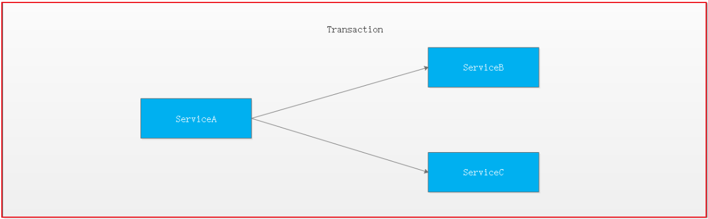
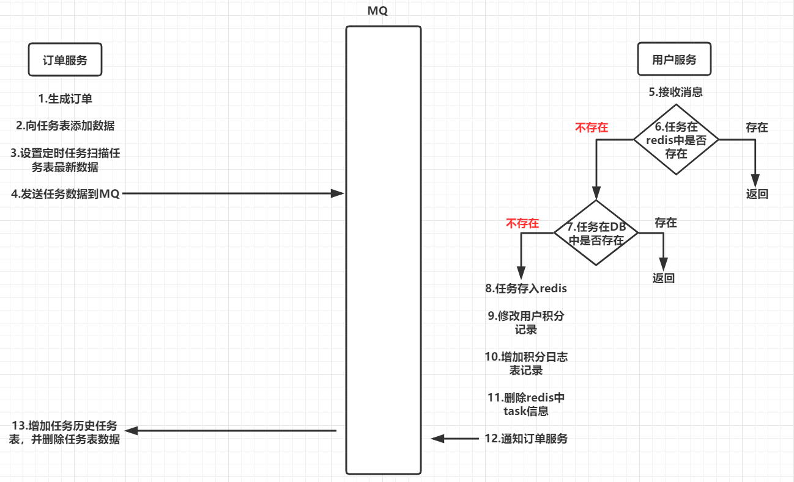

# 第12章 分布式事务解决方案  

## 1.分布式事务解决方案    

​     刚才我们编写的扣减库存与保存订单是在两个服务中存在的，如果扣减库存后订单保存失败了是不会回滚的，这样就会造成数据不一致的情况，这其实就是我们所说的分布式事务的问题，接下来我们来学习分布式事务的解决方案。

### 1.1 本地事务与分布式事务

#### 1.1.1 事务 

数据库事务(简称：事务，Transaction)是指数据库执行过程中的一个逻辑单位，由一个有限的数据库操作序列构成。

事务拥有以下四个特性，习惯上被称为ACID特性：

**原子性(Atomicity)**：事务作为一个整体被执行，包含在其中的对数据库的操作要么全部被执行，要么都不执行。

**一致性(Consistency)**：事务应确保数据库的状态从一个一致状态转变为另一个一致状态。一致状态是指数据库中的数据应满足完整性约束。除此之外，一致性还有另外一层语义，就是事务的中间状态不能被观察到(这层语义也有说应该属于原子性)。

**隔离性(Isolation)**：多个事务并发执行时，一个事务的执行不应影响其他事务的执行，如同只有这一个操作在被数据库所执行一样。

**持久性(Durability)**：已被提交的事务对数据库的修改应该永久保存在数据库中。在事务结束时，此操作将不可逆转。

#### 1.1.2 本地事务

起初，事务仅限于对单一数据库资源的访问控制,架构服务化以后，事务的概念延伸到了服务中。倘若将一个单一的服务操作作为一个事务，那么整个服务操作只能涉及一个单一的数据库资源,这类基于单个服务单一数据库资源访问的事务，被称为本地事务(Local Transaction)。 


#### 1.1.3 分布式事务

​        分布式事务指事务的参与者、支持事务的服务器、资源服务器以及事务管理器分别位于不同的分布式系统的不同节点之上,且属于不同的应用，分布式事务需要保证这些操作要么全部成功，要么全部失败。本质上来说，分布式事务就是为了保证不同数据库的数据一致性。 

​       最早的分布式事务应用架构很简单，不涉及服务间的访问调用，仅仅是服务内操作涉及到对多个数据库资源的访问。  


​        当一个服务操作访问不同的数据库资源，又希望对它们的访问具有事务特性时，就需要采用分布式事务来协调所有的事务参与者。

​        对于上面介绍的分布式事务应用架构，尽管一个服务操作会访问多个数据库资源，但是毕竟整个事务还是控制在单一服务的内部。如果一个服务操作需要调用另外一个服务，这时的事务就需要跨越多个服务了。在这种情况下，起始于某个服务的事务在调用另外一个服务的时候，需要以某种机制流转到另外一个服务，从而使被调用的服务访问的资源也自动加入到该事务当中来。下图反映了这样一个跨越多个服务的分布式事务：



​        如果将上面这两种场景(一个服务可以调用多个数据库资源，也可以调用其他服务)结合在一起，对此进行延伸，整个分布式事务的参与者将会组成如下图所示的树形拓扑结构。在一个跨服务的分布式事务中，事务的发起者和提交均系同一个，它可以是整个调用的客户端，也可以是客户端最先调用的那个服务。 


​         较之基于单一数据库资源访问的本地事务，分布式事务的应用架构更为复杂。在不同的分布式应用架构下，实现一个分布式事务要考虑的问题并不完全一样，比如对多资源的协调、事务的跨服务传播等，实现机制也是复杂多变。

### 1.2 分布式事务相关理论

#### 1.2.1 CAP定理


CAP定理是在 1998年加州大学的计算机科学家 Eric Brewer （埃里克.布鲁尔）提出，分布式系统有三个指标

- Consistency   一致性
- Availability     可用性
- Partition tolerance   分区容错性

它们的第一个字母分别是 C、A、P。Eric Brewer 说，这三个指标不可能同时做到。这个结论就叫做 CAP 定理。

##### 分区容错  Partition tolerance

大多数分布式系统都分布在多个子网络。每个子网络就叫做一个区（partition）。分区容错的意思是，区间通信可能失败。比如，一台服务器放在中国，另一台服务器放在美国，这就是两个区，它们之间可能无法通信。


上图中，G1 和 G2 是两台跨区的服务器。G1 向 G2 发送一条消息，G2 可能无法收到。系统设计的时候，必须考虑到这种情况。

一般来说，分区容错无法避免，因此可以认为 CAP 的 P 总是成立。CAP 定理告诉我们，剩下的 C 和 A 无法同时做到。

##### 可用性 Availability

Availability 中文叫做"可用性"，意思是只要收到用户的请求，服务器就必须给出回应。

用户可以选择向 G1 或 G2 发起读操作。不管是哪台服务器，只要收到请求，就必须告诉用户，到底是 v0 还是 v1，否则就不满足可用性。


##### 一致性 Consistency

Consistency 中文叫做"一致性"。意思是，写操作之后的读操作，必须返回该值。

举例来说，某条记录是 v0，用户向 G1 发起一个写操作，将其改为 v1。


问题是，用户有可能向 G2 发起读操作，由于 G2 的值没有发生变化，因此返回的是 v0。G1 和 G2 读操作的结果不一致，这就不满足一致性了。


为了让 G2 也能变为 v1，就要在 G1 写操作的时候，让 G1 向 G2 发送一条消息，要求 G2 也改成 v1。


##### 一致性和可用性的矛盾

一致性和可用性，为什么不可能同时成立？答案很简单，因为可能通信失败（即出现分区容错）。

如果保证 G2 的一致性，那么 G1 必须在写操作时，锁定 G2 的读操作和写操作。只有数据同步后，才能重新开放读写。锁定期间，G2 不能读写，没有可用性。

如果保证 G2 的可用性，那么势必不能锁定 G2，所以一致性不成立。

综上所述，G2 无法同时做到一致性和可用性。系统设计时只能选择一个目标。如果追求一致性，那么无法保证所有节点的可用性；如果追求所有节点的可用性，那就没法做到一致性。

#### 1.2.2 BASE理论 

BASE：全称：Basically Available(基本可用)，Soft state（软状态）,和 Eventually consistent（最终一致性）三个短语的缩写，来自 ebay 的架构师提出。BASE 理论是对 CAP 中一致性和可用性权衡的结果，其来源于对大型互联网分布式实践的总结，是基于 CAP 定理逐步演化而来的。其核心思想是：

> 既是无法做到强一致性（Strong consistency），但每个应用都可以根据自身的业务特点，采用适当的方式来使系统达到最终一致性（Eventual consistency）。

##### Basically Available(基本可用)

什么是基本可用呢？假设系统，出现了不可预知的故障，但还是能用，相比较正常的系统而言：

1. 响应时间上的损失：正常情况下的搜索引擎 0.5 秒即返回给用户结果，而**基本可用**的搜索引擎可以在 1 秒作用返回结果。
2. 功能上的损失：在一个电商网站上，正常情况下，用户可以顺利完成每一笔订单，但是到了大促期间，为了保护购物系统的稳定性，部分消费者可能会被引导到一个降级页面。

##### Soft state（软状态）

什么是软状态呢？相对于原子性而言，要求多个节点的数据副本都是一致的，这是一种 “硬状态”。

软状态指的是：允许系统中的数据存在中间状态，并认为该状态不影响系统的整体可用性，即允许系统在多个不同节点的数据副本存在数据延时。

##### Eventually consistent（最终一致性）

系统能够保证在没有其他新的更新操作的情况下，数据最终一定能够达到一致的状态，因此所有客户端对系统的数据访问最终都能够获取到最新的值。


### 1.3 分布式事务解决方案

#### 1.3.1 基于XA协议的两阶段提交 2PC

首先我们来简要看下分布式事务处理的XA规范 ： 


可知XA规范中分布式事务有AP，RM，TM组成：

其中应用程序(Application Program ，简称AP)：AP定义事务边界（定义事务开始和结束）并访问事务边界内的资源。

资源管理器(Resource Manager，简称RM)：Rm管理计算机共享的资源，许多软件都可以去访问这些资源，资源包含比如数据库、文件系统、打印机服务器等。

事务管理器(Transaction Manager ，简称TM)：负责管理全局事务，分配事务唯一标识，监控事务的执行进度，并负责事务的提交、回滚、失败恢复等。

**二阶段协议:**

**第一阶段**TM要求所有的RM准备提交对应的事务分支，询问RM是否有能力保证成功的提交事务分支，RM根据自己的情况，如果判断自己进行的工作可以被提交，那就对工作内容进行持久化，并给TM回执OK；否者给TM的回执NO。RM在发送了否定答复并回滚了已经完成的工作后，就可以丢弃这个事务分支信息了。

**第二阶段**TM根据阶段1各个RM prepare的结果，决定是提交还是回滚事务。如果所有的RM都prepare成功，那么TM通知所有的RM进行提交；如果有RM prepare回执NO的话，则TM通知所有RM回滚自己的事务分支。

也就是TM与RM之间是通过两阶段提 交协议进行交互的.

**优点：** 尽量保证了数据的强一致，适合对数据强一致要求很高的关键领域。（其实也不能100%保证强一致）

**缺点：** 实现复杂，牺牲了可用性，对性能影响较大，不适合高并发高性能场景。

#### 1.3.2 TCC补偿机制

TCC 其实就是采用的补偿机制，其核心思想是：针对每个操作，都要注册一个与其对应的确认和补偿（撤销）操作。它分为三个阶段：

- Try 阶段主要是对业务系统做检测及资源预留
- Confirm 阶段主要是对业务系统做确认提交，Try阶段执行成功并开始执行 Confirm阶段时，默认 Confirm阶段是不会出错的。即：只要Try成功，Confirm一定成功。
- Cancel 阶段主要是在业务执行错误，需要回滚的状态下执行的业务取消，预留资源释放。


例如： A要向 B 转账，思路大概是： 

```
我们有一个本地方法，里面依次调用 
1、首先在 Try 阶段，要先调用远程接口把 B和 A的钱给冻结起来。 
2、在 Confirm 阶段，执行远程调用的转账的操作，转账成功进行解冻。 
3、如果第2步执行成功，那么转账成功，如果第二步执行失败，则调用远程冻结接口对应的解冻方法 (Cancel)。 
```

**优点：** 相比两阶段提交，可用性比较强

**缺点：** 数据的一致性要差一些。TCC属于应用层的一种补偿方式，所以需要程序员在实现的时候多写很多补偿的代码，在一些场景中，一些业务流程可能用TCC不太好定义及处理。

#### 1.3.3 消息最终一致性

消息最终一致性应该是业界使用最多的，其核心思想是将分布式事务拆分成本地事务进行处理，这种思路是来源于ebay。我们可以从下面的流程图中看出其中的一些细节： 


基本思路就是：

消息生产方，需要额外建一个消息表，并记录消息发送状态。消息表和业务数据要在一个事务里提交，也就是说他们要在一个数据库里面。然后消息会经过MQ发送到消息的消费方。如果消息发送失败，会进行重试发送。

消息消费方，需要处理这个消息，并完成自己的业务逻辑。此时如果本地事务处理成功，表明已经处理成功了，如果处理失败，那么就会重试执行。如果是业务上面的失败，可以给生产方发送一个业务补偿消息，通知生产方进行回滚等操作。

生产方和消费方定时扫描本地消息表，把还没处理完成的消息或者失败的消息再发送一遍。如果有靠谱的自动对账补账逻辑，这种方案还是非常实用的。

**优点：** 一种非常经典的实现，避免了分布式事务，实现了最终一致性。

**缺点：** 消息表会耦合到业务系统中，如果没有封装好的解决方案，会有很多杂活需要处理。


## 2. 基于Seata实现分布式事务

### 2.1 Seata简介

​	Seata（原名Fescar） 是阿里18年开源的分布式事务的框架。Fescar的开源对分布式事务框架领域影响很大。作为开源大户，Fescar来自阿里的GTS，经历了好几次双十一的考验，一经开源便颇受关注。后来Fescar改名为Seata。

 	Fescar虽然是二阶段提交协议的分布式事务，但是其解决了XA的一些缺点:

- 单点问题:
- 同步阻塞:Fescar的二阶段，其再第一阶段的时候本地事务就已经提交释放资源了，不会像XA会再两个prepare和commit阶段资源都锁住，并且Fescar,commit是异步操作，也是提升性能的一大关键。
- 数据不一致:如果出现部分commit失败，那么fescar-server会根据当前的事务模式和分支事务的返回状态的结果来进行不同的重试策略。并且fescar的本地事务会在一阶段的时候进行提交，其实单看数据库来说在commit的时候数据库已经是一致的了。
- 只能用于单一数据库: Fescar提供了两种模式，AT和MT。在AT模式下事务资源可以是任何支持ACID的数据库，在MT模式下事务资源没有限制，可以是缓存，可以是文件，可以是其他的等等。当然这两个模式也可以混用。

同时Fescar也保留了接近0业务入侵的优点，只需要简单的配置Fescar的数据代理和加个注解，加一个Undolog表，就可以达到我们想要的目的。

### 2.2 实现原理

Fescar将一个本地事务做为一个分布式事务分支，所以若干个分布在不同微服务中的本地事务共同组成了一个全局事务，结构如下。 


**Transaction Coordinator (TC)：** 事务协调器，维护全局事务的运行状态，负责协调并驱动全局事务的提交或回滚。

**Transaction Manager (TM)：** 控制全局事务的边界，负责开启一个全局事务，并最终发起全局提交或全局回滚的决议。

**Resource Manager (RM)：** 控制分支事务，负责分支注册、状态汇报，并接收事务协调器的指令，驱动分支（本地）事务的提交和回滚。

一个典型的分布式事务过程：

1. TM 向 TC 申请开启一个全局事务，全局事务创建成功并生成一个全局唯一的 XID。
2. XID 在微服务调用链路的上下文中传播。
3. RM 向 TC 注册分支事务，将其纳入 XID 对应全局事务的管辖。
4. TM 向 TC 发起针对 XID 的全局提交或回滚决议。
5. TC 调度 XID 下管辖的全部分支事务完成提交或回滚请求。

### 2.3 Fescar模式

Fescar对分布式事务的实现提供了2种模式，AT模式和MT模式：

#### 2.3.1 AT模式

业务逻辑不需要关注事务机制，分支与全局事务的交互过程自动进行。

**AT模式**：主要关注多 DB 访问的数据一致性，实现起来比较简单，对业务的侵入较小。

AT模式部分代码如下：不需要关注执行状态，对业务代码侵入较小。类似代码如下，只需要为方法添加`@GlobalTransactional`注解即可。

AT模式的核心是对业务无侵入，是一种改进后的两阶段提交，其设计思路如图：

**第一阶段：**


核心在于对业务sql进行解析，转换成undolog，两阶段提交往往对资源的锁定需要持续到第二阶段实际的提交或者回滚操作，而有了回滚日志之后，可以在第一阶段释放对资源的锁定，降低了锁范围，提高效率，即使第二阶段发生异常需要回滚，只需找对undolog中对应数据并反解析成sql来达到回滚目的。Seata通过代理数据源将业务sql的执行解析成undolog来与业务数据的更新同时入库，达到了对业务无侵入的效果。

**第二阶段：**

如果决议是全局提交，此时分支事务此时已经完成提交，不需要同步协调处理（只需要异步清理回滚日志），Phase2 可以非常快速地完成。


如果决议是全局回滚，RM 收到协调器发来的回滚请求，通过 XID 和 Branch ID 找到相应的回滚日志记录，通过回滚记录生成反向的更新 SQL 并执行，以完成分支的回滚。


#### 2.3.2 MT模式

业务逻辑需要被分解为 Prepare/Commit/Rollback 3 部分，形成一个 MT 分支，加入全局事务。


MT 模式一方面是 AT 模式的补充。另外，更重要的价值在于，通过 MT 模式可以把众多非事务性资源纳入全局事务的管理中

#### 2.3.3 混合模式

因为 AT 和 MT 模式的分支从根本上行为模式是一致的，所以可以完全兼容，即，一个全局事务中，可以同时存在 AT 和 MT 的分支。这样就可以达到全面覆盖业务场景的目的：AT 模式可以支持的，使用 AT 模式；AT 模式暂时支持不了的，用 MT 模式来替代。另外，自然的，MT 模式管理的非事务性资源也可以和支持事务的关系型数据库资源一起，纳入同一个分布式事务的管理中。

### 2.4 代码实现

#### 2.4.1 分布式事务公共模块

（1）创建工程 changgou_common_fescar，引入依赖

```xml
<properties>
	<fescar.version>0.4.2</fescar.version>
</properties>
<dependencies>
	<dependency>
		<groupId>com.changgou</groupId>
		<artifactId>changgou_common</artifactId>
		<version>1.0-SNAPSHOT</version>
	</dependency>
	<dependency>
		<groupId>com.alibaba.fescar</groupId>
		<artifactId>fescar-tm</artifactId>
		<version>${fescar.version}</version>
	</dependency>
	<dependency>
		<groupId>com.alibaba.fescar</groupId>
		<artifactId>fescar-spring</artifactId>
		<version>${fescar.version}</version>
	</dependency>
</dependencies>
```

（2）将`fescar配置文件`文件夹中的所有配置文件拷贝到resources工程下，如下图：


其中file.conf有2个配置


service.vgroup_mapping.my_test_tx_group 映射到相应的 Fescar-Server 集群名称，然后再根据集群名称.grouplist 获取到可用服务列表。


（3）创建FescarRMRequestFilter，给每个线程绑定一个XID （资源提供）

```java
public class FescarRMRequestFilter extends OncePerRequestFilter {

    private static final Logger LOGGER = org.slf4j.LoggerFactory.getLogger( FescarRMRequestFilter.class);

    /**
     * 给每次线程请求绑定一个XID
     * @param request
     * @param response
     * @param filterChain
     */
    @Override
    protected void doFilterInternal(HttpServletRequest request, HttpServletResponse response, FilterChain filterChain) throws ServletException, IOException {
        String currentXID = request.getHeader( FescarAutoConfiguration.FESCAR_XID);
        if(!StringUtils.isEmpty(currentXID)){
            RootContext.bind(currentXID);
            LOGGER.info("当前线程绑定的XID :" + currentXID);
        }
        try{
            filterChain.doFilter(request, response);
        } finally {
            String unbindXID = RootContext.unbind();
            if(unbindXID != null){
                LOGGER.info("当前线程从指定XID中解绑 XID :" + unbindXID);
                if(!currentXID.equals(unbindXID)){
                    LOGGER.info("当前线程的XID发生变更");
                }
            }
            if(currentXID != null){
                LOGGER.info("当前线程的XID发生变更");
            }
        }
    }
}
```

（4）创建FescarRestInterceptor过滤器，每次请求其他微服务的时候，都将XID携带过去。（资源提供）

```java
public class FescarRestInterceptor implements RequestInterceptor, ClientHttpRequestInterceptor {

    @Override
    public void apply(RequestTemplate requestTemplate) {
        String xid = RootContext.getXID();
        if(!StringUtils.isEmpty(xid)){
            requestTemplate.header( FescarAutoConfiguration.FESCAR_XID, xid);
        }
    }

    @Override
    public ClientHttpResponse intercept(HttpRequest request, byte[] body, ClientHttpRequestExecution execution) throws IOException {
        String xid = RootContext.getXID();
        if(!StringUtils.isEmpty(xid)){
            HttpHeaders headers = request.getHeaders();
            headers.put( FescarAutoConfiguration.FESCAR_XID, Collections.singletonList(xid));
        }
        return execution.execute(request, body);
    }
}
```

（5）创建FescarAutoConfiguration类  （资源提供）

```java
/**
 *  * 创建数据源
 *  * 定义全局事务管理器扫描对象
 *  * 给所有RestTemplate添加头信息防止微服务之间调用问题
 */
@Configuration
public class FescarAutoConfiguration {

    public static final String FESCAR_XID = "fescarXID";

    /***
     * 创建代理数据库
     * @param environment
     * @return
     */
    @Bean
    public DataSource dataSource(Environment environment){
        DruidDataSource dataSource = new DruidDataSource();
        dataSource.setUrl(environment.getProperty("spring.datasource.url"));
        try {
            dataSource.setDriver(DriverManager.getDriver(environment.getProperty("spring.datasource.url")));
        } catch (SQLException e) {
            throw new RuntimeException("can't recognize dataSource Driver");
        }
        dataSource.setUsername(environment.getProperty("spring.datasource.username"));
        dataSource.setPassword(environment.getProperty("spring.datasource.password"));
        return new DataSourceProxy(dataSource);
    }

    /***
     * 全局事务扫描器
     * 用来解析带有@GlobalTransactional注解的方法，然后采用AOP的机制控制事务
     * @param environment
     * @return
     */
    @Bean
    public GlobalTransactionScanner globalTransactionScanner(Environment environment){
        String applicationName = environment.getProperty("spring.application.name");
        String groupName = environment.getProperty("fescar.group.name");
        if(applicationName == null){
            return new GlobalTransactionScanner(groupName == null ? "my_test_tx_group" : groupName);
        }else{
            return new GlobalTransactionScanner(applicationName, groupName == null ? "my_test_tx_group" : groupName);
        }
    }

    /***
     * 每次微服务和微服务之间相互调用
     * 要想控制全局事务，每次TM都会请求TC生成一个XID，每次执行下一个事务，也就是调用其他微服务的时候都需要将该XID传递过去
     * 所以我们可以每次请求的时候，都获取头中的XID，并将XID传递到下一个微服务
     * @param restTemplates
     * @return
     */
    @ConditionalOnBean({RestTemplate.class})
    @Bean
    public Object addFescarInterceptor(Collection<RestTemplate> restTemplates){
        restTemplates.stream()
                .forEach(restTemplate -> {
                    List<ClientHttpRequestInterceptor> interceptors = restTemplate.getInterceptors();
                    if(interceptors != null){
                        interceptors.add(fescarRestInterceptor());
                    }
                });
        return new Object();
    }

    @Bean
    public FescarRMRequestFilter fescarRMRequestFilter(){
        return new FescarRMRequestFilter();
    }

    @Bean
    public FescarRestInterceptor fescarRestInterceptor(){
        return new FescarRestInterceptor();
    }
}
```

#### 2.4.2 分布式事务的实现

（1）涉及到分布式事务的数据库添加表

```sql
CREATE TABLE `undo_log` (
  `id` bigint(20) NOT NULL AUTO_INCREMENT,
  `branch_id` bigint(20) NOT NULL,
  `xid` varchar(100) NOT NULL,
  `rollback_info` longblob NOT NULL,
  `log_status` int(11) NOT NULL,
  `log_created` datetime NOT NULL,
  `log_modified` datetime NOT NULL,
  `ext` varchar(100) DEFAULT NULL,
  PRIMARY KEY (`id`),
  KEY `idx_unionkey` (`xid`,`branch_id`)
) ENGINE=InnoDB AUTO_INCREMENT=200 DEFAULT CHARSET=utf8;
```

核心在于对业务sql进行解析，转换成undolog,所以只要支持Fescar分布式事务的微服务数据都需要导入该表结构

（2）需要添加分布式事务的微服务（**商品微服务、订单微服务**）添加对 changgou_transaction_fescar的依赖

```xml
<!--fescar依赖-->
<dependency>
    <groupId>com.changgou</groupId>
    <artifactId>changgou_common_fescar</artifactId>
    <version>1.0-SNAPSHOT</version>
</dependency>
```

（3）在订单微服务的OrderServiceImpl的add方法上增加@GlobalTransactional(name = "order_add")注解

（4）启动Fescar-server，打开seata包/fescar-server-0.4.2/bin,双击fescar-server.bat启动fescar-server，如下：  


https://github.com/seata/seata/releases

#### 2.4.3 测试

（1）功能测试，看功能能否正常执行。

（2）异常测试，我们在方法中添加` int x=1/0`  ，看库存信息是否能够回滚。


## 3.基于消息队列实现分布式事务



### 3.1 准备工作

#### 3.1.1 changgou_order库新增数据表

```sql
DROP TABLE IF EXISTS `tb_task`;
CREATE TABLE `tb_task` (
  `id` bigint(32) NOT NULL AUTO_INCREMENT COMMENT '任务id',
  `create_time` datetime DEFAULT NULL,
  `update_time` datetime DEFAULT NULL,
  `delete_time` datetime DEFAULT NULL,
  `task_type` varchar(32) DEFAULT NULL COMMENT '任务类型',
  `mq_exchange` varchar(64) DEFAULT NULL COMMENT '交换机名称',
  `mq_routingkey` varchar(64) DEFAULT NULL COMMENT 'routingkey',
  `request_body` varchar(512) DEFAULT NULL COMMENT '任务请求的内容',
  `status` varchar(32) DEFAULT NULL COMMENT '任务状态',
  `errormsg` varchar(512) DEFAULT NULL COMMENT '任务错误信息',
  PRIMARY KEY (`id`)
) ENGINE=InnoDB DEFAULT CHARSET=utf8;
```


```sql
DROP TABLE IF EXISTS `tb_task_his`;
CREATE TABLE `tb_task_his` (
  `id` bigint(32) NOT NULL AUTO_INCREMENT COMMENT '任务id',
  `create_time` datetime DEFAULT NULL,
  `update_time` datetime DEFAULT NULL,
  `delete_time` datetime DEFAULT NULL,
  `task_type` varchar(32) DEFAULT NULL COMMENT '任务类型',
  `mq_exchange` varchar(64) DEFAULT NULL COMMENT '交换机名称',
  `mq_routingkey` varchar(64) DEFAULT NULL COMMENT 'routingkey',
  `request_body` varchar(512) DEFAULT NULL COMMENT '任务请求的内容',
  `status` varchar(32) DEFAULT NULL COMMENT '任务状态',
  `errormsg` varchar(512) DEFAULT NULL,
  PRIMARY KEY (`id`)
) ENGINE=InnoDB AUTO_INCREMENT=9 DEFAULT CHARSET=utf8;
```


#### 3.1.2 changgou_service_order_api添加相关实体类

```java
@Table(name="tb_task")
public class Task {

    @Id
    private Long id;

    @Column(name = "create_time")
    private Date createTime;

    @Column(name = "update_time")
    private Date updateTime;

    @Column(name = "delete_time")
    private Date deleteTime;

    @Column(name = "task_type")
    private String taskType;

    @Column(name = "mq_exchange")
    private String mqExchange;

    @Column(name = "mq_routingkey")
    private String mqRoutingkey;

    @Column(name = "request_body")
    private String requestBody;

    @Column(name = "status")
    private String status;

    @Column(name = "errormsg")
    private String errormsg;
    
    //getter，setter略
}
```


```java
@Table(name="tb_task_his")
public class TaskHis {

    @Id
    private Long id;

    @Column(name = "create_time")
    private Date createTime;

    @Column(name = "update_time")
    private Date updateTime;

    @Column(name = "delete_time")
    private Date deleteTime;

    @Column(name = "task_type")
    private String taskType;

    @Column(name = "mq_exchange")
    private String mqExchange;

    @Column(name = "mq_routingkey")
    private String mqRoutingkey;

    @Column(name = "request_body")
    private String requestBody;

    @Column(name = "status")
    private String status;

    @Column(name = "errormsg")
    private String errormsg;

    //getter，setter略
}
```


#### 3.1.3 changgou_user新增积分日志表

```sql
DROP TABLE IF EXISTS `tb_point_log`;
CREATE TABLE `tb_point_log` (
  `order_id` varchar(200) NOT NULL,
  `user_id` varchar(200) NOT NULL,
  `point` int(11) NOT NULL,
  PRIMARY KEY (`order_id`)
) ENGINE=InnoDB DEFAULT CHARSET=utf8;
```


#### 3.1.4 changgou_service_user_api添加实体类 PointLog

```java
@Table(name="tb_point_log")
public class PointLog {

    private String orderId;
    private String userId;
    private Integer point;
    //getter，setter略
}
```


#### 3.1.5 changgou_service_order添加rabbitMQ配置类

```java
@Configuration
public class RabbitMQConfig {
    //添加积分任务交换机
    public static final String EX_BUYING_ADDPOINTURSE = "ex_buying_addpointurse";

    //添加积分消息队列
    public static final String CG_BUYING_ADDPOINT = "cg_buying_addpoint";

    //完成添加积分消息队列
    public static final String CG_BUYING_FINISHADDPOINT = "cg_buying_finishaddpoint";

    //添加积分路由key
    public static final String CG_BUYING_ADDPOINT_KEY = "addpoint";

    //完成添加积分路由key
    public static final String CG_BUYING_FINISHADDPOINT_KEY = "finishaddpoint";

    /**
     * 交换机配置
     * @return the exchange
     */
    @Bean(EX_BUYING_ADDPOINTURSE)
    public Exchange EX_DECLARE() {
        return ExchangeBuilder.directExchange(EX_BUYING_ADDPOINTURSE).durable(true).build();
    }
    //声明队列
    @Bean(CG_BUYING_FINISHADDPOINT)
    public Queue QUEUE_CG_BUYING_FINISHADDPOINT() {
        Queue queue = new Queue(CG_BUYING_FINISHADDPOINT);
        return queue;
    }
    //声明队列
    @Bean(CG_BUYING_ADDPOINT)
    public Queue QUEUE_CG_BUYING_ADDPOINT() {
        Queue queue = new Queue(CG_BUYING_ADDPOINT);
        return queue;
    }
    /**
     * 绑定队列到交换机 .
     * @param queue    the queue
     * @param exchange the exchange
     * @return the binding
     */
    @Bean
    public Binding BINDING_QUEUE_FINISHADDPOINT(@Qualifier(CG_BUYING_FINISHADDPOINT) Queue queue, @Qualifier(EX_BUYING_ADDPOINTURSE) Exchange exchange) {
        return BindingBuilder.bind(queue).to(exchange).with(CG_BUYING_FINISHADDPOINT_KEY).noargs();
    }
    @Bean
    public Binding BINDING_QUEUE_ADDPOINT(@Qualifier(CG_BUYING_ADDPOINT) Queue queue, @Qualifier(EX_BUYING_ADDPOINTURSE) Exchange exchange) {
        return BindingBuilder.bind(queue).to(exchange).with(CG_BUYING_ADDPOINT_KEY).noargs();
    }
}
```


### 3.2 订单服务添加任务并发送

#### 3.2.1 修改添加订单方法

当添加订单的时候，添加任务表中相关数据, 局部代码如下

```java
//增加任务表记录
Task task = new Task();
task.setCreateTime(new Date());
task.setUpdateTime(new Date());
task.setMqExchange(RabbitMQConfig.EX_BUYING_ADDPOINTURSE);
task.setMqRoutingkey(RabbitMQConfig.CG_BUYING_ADDPOINT_KEY);

Map map = new HashMap();
map.put("userName",order.getUsername());
map.put("orderId",order.getId());
map.put("point",order.getPayMoney());
task.setRequestBody(JSON.toJSONString(map));
taskMapper.insertSelective(task);
```


#### 3.2.2 定时扫描任务表最新数据

订单服务新增定时任务类，获取小于系统当前时间的所有任务数据

##### 3.2.2.1 修改订单服务启动类，添加开启定时任务注解

```java
@EnableScheduling
```

##### 3.2.2.2 定义定时任务类

###### 3.2.2.2.1 查询最新数据

更新taskMapper新增方法，查询所有小于系统当前时间的数据

```java
public interface TaskMapper extends Mapper<Task> {

    @Select("SELECT * from tb_task WHERE update_time<#{currentTime}")
    @Results({@Result(column = "create_time",property = "createTime"),
            @Result(column = "update_time",property = "updateTime"),
            @Result(column = "delete_time",property = "deleteTime"),
            @Result(column = "task_type",property = "taskType"),
            @Result(column = "mq_exchange",property = "mqExchange"),
            @Result(column = "mq_routingkey",property = "mqRoutingkey"),
            @Result(column = "request_body",property = "requestBody"),
            @Result(column = "status",property = "status"),
            @Result(column = "errormsg",property = "errormsg")})
    List<Task> findTaskLessTanCurrentTime(Date currentTime);
}
```

###### 3.2.2.2.2 任务类实现

```java
@Component
public class QueryPointTask {

    @Autowired
    private RabbitTemplate rabbitTemplate;

    @Autowired
    private TaskMapper taskMapper;

    @Scheduled(cron = "0 0/2 * * * ?")
    public void queryTask(){

        //1.获取小于系统当前时间数据
        List<Task> taskList = taskMapper.findTaskLessTanCurrentTime(new Date());

        if (taskList!=null && taskList.size()>0){
            //将任务数据发送到消息队列
            for (Task task : taskList) {
 rabbitTemplate.convertAndSend(RabbitMQConfig.EX_BUYING_ADDPOINTURSE,RabbitMQConfig.CG_BUYING_ADDPOINT_KEY, JSON.toJSONString(task));
            }
        }
    }
}
```


### 3.3 用户服务更改积分

#### 3.3.1 添加rabbitmq配置类(与订单服务相同)

```java
@Configuration
public class RabbitMQConfig {
    //添加积分任务交换机
    public static final String EX_BUYING_ADDPOINTURSE = "ex_buying_addpointurse";

    //添加积分消息队列
    public static final String CG_BUYING_ADDPOINT = "cg_buying_addpoint";

    //完成添加积分消息队列
    public static final String CG_BUYING_FINISHADDPOINT = "cg_buying_finishaddpoint";

    //添加积分路由key
    public static final String CG_BUYING_ADDPOINT_KEY = "addpoint";

    //完成添加积分路由key
    public static final String CG_BUYING_FINISHADDPOINT_KEY = "finishaddpoint";

    /**
     * 交换机配置
     * @return the exchange
     */
    @Bean(EX_BUYING_ADDPOINTURSE)
    public Exchange EX_DECLARE() {
        return ExchangeBuilder.directExchange(EX_BUYING_ADDPOINTURSE).durable(true).build();
    }
    //声明队列
    @Bean(CG_BUYING_FINISHADDPOINT)
    public Queue QUEUE_CG_BUYING_FINISHADDPOINT() {
        Queue queue = new Queue(CG_BUYING_FINISHADDPOINT);
        return queue;
    }
    //声明队列
    @Bean(CG_BUYING_ADDPOINT)
    public Queue QUEUE_CG_BUYING_ADDPOINT() {
        Queue queue = new Queue(CG_BUYING_ADDPOINT);
        return queue;
    }
    /**
     * 绑定队列到交换机 .
     * @param queue    the queue
     * @param exchange the exchange
     * @return the binding
     */
    @Bean
    public Binding BINDING_QUEUE_FINISHADDPOINT(@Qualifier(CG_BUYING_FINISHADDPOINT) Queue queue, @Qualifier(EX_BUYING_ADDPOINTURSE) Exchange exchange) {
        return BindingBuilder.bind(queue).to(exchange).with(CG_BUYING_FINISHADDPOINT_KEY).noargs();
    }
    @Bean
    public Binding BINDING_QUEUE_ADDPOINT(@Qualifier(CG_BUYING_ADDPOINT) Queue queue, @Qualifier(EX_BUYING_ADDPOINTURSE) Exchange exchange) {
        return BindingBuilder.bind(queue).to(exchange).with(CG_BUYING_ADDPOINT_KEY).noargs();
    }
}
```


#### 3.3.2 定义消息监听类

```java
@Component
public class AddPointListener {

    @Autowired
    private UserService userService;

    @Autowired
    private RedisTemplate redisTemplate;

    @Autowired
    private RabbitTemplate rabbitTemplate;

    @RabbitListener(queues = RabbitMQConfig.CG_BUYING_ADDPOINT)
    public void receiveMessage(String message){

        Task task = JSON.parseObject(message, Task.class);

        if (task == null || StringUtils.isEmpty(task.getRequestBody())){
            return;
        }

        //判断redis中是否存在内容
        Object value = redisTemplate.boundValueOps(task.getId()).get();
        if (value != null){
            return;
        }

        //更新用户积分
        int result = userService.updateUserPoints(task);

        if (result<=0){
            return;
        }

        //返回通知
rabbitTemplate.convertAndSend(RabbitMQConfig.EX_BUYING_ADDPOINTURSE,RabbitMQConfig.CG_BUYING_FINISHADDPOINT_KEY,JSON.toJSONString(task));

    }
}
```


#### 3.3.3 定义修改用户积分实现

实现思路：

1）判断当前订单是否操作过

2）将任务存入redis

3）修改用户积分

4）添加积分日志表记录

5）删除redis中记录

```java
@Autowired
private PointLogMapper pointLogMapper;

    /**
     * 修改用户积分
     * @param task
     * @return
     */
    @Override
    @Transactional
    public int updateUserPoints(Task task) {
        Map info = JSON.parseObject(task.getRequestBody(), Map.class);
        String userName = info.get("userName").toString();
        String orderId = info.get("orderId").toString();
        int point = (int) info.get("point");

        //判断当前订单是否操作过
        PointLog pointLog = pointLogMapper.findLogInfoByOrderId(orderId);
        if (pointLog != null){
            return 0;
        }

        //将任务存入redis
        redisTemplate.boundValueOps(task.getId()).set("exist",1,TimeUnit.MINUTES);

        //修改用户积分
        int result = userMapper.updateUserPoint(userName, point);
        if (result<=0){
            return result;
        }

        //添加积分日志表记录
        pointLog = new PointLog();
        pointLog.setOrderId(orderId);
        pointLog.setPoint(point);
        pointLog.setUserId(userName);
        result = pointLogMapper.insertSelective(pointLog);
        if (result<=0){
            return result;
        }

        //删除redis中的记录
        redisTemplate.delete(task.getId());

        return 1;
    }
```


#### 3.3.4 定义根据订单id查询积分日志表

定义PointLogMapper，实现根据订单id查询

```java
public interface PointLogMapper extends Mapper<PointLog> {

    @Select("select * from tb_point_log where order_id=#{orderId}")
    PointLog findLogInfoByOrderId(@Param("orderId") String orderId);
}
```


### 3.4 订单服务删除原任务

#### 3.4.1 定义监听类

在订单服务中定义监听类，用于监听队列，如果队列中有消息，则删除原任务防止消息重复发送，并对任务信息进行记录

```java
@Component
public class DelTaskListener {

    @Autowired
    private TaskService taskService;

    @RabbitListener(queues = RabbitMQConfig.CG_BUYING_FINISHADDPOINT)
    public void receiveMessage(String message){

        Task task = JSON.parseObject(message, Task.class);

        taskService.delTask(task);
    }
}
```


#### 3.4.2 定义任务service

```java
public interface TaskService {

    void delTask(Task task);
}
```

```java
@Service
@Transactional
public class TaskServiceImpl implements TaskService {

    @Autowired
    private TaskMapper taskMapper;

    @Autowired
    private TaskHisMapper taskHisMapper;


    @Override
    public void delTask(Task task) {
        //1. 设置删除时间
        task.setDeleteTime(new Date());
        Long id = task.getId();
        task.setId(null);

        //bean复制
        TaskHis taskHis = new TaskHis();
        BeanUtils.copyProperties(task,taskHis);

       //记录任务信息
        taskHisMapper.insertSelective(taskHis);

        //删除原任务
        task.setId(id);
        taskMapper.deleteByPrimaryKey(task);
    }
}
```


