# 第15章-秒杀

## 1 秒杀业务分析

#### 1.1 需求分析

所谓“秒杀”，就是网络卖家发布一些超低价格的商品，所有买家在同一时间网上抢购的一种销售方式。通俗一点讲就是网络商家为促销等目的组织的网上限时抢购活动。由于商品价格低廉，往往一上架就被抢购一空，有时只用一秒钟。

秒杀商品通常有两种限制：库存限制、时间限制。

需求：

```properties
（1）商家提交秒杀商品申请，录入秒杀商品数据，主要包括：商品标题、原价、秒杀价、商品图片、介绍等信息
（2）运营商审核秒杀申请
（3）秒杀频道首页列出秒杀商品（进行中的）点击秒杀商品图片跳转到秒杀商品详细页。
（4）商品详细页显示秒杀商品信息，点击立即抢购实现秒杀下单，下单时扣减库存。当库存为0或不在活动期范围内时无法秒杀。
（5）秒杀下单成功，直接跳转到支付页面（微信扫码），支付成功，跳转到成功页，填写收货地址、电话、收件人等信息，完成订单。
（6）当用户秒杀下单5分钟内未支付，取消预订单，调用微信支付的关闭订单接口，恢复库存。
```

#### 1.2 表结构说明

**秒杀商品信息表**

```sql
CREATE TABLE `tb_seckill_goods` (
  `id` bigint(20) NOT NULL AUTO_INCREMENT,
  `goods_id` bigint(20) DEFAULT NULL COMMENT 'spu ID',
  `item_id` bigint(20) DEFAULT NULL COMMENT 'sku ID',
  `title` varchar(100) DEFAULT NULL COMMENT '标题',
  `small_pic` varchar(150) DEFAULT NULL COMMENT '商品图片',
  `price` decimal(10,2) DEFAULT NULL COMMENT '原价格',
  `cost_price` decimal(10,2) DEFAULT NULL COMMENT '秒杀价格',
  `seller_id` varchar(100) DEFAULT NULL COMMENT '商家ID',
  `create_time` datetime DEFAULT NULL COMMENT '添加日期',
  `check_time` datetime DEFAULT NULL COMMENT '审核日期',
  `status` char(1) DEFAULT NULL COMMENT '审核状态，0未审核，1审核通过，2审核不通过',
  `start_time` datetime DEFAULT NULL COMMENT '开始时间',
  `end_time` datetime DEFAULT NULL COMMENT '结束时间',
  `num` int(11) DEFAULT NULL COMMENT '秒杀商品数',
  `stock_count` int(11) DEFAULT NULL COMMENT '剩余库存数',
  `introduction` varchar(2000) DEFAULT NULL COMMENT '描述',
  PRIMARY KEY (`id`)
) ENGINE=InnoDB AUTO_INCREMENT=4 DEFAULT CHARSET=utf8;
```

**秒杀订单表**

```sql
CREATE TABLE `tb_seckill_order` (
  `id` bigint(20) NOT NULL COMMENT '主键',
  `seckill_id` bigint(20) DEFAULT NULL COMMENT '秒杀商品ID',
  `money` decimal(10,2) DEFAULT NULL COMMENT '支付金额',
  `user_id` varchar(50) DEFAULT NULL COMMENT '用户',
  `seller_id` varchar(50) DEFAULT NULL COMMENT '商家',
  `create_time` datetime DEFAULT NULL COMMENT '创建时间',
  `pay_time` datetime DEFAULT NULL COMMENT '支付时间',
  `status` char(1) DEFAULT NULL COMMENT '状态，0未支付，1已支付',
  `receiver_address` varchar(200) DEFAULT NULL COMMENT '收货人地址',
  `receiver_mobile` varchar(20) DEFAULT NULL COMMENT '收货人电话',
  `receiver` varchar(20) DEFAULT NULL COMMENT '收货人',
  `transaction_id` varchar(30) DEFAULT NULL COMMENT '交易流水',
  PRIMARY KEY (`id`)
) ENGINE=InnoDB DEFAULT CHARSET=utf8;
```

#### 1.3 秒杀需求分析

秒杀技术实现核心思想是运用缓存减少数据库瞬间的访问压力！读取商品详细信息时运用缓存，当用户点击抢购时减少缓存中的库存数量，当库存数为0时或活动期结束时，同步到数据库。 产生的秒杀预订单也不会立刻写到数据库中，而是先写到缓存，当用户付款成功后再写入数据库。

当然，上面实现的思路只是一种最简单的方式，并未考虑其中一些问题，例如并发状况容易产生的问题。我们看看下面这张思路更严谨的图：

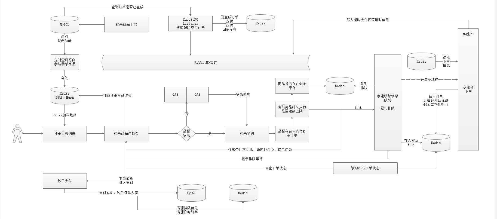


## 2 秒杀商品存入缓存

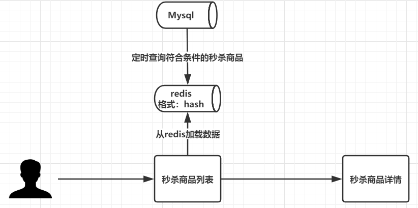

秒杀由B端存入Mysql，设置定时任务，每隔一段时间就从Mysql中将符合条件的数据从Mysql中查询出来并存入缓存中，redis以Hash类型进行数据存储。

### 2.1 秒杀服务搭建

1）新建服务changgou_service_seckill

2）添加依赖信息，详情如下：

```xml
<dependencies>
    <dependency>
        <groupId>com.changgou</groupId>
        <artifactId>changgou_common_db</artifactId>
        <version>1.0-SNAPSHOT</version>
    </dependency>
    <dependency>
        <groupId>org.springframework.cloud</groupId>
        <artifactId>spring-cloud-starter-netflix-eureka-client</artifactId>
    </dependency>
    <dependency>
        <groupId>com.changgou</groupId>
        <artifactId>changgou_service_order_api</artifactId>
        <version>1.0-SNAPSHOT</version>
    </dependency>
    <dependency>
        <groupId>com.changgou</groupId>
        <artifactId>changgou_service_seckill_api</artifactId>
        <version>1.0-SNAPSHOT</version>
    </dependency>
    <dependency>
        <groupId>com.changgou</groupId>
        <artifactId>changgou_service_goods_api</artifactId>
        <version>1.0-SNAPSHOT</version>
    </dependency>
    <dependency>
        <groupId>org.springframework.amqp</groupId>
        <artifactId>spring-rabbit</artifactId>
    </dependency>
    <!--oauth依赖-->
    <dependency>
        <groupId>org.springframework.cloud</groupId>
        <artifactId>spring-cloud-starter-oauth2</artifactId>
    </dependency>
</dependencies>
```

3) 添加启动类

```java
@SpringBootApplication
@EnableDiscoveryClient
@MapperScan(basePackages = {"com.changgou.seckill.dao"})
public class SecKillApplication {

    public static void main(String[] args) {
        SpringApplication.run(SecKillApplication.class,args);
    }

    @Bean
    public IdWorker idWorker(){
        return new IdWorker(1,1);
    }
}
```

4) 添加application.yml

```yml
server:
  port: 9011
spring:
  application:
    name: seckill
  datasource:
    driver-class-name: com.mysql.jdbc.Driver
    url: jdbc:mysql://192.168.200.128:3306/changgou_seckill?useUnicode=true&characterEncoding=UTF-8&serverTimezone=UTC
    username: root
    password: root
  main:
    allow-bean-definition-overriding: true #当遇到同样名字的时候，是否允许覆盖注册
  redis:
    host: 192.168.200.128
  rabbitmq:
    host: 192.168.200.128
eureka:
  client:
    service-url:
      defaultZone: http://127.0.0.1:6868/eureka
  instance:
    prefer-ip-address: true
feign:
  hystrix:
    enabled: true
  client:
    config:
      default:   #配置全局的feign的调用超时时间  如果 有指定的服务配置 默认的配置不会生效
        connectTimeout: 60000 # 指定的是 消费者 连接服务提供者的连接超时时间 是否能连接  单位是毫秒
        readTimeout: 20000  # 指定的是调用服务提供者的 服务 的超时时间（）  单位是毫秒
#hystrix 配置
hystrix:
  command:
    default:
      execution:
        timeout:
          #如果enabled设置为false，则请求超时交给ribbon控制
          enabled: true
        isolation:
          strategy: SEMAPHORE
          thread:
            # 熔断器超时时间，默认：1000/毫秒
            timeoutInMilliseconds: 20000
```

5) 添加公钥

6) 添加Oauth配置类

```java
@Configuration
@EnableResourceServer
//开启方法上的PreAuthorize注解
@EnableGlobalMethodSecurity(prePostEnabled = true, securedEnabled = true)
public class ResourceServerConfig extends ResourceServerConfigurerAdapter {

    //公钥
    private static final String PUBLIC_KEY = "public.key";

    /***
     * 定义JwtTokenStore
     * @param jwtAccessTokenConverter
     * @return
     */
    @Bean
    public TokenStore tokenStore(JwtAccessTokenConverter jwtAccessTokenConverter) {
        return new JwtTokenStore(jwtAccessTokenConverter);
    }

    /***
     * 定义JJwtAccessTokenConverter
     * @return
     */
    @Bean
    public JwtAccessTokenConverter jwtAccessTokenConverter() {
        JwtAccessTokenConverter converter = new JwtAccessTokenConverter();
        converter.setVerifierKey(getPubKey());
        return converter;
    }
    /**
     * 获取非对称加密公钥 Key
     * @return 公钥 Key
     */
    private String getPubKey() {
        Resource resource = new ClassPathResource(PUBLIC_KEY);
        try {
            InputStreamReader inputStreamReader = new InputStreamReader(resource.getInputStream());
            BufferedReader br = new BufferedReader(inputStreamReader);
            return br.lines().collect(Collectors.joining("\n"));
        } catch (IOException ioe) {
            return null;
        }
    }

    /***
     * Http安全配置，对每个到达系统的http请求链接进行校验
     * @param http
     * @throws Exception
     */
    @Override
    public void configure(HttpSecurity http) throws Exception {
        //所有请求必须认证通过
        http.authorizeRequests()
                .anyRequest().
                authenticated();    //其他地址需要认证授权
    }
}
```

7) 更改网关路径过滤类，添加秒杀工程过滤信息

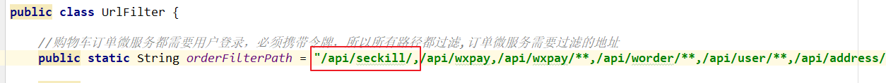

8) 更改网关配置文件，添加请求路由转发

```yml
#秒杀微服务
        - id: changgou_seckill_route
          uri: lb://seckill
          predicates:
            - Path=/api/seckill/**
          filters:
            - StripPrefix=1
```

### 2.2 思路分析

#### 2.2.1 秒杀商品时间段分析


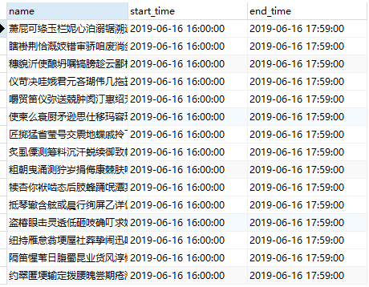

​	根据产品原型图结合秒杀商品表设计可以得知，秒杀商品是存在开始时间与结束时间的，当前秒杀商品是按照秒杀时间段进行显示，如果当前时间在符合条件的时间段范围之内，则用户可以秒杀购买当前时间段之内的秒杀商品。

​	缓存数据加载思路：定义定时任务，每天凌晨会进行当天所有时间段秒杀商品预加载。并且在B端进行限制，添加秒杀商品的话，只能添加当前日期+1的时间限制，比如说：当前日期为8月5日，则添加秒杀商品时，开始时间必须为6日的某一个时间段，否则不能添加。

#### 2.2.2 秒杀商品时间段计算

​	将`资源/DateUtil.java`添加到公共服务中。基于当前工具类可以进行时间段的计算。

​	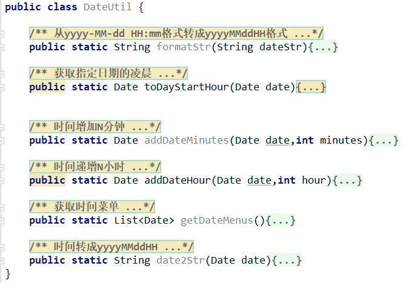

​	在该工具类中，进行时间计算测试：

```java
public static void main(String[] args) {

    //定义存储结果的集合
    List<Date> dateList = new ArrayList<>();

    //获取本日凌晨时间点
    Date currentData = toDayStartHour(new Date());

    //循环12次 （因为要获取每隔两个时间为一个时间段的值）
    for (int i=0;i<12;i++){
        dateList.add(addDateHour(currentData,i*2));
    }

    for (Date date : dateList) {
        SimpleDateFormat simpleDateFormat = new SimpleDateFormat("yyyy-MM-dd HH:mm:ss");
        String format = simpleDateFormat.format(date);
        System.out.println(format);
    }
}
```

测试结果：

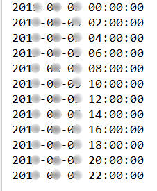

#### 2.2.3 获取当前时间段


​	刚才已经获取到了所有的时间，但是根据原型图上的效果，还需要知道当前时间是处于哪一个时间段之内。实现此效果的话，只需要**判断当前时间属于哪一个时间段**（条件时间<=当前时间<条件时间+2小时）。

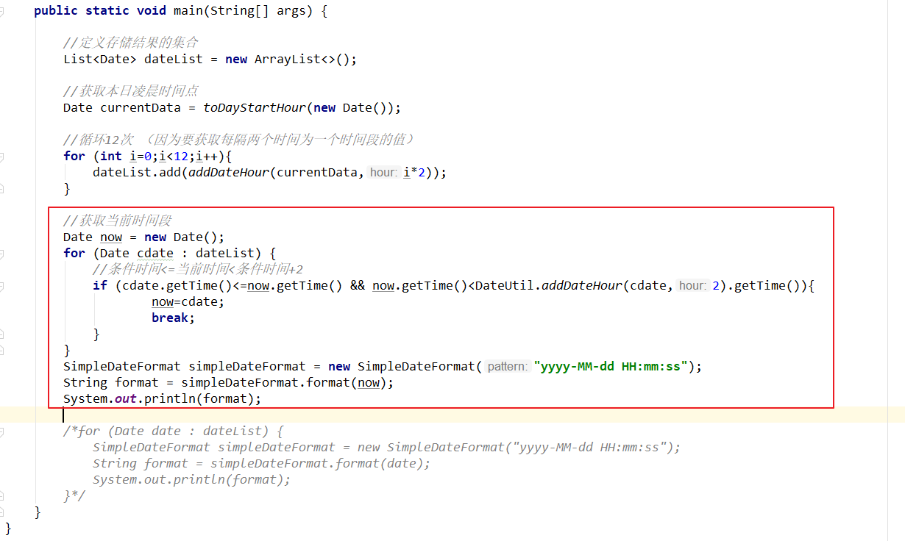

#### 2.2.4 获取时间菜单


​	根据产品原型图，可以得知，当前页面并不是要所有的时间段，而是显示当前时间段加上后四个时间段。

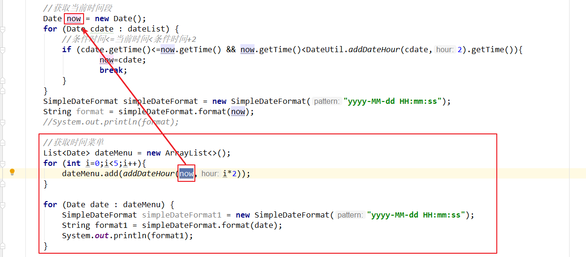


#### 2.2.5 当前业务整体流程分析

```properties
1.查询活动没结束的所有秒杀商品
	1)获取时间段集合并循环遍历出每一个时间段
	2）获取每一个时间段名称,用于后续redis中key的设置
	2)状态必须为审核通过 status=1
	3)商品库存个数>0
	4)活动没有结束  
		开始时间<=活动开始时间
		活动结束时间<开始时间+2小时
	5)排除之前已经加载到Redis缓存中的商品数据
	6)执行查询获取对应的结果集
2.将活动没有结束的秒杀商品入库
```


### 2.3 代码实现

#### 2.3.2 更改启动类，添加开启定时任务注解

```java
@EnableScheduling
```

#### 2.3.3 定义定时任务类

秒杀工程新建task包，并新建任务类SeckillGoodsPushTask

```java
/**
 * 添加秒杀秒伤定时任务
 */
@Component
public class SeckillGoodsPushTask {

    @Autowired
    private SeckillGoodsMapper seckillGoodsMapper;

    @Autowired
    private RedisTemplate redisTemplate;

    private static final String SECKILL_KEY = "SeckillGoods_";

    /**
     * 定时将秒杀商品存入redis
     * 暂定为30秒一次，正常业务为每天凌晨触发
     */
    @Scheduled(cron = "0/30 * * * * ?")
    public void loadSecKillGoodsToRedis(){

        List<Date> dateMenus = DateUtil.getDateMenus();
        for (Date dateMenu : dateMenus) {
            //每次用最好都重新new
            SimpleDateFormat simpleDateFormat = new SimpleDateFormat("yyyy-MM-dd HH:mm:ss");
            SimpleDateFormat simpleDateFormat1 = new SimpleDateFormat("yyyy-MM-dd HH:mm:ss");

            String redisExtName = DateUtil.date2Str(dateMenu);

            Example example = new Example(SeckillGoods.class);
            Example.Criteria criteria = example.createCriteria();
            criteria.andEqualTo("status","1");
            criteria.andGreaterThan("stockCount",0);
            criteria.andGreaterThanOrEqualTo("startTime",simpleDateFormat.format(dateMenu));
            criteria.andLessThan("endTime",simpleDateFormat1.format(DateUtil.addDateHour(dateMenu,2)));
            Set keys = redisTemplate.boundHashOps(SECKILL_KEY + redisExtName).keys();
            if (keys!=null && keys.size()>0){
                criteria.andNotIn("id",keys);
            }
            List<SeckillGoods> seckillGoodsList = seckillGoodsMapper.selectByExample(example);

            //添加到缓存中
            for (SeckillGoods seckillGoods : seckillGoodsList) {
                redisTemplate.boundHashOps(SECKILL_KEY + redisExtName).put(seckillGoods.getId(),seckillGoods);
            }
        }
    }
}
```

## 3 秒杀商品-首页

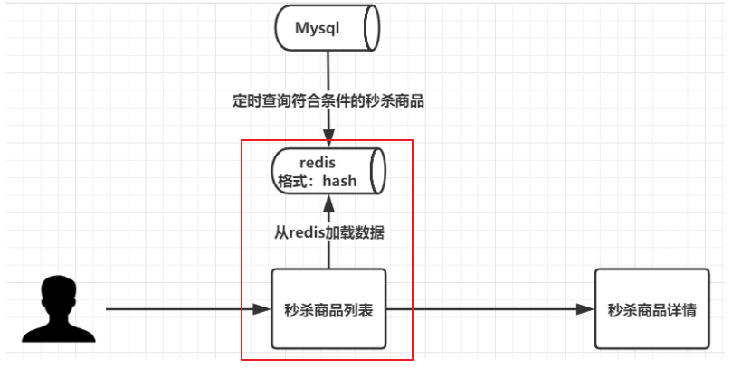

秒杀商品首页会显示处于秒杀中以及未开始秒杀的商品。

### 3.1 秒杀首页实现分析

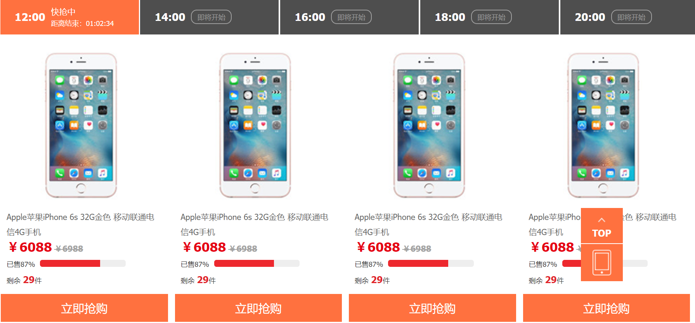

​	秒杀首页需要显示不同时间段的秒杀商品信息，然后当用户选择不同的时间段，查询该时间段下的秒杀商品，实现过程分为两大过程：

```properties
1) 加载时间菜单
2）加载时间菜单下秒杀商品信息
```

#### 3.1.1 加载时间菜单分析

​	每2个小时就会切换一次抢购活动，所以商品发布的时候，我们建议将时间定格在2小时内抢购，每次发布商品的时候，商品抢购开始时间和结束时间是这2小时的边界。

​	每2小时会有一批商品参与抢购，所以我们可以将24小时切分为12个菜单，每个菜单都是个2小时的时间段，当前选中的时间菜单需要根据当前时间判断，判断当前时间属于哪个秒杀时间段，然后将该时间段作为选中的第1个时间菜单。

#### 3.1.2 加载对应秒杀商品分析

​	进入首页时，到后台查询时间菜单信息，然后将第1个菜单的时间段作为key，在Redis中查询秒杀商品集合，并显示到页面，页面每次点击切换不同时间段菜单的时候，都将时间段传入到后台，后台根据时间段获取对应的秒杀商品集合。


### 3.2 秒杀渲染服务 - 渲染秒杀首页

#### 3.2.1 新建秒杀渲染服务

1）创建工程changgou_web_seckill,用于秒杀页面渲染

2) 添加依赖

```xml
<dependencies>
    <dependency>
        <groupId>com.changgou</groupId>
        <artifactId>changgou_service_seckill_api</artifactId>
        <version>1.0-SNAPSHOT</version>
    </dependency>
    <dependency>
        <groupId>org.springframework.boot</groupId>
        <artifactId>spring-boot-starter-thymeleaf</artifactId>
    </dependency>
</dependencies>
```

3) 添加启动类

```java
@SpringBootApplication
@EnableDiscoveryClient
@EnableFeignClients(basePackages = "com.changgou.seckill.feign")
public class WebSecKillApplication {

    public static void main(String[] args) {
        SpringApplication.run(WebSecKillApplication.class,args);
    }
}
```

4) 添加application.yml

```yml
server:
  port: 9104
eureka:
  client:
    service-url:
      defaultZone: http://127.0.0.1:6868/eureka
  instance:
    prefer-ip-address: true
feign:
  hystrix:
    enabled: true
spring:
  thymeleaf:
    cache: false
  application:
    name: seckill-web
  main:
    allow-bean-definition-overriding: true
#hystrix 配置
hystrix:
  command:
    default:
      execution:
        timeout:
          #如果enabled设置为false，则请求超时交给ribbon控制
          enabled: true
        isolation:
          strategy: SEMAPHORE
          thread:
            timeoutInMilliseconds: 60000
#请求处理的超时时间
ribbon:
  ReadTimeout: 4000
  #请求连接的超时时间
  ConnectTimeout: 3000
```

5)  添加静态化资源

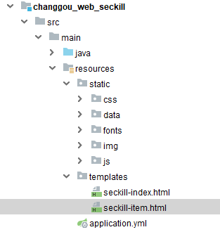


### 3.3 时间菜单实现

​	时间菜单显示，先运算出每2小时一个抢购，就需要实现12个菜单，可以先计算出每个时间的临界值，然后根据当前时间判断需要显示12个时间段菜单中的哪个菜单，再在该时间菜单的基础之上往后挪4个菜单，一直显示5个时间菜单。

#### 3.3.1 时间菜单获取

changgou_web_seckill新增控制类SecKillGoodsController

```java
/*****
     * 获取时间菜单
     */
@RequestMapping(value = "/timeMenus")
@ResponseBody
public List<String> dateMenus(){
    List<Date> dateMenus = DateUtil.getDateMenus();
    List<String> result = new ArrayList<>();

    SimpleDateFormat simpleDateFormat = new SimpleDateFormat("yyyy-MM-dd HH:mm:ss");
    for (Date dateMenu : dateMenus) {
        String format = simpleDateFormat.format(dateMenu);
        result.add(format);
    }
    return result;
}
```

#### 3.3.2 页面加载时间菜单

修改seckill-index.html

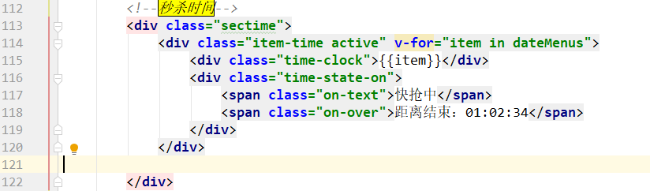

```javascript
var app = new Vue({
			el: '#app',
			data() {
				return {
					goodslist: [],
					dateMenus:[]
				}
			},
			methods:{
				loadMenus:function () {
					axios.get("/wseckill/timeMenus").then(function (response) {
						app.dateMenus=response.data;

						//查询当前时间段对应的秒杀商品
					})
				}
			},
			created:function () {
				this.loadMenus();
			}
		})
	</script>
```

效果如下：

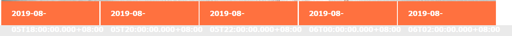

#### 3.3.3 时间格式化

上面菜单循环输出后，会出现如上图效果，时间格式全部不对，我们需要引入一个moment.min.js来格式化时间。

1）引入moment.min.js

2）添加过滤器

```javascript
//过滤器
Vue.filter("dateFilter", function(date, formatPattern){
    return moment(date).format(formatPattern || "YYYY-MM-DD HH:mm:ss");
});
```

3) 取值格式化

```html
<div class="time-clock">{{item | dateFilter('HH:mm')}}</div>
```

重新访问：http://localhost:9104/wseckill/toIndex 。时间菜单效果如下

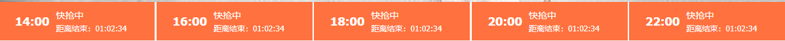


#### 3.3.4 选中实现

##### 3.3.4.1 思路分析


​	根据原型图，是让当前第一个时间菜单为选中状态，并且加载第一个菜单对应的数据。

​	我们可以先定义一个ctime=0，用来记录当前选中的菜单下标，因为默认第一个选中，第一个下标为0，所以初始值为0，每次点击对应菜单的时候，将被点击的菜单的下标值赋值给ctime,然后在每个菜单上判断，下标=ctime则让该菜单选中。

##### 3.3.4.2 代码实现

1）定义ctime=0

```js
var app = new Vue({
    el: '#app',
    data() {
        return {
            goodslist: [],
            dateMenus:[[${dateMenus}]],
            ctime:0,     //当前时间菜单选中的下标
        }
    }
})
```

2）页面样式控制：

```html
<div class="item-time " v-for="(item,index) in dateMenus" :class="['item-time',index==ctime?'active':'']" @click="ctime=index;">
				<div class="time-clock">{{item | dateFilter('HH:mm')}}</div>
				<div class="time-state-on">
					<span class="on-text" v-if="index==0">快抢中</span>
					<span class="on-over" v-if="index==0">距离结束：01:02:34</span>

					<span class="on-text" v-if="index>0">即将开始</span>
					<span class="on-over" v-if="index>0">距离开始：01:02:34</span>
				</div>
			</div>
```

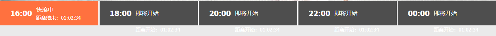


#### 3.3.5 倒计时实现


##### 3.3.5.1 倒计时实现

###### 3.3.5.1.1 基础数据显示

​	定义一个集合，用于存放五个时间段的倒计时时间差，集合中每一个角标都对应一个倒计时时间差，比如：集合角标为0，对应第一个倒计时时间差。集合角标为1，对应第二个倒计时时间差，依次类推。

​	因为要有倒计时的效果，所以后续会遍历该时间集合，并让集合中的每一个时间循环递减即可。

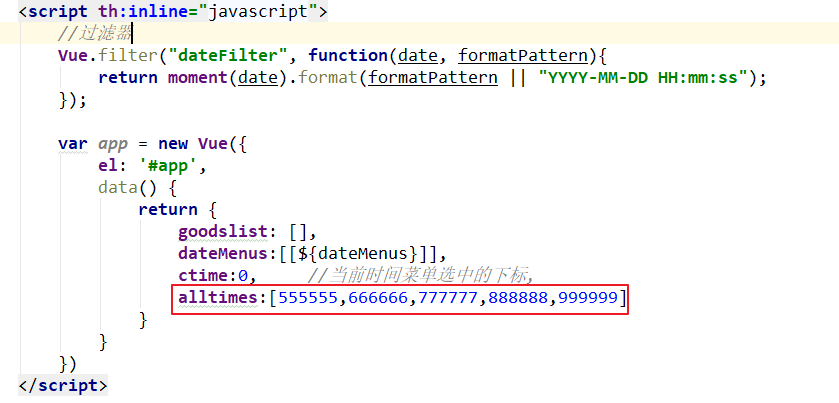

​	从该集合中获取内容，并更新倒计时时间

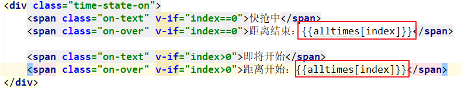

访问页面测试，效果如下所示：


###### 3.3.5.1.2  每个时间差倒计时实现

周期执行函数用法如下：

```js
window.setInterval(function(){//要做的事},1000);
```

结束执行周期函数用法如下：

```js
window.clearInterval(timers);
```

具体代码如下：

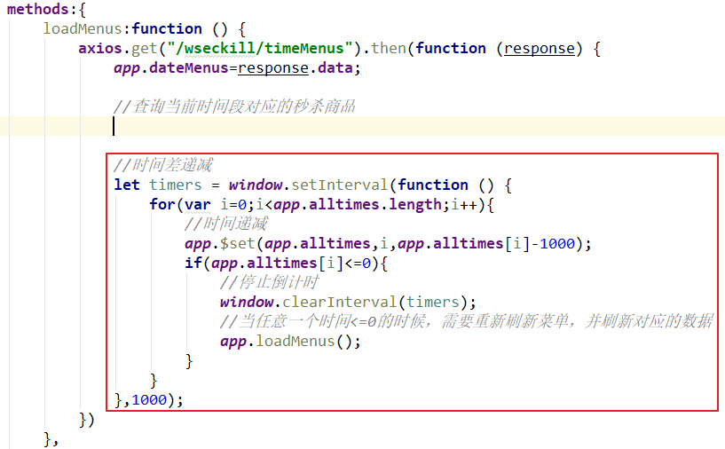

```javascript
//时间差递减
let timers = window.setInterval(function () {
    for(var i=0;i<app.alltimes.length;i++){
        //时间递减
        app.$set(app.alltimes,i,app.alltimes[i]-1000);
        if(app.alltimes[i]<=0){
            //停止倒计时
            window.clearInterval(timers);
            //当任意一个时间<=0的时候，需要重新刷新菜单，并刷新对应的数据
            app.loadMenus();
        }
    }
},1000);
```

​	测试访问：http://localhost:9104/wseckill/toIndex  。可以发现每一个时间段的时间都在每秒递减。


###### 3.3.5.1.3 倒计时时间格式化

将此工具引入页面js方法中，用于时间计算

```js
//将毫秒转换成时分秒
timedown:function(num) {
    var oneSecond = 1000;
    var oneMinute=oneSecond*60;
    var oneHour=oneMinute*60
    //小时
    var hours =Math.floor(num/oneHour);
    //分钟
    var minutes=Math.floor((num%oneHour)/oneMinute);
    //秒
    var seconds=Math.floor((num%oneMinute)/oneSecond);
    //拼接时间格式
    var str = hours+':'+minutes+':'+seconds;
    return str;
},
```

修改时间差显示设置

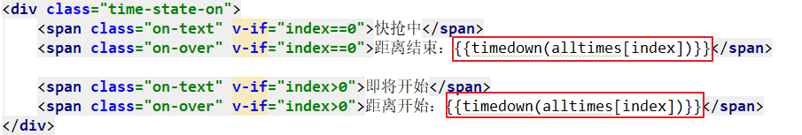

```html
<div class="time-state-on">
    <span class="on-text" v-if="index==0">快抢中</span>
    <span class="on-over" v-if="index==0">距离结束：{{timedown(alltimes[index])}}</span>

    <span class="on-text" v-if="index>0">即将开始</span>
    <span class="on-over" v-if="index>0">距离开始：{{timedown(alltimes[index])}}</span>
</div>
```

重新访问进行测试。效果如下：

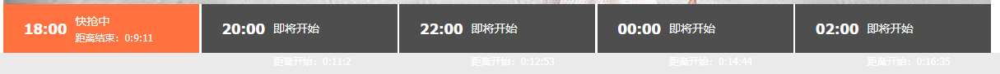


###### 3.3.5.1.4  正确倒计时时间显示

现在页面中，对于倒计时时间集合内的数据，暂时写的为假数据，现在需要让集合内容的数据是经过计算得出的。第一个是距离结束时间倒计时，后面的4个都是距离开始倒计时，每个倒计时其实就是2个时差，计算方式如下：

```properties
第1个时差：第2个抢购开始时间-当前时间，距离结束时间
第2个时差：第2个抢购开始时间-当前时间，距离开始时间
第3个时差：第3个抢购开始时间-当前时间，距离开始时间
第4个时差：第4个抢购开始时间-当前时间，距离开始时间
第5个时差：第5个抢购开始时间-当前时间，距离开始时间
```

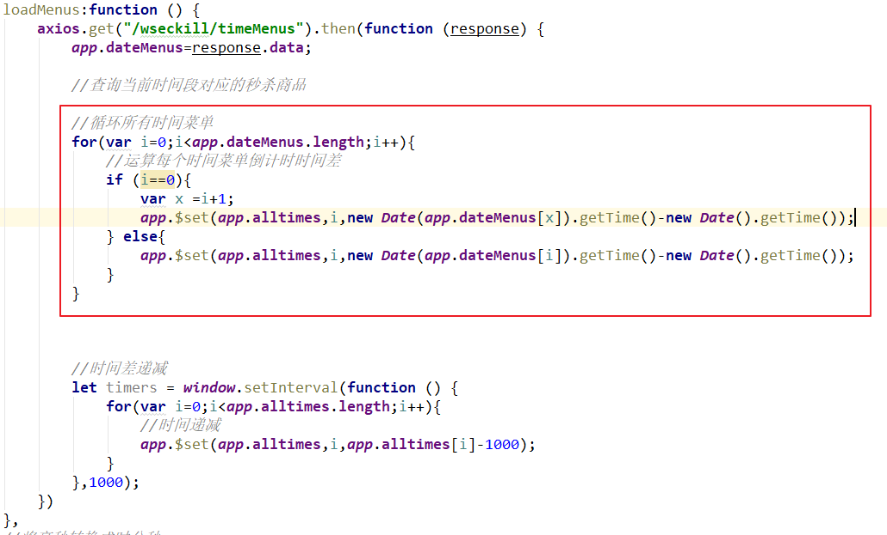

```js
loadMenus:function () {
    axios.get("/wseckill/timeMenus").then(function (response) {
        app.dateMenus=response.data;

        //查询当前时间段对应的秒杀商品

        //循环所有时间菜单
        for(var i=0;i<app.dateMenus.length;i++){
            //运算每个时间菜单倒计时时间差
            if (i==0){
                var x =i+1;
                app.$set(app.alltimes,i,new Date(app.dateMenus[x]).getTime()-new Date().getTime());
            } else{
                app.$set(app.alltimes,i,new Date(app.dateMenus[i]).getTime()-new Date().getTime());
            }
        }

        //时间差递减
        let timers = window.setInterval(function () {
            for(var i=0;i<app.alltimes.length;i++){
                //时间递减
                app.$set(app.alltimes,i,app.alltimes[i]-1000);
            }
        },1000);
    })
}
```

### 3.4 加载秒杀商品实现

当前已经完成了秒杀时间段菜单的显示，那么当用户在切换不同的时间段的时候，需要按照用户所选择的时间去显示相对应时间段下的秒杀商品

#### 3.4.1 秒杀服务-查询秒杀商品列表

##### 3.4.1.1 秒杀服务-controller

```java
@RestController
@RequestMapping("/seckill")
public class SecKillController {

    @Autowired
    private SecKillService secKillService;

    /**
     * 查询秒杀商品列表
     * @param time
     * @return
     */
    @RequestMapping("/list")
    public Result<List<SeckillGoods>> list(@RequestParam("time") String time){
        List<SeckillGoods> seckillGoodsList  = secKillService.list(time);
        return new Result<List<SeckillGoods>>(true, StatusCode.OK,"查询秒杀商品成功",seckillGoodsList);
    }
}
```

##### 3.4.1.2 秒杀服务-service&serviceImpl

```java
public interface SecKillService {
    List<SeckillGoods> list(String time);
}
```

```java
@Service
public class SecKillServiceImpl implements SecKillService {

    @Autowired
    private RedisTemplate redisTemplate;

    private static final String SECKILL_KEY = "SeckillGoods_";

    /**
     * 查询秒杀商品列表
     * @param time
     * @return
     */
    @Override
    public List<SeckillGoods> list(String time) {
        return redisTemplate.boundHashOps(SECKILL_KEY+time).values();
    }
}
```

##### 3.4.1.3 查询秒杀商品放行

更改秒杀微服务的ResourceServerConfig类，对查询方法放行

```java
@Override
public void configure(HttpSecurity http) throws Exception {
    //所有请求必须认证通过
    http.authorizeRequests()
        //下边的路径放行
        .antMatchers(
        "/seckill/list/**"). //配置地址放行
        permitAll()
        .anyRequest().
        authenticated();    //其他地址需要认证授权
}
```

##### 3.4.1.4 杀服务Api- feign接口定义

```java
@FeignClient(name="seckill")
public interface SecKillFeign {

    /**
     * 查询秒杀商品列表
     * @param time
     * @return
     */
    @RequestMapping("/seckill/list")
    public Result<List<SeckillGoods>> list(@RequestParam("time") String time);
}
```

#### 3.4.2 秒杀渲染服务-查询秒杀商品列表

##### 3.4.2.1 更新changgou_web_seckill的启动类

添加feign接口扫描

```java
@EnableFeignClients(basePackages = "com.changgou.seckill.feign")
```

##### 3.4.2.2 更新changgou_web_seckill的SecKillGoodsController

注入secKillFeign，并添加获取秒杀商品列表方法实现

```java
/**
     * 获取秒杀商品列表
     * 默认当前时间
     */
@RequestMapping("/list")
@ResponseBody
public Result<List<SeckillGoods>> list(String time){
    Result<List<SeckillGoods>> listResult = secKillFeign.list(DateUtil.formatStr(time));
    return listResult;
}
```

##### 3.4.2.3 更新secKill-index.html。添加按照时间查询方法

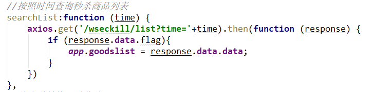

```javascript
//按照时间查询秒杀商品列表
searchList:function (time) {
    axios.get('/wseckill/list?time='+time).then(function (response) {
        if (response.data.flag){
            app.goodslist = response.data.data;
        }
    })
}
```

##### 3.4.2.4 更新secKill-index.html。 加载页面时，默认当前时间查询

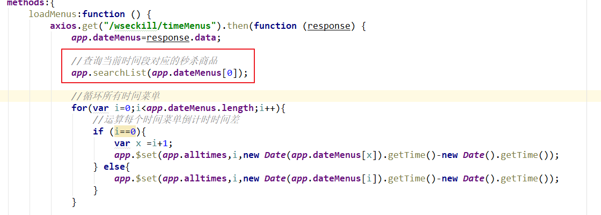

```javascript
//查询当前时间段对应的秒杀商品
app.searchList(app.dateMenus[0]);
```

##### 3.4.2.5 更新secKill-index.html。切换时间菜单,查询秒杀商品

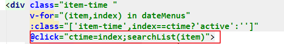

```html
<div class="item-time "
     v-for="(item,index) in dateMenus"
     :class="['item-time',index==ctime?'active':'']"
     @click="ctime=index;searchList(item)">
```

##### 3.4.2.6 更新secKill-index.html。动态显示已售进度条

```html
<div class='progress'>
    <div class='sui-progress progress-danger'>
        <span :style="'width:'+((item.num-item.stockCount)/item.num)*100+'%'" class='bar'></span>
    </div>
</div>
```

## 4 秒杀详情页

### 4.1 详情页跳转

​	跳转到详情页的时候，需要根据**商品ID**以及**商品秒杀开始时间**查询商品详情，所以每次需要将商品ID和开始时间传入到后台去，时间还需要转换成yyyyMMddHH格式，我们可以先定义一个方法，实现地址栏拼接，代码如下：

```js
//跳转商品详情， 开始时间格式：YYYYMMDDHH
targetHref:function(id){
    window.location="/wseckill/toSeckillItem?time="+moment(app.dateMenus[0]).format("YYYYMMDDHH")+"&id="+id;
}
```

页面点击**立即抢购**的时候，调用跳转方法，代码如下：

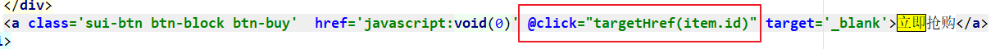

更新秒杀渲染服务controller，条件页面跳转方法

```java
/**
* 跳转秒杀商品详情
* time : 当前秒杀时间段
* id : 秒杀商品id
*/
@RequestMapping("/toSeckillItem")
public String toSeckillItem(String time, Long id, Model model){
    return "seckill-item";
}
```

效果如下：

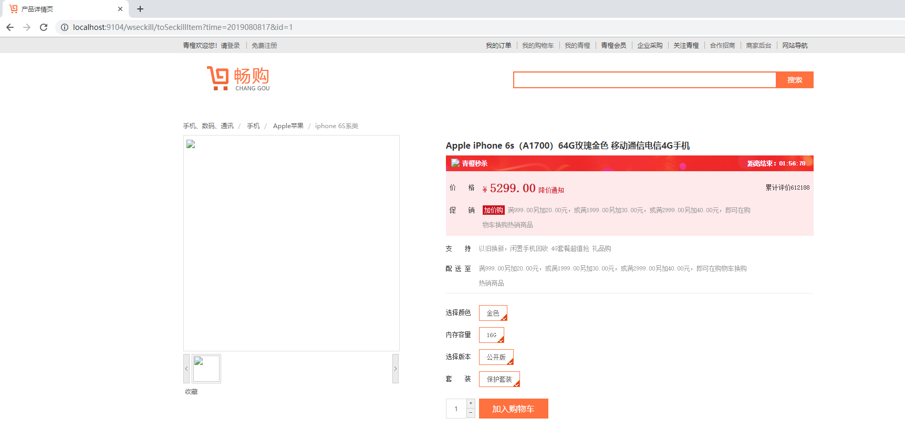

### 4.2 秒杀服务-查询秒杀商品实现

#### 4.2.1 更新秒杀服务&更新feign接口

添加查询方法

SecKillService

```java
/**
     * 查询秒杀商品信息
     * @param time 秒杀时间段
     * @param id
     * @return
     */
SeckillGoods findOne(String time,Long id);
```

SecKillServiceImpl

```java
/**
     * 查询单一秒杀商品
     * @param time
     * @param id
     * @return
     */
@Override
public SeckillGoods findOne(String time, Long id) {
    SeckillGoods seckillGoods = (SeckillGoods) redisTemplate.boundHashOps(SECKILL_KEY+time).get(id);
    return seckillGoods;
}
```

SecKillcontroller

```java
/**
* 查询单一秒杀商品
*/
@RequestMapping("/findOne")
public SeckillGoods findOne(@RequestParam("time") String time,@RequestParam("id")Long id){
    SeckillGoods seckillGoods = secKillService.findOne(time, id);
    return seckillGoods;
}
```

SecKillFeign

```java
/**
* 查询单一秒杀商品
*/
@RequestMapping("/seckill/findOne")
public SeckillGoods findOne(@RequestParam("time") String time,@RequestParam("id")Long id);
```

#### 4.2.2 更新秒杀渲染服务

```java
/**
     * 跳转秒杀商品详情
     * time : 当前秒杀时间段
     * id : 秒杀商品id
     */
    @RequestMapping("/toSeckillItem")
    public String toSeckillItem(String time, Long id, Model model){

        SeckillGoods seckillGoods = secKillFeign.findOne(time, id);
        model.addAttribute("goods",seckillGoods);

        return "seckill-item";
    }
```

### 4.3 详情页页面实现

#### 4.3.1 定义js,绑定数据

```javascript
<div class="product-info" id="app">
```

```html
<!-- 引入组件库 -->
<script src="https://cdn.jsdelivr.net/npm/vue@2.6.8/dist/vue.js"></script>
<script src="https://cdn.bootcss.com/element-ui/2.5.4/index.js"></script>
<script src="/js/axios.js"></script>
<script src="/js/moment.min.js"></script>
```

```javascript
<script th:inline="javascript">
    var app = new Vue({
        el:"#app",
        data(){
            return{
                seckillgoods:[[${goods}]]
            }
        }
    })
</script>
```

#### 4.3.2 页面元素绑定

图片：

```html
<span class="jqzoom"></span>
```

商品标题：

```html
<div class="sku-name">
    <h4>{{seckillgoods.title}}</h4>
</div>
```

商品价格和库存:

```html
<div class="summary-wrap">

    <div class="fl title">
        <i>价　　格</i>
    </div>
    <div class="fl price">
        <i>¥</i>
        <em>{{seckillgoods.costPrice}}</em>
        <span>降价通知</span>
    </div>
    <div class="fr remark">
        <i>库存</i><em>{{seckillgoods.stockCount}}</em>
    </div>
</div>
```

商品描述：

```html
<!--商品描述-->
<div id="one" class="tab-pane active">

    <div class="intro-detail" v-html="seckillgoods.introduction"> </div>
</div>
```

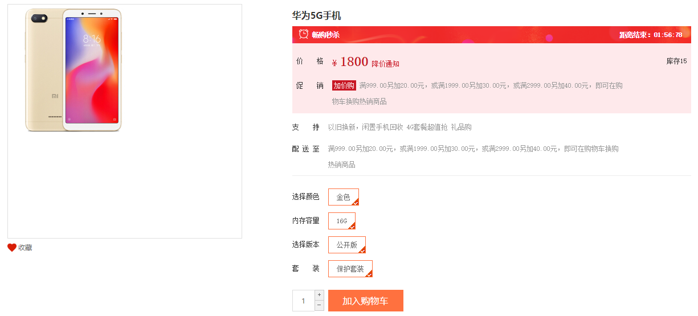

#### 4.3.3 详情页面倒计时实现

1) 跳转详情页面，携带商品开始时间与结束时间

```java
/**
     * 跳转秒杀商品详情
     * time : 当前秒杀时间段
     * id : 秒杀商品id
     */
@RequestMapping("/toSeckillItem")
public String toSeckillItem(String time, Long id, Model model){

    SeckillGoods seckillGoods = secKillFeign.findOne(time, id);
    model.addAttribute("goods",seckillGoods);

    //开始时间，结束时间
    model.addAttribute("startTime",seckillGoods.getStartTime());
    model.addAttribute("endTime",seckillGoods.getEndTime());
    return "seckill-item";
}
```

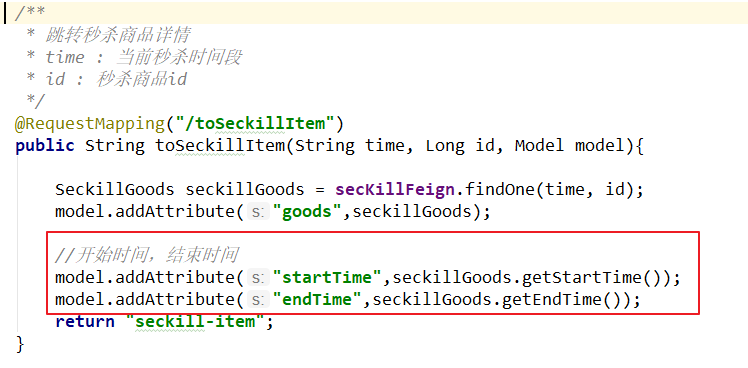

1）js中添加倒计时时间变量

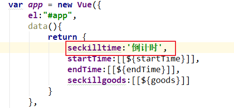

```javascript
data(){
    return {
        seckilltime:'倒计时',
        startTime:[[${startTime}]],
        endTime:[[${endTime}]],
            seckillgoods:[[${goods}]]
}
}
```

2) js添加时间转换方法

```javascript
timedown:function(num) {
    var oneSecond = 1000;
    var oneMinute=oneSecond*60;
    var oneHour=oneMinute*60
    var oneDay=oneHour*24;
    //天数
    var days =Math.floor(num/oneDay);
    //小时
    var hours =Math.floor((num%oneDay)/oneHour);
    //分钟
    var minutes=Math.floor((num%oneHour)/oneMinute);
    //秒
    var seconds=Math.floor((num%oneMinute)/oneSecond);
    //拼接时间格式
    var str = days+'天'+hours+'时'+minutes+'分'+seconds+'秒';
    return str;
}
```

3) js添加倒计时运算方法

```javascript
//倒计时运算
timeCalculate:function (starttime,endtime) {
    let starttimes = new Date(starttime).getTime();


    let endtimes = new Date(endtime).getTime();


    //提示当前是距离开始还是距离结束
    let prefix="距离结束:";

    //时间差,单位：毫秒
    let timeremain=9999999;

    //获取当前时间
    let nowtimes = new Date().getTime();


    //判断是距离开始还是距离结束
    if(starttimes>nowtimes){
        prefix="距离开始:";
    }
    timeremain=endtimes-nowtimes;

    let clock = window.setInterval(function () {
        //时间递减
        timeremain=timeremain-1000;
        //调用时间单位换算方法
        app.seckilltime =prefix + app.timedown(timeremain);

        if(timeremain<1000){
            //倒计时距离开始切换到距离结束
            if(starttimes>nowtimes){
                //停止递减
                window.clearInterval(clock);
                //再次运算
                app.timeCalculate(starttimes,endtimes);
            }else{
                //商品活动结束
                window.clearInterval(clock);
            }
        }
    },1000)
    }
```

4) 页面初始化调用倒计时运算方法

```javascript
mounted:function () {
    this.timeCalculate(this.startTime,this.endTime);
}
```

5) 页面元素绑定倒计时变量

```html
<div class="news">
    <span>畅购秒杀</span>
    <span class="overtime">{{seckilltime}}</span>
</div>
```

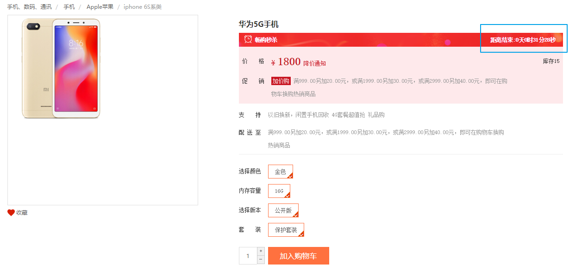

## 5 下单实现

​	用户在下单的时候，需要基于JWT令牌信息进行登陆人信息认证，确定当前订单是属于谁的。

​	并且为了提升下单速度，可以将订单数据存入redis中，如果用户支付成功，则将redis中的订单数据存入mysql中，并清空redis中的订单数据

### 5.1 秒杀服务-下单实现

**1）将tokenDecode工具类放入秒杀服务并声明Bean**
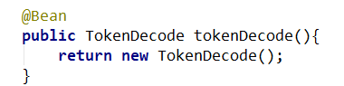

**2）更新秒杀服务启动类，添加redis配置**

```java
/**
     * 设置 redisTemplate 的序列化设置
     * @param redisConnectionFactory
     * @return
     */
@Bean
public RedisTemplate<Object, Object> redisTemplate(RedisConnectionFactory redisConnectionFactory) {
    // 1.创建 redisTemplate 模版
    RedisTemplate<Object, Object> template = new RedisTemplate<>();
    // 2.关联 redisConnectionFactory
    template.setConnectionFactory(redisConnectionFactory);
    // 3.创建 序列化类
    GenericToStringSerializer genericToStringSerializer = new GenericToStringSerializer(Object.class);
    // 6.序列化类，对象映射设置
    // 7.设置 value 的转化格式和 key 的转化格式
    template.setValueSerializer(genericToStringSerializer);
    template.setKeySerializer(new StringRedisSerializer());
    template.afterPropertiesSet();
    return template;
}
```

**2）新建下单controller并声明方法**

```java
@RestController
@CrossOrigin
@RequestMapping("/seckillorder")
public class SecKillOrderController {

    @Autowired
    private TokenDecode tokenDecode;

    @Autowired
    private SecKillOrderService secKillOrderService;

    /**
     * 秒杀下单
     * @param time 当前时间段
     * @param id 秒杀商品id
     * @return
     */
    @RequestMapping("/add")
    public Result add(@RequestParam("time") String time, @RequestParam("id") Long id){

        //获取当前登陆人
        String username = tokenDecode.getUserInfo().get("username");

        boolean result = secKillOrderService.add(id,time,username);

        if (result){
            return new Result(true, StatusCode.OK,"下单成功");
        }else{
            return new Result(false,StatusCode.ERROR,"下单失败");
        }
    }
}
```

**3) 新建service接口**

```java
public interface SecKillOrderService {
    /**
     * 秒杀下单
     * @param id 商品id
     * @param time 时间段
     * @param username 登陆人姓名
     * @return
     */
    boolean add(Long id, String time, String username);
}
```

**4）更改预加载秒杀商品**

当预加载秒杀商品的时候，提前加载每一个商品的库存信息

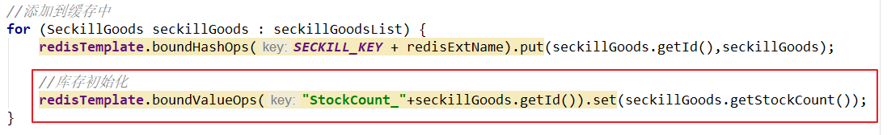

```java
//添加到缓存中
for (SeckillGoods seckillGoods : seckillGoodsList) {
    redisTemplate.boundHashOps(SECKILL_KEY + redisExtName).put(seckillGoods.getId(),seckillGoods);

    //库存初始化
  redisTemplate.boundValueOps("StockCount_"+seckillGoods.getId()).set(seckillGoods.getStockCount());
}
```

**5）页面加载秒杀商品时，替换秒杀商品库存数据来源**

更新秒杀商品查询方法实现

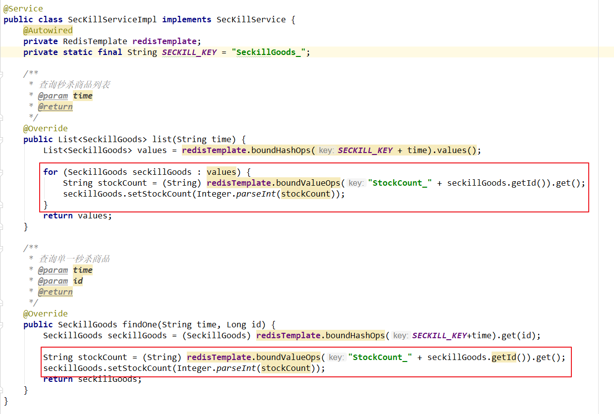

```java
@Service
public class SecKillServiceImpl implements SecKillService {
    @Autowired
    private RedisTemplate redisTemplate;
    private static final String SECKILL_KEY = "SeckillGoods_";

    /**
     * 查询秒杀商品列表
     * @param time
     * @return
     */
    @Override
    public List<SeckillGoods> list(String time) {
        List<SeckillGoods> values = redisTemplate.boundHashOps(SECKILL_KEY + time).values();

        for (SeckillGoods seckillGoods : values) {
            String stockCount = (String) redisTemplate.boundValueOps("StockCount_" + seckillGoods.getId()).get();
            seckillGoods.setStockCount(Integer.parseInt(stockCount));
        }
        return values;
    }

    /**
     * 查询单一秒杀商品
     * @param time
     * @param id
     * @return
     */
    @Override
    public SeckillGoods findOne(String time, Long id) {
        SeckillGoods seckillGoods = (SeckillGoods) redisTemplate.boundHashOps(SECKILL_KEY+time).get(id);

        String stockCount = (String) redisTemplate.boundValueOps("StockCount_" + seckillGoods.getId()).get();
        seckillGoods.setStockCount(Integer.parseInt(stockCount));
        return seckillGoods;
    }
}
```

**6）秒杀下单业务层实现**

业务逻辑：

获取秒杀商品数据与库存量数据，如果没有库存则抛出异常

扣减库存，如果扣完库存量<0，删除商品数据与库存数据

如果库存量>=0，创建秒杀订单，并存入redis

基于mq异步方式完成与mysql数据同步（最终一致性）

**注意：库存数据从redis中取出，转换成String**

```java
@Service
public class SecKillOrderServiceImpl implements SecKillOrderService {

    @Autowired
    private RedisTemplate redisTemplate;

    @Autowired
    private IdWorker idWorker;

    @Autowired
    private RabbitTemplate rabbitTemplate;

    /**
     * 秒杀下单
     * @param id 商品id
     * @param time 时间段
     * @param username 登陆人姓名
     * @return
     */
    @Override
    @Transactional
    public boolean add(Long id, String time, String username) {
        //获取商品数据
        SeckillGoods goods = (SeckillGoods) redisTemplate.boundHashOps("SeckillGoods_" + time).get(id);

        String redisStock = (String) redisTemplate.boundValueOps("StockCount_" + goods.getId()).get();
        int value=Integer.parseInt(redisStock);

        //如果没有库存，则直接抛出异常
        if(goods==null || value<=0){
            throw new RuntimeException("已售罄!");
        }

        //扣库存
        Long stockCount = redisTemplate.boundValueOps("StockCount_" + id).decrement();
        if (stockCount<0){

            //库存没了
            //删除商品信息
            redisTemplate.boundHashOps("SeckillGoods_" + time).delete(id);

            //删除对应的库存信息
            redisTemplate.delete("StockCount_" + goods.getId());

            throw new RuntimeException("已售罄!");
        }

        //有库存
        //如果有库存，则创建秒杀商品订单
        SeckillOrder seckillOrder = new SeckillOrder();
        seckillOrder.setId(idWorker.nextId());
        seckillOrder.setSeckillId(id);
        seckillOrder.setMoney(goods.getCostPrice());
        seckillOrder.setUserId(username);
        seckillOrder.setSellerId(goods.getSellerId());
        seckillOrder.setCreateTime(new Date());
        seckillOrder.setStatus("0");

        //将秒杀订单存入到Redis中
        redisTemplate.boundHashOps("SeckillOrder").put(username,seckillOrder);

        //同步mysql，基于MQ
        Map info = new HashMap();
        info.put("goodsId",id);
        info.put("stockCount",stockCount);
        rabbitTemplate.convertAndSend("","seckillorder", JSON.toJSONString(info));

        return true;
    }
}
```

**7）防止重复下单**

​	在生产场景下，很有可能会存在用户恶意刷单的情况出现。这样的操作对于系统而言，会导致业务出错、脏数据、后端访问压力大等问题的出现。

​	一般要解决这个问题的话，需要前端进行控制，同时后端也需要进行控制。后端实现可以通过Redis incrde 原子性递增来进行解决。

​	**7.1 ）更新秒杀服务下单实现**

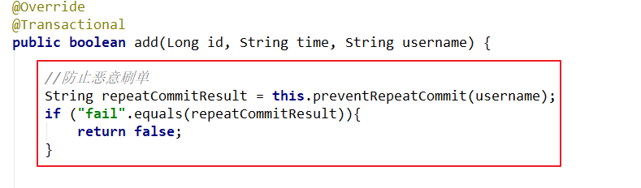

​	7.2）防重方法实现

```java
//防止重复提交
private String preventRepeatCommit(String username) {

    String redisKey = "seckill_user_" + username;
    long count = redisTemplate.opsForValue().increment(redisKey, 1);
    if (count == 1){
        //设置有效期五分钟
        redisTemplate.expire(redisKey, 5, TimeUnit.MINUTES);
        return "success";
    }

    if (count>1){
        return "fail";
    }

    return "fail";

}
```


### 5.2 秒杀服务更新库存库

**1）定义监听类**

```java
@Component
public class SecKillOrderListener {

    @Autowired
    private SecKillService secKillService;

    @RabbitListener(queues = "seckillorder")
    public void receiveSeckillOrderMessage(String message){

        Map map = JSON.parseObject(message, Map.class);
        Long id = (Long) map.get("goodsId");
        Integer stockCount = (Integer) map.get("stockCount");

        secKillService.updateSeckillStock(id,stockCount);
    }
}
```

**2）定义业务层接口与实现类**

```java
/**
     * 更改秒杀商品库存
     * @param id
     * @param stockCount
     */
void updateSeckillStock(Long id, Integer stockCount);
```

```java
/**
     * 修改秒杀商品库存
     * @param id
     * @param stockCount
     */
@Transactional
@Override
public void updateSeckillStock(Long id, Integer stockCount) {

    seckillGoodsMapper.updateSeckillStock(id, stockCount);

}
```

**3) dao层定义修改方法**

```java
public interface SeckillGoodsMapper extends Mapper<SeckillGoods> {

    @Update("update tb_seckill_goods set stock_count=#{stockCount} where id=#{id}")
    void updateSeckillStock(Long id, Integer stockCount);
}
```


### 5.2 秒杀渲染服务-下单实现

**1）定义feign接口**

```java
@FeignClient(name="seckill")
public interface SecKillOrderFeign {

    /**
     * 秒杀下单
     * @param time 当前时间段
     * @param id 秒杀商品id
     * @return
     */
    @RequestMapping("/seckillorder/add")
    public Result add(@RequestParam("time") String time, @RequestParam("id") Long id);
}
```

**2）定义controller**

```java
@Controller
@CrossOrigin
@RequestMapping("/wseckillorder")
public class SecKillOrderController {

    @Autowired
    private SecKillOrderFeign secKillOrderFeign;

    /**
     * 秒杀下单
     * @param time 当前时间段
     * @param id 秒杀商品id
     * @return
     */
    @RequestMapping("/add")
    @ResponseBody
    public Result add(String time,Long id){
        Result result = secKillOrderFeign.add(time, id);
        return result;
    }
}
```


